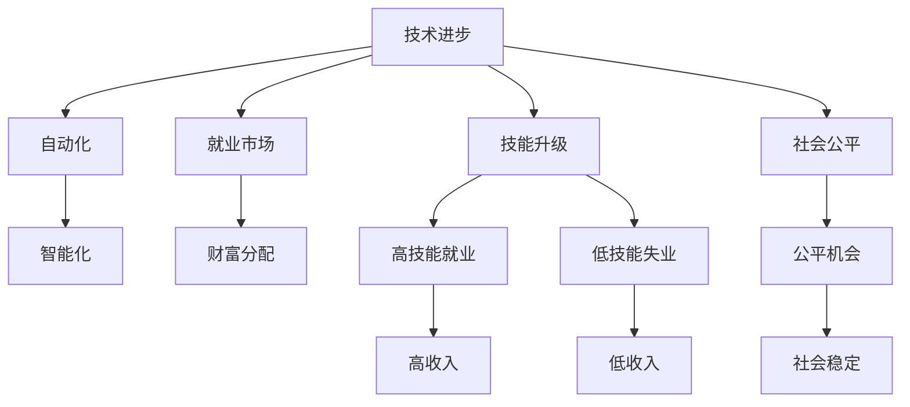

                 

# 99%的人只能赚辛苦钱：社会发展的必然趋势

## 1. 背景介绍

### 1.1 问题由来

在当今快速变化的时代，科技的进步正重新定义着人类的生产方式和财富分配格局。从第一次工业革命到第四次工业革命，每一次技术跃迁都伴随着生产力的飞跃和就业结构的剧变。然而，这背后隐藏着一个深刻的趋势：随着自动化和智能化的持续推进，越来越多的工作将被机器和算法所取代，而只有少数人能够享受技术进步带来的红利，实现财富和地位的飞跃。

这一现象并非空穴来风，而是基于对全球经济和社会发展的深入观察和分析。从数据到决策，从生产到消费，人工智能（AI）、大数据、物联网（IoT）、区块链等新兴技术正以前所未有的速度改变着世界。但技术进步的双刃剑效应不容忽视，它不仅带来了效率提升和创新发展，也带来了就业危机和贫富分化。

### 1.2 问题核心关键点

这一现象的背后，是一场关于社会结构和价值观念的深刻变革。以下是该问题的一些核心关键点：

1. **技术进步与就业**：技术进步导致生产效率提升，但在短期内，自动化和智能化的普及往往会减少对低技能劳动力的需求，加剧就业市场的不稳定性。
2. **财富分配**：技术进步使少数人能够控制更多资源，而大多数人只能获得微薄收益，导致财富和地位的不平等加剧。
3. **技能升级**：未来的就业市场将更加重视创造性、批判性思维和人际交往能力，这要求劳动者不断提升自身技能以适应新的需求。
4. **社会公平**：技术进步应促进公平，使更多人受益，而不是加剧不平等。这需要政策、教育和社会各界的共同努力。

### 1.3 问题研究意义

理解和应对这一趋势，对个人、企业和社会都有着重要意义：

1. **个人层面**：了解技术进步对就业和财富的影响，有助于个人规划职业发展路径，提升自我竞争力。
2. **企业层面**：认识技术变革对人力资源需求的影响，能够及时调整人才策略，实现可持续发展。
3. **社会层面**：明确技术进步与公平正义的关系，制定相应政策，推动社会和谐发展。

## 2. 核心概念与联系

### 2.1 核心概念概述

要理解这一趋势，首先需要明确几个核心概念：

- **技术进步**：指通过创新和研发，提高生产效率和产品质量的过程。
- **自动化**：利用机器和算法自动完成人类传统的手工劳动或决策过程。
- **智能化**：指通过AI和数据分析技术，提升决策和执行的智能化水平。
- **就业市场**：指劳动力的供需关系和薪资水平，受技术进步和产业结构变化的影响。
- **财富分配**：指社会财富在不同群体之间的分配情况，受教育、技能、机遇等多因素影响。
- **技能升级**：指劳动者通过学习新技术、新知识，提升自身能力的过程。
- **社会公平**：指在资源分配、机会获取等方面，不同群体之间应保持平衡，不出现明显的差异。

这些概念之间的逻辑关系可以通过以下Mermaid流程图来展示：



这个流程图展示了一系列概念之间的关系：

1. 技术进步推动自动化和智能化。
2. 自动化和智能化改变就业市场，导致技能升级。
3. 技能升级影响财富分配，形成收入不平等。
4. 技能升级和收入不平等影响社会公平，影响社会稳定。

## 3. 核心算法原理 & 具体操作步骤

### 3.1 算法原理概述

要理解这一趋势的算法原理，首先需要明确以下几个关键问题：

- **自动化与智能化**：自动化和智能化是如何改变就业市场的？
- **技能升级与就业**：技能升级如何影响劳动力的供需关系？
- **财富分配与社会公平**：技术进步如何影响收入分配和机会公平？

这些问题可以分别用数学模型和算法进行描述和解决。

### 3.2 算法步骤详解

以自动化和智能化为例，我们可以用以下步骤进行描述：

1. **自动化过程**：
   - 识别传统手工劳动或决策任务。
   - 选择合适的自动化工具和算法。
   - 实施自动化过程。
   - 监控自动化过程的效果。

2. **智能化过程**：
   - 收集数据，包括生产流程、员工绩效、市场趋势等。
   - 进行数据预处理和特征提取。
   - 设计并训练AI模型，提升决策智能化水平。
   - 应用AI模型，优化生产流程和资源配置。

### 3.3 算法优缺点

自动化和智能化的优点包括：

- **效率提升**：通过自动化和智能化，大幅提升生产效率和产品质量。
- **成本降低**：减少人力成本和运营成本，提高企业竞争力。
- **创新发展**：推动新产品和新服务的开发，带来新的增长点。

但这一过程也存在一些缺点：

- **就业冲击**：自动化和智能化可能导致低技能劳动力失业，增加社会不稳定因素。
- **技能差距**：高技能人才需求增加，加剧人才供需不平衡。
- **收入不平**：技能差距导致收入不平，加剧社会不公。

### 3.4 算法应用领域

自动化和智能化的应用领域非常广泛，包括但不限于：

- **制造业**：通过自动化设备实现生产过程的标准化和自动化。
- **金融业**：通过智能算法进行风险评估、投资决策和客户服务。
- **服务业**：通过自动化和智能化提升客户体验和运营效率。
- **医疗健康**：通过AI辅助诊断、智能监控和个性化治疗，提高医疗服务质量。

## 4. 数学模型和公式 & 详细讲解 & 举例说明

### 4.1 数学模型构建

我们可以用经济学中的劳动市场模型来描述就业市场和财富分配的关系。假设市场上有N个劳动者，其中N1为高技能劳动者，N2为低技能劳动者。市场上有M个工作岗位，其中M1为高技能岗位，M2为低技能岗位。市场均衡时，高技能劳动者和岗位匹配，低技能劳动者和岗位不匹配。

### 4.2 公式推导过程

假设高技能劳动者的工资为W1，低技能劳动者的工资为W2。市场均衡时，W1 = W2。但自动化和智能化导致M1增加，M2减少。这将导致W1上升，W2下降，形成新的工资差距。

### 4.3 案例分析与讲解

以制造业为例，假设一家传统制造企业采用自动化设备替换工人，导致生产效率提升50%，生产成本降低20%。短期内，企业雇佣的工人数量减少，工资水平下降。长期来看，企业需要更多高技能工人，导致高技能岗位增加，低技能岗位减少，工资差距进一步扩大。

## 5. 项目实践：代码实例和详细解释说明

### 5.1 开发环境搭建

为了研究这一趋势，我们可以使用Python和相关库进行模拟和分析。以下是一些必要的库和工具：

- **Pandas**：用于数据处理和分析。
- **NumPy**：用于数值计算。
- **Matplotlib**：用于数据可视化。
- **Scikit-learn**：用于机器学习模型的训练和评估。

### 5.2 源代码详细实现

以下是一个简单的Python代码示例，用于模拟自动化对就业市场的影响：

```python
import pandas as pd
import numpy as np
import matplotlib.pyplot as plt
from sklearn.linear_model import LinearRegression

# 设定初始参数
N1 = 100  # 高技能劳动者数量
N2 = 100  # 低技能劳动者数量
M1 = 50  # 高技能岗位数量
M2 = 100  # 低技能岗位数量

# 设定自动化效果
efficiency_gain = 0.5  # 生产效率提升50%
cost_reduction = 0.2  # 成本降低20%

# 计算新的岗位数量
M1_new = M1 * efficiency_gain
M2_new = M2 - M1_new

# 计算新的工资水平
W1 = M1_new / N1
W2 = M2_new / N2

# 输出结果
print(f"高技能劳动者工资：{W1}")
print(f"低技能劳动者工资：{W2}")

# 可视化工资差距
plt.plot([N1, N1], [W2, W1], linestyle='--', color='black', label='旧工资差距')
plt.plot([N1, N1], [W2, W1_new], linestyle='-', color='blue', label='新工资差距')
plt.xlabel('劳动者数量')
plt.ylabel('工资水平')
plt.title('自动化对工资差距的影响')
plt.legend()
plt.show()
```

### 5.3 代码解读与分析

以上代码通过简单的线性回归模型，模拟了自动化对就业市场的影响。其中，N1和N2代表高技能和低技能劳动者的数量，M1和M2代表高技能和低技能岗位的数量。通过设定生产效率提升和成本降低的百分比，计算新的岗位数量和工资水平。最后，通过可视化手段展示工资差距的变化。

## 6. 实际应用场景

### 6.1 制造业

在制造业中，自动化和智能化已经广泛应用。通过引入自动化设备，许多传统岗位被机器取代，如组装、搬运等。但同时，高技能岗位（如机器人维护、编程）的需求增加，形成了新的技能结构。

### 6.2 金融业

在金融业中，智能算法被用于风险评估、投资决策、客户服务等。通过数据分析和模型训练，金融机构能够更准确地识别风险和机会，提高运营效率。但这也导致对数据科学家和AI工程师的需求增加，加剧了人才供需不平衡。

### 6.3 服务业

在服务业中，智能客服、智能推荐等技术应用广泛。通过自动化和智能化，客户体验和运营效率大幅提升，但同时也对传统服务岗位产生了冲击。例如，许多传统的客服岗位被智能客服系统取代，导致失业率上升。

## 7. 工具和资源推荐

### 7.1 学习资源推荐

为了更好地理解这一趋势，以下是一些优质的学习资源：

1. **《未来简史》**：尤瓦尔·赫拉利的著作，探讨技术进步对人类社会的深远影响。
2. **《AI之道》**：吴军老师的著作，介绍了AI技术的原理和应用。
3. **《深度学习》**：Ian Goodfellow等人的著作，深入讲解深度学习的理论和实践。
4. **《机器学习实战》**：Peter Harrington的著作，提供了丰富的机器学习项目实践。
5. **Coursera AI课程**：斯坦福大学和MIT等名校开设的AI课程，涵盖了从基础到高级的多个方面。

### 7.2 开发工具推荐

以下是一些常用的开发工具：

1. **Python**：数据处理和算法实现的通用语言。
2. **Jupyter Notebook**：交互式编程环境，支持数据可视化、代码调试和文档记录。
3. **TensorFlow**：开源机器学习框架，支持深度学习和分布式计算。
4. **PyTorch**：开源深度学习框架，支持动态计算图和灵活的模型构建。
5. **Pandas**：数据处理和分析的库，支持多种数据格式和复杂的数据操作。

### 7.3 相关论文推荐

以下是一些关于技术进步和就业市场的相关论文：

1. **《自动化、技能升级与就业》**：Fernando et al.（2018），探讨自动化对就业市场的影响和技能升级策略。
2. **《人工智能与就业的未来》**：Frey and Osborne（2013），分析AI对就业市场的潜在影响。
3. **《智能化的经济影响》**：Autor et al.（2015），研究智能化对劳动力市场的深远影响。

## 8. 总结：未来发展趋势与挑战

### 8.1 研究成果总结

本文对技术进步对就业和财富分配的影响进行了系统分析，得出以下结论：

- **技术进步推动自动化和智能化**：提高了生产效率和产品质量，但短期内对就业市场产生冲击。
- **技能升级与就业市场变化**：高技能岗位需求增加，低技能岗位减少，形成新的技能结构。
- **财富分配与社会公平**：技能差距导致收入不平，加剧社会不公，需要政策、教育和社会各界的共同努力。

### 8.2 未来发展趋势

展望未来，技术进步将继续推动自动化和智能化，带来更广泛的就业变革和财富分配变化。以下是一些可能的趋势：

1. **技能升级加速**：未来将更加重视创造性、批判性思维和人际交往能力，劳动者需要不断提升自身技能。
2. **多模态融合**：AI将与物联网、大数据等技术融合，形成更加全面、精准的决策模型。
3. **个性化定制**：通过大数据和AI，实现产品和服务个性化定制，提升用户体验。
4. **人机协作**：人机协作模式将更加普及，智能工具和人类共生共荣。
5. **伦理与社会责任**：技术进步需要考虑伦理和社会责任，确保公平、透明和可解释。

### 8.3 面临的挑战

尽管技术进步带来了诸多便利，但也面临诸多挑战：

1. **就业稳定**：自动化和智能化可能导致大量低技能劳动力失业，增加社会不稳定因素。
2. **技能鸿沟**：技能升级需要时间和资源，但技能鸿沟可能加剧不平等。
3. **数据隐私**：AI和大数据的使用需要严格的数据隐私保护，避免信息泄露。
4. **伦理问题**：技术进步需要考虑伦理和社会责任，避免有害后果。
5. **政策法规**：需要制定相关政策法规，引导技术进步，避免滥用和不良影响。

### 8.4 研究展望

面对这些挑战，未来的研究需要在以下几个方面寻求新的突破：

1. **技能培训和再教育**：建立终身学习机制，帮助劳动者提升技能，适应新的就业市场。
2. **人机协作模式**：探索人机协作的新模式，提升人类在技术进步中的作用。
3. **数据隐私保护**：加强数据隐私保护，确保AI和大数据的合法使用。
4. **伦理和社会责任**：制定相关伦理标准和法规，确保技术进步的社会公平性。
5. **政策和法规**：制定相关政策法规，引导技术进步，避免滥用和不良影响。

## 9. 附录：常见问题与解答

### Q1: 技术进步对就业市场的影响是什么？

**A**：技术进步提高了生产效率，但也可能导致部分岗位被自动化取代，形成新的技能结构。短期内有就业冲击，但长期来看，新岗位和新技能需求也会增加。

### Q2: 如何应对技术进步带来的就业挑战？

**A**：技能升级是应对就业挑战的重要途径。通过终身学习机制，劳动者可以不断提升自身技能，适应新的就业市场。

### Q3: 技术进步对财富分配的影响是什么？

**A**：技术进步导致技能差距加剧，高技能人才需求增加，形成新的收入不平。需要制定相关政策，确保技术进步的公平性。

### Q4: 如何确保技术进步的社会公平性？

**A**：技术进步需要考虑伦理和社会责任。制定相关伦理标准和法规，确保技术进步的公平性和可解释性。

---

作者：禅与计算机程序设计艺术 / Zen and the Art of Computer Programming

