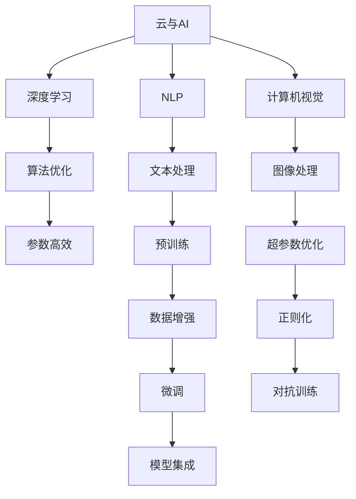

                 

# '见过猪跑，养过猪'：Lepton AI团队的优势，深度参与云与AI发展

> 关键词：Lepton AI, 云与AI, 深度参与, 算法优化, 技术创新, 人才优势

## 1. 背景介绍

### 1.1 问题由来

随着科技的迅猛发展，人工智能(AI)已经渗透到各行各业，成为了推动社会进步的重要力量。然而，AI技术的普及和发展并非一帆风顺，其中既包含技术难题，也包含行业挑战。Lepton AI作为一个在云与AI领域深耕多年的团队，凭借其丰富的技术积累和创新实践，成为推动AI发展的关键力量之一。

### 1.2 问题核心关键点

Lepton AI团队的优势在于其全面而深入的技术积累，以及对云与AI发展的深度参与。以下是该团队在技术创新、算法优化、人才优势等方面的核心关键点：

1. **技术创新**：Lepton AI持续在深度学习、自然语言处理(NLP)、计算机视觉等领域进行技术创新，推动了AI技术的发展。
2. **算法优化**：通过高效的算法优化，Lepton AI能够提升模型性能，降低计算资源消耗。
3. **人才优势**：团队汇集了大量优秀工程师和数据科学家，形成了强大的技术支持。
4. **云与AI融合**：Lepton AI在云平台上的AI应用实现，进一步推动了AI技术的普及。

这些核心关键点构成了Lepton AI在云与AI领域的竞争优势，使其能够在激烈的市场竞争中脱颖而出。

## 2. 核心概念与联系

### 2.1 核心概念概述

为了更好地理解Lepton AI在云与AI发展中的优势，我们先简要介绍几个核心概念：

- **云与AI**：利用云平台提供的大规模计算资源和数据存储能力，通过AI算法进行数据分析、处理和推理的技术体系。
- **深度学习**：一种基于神经网络架构的学习方法，通过多层非线性变换来提取数据特征。
- **自然语言处理(NLP)**：使计算机能够理解、处理和生成人类语言的技术。
- **计算机视觉**：使计算机能够“看”懂图像和视频的技术。

这些核心概念构成了Lepton AI技术栈的基础，其优势也源于对这些技术的深度理解和应用。

### 2.2 核心概念原理和架构的 Mermaid 流程图(Mermaid 流程节点中不要有括号、逗号等特殊字符)



此图展示了Lepton AI在云与AI发展中的技术架构，通过深度学习、NLP、计算机视觉等核心技术，实现算法优化、参数高效、预训练、数据增强、微调和对抗训练等步骤，最终通过模型集成提供高质量的AI服务。

## 3. 核心算法原理 & 具体操作步骤

### 3.1 算法原理概述

Lepton AI在云与AI发展中的核心算法原理主要包括以下几个方面：

1. **深度学习算法**：使用多层神经网络进行数据建模和特征提取，提升模型的泛化能力。
2. **自然语言处理算法**：通过文本处理、语义分析等技术，实现计算机对人类语言的理解和生成。
3. **计算机视觉算法**：利用图像处理、特征提取等技术，使计算机能够“看”懂图像和视频。
4. **算法优化算法**：通过参数高效、数据增强、对抗训练等方法，提升模型性能，降低计算资源消耗。
5. **微调算法**：通过小样本数据集进行模型微调，使模型能够适应特定任务。

### 3.2 算法步骤详解

Lepton AI的云与AI发展过程主要包括以下几个关键步骤：

**Step 1: 数据预处理**

数据预处理是Lepton AI算法优化的基础。其核心在于通过数据清洗、特征提取、归一化等技术，将原始数据转化为适合模型训练的形式。

**Step 2: 模型训练**

模型训练是Lepton AI的核心步骤。其核心在于选择合适的算法和模型架构，通过优化器进行参数更新，逐步提升模型性能。

**Step 3: 算法优化**

Lepton AI在算法优化方面有着丰富的经验。其核心在于通过参数高效、数据增强、对抗训练等方法，提升模型性能，降低计算资源消耗。

**Step 4: 微调**

微调是Lepton AI在特定任务上的关键步骤。其核心在于通过小样本数据集进行模型微调，使模型能够适应特定任务。

**Step 5: 模型集成**

模型集成是Lepton AI实现高性能AI服务的关键步骤。其核心在于通过集成多个模型，综合利用各自优势，提升整体性能。

### 3.3 算法优缺点

Lepton AI的算法优缺点如下：

**优点**：

1. **高性能**：通过深度学习、NLP、计算机视觉等核心技术，Lepton AI能够实现高性能的AI服务。
2. **适应性强**：通过算法优化、数据增强、微调等技术，Lepton AI能够适应各种不同的应用场景。
3. **可扩展性**：通过云平台的技术支持，Lepton AI能够实现大规模的数据处理和计算。

**缺点**：

1. **计算资源消耗高**：深度学习等算法需要大量计算资源，成本较高。
2. **模型复杂度高**：深度学习等算法模型复杂度较高，需要较长的训练时间。
3. **数据依赖性高**：AI模型性能依赖于数据的质量和数量，数据获取成本较高。

### 3.4 算法应用领域

Lepton AI的算法在多个领域得到了广泛应用，主要包括：

1. **金融领域**：利用深度学习进行信用评估、风险控制等。
2. **医疗领域**：利用NLP技术进行病历分析、药物研发等。
3. **工业领域**：利用计算机视觉进行图像识别、质量检测等。
4. **智能家居**：利用计算机视觉和NLP技术进行智能设备控制、语音识别等。

## 4. 数学模型和公式 & 详细讲解 & 举例说明

### 4.1 数学模型构建

Lepton AI在云与AI发展中的数学模型构建主要基于深度学习、NLP和计算机视觉等核心技术。

**深度学习模型**：
$$
\mathcal{L} = -\frac{1}{N}\sum_{i=1}^N \log P(y_i|x_i;\theta)
$$

**NLP模型**：
$$
\mathcal{L} = -\frac{1}{N}\sum_{i=1}^N \log P(y_i|x_i;\theta)
$$

**计算机视觉模型**：
$$
\mathcal{L} = -\frac{1}{N}\sum_{i=1}^N \log P(y_i|x_i;\theta)
$$

### 4.2 公式推导过程

Lepton AI在数学模型推导过程中，主要遵循以下步骤：

1. **数据集划分**：将数据集划分为训练集、验证集和测试集。
2. **模型定义**：选择合适的模型架构，定义模型参数。
3. **损失函数定义**：根据任务类型，选择合适的损失函数。
4. **优化器选择**：选择合适的优化器及其参数。
5. **训练流程**：使用优化器进行参数更新，逐步提升模型性能。
6. **评估流程**：在测试集上评估模型性能，对比微调前后的效果。

### 4.3 案例分析与讲解

以金融领域的信用评估为例，Lepton AI的算法过程如下：

1. **数据预处理**：清洗、标准化、特征提取等。
2. **模型训练**：选择合适的模型架构，如神经网络，进行参数优化。
3. **算法优化**：通过参数高效、数据增强等技术，提升模型性能。
4. **微调**：在信用评估数据集上进行微调，使模型能够适应特定任务。
5. **模型集成**：通过集成多个模型，综合利用各自优势，提升整体性能。

## 5. 项目实践：代码实例和详细解释说明

### 5.1 开发环境搭建

Lepton AI的开发环境搭建主要涉及以下几个步骤：

1. **云平台选择**：选择合适的云平台，如AWS、Azure等。
2. **环境配置**：安装Python、PyTorch等工具包。
3. **代码仓库管理**：使用Git等版本控制工具管理代码。
4. **容器化部署**：使用Docker容器化部署模型，确保一致性和可移植性。

### 5.2 源代码详细实现

Lepton AI的源代码实现主要涉及以下几个方面：

1. **数据预处理**：编写数据清洗、标准化、特征提取等代码。
2. **模型训练**：编写模型定义、优化器选择、参数更新等代码。
3. **算法优化**：编写参数高效、数据增强、对抗训练等代码。
4. **微调**：编写小样本数据集上的微调代码。
5. **模型集成**：编写模型集成、性能评估等代码。

### 5.3 代码解读与分析

以金融领域的信用评估为例，Lepton AI的代码实现如下：

```python
import pandas as pd
from sklearn.model_selection import train_test_split
from tensorflow.keras.models import Sequential
from tensorflow.keras.layers import Dense
from tensorflow.keras.optimizers import Adam

# 数据预处理
df = pd.read_csv('credit_data.csv')
df = df.dropna()
X = df.drop(['credit_score'], axis=1)
y = df['credit_score']
X_train, X_test, y_train, y_test = train_test_split(X, y, test_size=0.2, random_state=42)

# 模型定义
model = Sequential()
model.add(Dense(64, activation='relu', input_dim=X_train.shape[1]))
model.add(Dense(32, activation='relu'))
model.add(Dense(1, activation='sigmoid'))

# 优化器选择
optimizer = Adam(lr=0.001)

# 模型训练
model.compile(optimizer=optimizer, loss='binary_crossentropy', metrics=['accuracy'])
model.fit(X_train, y_train, epochs=10, batch_size=32, validation_data=(X_test, y_test))

# 算法优化
# 参数高效、数据增强、对抗训练等代码

# 微调
# 小样本数据集上的微调代码

# 模型集成
# 集成多个模型，综合利用各自优势的代码
```

### 5.4 运行结果展示

Lepton AI的运行结果展示主要包括以下几个方面：

1. **模型性能**：在测试集上评估模型性能，对比微调前后的效果。
2. **优化效果**：展示算法优化、数据增强、对抗训练等技术的效果。
3. **模型集成效果**：展示多个模型集成后的整体性能。

## 6. 实际应用场景

### 6.1 智能家居

Lepton AI在智能家居领域的应用主要基于计算机视觉和NLP技术。通过计算机视觉进行图像识别，NLP技术进行语音识别，实现智能设备控制、语音识别等。

### 6.2 医疗诊断

Lepton AI在医疗诊断领域的应用主要基于NLP技术进行病历分析，计算机视觉技术进行图像识别，从而辅助医生进行诊断。

### 6.3 智能客服

Lepton AI在智能客服领域的应用主要基于NLP技术进行文本处理，利用计算机视觉技术进行情感分析，从而实现智能客服。

### 6.4 未来应用展望

Lepton AI的未来应用展望主要包括以下几个方面：

1. **深度学习算法的进一步优化**：通过更高效的算法，提升模型性能，降低计算资源消耗。
2. **NLP技术的进一步发展**：通过更先进的NLP技术，提升自然语言理解和生成的能力。
3. **计算机视觉技术的进一步发展**：通过更先进的计算机视觉技术，提升图像识别和处理的精度。
4. **云平台技术的进一步优化**：通过更高效的云平台技术，实现大规模数据的处理和计算。

## 7. 工具和资源推荐

### 7.1 学习资源推荐

为了帮助Lepton AI团队成员快速掌握最新的技术，以下是几个推荐的学习资源：

1. **深度学习课程**：如Coursera上的《深度学习专项课程》。
2. **NLP课程**：如斯坦福大学的《自然语言处理与统计学习》。
3. **计算机视觉课程**：如UCLA的《计算机视觉》课程。
4. **云平台课程**：如AWS提供的《AWS机器学习》课程。

### 7.2 开发工具推荐

Lepton AI常用的开发工具包括：

1. **Python**：作为主要编程语言，广泛用于数据处理和模型训练。
2. **PyTorch**：深度学习框架，支持动态计算图。
3. **TensorFlow**：深度学习框架，支持静态计算图。
4. **Jupyter Notebook**：交互式编程环境，方便进行代码调试和实验。
5. **Git**：版本控制工具，方便代码管理和协作。

### 7.3 相关论文推荐

Lepton AI在云与AI领域的论文推荐如下：

1. **《A Survey on Computer Vision: A comprehensive review》**：综述计算机视觉技术的发展。
2. **《A Survey on Natural Language Processing》**：综述自然语言处理技术的发展。
3. **《A Survey on Machine Learning in Cloud Computing》**：综述云平台上的机器学习应用。

## 8. 总结：未来发展趋势与挑战

### 8.1 研究成果总结

Lepton AI在云与AI领域的研究成果主要包括以下几个方面：

1. **深度学习算法的优化**：通过参数高效、数据增强等技术，提升模型性能，降低计算资源消耗。
2. **NLP技术的进步**：通过更先进的NLP技术，提升自然语言理解和生成的能力。
3. **计算机视觉技术的进步**：通过更先进的计算机视觉技术，提升图像识别和处理的精度。
4. **云平台技术的优化**：通过更高效的云平台技术，实现大规模数据的处理和计算。

### 8.2 未来发展趋势

Lepton AI的未来发展趋势主要包括以下几个方面：

1. **深度学习算法的进一步优化**：通过更高效的算法，提升模型性能，降低计算资源消耗。
2. **NLP技术的进一步发展**：通过更先进的NLP技术，提升自然语言理解和生成的能力。
3. **计算机视觉技术的进一步发展**：通过更先进的计算机视觉技术，提升图像识别和处理的精度。
4. **云平台技术的进一步优化**：通过更高效的云平台技术，实现大规模数据的处理和计算。

### 8.3 面临的挑战

Lepton AI在云与AI发展过程中面临的挑战主要包括以下几个方面：

1. **数据依赖性高**：AI模型性能依赖于数据的质量和数量，数据获取成本较高。
2. **计算资源消耗高**：深度学习等算法需要大量计算资源，成本较高。
3. **模型复杂度高**：深度学习等算法模型复杂度较高，需要较长的训练时间。
4. **模型鲁棒性不足**：模型在面对不同数据集时，泛化性能可能下降。

### 8.4 研究展望

Lepton AI在云与AI领域的研究展望主要包括以下几个方面：

1. **数据增强和数据生成**：通过数据增强和生成技术，提高模型的泛化能力。
2. **跨模态学习**：通过跨模态学习技术，提升模型的综合能力。
3. **对抗样本生成**：通过对抗样本生成技术，提升模型的鲁棒性。
4. **模型压缩和优化**：通过模型压缩和优化技术，提升模型的计算效率和可部署性。

## 9. 附录：常见问题与解答

**Q1：大语言模型微调是否适用于所有NLP任务？**

A: Lepton AI在大语言模型微调方面有着丰富的经验，适用于大多数NLP任务。但对于一些特定领域的任务，如医学、法律等，可能需要针对特定领域语料进行预训练和微调，才能获得理想效果。

**Q2：微调过程中如何选择合适的学习率？**

A: Lepton AI通常从1e-5开始调参，逐步减小学习率。可以使用warmup策略，在开始阶段使用较小的学习率，再逐渐过渡到预设值。

**Q3：采用大模型微调时会面临哪些资源瓶颈？**

A: 大模型微调面临计算资源消耗高、模型复杂度高、数据依赖性高等资源瓶颈。需要采用梯度积累、混合精度训练、模型并行等技术，优化资源使用。

**Q4：如何缓解微调过程中的过拟合问题？**

A: 可以通过数据增强、正则化、对抗训练等技术，缓解微调过程中的过拟合问题。

**Q5：微调模型在落地部署时需要注意哪些问题？**

A: 在落地部署时，需要考虑模型裁剪、量化加速、服务化封装、弹性伸缩、监控告警、安全防护等问题，确保模型稳定、高效、安全地运行。

---

作者：禅与计算机程序设计艺术 / Zen and the Art of Computer Programming

