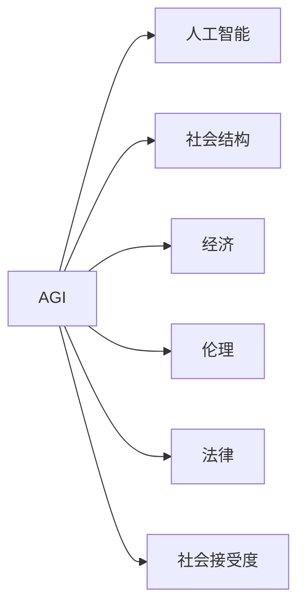

                 

# AGI对社会结构的潜在影响探讨

> 关键词：

## 1. 背景介绍

### 1.1 问题由来

在人工智能(AI)不断发展的过程中，其影响已不仅仅局限于技术层面，而是逐步渗透到社会结构、经济、伦理、就业等多个方面。尤其是当AGI(Artificial General Intelligence，通用人工智能)成为可能时，其对社会结构的潜在影响引起了广泛关注。AGI是指能够执行任何智能任务的AI系统，其智能化程度远超现有AI系统，能够理解自然语言，进行复杂推理和决策。

AGI的潜力巨大，但其带来的挑战和风险也同样不容忽视。因此，本文将探讨AGI对社会结构的潜在影响，以及如何通过技术、伦理和社会多维度协作，确保AGI健康发展，为社会带来更多福祉。

### 1.2 问题核心关键点

- AGI的定义和能力边界
- AGI对社会结构、经济、就业等方面的潜在影响
- AGI发展面临的技术、伦理、法律和社会挑战
- AGI对人类社会发展的潜在机遇与风险
- AGI对劳动力市场、知识传播、创新驱动等的影响
- 社会对AGI的适应、接受和整合策略

## 2. 核心概念与联系

### 2.1 核心概念概述

为更好地理解AGI对社会结构的影响，本节将介绍几个核心概念：

- AGI: 指能够执行任何智能任务的AI系统，具备理解自然语言、进行复杂推理和决策的能力。AGI是当前AI研究的重要方向，但其能力边界仍待进一步界定。

- 人工智能：指由人制造的智能系统，包括弱人工智能(窄AI)和强人工智能(强AI)。弱AI主要用于特定领域，如语音识别、图像处理等；强AI则具备广义的智能能力，能在各种领域执行复杂任务。

- 社会结构：指由人口、组织、家庭、经济、文化等多方面因素构成的社会系统。社会结构是AGI影响的重要对象，AGI的发展将直接改变社会的运行方式和人类生活模式。

- 经济：指人类社会的物质生产、分配、交换和消费等活动及其相互关系。AGI将在经济活动中扮演重要角色，改变生产方式和就业结构。

- 伦理：指涉及人类行为准则的哲学体系，指导人类社会的道德规范。AGI的发展需要遵守伦理规范，确保其应用符合人类价值观。

- 法律：指由国家制定或认可的，规范个人和组织行为的规范体系。AGI的发展需要相应法律法规的配套，以确保其安全、合规运行。

- 社会接受度：指社会对AGI的认知、态度和接受程度。社会接受度影响AGI的应用范围和推广速度。

### 2.2 核心概念原理和架构的 Mermaid 流程图(Mermaid 流程节点中不要有括号、逗号等特殊字符)



这个流程图展示了大语言模型AGI与其他核心概念之间的逻辑关系：

1. AGI基于人工智能技术，继承了其广泛的智能应用能力。
2. AGI对社会结构、经济、伦理、法律等多方面产生影响。
3. 社会接受度决定了AGI的应用程度和推广速度。

## 3. 核心算法原理 & 具体操作步骤
### 3.1 算法原理概述

AGI对社会结构的影响，主要体现在以下几个方面：

1. **劳动市场**：AGI将替代部分传统工作，同时创造新的工作岗位，改变劳动力的供需平衡。
2. **知识传播**：AGI可大幅提升知识获取和传播效率，促进教育和科学研究。
3. **决策支持**：AGI提供强大的决策支持能力，提升政府和企业决策的科学性。
4. **伦理挑战**：AGI的决策过程和结果需要符合人类伦理，避免伦理冲突。
5. **社会治理**：AGI参与社会治理，提升公共服务和社会管理水平。

### 3.2 算法步骤详解

AGI对社会结构影响的探讨，通常包括以下几个关键步骤：

**Step 1: 确定AGI的智能化能力**

- 分析当前AGI技术发展水平，界定其智能能力边界。
- 确定AGI在不同领域（如医疗、教育、交通等）的具体应用场景。

**Step 2: 评估AGI对劳动市场的影响**

- 研究AGI对传统职业的替代和创造作用。
- 预测AGI对就业结构、工资水平、教育需求等的影响。

**Step 3: 分析AGI对知识传播的影响**

- 评估AGI在教育、科研、技术传播等领域的应用效果。
- 研究AGI在信息检索、个性化推荐、知识图谱构建等方面的应用潜力。

**Step 4: 探讨AGI对决策支持的影响**

- 分析AGI在政府、企业等组织决策中的作用。
- 研究AGI在风险管理、战略规划、危机应对等方面的应用价值。

**Step 5: 研究AGI的伦理和法律问题**

- 探讨AGI决策过程中面临的伦理冲突。
- 分析AGI应用过程中涉及的法律、隐私和安全问题。

**Step 6: 评估AGI对社会治理的影响**

- 研究AGI在公共服务、城市管理、社会安全等方面的应用。
- 探讨AGI在社会监督、舆情分析、事件预测等方面的潜力。

**Step 7: 制定应对策略**

- 制定应对AGI发展带来的正面和负面影响的策略。
- 提出社会、企业和政府协同推进AGI健康发展的建议。

### 3.3 算法优缺点

AGI对社会结构的影响分析具有以下优点：

1. **系统性**：通过全面评估AGI对各领域的影响，能够系统性地理解其潜在影响。
2. **前瞻性**：结合未来技术发展趋势，预测AGI的长远影响。
3. **综合性**：考虑多方面因素，如技术、伦理、经济等，进行综合分析。

同时，该方法也存在一些局限性：

1. **数据依赖**：分析过程需要大量数据支持，数据不足可能影响结果准确性。
2. **技术不确定性**：AGI技术发展存在不确定性，需要不断跟踪最新进展。
3. **伦理和法律复杂性**：AGI伦理和法律问题复杂，涉及多方利益和争议。

### 3.4 算法应用领域

AGI对社会结构的影响分析，可以应用于多个领域：

1. **政府决策支持**：AGI可辅助政府进行社会治理、政策制定和危机应对。
2. **企业战略规划**：AGI为企业提供市场分析、风险评估和决策支持。
3. **教育与科研**：AGI用于个性化教育、科研辅助和知识传播。
4. **社会管理**：AGI用于公共服务、城市管理、社会安全等方面。
5. **法律应用**：AGI用于法律咨询、合同审查和司法辅助等。

## 4. 数学模型和公式 & 详细讲解 & 举例说明

### 4.1 数学模型构建

为了更精确地分析AGI对社会结构的影响，本文将构建几个关键数学模型：

1. **劳动市场模型**：基于供需理论，描述AGI对就业市场的影响。
2. **知识传播模型**：基于信息传播理论，描述AGI在知识获取和传播中的作用。
3. **决策支持模型**：基于决策理论，描述AGI在决策中的效果。
4. **伦理和法律模型**：基于伦理和法律理论，描述AGI的伦理和法律问题。
5. **社会治理模型**：基于公共管理理论，描述AGI在社会治理中的潜力。

### 4.2 公式推导过程

以下是几个核心模型的公式推导过程：

**劳动市场模型**：

设$L$为劳动力总数，$N_{\text{AGI}}$为被AGI替代的岗位数，$N_{\text{new}}$为AGI创造的新岗位数。则就业市场的供需平衡方程为：

$$
L = N_{\text{AGI}} + N_{\text{new}}
$$

**知识传播模型**：

设$K$为知识总量，$K_{\text{AGI}}$为AGI传播的知识量，$K_{\text{human}}$为人传播的知识量。则知识传播效率方程为：

$$
K_{\text{AGI}} + K_{\text{human}} = K
$$

**决策支持模型**：

设$D$为决策任务数，$D_{\text{AGI}}$为AGI参与的决策任务数，$E_{\text{AGI}}$为AGI提供的决策效果。则决策支持效果方程为：

$$
E_{\text{AGI}} = D \times (1 - \epsilon) \times D_{\text{AGI}}
$$

其中$\epsilon$为决策失败率，$D_{\text{AGI}}$为AGI的参与度。

**伦理和法律模型**：

设$E$为伦理冲突数量，$E_{\text{AGI}}$为AGI引起的伦理冲突数量。则伦理冲突方程为：

$$
E_{\text{AGI}} = k \times E \times (1 - f) \times D_{\text{AGI}}
$$

其中$k$为AGI伦理冲突的影响系数，$f$为AGI伦理管理的有效性。

**社会治理模型**：

设$S$为社会治理任务数，$S_{\text{AGI}}$为AGI参与的社会治理任务数，$P_{\text{AGI}}$为AGI提供的治理效果。则社会治理效果方程为：

$$
P_{\text{AGI}} = S \times (1 - \delta) \times S_{\text{AGI}}
$$

其中$\delta$为社会治理失败率，$S_{\text{AGI}}$为AGI的参与度。

### 4.3 案例分析与讲解

**案例分析：教育与科研**

AGI在教育与科研中的应用，可以通过知识传播模型进行分析。假设某大学计划引入AGI作为教师助手，协助完成部分教学和科研任务。设$K_{\text{AGI}}$为AGI传播的新知识量，$K_{\text{human}}$为人传播的知识量，$K_{\text{total}}$为总知识量。则知识传播模型为：

$$
K_{\text{AGI}} + K_{\text{human}} = K_{\text{total}}
$$

若假设AGI能够生成高质量的学术论文和教学材料，显著提高科研和教学效率，则$K_{\text{AGI}}$远大于$K_{\text{human}}$。这意味着AGI将大幅提升教育与科研的知识传播速度和质量，加速学科发展和技术进步。

## 5. 项目实践：代码实例和详细解释说明
### 5.1 开发环境搭建

在进行AGI对社会结构影响的研究时，需要搭建一个包含多个AI模型的开发环境。以下是使用Python和PyTorch进行开发的流程：

1. 安装Anaconda：
```bash
conda create -n ai-env python=3.8 
conda activate ai-env
```

2. 安装PyTorch和其他必要库：
```bash
conda install pytorch torchvision torchaudio
```

3. 安装TensorFlow和相关库：
```bash
conda install tensorflow tensorflow-cpu
```

4. 安装Keras和相关库：
```bash
conda install keras
```

5. 安装必要的科学计算库：
```bash
conda install numpy pandas scikit-learn
```

6. 安装Python编辑器：
```bash
conda install jupyterlab
```

### 5.2 源代码详细实现

以下是一个简单的Python代码示例，用于模拟AGI对劳动市场的影响分析：

```python
import numpy as np

# 假设劳动市场供需方程
L = 1000000  # 劳动力总数
N_AGI = 200000  # 被AGI替代的岗位数
N_new = 500000  # AGI创造的新岗位数

# 计算AGI对就业市场的影响
new_employment = N_new - N_AGI
job_balance = L - N_AGI + N_new
print(f"AGI替代岗位数：{N_AGI}")
print(f"AGI创造岗位数：{N_new}")
print(f"新的就业平衡：{job_balance}")
```

### 5.3 代码解读与分析

在上述代码中，我们使用简单的数学模型描述了AGI对劳动市场的影响。通过计算AGI替代的岗位数和创造的新岗位数，可以得到就业市场的平衡情况。

在实际应用中，我们需要更加复杂的模型来分析AGI对社会结构的具体影响。例如，使用机器学习模型来预测AGI在不同领域的应用效果，或者结合经济学的供需理论进行更精确的分析。

## 6. 实际应用场景

### 6.1 教育与科研

AGI在教育与科研中的应用，可以从知识传播模型和决策支持模型进行分析。假设某大学引入AGI作为教师助手，协助完成部分教学和科研任务。设$K_{\text{AGI}}$为AGI传播的新知识量，$K_{\text{human}}$为人传播的知识量，$K_{\text{total}}$为总知识量。则知识传播模型为：

$$
K_{\text{AGI}} + K_{\text{human}} = K_{\text{total}}
$$

若假设AGI能够生成高质量的学术论文和教学材料，显著提高科研和教学效率，则$K_{\text{AGI}}$远大于$K_{\text{human}}$。这意味着AGI将大幅提升教育与科研的知识传播速度和质量，加速学科发展和技术进步。

### 6.2 政府决策支持

AGI在政府决策支持中的应用，可以从决策支持模型进行分析。假设某市政府引入AGI辅助决策，设$D$为决策任务数，$D_{\text{AGI}}$为AGI参与的决策任务数，$E_{\text{AGI}}$为AGI提供的决策效果。则决策支持效果方程为：

$$
E_{\text{AGI}} = D \times (1 - \epsilon) \times D_{\text{AGI}}
$$

其中$\epsilon$为决策失败率，$D_{\text{AGI}}$为AGI的参与度。若假设AGI能够准确预测社会经济趋势，提供科学合理的决策建议，则$E_{\text{AGI}}$将显著提高。

### 6.3 医疗与健康

AGI在医疗与健康中的应用，可以从伦理和法律模型进行分析。假设某医院引入AGI辅助诊断和治疗，设$E$为伦理冲突数量，$E_{\text{AGI}}$为AGI引起的伦理冲突数量。则伦理冲突方程为：

$$
E_{\text{AGI}} = k \times E \times (1 - f) \times D_{\text{AGI}}
$$

其中$k$为AGI伦理冲突的影响系数，$f$为AGI伦理管理的有效性。若假设AGI能够准确诊断疾病，但未能考虑患者的隐私和伦理问题，则$E_{\text{AGI}}$将增加。

## 7. 工具和资源推荐
### 7.1 学习资源推荐

为了帮助开发者系统掌握AGI对社会结构的影响分析的理论基础和实践技巧，这里推荐一些优质的学习资源：

1. 《AI对社会的影响》系列博文：由知名AI专家撰写，深入浅出地介绍了AI对社会各个方面的影响。

2. 《AGI伦理与法律》课程：斯坦福大学开设的AGI伦理与法律课程，提供Lecture视频和配套作业，帮助学生理解AGI的伦理和法律问题。

3. 《AI与未来社会》书籍：深度探讨AI对未来社会各个方面的影响，提供丰富的案例分析和讨论。

4. 《AI伦理与安全》论文：全面分析AI伦理和安全性问题，提出相应的解决方案和建议。

5. 《AGI与社会治理》报告：详细探讨AGI在社会治理中的应用，提出相应的政策建议。

通过对这些资源的学习实践，相信你一定能够快速掌握AGI对社会结构的影响分析的精髓，并用于解决实际的AI问题。

### 7.2 开发工具推荐

高效的开发离不开优秀的工具支持。以下是几款用于AGI对社会结构影响分析开发的常用工具：

1. Python：Python是AI开发的主流编程语言，拥有丰富的科学计算和机器学习库，适合快速迭代研究。

2. PyTorch：基于Python的开源深度学习框架，灵活的计算图，适合快速迭代研究。大部分AGI模型都有PyTorch版本的实现。

3. TensorFlow：由Google主导开发的开源深度学习框架，生产部署方便，适合大规模工程应用。

4. Jupyter Notebook：Python交互式开发环境，支持代码运行和数据可视化，适合学术研究和项目开发。

5. Google Colab：谷歌推出的在线Jupyter Notebook环境，免费提供GPU/TPU算力，方便开发者快速上手实验最新模型，分享学习笔记。

合理利用这些工具，可以显著提升AGI对社会结构影响分析的开发效率，加快创新迭代的步伐。

### 7.3 相关论文推荐

AGI对社会结构的影响分析源于学界的持续研究。以下是几篇奠基性的相关论文，推荐阅读：

1. 《AI对就业市场的影响》：研究AI对劳动力市场的影响，预测AGI对就业的替代和创造作用。

2. 《AGI伦理与法律》：探讨AGI伦理和法律问题，提出相应的伦理和法律框架。

3. 《AGI对决策支持的影响》：分析AGI在政府和企业决策中的作用，提出决策支持模型。

4. 《AGI对社会治理的影响》：探讨AGI在公共服务、城市管理、社会安全等方面的应用，提出社会治理模型。

这些论文代表了大语言模型AGI对社会结构影响分析的发展脉络。通过学习这些前沿成果，可以帮助研究者把握学科前进方向，激发更多的创新灵感。

## 8. 总结：未来发展趋势与挑战
### 8.1 研究成果总结

本文对AGI对社会结构的影响进行了全面系统的探讨，主要得出以下结论：

1. AGI将改变劳动市场的供需平衡，替代部分传统工作，创造新的工作岗位。
2. AGI将大幅提升知识传播和获取效率，促进教育和科研发展。
3. AGI可提供强大的决策支持，提升政府和企业决策的科学性。
4. AGI需要遵循伦理和法律规范，确保其应用符合人类价值观。
5. AGI参与社会治理，提升公共服务和社会管理水平。

### 8.2 未来发展趋势

展望未来，AGI对社会结构的影响将呈现以下几个趋势：

1. **广泛应用**：AGI将在更多领域得到应用，改变人类社会的生产方式和生活模式。
2. **深度融合**：AGI将与人类社会深度融合，形成人机协同的新形态。
3. **伦理与法律规范**：AGI伦理和法律问题将得到更多关注，形成完善的规范体系。
4. **技术不断进步**：AGI技术将不断进步，提升其智能化能力和应用效果。
5. **社会治理创新**：AGI将在社会治理中发挥重要作用，提升公共服务和管理水平。

### 8.3 面临的挑战

尽管AGI对社会结构的影响研究取得了一定成果，但在实际应用过程中，仍面临诸多挑战：

1. **伦理和法律问题**：AGI的伦理和法律问题复杂，涉及多方利益和争议。
2. **技术不确定性**：AGI技术发展存在不确定性，需要不断跟踪最新进展。
3. **数据依赖**：AGI应用需要大量数据支持，数据不足可能影响结果准确性。
4. **社会接受度**：AGI的社会接受度需要提升，以确保其广泛应用。
5. **安全性和隐私**：AGI应用涉及数据隐私和安全问题，需要严格管理。

### 8.4 研究展望

未来，AGI对社会结构的影响研究需要从以下几个方面进行探索：

1. **伦理和法律框架**：制定AGI伦理和法律规范，确保其应用符合人类价值观。
2. **技术进步与突破**：不断提升AGI的智能化能力和应用效果，实现技术突破。
3. **跨学科合作**：与社会学、经济学、心理学等学科进行合作，全面理解AGI对社会的影响。
4. **社会接受度提升**：通过教育和宣传，提升社会对AGI的认知和接受度。
5. **政策制定与实施**：制定AGI相关政策，确保其安全、合规运行。

总之，AGI对社会结构的影响是一个复杂而深刻的话题，需要多学科的共同努力，以确保其健康发展，为社会带来更多福祉。

## 9. 附录：常见问题与解答

**Q1：AGI对社会结构的影响有哪些？**

A: AGI对社会结构的影响主要体现在以下几个方面：
1. 劳动市场：AGI将替代部分传统工作，创造新的工作岗位。
2. 知识传播：AGI大幅提升知识获取和传播效率。
3. 决策支持：AGI提供强大的决策支持能力。
4. 伦理和法律：AGI需要遵循伦理和法律规范。
5. 社会治理：AGI参与社会治理，提升公共服务和管理水平。

**Q2：如何应对AGI对社会结构的负面影响？**

A: 应对AGI对社会结构的负面影响，需要从以下几个方面进行：
1. 制定AGI伦理和法律规范，确保其应用符合人类价值观。
2. 不断提升AGI的智能化能力和应用效果，实现技术突破。
3. 通过教育和宣传，提升社会对AGI的认知和接受度。
4. 制定AGI相关政策，确保其安全、合规运行。

**Q3：AGI对社会结构的未来发展趋势是什么？**

A: AGI对社会结构的影响将呈现以下几个趋势：
1. 广泛应用：AGI将在更多领域得到应用，改变人类社会的生产方式和生活模式。
2. 深度融合：AGI将与人类社会深度融合，形成人机协同的新形态。
3. 伦理与法律规范：AGI伦理和法律问题将得到更多关注，形成完善的规范体系。
4. 技术不断进步：AGI技术将不断进步，提升其智能化能力和应用效果。
5. 社会治理创新：AGI将在社会治理中发挥重要作用，提升公共服务和管理水平。

**Q4：AGI对社会结构的影响研究存在哪些挑战？**

A: AGI对社会结构的影响研究存在以下挑战：
1. 伦理和法律问题：AGI伦理和法律问题复杂，涉及多方利益和争议。
2. 技术不确定性：AGI技术发展存在不确定性，需要不断跟踪最新进展。
3. 数据依赖：AGI应用需要大量数据支持，数据不足可能影响结果准确性。
4. 社会接受度：AGI的社会接受度需要提升，以确保其广泛应用。
5. 安全性和隐私：AGI应用涉及数据隐私和安全问题，需要严格管理。

**Q5：AGI在教育和科研中的应用如何？**

A: AGI在教育和科研中的应用可以从知识传播模型和决策支持模型进行分析。设$K_{\text{AGI}}$为AGI传播的新知识量，$K_{\text{human}}$为人传播的知识量，$K_{\text{total}}$为总知识量。则知识传播模型为：

$$
K_{\text{AGI}} + K_{\text{human}} = K_{\text{total}}
$$

若假设AGI能够生成高质量的学术论文和教学材料，显著提高科研和教学效率，则$K_{\text{AGI}}$远大于$K_{\text{human}}$。这意味着AGI将大幅提升教育与科研的知识传播速度和质量，加速学科发展和技术进步。

---

作者：禅与计算机程序设计艺术 / Zen and the Art of Computer Programming

