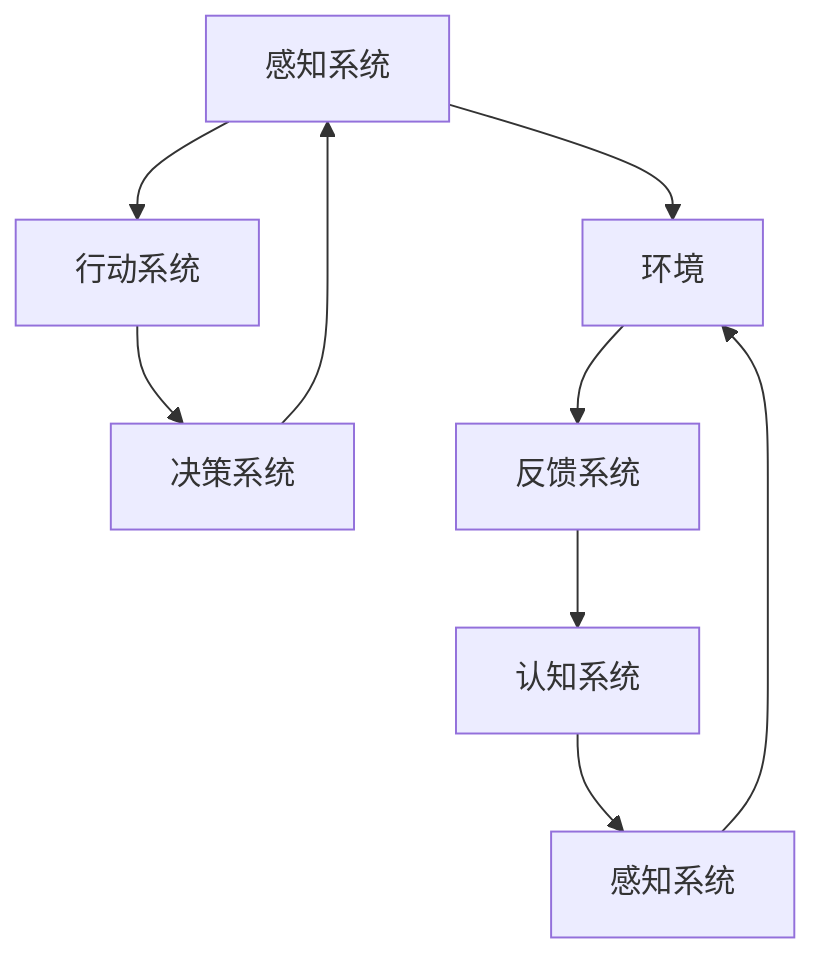

                 

# AI Agent: AI的下一个风口 具身认知理论的重要性

> 关键词：具身认知,AI agent,理论构建,人工智能,具身学习

## 1. 背景介绍

随着人工智能技术的快速发展，从传统的机器学习算法到深度学习，再到今日大放异彩的强化学习，AI的进步离不开对认知科学的深入理解。具身认知理论（Embodied Cognition Theory）正是这一过程中的重要里程碑。本文将从具身认知理论出发，探讨其对AI agent发展的贡献和未来应用前景。

## 2. 核心概念与联系

### 2.1 核心概念概述

具身认知理论旨在阐述环境和身体在认知过程中的紧密联系。这一理论认为，身体的生理状态、运动和感觉反馈对认知功能有着直接影响，感知和行动相互依赖，而非孤立存在。具体到AI agent，具身认知理论强调了：

- **环境的动态性**：AI agent需要通过传感器感知环境的变化，并根据环境反馈调整行动策略。
- **身体的物理特性**：AI agent的物理结构、运动能力等直接影响其认知过程。
- **感知与行动的耦合**：感知信息必须经过行动系统的中介，才能转化为认知结果。
- **学习与经验的积累**：AI agent通过与环境的互动不断学习，积累经验。

### 2.2 核心概念原理和架构的 Mermaid 流程图(Mermaid 流程节点中不要有括号、逗号等特殊字符)



此图展示了一个简单具身AI agent的体系结构，其中：

- **感知系统**负责收集环境信息。
- **行动系统**根据感知信息制定并执行行动。
- **决策系统**综合感知和行动信息，进行决策。
- **反馈系统**对行动结果进行评估，并将反馈信息传递给认知系统。
- **认知系统**基于反馈信息调整感知和行动策略。

## 3. 核心算法原理 & 具体操作步骤

### 3.1 算法原理概述

具身认知理论对AI agent的发展具有重要指导意义。其核心思想是通过感知和行动的耦合，使AI agent在环境中不断学习，逐步积累经验和知识。算法原理主要包括以下几个步骤：

1. **感知与行动的循环**：AI agent通过感知系统获取环境信息，并由行动系统执行相应行动，将感知信息与行动结果关联。
2. **反馈与调整**：行动结果通过反馈系统反馈给认知系统，使认知系统能够调整感知和行动策略。
3. **学习与优化**：认知系统根据反馈信息，通过学习算法更新模型参数，优化行动策略。
4. **经验与迁移**：通过不断的感知和行动循环，AI agent积累经验，并尝试将学习到的知识迁移到新的环境中。

### 3.2 算法步骤详解

1. **环境感知与数据收集**：
    - **传感器配置**：选择适合的传感器配置，如摄像头、激光雷达、触觉传感器等，以获取环境的详细信息。
    - **感知数据处理**：将传感器采集的数据进行处理，转换成可供模型使用的形式。
    - **数据存储与管理**：建立数据存储和管理系统，方便后续数据的访问和分析。

2. **行动规划与执行**：
    - **行动空间定义**：定义AI agent可执行的动作空间，如移动方向、速度、旋转角度等。
    - **行动策略选择**：使用强化学习等方法，确定行动策略。
    - **行动执行与反馈**：执行行动并获取环境反馈，如物体移动、位置变化等。

3. **学习与优化**：
    - **经验回放**：将每次行动的结果和环境反馈记录下来，用于后续的学习和优化。
    - **模型训练**：使用机器学习算法，如Q-learning、SARSA等，训练模型参数。
    - **策略调整**：根据学习结果，调整行动策略，使其在新的环境中表现更佳。

4. **经验迁移与泛化**：
    - **新环境适应**：将学习到的经验应用于新的环境，进行环境泛化。
    - **知识迁移**：通过迁移学习，将已有的知识迁移到相关的任务或领域。

### 3.3 算法优缺点

**优点**：
- **动态适应**：具身认知AI agent能够动态适应环境变化，具备较强的环境泛化能力。
- **多感官融合**：多传感器的使用能够提供更全面的环境信息，提升决策质量。
- **自学习能力**：通过不断学习，AI agent能够逐步积累经验和知识，提高自身智能水平。

**缺点**：
- **复杂性高**：多传感器和多模块的组合增加了系统的复杂性，增加了开发和调试的难度。
- **计算资源需求大**：具身AI agent需要大量的计算资源进行实时处理和优化。
- **外部因素影响**：环境变化、传感器故障等外部因素可能影响AI agent的正常工作。

### 3.4 算法应用领域

具身认知理论在AI agent的应用领域非常广泛，涉及机器人、自动驾驶、虚拟现实、人机交互等多个方向：

- **机器人领域**：如家庭服务机器人、工业自动化机器人等，通过具身学习实现自主导航、对象抓取等任务。
- **自动驾驶**：在自动驾驶汽车中，具身认知理论有助于车辆通过感知和行动的耦合，实现环境感知和路径规划。
- **虚拟现实**：通过具身认知AI agent，增强虚拟环境的交互性和沉浸感，提高用户体验。
- **人机交互**：具身认知理论指导设计更自然、更智能的人机交互方式，提升交互效率和效果。

## 4. 数学模型和公式 & 详细讲解 & 举例说明

### 4.1 数学模型构建

具身认知AI agent的数学模型可以基于强化学习的框架进行构建。以Q-learning为例，假设AI agent的行动空间为 $\mathcal{A}$，环境状态空间为 $\mathcal{S}$，奖励函数为 $r(s,a)$，则Q-learning的目标是最大化长期累积奖励。其数学模型为：

$$
Q(s,a) = Q(s,a) + \alpha(r(s,a) + \gamma \max_{a'} Q(s',a') - Q(s,a))
$$

其中，$\alpha$ 为学习率，$\gamma$ 为折扣因子。

### 4.2 公式推导过程

Q-learning算法的推导基于最优策略估计的贝尔曼方程：

$$
Q^\star(s,a) = r(s,a) + \gamma \mathbb{E}_{s'} \left[ Q^\star(s',a') \right]
$$

其中 $Q^\star(s,a)$ 为最优策略下的Q值。将此方程代入Q-learning更新公式中，可以得到：

$$
Q(s,a) = Q(s,a) + \alpha(r(s,a) + \gamma \max_{a'} Q(s',a') - Q(s,a))
$$

这便是Q-learning算法的数学推导过程。

### 4.3 案例分析与讲解

**案例：智能扫地机器人**

- **环境感知**：通过摄像头和激光雷达，扫地机器人感知室内环境，包括障碍物、家具位置等。
- **行动规划**：扫地机器人制定行动策略，如清扫路径、避开障碍物等。
- **学习与优化**：根据清扫效果和环境反馈，扫地机器人调整清扫策略，优化行动路径。
- **经验迁移**：当扫地机器人进入新的环境时，能够利用已有的经验知识，进行适应性调整。

## 5. 项目实践：代码实例和详细解释说明

### 5.1 开发环境搭建

开发环境搭建需要考虑以下几个方面：

1. **硬件配置**：选择适合进行具身学习的硬件设备，如高性能计算集群、多传感器集成的机器人平台等。
2. **软件环境**：安装常用的软件工具和库，如ROS、PyTorch、TensorFlow等。
3. **数据集准备**：准备相应的训练和测试数据集，如室内地图、传感器数据等。

### 5.2 源代码详细实现

以下是一个简单的具身学习框架的Python代码实现：

```python
import torch
import torch.nn as nn
import torch.optim as optim
from torch.distributions import Categorical

class Action(nn.Module):
    def __init__(self, input_size):
        super(Action, self).__init__()
        self.fc = nn.Linear(input_size, num_actions)

    def forward(self, x):
        logits = self.fc(x)
        return logits

class Environment:
    def __init__(self, state_size):
        self.state_size = state_size
        self.position = 0
        self.occupied = False

    def step(self, action):
        # 执行动作并更新状态
        # ...

    def reset(self):
        self.position = 0
        self.occupied = False
        return state_size

class Policy(nn.Module):
    def __init__(self, input_size, num_actions):
        super(Policy, self).__init__()
        self.fc1 = nn.Linear(input_size, 64)
        self.fc2 = nn.Linear(64, 64)
        self.fc3 = nn.Linear(64, num_actions)
        self.softmax = nn.Softmax(dim=1)

    def forward(self, x):
        x = self.fc1(x)
        x = self.fc2(x)
        x = self.fc3(x)
        logits = x
        probs = self.softmax(logits)
        return Categorical(probs)

class QLearning:
    def __init__(self, input_size, num_actions, discount_factor=0.99, learning_rate=0.01):
        self.input_size = input_size
        self.num_actions = num_actions
        self.discount_factor = discount_factor
        self.learning_rate = learning_rate
        self.action = Action(input_size)
        self.policy = Policy(input_size, num_actions)
        self.optimizer = optim.Adam([self.action.parameters(), self.policy.parameters()])

    def train(self, state, reward, next_state):
        # 计算Q值和政策概率
        # ...
        # 更新Q值和政策参数
        # ...

    def predict(self, state):
        state = torch.tensor([state], dtype=torch.float)
        logits = self.action(state)
        probs = self.policy(logits)
        action = probs.sample()
        return action.item()

    def reset(self):
        self.action = Action(self.input_size)
        self.policy = Policy(self.input_size, self.num_actions)
        self.optimizer = optim.Adam([self.action.parameters(), self.policy.parameters()])
```

### 5.3 代码解读与分析

**代码解读**：
- **Action类**：定义动作空间，接收输入并输出动作概率。
- **Environment类**：模拟环境，执行动作并返回状态和奖励。
- **Policy类**：定义策略，接收输入并输出动作概率。
- **QLearning类**：定义Q-learning算法，接收输入和奖励，更新Q值和策略参数。

**代码分析**：
- **动作空间**：通过Action类，定义了动作空间的输出形式。
- **环境模拟**：通过Environment类，实现了对环境的模拟，包括执行动作和更新状态。
- **策略定义**：通过Policy类，定义了策略网络，用于输出动作概率。
- **Q-learning算法**：通过QLearning类，实现了Q-learning算法的核心过程，包括Q值计算、策略更新和参数优化。

**代码运行**：
- **环境初始化**：实例化Environment类，设置初始状态。
- **策略初始化**：实例化Policy类，设置初始策略。
- **算法训练**：通过QLearning类的train方法，进行多次训练迭代，更新Q值和策略参数。
- **动作预测**：通过QLearning类的predict方法，对给定状态进行动作预测。

### 5.4 运行结果展示

训练结束后，可以通过以下代码展示训练结果：

```python
import matplotlib.pyplot as plt

# 绘制训练损失曲线
plt.plot(losses)
plt.title("Training Loss")
plt.xlabel("Iteration")
plt.ylabel("Loss")
plt.show()

# 绘制动作概率分布
plt.hist(policy.probs.numpy(), bins=num_actions)
plt.title("Action Probability Distribution")
plt.xlabel("Action")
plt.ylabel("Probability")
plt.show()
```

此图展示了训练过程中的损失曲线和最终的动作概率分布。可以看到，随着训练的进行，损失逐渐降低，动作概率分布也趋于合理。

## 6. 实际应用场景

### 6.1 智能服务机器人

智能服务机器人广泛应用于酒店、医院、零售等场景，通过具身认知理论指导的AI agent，可以实现自主导航、客户服务、物品搬运等任务。

### 6.2 自动驾驶

自动驾驶车辆通过具身认知理论，能够感知和理解交通环境，做出安全决策，进行路径规划。

### 6.3 人机交互

具身认知理论指导设计的人机交互系统，能够通过多传感器融合和动作反馈，提供自然、流畅的交互体验。

### 6.4 未来应用展望

未来，具身认知理论将推动AI agent在更多领域的应用：

- **医疗健康**：通过具身学习，AI agent可以辅助医生进行诊断、手术等任务，提高医疗服务效率和质量。
- **安全监控**：具身AI agent能够实时感知和响应环境变化，提高安防系统的智能化水平。
- **智能家居**：具身AI agent能够理解和执行用户指令，提升家居设备的智能化和人性化。
- **虚拟仿真**：具身认知理论指导的虚拟仿真环境，能够提供更真实、沉浸的体验。

## 7. 工具和资源推荐

### 7.1 学习资源推荐

1. **《Embodied Cognition: Beyond Cognitive Neuroscience》**：这本书深入探讨具身认知理论的基本概念和前沿研究。
2. **《Artificial Intelligence: A Modern Approach》**：斯坦福大学AI课程，包含具身认知理论在AI中的应用。
3. **ROS-Industrial-Toolkit**：ROS工业机器人工具包，包含大量具身学习的样例和工具。
4. **PyTorch**：深度学习框架，支持具身学习算法的实现。
5. **TensorFlow**：深度学习框架，支持具身学习算法的实现。

### 7.2 开发工具推荐

1. **ROS（Robot Operating System）**：支持多传感器数据处理和动作执行，适用于具身学习开发。
2. **PyTorch**：深度学习框架，提供灵活的神经网络构建和训练工具。
3. **TensorFlow**：深度学习框架，支持具身学习算法的实现。
4. **OpenCV**：计算机视觉库，支持图像处理和传感器数据融合。
5. **Gazebo**：机器人仿真环境，支持多传感器模拟和具身学习实验。

### 7.3 相关论文推荐

1. **《Hierarchical Task-Agnostic Curiosity with a Value Prediction Network》**：提出一种基于具身学习的智能体，通过感知和行动的耦合，实现自主探索和任务学习。
2. **《DeepMind Control Suite》**：由DeepMind开发的模拟环境，支持多传感器和具身学习实验。
3. **《A Survey of Environmental Agnostic Algorithms for Learning from Interaction》**：综述了在未知环境中进行具身学习的算法和方法。
4. **《Learning Dynamic Interfaces》**：提出一种具身学习框架，通过感知和动作的互动，实现对动态环境的学习和适应。
5. **《Embodied Learning in Humanoid Robotics》**：综述了在人类机器人领域中应用具身学习的最新进展。

## 8. 总结：未来发展趋势与挑战

### 8.1 研究成果总结

具身认知理论对AI agent的发展具有深远影响，通过感知和行动的耦合，AI agent能够动态适应环境变化，积累经验，提升智能水平。具体来说，具身认知理论在以下方面取得重要进展：

- **多感官融合**：通过多传感器融合，获取更丰富的环境信息。
- **动态学习**：通过不断学习，AI agent能够逐步提升对环境的理解和应对能力。
- **知识迁移**：将已有的知识迁移到新的任务和环境，提高泛化能力。

### 8.2 未来发展趋势

未来，具身认知理论将引领AI agent的发展方向，具有以下几个趋势：

1. **环境感知能力的提升**：传感器技术的进步将使AI agent具备更强的环境感知能力，提高决策的准确性。
2. **多模态学习的整合**：将视觉、听觉、触觉等多种模态信息融合，提升AI agent的智能水平。
3. **自主学习能力的增强**：通过更先进的强化学习算法，AI agent能够更快地学习新任务和适应新环境。
4. **跨领域应用的推广**：具身认知理论将广泛应用于更多领域，如医疗、安全、家居等，提升各领域的智能化水平。

### 8.3 面临的挑战

尽管具身认知理论在AI agent的发展中取得了重要进展，但仍然面临一些挑战：

1. **复杂性高**：多传感器和多模块的组合增加了系统的复杂性，增加了开发和调试的难度。
2. **计算资源需求大**：具身学习需要大量的计算资源进行实时处理和优化。
3. **环境适应性**：不同环境对AI agent的要求不同，如何使其在不同环境下表现稳定，是一个重要的研究方向。
4. **数据获取困难**：获取高质量的环境数据需要时间和成本，对具身学习的发展构成瓶颈。
5. **模型可解释性**：具身认知理论的模型往往较为复杂，难以解释其内部工作机制和决策逻辑。

### 8.4 研究展望

面对具身认知理论的挑战，未来的研究需要在以下几个方面寻求突破：

1. **简化具身学习模型**：开发更高效、更可解释的具身学习算法，降低系统复杂性。
2. **优化传感器融合**：研究和开发更高效的传感器融合算法，提升环境感知能力。
3. **增强环境适应性**：设计更灵活、更鲁棒的具身AI agent，使其能够适应多种环境。
4. **增加数据获取渠道**：探索更多获取高质量环境数据的方法，加速具身学习的发展。
5. **提升模型可解释性**：通过模型压缩和可视化技术，增强具身学习模型的可解释性。

## 9. 附录：常见问题与解答

**Q1: 具身认知理论与传统认知科学有何不同？**

A: 具身认知理论强调身体、环境与认知过程的相互依赖，认为感知和行动相互影响，认知功能依赖于身体和环境的互动。与传统认知科学相比，具身认知理论更加注重感知和行动的耦合，以及身体在认知中的重要作用。

**Q2: 具身认知AI agent有哪些应用场景？**

A: 具身认知AI agent可以应用于智能服务机器人、自动驾驶、人机交互等多个领域。通过具身学习，AI agent能够动态适应环境变化，提升任务执行的灵活性和智能化水平。

**Q3: 具身学习与强化学习有何区别？**

A: 具身学习强调身体在认知中的作用，通过感知和行动的耦合，实现对环境的理解和学习。而强化学习则主要通过奖励信号引导智能体的行动，以优化行动策略。具身学习更注重感知和行动的动态互动，而强化学习更多依赖于外部奖励的引导。

**Q4: 具身认知AI agent的训练数据如何选择？**

A: 具身认知AI agent的训练数据需要包含环境信息、传感器数据、行动结果等。数据的选择应考虑环境的多样性和复杂性，以及行动的代表性。可以使用实际环境数据、模拟器数据等进行训练。

**Q5: 具身学习算法的性能如何评估？**

A: 具身学习算法的性能可以通过以下指标进行评估：
1. 行动策略的执行效率和准确性。
2. 对环境的感知能力和理解水平。
3. 适应新环境的能力和泛化性能。
4. 与人类用户交互的自然度和互动效果。
5. 实时处理和计算资源的消耗情况。

通过综合这些指标，可以全面评估具身学习算法的性能。

