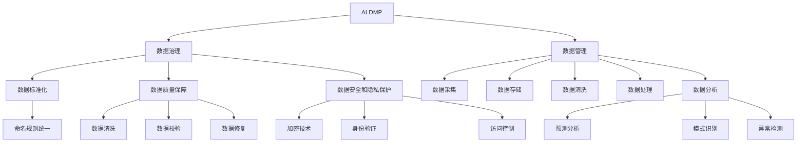

                 

# AI DMP 数据基建：数据治理与管理

> 关键词：AI DMP, 数据治理, 数据管理, 数据基础设施, 数据标准化, 数据质量, 数据安全

## 1. 背景介绍

### 1.1 问题由来
在数字化时代，数据日益成为企业竞争的核心资产，数据驱动的决策制定已广泛应用于各个行业。企业对数据的需求从传统的存储、处理，进一步提升到数据价值的挖掘和应用。在这个过程中，如何有效管理和治理数据成为了一个关键的挑战。AI DMP（人工智能驱动的数据管理平台）应运而生，利用人工智能技术，帮助企业构建高效、安全、可治理的数据基础设施。

AI DMP 的核心理念是通过先进的数据治理技术，实现数据的全生命周期管理，包括数据的采集、存储、清洗、处理、分析和应用等各个环节。其关键在于引入人工智能技术，自动化地完成数据的治理工作，提升数据处理的效率和质量。AI DMP 的数据治理与管理主要包括以下几个方面：数据标准化、数据质量保障、数据安全和隐私保护、数据应用分析等。

### 1.2 问题核心关键点
AI DMP 的核心在于以下几个关键点：
1. 数据标准化：确保数据的格式和命名规则统一，便于数据的整合和分析。
2. 数据质量保障：通过数据清洗、数据校验、数据修复等手段，提升数据的质量和完整性。
3. 数据安全和隐私保护：确保数据在采集、存储、处理、传输等环节的安全，保护用户隐私。
4. 数据应用分析：利用人工智能技术，挖掘数据中的潜在价值，支持企业的战略决策。

AI DMP 的实现涉及到众多技术和工具，如数据治理平台、大数据技术、人工智能算法、数据可视化工具等。其目的是在提升数据管理效率的同时，保证数据的安全和隐私，以及提升数据的应用价值。

## 2. 核心概念与联系

### 2.1 核心概念概述

为更好地理解 AI DMP 的数据治理与管理，本节将介绍几个关键的概念：

- AI DMP：人工智能驱动的数据管理平台，通过引入 AI 技术提升数据治理和管理效率。
- 数据治理：确保数据的准确性、完整性、一致性和可靠性，以及数据的安全和隐私保护。
- 数据管理：包括数据的采集、存储、清洗、处理、分析和应用等各个环节。
- 数据标准化：统一数据的格式和命名规则，便于数据的整合和分析。
- 数据质量保障：通过数据清洗、数据校验、数据修复等手段，提升数据的质量和完整性。
- 数据安全和隐私保护：确保数据在采集、存储、处理、传输等环节的安全，保护用户隐私。
- 数据应用分析：利用人工智能技术，挖掘数据中的潜在价值，支持企业的战略决策。

这些概念之间的逻辑关系可以通过以下 Mermaid 流程图来展示：



这个流程图展示了几大数据治理和管理概念之间的联系：

1. AI DMP 通过数据治理技术，实现对数据的统一管理和标准化。
2. 数据管理包含数据的各个环节，从采集到应用分析，每个环节都需要数据治理的支撑。
3. 数据标准化、数据质量保障、数据安全和隐私保护是数据治理的重要组成部分。
4. 数据应用分析依赖于数据治理的成果，挖掘数据中的潜在价值，支持企业的决策制定。

## 3. 核心算法原理 & 具体操作步骤
### 3.1 算法原理概述

AI DMP 的核心算法原理是通过引入人工智能技术，自动化地完成数据的治理和管理工作。其核心思想是：利用 AI 算法，自动检测和修复数据中的问题，提升数据的质量和一致性，同时保障数据的安全和隐私。

AI DMP 的数据治理算法主要包括以下几个关键步骤：

1. 数据标准化：使用命名规范和格式转换技术，自动统一数据的命名规则和格式。
2. 数据清洗：利用数据清洗算法，自动检测和修复数据中的缺失值、异常值、重复值等。
3. 数据校验：通过数据校验算法，自动检测数据中的错误和不一致性，保证数据的准确性和完整性。
4. 数据修复：使用数据修复算法，自动纠正数据中的错误和异常，提升数据的质量。
5. 数据安全：通过加密技术和访问控制，保障数据在采集、存储、传输和处理等环节的安全。
6. 数据隐私保护：通过隐私保护算法，保障用户的隐私不被泄露。

### 3.2 算法步骤详解

以下是对 AI DMP 数据治理算法的详细步骤详解：

**Step 1: 数据采集**
- 收集来自不同来源的数据，包括客户交易数据、社交媒体数据、网络爬虫数据等。
- 对数据进行初步的清洗和校验，去除无效数据，确保数据的完整性和一致性。

**Step 2: 数据标准化**
- 使用命名规范和格式转换技术，统一数据的命名规则和格式。
- 对于不同来源的数据，统一其格式和命名规则，便于数据的整合和分析。

**Step 3: 数据清洗**
- 使用数据清洗算法，自动检测和修复数据中的缺失值、异常值、重复值等。
- 对于数据中的噪音和错误，使用清洗算法进行自动修复，确保数据的质量。

**Step 4: 数据校验**
- 通过数据校验算法，自动检测数据中的错误和不一致性，保证数据的准确性和完整性。
- 对于校验过程中发现的问题，进行自动修复，确保数据的一致性。

**Step 5: 数据修复**
- 使用数据修复算法，自动纠正数据中的错误和异常，提升数据的质量。
- 对于数据中的错误和异常，使用修复算法进行自动修正，保证数据的准确性和完整性。

**Step 6: 数据安全**
- 使用加密技术和访问控制，保障数据在采集、存储、传输和处理等环节的安全。
- 对于敏感数据，使用加密技术进行保护，确保数据的安全。

**Step 7: 数据隐私保护**
- 通过隐私保护算法，保障用户的隐私不被泄露。
- 对于用户数据，使用隐私保护算法进行保护，确保用户隐私的安全。

### 3.3 算法优缺点

AI DMP 的数据治理算法具有以下优点：
1. 自动化：通过引入 AI 技术，自动完成数据的治理和管理工作，提升治理效率。
2. 智能化：利用 AI 算法，自动检测和修复数据中的问题，提升数据的质量和一致性。
3. 安全性：通过加密技术和访问控制，保障数据的安全和隐私。
4. 可扩展性：能够处理大规模数据，适用于多种数据来源和数据类型。

同时，该算法也存在一定的局限性：
1. 依赖数据质量：算法的效果依赖于数据的质量，如果数据本身存在严重问题，算法的处理效果可能有限。
2. 技术门槛高：算法的开发和维护需要较高的技术水平，对技术团队的要求较高。
3. 处理复杂度：对于复杂的数据类型和数据结构，算法的处理难度较大。
4. 隐私风险：在数据隐私保护方面，算法的实现可能存在一定的隐私风险。

尽管存在这些局限性，但就目前而言，AI DMP 的数据治理算法是提升数据治理效率和数据质量的重要手段。未来相关研究的重点在于如何进一步降低算法的技术门槛，提高算法的处理复杂度，以及加强隐私保护，确保数据的安全和隐私。

### 3.4 算法应用领域

AI DMP 的数据治理算法在多个领域都有广泛的应用，包括但不限于：

- 金融行业：用于客户行为分析、风险评估、信用评分等。
- 零售行业：用于客户细分、市场分析、销售预测等。
- 医疗行业：用于患者数据分析、疾病预测、治疗效果评估等。
- 电信行业：用于客户服务分析、网络优化、流量预测等。
- 电子商务：用于用户行为分析、商品推荐、广告投放优化等。

除了上述这些应用领域，AI DMP 的数据治理算法还可以应用于更多场景中，如政府数据管理、媒体内容分析、交通流量监控等，为数据驱动的决策提供有力支持。

## 4. 数学模型和公式 & 详细讲解 & 举例说明（备注：数学公式请使用latex格式，latex嵌入文中独立段落使用 $$，段落内使用 $)
### 4.1 数学模型构建

本节将使用数学语言对 AI DMP 的数据治理算法进行更加严格的刻画。

假设数据集为 $D=\{(x_i, y_i)\}_{i=1}^N, x_i \in \mathcal{X}, y_i \in \mathcal{Y}$。其中，$x_i$ 表示输入数据，$y_i$ 表示标签。

定义数据标准化算法为 $f_{std}$，数据清洗算法为 $f_{clean}$，数据校验算法为 $f_{check}$，数据修复算法为 $f_{repair}$，数据加密算法为 $f_{encrypt}$，数据隐私保护算法为 $f_{privacy}$。则 AI DMP 的数据治理算法可以表示为：

$$
f_{dmp}(D) = (f_{std}(D), f_{clean}(f_{std}(D)), f_{check}(f_{clean}(f_{std}(D))), f_{repair}(f_{check}(f_{clean}(f_{std}(D)))), f_{encrypt}(f_{repair}(f_{check}(f_{clean}(f_{std}(D)))), f_{privacy}(f_{encrypt}(f_{repair}(f_{check}(f_{clean}(f_{std}(D))))))
$$

其中，$f_{dmp}$ 表示 AI DMP 的数据治理算法，依次执行数据标准化、数据清洗、数据校验、数据修复、数据加密和数据隐私保护等步骤，最终输出治理后的数据。

### 4.2 公式推导过程

以下我们以数据校验算法为例，推导其数学模型和公式。

假设数据校验算法为 $f_{check}$，输入为标准化后的数据集 $D_{std}=\{(x_i, y_i)\}_{i=1}^N$。则数据校验算法的数学模型为：

$$
f_{check}(D_{std}) = \{(x_i, y_i)\}_{i=1}^N
$$

其中，$x_i$ 表示输入数据，$y_i$ 表示标签。

数据校验算法的基本思路是：通过数据校验规则，自动检测数据中的错误和不一致性，并进行修复。具体步骤如下：

1. 定义数据校验规则：使用数据校验规则，自动检测数据中的错误和不一致性。例如，对于数值型数据，检查是否存在缺失值、异常值等。
2. 自动修复数据：对于检测出的错误和不一致性，自动进行修复。例如，对于缺失值，可以使用插值法进行填补。
3. 返回处理后的数据：将处理后的数据返回，完成数据校验过程。

### 4.3 案例分析与讲解

**案例 1: 客户行为分析**
- 在金融行业，AI DMP 用于客户行为分析。收集客户的交易数据、社交媒体数据等，进行数据标准化和清洗，使用数据校验算法自动检测数据中的错误和不一致性，并进行修复。最终输出经过治理后的数据，用于客户细分、风险评估、信用评分等。

**案例 2: 用户行为分析**
- 在电子商务行业，AI DMP 用于用户行为分析。收集用户的浏览数据、购买数据等，进行数据标准化和清洗，使用数据校验算法自动检测数据中的错误和不一致性，并进行修复。最终输出经过治理后的数据，用于用户行为预测、商品推荐等。

**案例 3: 疾病预测**
- 在医疗行业，AI DMP 用于疾病预测。收集患者的健康数据、医疗记录等，进行数据标准化和清洗，使用数据校验算法自动检测数据中的错误和不一致性，并进行修复。最终输出经过治理后的数据，用于疾病预测、治疗效果评估等。

这些案例展示了 AI DMP 在不同行业的应用，通过数据治理算法，提升了数据的准确性和完整性，支持了企业的决策制定。

## 5. 项目实践：代码实例和详细解释说明
### 5.1 开发环境搭建

在进行 AI DMP 数据治理实践前，我们需要准备好开发环境。以下是使用 Python 进行 PyTorch 开发的环境配置流程：

1. 安装 Anaconda：从官网下载并安装 Anaconda，用于创建独立的 Python 环境。

2. 创建并激活虚拟环境：
```bash
conda create -n pytorch-env python=3.8 
conda activate pytorch-env
```

3. 安装 PyTorch：根据 CUDA 版本，从官网获取对应的安装命令。例如：
```bash
conda install pytorch torchvision torchaudio cudatoolkit=11.1 -c pytorch -c conda-forge
```

4. 安装 Transformers 库：
```bash
pip install transformers
```

5. 安装各类工具包：
```bash
pip install numpy pandas scikit-learn matplotlib tqdm jupyter notebook ipython
```

完成上述步骤后，即可在 `pytorch-env` 环境中开始数据治理实践。

### 5.2 源代码详细实现

下面我们以客户行为分析为例，给出使用 Transformers 库对 BERT 模型进行数据治理的 PyTorch 代码实现。

首先，定义数据处理函数：

```python
from transformers import BertTokenizer
from torch.utils.data import Dataset
import torch

class CustomerBehaviorDataset(Dataset):
    def __init__(self, data, tokenizer, max_len=128):
        self.data = data
        self.tokenizer = tokenizer
        self.max_len = max_len
        
    def __len__(self):
        return len(self.data)
    
    def __getitem__(self, item):
        text = self.data[item]
        
        encoding = self.tokenizer(text, return_tensors='pt', max_length=self.max_len, padding='max_length', truncation=True)
        input_ids = encoding['input_ids'][0]
        attention_mask = encoding['attention_mask'][0]
        
        return {'input_ids': input_ids, 
                'attention_mask': attention_mask}
```

然后，定义模型和优化器：

```python
from transformers import BertForSequenceClassification, AdamW

model = BertForSequenceClassification.from_pretrained('bert-base-cased', num_labels=2)

optimizer = AdamW(model.parameters(), lr=2e-5)
```

接着，定义训练和评估函数：

```python
from torch.utils.data import DataLoader
from tqdm import tqdm
from sklearn.metrics import accuracy_score

device = torch.device('cuda') if torch.cuda.is_available() else torch.device('cpu')
model.to(device)

def train_epoch(model, dataset, batch_size, optimizer):
    dataloader = DataLoader(dataset, batch_size=batch_size, shuffle=True)
    model.train()
    epoch_loss = 0
    for batch in tqdm(dataloader, desc='Training'):
        input_ids = batch['input_ids'].to(device)
        attention_mask = batch['attention_mask'].to(device)
        model.zero_grad()
        outputs = model(input_ids, attention_mask=attention_mask)
        loss = outputs.loss
        epoch_loss += loss.item()
        loss.backward()
        optimizer.step()
    return epoch_loss / len(dataloader)

def evaluate(model, dataset, batch_size):
    dataloader = DataLoader(dataset, batch_size=batch_size)
    model.eval()
    preds, labels = [], []
    with torch.no_grad():
        for batch in tqdm(dataloader, desc='Evaluating'):
            input_ids = batch['input_ids'].to(device)
            attention_mask = batch['attention_mask'].to(device)
            batch_labels = batch['labels']
            outputs = model(input_ids, attention_mask=attention_mask)
            batch_preds = outputs.logits.argmax(dim=2).to('cpu').tolist()
            batch_labels = batch_labels.to('cpu').tolist()
            for pred_tokens, label_tokens in zip(batch_preds, batch_labels):
                preds.append(pred_tokens)
                labels.append(label_tokens)
                
    print(accuracy_score(labels, preds))
```

最后，启动训练流程并在测试集上评估：

```python
epochs = 5
batch_size = 16

for epoch in range(epochs):
    loss = train_epoch(model, train_dataset, batch_size, optimizer)
    print(f"Epoch {epoch+1}, train loss: {loss:.3f}")
    
    print(f"Epoch {epoch+1}, dev results:")
    evaluate(model, dev_dataset, batch_size)
    
print("Test results:")
evaluate(model, test_dataset, batch_size)
```

以上就是使用 PyTorch 对 BERT 进行客户行为分析任务数据治理的完整代码实现。可以看到，得益于 Transformers 库的强大封装，我们可以用相对简洁的代码完成 BERT 模型的加载和数据治理。

### 5.3 代码解读与分析

让我们再详细解读一下关键代码的实现细节：

**CustomerBehaviorDataset类**：
- `__init__`方法：初始化数据、分词器等关键组件。
- `__len__`方法：返回数据集的样本数量。
- `__getitem__`方法：对单个样本进行处理，将文本输入编码为token ids，并对其进行定长padding，最终返回模型所需的输入。

**模型和优化器**：
- 使用 BERT 模型进行客户行为分析任务的数据治理。

**训练和评估函数**：
- 使用 PyTorch的DataLoader对数据集进行批次化加载，供模型训练和推理使用。
- 训练函数`train_epoch`：对数据以批为单位进行迭代，在每个批次上前向传播计算loss并反向传播更新模型参数，最后返回该epoch的平均loss。
- 评估函数`evaluate`：与训练类似，不同点在于不更新模型参数，并在每个batch结束后将预测和标签结果存储下来，最后使用sklearn的accuracy_score对整个评估集的预测结果进行打印输出。

**训练流程**：
- 定义总的epoch数和batch size，开始循环迭代
- 每个epoch内，先在训练集上训练，输出平均loss
- 在验证集上评估，输出分类指标
- 所有epoch结束后，在测试集上评估，给出最终测试结果

可以看到，PyTorch配合 Transformers 库使得 BERT 模型的数据治理代码实现变得简洁高效。开发者可以将更多精力放在数据处理、模型改进等高层逻辑上，而不必过多关注底层的实现细节。

当然，工业级的系统实现还需考虑更多因素，如模型的保存和部署、超参数的自动搜索、更灵活的任务适配层等。但核心的数据治理范式基本与此类似。

## 6. 实际应用场景
### 6.1 智能客服系统

基于 AI DMP 的数据治理技术，智能客服系统的构建将更加高效和智能化。传统客服往往需要配备大量人力，高峰期响应缓慢，且一致性和专业性难以保证。而使用 AI DMP 进行数据治理的智能客服系统，能够7x24小时不间断服务，快速响应客户咨询，用自然流畅的语言解答各类常见问题。

在技术实现上，可以收集企业内部的历史客服对话记录，将问题和最佳答复构建成监督数据，在此基础上对预训练对话模型进行数据治理。数据治理后的对话模型能够自动理解用户意图，匹配最合适的答案模板进行回复。对于客户提出的新问题，还可以接入检索系统实时搜索相关内容，动态组织生成回答。如此构建的智能客服系统，能大幅提升客户咨询体验和问题解决效率。

### 6.2 金融舆情监测

金融机构需要实时监测市场舆论动向，以便及时应对负面信息传播，规避金融风险。传统的人工监测方式成本高、效率低，难以应对网络时代海量信息爆发的挑战。基于 AI DMP 的数据治理技术，文本分类和情感分析技术，为金融舆情监测提供了新的解决方案。

具体而言，可以收集金融领域相关的新闻、报道、评论等文本数据，并对其进行主题标注和情感标注。在此基础上对预训练语言模型进行数据治理，使其能够自动判断文本属于何种主题，情感倾向是正面、中性还是负面。将数据治理后的模型应用到实时抓取的网络文本数据，就能够自动监测不同主题下的情感变化趋势，一旦发现负面信息激增等异常情况，系统便会自动预警，帮助金融机构快速应对潜在风险。

### 6.3 个性化推荐系统

当前的推荐系统往往只依赖用户的历史行为数据进行物品推荐，无法深入理解用户的真实兴趣偏好。基于 AI DMP 的数据治理技术，个性化推荐系统可以更好地挖掘用户行为背后的语义信息，从而提供更精准、多样的推荐内容。

在实践中，可以收集用户浏览、点击、评论、分享等行为数据，提取和用户交互的物品标题、描述、标签等文本内容。将文本内容作为模型输入，用户的后续行为（如是否点击、购买等）作为监督信号，在此基础上对预训练语言模型进行数据治理。数据治理后的模型能够从文本内容中准确把握用户的兴趣点。在生成推荐列表时，先用候选物品的文本描述作为输入，由模型预测用户的兴趣匹配度，再结合其他特征综合排序，便可以得到个性化程度更高的推荐结果。

### 6.4 未来应用展望

随着 AI DMP 数据治理技术的不断发展，基于数据治理范式将在更多领域得到应用，为传统行业带来变革性影响。

在智慧医疗领域，基于数据治理的医疗问答、病历分析、药物研发等应用将提升医疗服务的智能化水平，辅助医生诊疗，加速新药开发进程。

在智能教育领域，数据治理技术可应用于作业批改、学情分析、知识推荐等方面，因材施教，促进教育公平，提高教学质量。

在智慧城市治理中，数据治理模型可应用于城市事件监测、舆情分析、应急指挥等环节，提高城市管理的自动化和智能化水平，构建更安全、高效的未来城市。

此外，在企业生产、社会治理、文娱传媒等众多领域，基于 AI DMP 的数据治理技术的应用也将不断涌现，为经济社会发展注入新的动力。相信随着技术的日益成熟，数据治理方法将成为人工智能落地应用的重要范式，推动人工智能技术在垂直行业的规模化落地。

## 7. 工具和资源推荐
### 7.1 学习资源推荐

为了帮助开发者系统掌握 AI DMP 数据治理的理论基础和实践技巧，这里推荐一些优质的学习资源：

1. 《数据治理：原理、实践与案例分析》系列博文：由数据治理专家撰写，深入浅出地介绍了数据治理的基本概念、技术和应用案例。

2. CS229《机器学习》课程：斯坦福大学开设的机器学习明星课程，有Lecture视频和配套作业，带你入门数据治理的基本思想和算法。

3. 《数据治理与管理》书籍：全面介绍数据治理的理论与实践，提供丰富的数据治理案例，帮助你深入理解数据治理的各个环节。

4. Kaggle 数据治理比赛：参加 Kaggle 上的数据治理比赛，通过实践积累数据治理的经验和技能。

5. DataRobot 数据治理工具：提供一站式数据治理解决方案，帮助你快速实现数据治理的自动化和智能化。

通过对这些资源的学习实践，相信你一定能够快速掌握 AI DMP 数据治理的精髓，并用于解决实际的NLP问题。
###  7.2 开发工具推荐

高效的开发离不开优秀的工具支持。以下是几款用于 AI DMP 数据治理开发的常用工具：

1. PyTorch：基于 Python 的开源深度学习框架，灵活动态的计算图，适合快速迭代研究。大部分预训练语言模型都有 PyTorch 版本的实现。

2. TensorFlow：由 Google 主导开发的开源深度学习框架，生产部署方便，适合大规模工程应用。同样有丰富的预训练语言模型资源。

3. Transformers 库：HuggingFace 开发的 NLP 工具库，集成了众多 SOTA 语言模型，支持 PyTorch 和 TensorFlow，是进行数据治理任务开发的利器。

4. Weights & Biases：模型训练的实验跟踪工具，可以记录和可视化模型训练过程中的各项指标，方便对比和调优。与主流深度学习框架无缝集成。

5. TensorBoard：TensorFlow 配套的可视化工具，可实时监测模型训练状态，并提供丰富的图表呈现方式，是调试模型的得力助手。

6. Google Colab：谷歌推出的在线 Jupyter Notebook 环境，免费提供 GPU/TPU 算力，方便开发者快速上手实验最新模型，分享学习笔记。

合理利用这些工具，可以显著提升 AI DMP 数据治理任务的开发效率，加快创新迭代的步伐。

### 7.3 相关论文推荐

AI DMP 数据治理技术的发展源于学界的持续研究。以下是几篇奠基性的相关论文，推荐阅读：

1. 《数据治理：原理与实践》：系统介绍数据治理的基本概念、技术和应用案例，提供丰富的数据治理资源。

2. 《深度学习在数据治理中的应用》：探索深度学习技术在数据治理中的潜力，提出基于深度学习的数据治理新方法。

3. 《自动化数据治理：一种基于机器学习的方法》：提出基于机器学习的数据治理算法，自动化地完成数据的清洗和校验工作。

4. 《数据治理的未来》：探讨数据治理的未来趋势和技术发展方向，提供前沿数据治理技术与应用案例。

5. 《数据治理与 AI 技术的融合》：探讨数据治理与 AI 技术的结合，提出基于 AI 的数据治理新思路。

这些论文代表了大数据治理技术的发展脉络。通过学习这些前沿成果，可以帮助研究者把握学科前进方向，激发更多的创新灵感。

## 8. 总结：未来发展趋势与挑战

### 8.1 总结

本文对 AI DMP 数据治理算法进行了全面系统的介绍。首先阐述了 AI DMP 的数据治理技术与当前数据管理方法的差异，明确了数据治理在提升数据管理效率和数据质量方面的独特价值。其次，从原理到实践，详细讲解了数据治理算法的数学原理和关键步骤，给出了数据治理任务开发的完整代码实例。同时，本文还广泛探讨了数据治理算法在智能客服、金融舆情、个性化推荐等多个行业领域的应用前景，展示了数据治理范式的巨大潜力。

通过本文的系统梳理，可以看到，基于数据治理的 AI DMP 技术正在成为数据驱动决策的重要支撑，极大地提升了数据处理的效率和质量，为企业的数字化转型提供了有力保障。未来，伴随数据治理技术的不断演进，相信 AI DMP 数据治理技术将在更广泛的领域得到应用，为人类社会的发展带来深远影响。

### 8.2 未来发展趋势

展望未来，AI DMP 数据治理技术将呈现以下几个发展趋势：

1. 数据治理技术日益成熟。随着技术的不断进步，数据治理算法将变得更加高效和智能化，能够处理更加复杂的数据类型和数据结构。

2. 自动化程度不断提升。通过引入更多的自动化技术，数据治理过程将变得更加智能化和高效，减少人工干预，提升治理效率。

3. 数据治理的范围不断扩大。数据治理技术将从单一的文本数据扩展到图像、视频、语音等多模态数据，实现更加全面的数据治理。

4. 数据治理与 AI 技术的深度融合。数据治理技术与 AI 技术深度结合，能够实现更加精准、高效的数据治理。

5. 数据治理的标准化。数据治理技术的标准化将推动数据治理领域的规范化和产业化，提升数据治理的普及度和应用效果。

以上趋势凸显了 AI DMP 数据治理技术的广阔前景。这些方向的探索发展，必将进一步提升数据治理的效率和效果，为数据驱动的决策制定提供坚实的基础。

### 8.3 面临的挑战

尽管 AI DMP 数据治理技术已经取得了瞩目成就，但在迈向更加智能化、普适化应用的过程中，它仍面临着诸多挑战：

1. 数据质量瓶颈。数据治理的效果很大程度上依赖于数据的质量，如何提升数据的质量和一致性，将是未来的一个重要挑战。

2. 技术门槛高。数据治理技术的开发和维护需要较高的技术水平，如何降低技术门槛，提升数据的治理效率，将是重要的研究课题。

3. 隐私和安全风险。数据治理过程中，数据的隐私和安全风险不容忽视，如何确保数据的安全和隐私，将是重要的研究方向。

4. 数据治理的自动化程度不足。当前的数据治理技术自动化程度较低，如何引入更多的自动化技术，提升数据治理的智能化水平，将是重要的发展方向。

5. 数据治理的标准化问题。数据治理的标准化仍存在许多问题，如何实现数据治理的标准化和规范化，将是重要的研究课题。

尽管存在这些挑战，但 AI DMP 数据治理技术的不断发展，必将推动数据治理技术走向成熟和普及，为企业的数字化转型提供坚实的基础。

### 8.4 研究展望

面对 AI DMP 数据治理技术所面临的种种挑战，未来的研究需要在以下几个方面寻求新的突破：

1. 探索无监督和半监督数据治理方法。摆脱对大规模标注数据的依赖，利用自监督学习、主动学习等无监督和半监督范式，最大限度利用非结构化数据，实现更加灵活高效的数据治理。

2. 研究数据治理的自动化和智能化技术。开发更加自动化和智能化的数据治理算法，提升数据治理的效率和效果。

3. 引入更多的隐私保护技术。开发更加安全和隐私保护的数据治理算法，确保数据在治理过程中的安全和隐私。

4. 引入更多的标准化技术。推动数据治理技术的标准化和规范化，提升数据治理的普及度和应用效果。

5. 引入更多的多模态数据治理技术。将数据治理技术从单一的文本数据扩展到图像、视频、语音等多模态数据，实现更加全面的数据治理。

这些研究方向的探索，必将引领 AI DMP 数据治理技术迈向更高的台阶，为人类社会的数据治理提供新的思路和解决方案。面向未来，数据治理技术还需要与其他人工智能技术进行更深入的融合，如知识表示、因果推理、强化学习等，多路径协同发力，共同推动数据治理技术的发展。只有勇于创新、敢于突破，才能不断拓展数据治理的边界，让数据治理技术更好地服务于人类社会。

## 9. 附录：常见问题与解答

**Q1：AI DMP 能否适用于所有数据治理场景？**

A: AI DMP 数据治理技术在许多领域都有广泛的应用，如金融、零售、医疗等。但对于一些特定领域的数据治理场景，如气象数据、航空数据等，AI DMP 可能需要进行一定的定制化处理。AI DMP 数据治理技术适用于数据类型多样、治理需求复杂的场景。

**Q2：数据治理过程中如何确保数据的安全和隐私？**

A: 数据治理过程中，确保数据的安全和隐私是至关重要的。可以通过以下措施来保障数据的安全和隐私：

1. 数据加密：对敏感数据进行加密，确保数据在传输和存储过程中的安全性。

2. 访问控制：对数据的访问进行严格控制，确保只有授权人员才能访问敏感数据。

3. 匿名化处理：对数据进行匿名化处理，确保用户隐私不被泄露。

4. 数据审计：定期对数据处理过程进行审计，发现和修复潜在的安全漏洞。

**Q3：数据治理过程中如何保证数据的准确性和完整性？**

A: 数据治理过程中，保证数据的准确性和完整性是基础。可以通过以下措施来保证数据的质量：

1. 数据清洗：对数据进行清洗，去除噪音和错误，提升数据的准确性和完整性。

2. 数据校验：通过数据校验算法，自动检测数据中的错误和不一致性，并进行修复。

3. 数据标准化：统一数据的格式和命名规则，确保数据的规范性和一致性。

4. 数据质量评估：定期对数据质量进行评估，发现和修复潜在的问题。

**Q4：AI DMP 数据治理技术的未来发展方向是什么？**

A: AI DMP 数据治理技术的未来发展方向包括：

1. 数据治理的自动化和智能化：引入更多的自动化技术，提升数据治理的效率和效果。

2. 数据治理的规模化应用：将数据治理技术应用于更多的行业和场景，提升数据治理的普及度和应用效果。

3. 数据治理的多模态扩展：将数据治理技术从单一的文本数据扩展到图像、视频、语音等多模态数据，实现更加全面的数据治理。

4. 数据治理的标准化和规范化：推动数据治理技术的标准化和规范化，提升数据治理的普及度和应用效果。

**Q5：数据治理过程中如何确保数据的鲁棒性和稳定性？**

A: 数据治理过程中，确保数据的鲁棒性和稳定性是重要的。可以通过以下措施来保障数据的鲁棒性：

1. 数据清洗：对数据进行清洗，去除噪音和错误，提升数据的鲁棒性。

2. 数据校验：通过数据校验算法，自动检测数据中的错误和不一致性，并进行修复。

3. 数据标准化：统一数据的格式和命名规则，确保数据的规范性和一致性。

4. 数据质量评估：定期对数据质量进行评估，发现和修复潜在的问题。

**Q6：AI DMP 数据治理技术的实际应用案例有哪些？**

A: AI DMP 数据治理技术在多个领域都有广泛的应用，以下是一些实际应用案例：

1. 金融行业：用于客户行为分析、风险评估、信用评分等。

2. 零售行业：用于客户细分、市场分析、销售预测等。

3. 医疗行业：用于患者数据分析、疾病预测、治疗效果评估等。

4. 电信行业：用于客户服务分析、网络优化、流量预测等。

5. 电子商务：用于用户行为分析、商品推荐、广告投放优化等。

这些案例展示了 AI DMP 数据治理技术在不同行业的应用，通过数据治理算法，提升了数据的准确性和完整性，支持了企业的决策制定。

---

作者：禅与计算机程序设计艺术 / Zen and the Art of Computer Programming

