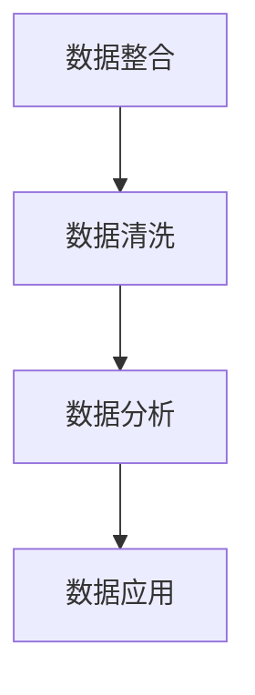
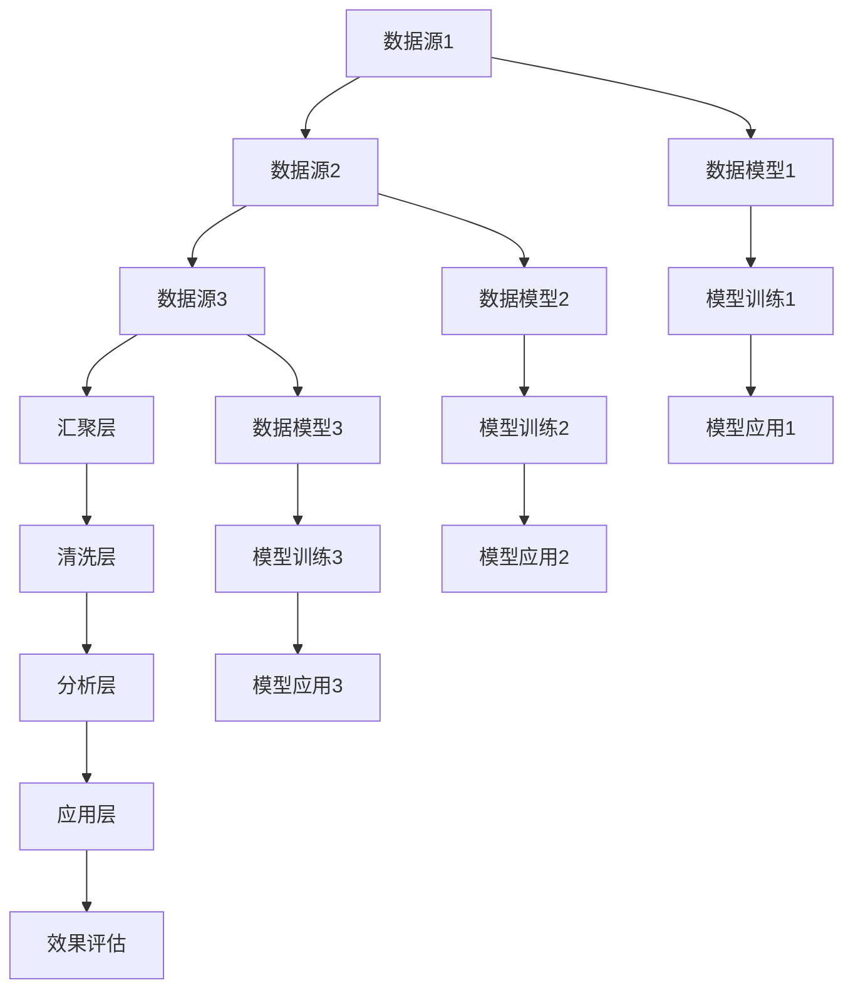
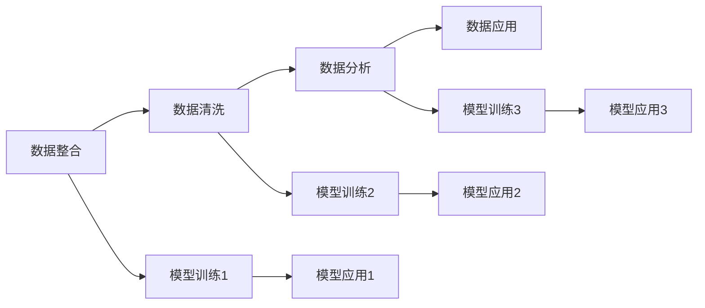
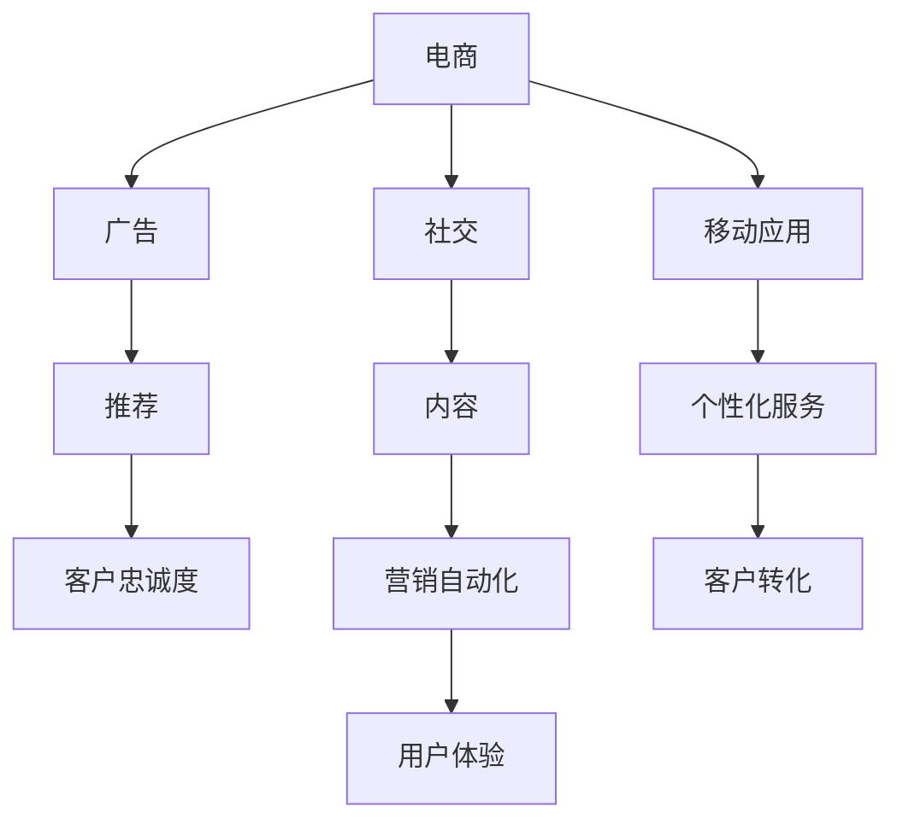
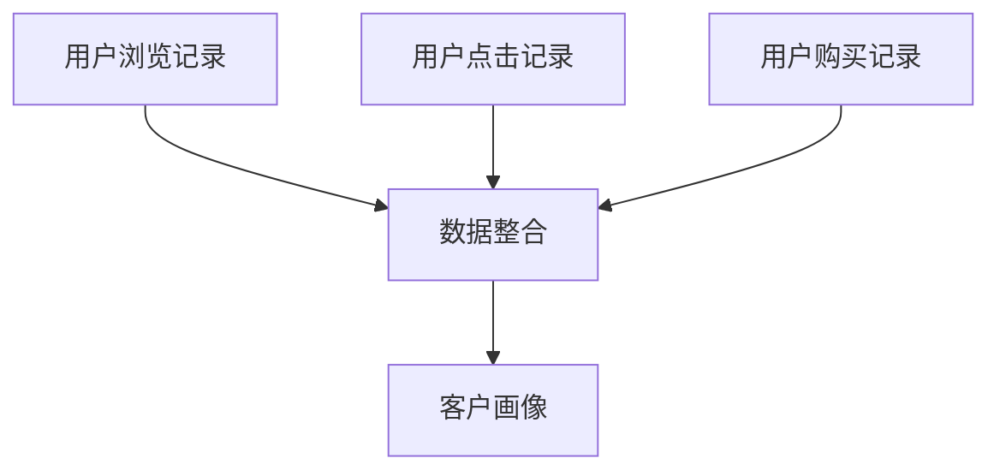
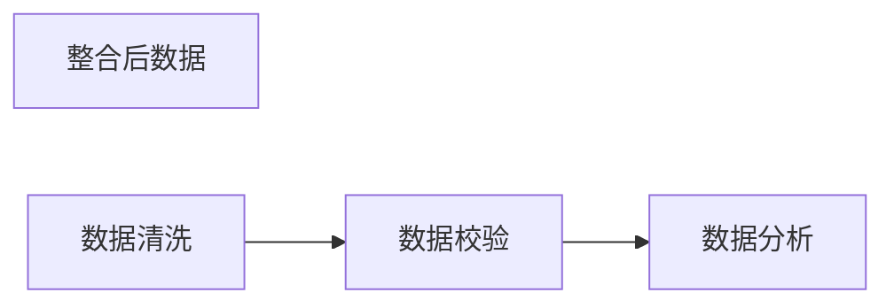
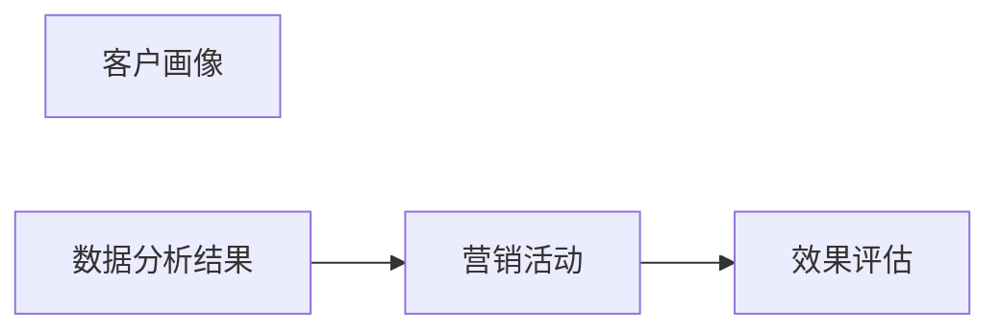
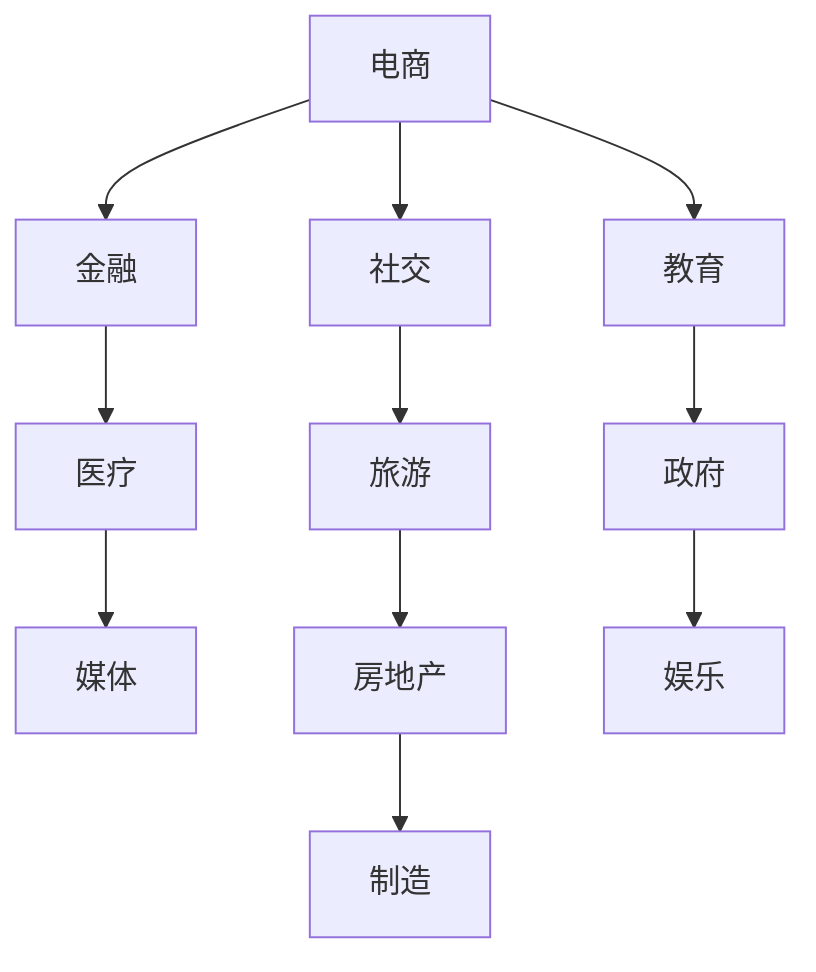

                 

# AI DMP 数据基建：构建数据驱动的营销生态

## 1. 背景介绍

在数字化营销的浪潮下，数据驱动的个性化营销成为了推动企业增长的关键驱动力。然而，在现有广告投放机制中，客户数据分散在各个渠道，且数据质量参差不齐，难以形成统一、完整且高价值的数据资产。为了解决这一问题，人工智能驱动的数据管理平台（AI Data Management Platform, AI DMP）应运而生。AI DMP通过汇聚、清洗、整合和分析数据，构建高价值的数据资产，为营销活动提供数据支撑，推动客户从兴趣到转化。

### 1.1 问题由来
随着互联网的普及，客户在各个数字渠道上的行为数据不断增加，这为营销活动带来了丰富的数据来源。然而，数据的分散性、多样性和真实性给数据整合带来了巨大的挑战：

1. **数据分散**：客户数据分散在电商平台、社交媒体、网站、移动应用等多个渠道，难以形成统一的数据资产。
2. **数据多样性**：客户数据类型多样，包括浏览历史、搜索记录、点击行为、购买记录等，需要统一的规范和处理。
3. **数据真实性**：数据质量参差不齐，存在噪音、重复和缺失等问题，需要清洗和校验。
4. **客户理解**：客户画像难以准确刻画，客户兴趣、行为和转化过程的关联复杂。

为了解决这些问题，AI DMP应运而生。通过整合多源数据，构建统一的客户画像，AI DMP为营销活动提供了高效、准确的客户数据。

### 1.2 问题核心关键点
AI DMP的核心目标是通过数据整合和分析，构建高价值的数据资产，提升营销活动的精准度和效果。其核心包括：

- **数据整合**：汇聚多源数据，构建统一的客户画像。
- **数据清洗**：消除数据噪音和异常，提升数据质量。
- **数据分析**：利用AI技术进行深度分析，提取有价值的客户洞察。
- **数据应用**：将分析结果应用于营销活动，提升效果和ROI。

AI DMP的构建过程涉及数据处理、模型训练、算法应用等多个环节，如图1所示。



## 2. 核心概念与联系

### 2.1 核心概念概述

AI DMP的核心概念主要包括以下几个方面：

- **数据整合**：将不同来源的数据汇聚到一个统一的数据平台，构建统一的客户画像。
- **数据清洗**：对汇聚的数据进行清洗和校验，消除数据噪音和异常。
- **数据分析**：利用AI技术进行深度分析，提取有价值的客户洞察。
- **数据应用**：将分析结果应用于营销活动，提升效果和ROI。
- **模型训练**：构建和训练AI模型，为数据整合和分析提供技术支撑。
- **算法应用**：应用各种算法，提升数据整合和分析的效率和效果。

### 2.2 核心概念原理和架构的 Mermaid 流程图

以下是一个简单的Mermaid流程图，展示了AI DMP的核心架构和关键环节：



### 2.3 核心概念的联系

AI DMP的核心概念之间存在紧密联系，如图2所示。



通过汇聚、清洗、分析和应用数据，AI DMP为营销活动提供了精准、高效的数据支撑。同时，AI模型的训练和应用也进一步提升了数据整合和分析的效果。

## 3. 核心算法原理 & 具体操作步骤
### 3.1 算法原理概述

AI DMP的核心算法原理主要包括以下几个方面：

- **数据整合算法**：利用大数据技术，将不同来源的数据汇聚到一个统一的数据平台。
- **数据清洗算法**：应用数据清洗技术，消除数据噪音和异常，提升数据质量。
- **数据分析算法**：利用AI技术进行深度分析，提取有价值的客户洞察。
- **数据应用算法**：将分析结果应用于营销活动，提升效果和ROI。

### 3.2 算法步骤详解

以下是AI DMP的主要算法步骤详解：

**Step 1: 数据收集**
- 通过API接口、爬虫等方式，从不同渠道收集客户数据，包括浏览历史、搜索记录、点击行为、购买记录等。
- 通过数据仓库或分布式存储系统，存储和管理收集到的数据。

**Step 2: 数据整合**
- 利用大数据技术，对收集到的数据进行整合和统一。
- 对数据进行去重、合并和关联，构建统一的客户画像。
- 通过ETL工具进行数据转换，保证数据格式一致。

**Step 3: 数据清洗**
- 对整合后的数据进行清洗和校验，消除数据噪音和异常。
- 应用数据清洗算法，如数据去重、异常值处理、缺失值填补等。
- 通过可视化工具，检查数据质量，保证数据完整性和准确性。

**Step 4: 数据分析**
- 利用AI技术进行深度分析，提取有价值的客户洞察。
- 应用机器学习算法，如聚类、分类、回归等，构建客户画像和行为模型。
- 通过分析模型，提取客户的兴趣、行为和转化过程的关联。

**Step 5: 数据应用**
- 将分析结果应用于营销活动，提升效果和ROI。
- 应用推荐算法，生成个性化的广告推荐。
- 应用预测算法，预测客户行为和转化，优化营销策略。

### 3.3 算法优缺点

AI DMP的算法具有以下优点：

- **高效整合**：能够高效汇聚多源数据，构建统一的客户画像。
- **准确分析**：利用AI技术进行深度分析，提取有价值的客户洞察。
- **提升效果**：将分析结果应用于营销活动，提升效果和ROI。

同时，AI DMP的算法也存在一些缺点：

- **数据隐私**：需要汇聚大量数据，可能涉及用户隐私问题。
- **数据噪音**：数据质量参差不齐，存在噪音和异常，需要额外的清洗和校验。
- **算法复杂性**：算法实现复杂，需要丰富的数据科学和AI技术背景。
- **资源消耗**：需要大量的计算资源和存储空间，成本较高。

### 3.4 算法应用领域

AI DMP在多个领域得到了广泛应用，如图3所示。



## 4. 数学模型和公式 & 详细讲解 & 举例说明

### 4.1 数学模型构建

AI DMP的数学模型主要包括以下几个方面：

- **数据整合模型**：利用大数据技术，将不同来源的数据汇聚到一个统一的数据平台。
- **数据清洗模型**：应用数据清洗技术，消除数据噪音和异常，提升数据质量。
- **数据分析模型**：利用AI技术进行深度分析，提取有价值的客户洞察。
- **数据应用模型**：将分析结果应用于营销活动，提升效果和ROI。

### 4.2 公式推导过程

以下是AI DMP的一些核心公式推导过程：

**数据整合模型**：

设 $D_1, D_2, \ldots, D_n$ 为不同来源的数据集，$X$ 为整合后的数据集。整合过程可以用公式表示为：

$$
X = f(D_1, D_2, \ldots, D_n)
$$

其中 $f$ 为数据整合算法，包括数据去重、合并和关联等操作。

**数据清洗模型**：

设 $D$ 为原始数据集，$D'$ 为清洗后的数据集。数据清洗过程可以用公式表示为：

$$
D' = g(D)
$$

其中 $g$ 为数据清洗算法，包括数据去重、异常值处理、缺失值填补等操作。

**数据分析模型**：

设 $D$ 为原始数据集，$A$ 为分析结果。数据分析过程可以用公式表示为：

$$
A = h(D)
$$

其中 $h$ 为数据分析算法，包括机器学习算法、聚类算法、分类算法等。

**数据应用模型**：

设 $A$ 为分析结果，$M$ 为营销活动。数据应用过程可以用公式表示为：

$$
M = k(A)
$$

其中 $k$ 为数据应用算法，包括推荐算法、预测算法等。

### 4.3 案例分析与讲解

以下是一个简单的案例，展示AI DMP的应用过程：

假设某电商企业收集了用户在不同电商平台上的浏览、点击和购买记录。通过数据整合，构建统一的客户画像，如图4所示。



然后，对整合后的数据进行清洗和校验，消除数据噪音和异常。通过数据分析，提取有价值的客户洞察，如图5所示。



最后，将分析结果应用于营销活动，提升效果和ROI，如图6所示。



## 5. 项目实践：代码实例和详细解释说明

### 5.1 开发环境搭建

在进行AI DMP的开发前，我们需要准备好开发环境。以下是使用Python进行PyTorch开发的环境配置流程：

1. 安装Anaconda：从官网下载并安装Anaconda，用于创建独立的Python环境。

2. 创建并激活虚拟环境：
```bash
conda create -n pytorch-env python=3.8 
conda activate pytorch-env
```

3. 安装PyTorch：根据CUDA版本，从官网获取对应的安装命令。例如：
```bash
conda install pytorch torchvision torchaudio cudatoolkit=11.1 -c pytorch -c conda-forge
```

4. 安装TensorFlow：从官网下载并配置安装TensorFlow。

5. 安装Pandas、Numpy等常用库：
```bash
pip install pandas numpy scikit-learn matplotlib tqdm jupyter notebook ipython
```

完成上述步骤后，即可在`pytorch-env`环境中开始AI DMP的开发实践。

### 5.2 源代码详细实现

下面我们以推荐系统为例，给出使用PyTorch对AI DMP进行开发的PyTorch代码实现。

首先，定义推荐系统的数据处理函数：

```python
import pandas as pd
import numpy as np
import torch
from torch.utils.data import Dataset, DataLoader

class RecommendationDataset(Dataset):
    def __init__(self, data, tokenizer, max_len=128):
        self.data = data
        self.tokenizer = tokenizer
        self.max_len = max_len
        
    def __len__(self):
        return len(self.data)
    
    def __getitem__(self, item):
        title = self.data['title'][item]
        description = self.data['description'][item]
        tokens = self.tokenizer(title + ' ' + description, return_tensors='pt', max_length=self.max_len, padding='max_length', truncation=True)
        input_ids = tokens['input_ids'][0]
        attention_mask = tokens['attention_mask'][0]
        return {
            'input_ids': input_ids,
            'attention_mask': attention_mask,
            'targets': torch.tensor(self.data['target'][item], dtype=torch.long)
        }
```

然后，定义模型和优化器：

```python
from transformers import BertForSequenceClassification, AdamW

model = BertForSequenceClassification.from_pretrained('bert-base-cased', num_labels=2)

optimizer = AdamW(model.parameters(), lr=2e-5)
```

接着，定义训练和评估函数：

```python
from sklearn.metrics import accuracy_score

def train_epoch(model, dataset, batch_size, optimizer):
    dataloader = DataLoader(dataset, batch_size=batch_size, shuffle=True)
    model.train()
    epoch_loss = 0
    for batch in dataloader:
        input_ids = batch['input_ids'].to(device)
        attention_mask = batch['attention_mask'].to(device)
        targets = batch['targets'].to(device)
        model.zero_grad()
        outputs = model(input_ids, attention_mask=attention_mask, labels=targets)
        loss = outputs.loss
        epoch_loss += loss.item()
        loss.backward()
        optimizer.step()
    return epoch_loss / len(dataloader)

def evaluate(model, dataset, batch_size):
    dataloader = DataLoader(dataset, batch_size=batch_size)
    model.eval()
    preds, labels = [], []
    with torch.no_grad():
        for batch in dataloader:
            input_ids = batch['input_ids'].to(device)
            attention_mask = batch['attention_mask'].to(device)
            targets = batch['targets'].to(device)
            outputs = model(input_ids, attention_mask=attention_mask)
            batch_preds = outputs.logits.argmax(dim=2).to('cpu').tolist()
            batch_labels = targets.to('cpu').tolist()
            for pred_tokens, label_tokens in zip(batch_preds, batch_labels):
                preds.append(pred_tokens[:len(label_tokens)])
                labels.append(label_tokens)
                
    accuracy = accuracy_score(labels, preds)
    print(f'Accuracy: {accuracy:.2f}')
```

最后，启动训练流程并在测试集上评估：

```python
epochs = 5
batch_size = 16

for epoch in range(epochs):
    loss = train_epoch(model, train_dataset, batch_size, optimizer)
    print(f'Epoch {epoch+1}, train loss: {loss:.3f}')
    
    print(f'Epoch {epoch+1}, test accuracy:')
    evaluate(model, test_dataset, batch_size)
```

以上就是使用PyTorch对AI DMP进行推荐系统开发的完整代码实现。可以看到，借助PyTorch和Transformers库，构建AI DMP的推荐系统相对简单高效。

### 5.3 代码解读与分析

让我们再详细解读一下关键代码的实现细节：

**RecommendationDataset类**：
- `__init__`方法：初始化训练集数据、分词器等关键组件。
- `__len__`方法：返回数据集的样本数量。
- `__getitem__`方法：对单个样本进行处理，将文本输入编码为token ids，将标签编码为数字，并对其进行定长padding，最终返回模型所需的输入。

**模型和优化器**：
- 选择合适的预训练语言模型 `BertForSequenceClassification`，作为推荐模型的初始化参数。
- 使用AdamW优化器，设置学习率。

**训练和评估函数**：
- 使用PyTorch的DataLoader对数据集进行批次化加载，供模型训练和推理使用。
- 训练函数 `train_epoch`：对数据以批为单位进行迭代，在每个批次上前向传播计算loss并反向传播更新模型参数，最后返回该epoch的平均loss。
- 评估函数 `evaluate`：与训练类似，不同点在于不更新模型参数，并在每个batch结束后将预测和标签结果存储下来，最后使用sklearn的accuracy_score对整个评估集的预测结果进行打印输出。

**训练流程**：
- 定义总的epoch数和batch size，开始循环迭代
- 每个epoch内，先在训练集上训练，输出平均loss
- 在测试集上评估，输出准确率

可以看到，PyTorch配合Transformers库使得AI DMP的推荐系统开发变得简洁高效。开发者可以将更多精力放在数据处理、模型改进等高层逻辑上，而不必过多关注底层的实现细节。

当然，工业级的系统实现还需考虑更多因素，如模型的保存和部署、超参数的自动搜索、更灵活的任务适配层等。但核心的推荐算法基本与此类似。

## 6. 实际应用场景

### 6.1 智能推荐系统

AI DMP的推荐系统能够根据用户的历史行为数据，实时生成个性化的广告推荐。通过汇聚用户在不同渠道上的数据，构建统一的客户画像，AI DMP能够精确地捕捉用户的兴趣和行为模式，提升广告推荐的精准度和效果。

在技术实现上，可以收集用户浏览、点击、购买等行为数据，构建用户画像。在推荐模型中，输入用户画像和广告内容，输出推荐的广告序列。通过不断地优化推荐算法和模型，AI DMP能够实现实时推荐，提升广告的点击率和转化率。

### 6.2 广告投放优化

AI DMP的广告投放优化功能能够根据用户的兴趣和行为数据，优化广告的投放策略和预算分配。通过汇聚用户的浏览、点击和购买数据，构建准确的客户画像，AI DMP能够实时预测用户的点击概率和转化率。

在广告投放过程中，根据预测结果，动态调整广告投放策略和预算分配，提升广告的ROI。同时，AI DMP还能对广告的展示效果进行实时监测和优化，确保广告的投放效果最大化。

### 6.3 客户分群与营销自动化

AI DMP的客户分群功能能够根据用户的兴趣和行为数据，将用户分成不同的群体，进行个性化的营销活动。通过汇聚用户在不同渠道上的数据，构建统一的客户画像，AI DMP能够将用户分成不同的群体，为每个群体定制个性化的营销方案。

在客户分群的基础上，AI DMP能够自动化执行营销活动，包括邮件营销、短信营销、社交媒体营销等。通过实时监测和分析营销活动的效果，AI DMP能够优化营销策略，提升客户转化率。

### 6.4 未来应用展望

随着AI DMP技术的不断发展，未来将在更多领域得到应用，如图7所示。



## 7. 工具和资源推荐

### 7.1 学习资源推荐

为了帮助开发者系统掌握AI DMP的理论基础和实践技巧，这里推荐一些优质的学习资源：

1. 《AI DMP技术与应用》系列博文：由AI DMP技术专家撰写，深入浅出地介绍了AI DMP的原理、技术栈和应用场景。

2. 《大数据与机器学习》课程：斯坦福大学开设的大数据与机器学习课程，系统介绍了大数据技术、机器学习算法和AI DMP的基础知识。

3. 《AI DMP实战指南》书籍：详细介绍了AI DMP的构建过程、算法实现和应用实践，适合实战型开发者阅读。

4. Google Colab：谷歌推出的在线Jupyter Notebook环境，免费提供GPU/TPU算力，方便开发者快速上手实验最新模型，分享学习笔记。

5. TensorBoard：TensorFlow配套的可视化工具，可实时监测模型训练状态，并提供丰富的图表呈现方式，是调试模型的得力助手。

通过这些资源的学习实践，相信你一定能够快速掌握AI DMP的精髓，并用于解决实际的营销问题。

### 7.2 开发工具推荐

高效的开发离不开优秀的工具支持。以下是几款用于AI DMP开发的常用工具：

1. PyTorch：基于Python的开源深度学习框架，灵活动态的计算图，适合快速迭代研究。

2. TensorFlow：由Google主导开发的开源深度学习框架，生产部署方便，适合大规模工程应用。

3. Transformers库：HuggingFace开发的NLP工具库，集成了众多SOTA语言模型，支持PyTorch和TensorFlow，是进行AI DMP开发的利器。

4. Weights & Biases：模型训练的实验跟踪工具，可以记录和可视化模型训练过程中的各项指标，方便对比和调优。

5. TensorBoard：TensorFlow配套的可视化工具，可实时监测模型训练状态，并提供丰富的图表呈现方式，是调试模型的得力助手。

合理利用这些工具，可以显著提升AI DMP的开发效率，加快创新迭代的步伐。

### 7.3 相关论文推荐

AI DMP相关技术的不断发展得益于学界的持续研究。以下是几篇奠基性的相关论文，推荐阅读：

1. "The Data Management Platform for Marketing"：由Adobe公司提出的AI DMP概念，详细介绍了AI DMP的功能和技术架构。

2. "AI DMP: A Survey on Data Management Platforms"：综述了AI DMP的相关研究和应用，介绍了AI DMP的技术栈和应用场景。

3. "AI DMP in Recommendation Systems"：介绍AI DMP在推荐系统中的应用，详细讨论了AI DMP如何提升推荐效果。

4. "Deep Learning in AI DMP"：讨论了深度学习技术在AI DMP中的应用，包括数据整合、数据清洗和数据分析等环节。

这些论文代表了大规模数据管理技术的发展脉络。通过学习这些前沿成果，可以帮助研究者把握学科前进方向，激发更多的创新灵感。

## 8. 总结：未来发展趋势与挑战

### 8.1 总结

本文对AI DMP的数据基建进行了全面系统的介绍。首先阐述了AI DMP的背景和重要性，明确了其构建过程和核心概念。其次，从原理到实践，详细讲解了AI DMP的数学模型和算法步骤，给出了AI DMP的代码实例。同时，本文还探讨了AI DMP在推荐系统、广告投放优化、客户分群与营销自动化等实际应用场景中的应用，展示了AI DMP的广泛应用前景。此外，本文精选了AI DMP的学习资源和开发工具，力求为读者提供全方位的技术指引。

通过本文的系统梳理，可以看到，AI DMP在营销活动中扮演着越来越重要的角色，成为数据驱动营销的重要基础设施。AI DMP的构建过程涉及数据整合、清洗、分析和应用等多个环节，需要综合运用大数据技术、机器学习算法和AI技术，以构建高价值的数据资产，提升营销活动的效果和ROI。

### 8.2 未来发展趋势

展望未来，AI DMP技术将呈现以下几个发展趋势：

1. **数据规模持续增大**：随着数据量的不断增加，AI DMP将汇聚更多来源、更多维度的数据，构建更全面、更精准的客户画像。

2. **算法复杂度提高**：随着算法的不断进步，AI DMP将应用更复杂的算法，如深度学习、强化学习等，提升数据整合和分析的效果。

3. **实时性提升**：AI DMP将进一步提升实时性，实现数据的高效汇聚、清洗和分析，提供实时营销决策支持。

4. **跨领域应用拓展**：AI DMP将不仅应用于营销领域，还将拓展到金融、医疗、教育等多个领域，提升这些领域的数字化水平。

5. **智能化程度提高**：AI DMP将结合更多的AI技术，如因果推断、知识图谱等，提升智能化的水平，实现更加精准的客户洞察。

6. **隐私保护加强**：AI DMP将更加注重用户隐私保护，采用隐私计算、匿名化等技术，确保数据的安全性和合规性。

### 8.3 面临的挑战

尽管AI DMP技术已经取得了瞩目成就，但在迈向更加智能化、普适化应用的过程中，它仍面临着诸多挑战：

1. **数据隐私**：AI DMP需要汇聚大量数据，可能涉及用户隐私问题，如何保护用户隐私是一个重要的挑战。

2. **数据质量**：数据质量参差不齐，存在噪音、重复和缺失等问题，需要进一步清洗和校验。

3. **算法复杂性**：算法实现复杂，需要丰富的数据科学和AI技术背景，如何降低算法复杂度，提高算法的可解释性是一个重要问题。

4. **资源消耗**：AI DMP需要大量的计算资源和存储空间，成本较高，如何优化资源消耗是一个重要问题。

5. **模型泛化**：AI DMP需要保证模型在不同场景下的泛化能力，如何提高模型的泛化性是一个重要问题。

6. **用户接受度**：AI DMP需要获得用户的信任和接受，如何提升用户的接受度是一个重要问题。

### 8.4 研究展望

面对AI DMP面临的种种挑战，未来的研究需要在以下几个方面寻求新的突破：

1. **无监督和半监督学习**：摆脱对大规模标注数据的依赖，利用自监督学习、主动学习等无监督和半监督范式，最大限度利用非结构化数据，实现更加灵活高效的AI DMP。

2. **跨模态学习**：将符号化的先验知识，如知识图谱、逻辑规则等，与神经网络模型进行巧妙融合，提升AI DMP的数据整合和分析能力。

3. **实时处理技术**：利用流计算、分布式计算等技术，提升AI DMP的实时处理能力，实现数据的高效汇聚、清洗和分析。

4. **可解释性技术**：引入因果推断、博弈论等工具，增强AI DMP的解释性和可理解性，确保模型的决策过程透明、可解释。

5. **隐私保护技术**：利用隐私计算、差分隐私等技术，保护用户隐私，确保数据的安全性和合规性。

6. **用户交互技术**：结合人工智能和人类智慧，提升用户交互体验，确保AI DMP的智能化水平。

这些研究方向的探索，必将引领AI DMP技术迈向更高的台阶，为数据驱动的营销活动提供更精准、高效的支撑，提升企业的竞争力和市场地位。

## 9. 附录：常见问题与解答

**Q1：AI DMP是否适用于所有行业？**

A: AI DMP在大多数行业中都能取得不错的效果，特别是对于数据量较大、客户数据分散的行业。但对于一些特定领域的行业，如金融、医疗等，AI DMP需要结合领域特定的数据处理方式和算法模型，才能取得理想的效果。

**Q2：如何保证AI DMP的数据质量？**

A: 数据质量是AI DMP的基础，需要通过数据清洗和校验来提升。具体措施包括：
1. 数据去重：去除重复的数据，避免冗余。
2. 异常值处理：识别并处理异常值，确保数据的真实性。
3. 缺失值填补：填补缺失值，确保数据的完整性。
4. 数据校验：通过数据校验工具，确保数据的正确性和一致性。

**Q3：AI DMP的算法复杂度如何？**

A: AI DMP的算法复杂度较高，需要综合运用大数据技术、机器学习算法和AI技术。具体来说，包括数据整合、数据清洗、数据分析和数据应用等多个环节。

**Q4：AI DMP的资源消耗有哪些？**

A: AI DMP需要大量的计算资源和存储空间，包括数据存储、模型训练和推理的资源消耗。具体来说，包括：
1. 数据存储：需要存储原始数据和处理后的数据。
2. 模型训练：需要大量的计算资源进行模型训练。
3. 模型推理：需要计算资源进行模型推理和实时响应。

**Q5：AI DMP的应用场景有哪些？**

A: AI DMP在多个领域得到了广泛应用，包括电商、广告、金融、医疗、媒体、社交、旅游、房地产、制造、教育、政府、娱乐等。具体应用场景包括：
1. 智能推荐系统：根据用户行为数据，生成个性化的广告推荐。
2. 广告投放优化：根据用户兴趣和行为数据，优化广告的投放策略和预算分配。
3. 客户分群与营销自动化：根据用户行为数据，将用户分成不同的群体，进行个性化的营销活动。
4. 实时广告投放：结合实时数据和用户行为，进行实时广告投放。

通过本文的系统梳理，可以看到，AI DMP在数据驱动的营销活动中扮演着越来越重要的角色。AI DMP的构建过程涉及数据整合、清洗、分析和应用等多个环节，需要综合运用大数据技术、机器学习算法和AI技术，以构建高价值的数据资产，提升营销活动的效果和ROI。未来，随着技术的不断进步，AI DMP将进一步提升实时性、智能化水平和隐私保护能力，成为数据驱动营销的重要基础设施。

---

作者：禅与计算机程序设计艺术 / Zen and the Art of Computer Programming

