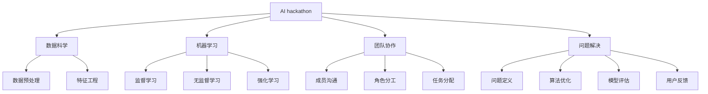

                 

# AI hackathon的能量与创造力

> 关键词：AI hackathon, 创新, 团队协作, 数据科学, 机器学习, 问题解决, 创造力, 竞争, 人工智能, 技术社区

## 1. 背景介绍

### 1.1 问题由来
AI hackathon作为一种新型的技术竞赛模式，近年来在科技界大放异彩。相较于传统的编程比赛，AI hackathon更侧重于在限定时间内解决具有实际应用意义的问题，并通过模型优化、算法创新等方式实现最优解决方案。

### 1.2 问题核心关键点
AI hackathon的核心在于将技术解决方案与实际问题紧密结合，通过团队协作，在短时间内产出高质量的AI应用原型。关键点包括：

- 限定时间：AI hackathon通常为期1-3天，对团队的技术储备和快速迭代能力要求极高。
- 数据驱动：问题的解决依赖于高质量的数据集，数据预处理、特征工程等数据科学技能成为关键。
- 算法创新：AI算法在hackathon中往往需要做出创新，新颖的模型结构和算法设计将决定竞赛结果。
- 团队协作：团队成员之间的技术互补、协同作战是成功的重要保障。
- 问题解决：任务一般涉及实际应用场景，如金融风控、医疗诊断、智能制造等，解决方案的实际价值成为评估标准。

## 2. 核心概念与联系

### 2.1 核心概念概述

为更好理解AI hackathon的内在逻辑和操作流程，我们首先介绍几个核心概念：

- AI hackathon：以技术挑战赛的形式，将AI技术与实际问题结合，鼓励团队在限定时间内创新求解。
- 数据科学：涉及数据预处理、特征工程、模型训练等环节，是AI竞赛中的重要组成部分。
- 机器学习：算法创新的核心技术，包括监督学习、无监督学习、强化学习等多种方式。
- 团队协作：多学科背景、技能互补的团队结构，是AI hackathon中高效工作的关键。
- 问题解决：将技术方法应用到实际问题中，实现算法优化、模型评估、用户反馈迭代等全流程闭环。

这些概念之间的逻辑关系可以通过以下Mermaid流程图来展示：



这个流程图展示出AI hackathon的核心逻辑：

1. 通过数据科学环节进行数据处理和特征提取，为模型训练提供高质量输入。
2. 机器学习算法是核心技术，用于构建和优化模型。
3. 团队协作是保证高效工作的关键，包括沟通、分工和任务分配。
4. 问题解决贯穿始终，包括问题定义、算法优化、模型评估和用户反馈。

## 3. 核心算法原理 & 具体操作步骤

### 3.1 算法原理概述

AI hackathon的核心在于如何在有限的时间内构建高效、准确的AI模型。其算法原理可以概括为以下几个步骤：

1. **数据准备**：对竞赛提供的数据集进行清洗、处理和特征工程，确保数据质量和可用性。
2. **模型构建**：选择合适的机器学习算法和模型结构，进行模型搭建和初始化。
3. **训练优化**：通过梯度下降等优化算法进行模型训练，调整超参数，提高模型精度。
4. **评估验证**：在验证集上评估模型性能，通过交叉验证、AUC曲线等手段进行模型选择。
5. **算法创新**：在模型优化过程中引入新的算法和技术，提升模型效果。
6. **结果展示**：将模型部署为可视化、可交互的演示原型，展示模型预测效果和创新点。

### 3.2 算法步骤详解

以下详细介绍AI hackathon中的常见算法步骤：

**Step 1: 数据准备**

数据准备是AI hackathon中的关键步骤，包括数据清洗、特征工程和数据集划分。

- **数据清洗**：删除缺失值、异常值，处理重复数据，确保数据集的一致性和完整性。
- **特征工程**：选择合适的特征，并进行归一化、标准化、编码等处理，提取有意义的特征表示。
- **数据集划分**：将数据集分为训练集、验证集和测试集，确保模型评估和测试的独立性。

**Step 2: 模型构建**

模型构建包括选择合适的算法和模型结构，进行模型搭建和初始化。

- **算法选择**：根据任务特点选择监督学习、无监督学习或强化学习等算法。
- **模型结构**：设计模型架构，如线性回归、决策树、神经网络等。
- **超参数设置**：选择合适的学习率、正则化参数、批次大小等超参数。

**Step 3: 训练优化**

模型训练是通过优化算法进行模型参数的调整，以提高模型精度。

- **梯度下降**：使用梯度下降算法更新模型参数，最小化损失函数。
- **超参数调优**：通过交叉验证、网格搜索等手段调整超参数，选择最优模型。
- **正则化**：引入L2正则、Dropout等正则化技术，防止过拟合。

**Step 4: 评估验证**

模型评估是通过验证集对模型性能进行评估和验证。

- **交叉验证**：使用K折交叉验证，评估模型在不同子集上的表现。
- **AUC曲线**：绘制ROC曲线，评估模型在不同阈值下的性能。
- **模型选择**：选择最优模型进行下一步测试。

**Step 5: 算法创新**

算法创新是通过引入新算法和技术，进一步提升模型效果。

- **算法融合**：融合多种算法，如集成学习、堆叠等，提升模型鲁棒性。
- **数据增强**：通过数据扩充、对抗样本等技术，增加模型泛化能力。
- **模型融合**：通过模型融合技术，如Stacking、Ensemble等，提升模型精度。

**Step 6: 结果展示**

结果展示是将模型部署为可视化、可交互的原型，展示模型预测效果和创新点。

- **可视化展示**：将模型预测结果可视化，展示模型的输出效果。
- **交互式原型**：开发交互式原型，让用户可以输入数据并查看模型预测结果。
- **用户反馈**：收集用户反馈，进一步优化模型和演示效果。

### 3.3 算法优缺点

AI hackathon中的算法具有以下优点：

- 创新性强：团队可以自由选择和尝试各种算法，鼓励创新。
- 资源丰富：提供各类工具和资源，如在线开发环境、开源库等，便于快速迭代。
- 时效性强：在限定时间内完成，能够快速将技术转化为实际应用。

但同时也有以下缺点：

- 时间压力：在限定时间内完成所有步骤，时间紧张，容易忽视细节。
- 数据质量：竞赛数据集质量可能不稳定，对算法效果有一定影响。
- 团队协作：团队成员之间缺乏充分沟通，可能出现协作不顺畅的情况。
- 评估标准：竞赛的评估标准可能不完全反映实际应用效果，影响决策。

### 3.4 算法应用领域

AI hackathon的应用领域广泛，包括但不限于以下几个方面：

- **金融风控**：构建基于机器学习的信用评分、风险预测等模型，提高金融机构的决策效率。
- **医疗诊断**：开发基于深度学习的疾病诊断、影像分析等应用，提升医疗服务的精准性和便捷性。
- **智能制造**：利用AI算法优化生产流程，提高产品质量和生产效率。
- **智能推荐**：构建个性化推荐系统，提供更符合用户需求的推荐内容，提升用户体验。
- **自然语言处理**：开发文本分类、情感分析、机器翻译等应用，提升自然语言处理能力。

## 4. 数学模型和公式 & 详细讲解 & 举例说明

### 4.1 数学模型构建

以下以一个简单的分类问题为例，详细介绍AI hackathon中的数学模型构建。

假设问题为二分类问题，模型为线性回归模型，数据集为 $(x_i, y_i)$，其中 $x_i \in \mathbb{R}^n, y_i \in \{0,1\}$。

定义模型的损失函数为交叉熵损失：

$$
L(y,\hat{y}) = -(y\log \hat{y} + (1-y)\log(1-\hat{y}))
$$

则经验风险为：

$$
\mathcal{L}(\theta) = \frac{1}{N} \sum_{i=1}^N L(y_i, \hat{y}_i)
$$

其中 $\theta$ 为模型参数，$\hat{y}_i$ 为模型预测值。

模型的预测值为：

$$
\hat{y}_i = \frac{1}{1+\exp(-z_i)}
$$

其中 $z_i = \theta^T x_i$。

### 4.2 公式推导过程

模型训练的目标是最小化经验风险，即求解：

$$
\theta^* = \mathop{\arg\min}_{\theta} \mathcal{L}(\theta)
$$

根据链式法则，损失函数对 $\theta$ 的梯度为：

$$
\nabla_{\theta}\mathcal{L}(\theta) = \frac{1}{N} \sum_{i=1}^N (\hat{y}_i - y_i) \nabla_{\theta} \hat{y}_i
$$

将 $\hat{y}_i$ 表达式代入，得：

$$
\nabla_{\theta}\mathcal{L}(\theta) = \frac{1}{N} \sum_{i=1}^N (\hat{y}_i - y_i) \frac{\exp(-z_i)}{(1+\exp(-z_i))^2} \nabla_{\theta}z_i
$$

进一步化简，得：

$$
\nabla_{\theta}\mathcal{L}(\theta) = \frac{1}{N} \sum_{i=1}^N (\hat{y}_i - y_i) x_i
$$

通过梯度下降算法，更新模型参数：

$$
\theta \leftarrow \theta - \eta \nabla_{\theta}\mathcal{L}(\theta)
$$

其中 $\eta$ 为学习率。

### 4.3 案例分析与讲解

以下通过一个实际案例，详细讲解AI hackathon中数学模型的构建和优化过程。

假设任务为金融风控，目标预测用户是否违约，训练集为10,000条历史贷款记录，其中80%用于训练，20%用于验证。

1. **数据准备**：对贷款记录进行清洗和特征工程，提取用户基本信息、贷款金额、还款记录等特征，并进行归一化处理。
2. **模型构建**：选择逻辑回归模型，定义损失函数为交叉熵损失。
3. **训练优化**：使用梯度下降算法，最小化损失函数，调整学习率、正则化参数等超参数。
4. **评估验证**：在验证集上评估模型性能，通过AUC曲线选择最优模型。
5. **算法创新**：引入集成学习技术，提升模型鲁棒性。
6. **结果展示**：将模型封装为API接口，展示模型预测效果。

## 5. 项目实践：代码实例和详细解释说明

### 5.1 开发环境搭建

要进行AI hackathon项目开发，首先需要搭建开发环境。以下是在Python中搭建开发环境的步骤：

1. **安装Python和相关库**：安装Python 3.x版本，并使用pip安装必要的库，如NumPy、SciPy、Pandas等。
2. **配置开发环境**：在Python环境中配置Jupyter Notebook或其他IDE。
3. **安装AI库**：安装TensorFlow、Keras、Scikit-learn等AI库，便于快速实现模型和算法。

### 5.2 源代码详细实现

以下是一个简单的分类问题的Python代码实现，供读者参考：

```python
import numpy as np
import pandas as pd
from sklearn.model_selection import train_test_split
from sklearn.linear_model import LogisticRegression
from sklearn.metrics import roc_auc_score

# 数据加载
data = pd.read_csv('loan_data.csv')
X = data[['age', 'income', 'loan_amount']]
y = data['default']
X_train, X_test, y_train, y_test = train_test_split(X, y, test_size=0.2, random_state=42)

# 模型训练
model = LogisticRegression()
model.fit(X_train, y_train)

# 模型评估
y_pred = model.predict_proba(X_test)[:, 1]
auc = roc_auc_score(y_test, y_pred)
print('AUC: {:.3f}'.format(auc))

# 模型优化
model.set_params(C=1.0, penalty='l2', solver='liblinear')
model.fit(X_train, y_train)

# 模型评估
y_pred = model.predict_proba(X_test)[:, 1]
auc = roc_auc_score(y_test, y_pred)
print('AUC: {:.3f}'.format(auc))
```

### 5.3 代码解读与分析

上述代码实现了一个简单的线性回归模型，并进行了模型评估和优化。

1. **数据加载**：使用Pandas库读取数据，并从中选择特征和目标变量。
2. **模型训练**：使用Scikit-learn库中的LogisticRegression模型进行模型训练，设定初始化参数和损失函数。
3. **模型评估**：使用ROC曲线计算AUC值，评估模型性能。
4. **模型优化**：调整模型超参数，如正则化参数C、惩罚类型等。
5. **模型评估**：重新评估模型性能，验证优化效果。

## 6. 实际应用场景

### 6.1 智能推荐系统

智能推荐系统是AI hackathon中常见的应用场景之一，其目标是基于用户的历史行为和兴趣，推荐符合其需求的商品或内容。

在实践中，可以通过收集用户浏览记录、购买历史等数据，构建推荐模型。具体步骤包括：

1. **数据准备**：对用户行为数据进行清洗和特征提取，选择合适的特征。
2. **模型构建**：选择协同过滤、基于内容的推荐等算法，进行模型搭建和初始化。
3. **训练优化**：使用梯度下降算法，最小化损失函数，调整超参数。
4. **评估验证**：在验证集上评估模型性能，通过交叉验证、AUC曲线等手段进行模型选择。
5. **算法创新**：引入深度学习技术，如基于神经网络的推荐模型，提升推荐精度。
6. **结果展示**：将推荐模型部署为API接口，展示推荐效果。

### 6.2 医疗影像分析

医疗影像分析是AI hackathon中的另一个重要应用场景，其目标是从影像数据中诊断疾病，辅助医生决策。

在实践中，可以通过收集各类疾病的影像数据，构建分类模型。具体步骤包括：

1. **数据准备**：对影像数据进行清洗和预处理，提取有意义的特征。
2. **模型构建**：选择卷积神经网络、深度学习等算法，进行模型搭建和初始化。
3. **训练优化**：使用梯度下降算法，最小化损失函数，调整超参数。
4. **评估验证**：在验证集上评估模型性能，通过交叉验证、AUC曲线等手段进行模型选择。
5. **算法创新**：引入迁移学习技术，利用预训练模型提高模型效果。
6. **结果展示**：将模型部署为API接口，展示诊断结果。

## 7. 工具和资源推荐

### 7.1 学习资源推荐

为了帮助开发者系统掌握AI hackathon的理论基础和实践技巧，这里推荐一些优质的学习资源：

1. **《Python数据科学手册》**：详细介绍了Python在数据科学中的应用，适合初学者入门。
2. **Kaggle竞赛**：Kaggle提供大量数据集和竞赛项目，适合实战练习。
3. **GitHub开源项目**：GitHub上有很多高质量的AI开源项目，适合学习借鉴。
4. **机器学习课程**：Coursera、edX等平台提供多门机器学习课程，适合进一步深造。
5. **AI博客和技术社区**：如Medium、Towards Data Science等平台，提供最新的AI技术和应用案例。

### 7.2 开发工具推荐

高效的开发离不开优秀的工具支持。以下是几款用于AI hackathon开发的常用工具：

1. **Jupyter Notebook**：开源的交互式开发环境，支持Python、R等多种语言。
2. **TensorFlow**：由Google主导开发的深度学习框架，支持大规模工程应用。
3. **PyTorch**：灵活的深度学习框架，适合快速迭代研究。
4. **Scikit-learn**：Python中的经典机器学习库，提供多种模型和算法。
5. **Keras**：高级神经网络API，易于上手和调试。
6. **SciPy**：科学计算库，提供高效的数据处理和数学工具。

### 7.3 相关论文推荐

AI hackathon的发展离不开学界的持续研究。以下是几篇奠基性的相关论文，推荐阅读：

1. **《Hackathons for Artificial Intelligence》**：详细介绍了AI hackathon的发展历程和应用实践。
2. **《Data Mining and Statistical Learning》**：涵盖了数据预处理、特征工程、模型训练等多个环节，适合系统学习。
3. **《Deep Learning for Computer Vision》**：介绍了深度学习在计算机视觉中的应用，适合图像分析任务。
4. **《Natural Language Processing with PyTorch》**：介绍PyTorch在自然语言处理中的应用，适合NLP任务。
5. **《Machine Learning Yearning》**：提供了机器学习项目实践指南，适合动手实践。

## 8. 总结：未来发展趋势与挑战

### 8.1 总结

本文对AI hackathon的概念、算法原理和操作步骤进行了详细阐述，同时结合实际案例和工具推荐，为开发者提供了系统的学习资源和开发指导。通过本文的系统梳理，可以看到，AI hackathon不仅是一场技术竞赛，更是一个多学科交叉的创新平台，对提升团队协作、技术创新和实际应用具有重要意义。

### 8.2 未来发展趋势

展望未来，AI hackathon将呈现以下几个发展趋势：

1. **技术融合**：AI hackathon将与其他技术领域（如区块链、物联网等）深度融合，拓展应用场景。
2. **数据应用**：更多真实应用场景的数据将进入比赛，提升模型实际效果。
3. **跨界合作**：企业、科研机构、高校等将更多参与，推动跨界合作和资源共享。
4. **开源社区**：开源社区将成为AI hackathon的重要生态系统，提供更多工具和资源。
5. **国际化和本地化**：全球化的AI hackathon将为更多国家和地区带来机会，本地化的活动也将更加丰富。

### 8.3 面临的挑战

尽管AI hackathon发展迅速，但在推进过程中也面临诸多挑战：

1. **时间压力**：竞赛时间有限，对团队的技术储备和快速迭代能力要求极高。
2. **数据质量**：竞赛数据集质量可能不稳定，影响算法效果。
3. **协作问题**：团队成员之间缺乏充分沟通，可能出现协作不顺畅的情况。
4. **评估标准**：竞赛的评估标准可能不完全反映实际应用效果，影响决策。

### 8.4 研究展望

面对AI hackathon面临的挑战，未来的研究需要在以下几个方面寻求新的突破：

1. **自动化竞赛**：通过自动化工具和算法，减轻人类工作负担，提升比赛效率。
2. **数据增强**：利用数据增强技术，扩充训练集，提高模型泛化能力。
3. **算法优化**：通过算法创新和优化，提升模型精度和效率。
4. **模型压缩**：通过模型压缩技术，降低模型资源消耗，提升部署效率。
5. **跨领域融合**：将AI与其他技术领域进行深度融合，拓展应用场景。

这些研究方向的探索，必将引领AI hackathon技术的发展，为构建安全、可靠、可解释、可控的智能系统铺平道路。面向未来，AI hackathon需要更加注重数据质量、团队协作和实际应用，推动AI技术更好地服务于人类社会。

## 9. 附录：常见问题与解答

**Q1：AI hackathon中的数据集是否必须由主办方提供？**

A: 不是必须，AI hackathon中数据集来源多样，可以通过公开数据集、个人数据、企业数据等多种方式获得。主办方提供的数据集只是其中一种选择。

**Q2：在AI hackathon中，哪些技术栈最为常用？**

A: 在AI hackathon中，常用的技术栈包括Python、TensorFlow、PyTorch、Keras等。这些技术栈都具备强大的数据处理和模型训练能力，适合快速迭代开发。

**Q3：AI hackathon中的算法是否必须基于已有模型？**

A: 不是必须，AI hackathon鼓励创新和探索，可以基于已有模型进行微调、改进和创新。但必须遵守竞赛规则，确保算法的公平性和透明性。

**Q4：AI hackathon中的模型评估标准有哪些？**

A: 模型评估标准包括准确率、召回率、F1值、AUC曲线等。此外，对于某些任务，还可以使用可视化、交互式原型等手段进行评估。

**Q5：如何提高AI hackathon中模型的泛化能力？**

A: 提高模型泛化能力的方法包括数据增强、模型融合、集成学习等。可以通过对抗样本生成、数据扩充、模型融合等技术，增强模型的泛化能力和鲁棒性。

---

作者：禅与计算机程序设计艺术 / Zen and the Art of Computer Programming

