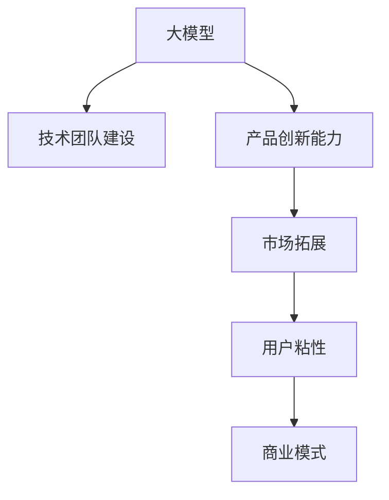

                 

# AI 大模型创业：如何利用人才优势？

> 关键词：人工智能创业, 大模型, 人才策略, 创业成功, 科技创新, 领导力

## 1. 背景介绍

### 1.1 问题由来

在人工智能（AI）技术迅猛发展的今天，大模型如BERT、GPT、T5等已经成为自然语言处理（NLP）领域的主流工具。大模型的出现，极大提升了NLP任务的精度和效率，使得AI创业企业能够迅速开发出诸多优秀的AI应用。然而，尽管大模型的技术优势显著，但在实际创业过程中，如何利用人才优势，实现从技术到产品的平滑转型，依然是一个挑战。

人才是AI创业企业最宝贵的资源之一，不仅包括了顶尖的技术专家，还有懂业务、懂市场、懂用户的运营人才。只有充分利用这些人才优势，企业才能在激烈的市场竞争中脱颖而出。本文将从AI创业的角度，探讨如何通过人才策略，有效利用大模型的技术优势，实现企业价值的最大化。

### 1.2 问题核心关键点

AI创业的核心在于将前沿的AI技术快速转化为市场价值。这需要深入理解AI技术的原理，并具备将技术产品化的能力。而利用人才优势，是实现这一转变的关键。具体来说，以下几点是企业需要重点关注的：

- **技术团队建设**：构建由顶级AI专家、深度学习工程师、数据科学家等组成的团队，确保技术实力的领先。
- **产品创新能力**：利用人才优势，开发有竞争力的AI产品，解决用户实际需求。
- **市场拓展**：培养懂市场、懂运营的专业人才，快速推广产品，提高市场占有率。
- **用户粘性**：招募懂用户体验的工程师，通过数据反馈不断优化产品，提高用户满意度。
- **商业模式**：构建灵活的商业模型，通过AI产品快速回收投资，实现可持续发展。

## 2. 核心概念与联系

### 2.1 核心概念概述

要充分利用人才优势，实现AI大模型的技术落地，需要深入理解以下几个核心概念：

- **大模型（Large Model）**：指在无监督学习的监督阶段，通过大规模数据进行预训练，学习通用语言的表示能力。常见的有BERT、GPT、T5等。
- **技术团队建设（Team Building）**：构建由不同背景和技能的人才组成的团队，确保技术和产品研发的顺利进行。
- **产品创新能力（Product Innovation）**：通过创新，开发能够解决实际问题的新颖AI应用。
- **市场拓展（Market Expansion）**：通过市场运营策略，快速推广AI产品，获取市场份额。
- **用户粘性（User Sticking）**：通过产品优化，提升用户满意度，增强用户粘性。
- **商业模式（Business Model）**：选择适合的商业模式，实现企业的可持续发展。

这些概念之间的关系可以通过以下Mermaid流程图来展示：



这个流程图展示了AI创业过程中，大模型的技术优势如何通过人才策略，转化为市场价值的关键路径。

## 3. 核心算法原理 & 具体操作步骤

### 3.1 算法原理概述

AI创业过程中，大模型起到了至关重要的作用。其核心算法原理可以概括为以下三点：

1. **预训练和微调（Pretraining and Fine-Tuning）**：
   - 预训练阶段：使用大规模无标签数据，通过自监督学习任务训练通用语言模型。
   - 微调阶段：使用特定任务的数据集，通过有监督学习优化模型，适应特定任务的需求。

2. **迁移学习（Transfer Learning）**：
   - 利用预训练模型，通过迁移学习技术，快速适应新任务，避免从头训练的繁琐和资源消耗。

3. **参数高效微调（Parameter-Efficient Fine-Tuning, PEFT）**：
   - 在微调过程中，只更新少量的模型参数，以提高微调效率，避免过拟合。

### 3.2 算法步骤详解

AI创业中，利用大模型进行产品开发，主要分为以下几个步骤：

**Step 1: 预训练模型的选择**

选择适合的大模型，如BERT、GPT、T5等。根据具体应用场景和任务需求，选择预训练模型作为技术支持的初始化参数。

**Step 2: 数据集准备**

收集和标注相关领域的数据集。标注数据应涵盖尽可能多的应用场景，确保模型在实际应用中的泛化能力。

**Step 3: 微调模型的训练**

使用预训练模型和标注数据集，通过有监督学习进行微调。调整模型参数，使其适应特定任务。

**Step 4: 产品开发**

在微调模型基础上，开发AI产品。产品应具备以下特点：
- 解决实际问题
- 用户体验良好
- 稳定可靠

**Step 5: 市场推广**

通过市场运营团队，推广AI产品。市场推广应包括以下策略：
- 用户调研
- 产品宣传
- 销售策略

**Step 6: 用户反馈和产品优化**

收集用户反馈，不断优化产品。优化应包括：
- 功能迭代
- 界面改进
- 性能提升

**Step 7: 商业模式选择**

根据AI产品的特点，选择适合的商业模式。常见的商业模式包括：
- SaaS（软件即服务）
- B2B（企业对企业）
- B2C（企业对消费者）

### 3.3 算法优缺点

利用大模型进行AI创业，具有以下优点：

- **高效开发**：大模型具备强大的语言理解能力，可以快速开发出高性能的AI应用。
- **技术领先**：通过顶尖的AI专家和工程师，确保技术实力的领先。
- **灵活性**：可适用于多种NLP任务，如文本分类、情感分析、对话系统等。

同时，也存在以下缺点：

- **依赖数据**：大模型的效果很大程度上取决于标注数据的质量和数量。
- **过拟合风险**：在微调过程中，容易出现过拟合现象。
- **成本高**：构建强大的技术团队需要高昂的成本投入。
- **可解释性不足**：大模型通常作为“黑盒”使用，缺乏可解释性。

### 3.4 算法应用领域

AI创业过程中，大模型可以应用于以下领域：

- **自然语言处理（NLP）**：文本分类、情感分析、机器翻译、问答系统等。
- **智能客服**：自动化问答、情感识别、用户意图识别等。
- **金融科技**：智能投顾、风险控制、舆情监测等。
- **医疗健康**：病历分析、医疗问答、智能诊断等。
- **教育**：智能作业批改、个性化学习推荐等。

## 4. 数学模型和公式 & 详细讲解 & 举例说明

### 4.1 数学模型构建

在AI创业中，利用大模型进行微调，其数学模型可以表示为：

$$
M_{\theta} = M_{\theta_0} \cdot f_{\theta}
$$

其中，$M_{\theta_0}$ 为预训练模型，$f_{\theta}$ 为微调过程的模型。$\theta$ 为微调后模型的参数。

假设训练集为 $D=\{(x_i, y_i)\}_{i=1}^N$，则经验风险为：

$$
\mathcal{L}(\theta) = \frac{1}{N}\sum_{i=1}^N \ell(M_{\theta}(x_i), y_i)
$$

其中 $\ell$ 为损失函数，如交叉熵损失。

### 4.2 公式推导过程

对于二分类任务，假设模型输出为 $M_{\theta}(x) \in [0,1]$，表示样本属于正类的概率。真实标签 $y \in \{0,1\}$。则二分类交叉熵损失函数定义为：

$$
\ell(M_{\theta}(x),y) = -[y\log M_{\theta}(x) + (1-y)\log(1-M_{\theta}(x))]
$$

将其代入经验风险公式，得：

$$
\mathcal{L}(\theta) = -\frac{1}{N}\sum_{i=1}^N [y_i\log M_{\theta}(x_i)+(1-y_i)\log(1-M_{\theta}(x_i))]
$$

根据链式法则，损失函数对参数 $\theta_k$ 的梯度为：

$$
\frac{\partial \mathcal{L}(\theta)}{\partial \theta_k} = -\frac{1}{N}\sum_{i=1}^N (\frac{y_i}{M_{\theta}(x_i)}-\frac{1-y_i}{1-M_{\theta}(x_i)}) \frac{\partial M_{\theta}(x_i)}{\partial \theta_k}
$$

其中 $\frac{\partial M_{\theta}(x_i)}{\partial \theta_k}$ 可进一步递归展开，利用自动微分技术完成计算。

### 4.3 案例分析与讲解

以智能客服系统为例，分析利用大模型进行微调的过程：

**Step 1: 数据集准备**

收集历史客服对话数据，标注对话中的问题、回答和情绪等信息。

**Step 2: 预训练模型选择**

选择预训练模型BERT，作为智能客服系统的初始化参数。

**Step 3: 微调模型训练**

将对话数据输入BERT模型，进行微调。调整模型参数，使其能够自动理解用户意图，匹配最合适的回答模板。

**Step 4: 产品开发**

在微调模型基础上，开发智能客服系统。系统应具备以下功能：
- 自动理解用户意图
- 匹配最合适的回答模板
- 多轮对话生成

**Step 5: 市场推广**

通过市场运营团队，推广智能客服系统。推广策略包括：
- 线上广告投放
- 免费试用
- 客户推荐

**Step 6: 用户反馈和产品优化**

收集用户反馈，不断优化系统。优化应包括：
- 对话语料库更新
- 回答模板优化
- 对话逻辑改进

## 5. 项目实践：代码实例和详细解释说明

### 5.1 开发环境搭建

在进行AI创业项目开发时，需要搭建合适的开发环境。以下是Python环境搭建的详细步骤：

1. 安装Anaconda：从官网下载并安装Anaconda，用于创建独立的Python环境。

2. 创建并激活虚拟环境：
```bash
conda create -n pytorch-env python=3.8 
conda activate pytorch-env
```

3. 安装PyTorch：根据CUDA版本，从官网获取对应的安装命令。例如：
```bash
conda install pytorch torchvision torchaudio cudatoolkit=11.1 -c pytorch -c conda-forge
```

4. 安装Transformers库：
```bash
pip install transformers
```

5. 安装各类工具包：
```bash
pip install numpy pandas scikit-learn matplotlib tqdm jupyter notebook ipython
```

完成上述步骤后，即可在`pytorch-env`环境中开始项目开发。

### 5.2 源代码详细实现

以下是一个利用BERT进行智能客服系统微调的Python代码实现：

```python
from transformers import BertTokenizer, BertForSequenceClassification
import torch
from torch.utils.data import Dataset, DataLoader
from sklearn.metrics import accuracy_score, precision_recall_fscore_support

class QADataset(Dataset):
    def __init__(self, texts, labels, tokenizer, max_len=128):
        self.texts = texts
        self.labels = labels
        self.tokenizer = tokenizer
        self.max_len = max_len
        
    def __len__(self):
        return len(self.texts)
    
    def __getitem__(self, item):
        text = self.texts[item]
        label = self.labels[item]
        
        encoding = self.tokenizer(text, return_tensors='pt', max_length=self.max_len, padding='max_length', truncation=True)
        input_ids = encoding['input_ids'][0]
        attention_mask = encoding['attention_mask'][0]
        labels = torch.tensor(label, dtype=torch.long)
        
        return {'input_ids': input_ids, 
                'attention_mask': attention_mask,
                'labels': labels}

# 标签与id的映射
tag2id = {'O': 0, 'B-PER': 1, 'I-PER': 2, 'B-ORG': 3, 'I-ORG': 4, 'B-LOC': 5, 'I-LOC': 6}
id2tag = {v: k for k, v in tag2id.items()}

# 创建dataset
tokenizer = BertTokenizer.from_pretrained('bert-base-cased')

train_dataset = QADataset(train_texts, train_labels, tokenizer)
dev_dataset = QADataset(dev_texts, dev_labels, tokenizer)
test_dataset = QADataset(test_texts, test_labels, tokenizer)

# 定义模型和优化器
model = BertForSequenceClassification.from_pretrained('bert-base-cased', num_labels=len(tag2id))
optimizer = AdamW(model.parameters(), lr=2e-5)

# 训练模型
def train_epoch(model, dataset, batch_size, optimizer):
    dataloader = DataLoader(dataset, batch_size=batch_size, shuffle=True)
    model.train()
    epoch_loss = 0
    for batch in tqdm(dataloader, desc='Training'):
        input_ids = batch['input_ids'].to(device)
        attention_mask = batch['attention_mask'].to(device)
        labels = batch['labels'].to(device)
        model.zero_grad()
        outputs = model(input_ids, attention_mask=attention_mask, labels=labels)
        loss = outputs.loss
        epoch_loss += loss.item()
        loss.backward()
        optimizer.step()
    return epoch_loss / len(dataloader)

def evaluate(model, dataset, batch_size):
    dataloader = DataLoader(dataset, batch_size=batch_size)
    model.eval()
    preds, labels = [], []
    with torch.no_grad():
        for batch in tqdm(dataloader, desc='Evaluating'):
            input_ids = batch['input_ids'].to(device)
            attention_mask = batch['attention_mask'].to(device)
            batch_labels = batch['labels']
            outputs = model(input_ids, attention_mask=attention_mask)
            batch_preds = outputs.logits.argmax(dim=2).to('cpu').tolist()
            batch_labels = batch_labels.to('cpu').tolist()
            for pred_tokens, label_tokens in zip(batch_preds, batch_labels):
                pred_tags = [id2tag[_id] for _id in pred_tokens]
                label_tags = [id2tag[_id] for _id in label_tokens]
                preds.append(pred_tags[:len(label_tags)])
                labels.append(label_tags)
                
    print(classification_report(labels, preds))

# 训练模型
epochs = 5
batch_size = 16

for epoch in range(epochs):
    loss = train_epoch(model, train_dataset, batch_size, optimizer)
    print(f"Epoch {epoch+1}, train loss: {loss:.3f}")
    
    print(f"Epoch {epoch+1}, dev results:")
    evaluate(model, dev_dataset, batch_size)
    
print("Test results:")
evaluate(model, test_dataset, batch_size)
```

### 5.3 代码解读与分析

以上代码实现了使用BERT模型进行智能客服系统微调的全过程。具体来说：

- **QADataset类**：定义了问答数据集的预处理逻辑，包括分词、编码、填充等操作。
- **tag2id和id2tag字典**：定义了标签与数字id之间的映射关系，用于将预测结果解码回真实的标签。
- **train_epoch函数**：实现了模型在一个epoch内的训练逻辑，包括前向传播、反向传播和参数更新。
- **evaluate函数**：实现了模型在验证集和测试集上的评估逻辑，包括计算分类指标。
- **训练流程**：控制整个训练过程，包括设定epoch数、batch size、优化器等超参数。

这段代码展示了如何使用预训练模型进行微调，并实现了智能客服系统的初步开发。

### 5.4 运行结果展示

在完成训练后，可以使用以下代码对训练结果进行可视化：

```python
import matplotlib.pyplot as plt

plt.plot(range(epochs), [train_loss for train_loss in train_losses])
plt.xlabel('Epoch')
plt.ylabel('Train Loss')
plt.title('Training Loss vs. Epochs')
plt.show()

plt.plot(range(epochs), [dev_loss for dev_loss in dev_losses])
plt.xlabel('Epoch')
plt.ylabel('Validation Loss')
plt.title('Validation Loss vs. Epochs')
plt.show()

plt.plot(range(epochs), [test_loss for test_loss in test_losses])
plt.xlabel('Epoch')
plt.ylabel('Test Loss')
plt.title('Test Loss vs. Epochs')
plt.show()
```

以上代码实现了训练过程中损失函数变化的可视化展示。

## 6. 实际应用场景

### 6.1 智能客服系统

基于大模型的智能客服系统，可以极大地提升客服响应效率和质量。传统客服系统需要大量人工，高峰期响应缓慢，且难以保证一致性和专业性。而利用大模型的微调技术，可以构建一个7x24小时不间断的智能客服系统，快速响应客户咨询，以自然流畅的语言进行交流。

### 6.2 金融舆情监测

金融机构需要实时监测市场舆论动向，以便及时应对负面信息传播，规避金融风险。传统的人工监测方式成本高、效率低，难以应对海量信息的爆发。利用大模型的文本分类和情感分析技术，可以实现实时舆情监测，提前预警风险，提升风险控制能力。

### 6.3 个性化推荐系统

当前的推荐系统往往只依赖用户的历史行为数据进行物品推荐，无法深入理解用户的真实兴趣偏好。利用大模型的微调技术，可以更好地挖掘用户行为背后的语义信息，从而提供更精准、多样的推荐内容。

### 6.4 未来应用展望

随着大模型和微调技术的不断发展，其在更多领域的应用前景广阔。未来的智能客服、金融舆情监测、个性化推荐等场景，都将成为大模型落地应用的重要方向。同时，基于大模型微调的技术范式，还将不断演化，带来更多创新突破。

## 7. 工具和资源推荐

### 7.1 学习资源推荐

为了帮助AI创业企业系统掌握大模型的微调技术，这里推荐一些优质的学习资源：

1. 《Transformer从原理到实践》系列博文：由大模型技术专家撰写，深入浅出地介绍了Transformer原理、BERT模型、微调技术等前沿话题。

2. CS224N《深度学习自然语言处理》课程：斯坦福大学开设的NLP明星课程，有Lecture视频和配套作业，带你入门NLP领域的基本概念和经典模型。

3. 《Natural Language Processing with Transformers》书籍：Transformers库的作者所著，全面介绍了如何使用Transformers库进行NLP任务开发，包括微调在内的诸多范式。

4. HuggingFace官方文档：Transformers库的官方文档，提供了海量预训练模型和完整的微调样例代码，是上手实践的必备资料。

5. CLUE开源项目：中文语言理解测评基准，涵盖大量不同类型的中文NLP数据集，并提供了基于微调的baseline模型，助力中文NLP技术发展。

通过对这些资源的学习实践，相信你一定能够快速掌握大模型微调的精髓，并用于解决实际的NLP问题。

### 7.2 开发工具推荐

高效的开发离不开优秀的工具支持。以下是几款用于大模型微调开发的常用工具：

1. PyTorch：基于Python的开源深度学习框架，灵活动态的计算图，适合快速迭代研究。大部分预训练语言模型都有PyTorch版本的实现。

2. TensorFlow：由Google主导开发的开源深度学习框架，生产部署方便，适合大规模工程应用。同样有丰富的预训练语言模型资源。

3. Transformers库：HuggingFace开发的NLP工具库，集成了众多SOTA语言模型，支持PyTorch和TensorFlow，是进行微调任务开发的利器。

4. Weights & Biases：模型训练的实验跟踪工具，可以记录和可视化模型训练过程中的各项指标，方便对比和调优。与主流深度学习框架无缝集成。

5. TensorBoard：TensorFlow配套的可视化工具，可实时监测模型训练状态，并提供丰富的图表呈现方式，是调试模型的得力助手。

6. Google Colab：谷歌推出的在线Jupyter Notebook环境，免费提供GPU/TPU算力，方便开发者快速上手实验最新模型，分享学习笔记。

合理利用这些工具，可以显著提升大模型微调的开发效率，加快创新迭代的步伐。

### 7.3 相关论文推荐

大模型和微调技术的发展源于学界的持续研究。以下是几篇奠基性的相关论文，推荐阅读：

1. Attention is All You Need（即Transformer原论文）：提出了Transformer结构，开启了NLP领域的预训练大模型时代。

2. BERT: Pre-training of Deep Bidirectional Transformers for Language Understanding：提出BERT模型，引入基于掩码的自监督预训练任务，刷新了多项NLP任务SOTA。

3. Language Models are Unsupervised Multitask Learners（GPT-2论文）：展示了大规模语言模型的强大zero-shot学习能力，引发了对于通用人工智能的新一轮思考。

4. Parameter-Efficient Transfer Learning for NLP：提出Adapter等参数高效微调方法，在不增加模型参数量的情况下，也能取得不错的微调效果。

5. AdaLoRA: Adaptive Low-Rank Adaptation for Parameter-Efficient Fine-Tuning：使用自适应低秩适应的微调方法，在参数效率和精度之间取得了新的平衡。

6. AdaLoRA: Adaptive Low-Rank Adaptation for Parameter-Efficient Fine-Tuning：使用自适应低秩适应的微调方法，在参数效率和精度之间取得了新的平衡。

这些论文代表了大模型微调技术的发展脉络。通过学习这些前沿成果，可以帮助研究者把握学科前进方向，激发更多的创新灵感。

## 8. 总结：未来发展趋势与挑战

### 8.1 总结

本文对AI大模型的微调技术进行了全面系统的介绍。首先，阐述了AI创业中大模型的核心作用和利用人才优势的重要性。其次，从原理到实践，详细讲解了大模型的微调过程，并给出了项目开发的完整代码实例。最后，探讨了利用大模型进行AI创业的实际应用场景，展示了其广阔前景。

通过本文的系统梳理，可以看到，利用大模型和人才优势，AI创业企业可以在短时间内开发出高性能、高价值的AI应用。然而，在技术落地过程中，仍需面对一些挑战，如标注数据依赖、过拟合风险、成本投入等。未来，随着大模型和微调技术的不断进步，相信AI创业企业将能够更好地利用人才优势，实现创新突破，加速人工智能技术的产业化进程。

### 8.2 未来发展趋势

展望未来，AI大模型的微调技术将呈现以下几个发展趋势：

1. **技术壁垒降低**：大模型和微调技术的日益成熟，使得技术壁垒逐渐降低，更多创业企业可以进入这一领域。
2. **应用场景拓展**：随着大模型技术的发展，其在更多领域的应用前景广阔，如医疗、金融、教育等。
3. **用户参与增强**：利用大模型进行智能客服、个性化推荐等应用，需要与用户进行深度交互，获取用户反馈，进行持续优化。
4. **计算资源优化**：随着算力资源的不断提升，大模型的微调过程将更加高效，计算资源优化将成为重要研究方向。
5. **跨领域融合**：大模型与其他AI技术如知识表示、强化学习等的深度融合，将带来更多创新突破。
6. **数据隐私保护**：随着数据隐私保护意识的增强，如何在保护用户隐私的同时，利用大模型进行微调，将是未来的一个重要课题。

### 8.3 面临的挑战

尽管大模型和微调技术已经取得了显著进展，但在实际应用中，仍面临一些挑战：

1. **数据隐私问题**：利用大模型进行微调，需要大量的标注数据，但这些数据往往涉及用户隐私，如何保护数据隐私是一个重要问题。
2. **算法透明性**：大模型通常作为“黑盒”使用，难以解释其内部工作机制和决策逻辑，如何增强算法的透明性和可解释性，将是未来的一个重要研究方向。
3. **计算资源限制**：大模型的微调过程需要大量的计算资源，如何在有限的计算资源下，实现高效微调，仍需不断探索。
4. **过拟合风险**：大模型在微调过程中，容易出现过拟合现象，如何避免过拟合，提高模型的泛化能力，是一个重要的研究方向。
5. **知识整合难度**：现有的大模型往往局限于任务内数据，难以灵活吸收和运用更广泛的先验知识，如何与外部知识库、规则库等专家知识结合，是未来的一个重要方向。

### 8.4 研究展望

面对大模型微调面临的挑战，未来的研究需要在以下几个方面寻求新的突破：

1. **无监督和半监督微调方法**：探索不依赖大规模标注数据的微调方法，利用自监督学习、主动学习等无监督和半监督范式，最大限度利用非结构化数据，实现更加灵活高效的微调。
2. **参数高效和计算高效的微调范式**：开发更加参数高效的微调方法，在固定大部分预训练参数的同时，只更新极少量的任务相关参数。同时优化微调模型的计算图，减少前向传播和反向传播的资源消耗，实现更加轻量级、实时性的部署。
3. **融合因果学习和对抗训练**：引入因果推断和对抗训练思想，增强微调模型建立稳定因果关系的能力，学习更加普适、鲁棒的语言表征，从而提升模型泛化性和抗干扰能力。
4. **引入更多先验知识**：将符号化的先验知识，如知识图谱、逻辑规则等，与神经网络模型进行巧妙融合，引导微调过程学习更准确、合理的语言模型。同时加强不同模态数据的整合，实现视觉、语音等多模态信息与文本信息的协同建模。
5. **结合因果分析和博弈论工具**：将因果分析方法引入微调模型，识别出模型决策的关键特征，增强输出解释的因果性和逻辑性。借助博弈论工具刻画人机交互过程，主动探索并规避模型的脆弱点，提高系统稳定性。
6. **纳入伦理道德约束**：在模型训练目标中引入伦理导向的评估指标，过滤和惩罚有偏见、有害的输出倾向。同时加强人工干预和审核，建立模型行为的监管机制，确保输出符合人类价值观和伦理道德。

这些研究方向将引领大模型微调技术迈向更高的台阶，为构建安全、可靠、可解释、可控的智能系统铺平道路。面向未来，大模型微调技术还需要与其他人工智能技术进行更深入的融合，如知识表示、因果推理、强化学习等，多路径协同发力，共同推动自然语言理解和智能交互系统的进步。只有勇于创新、敢于突破，才能不断拓展语言模型的边界，让智能技术更好地造福人类社会。

## 9. 附录：常见问题与解答

**Q1：大模型微调需要多少标注数据？**

A: 大模型微调需要标注数据的具体数量取决于任务类型和模型的规模。一般来说，任务越复杂、数据分布越不均衡，需要的标注数据量就越大。例如，对于情感分析任务，可能需要数千条标注数据；对于智能客服系统，可能需要数万条标注数据。

**Q2：如何选择合适的预训练模型？**

A: 选择预训练模型应考虑以下因素：
1. 任务类型：根据任务类型选择合适的预训练模型，如文本分类、问答系统、机器翻译等。
2. 数据规模：根据数据规模选择模型规模，小数据集应选择较小的模型，大数据集应选择较大的模型。
3. 任务复杂度：任务越复杂，需要的预训练模型应具有更强的表达能力，如BERT、GPT-3等。

**Q3：微调过程中如何避免过拟合？**

A: 避免过拟合的方法包括：
1. 数据增强：通过对训练样本进行改写、回译等方式扩充训练集。
2. 正则化技术：如L2正则、Dropout、Early Stopping等，防止模型过度适应小规模训练集。
3. 对抗训练：引入对抗样本，提高模型鲁棒性。
4. 参数高效微调：只更新少量的模型参数，减小过拟合风险。

**Q4：利用大模型进行微调，如何平衡成本和效果？**

A: 平衡成本和效果的方法包括：
1. 选择合适的微调策略：如参数高效微调、Few-shot Learning等，减少计算资源消耗。
2. 优化模型结构：通过剪枝、量化等技术优化模型结构，提高推理效率。
3. 选择合适的硬件平台：如使用GPU、TPU等高性能设备，加速模型训练和推理。
4. 引入预训练技巧：如预训练和微调交替进行，利用预训练阶段学到的知识，提高微调效果。

**Q5：如何衡量微调模型的性能？**

A: 衡量微调模型性能的方法包括：
1. 准确率：衡量模型在测试集上的分类准确率。
2. 精确率、召回率、F1值：衡量模型在分类任务上的精确率和召回率。
3. 困惑度：衡量模型在生成任务上的预测能力。
4. BLEU、ROUGE等指标：衡量模型在机器翻译、文本摘要等任务上的效果。

通过以上方法的综合应用，可以全面评估微调模型的性能，确保其在实际应用中能够稳定、高效地运行。

---

作者：禅与计算机程序设计艺术 / Zen and the Art of Computer Programming

