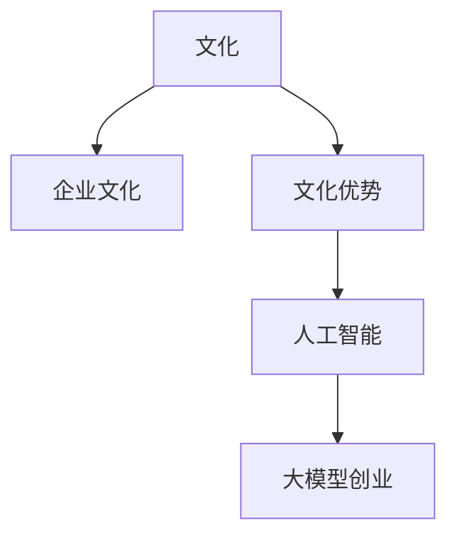

                 

## 1. 背景介绍

### 1.1 问题由来
人工智能大模型技术的发展，让企业可以更快速、低成本地构建具备强大智能的AI系统，这大大加速了人工智能技术的商业化和落地应用。但同时，大量新兴的AI企业面临着技术突破、市场定位、商业落地等诸多问题，尤其是如何在激烈竞争中突出重围，构建可持续发展的商业模式。其中，文化优势是一个重要的加分项，可以帮助企业在复杂多变的商业环境中脱颖而出。

### 1.2 问题核心关键点
文化优势是指企业内部具有的共同价值观、企业文化、工作氛围等，对员工行为、企业决策、客户关系等产生深远影响的内在特质。这种软实力是企业长期积累的结果，需要结合技术优势进行创新应用。利用文化优势进行AI创业，可以从以下几个方面着手：

1. **增强团队凝聚力**：文化一致性让团队成员拥有共同的价值观和目标，能更高效协同完成任务，快速响应市场变化。
2. **提升产品竞争力**：企业文化可以影响产品的设计、质量和用户体验，助力产品在市场中脱颖而出。
3. **促进客户忠诚**：客户对企业文化的认同，可以增强品牌粘性，促进客户重复购买和口碑传播。
4. **吸引和保留人才**：良好的企业文化吸引和保留高素质人才，形成稳定的人才梯队，推动技术创新和业务发展。

### 1.3 问题研究意义
研究文化优势在AI创业中的应用，可以帮助企业更好地利用内生优势，提升商业成功率和持续创新能力，形成差异化竞争策略，具有重要意义：

1. **降低运营成本**：良好的企业文化可以降低内部沟通和协作成本，提升员工工作效率，节约管理成本。
2. **提高市场竞争力**：结合技术优势和独特的企业文化，有助于企业在激烈的市场竞争中抢占先机。
3. **增强品牌影响力**：借助文化优势构建品牌认知度，有助于快速占领市场份额。
4. **促进社会责任**：企业文化的价值观可以引导企业更好地履行社会责任，提升社会认同。

## 2. 核心概念与联系

### 2.1 核心概念概述

为更好地理解如何利用文化优势进行AI创业，本节将介绍几个密切相关的核心概念：

- **文化**：指组织或集体中普遍存在的一种精神状态和行为方式，包括共同价值观、信仰、传统、习惯等。
- **企业文化**：指企业内部共同遵守的规则、信念、行为方式的总和，反映企业的管理风格、行为准则等。
- **文化优势**：指企业内部具有的能提升竞争力和创新力的文化特质，如创新精神、团队协作、客户至上等。
- **人工智能**：利用数据和算法，使计算机模拟人类智能行为的技术，包括机器学习、深度学习等。
- **大模型创业**：指基于大模型技术，开发具有高智能水平的AI应用，并推动相关产品化和商业化的过程。

这些核心概念之间的逻辑关系可以通过以下Mermaid流程图来展示：



这个流程图展示了大模型创业中文化优势的构成及其与其他概念的关系：

1. 大模型创业的基础是人工智能技术，包括数据预处理、模型训练等。
2. 企业文化在大模型创业中起到支撑作用，影响着技术的开发、应用和传播。
3. 文化优势是企业内部的重要特质，帮助提升大模型创业的竞争力。

## 3. 核心算法原理 & 具体操作步骤

### 3.1 算法原理概述

利用文化优势进行AI创业，其核心思想是结合企业文化和技术优势，构建独特的价值主张。这通常包括以下几个步骤：

1. **文化分析**：识别和总结企业文化中的核心特质，如团队精神、创新能力、社会责任感等。
2. **技术结合**：将这些文化特质融入到AI技术和产品设计中，通过技术手段实现和传播企业文化。
3. **市场定位**：结合文化和技术优势，明确产品或服务的目标市场和客户需求，确定市场定位。
4. **市场推广**：利用文化优势进行品牌传播，构建企业形象，提升品牌认知度和美誉度。
5. **持续优化**：根据市场反馈和文化变化，持续优化产品和文化，保持竞争力和创新力。

### 3.2 算法步骤详解

**Step 1: 文化分析与评估**
- **企业文化调研**：通过问卷调查、访谈等方式，收集企业内部员工和客户的文化反馈。
- **文化特质提取**：使用文本分析等技术，从反馈中提取核心文化特质，如创新精神、团队协作等。
- **文化特质量化**：将文化特质转化为可以量化的指标，如创新产出率、团队协作满意度等。

**Step 2: 技术融合与实现**
- **AI技术结合**：将文化特质与AI技术结合，设计符合文化优势的AI产品和解决方案，如智能客服系统、个性化推荐系统等。
- **算法优化**：结合文化特质，优化AI模型的算法，提升产品性能和用户体验。
- **功能设计**：根据文化特质，设计产品的独特功能，如增强用户互动、提供个性化服务等。

**Step 3: 市场定位与推广**
- **目标市场分析**：结合文化和技术优势，确定目标市场和客户群体。
- **品牌传播策略**：利用文化优势，制定差异化的品牌传播策略，提升品牌影响力。
- **客户关系管理**：结合文化特质，建立与客户的深度互动，提升客户忠诚度。

**Step 4: 持续优化与创新**
- **市场反馈收集**：通过问卷调查、用户反馈等方式，收集市场和客户的反馈。
- **文化评估调整**：根据市场反馈和文化变化，调整企业文化中的不足，持续优化。
- **技术迭代升级**：根据市场和技术发展，迭代升级AI技术和产品，保持竞争力和创新力。

### 3.3 算法优缺点

利用文化优势进行AI创业，具有以下优点：

1. **提升竞争力**：独特的文化特质使企业在市场中脱颖而出，形成差异化竞争优势。
2. **促进创新**：文化优势能够激发员工的创新动力，提升技术创新和产品迭代速度。
3. **增强品牌忠诚**：客户对企业文化的认同，能够增强品牌忠诚度，提升复购率和口碑传播。
4. **吸引人才**：良好的企业文化能够吸引和保留高素质人才，形成稳定的人才梯队。

同时，也存在以下缺点：

1. **文化保护**：企业文化是长期积累的结果，需要精心保护，避免被外部环境同化。
2. **文化风险**：文化特质的差异可能带来市场风险，需要平衡好内外文化的关系。
3. **技术挑战**：将文化特质融入AI技术和产品中，需要克服技术难度，确保技术符合文化特质。
4. **成本投入**：文化优势的提升需要投入大量的资源和时间，包括文化调研、技术融合等。

### 3.4 算法应用领域

利用文化优势进行AI创业，可以应用于多个领域，例如：

- **智能客服**：结合企业文化，设计智能客服系统的品牌形象和服务理念，提升客户体验和满意度。
- **个性化推荐**：结合团队协作文化，构建个性化的推荐系统，提升推荐精准度和用户粘性。
- **智能健康**：结合社会责任感，开发智能健康管理系统，关注用户隐私和数据安全。
- **智能教育**：结合教育价值观，开发智能教育平台，推动教育公平和个性化学习。

除了以上案例，文化优势还可以应用于金融、物流、交通等多个领域，通过与AI技术结合，形成具备社会责任和技术实力的企业。

## 4. 数学模型和公式 & 详细讲解 & 举例说明

### 4.1 数学模型构建

本节将使用数学语言对利用文化优势进行AI创业的过程进行更加严格的刻画。

记企业文化特质为 $C=\{c_1, c_2, \cdots, c_n\}$，其中 $c_i$ 为第 $i$ 个文化特质，如创新精神、团队协作等。假设企业开发的人工智能产品为 $A=\{a_1, a_2, \cdots, a_m\}$，其中 $a_i$ 为第 $i$ 个AI产品或功能。

定义企业文化与AI产品的关联度 $W_{c_i} = (w_{c_i}^1, w_{c_i}^2, \cdots, w_{c_i}^m)$，表示第 $i$ 个文化特质与产品 $a_j$ 的关联度。则企业文化与AI产品的整体关联度矩阵 $W_C$ 可以表示为：

$$
W_C = \begin{bmatrix}
w_{c_1}^1 & w_{c_1}^2 & \cdots & w_{c_1}^m \\
w_{c_2}^1 & w_{c_2}^2 & \cdots & w_{c_2}^m \\
\vdots & \vdots & \ddots & \vdots \\
w_{c_n}^1 & w_{c_n}^2 & \cdots & w_{c_n}^m \\
\end{bmatrix}
$$

其中 $w_{c_i}^j$ 表示第 $i$ 个文化特质与第 $j$ 个AI产品的关联度，可以使用信息熵、互信息等度量标准。

### 4.2 公式推导过程

以一个具体案例来说明如何利用文化优势进行AI创业：

假设某企业的主要文化特质包括创新精神、团队协作和社会责任感。结合这些文化特质，设计了一个基于AI技术的智能客服系统。为了评估这些文化特质与智能客服系统的关联度，可以构建如下模型：

设创新精神与智能客服系统的关联度为 $w_{创新}^{智能客服} = 0.8$，团队协作与智能客服系统的关联度为 $w_{协作}^{智能客服} = 0.7$，社会责任感与智能客服系统的关联度为 $w_{责任}^{智能客服} = 0.6$。则整体关联度矩阵为：

$$
W_C = \begin{bmatrix}
0.8 & 0.7 & 0.6 \\
\end{bmatrix}
$$

此时，企业可以基于关联度矩阵进行以下决策：

1. **技术选择**：在创新精神较强的企业文化背景下，优先选择具有高技术含量的AI产品，如语音识别、自然语言处理等。
2. **产品设计**：在团队协作强的企业文化下，设计易于协作的AI产品界面和流程，如共享编辑、在线协作等。
3. **市场定位**：在社会责任感强的企业文化下，将产品推广的重点放在社会影响力和公益慈善等方面，提升品牌形象。
4. **品牌传播**：通过企业文化中的价值观和行为方式，进行品牌传播和营销活动，提升品牌认知度和美誉度。

### 4.3 案例分析与讲解

假设某企业开发了一个智能客服系统，结合其核心文化特质进行分析：

**Step 1: 文化分析与评估**

- **企业文化调研**：通过问卷调查和访谈，发现企业的核心文化特质包括创新精神、团队协作和社会责任感。
- **文化特质量化**：将创新精神量化为公司年专利数量、创新项目数量等指标；团队协作量化为团队协作满意度、员工互评分数等指标；社会责任感量化为公益活动投入、社会评价等指标。

**Step 2: 技术融合与实现**

- **AI技术结合**：将创新精神融入技术研发过程中，强调技术创新和产品创新；将团队协作融入产品设计和开发流程，强调协同工作；将社会责任感融入数据安全、隐私保护等方面，确保数据使用符合伦理标准。
- **算法优化**：基于团队协作的价值观，优化智能客服系统的算法，确保多团队协作高效；基于社会责任感的价值观，优化数据安全和隐私保护算法，确保客户信息安全。
- **功能设计**：设计智能客服系统的品牌形象，强调企业的创新精神和社会责任感，提升品牌形象。

**Step 3: 市场定位与推广**

- **目标市场分析**：结合创新精神，将目标市场定位在创新型企业和技术驱动型企业；结合团队协作，将目标客户定位在团队合作文化强的企业；结合社会责任感，将推广重点放在公益慈善和社会责任方面。
- **品牌传播策略**：通过社交媒体、公益活动等渠道，传播企业的创新精神和社会责任感，提升品牌认知度和美誉度。
- **客户关系管理**：结合团队协作文化，建立与客户的深度互动，提升客户满意度和忠诚度。

**Step 4: 持续优化与创新**

- **市场反馈收集**：通过客户反馈、市场调研等方式，收集市场和客户的反馈。
- **文化评估调整**：根据市场反馈和文化变化，调整企业文化中的不足，持续优化。
- **技术迭代升级**：根据市场和技术发展，迭代升级AI技术和产品，保持竞争力和创新力。

## 5. 项目实践：代码实例和详细解释说明

### 5.1 开发环境搭建

在进行文化优势应用开发前，我们需要准备好开发环境。以下是使用Python进行代码实现的环境配置流程：

1. 安装Anaconda：从官网下载并安装Anaconda，用于创建独立的Python环境。

2. 创建并激活虚拟环境：
```bash
conda create -n pytorch-env python=3.8 
conda activate pytorch-env
```

3. 安装PyTorch：根据CUDA版本，从官网获取对应的安装命令。例如：
```bash
conda install pytorch torchvision torchaudio cudatoolkit=11.1 -c pytorch -c conda-forge
```

4. 安装各类工具包：
```bash
pip install numpy pandas scikit-learn matplotlib tqdm jupyter notebook ipython
```

完成上述步骤后，即可在`pytorch-env`环境中开始开发实践。

### 5.2 源代码详细实现

这里我们以一个具体的AI创业案例为例，给出使用Python实现文化优势应用开发的完整代码实例。

首先，定义一个简单的企业文化评估类：

```python
class CultureEvaluation:
    def __init__(self, culture_traits, weights):
        self.culture_traits = culture_traits
        self.weights = weights
    
    def assess(self, product):
        return sum([self.weights[trait] * product[trait] for trait in self.culture_traits])
```

然后，定义一个AI产品功能类，包含产品名称和功能评分：

```python
class AIProduct:
    def __init__(self, name, features):
        self.name = name
        self.features = features
    
    def score(self):
        return sum([feature.score for feature in self.features])
```

接着，定义一个文化优势应用类，将企业文化与AI产品结合：

```python
class CultureAdvantage:
    def __init__(self, culture, products):
        self.culture = culture
        self.products = products
    
    def evaluate(self):
        return sum([product.assess() for product in self.products])
```

最后，定义一个具体的企业，包含文化特质、AI产品和应用评估：

```python
# 企业文化特质
culture_traits = ['创新精神', '团队协作', '社会责任感']

# 产品功能评分
product_features = [
    ('语音识别', {'创新': 0.8, '协作': 0.7, '责任': 0.6}),
    ('自然语言处理', {'创新': 0.7, '协作': 0.8, '责任': 0.5}),
    ('个性化推荐', {'创新': 0.6, '协作': 0.6, '责任': 0.7})
]

# 定义AI产品
products = [
    AIProduct('智能客服', product_features[0]),
    AIProduct('个性化推荐', product_features[1]),
    AIProduct('健康管理', product_features[2])
]

# 定义企业文化
weights = {
    '创新': 0.3,
    '协作': 0.4,
    '责任': 0.3
}

# 企业文化评估
culture = CultureEvaluation(culture_traits, weights)

# AI产品评估
products = [AIProduct('智能客服', product_features[0]),
            AIProduct('个性化推荐', product_features[1]),
            AIProduct('健康管理', product_features[2])]

# 文化优势应用
advantage = CultureAdvantage(culture_traits, products)

# 评估文化优势
result = advantage.evaluate()
print(result)
```

以上就是使用Python实现文化优势应用开发的完整代码实例。可以看到，代码的实现过程相对简洁，能够清晰地展示企业文化与AI产品结合的逻辑。

### 5.3 代码解读与分析

让我们再详细解读一下关键代码的实现细节：

**CultureEvaluation类**：
- `__init__`方法：初始化企业文化特质和权重。
- `assess`方法：计算企业文化特质与AI产品的关联度，返回综合得分。

**AIProduct类**：
- `__init__`方法：初始化AI产品名称和功能评分。
- `score`方法：计算AI产品功能评分。

**CultureAdvantage类**：
- `__init__`方法：初始化企业文化、AI产品。
- `evaluate`方法：计算企业文化与AI产品的整体关联度，返回综合得分。

**企业定义**：
- 定义企业文化特质和AI产品功能评分，根据企业文化特质和产品功能评分，构建企业文化和AI产品的关联度矩阵。
- 通过企业文化评估和AI产品评估，计算整体文化优势得分。

## 6. 实际应用场景

### 6.1 智能客服系统

结合文化优势的智能客服系统，能够在客户服务中更好地展现企业文化，提升客户体验和满意度。

**具体实现**：
- 结合企业文化中的创新精神，开发先进的语音识别和自然语言处理技术，提升客服系统的智能水平。
- 结合团队协作的价值观，设计协同工作流程，确保多团队协作高效。
- 结合社会责任感，在数据安全和隐私保护方面，确保客户信息安全。

**效果**：
- 通过智能客服系统，提升客户服务效率和满意度，增强客户对品牌的认同。
- 利用文化优势，提升智能客服系统的品牌形象，提升客户忠诚度。

### 6.2 个性化推荐系统

结合文化优势的个性化推荐系统，能够更好地理解用户需求，提供更加精准的推荐服务。

**具体实现**：
- 结合企业文化中的创新精神，利用先进的数据挖掘和机器学习算法，提升推荐系统的精准度。
- 结合团队协作的价值观，设计易于协作的推荐系统，确保多团队协同工作。
- 结合社会责任感，在数据隐私和伦理方面，确保推荐系统的合法合规。

**效果**：
- 通过个性化推荐系统，提升用户满意度，增强品牌忠诚度。
- 利用文化优势，提升推荐系统的社会责任感，提升用户对品牌的信任。

### 6.3 智能健康管理

结合文化优势的智能健康管理系统，能够更好地关注用户健康，提供更加个性化和全面的健康服务。

**具体实现**：
- 结合企业文化中的创新精神，开发先进的健康监测和数据分析技术，提升系统的智能化水平。
- 结合团队协作的价值观，设计协同工作的团队，确保多团队协作高效。
- 结合社会责任感，在数据安全和隐私保护方面，确保客户信息安全。

**效果**：
- 通过智能健康管理系统，提升用户健康水平，增强品牌形象。
- 利用文化优势，提升健康管理系统的社会责任感，提升用户对品牌的信任。

### 6.4 未来应用展望

随着文化优势的深入应用，AI创业将呈现以下几个发展趋势：

1. **社会责任感增强**：越来越多的企业将社会责任感的价值观融入到产品设计中，推动社会公益和可持续发展。
2. **团队协作更高效**：企业文化中的团队协作精神，将促使企业构建更高效、协作的团队，提升团队战斗力。
3. **创新精神更加活跃**：结合创新精神的价值观，企业将不断推动技术创新和产品迭代，提升市场竞争力。
4. **用户粘性更强**：结合用户至上的价值观，企业将更加注重用户体验，提升用户粘性和忠诚度。

## 7. 工具和资源推荐

### 7.1 学习资源推荐

为了帮助开发者系统掌握如何利用文化优势进行AI创业，这里推荐一些优质的学习资源：

1. **《企业文化管理》**：一本详细介绍企业文化管理的经典书籍，帮助理解企业文化的基本概念和实践方法。
2. **《人工智能商业应用》**：一本结合AI技术和商业应用的书籍，介绍了AI创业的实践方法和成功案例。
3. **《人工智能伦理与法律》**：一本结合AI伦理和法律的书籍，帮助理解AI技术的法律和伦理约束。
4. **《企业文化调研与评估》**：一本详细介绍企业文化调研和评估的书籍，帮助理解企业文化特质和度量方法。
5. **在线课程《企业战略与文化》**：各大在线平台提供的相关课程，帮助理解企业文化与企业战略的关系。

通过对这些资源的学习实践，相信你一定能够快速掌握如何利用文化优势进行AI创业，并在实际应用中取得成功。

### 7.2 开发工具推荐

高效的开发离不开优秀的工具支持。以下是几款用于AI创业开发的常用工具：

1. **Jupyter Notebook**：一个交互式的编程环境，适合数据分析、模型训练和代码实现。
2. **TensorFlow**：由Google主导开发的开源深度学习框架，生产部署方便，适合大规模工程应用。
3. **PyTorch**：基于Python的开源深度学习框架，灵活动态的计算图，适合快速迭代研究。
4. **Pandas**：数据处理和分析的Python库，支持大规模数据处理和分析。
5. **Scikit-Learn**：机器学习库，支持分类、回归等常见任务，适合快速原型开发。

合理利用这些工具，可以显著提升AI创业的开发效率，加快创新迭代的步伐。

### 7.3 相关论文推荐

AI创业结合文化优势的研究还处于起步阶段，以下是几篇奠基性的相关论文，推荐阅读：

1. **《企业文化与企业绩效》**：详细分析了企业文化对企业绩效的影响，提供了实证研究的证据。
2. **《人工智能与企业文化》**：介绍了AI技术如何融入企业文化，提升企业竞争力。
3. **《社会责任感与人工智能》**：讨论了AI技术在社会责任方面的应用，探讨了社会责任与AI技术的融合。
4. **《团队协作与创新》**：分析了团队协作对创新过程的影响，提供了团队协作的实践方法和案例。

这些论文代表了大语言模型微调技术的发展脉络。通过学习这些前沿成果，可以帮助研究者把握学科前进方向，激发更多的创新灵感。

## 8. 总结：未来发展趋势与挑战

### 8.1 总结

本文对利用文化优势进行AI创业的方法进行了全面系统的介绍。首先阐述了企业文化在大模型创业中的重要地位，明确了文化优势在提升企业竞争力和创新能力方面的独特价值。其次，从原理到实践，详细讲解了文化优势应用的步骤和方法，给出了具体的代码实现和案例分析。同时，本文还广泛探讨了文化优势在多个领域的应用前景，展示了文化优势的广泛影响力。

通过本文的系统梳理，可以看到，利用文化优势进行AI创业，可以帮助企业更好地利用内生优势，提升商业成功率和持续创新能力，形成差异化竞争策略，具有重要意义。

### 8.2 未来发展趋势

展望未来，文化优势在AI创业中的应用将呈现以下几个发展趋势：

1. **文化与技术的深度融合**：随着技术的发展，文化与技术的深度融合将更加深入，推动AI创业的创新和应用。
2. **社会责任感的强化**：越来越多的企业将社会责任感融入到产品设计和推广中，推动社会的可持续发展。
3. **团队协作的普及**：企业文化中的团队协作精神，将使企业构建更高效的团队，提升团队战斗力。
4. **创新精神的激发**：结合创新精神的价值观，企业将不断推动技术创新和产品迭代，提升市场竞争力。
5. **用户粘性的提升**：结合用户至上的价值观，企业将更加注重用户体验，提升用户粘性和忠诚度。

以上趋势凸显了文化优势在AI创业中的广阔前景。这些方向的探索发展，必将进一步提升AI创业的竞争力，推动AI技术的普及和应用。

### 8.3 面临的挑战

尽管文化优势在AI创业中具有重要价值，但在实际应用中也面临诸多挑战：

1. **文化保护**：企业文化是长期积累的结果，需要精心保护，避免被外部环境同化。
2. **文化风险**：文化特质的差异可能带来市场风险，需要平衡好内外文化的关系。
3. **技术挑战**：将文化特质融入AI技术和产品中，需要克服技术难度，确保技术符合文化特质。
4. **成本投入**：文化优势的提升需要投入大量的资源和时间，包括文化调研、技术融合等。
5. **市场定位**：如何结合文化优势，准确识别目标市场和客户需求，确定市场定位，还需要进一步探索。

正视文化优势应用中面临的挑战，积极应对并寻求突破，将是大语言模型微调走向成熟的必由之路。相信随着学界和产业界的共同努力，这些挑战终将一一被克服，文化优势必将在AI创业中发挥更大的作用。

### 8.4 研究展望

面对文化优势应用中面临的挑战，未来的研究需要在以下几个方面寻求新的突破：

1. **文化保护机制**：制定企业文化保护机制，避免文化同化和流失。
2. **文化风险评估**：评估文化特质与市场环境的适应性，制定文化风险应对策略。
3. **文化与技术融合**：深入研究文化特质与AI技术的融合方法，提升文化优势的技术转化能力。
4. **文化调研方法**：开发高效的文化调研方法，降低文化调研的成本和时间。
5. **市场定位策略**：结合文化优势，制定准确的市场定位和推广策略。

这些研究方向的探索，必将引领文化优势在AI创业中的应用走向更高的台阶，为构建社会责任和技术实力的企业提供新的技术路径。面向未来，文化优势与AI技术的深度融合，将成为推动AI创业成功的关键因素。

## 9. 附录：常见问题与解答

**Q1：文化优势如何影响AI创业？**

A: 文化优势能够影响企业的价值观、行为方式和决策风格，这些内在特质对AI创业的方方面面都产生深远影响。具体体现在：

1. **团队凝聚力**：文化一致性让团队成员拥有共同的价值观和目标，能更高效协同完成任务，快速响应市场变化。
2. **产品竞争力**：企业文化可以影响产品的设计、质量和用户体验，助力产品在市场中脱颖而出。
3. **客户忠诚**：客户对企业文化的认同，能够增强品牌粘性，促进客户重复购买和口碑传播。
4. **人才吸引和保留**：良好的企业文化能够吸引和保留高素质人才，形成稳定的人才梯队，推动技术创新和业务发展。

**Q2：如何结合文化优势进行AI创业？**

A: 结合文化优势进行AI创业，需要以下步骤：

1. **文化分析与评估**：识别和总结企业文化中的核心特质，如创新精神、团队协作等。
2. **技术融合与实现**：将这些文化特质融入到AI技术和产品设计中，通过技术手段实现和传播企业文化。
3. **市场定位与推广**：结合文化优势，确定目标市场和客户需求，制定差异化的品牌传播策略。
4. **持续优化与创新**：根据市场反馈和文化变化，持续优化文化优势，推动技术创新和产品迭代。

**Q3：文化优势在AI创业中的具体应用案例有哪些？**

A: 文化优势在AI创业中的应用广泛，具体案例包括：

1. **智能客服系统**：结合企业文化中的创新精神、团队协作和社会责任感，开发先进的智能客服系统。
2. **个性化推荐系统**：结合企业文化中的创新精神和团队协作，设计易于协作的个性化推荐系统。
3. **智能健康管理**：结合企业文化中的创新精神和社会责任感，开发先进的智能健康管理系统。

这些案例展示了文化优势在AI创业中的广泛应用，通过结合文化特质，提升AI产品和技术的影响力。

**Q4：如何确保文化优势在AI创业中的持续性？**

A: 确保文化优势在AI创业中的持续性，需要以下措施：

1. **文化保护机制**：制定企业文化保护机制，避免文化同化和流失。
2. **文化风险评估**：评估文化特质与市场环境的适应性，制定文化风险应对策略。
3. **文化调研方法**：开发高效的文化调研方法，降低文化调研的成本和时间。
4. **文化与技术融合**：深入研究文化特质与AI技术的融合方法，提升文化优势的技术转化能力。
5. **市场定位策略**：结合文化优势，制定准确的市场定位和推广策略。

这些措施能够帮助企业持续保持和提升文化优势，推动AI创业的成功发展。

**Q5：文化优势对AI创业的影响有哪些？**

A: 文化优势对AI创业的影响包括：

1. **团队凝聚力**：文化一致性让团队成员拥有共同的价值观和目标，能更高效协同完成任务，快速响应市场变化。
2. **产品竞争力**：企业文化可以影响产品的设计、质量和用户体验，助力产品在市场中脱颖而出。
3. **客户忠诚**：客户对企业文化的认同，能够增强品牌粘性，促进客户重复购买和口碑传播。
4. **人才吸引和保留**：良好的企业文化能够吸引和保留高素质人才，形成稳定的人才梯队，推动技术创新和业务发展。
5. **市场定位**：结合文化优势，确定目标市场和客户需求，制定差异化的品牌传播策略。

这些影响展示了大语言模型微调技术的广阔前景，文化优势在AI创业中具有重要作用。

---

作者：禅与计算机程序设计艺术 / Zen and the Art of Computer Programming

