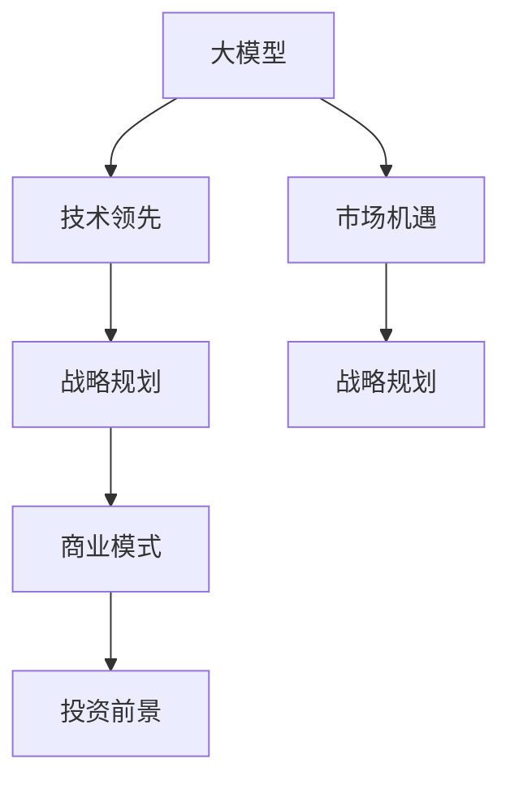

                 

# AI 大模型创业：如何利用未来优势？

> 关键词：大模型创业,人工智能商业化,技术领先,策略布局,市场机遇,战略规划,商业模式,投资前景

## 1. 背景介绍

### 1.1 问题由来
近年来，随着人工智能(AI)技术的飞速发展，大模型(如GPT、BERT等)在自然语言处理(NLP)、计算机视觉(CV)等领域取得了显著的突破。大模型以其强大的泛化能力和广泛的适用性，吸引了越来越多的创业者和投资者的关注。然而，如何利用这些先进技术进行商业化，实现长期可持续发展，成为了一个重要的课题。

### 1.2 问题核心关键点
大模型创业的成功，在于准确把握技术发展趋势，合理制定战略规划，并有效运用市场资源。本文将从技术领先、策略布局、市场机遇、战略规划等多个维度，探讨大模型创业的具体路径和关键要素。

## 2. 核心概念与联系

### 2.1 核心概念概述

为更好地理解大模型创业的关键要素，本节将介绍几个核心概念：

- **大模型(Large Models)**：指以深度学习为基础，通过大量数据训练，具备强大泛化能力的模型，如GPT、BERT等。
- **技术领先(Technology Leadership)**：指在AI领域保持技术前沿，拥有自主知识产权和核心算法的能力。
- **市场机遇(Market Opportunities)**：指基于技术优势，识别并抓住新兴市场机会，进行商业化布局的能力。
- **战略规划(Strategic Planning)**：指通过系统规划和资源配置，实现技术、市场和商业化的良性互动。
- **商业模式(Business Model)**：指实现商业模式创新，构建可持续发展的盈利模式。
- **投资前景(Investment Prospects)**：指吸引和利用外部投资，支持技术研发和市场推广。

这些概念之间的联系可以通过以下Mermaid流程图来展示：



这个流程图展示了大模型创业的关键要素及其相互关系：

1. 大模型的技术优势为大模型创业奠定了基础。
2. 市场机遇为识别和抓住新兴应用场景提供了方向。
3. 战略规划为实现技术、市场和商业化的协调发展提供了路线图。
4. 商业模式为确保可持续发展提供了盈利模式。
5. 投资前景为获得外部资金支持提供了渠道。

这些核心概念共同构成了大模型创业的成功框架，帮助创业者在技术、市场和商业化等多个维度上实现均衡发展。

## 3. 核心算法原理 & 具体操作步骤
### 3.1 算法原理概述

大模型创业的核心在于利用先进的人工智能技术，开发高质量的AI应用，创造市场价值。其核心算法原理主要包括：

- **预训练**：通过大规模无标签数据训练大模型，学习通用的语言或视觉特征，提高模型的泛化能力。
- **微调**：在预训练基础上，针对特定任务进行有监督训练，优化模型性能。
- **迁移学习**：将预训练模型的知识迁移到新任务中，避免从头训练的过拟合风险。
- **推理引擎**：优化推理算法，提高模型响应速度和计算效率，支持大规模部署。

### 3.2 算法步骤详解

大模型创业的技术操作流程大致如下：

1. **数据收集与预处理**：收集大量标注数据，进行清洗、归一化等预处理操作。
2. **模型训练与验证**：选择合适的预训练模型和优化算法，进行多轮训练和验证，调整模型参数。
3. **微调和优化**：针对具体任务进行微调，优化模型性能，应用正则化、对抗训练等技术。
4. **推理引擎优化**：优化推理算法，如剪枝、量化、分布式计算等，提高模型响应速度和计算效率。
5. **产品开发与部署**：将优化后的模型封装成API或SDK，部署到云平台或本地服务器，支持业务应用。

### 3.3 算法优缺点

大模型创业具有以下优点：

- **技术领先**：大模型创业以技术创新为核心，掌握行业领先技术。
- **市场灵活性**：大模型能够适应多个领域和应用场景，灵活应对市场需求。
- **资源利用效率**：通过预训练和迁移学习，降低模型开发成本，提高资源利用效率。

同时，也存在以下局限性：

- **高成本**：大规模数据和计算资源需求，导致创业初期成本较高。
- **复杂性**：模型开发和优化复杂，需要多学科团队的协同工作。
- **风险性**：市场和技术的不确定性，可能带来商业风险。

### 3.4 算法应用领域

大模型创业在多个领域具备广泛的应用潜力：

- **医疗健康**：利用自然语言处理(NLP)和大数据技术，开发智能诊疗系统、个性化健康管理等应用。
- **金融服务**：利用深度学习和大数据技术，开发智能投顾、信用评估、反欺诈检测等应用。
- **智能制造**：利用计算机视觉(CV)和大数据分析技术，开发智能检测、质量控制、预测性维护等应用。
- **智能交通**：利用计算机视觉和自然语言处理技术，开发智能导航、自动驾驶、交通管理等应用。
- **智能教育**：利用自然语言处理和大数据分析技术，开发智能答疑、个性化学习路径推荐等应用。

## 4. 数学模型和公式 & 详细讲解

### 4.1 数学模型构建

以基于深度学习的自然语言处理模型为例，其数学模型构建过程如下：

1. **输入表示**：将自然语言文本转化为向量表示，通常使用词嵌入或子词嵌入技术。
2. **隐藏表示**：通过多层神经网络对输入向量进行隐式编码，捕捉语言的深层特征。
3. **输出表示**：将隐藏层向量映射到输出空间，例如分类、生成等。

数学模型如下：

$$
\mathcal{M}(x) = \text{Softmax}(W_h \cdot \text{ReLU}(W_x x + b_x) + b_h)
$$

其中，$W_x, b_x$ 为输入层参数，$W_h, b_h$ 为隐藏层参数，$\text{Softmax}$ 为输出层激活函数。

### 4.2 公式推导过程

在自然语言处理中，常用的任务包括文本分类、情感分析、命名实体识别等。以文本分类为例，其训练过程如下：

1. **损失函数**：定义交叉熵损失函数：

$$
L = -\frac{1}{N} \sum_{i=1}^N \sum_{y \in \{0,1\}} y \log \hat{y} + (1-y) \log (1-\hat{y})
$$

其中，$y$ 为真实标签，$\hat{y}$ 为模型预测概率。

2. **优化算法**：使用随机梯度下降(SGD)或Adam等优化算法更新模型参数：

$$
\theta \leftarrow \theta - \eta \nabla_{\theta}L
$$

其中，$\eta$ 为学习率，$\nabla_{\theta}L$ 为损失函数对模型参数的梯度。

### 4.3 案例分析与讲解

以BERT模型为例，其在NLP任务上的训练过程如下：

1. **预训练**：在大量无标签文本数据上进行自监督训练，学习语言表示。
2. **微调**：在特定任务上使用少量标注数据进行有监督训练，优化模型预测性能。
3. **推理**：在测试数据上使用预训练和微调后的模型进行推理，输出预测结果。

## 5. 项目实践：代码实例和详细解释说明

### 5.1 开发环境搭建

为了进行大模型创业的实践，需要搭建一个完整的开发环境，包括数据集、计算资源和模型部署工具等。具体步骤如下：

1. **数据集准备**：收集并预处理用于训练和验证的数据集，例如IMDB电影评论数据集、新闻数据集等。
2. **计算资源配置**：选择GPU或TPU等高性能计算资源，确保模型训练和推理的高效性。
3. **开发环境配置**：安装Python、TensorFlow、PyTorch等深度学习框架，以及相关的数据处理和模型部署工具。

### 5.2 源代码详细实现

以BERT模型在文本分类任务上的微调为例，其代码实现如下：

```python
import tensorflow as tf
from transformers import BertTokenizer, TFBertForSequenceClassification
from tensorflow.keras.preprocessing.text import Tokenizer
from tensorflow.keras.preprocessing.sequence import pad_sequences

# 初始化BERT模型和分词器
tokenizer = BertTokenizer.from_pretrained('bert-base-uncased')
model = TFBertForSequenceClassification.from_pretrained('bert-base-uncased', num_labels=2)

# 准备训练数据
train_data = [
    ["I love this movie", 1],
    ["This movie is terrible", 0],
    # ...
]
train_texts, train_labels = zip(*train_data)

# 分词和编码
train_input_ids = tokenizer(train_texts, padding=True, truncation=True, return_tensors='tf')
train_labels = tf.convert_to_tensor(train_labels)

# 模型训练
model.compile(optimizer=tf.keras.optimizers.Adam(learning_rate=2e-5), 
              loss=tf.keras.losses.SparseCategoricalCrossentropy(from_logits=True), 
              metrics=['accuracy'])
model.fit(train_input_ids, train_labels, epochs=3, batch_size=16)

# 模型评估
test_data = [
    ["I hate this movie", 0],
    ["This movie is amazing", 1],
    # ...
]
test_texts, test_labels = zip(*test_data)
test_input_ids = tokenizer(test_texts, padding=True, truncation=True, return_tensors='tf')
test_labels = tf.convert_to_tensor(test_labels)
test_loss, test_acc = model.evaluate(test_input_ids, test_labels)
print(f"Test loss: {test_loss}, Test accuracy: {test_acc}")
```

### 5.3 代码解读与分析

在上述代码中，我们首先初始化了BERT模型和分词器。然后，通过分词和编码将训练文本转化为模型可以接受的格式。接着，使用Adam优化器训练模型，并在验证集上进行评估。最后，使用测试集对模型进行最终评估，输出损失和准确率。

## 6. 实际应用场景

### 6.4 未来应用展望

随着大模型技术的发展，其在实际应用场景中展现了巨大的潜力。未来，大模型将在更多领域和应用场景中发挥重要作用：

- **智能医疗**：在医疗影像分析、病历文本处理、药物发现等方面，大模型将大幅提升医疗诊断和治疗效率。
- **智能金融**：在信用评估、反欺诈检测、智能投顾等方面，大模型将为金融服务提供更加智能和高效的支持。
- **智能制造**：在工业视觉检测、质量控制、生产调度等方面，大模型将大幅提升制造企业的自动化和智能化水平。
- **智能交通**：在自动驾驶、智能导航、交通管理等方面，大模型将为交通安全和效率提供保障。
- **智能教育**：在智能答疑、个性化学习路径推荐、内容生成等方面，大模型将为教育公平和个性化教育提供新思路。

## 7. 工具和资源推荐

### 7.1 学习资源推荐

为了帮助大模型创业的开发者系统掌握相关技术，推荐以下学习资源：

1. **Coursera课程**：如斯坦福大学的《深度学习专项课程》、吴恩达的《机器学习》等，系统学习深度学习和AI基础知识。
2. **arXiv论文**：阅读最新的大模型和自然语言处理论文，保持技术领先。
3. **Transformers官方文档**：学习如何使用主流的大模型和相关库进行开发和微调。
4. **TensorFlow和PyTorch官方文档**：掌握深度学习框架的使用技巧，提高开发效率。

### 7.2 开发工具推荐

以下是几款常用的开发工具，可以帮助大模型创业的开发者提高工作效率：

1. **Jupyter Notebook**：可视化的编程环境，支持Python和深度学习框架的集成，便于开发和调试。
2. **Google Colab**：免费的云端Jupyter Notebook环境，支持GPU加速，适合大规模模型训练。
3. **TensorBoard**：模型训练和推理过程中的可视化工具，便于监控和调试。
4. **Weights & Biases**：实验跟踪工具，记录和可视化模型训练过程，方便对比和调优。

### 7.3 相关论文推荐

以下几篇大模型和自然语言处理领域的经典论文，值得深入阅读：

1. **Attention is All You Need**：提出Transformer模型，改变了自然语言处理任务的训练方式。
2. **BERT: Pre-training of Deep Bidirectional Transformers for Language Understanding**：提出BERT模型，展示了预训练语言模型在NLP任务上的强大能力。
3. **GPT-2: Language Models are Unsupervised Multitask Learners**：提出GPT-2模型，展示了预训练语言模型的零样本学习能力。
4. **XLNet: Generalized Autoregressive Pre-training for Language Understanding**：提出XLNet模型，改进了预训练语言模型的训练方式。
5. **ALBERT: A Lite BERT for Self-supervised Learning of Language Representations**：提出ALBERT模型，优化了BERT模型的结构和训练效率。

## 8. 总结：未来发展趋势与挑战

### 8.1 总结

本文对大模型创业的技术领先、策略布局、市场机遇、战略规划等核心要素进行了系统介绍。通过分析技术趋势和市场潜力，提出了大模型创业的可行路径和关键要素。通过案例分析和模型实践，展示了大模型创业的实现方法和具体步骤。

### 8.2 未来发展趋势

展望未来，大模型创业将呈现以下几个发展趋势：

1. **技术迭代加速**：随着计算资源的提升和数据量的增加，大模型将持续迭代和优化，提升模型性能和泛化能力。
2. **应用场景多样化**：大模型将在更多领域和应用场景中得到应用，推动各个行业的智能化转型。
3. **模型训练自动化**：借助自动化工具和预训练模型的迁移学习，降低模型训练的复杂性和成本。
4. **算法优化智能化**：使用更高效的算法和模型结构，提高模型训练和推理的效率。
5. **跨领域融合**：大模型将与物联网、大数据、区块链等技术结合，推动跨领域的应用创新。

### 8.3 面临的挑战

尽管大模型创业具有广阔的前景，但仍面临以下挑战：

1. **技术复杂性**：大模型开发和部署的技术复杂性较高，需要跨学科团队的协作。
2. **市场竞争激烈**：AI领域竞争激烈，需要具备强大的技术优势和市场洞察力。
3. **数据隐私问题**：大规模数据的应用，涉及用户隐私和数据安全问题，需要严格的隐私保护措施。
4. **商业模式不明**：大模型创业的商业模式需要不断探索和创新，才能实现可持续的盈利。
5. **人才短缺**：大模型创业需要具备高水平的技术人才，但人才短缺问题亟待解决。

### 8.4 研究展望

为了应对大模型创业的挑战，未来的研究需要重点关注以下几个方面：

1. **技术创新**：持续推进大模型和相关算法的技术创新，提升模型性能和应用效果。
2. **市场洞察**：深入研究市场趋势和用户需求，开发有针对性的应用场景和产品。
3. **商业策略**：制定科学的商业模式和运营策略，确保可持续发展。
4. **跨学科合作**：推动AI技术与物联网、大数据等领域的融合，开拓新的应用领域。
5. **社会责任**：重视大模型对社会的影响，制定相应的伦理和法规规范。

总之，大模型创业是一个充满挑战和机遇的领域，需要在技术、市场和商业化等多个维度进行全面规划和布局，才能实现长期的可持续发展。

## 9. 附录：常见问题与解答

**Q1：大模型创业如何确保技术领先？**

A: 确保技术领先，需要持续关注最新的技术动态和研究成果，积极参与学术交流和行业会议。同时，加大研发投入，吸引和培养高水平的技术人才，构建强大的技术团队。

**Q2：大模型创业如何制定有效的市场策略？**

A: 制定有效的市场策略，需要深入研究市场需求和用户行为，结合自身技术优势，开发具有差异化竞争力的产品。同时，注重品牌建设和用户口碑，积极拓展市场渠道，扩大用户规模。

**Q3：大模型创业如何应对市场竞争？**

A: 应对市场竞争，需要不断提升产品和服务的质量，加强用户教育和市场教育，提高品牌知名度和市场影响力。同时，关注竞争对手的动态，灵活调整市场策略，保持竞争优势。

**Q4：大模型创业如何处理数据隐私问题？**

A: 处理数据隐私问题，需要严格遵守相关的法律法规，采用数据脱敏、匿名化等技术手段，保护用户隐私。同时，加强内部数据管理，确保数据安全和合规使用。

**Q5：大模型创业如何制定可行的商业模式？**

A: 制定可行的商业模式，需要结合自身技术优势和市场需求，开发具有独特价值的产品或服务。同时，注重客户体验和价值创造，建立稳定的客户关系，形成良好的盈利模式。

---

作者：禅与计算机程序设计艺术 / Zen and the Art of Computer Programming

