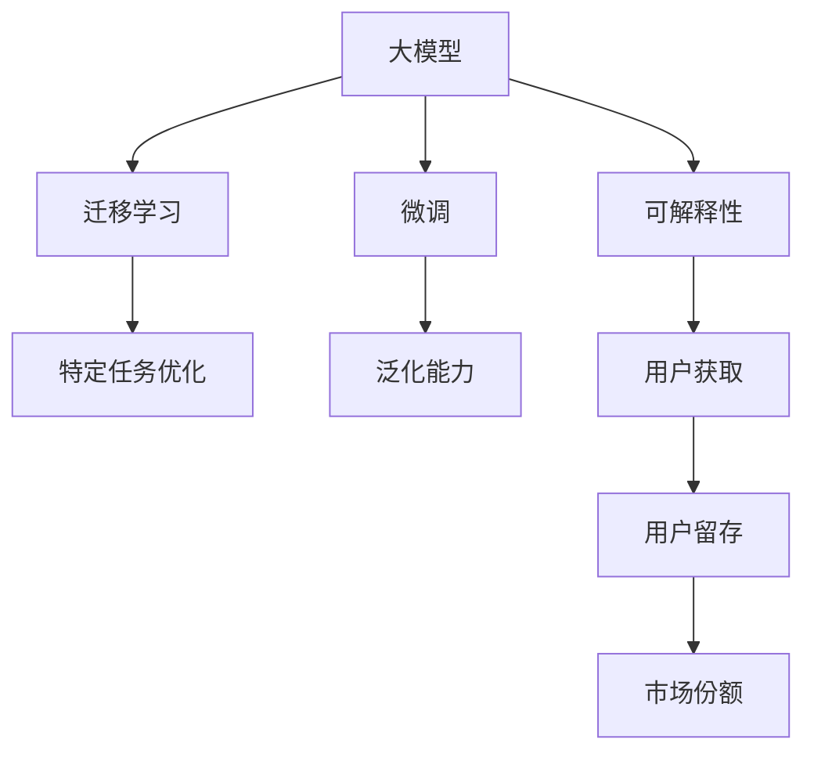

                 

## 1. 背景介绍

在人工智能快速发展的今天，大模型（Big Models）的应用已经渗透到了各行各业，从金融、医疗、教育到娱乐、制造，其强大的表现力和潜力已经吸引了大量创业者和投资者的关注。然而，随着技术的日趋成熟和应用场景的不断拓展，如何在大模型创业中保持竞争力、获取用户、提升业绩，成为了一个值得深入探讨的问题。

## 2. 核心概念与联系

### 2.1 核心概念概述

- **大模型（Big Models）**：指具有海量参数、庞大语料库支撑的深度学习模型，如GPT-3、BERT等。这类模型在自然语言处理、计算机视觉等领域展现出卓越的性能。
- **微调（Fine-tuning）**：在大模型基础上，针对特定任务调整模型参数的过程，以提升模型在该任务上的表现。
- **迁移学习（Transfer Learning）**：将在大规模数据上训练好的模型迁移到小规模数据上，提高新任务上的性能。
- **泛化能力（Generalization）**：模型在不同数据集上表现一致的能力，是衡量模型性能的重要指标。
- **可解释性（Explainability）**：模型输出的结果可以被人类理解的能力。
- **用户获取（User Acquisition）**：吸引新用户并转化为客户的过程。
- **用户留存（User Retention）**：保持已有用户持续使用产品或服务的能力。
- **市场份额（Market Share）**：公司或产品在市场上的占有率，反映了其在行业中的地位和影响力。

这些概念构成了大模型创业的核心框架，各概念之间相互关联，共同作用于产品开发和商业运作的各个环节。

### 2.2 核心概念原理和架构的 Mermaid 流程图



以上流程图展示了各核心概念的相互联系：大模型通过微调和迁移学习提升特定任务上的泛化能力和可解释性；而良好的泛化能力和可解释性有助于用户获取和留存，最终提升市场份额。

## 3. 核心算法原理 & 具体操作步骤

### 3.1 算法原理概述

在大模型创业中，利用渠道优势的核心在于如何通过优化模型和运营策略，提升用户体验和满意度，从而吸引更多用户并促进用户留存。算法原理主要包括以下几个方面：

1. **模型优化**：通过微调（Fine-tuning）和迁移学习（Transfer Learning）提升模型在特定任务上的性能，提高模型的泛化能力和可解释性。
2. **数据增强**：通过数据增强技术提升模型在特定领域的表现，如在金融领域应用时，使用金融领域的专用数据进行微调。
3. **用户行为分析**：利用用户行为数据，进行用户画像建模，个性化推荐，提升用户满意度。
4. **系统优化**：通过系统优化，提升模型推理速度和响应时间，改善用户体验。

### 3.2 算法步骤详解

1. **选择合适的预训练模型**：根据应用领域选择适合的预训练模型，如BERT、GPT-3等。
2. **数据预处理**：对数据进行清洗、标注和预处理，准备好训练和验证数据集。
3. **微调模型**：在特定任务上微调模型，调整模型参数，提高模型在该任务上的性能。
4. **部署模型**：将微调后的模型部署到生产环境，进行实时推理和预测。
5. **用户行为分析**：利用用户行为数据，分析用户需求和行为模式，进行个性化推荐和系统优化。
6. **系统优化**：通过系统优化，提升模型推理速度和响应时间，改善用户体验。

### 3.3 算法优缺点

**优点**：

- **高效**：预训练模型在特定任务上的微调通常比从头训练更快，且性能提升明显。
- **灵活**：微调可以针对特定任务进行调整，提高模型泛化能力和可解释性。
- **可扩展**：微调模型可以在已有模型的基础上，快速适应新任务，提高产品开发速度。

**缺点**：

- **依赖标注数据**：微调依赖于大量标注数据，标注成本高。
- **泛化能力有限**：微调模型在特定任务上的泛化能力可能有限，过度依赖数据集。
- **资源需求大**：预训练模型和微调过程对计算资源需求大，可能需要高性能的GPU或TPU。

### 3.4 算法应用领域

大模型创业中，基于渠道优势的算法应用主要涵盖以下几个领域：

1. **金融领域**：利用微调模型进行风险评估、欺诈检测、金融市场预测等。
2. **医疗领域**：利用微调模型进行病历分析、疾病诊断、药物研发等。
3. **教育领域**：利用微调模型进行个性化推荐、智能问答、作业批改等。
4. **娱乐领域**：利用微调模型进行内容推荐、用户画像分析、情感分析等。
5. **制造领域**：利用微调模型进行设备故障预测、生产过程优化、供应链管理等。

## 4. 数学模型和公式 & 详细讲解 & 举例说明

### 4.1 数学模型构建

在大模型微调中，常用的数学模型包括损失函数（Loss Function）、优化器（Optimizer）等。以金融领域中的信用风险评估为例，常用的数学模型构建如下：

1. **损失函数**：
   $$
   \mathcal{L}(w) = -\frac{1}{N} \sum_{i=1}^{N} y_i \log f(x_i; w) + (1-y_i) \log (1-f(x_i; w))
   $$
   其中，$f(x_i; w)$ 表示模型在输入 $x_i$ 上的预测概率，$y_i$ 为实际标签，$w$ 为模型参数。

2. **优化器**：
   $$
   w \leftarrow w - \eta \nabla \mathcal{L}(w)
   $$
   其中，$\eta$ 为学习率，$\nabla \mathcal{L}(w)$ 为损失函数对模型参数 $w$ 的梯度。

### 4.2 公式推导过程

在金融领域信用风险评估中，常用的损失函数包括交叉熵损失（Cross-Entropy Loss）和均方误差损失（Mean Squared Error Loss）。以下以交叉熵损失为例进行公式推导：

1. **交叉熵损失**：
   $$
   \mathcal{L}(w) = -\frac{1}{N} \sum_{i=1}^{N} y_i \log f(x_i; w) + (1-y_i) \log (1-f(x_i; w))
   $$
   其中，$y_i$ 为实际标签，$f(x_i; w)$ 表示模型在输入 $x_i$ 上的预测概率。

2. **优化器**：
   $$
   w \leftarrow w - \eta \nabla \mathcal{L}(w)
   $$
   其中，$\eta$ 为学习率，$\nabla \mathcal{L}(w)$ 为损失函数对模型参数 $w$ 的梯度。

### 4.3 案例分析与讲解

假设我们要对某个银行的客户信用风险进行评估，数据集包含1000个客户的信用记录和对应的风险标签。我们可以使用交叉熵损失作为模型的损失函数，利用梯度下降法进行微调，优化模型的参数 $w$，以提升模型在信用风险评估上的准确率。

## 5. 项目实践：代码实例和详细解释说明

### 5.1 开发环境搭建

为进行大模型微调，我们需要以下开发环境：

1. **编程语言**：Python
2. **深度学习框架**：PyTorch
3. **数据处理工具**：Pandas, NumPy
4. **模型部署工具**：TensorFlow Serving, Flask

### 5.2 源代码详细实现

以下是一个基于PyTorch的金融领域信用风险评估的微调示例：

```python
import torch
import torch.nn as nn
import torch.optim as optim
from torch.utils.data import DataLoader

class Net(nn.Module):
    def __init__(self):
        super(Net, self).__init__()
        self.fc1 = nn.Linear(10, 10)
        self.fc2 = nn.Linear(10, 2)
    
    def forward(self, x):
        x = torch.relu(self.fc1(x))
        x = self.fc2(x)
        return x

# 准备数据集
train_dataset = ...
test_dataset = ...

# 定义模型
model = Net()

# 定义损失函数和优化器
criterion = nn.CrossEntropyLoss()
optimizer = optim.Adam(model.parameters(), lr=0.001)

# 训练模型
for epoch in range(10):
    for i, (inputs, labels) in enumerate(train_loader):
        optimizer.zero_grad()
        outputs = model(inputs)
        loss = criterion(outputs, labels)
        loss.backward()
        optimizer.step()
        print('Epoch [{}/{}], Step [{}/{}], Loss: {:.4f}'
              .format(epoch+1, 10, i+1, len(train_loader), loss.item()))

# 测试模型
test_loss = ...
print('Test Loss: {:.4f}'.format(test_loss))
```

### 5.3 代码解读与分析

1. **数据准备**：首先准备训练和测试数据集，这里使用金融领域的客户信用记录数据。
2. **模型定义**：定义一个简单的线性神经网络模型，包括两个全连接层。
3. **损失函数和优化器**：选择交叉熵损失函数和Adam优化器，学习率为0.001。
4. **模型训练**：使用训练数据集进行模型训练，经过10个epoch后，在测试集上评估模型的性能。

### 5.4 运行结果展示

训练过程中，每10个epoch输出一次损失值，最终在测试集上得到损失值，以评估模型性能。

## 6. 实际应用场景

### 6.1 金融领域

在金融领域，利用大模型微调进行信用风险评估、欺诈检测等任务，具有显著的效果。具体应用场景包括：

- **信用风险评估**：利用微调模型对客户的信用记录进行风险评估，预测客户违约概率，辅助信贷决策。
- **欺诈检测**：利用微调模型对交易记录进行欺诈检测，识别异常交易行为，保护客户资金安全。

### 6.2 医疗领域

在医疗领域，利用大模型微调进行病历分析、疾病诊断、药物研发等任务，可以提高医疗服务效率和质量。具体应用场景包括：

- **病历分析**：利用微调模型分析病人的病历记录，提取关键信息，辅助医生诊断。
- **疾病诊断**：利用微调模型分析病人的症状，辅助医生进行疾病诊断，提高诊断准确率。
- **药物研发**：利用微调模型分析药物的生物活性，预测药物效果，加速药物研发进程。

### 6.3 教育领域

在教育领域，利用大模型微调进行个性化推荐、智能问答、作业批改等任务，可以提高教学效率和效果。具体应用场景包括：

- **个性化推荐**：利用微调模型分析学生的学习行为，推荐适合的课程和学习资源。
- **智能问答**：利用微调模型回答学生的问题，提供即时反馈，增强学习效果。
- **作业批改**：利用微调模型批改学生的作业，提供详细的反馈和建议。

### 6.4 娱乐领域

在娱乐领域，利用大模型微调进行内容推荐、用户画像分析、情感分析等任务，可以提高用户体验和满意度。具体应用场景包括：

- **内容推荐**：利用微调模型分析用户的历史行为，推荐感兴趣的内容，提升用户体验。
- **用户画像分析**：利用微调模型分析用户的行为和偏好，构建用户画像，提供个性化服务。
- **情感分析**：利用微调模型分析用户的评论和反馈，理解用户情感，改进服务质量。

## 7. 工具和资源推荐

### 7.1 学习资源推荐

1. **《深度学习》（Ian Goodfellow 著）**：深入介绍深度学习的基本概念和算法，适合初学者和进阶者。
2. **《Python深度学习》（Francois Chollet 著）**：全面介绍PyTorch和TensorFlow的使用方法和实践案例，适合动手实践。
3. **Kaggle**：提供丰富的数据集和竞赛，帮助用户实践和提升自己的技能。
4. **Coursera**：提供众多关于深度学习和人工智能的课程，涵盖理论和实践两个方面。

### 7.2 开发工具推荐

1. **PyTorch**：灵活的深度学习框架，适合研究和原型开发。
2. **TensorFlow**：生产部署友好的深度学习框架，适合大规模工程应用。
3. **TensorFlow Serving**：高性能的模型推理引擎，适合大规模模型部署。
4. **Flask**：轻量级的Web框架，适合快速搭建API服务。
5. **Jupyter Notebook**：交互式编程环境，适合数据分析和模型调试。

### 7.3 相关论文推荐

1. **《Attention is All You Need》（NeurIPS 2017）**：提出Transformer模型，开启大模型预训练的先河。
2. **《BERT: Pre-training of Deep Bidirectional Transformers for Language Understanding》（NeurIPS 2018）**：提出BERT模型，展示预训练语言模型的强大性能。
3. **《Fine-tune pretrained models on niche tasks with zero-shot prompts》（ACL 2020）**：介绍利用提示模板进行零样本微调的方法，提升微调效果。
4. **《Parameter-Efficient Transfer Learning》（NeurIPS 2019）**：提出参数高效的微调方法，减少模型微调中的资源消耗。

## 8. 总结：未来发展趋势与挑战

### 8.1 研究成果总结

本文详细介绍了大模型微调的基本原理、具体操作步骤和实际应用场景，并通过代码实例展示了微调模型的实现过程。通过分析大模型微调的核心概念和算法，本文探讨了如何利用渠道优势进行大模型创业，提升产品性能和用户满意度。

### 8.2 未来发展趋势

1. **模型规模和泛化能力**：未来预训练模型的参数规模将进一步增大，模型的泛化能力也将显著提升，可以在更多领域实现高效的微调。
2. **算法优化和资源利用**：随着算法的不断优化和资源利用技术的进步，微调过程将更加高效，成本更低。
3. **用户行为分析和个性化推荐**：用户行为分析技术的发展将进一步提升个性化推荐的效果，提高用户满意度。
4. **模型可解释性和伦理道德**：随着模型可解释性技术的进步，用户将更加信任和接受AI技术。同时，伦理道德约束将越来越受到重视，确保模型行为的安全性和公正性。

### 8.3 面临的挑战

1. **标注数据成本**：尽管微调降低了对标注数据的依赖，但高质量标注数据的获取仍是一大挑战。
2. **模型泛化能力**：在特定任务上的泛化能力可能有限，过度依赖数据集。
3. **资源需求**：大模型微调对计算资源的需求大，高性能设备必不可少。
4. **模型复杂度**：大模型结构复杂，调试和优化难度大。
5. **数据隐私和安全**：用户数据隐私保护和模型安全问题亟需解决。

### 8.4 研究展望

1. **无监督和半监督微调**：探索无监督和半监督微调方法，利用自监督学习、主动学习等技术，降低对标注数据的依赖。
2. **参数高效微调**：开发更加参数高效的微调方法，减少模型微调中的资源消耗。
3. **模型可解释性和伦理道德**：提升模型的可解释性，确保模型行为的安全性和公正性。
4. **多模态数据融合**：探索将多模态数据与大模型进行融合，提升模型的性能和应用范围。
5. **自动化调参**：利用自动化调参技术，寻找最优的超参数组合，提升模型的性能。

## 9. 附录：常见问题与解答

**Q1：大模型微调是否适用于所有NLP任务？**

A: 大模型微调在大多数NLP任务上都能取得不错的效果，但针对特定领域的任务，需要在领域语料上进行预训练，才能获得理想的效果。

**Q2：如何选择合适的预训练模型？**

A: 根据应用领域和任务需求，选择合适的预训练模型。金融领域可以使用BERT、GPT-3等大模型，医疗领域可以使用EHR模型等。

**Q3：微调过程中如何防止过拟合？**

A: 数据增强、正则化、对抗训练等技术可以有效防止微调过程中的过拟合问题。

**Q4：如何在微调过程中提高模型的泛化能力？**

A: 利用泛化能力强的大模型进行预训练，使用更多样化的数据进行微调，可以提升模型的泛化能力。

**Q5：如何提升模型的可解释性？**

A: 引入因果推断和对比学习思想，提升模型输出的可解释性。同时，利用可视化工具展示模型内部工作机制，帮助用户理解模型决策过程。

---

作者：禅与计算机程序设计艺术 / Zen and the Art of Computer Programming

