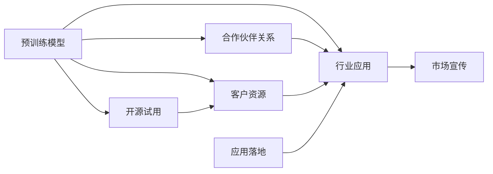

                 

# AI 大模型创业：如何利用渠道优势？

大模型技术正迅速渗透各行各业，但其核心价值更多地体现在数据和模型上的优势。AI 大模型创业，除了技术实力，渠道优势的建设也是至关重要的。本文将系统阐述渠道优势的重要性和如何构建渠道优势。

## 1. 背景介绍

AI 大模型渠道优势的建设涉及多方面内容，包括合作伙伴关系、行业应用、客户资源和市场宣传。大模型在各个领域的应用离不开多方的协作和推动，渠道优势的建立能帮助企业快速扩大影响力和市场占有率。

## 2. 核心概念与联系

### 2.1 核心概念概述

在 AI 大模型创业中，渠道优势的建设包括以下几个关键概念：

- **合作伙伴关系（Partnerships）**：与行业巨头、科研机构等建立合作关系，获取优质数据源、技术支持，促进模型改进。
- **行业应用（Industry Applications）**：将大模型应用于特定行业，如医疗、金融、制造等，获取行业知识和数据，提升模型精度和实用性。
- **客户资源（Customer Resources）**：通过预训练模型开源、试用，吸引开发者和企业，积累广泛的客户基础。
- **市场宣传（Market Promotion）**：通过媒体、社交网络、会议等渠道，宣传大模型的优势和应用，提高品牌知名度。

这些概念共同构成 AI 大模型创业中渠道优势的建设基础。通过合理的渠道策略，可以最大化利用模型带来的优势，推动其商业化应用。

### 2.2 核心概念原理和架构的 Mermaid 流程图



## 3. 核心算法原理 & 具体操作步骤

### 3.1 算法原理概述

渠道优势建设的核心算法原理是利用数据和模型双驱动，最大化提升模型在特定领域的表现。

首先，预训练模型通过大规模数据集进行训练，学习通用的语言或图像特征。其次，通过行业应用和合作伙伴关系，获取特定领域的数据和知识，对模型进行微调，提升其在特定任务上的表现。

### 3.2 算法步骤详解

#### 3.2.1 数据获取与准备

数据是大模型成功的关键，要构建渠道优势，需获取各领域的优质数据源：

- 合作伙伴关系：与科研机构、行业协会等合作，获取高质量数据集，如医疗领域的电子病历、金融领域的交易数据等。
- 开源试用：通过开源试用，吸引开发者和企业提交数据，积累更多的数据集。

#### 3.2.2 模型微调和优化

模型微调的过程分为两步：

- **预训练模型的微调**：针对特定任务进行微调，如文本分类、命名实体识别等，提高模型在特定领域的表现。
- **模型的优化**：在微调的基础上，优化模型结构，如减少层数、参数量，提升推理速度和效果。

#### 3.2.3 合作伙伴和客户管理

合作伙伴和客户的管理是渠道建设的重要环节：

- 合作伙伴：建立长期稳定的合作关系，分享数据和技术，优化模型性能。
- 客户资源：通过试用和开源，吸引更多的客户，建立合作关系，获取更多反馈数据。

#### 3.2.4 市场推广和品牌建设

市场推广和品牌建设能提升渠道优势的影响力：

- 市场推广：通过媒体、社交网络、行业会议等渠道，宣传大模型的优势和应用。
- 品牌建设：通过与行业巨头、科研机构等合作，提高品牌知名度，增强客户信任。

### 3.3 算法优缺点

#### 3.3.1 优点

1. **数据驱动**：通过各领域的优质数据源，提升模型的准确性和实用性。
2. **协同优化**：与合作伙伴协同优化模型，提升模型性能。
3. **多渠道推广**：通过多渠道宣传，扩大市场影响力。

#### 3.3.2 缺点

1. **成本高**：合作伙伴和数据获取需要较高的成本。
2. **数据隐私**：合作伙伴的数据隐私保护问题需要特别注意。
3. **推广难度**：市场推广需要投入大量资源，尤其是初期阶段。

### 3.4 算法应用领域

#### 3.4.1 医疗领域

大模型在医疗领域的应用潜力巨大，如疾病诊断、智能问诊、药物研发等。通过与医院、科研机构等合作，获取电子病历、基因组数据等优质数据，提升模型性能。

#### 3.4.2 金融领域

金融领域的风险评估、欺诈检测、智能投顾等任务，需要大模型的帮助。通过与金融机构、大数据平台等合作，获取交易数据、信用记录等，优化模型预测能力。

#### 3.4.3 教育领域

教育领域的大模型应用包括智能推荐、语言学习、自动化阅卷等。通过与教育机构、在线教育平台等合作，获取学生的学习行为数据，提升推荐和测评的准确性。

#### 3.4.4 智能制造

智能制造领域的大模型应用包括质量检测、设备维护、供应链管理等。通过与制造企业、IoT平台等合作，获取设备运行数据、供应链信息等，提升模型的实时性。

## 4. 数学模型和公式 & 详细讲解 & 举例说明

### 4.1 数学模型构建

构建大模型的数学模型需要综合考虑数据源、模型结构和应用任务：

- 数据源：获取不同领域的优质数据集。
- 模型结构：选择合适的预训练模型和微调策略。
- 应用任务：根据任务类型，优化模型的输出结构。

### 4.2 公式推导过程

假设原始数据集为 $D$，预训练模型为 $M_{\theta}$，微调任务为 $T$，微调后的模型为 $M_{\hat{\theta}}$。则微调的数学模型为：

$$
\hat{\theta} = \mathop{\arg\min}_{\theta} \mathcal{L}(M_{\theta},D)
$$

其中，$\mathcal{L}$ 为损失函数，$\theta$ 为模型参数，$M_{\theta}(x)$ 为模型在输入 $x$ 上的输出。

### 4.3 案例分析与讲解

以医疗领域的疾病诊断为例，构建大模型进行微调的数学模型：

- 数据源：电子病历数据集 $D=\{(x_i,y_i)\}_{i=1}^N$，$x_i$ 为病历文本，$y_i$ 为疾病标签。
- 预训练模型：使用BERT等通用大模型。
- 微调任务：疾病诊断，输出模型 $M_{\hat{\theta}}(x)$，$y$ 为疾病标签。

## 5. 项目实践：代码实例和详细解释说明

### 5.1 开发环境搭建

搭建 AI 大模型开发环境需安装 Python、PyTorch、HuggingFace Transformers 库等：

```bash
pip install torch torchvision torchaudio transformers
```

### 5.2 源代码详细实现

以医疗领域的疾病诊断为例，代码实现如下：

```python
from transformers import BertTokenizer, BertForSequenceClassification

# 定义数据处理函数
def process_data(text, label):
    # 使用 BERT 分词器分词
    tokenizer = BertTokenizer.from_pretrained('bert-base-cased')
    tokens = tokenizer(text, return_tensors='pt', truncation=True)
    # 将标签转换为数字
    label = [1 if label == 'positive' else 0]
    # 返回处理后的数据
    return tokens, label

# 定义模型和训练函数
def train_model(model, train_data, train_loader, optimizer, num_epochs=3):
    for epoch in range(num_epochs):
        model.train()
        for data, labels in train_loader:
            data = data.to(device)
            labels = labels.to(device)
            optimizer.zero_grad()
            logits = model(data)
            loss = torch.nn.functional.cross_entropy(logits, labels)
            loss.backward()
            optimizer.step()
        print(f'Epoch {epoch+1}, loss: {loss.item()}')

# 加载数据集和模型
train_data = ... # 加载训练数据
tokenizer = BertTokenizer.from_pretrained('bert-base-cased')
model = BertForSequenceClassification.from_pretrained('bert-base-cased', num_labels=2)

# 设置训练环境
device = torch.device('cuda') if torch.cuda.is_available() else torch.device('cpu')

# 创建数据加载器和优化器
train_loader = DataLoader(train_data, batch_size=16, shuffle=True)
optimizer = torch.optim.Adam(model.parameters(), lr=2e-5)

# 训练模型
train_model(model, train_data, train_loader, optimizer)
```

### 5.3 代码解读与分析

代码实现涉及多个步骤：

- 数据处理：使用 BERT 分词器对文本进行分词，将标签转换为数字。
- 模型加载：加载预训练的 BERT 模型，并根据任务需求调整输出层。
- 训练函数：定义训练循环，使用 Adam 优化器更新模型参数。
- 模型训练：通过 DataLoader 加载数据，在每个批次上进行训练，并记录损失值。

## 6. 实际应用场景

### 6.1 医疗领域

在医疗领域，大模型的应用包括疾病诊断、智能问诊、药物研发等。通过与医院、科研机构合作，获取电子病历、基因组数据等优质数据，提升模型性能。

### 6.2 金融领域

金融领域的风险评估、欺诈检测、智能投顾等任务，需要大模型的帮助。通过与金融机构、大数据平台合作，获取交易数据、信用记录等，优化模型预测能力。

### 6.3 教育领域

教育领域的大模型应用包括智能推荐、语言学习、自动化阅卷等。通过与教育机构、在线教育平台合作，获取学生的学习行为数据，提升推荐和测评的准确性。

### 6.4 智能制造

智能制造领域的大模型应用包括质量检测、设备维护、供应链管理等。通过与制造企业、IoT平台合作，获取设备运行数据、供应链信息等，提升模型的实时性。

## 7. 工具和资源推荐

### 7.1 学习资源推荐

1. **HuggingFace 官方文档**：包含 Transformers 库的详细文档和样例代码，适合初学者快速上手。
2. **《深度学习自然语言处理》课程**：斯坦福大学开设的 NLP 明星课程，涵盖 NLP 的基本概念和经典模型。
3. **《Natural Language Processing with Transformers》书籍**：介绍 Transformers 库的开发和应用，包含微调等相关内容。
4. **CLUE 开源项目**：中文语言理解测评基准，包含大量不同类型的中文 NLP 数据集，并提供了基于微调的 baseline 模型。

### 7.2 开发工具推荐

1. **PyTorch**：深度学习框架，适合快速迭代研究，具有动态计算图和灵活性。
2. **TensorFlow**：深度学习框架，适合大规模工程应用，具有生产部署的方便性。
3. **Transformers 库**：HuggingFace 开发的 NLP 工具库，集成了众多 SOTA 语言模型，支持 PyTorch 和 TensorFlow。
4. **Weights & Biases**：模型训练的实验跟踪工具，记录和可视化模型训练过程的各项指标。
5. **TensorBoard**：TensorFlow 配套的可视化工具，实时监测模型训练状态。

### 7.3 相关论文推荐

1. **Attention is All You Need**：提出 Transformer 结构，开启预训练大模型时代。
2. **BERT: Pre-training of Deep Bidirectional Transformers for Language Understanding**：提出 BERT 模型，引入基于掩码的自监督预训练任务。
3. **Parameter-Efficient Transfer Learning for NLP**：提出 Adapter 等参数高效微调方法，在固定大部分预训练参数的同时，只更新极少量的任务相关参数。

## 8. 总结：未来发展趋势与挑战

### 8.1 总结

本文系统阐述了 AI 大模型渠道优势的重要性，并详细讲解了如何构建渠道优势。首先，介绍了渠道优势的建设包括合作伙伴关系、行业应用、客户资源和市场宣传。其次，通过案例分析和代码实现，展示了渠道优势的建设和应用。

通过本文的系统梳理，可以看到，渠道优势在大模型创业中扮演着重要角色，能够最大化利用模型带来的优势，推动其商业化应用。未来，随着技术的不断演进和市场的成熟，渠道优势的建设将进一步提升大模型的市场竞争力。

### 8.2 未来发展趋势

未来，大模型渠道优势的建设将呈现以下几个趋势：

1. **数据源多元化**：不仅依赖于合作伙伴和开源，还可以通过众包、数据交易等方式获取更多数据。
2. **合作伙伴广泛化**：拓展与更多行业巨头和科研机构的合作，获取更多优质数据和资源。
3. **市场推广多样化**：通过社交媒体、视频平台等多种渠道宣传大模型，扩大品牌影响力。
4. **客户资源多样化**：不仅依赖于传统企业和开发者，还可以拓展 B2C 客户，获取更多反馈和数据。

### 8.3 面临的挑战

在渠道优势建设过程中，仍面临诸多挑战：

1. **数据获取难度大**：优质数据源的获取和保护需要较高的成本。
2. **合作伙伴关系复杂**：建立长期稳定的合作伙伴关系需要时间和努力。
3. **市场竞争激烈**：面对众多竞争对手，需要不断提升大模型的质量和性能。
4. **客户资源管理**：吸引和维护客户需要持续的投入和优化。

### 8.4 研究展望

未来的研究需要重点关注以下几个方面：

1. **多渠道数据整合**：将来自不同渠道的数据进行整合，提升模型的全面性和鲁棒性。
2. **合作伙伴协同优化**：与合作伙伴协同优化模型，提升模型在特定领域的表现。
3. **客户资源高效管理**：通过自动化和智能化手段，提升客户资源的管理效率。
4. **市场推广精准化**：通过精准的市场推广，提高品牌知名度和市场占有率。

## 9. 附录：常见问题与解答

**Q1: 如何选择合适的预训练模型？**

A: 根据任务需求选择合适的预训练模型，如文本分类可以选择 BERT，机器翻译可以选择 T5。

**Q2: 数据源获取和保护有哪些策略？**

A: 数据源获取可以通过合作伙伴关系、开源试用等方式获取，数据保护需要通过数据脱敏、加密等手段进行保护。

**Q3: 如何提升模型在特定领域的表现？**

A: 通过微调和优化模型结构，提升模型在特定领域的表现。

**Q4: 如何管理客户资源？**

A: 通过自动化和智能化手段，提升客户资源的管理效率，如建立客户关系管理系统。

**Q5: 如何推广大模型？**

A: 通过媒体、社交网络、视频平台等多种渠道宣传大模型，扩大品牌影响力。

---

作者：禅与计算机程序设计艺术 / Zen and the Art of Computer Programming

