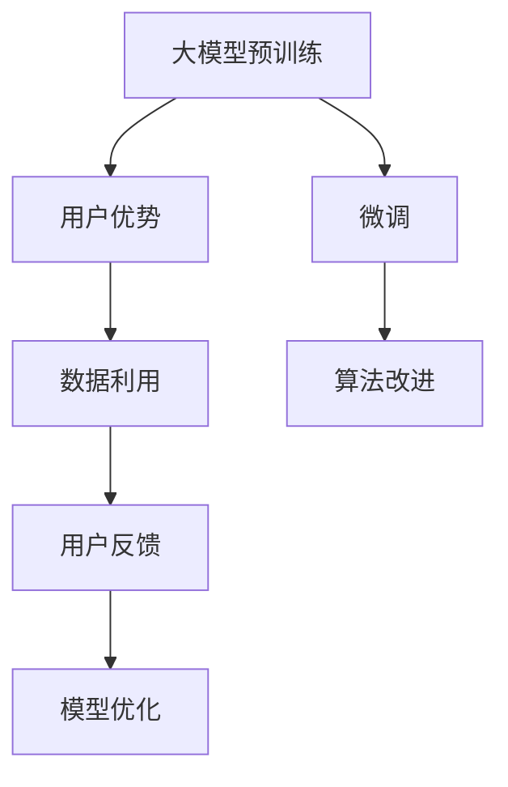

                 

# AI 大模型创业：如何利用用户优势？

> 关键词：大模型创业, 用户优势, AI应用, 商业模型, 数据利用, 机器学习, 深度学习, 自然语言处理, 计算机视觉, 用户反馈

## 1. 背景介绍

在人工智能(AI)领域，尤其是深度学习与大模型(如BERT、GPT-3、T5等)的发展，催生了一批崭新的创业公司和模式。这些大模型通过显著的计算能力与丰富的预训练知识，在自然语言处理(NLP)、计算机视觉(CV)等多个领域表现出色。然而，尽管技术层面的突破令人瞩目，但真正将这些技术转化为商业价值，仍需依赖一个重要因素——**用户优势**。

本文将系统介绍如何在大模型创业中充分利用用户优势，从数据收集、模型训练、商业化策略等多个层面，探讨如何构建高效、可持续的AI大模型创业模式。

## 2. 核心概念与联系

为了更好地理解用户优势在AI大模型创业中的应用，我们首先需要明确几个关键概念：

### 2.1 大模型与小模型

- **大模型(Large Model)**：通常指参数量巨大，具有强大通用能力与灵活性的深度学习模型，如GPT-3、BERT等。大模型需要大量的计算资源进行训练，但能够学习到非常丰富的知识表示。
- **小模型(Small Model)**：参数量较小，聚焦于特定任务的模型，如线性回归、卷积神经网络(CNN)等。小模型计算资源消耗低，但知识表示相对单一。

### 2.2 预训练与微调

- **预训练(Pre-training)**：在无标签数据上，使用大模型进行大规模训练，学习通用的语言、图像等表示。
- **微调(Fine-tuning)**：在大模型的基础上，使用有标签数据进一步优化模型，使其能够适配特定任务。

### 2.3 用户优势与反馈

- **用户优势(User Advantage)**：指用户在数据、模型、应用场景等方面的特殊优势，可显著提升AI模型的效果和实用性。
- **用户反馈(User Feedback)**：用户在实际应用中对模型的反馈信息，可帮助模型持续优化，提升预测准确率与用户体验。

### 2.4 数据利用与算法改进

- **数据利用(Data Utilization)**：从用户数据中提取有价值的信息，用于模型训练和优化。
- **算法改进(Algorithm Improvement)**：根据用户反馈与数据，调整模型架构与参数，提升模型性能。

这些概念间的联系可以通过以下Mermaid流程图进行展示：



从预训练到大模型微调，再到数据利用与算法改进，用户优势与反馈在其中起到了关键作用，推动模型的不断优化与商业价值的最大化。

## 3. 核心算法原理 & 具体操作步骤

### 3.1 算法原理概述

利用用户优势的核心原理在于，通过用户的参与与反馈，对大模型进行有针对的优化与调整，从而提升模型的预测准确率和实用性。具体来说，主要包括以下步骤：

1. **数据收集与标注**：收集大量用户行为数据，并对其进行标注，以训练初始大模型。
2. **模型微调**：基于用户优势，如特定领域知识、用户画像等，对大模型进行微调，使其更好地适配目标任务。
3. **算法优化**：根据用户反馈，持续优化模型与算法，提升模型效果与用户体验。
4. **商业化应用**：将优化后的模型应用到实际商业场景，为用户创造价值。

### 3.2 算法步骤详解

#### 3.2.1 数据收集与标注

- **数据源选择**：选择具有代表性的数据源，如社交媒体、电商平台、医疗记录等，收集用户行为数据。
- **数据标注**：对收集的数据进行标注，以形成有监督学习的数据集。标注需要确保数据的多样性与真实性，以避免过拟合。

#### 3.2.2 模型微调

- **微调目标设定**：根据目标任务，设定微调目标与损失函数。如对于情感分析任务，可以使用交叉熵损失函数。
- **微调超参数**：选择合适的优化器、学习率、批大小等超参数。
- **微调训练**：在预训练模型上，使用用户优势数据进行微调训练。微调过程中需注意过拟合，可采用正则化技术。

#### 3.2.3 算法优化

- **反馈收集**：通过用户界面、API调用日志等方式，收集用户对模型的反馈信息。
- **模型评估**：定期对模型进行评估，使用指标如精度、召回率、F1-score等，评估模型效果。
- **参数更新**：根据用户反馈，调整模型参数，如调整学习率、正则化系数等。
- **模型部署**：将优化后的模型部署到实际应用场景中，进行A/B测试，验证效果。

#### 3.2.4 商业化应用

- **应用场景选择**：根据用户优势，选择最适合的商业应用场景，如电商推荐、金融风控、健康医疗等。
- **用户引导**：设计友好的用户界面与交互流程，引导用户使用AI产品。
- **收入模式设计**：采用如订阅制、按需付费、广告等收入模式，获取回报。

### 3.3 算法优缺点

利用用户优势的AI大模型创业具有以下优点：

- **高精度**：利用大量用户数据，模型可学习到更丰富、准确的表示，提升预测精度。
- **高灵活性**：根据不同用户优势，可灵活调整模型与算法，快速适配新任务与场景。
- **高鲁棒性**：多用户数据与多场景测试，可提高模型鲁棒性，降低模型偏差。

同时，也存在一些缺点：

- **数据隐私问题**：收集与利用用户数据时，需注意数据隐私保护，避免侵犯用户隐私。
- **数据质量问题**：用户数据质量参差不齐，需进行清洗与处理，以提升数据质量。
- **计算资源需求**：模型微调与优化需大量计算资源，可能增加成本。

### 3.4 算法应用领域

利用用户优势的AI大模型创业，已经在多个领域取得了显著成效：

- **电商推荐系统**：基于用户行为数据，利用大模型微调，提升推荐准确率与用户体验。
- **金融风险控制**：利用用户交易数据，训练风险预测模型，识别潜在风险用户。
- **医疗诊断系统**：基于医生诊断数据，训练医学影像分类模型，辅助医生诊断。
- **智能客服**：利用用户互动数据，微调对话模型，提高客服响应效率与满意度。
- **智能家居**：基于用户行为数据，训练智能家居控制模型，提升家居智能化水平。

## 4. 数学模型和公式 & 详细讲解 & 举例说明

### 4.1 数学模型构建

我们以情感分析任务为例，构建利用用户优势的大模型微调数学模型。

假设用户数据为 $\{x_i, y_i\}_{i=1}^N$，其中 $x_i$ 为文本输入，$y_i$ 为情感标签。模型的输入为 $\mathbf{x} = \{x_i\}$，输出为 $\mathbf{y} = \{y_i\}$。模型的目标是最小化交叉熵损失函数：

$$
\mathcal{L}(\theta) = -\frac{1}{N} \sum_{i=1}^N \sum_{j=1}^C y_{ij} \log p_{\theta}(y_{ij}|\mathbf{x})
$$

其中 $p_{\theta}(y_{ij}|\mathbf{x})$ 为模型对文本情感的预测概率。

### 4.2 公式推导过程

假设模型采用Transformer结构，其输出层为softmax层，输出情感预测概率分布。则预测概率公式为：

$$
p_{\theta}(y_{ij}|\mathbf{x}) = \frac{\exp(\mathbf{W}_o^T \mathbf{h}_i + b_o)}{\sum_{k=1}^K \exp(\mathbf{W}_o^T \mathbf{h}_i + b_o)}
$$

其中 $\mathbf{h}_i$ 为模型在文本 $x_i$ 上的隐藏状态，$\mathbf{W}_o$ 为输出层权重矩阵，$b_o$ 为偏置项，$K$ 为情感标签数量。

### 4.3 案例分析与讲解

以电商推荐系统为例，详细分析模型构建与优化过程。

假设电商平台有用户行为数据 $\{x_i, y_i\}_{i=1}^N$，其中 $x_i$ 为用户浏览、购买历史，$y_i$ 为商品类别标签。模型的输入为 $\mathbf{x} = \{x_i\}$，输出为 $\mathbf{y} = \{y_i\}$。模型的目标是最小化交叉熵损失函数。

在模型构建上，采用预训练的BERT模型，在其基础上进行微调，得到电商推荐模型。微调过程包括：

1. **数据预处理**：将用户行为数据转化为模型可接受的格式，如分词、编码等。
2. **模型微调**：基于电商推荐任务，设定交叉熵损失函数，对BERT模型进行微调训练。
3. **算法优化**：根据用户反馈，调整模型超参数，如学习率、正则化系数等。

最终，模型可以预测新商品推荐给用户的概率，提升电商推荐效果。

## 5. 项目实践：代码实例和详细解释说明

### 5.1 开发环境搭建

要实现上述电商推荐系统，需要以下开发环境：

- **Python**：作为主要编程语言，Python拥有丰富的第三方库与工具。
- **TensorFlow** 或 **PyTorch**：用于深度学习模型的构建与训练。
- **Numpy**：用于科学计算与矩阵操作。
- **Pandas**：用于数据处理与分析。
- **Flask**：用于构建Web服务，方便用户反馈数据与接收推荐结果。

### 5.2 源代码详细实现

以下是一个使用TensorFlow实现电商推荐系统的示例代码：

```python
import tensorflow as tf
from tensorflow.keras import layers
import pandas as pd
import numpy as np

# 数据准备
df = pd.read_csv('user_behavior_data.csv')
X = df[['浏览历史', '购买历史']]
y = df['商品类别']

# 模型构建
model = tf.keras.Sequential([
    layers.Embedding(input_dim=len(set(X)), output_dim=128, input_length=X.shape[1]),
    layers.LSTM(128),
    layers.Dense(32, activation='relu'),
    layers.Dense(len(set(y)), activation='softmax')
])

# 模型训练
model.compile(optimizer='adam', loss='categorical_crossentropy', metrics=['accuracy'])
model.fit(X, y, epochs=10, batch_size=32)

# 模型评估
test_df = pd.read_csv('test_user_behavior_data.csv')
X_test = test_df[['浏览历史', '购买历史']]
y_test = test_df['商品类别']
model.evaluate(X_test, y_test)

# 模型应用
recommend_df = pd.read_csv('recommend_data.csv')
X_recommend = recommend_df[['浏览历史', '购买历史']]
y_recommend = recommend_df['商品类别']
predictions = model.predict(X_recommend)
```

### 5.3 代码解读与分析

- **数据预处理**：使用Pandas库读取数据，并进行数据清洗与预处理，如去重、编码等。
- **模型构建**：使用TensorFlow库构建LSTM-RNN模型，预测用户对商品类别的偏好。
- **模型训练**：使用Adam优化器进行模型训练，最小化交叉熵损失函数。
- **模型评估**：使用测试集评估模型效果，输出准确率等指标。
- **模型应用**：利用优化后的模型，对新用户行为数据进行预测，生成商品推荐列表。

### 5.4 运行结果展示

模型训练完成后，可以对新用户行为数据进行预测，生成商品推荐列表。例如，对于新用户A的浏览历史和购买历史，模型可以预测其对商品B的偏好概率，从而生成推荐结果。

```
用户A：浏览历史=[...], 购买历史=[...]
推荐商品B：预测概率=0.75
```

## 6. 实际应用场景

### 6.1 电商推荐系统

电商推荐系统是利用用户优势的典型应用之一。通过收集用户浏览、购买历史，微调大模型进行商品推荐，可显著提升用户购物体验与平台销售额。

### 6.2 金融风险控制

金融领域需应对大量高风险用户，利用用户交易数据训练风险预测模型，可有效识别潜在风险用户，降低坏账率。

### 6.3 医疗诊断系统

医疗领域对诊断精度要求极高，利用医生诊断数据微调大模型，可提升诊断系统准确率，辅助医生决策。

### 6.4 智能客服

智能客服系统需快速响应用户咨询，利用用户对话数据微调对话模型，可提升客服响应效率与用户体验。

### 6.5 智能家居

智能家居需根据用户行为数据，智能控制家居设备。利用用户行为数据微调控制模型，可提升家居智能化水平。

## 7. 工具和资源推荐

### 7.1 学习资源推荐

- **《深度学习》（Goodfellow等著）**：深度学习领域的经典教材，详细介绍了深度学习的基本原理与算法。
- **《自然语言处理综论》（Jurafsky、Martin著）**：NLP领域的经典教材，涵盖自然语言处理的基础理论与算法。
- **《Python深度学习》（Francois等著）**：使用Python实现深度学习模型的经典教程，适合入门学习。
- **Kaggle**：数据科学竞赛平台，提供大量公开数据集与算法竞赛，可提升实战经验。
- **Coursera**：在线教育平台，提供大量深度学习与NLP课程，适合系统学习。

### 7.2 开发工具推荐

- **Jupyter Notebook**：强大的Python代码编辑器，支持动态计算与可视化。
- **TensorBoard**：TensorFlow配套的可视化工具，可实时监测模型训练状态。
- **Weights & Biases**：模型训练的实验跟踪工具，可记录与可视化模型训练过程。
- **ModelScope**：开放的AI模型与数据平台，提供丰富的预训练模型与数据集，加速模型开发。

### 7.3 相关论文推荐

- **Attention is All You Need**：Transformer结构的原论文，介绍了自注意力机制。
- **BERT: Pre-training of Deep Bidirectional Transformers for Language Understanding**：BERT模型的原论文，提出了预训练与微调方法。
- **Sequence to Sequence Learning with Neural Networks**：Seq2Seq模型的原论文，介绍了机器翻译任务。
- **Generative Adversarial Nets**：GAN模型的原论文，介绍了生成对抗网络。
- **Natural Language Processing with Transformers**：Transformer库的官方文档，详细介绍了模型实现与微调方法。

## 8. 总结：未来发展趋势与挑战

### 8.1 研究成果总结

利用用户优势的AI大模型创业，已经成为NLP、CV等领域的热门方向。通过大量用户数据与反馈信息，可显著提升模型效果，推动商业价值的实现。

### 8.2 未来发展趋势

未来AI大模型创业将呈现以下趋势：

- **数据利用**：随着用户数据量的不断增长，数据利用将更加重要，数据隐私保护也需引起更多关注。
- **算法优化**：模型优化算法将更加多样，如对抗训练、自适应优化等，提升模型效果与鲁棒性。
- **跨领域应用**：AI大模型将在更多领域得到应用，如医疗、金融、智能制造等。
- **自动化**：自动化模型训练与优化技术将更加成熟，减少人工干预。
- **智能化**：AI大模型将与更多技术融合，如知识图谱、因果推理等，提升智能水平。

### 8.3 面临的挑战

尽管利用用户优势的AI大模型创业充满潜力，但仍面临一些挑战：

- **数据隐私**：用户数据隐私保护是一个重要挑战，需确保数据安全。
- **数据质量**：用户数据质量参差不齐，需进行清洗与处理。
- **计算资源**：模型训练与优化需大量计算资源，可能增加成本。
- **模型泛化**：模型需具备良好的泛化能力，避免在特定数据上过度拟合。

### 8.4 研究展望

未来AI大模型研究需注重以下几个方向：

- **跨领域数据融合**：将不同领域数据进行融合，提升模型泛化能力。
- **自适应优化**：开发自适应优化算法，提升模型效果与鲁棒性。
- **知识图谱融合**：将知识图谱与AI模型结合，提升模型推理能力。
- **因果推断**：引入因果推断方法，提升模型决策的科学性与合理性。
- **伦理与安全**：注重模型伦理与安全，避免有害输出。

## 9. 附录：常见问题与解答

### Q1: 如何处理用户数据隐私问题？

**A1:** 数据隐私保护是AI大模型创业的重要挑战之一。可采用以下方法：
1. **数据匿名化**：对用户数据进行匿名化处理，去除敏感信息。
2. **加密存储**：对用户数据进行加密存储，防止数据泄露。
3. **数据分片**：将数据分片存储，防止集中攻击。
4. **合规审查**：遵守相关隐私法律法规，进行合规审查。

### Q2: 如何提升模型泛化能力？

**A2:** 提升模型泛化能力需注重以下几点：
1. **数据多样化**：使用多样化、有代表性的数据进行模型训练。
2. **模型正则化**：采用正则化技术，如L2正则、Dropout等，防止过拟合。
3. **对抗训练**：引入对抗样本，提高模型鲁棒性。
4. **模型集成**：采用模型集成方法，提升模型泛化能力。

### Q3: 如何提高模型训练效率？

**A3:** 提高模型训练效率需注重以下几点：
1. **分布式训练**：采用分布式训练技术，加速模型训练。
2. **模型并行**：采用模型并行技术，优化计算图。
3. **模型压缩**：采用模型压缩技术，减小模型大小。
4. **混合精度训练**：采用混合精度训练技术，提升计算效率。

### Q4: 如何优化模型推理速度？

**A4:** 优化模型推理速度需注重以下几点：
1. **模型裁剪**：裁剪冗余层，减小模型大小。
2. **量化加速**：将浮点模型转为定点模型，优化计算效率。
3. **推理优化**：优化推理过程中的计算图，提升推理速度。
4. **硬件加速**：使用GPU、TPU等硬件加速，提升推理速度。

**作者：禅与计算机程序设计艺术 / Zen and the Art of Computer Programming**

