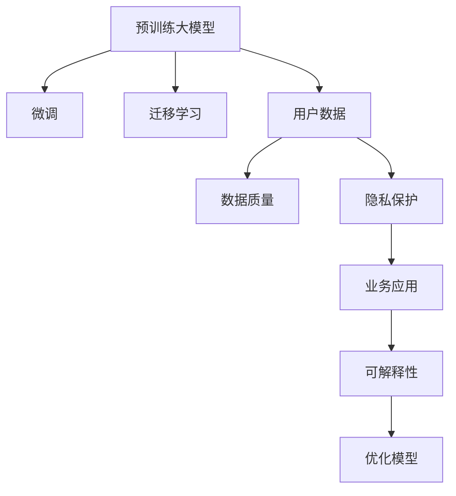

                 

# AI 大模型创业：如何利用用户优势？

> 关键词：大模型创业, 用户数据, 隐私保护, 数据质量, 用户行为, 业务应用

## 1. 背景介绍

### 1.1 问题由来

近年来，人工智能（AI）大模型，特别是基于Transformer架构的预训练语言模型（如GPT-3, BERT, T5等），在自然语言处理（NLP）领域取得了突破性的进展。这些模型通过大规模无监督学习获取了丰富的语言知识和语义表示，并在多项任务上表现优异。然而，尽管这些模型的性能令人印象深刻，但其高昂的训练成本和数据需求仍是一大挑战，这使得其在大规模企业中的应用受限。

为了应对这一问题，许多创业公司开始探索如何利用用户数据和大模型的优势，来构建具有实际应用价值的AI解决方案。本文将探讨如何通过利用用户数据和大模型，来推动AI创业公司的成长和发展。

### 1.2 问题核心关键点

1. **用户数据的重要性**：用户数据是大模型训练和微调的基础，对于提高模型的性能和泛化能力至关重要。
2. **隐私保护**：在大模型创业中，如何合法合规地收集和使用用户数据，同时确保用户隐私保护是一个关键问题。
3. **数据质量**：高质量的数据集是模型训练的前提，对于创业公司而言，获取和处理高价值数据是一项重要的任务。
4. **业务应用**：如何将大模型的能力应用于具体的业务场景，解决实际问题，提升用户体验，是创业公司成功与否的关键。
5. **模型优化**：如何针对特定业务需求优化大模型，提高其性能和可解释性，是技术实现中的核心挑战。

## 2. 核心概念与联系

### 2.1 核心概念概述

为更好地理解如何利用用户数据和大模型，本节将介绍几个密切相关的核心概念：

- **预训练大模型**：如GPT-3、BERT等，通过在大规模无标签文本数据上进行自监督学习，学习到通用的语言表示。
- **微调**：在预训练模型的基础上，使用特定的业务数据进行有监督学习，优化模型在特定任务上的性能。
- **迁移学习**：通过将在大规模任务上预训练的模型迁移到特定领域，利用其泛化能力提高新任务的表现。
- **用户数据**：来自用户的文本、行为数据等，是预训练模型和微调的重要数据来源。
- **隐私保护**：确保用户数据在收集和使用过程中的隐私和安全。
- **数据质量**：数据的准确性、完整性和多样性，对于模型训练和应用至关重要。
- **业务应用**：将AI技术应用于具体业务场景，提升业务效率和用户体验。
- **可解释性**：使AI模型的决策过程透明化，便于用户理解和信任。

这些核心概念之间的逻辑关系可以通过以下Mermaid流程图来展示：



这个流程图展示了核心概念之间的关系：

1. 预训练大模型通过自监督学习获得基础能力。
2. 微调将模型迁移到特定业务场景，进一步优化性能。
3. 用户数据是大模型和微调的基础。
4. 数据质量直接影响到模型的训练效果。
5. 隐私保护是用户数据收集和使用的前提。
6. 业务应用是模型实际应用的场景。
7. 可解释性是提升模型信任度的关键。

## 3. 核心算法原理 & 具体操作步骤

### 3.1 算法原理概述

利用用户数据和大模型的AI创业，主要基于以下步骤：

1. **数据收集**：从业务场景中收集用户数据，并进行预处理和标注。
2. **预训练模型选择**：选择适合业务需求的大模型作为初始化参数。
3. **模型微调**：在特定业务数据上，对预训练模型进行微调，使其适应新任务。
4. **模型部署**：将微调后的模型集成到业务系统中，实现自动化应用。
5. **持续优化**：根据用户反馈和业务需求，持续优化模型和数据处理流程。

### 3.2 算法步骤详解

**Step 1: 数据收集**

数据收集是大模型创业的第一步。创业公司需要设计合适的数据收集方案，涵盖业务场景中的各类文本和行为数据。以下是一些关键步骤：

1. **定义数据类型**：明确需要收集的数据类型，如用户评论、聊天记录、交易记录等。
2. **确定数据来源**：从用户端、业务系统、第三方数据源等渠道收集数据。
3. **数据预处理**：清洗、去重、匿名化处理，确保数据质量。
4. **数据标注**：对部分数据进行标注，如分类、情感分析、实体识别等，以供模型训练。

**Step 2: 预训练模型选择**

选择适合业务需求的大模型是创业成功的关键。以下是一些选择模型的方法：

1. **业务需求分析**：了解业务场景，明确需要解决的问题，如情感分析、分类、生成等。
2. **模型对比**：比较不同预训练模型的性能和适用性，如BERT、GPT-3、T5等。
3. **迁移学习考虑**：如果业务场景与已有模型的训练任务差异较大，考虑迁移学习，重新微调模型。

**Step 3: 模型微调**

在特定业务数据上，对预训练模型进行微调，以提高模型在该任务上的性能。以下是一些关键步骤：

1. **任务适配**：根据业务需求，设计合适的任务适配层和损失函数。
2. **数据分割**：将数据集划分为训练集、验证集和测试集，确保模型评估的公平性。
3. **超参数设置**：选择合适的学习率、优化器、正则化技术等，以防止过拟合。
4. **模型训练**：使用优化器更新模型参数，最小化损失函数，逐步提升模型性能。
5. **模型评估**：在测试集上评估模型性能，确保模型泛化能力强。

**Step 4: 模型部署**

将微调后的模型集成到业务系统中，实现自动化应用。以下是一些关键步骤：

1. **模型集成**：将模型封装为API或SDK，方便业务系统调用。
2. **系统集成**：将模型与业务系统集成，实现功能自动化。
3. **监控与优化**：实时监控模型性能，根据反馈优化模型和系统。

**Step 5: 持续优化**

根据用户反馈和业务需求，持续优化模型和数据处理流程。以下是一些关键步骤：

1. **用户反馈收集**：收集用户反馈，了解模型性能和用户体验。
2. **数据质量改进**：不断优化数据收集和标注流程，提高数据质量。
3. **模型持续优化**：根据新数据和新需求，持续微调模型，提升性能。

### 3.3 算法优缺点

利用用户数据和大模型的AI创业方法具有以下优点：

1. **高效性**：通过微调现有大模型，可以显著提高模型性能，减少从头训练的时间和成本。
2. **通用性**：大模型在多个NLP任务上表现优异，可以应用于多种业务场景。
3. **可扩展性**：微调模型可以在原有基础上进行扩展，适应新的业务需求。
4. **灵活性**：可以根据具体业务场景调整模型结构，提高模型适配能力。

同时，这种方法也存在以下缺点：

1. **数据依赖**：微调效果高度依赖于数据的质量和数量，获取高质量标注数据的成本较高。
2. **隐私风险**：用户数据的使用可能涉及隐私保护问题，需要严格遵循相关法律法规。
3. **资源消耗**：微调模型需要大量的计算资源，对硬件要求较高。
4. **可解释性不足**：微调模型通常缺乏可解释性，难以理解其内部工作机制。

## 4. 数学模型和公式 & 详细讲解 & 举例说明

### 4.1 数学模型构建

假设预训练模型为 $M_{\theta}$，用户数据集为 $D=\{(x_i, y_i)\}_{i=1}^N$，其中 $x_i$ 为输入文本，$y_i$ 为标签。

定义模型在数据样本 $(x,y)$ 上的损失函数为 $\ell(M_{\theta}(x),y)$，则在数据集 $D$ 上的经验风险为：

$$
\mathcal{L}(\theta) = \frac{1}{N} \sum_{i=1}^N \ell(M_{\theta}(x_i),y_i)
$$

微调的优化目标是最小化经验风险，即找到最优参数：

$$
\theta^* = \mathop{\arg\min}_{\theta} \mathcal{L}(\theta)
$$

在实践中，我们通常使用基于梯度的优化算法（如SGD、Adam等）来近似求解上述最优化问题。设 $\eta$ 为学习率，$\lambda$ 为正则化系数，则参数的更新公式为：

$$
\theta \leftarrow \theta - \eta \nabla_{\theta}\mathcal{L}(\theta) - \eta\lambda\theta
$$

其中 $\nabla_{\theta}\mathcal{L}(\theta)$ 为损失函数对参数 $\theta$ 的梯度，可通过反向传播算法高效计算。

### 4.2 公式推导过程

以下我们以情感分析任务为例，推导交叉熵损失函数及其梯度的计算公式。

假设模型 $M_{\theta}$ 在输入 $x$ 上的输出为 $\hat{y}=M_{\theta}(x) \in [0,1]$，表示样本属于正面情感的概率。真实标签 $y \in \{0,1\}$。则二分类交叉熵损失函数定义为：

$$
\ell(M_{\theta}(x),y) = -[y\log \hat{y} + (1-y)\log (1-\hat{y})]
$$

将其代入经验风险公式，得：

$$
\mathcal{L}(\theta) = -\frac{1}{N}\sum_{i=1}^N [y_i\log M_{\theta}(x_i)+(1-y_i)\log(1-M_{\theta}(x_i))]
$$

根据链式法则，损失函数对参数 $\theta_k$ 的梯度为：

$$
\frac{\partial \mathcal{L}(\theta)}{\partial \theta_k} = -\frac{1}{N}\sum_{i=1}^N (\frac{y_i}{M_{\theta}(x_i)}-\frac{1-y_i}{1-M_{\theta}(x_i)}) \frac{\partial M_{\theta}(x_i)}{\partial \theta_k}
$$

其中 $\frac{\partial M_{\theta}(x_i)}{\partial \theta_k}$ 可进一步递归展开，利用自动微分技术完成计算。

### 4.3 案例分析与讲解

假设我们希望构建一个针对电商平台用户评论的情感分析模型。具体步骤如下：

1. **数据收集**：从电商平台收集用户评论数据，进行清洗和标注。
2. **模型选择**：选择预训练的BERT模型作为初始化参数。
3. **任务适配**：在顶层添加线性分类器和交叉熵损失函数。
4. **数据分割**：将数据集划分为训练集、验证集和测试集。
5. **模型训练**：在训练集上使用AdamW优化器进行微调，学习率为 $2e-5$。
6. **模型评估**：在测试集上评估模型性能，计算准确率和F1分数。
7. **模型部署**：将模型集成到电商平台的评论系统，实时分析用户情感。
8. **持续优化**：根据用户反馈和业务需求，不断优化模型和数据处理流程。

## 5. 项目实践：代码实例和详细解释说明

### 5.1 开发环境搭建

在进行模型微调实践前，我们需要准备好开发环境。以下是使用Python进行PyTorch开发的环境配置流程：

1. 安装Anaconda：从官网下载并安装Anaconda，用于创建独立的Python环境。

2. 创建并激活虚拟环境：
```bash
conda create -n pytorch-env python=3.8 
conda activate pytorch-env
```

3. 安装PyTorch：根据CUDA版本，从官网获取对应的安装命令。例如：
```bash
conda install pytorch torchvision torchaudio cudatoolkit=11.1 -c pytorch -c conda-forge
```

4. 安装Transformers库：
```bash
pip install transformers
```

5. 安装各类工具包：
```bash
pip install numpy pandas scikit-learn matplotlib tqdm jupyter notebook ipython
```

完成上述步骤后，即可在`pytorch-env`环境中开始模型微调实践。

### 5.2 源代码详细实现

这里我们以电商平台用户评论情感分析任务为例，给出使用Transformers库对BERT模型进行微调的PyTorch代码实现。

首先，定义情感分析任务的数据处理函数：

```python
from transformers import BertTokenizer
from torch.utils.data import Dataset
import torch

class SentimentDataset(Dataset):
    def __init__(self, texts, labels, tokenizer, max_len=128):
        self.texts = texts
        self.labels = labels
        self.tokenizer = tokenizer
        self.max_len = max_len
        
    def __len__(self):
        return len(self.texts)
    
    def __getitem__(self, item):
        text = self.texts[item]
        label = self.labels[item]
        
        encoding = self.tokenizer(text, return_tensors='pt', max_length=self.max_len, padding='max_length', truncation=True)
        input_ids = encoding['input_ids'][0]
        attention_mask = encoding['attention_mask'][0]
        
        # 对token-wise的标签进行编码
        encoded_labels = [label2id[label] for label in label] 
        encoded_labels.extend([label2id['O']] * (self.max_len - len(encoded_labels)))
        labels = torch.tensor(encoded_labels, dtype=torch.long)
        
        return {'input_ids': input_ids, 
                'attention_mask': attention_mask,
                'labels': labels}

# 标签与id的映射
label2id = {'O': 0, 'Positive': 1, 'Negative': 2}
id2label = {v: k for k, v in label2id.items()}

# 创建dataset
tokenizer = BertTokenizer.from_pretrained('bert-base-cased')

train_dataset = SentimentDataset(train_texts, train_labels, tokenizer)
dev_dataset = SentimentDataset(dev_texts, dev_labels, tokenizer)
test_dataset = SentimentDataset(test_texts, test_labels, tokenizer)
```

然后，定义模型和优化器：

```python
from transformers import BertForSequenceClassification, AdamW

model = BertForSequenceClassification.from_pretrained('bert-base-cased', num_labels=len(label2id))

optimizer = AdamW(model.parameters(), lr=2e-5)
```

接着，定义训练和评估函数：

```python
from torch.utils.data import DataLoader
from tqdm import tqdm
from sklearn.metrics import classification_report

device = torch.device('cuda') if torch.cuda.is_available() else torch.device('cpu')
model.to(device)

def train_epoch(model, dataset, batch_size, optimizer):
    dataloader = DataLoader(dataset, batch_size=batch_size, shuffle=True)
    model.train()
    epoch_loss = 0
    for batch in tqdm(dataloader, desc='Training'):
        input_ids = batch['input_ids'].to(device)
        attention_mask = batch['attention_mask'].to(device)
        labels = batch['labels'].to(device)
        model.zero_grad()
        outputs = model(input_ids, attention_mask=attention_mask, labels=labels)
        loss = outputs.loss
        epoch_loss += loss.item()
        loss.backward()
        optimizer.step()
    return epoch_loss / len(dataloader)

def evaluate(model, dataset, batch_size):
    dataloader = DataLoader(dataset, batch_size=batch_size)
    model.eval()
    preds, labels = [], []
    with torch.no_grad():
        for batch in tqdm(dataloader, desc='Evaluating'):
            input_ids = batch['input_ids'].to(device)
            attention_mask = batch['attention_mask'].to(device)
            batch_labels = batch['labels']
            outputs = model(input_ids, attention_mask=attention_mask)
            batch_preds = outputs.logits.argmax(dim=2).to('cpu').tolist()
            batch_labels = batch_labels.to('cpu').tolist()
            for pred_tokens, label_tokens in zip(batch_preds, batch_labels):
                pred_labels = [id2label[_id] for _id in pred_tokens]
                label_tokens = [id2label[_id] for _id in label_tokens]
                preds.append(pred_labels[:len(label_tokens)])
                labels.append(label_tokens)
                
    print(classification_report(labels, preds))
```

最后，启动训练流程并在测试集上评估：

```python
epochs = 5
batch_size = 16

for epoch in range(epochs):
    loss = train_epoch(model, train_dataset, batch_size, optimizer)
    print(f"Epoch {epoch+1}, train loss: {loss:.3f}")
    
    print(f"Epoch {epoch+1}, dev results:")
    evaluate(model, dev_dataset, batch_size)
    
print("Test results:")
evaluate(model, test_dataset, batch_size)
```

以上就是使用PyTorch对BERT进行情感分析任务微调的完整代码实现。可以看到，得益于Transformers库的强大封装，我们可以用相对简洁的代码完成BERT模型的加载和微调。

### 5.3 代码解读与分析

让我们再详细解读一下关键代码的实现细节：

**SentimentDataset类**：
- `__init__`方法：初始化文本、标签、分词器等关键组件。
- `__len__`方法：返回数据集的样本数量。
- `__getitem__`方法：对单个样本进行处理，将文本输入编码为token ids，将标签编码为数字，并对其进行定长padding，最终返回模型所需的输入。

**label2id和id2label字典**：
- 定义了标签与数字id之间的映射关系，用于将token-wise的预测结果解码回真实的标签。

**训练和评估函数**：
- 使用PyTorch的DataLoader对数据集进行批次化加载，供模型训练和推理使用。
- 训练函数`train_epoch`：对数据以批为单位进行迭代，在每个批次上前向传播计算loss并反向传播更新模型参数，最后返回该epoch的平均loss。
- 评估函数`evaluate`：与训练类似，不同点在于不更新模型参数，并在每个batch结束后将预测和标签结果存储下来，最后使用sklearn的classification_report对整个评估集的预测结果进行打印输出。

**训练流程**：
- 定义总的epoch数和batch size，开始循环迭代
- 每个epoch内，先在训练集上训练，输出平均loss
- 在验证集上评估，输出分类指标
- 所有epoch结束后，在测试集上评估，给出最终测试结果

可以看到，PyTorch配合Transformers库使得BERT微调的代码实现变得简洁高效。开发者可以将更多精力放在数据处理、模型改进等高层逻辑上，而不必过多关注底层的实现细节。

当然，工业级的系统实现还需考虑更多因素，如模型的保存和部署、超参数的自动搜索、更灵活的任务适配层等。但核心的微调范式基本与此类似。

## 6. 实际应用场景

### 6.1 智能客服系统

基于大语言模型微调的对话技术，可以广泛应用于智能客服系统的构建。传统客服往往需要配备大量人力，高峰期响应缓慢，且一致性和专业性难以保证。而使用微调后的对话模型，可以7x24小时不间断服务，快速响应客户咨询，用自然流畅的语言解答各类常见问题。

在技术实现上，可以收集企业内部的历史客服对话记录，将问题和最佳答复构建成监督数据，在此基础上对预训练对话模型进行微调。微调后的对话模型能够自动理解用户意图，匹配最合适的答案模板进行回复。对于客户提出的新问题，还可以接入检索系统实时搜索相关内容，动态组织生成回答。如此构建的智能客服系统，能大幅提升客户咨询体验和问题解决效率。

### 6.2 金融舆情监测

金融机构需要实时监测市场舆论动向，以便及时应对负面信息传播，规避金融风险。传统的人工监测方式成本高、效率低，难以应对网络时代海量信息爆发的挑战。基于大语言模型微调的文本分类和情感分析技术，为金融舆情监测提供了新的解决方案。

具体而言，可以收集金融领域相关的新闻、报道、评论等文本数据，并对其进行主题标注和情感标注。在此基础上对预训练语言模型进行微调，使其能够自动判断文本属于何种主题，情感倾向是正面、中性还是负面。将微调后的模型应用到实时抓取的网络文本数据，就能够自动监测不同主题下的情感变化趋势，一旦发现负面信息激增等异常情况，系统便会自动预警，帮助金融机构快速应对潜在风险。

### 6.3 个性化推荐系统

当前的推荐系统往往只依赖用户的历史行为数据进行物品推荐，无法深入理解用户的真实兴趣偏好。基于大语言模型微调技术，个性化推荐系统可以更好地挖掘用户行为背后的语义信息，从而提供更精准、多样的推荐内容。

在实践中，可以收集用户浏览、点击、评论、分享等行为数据，提取和用户交互的物品标题、描述、标签等文本内容。将文本内容作为模型输入，用户的后续行为（如是否点击、购买等）作为监督信号，在此基础上微调预训练语言模型。微调后的模型能够从文本内容中准确把握用户的兴趣点。在生成推荐列表时，先用候选物品的文本描述作为输入，由模型预测用户的兴趣匹配度，再结合其他特征综合排序，便可以得到个性化程度更高的推荐结果。

### 6.4 未来应用展望

随着大语言模型微调技术的发展，未来将有更多创新应用场景涌现。

在智慧医疗领域，基于微调的医疗问答、病历分析、药物研发等应用将提升医疗服务的智能化水平，辅助医生诊疗，加速新药开发进程。

在智能教育领域，微调技术可应用于作业批改、学情分析、知识推荐等方面，因材施教，促进教育公平，提高教学质量。

在智慧城市治理中，微调模型可应用于城市事件监测、舆情分析、应急指挥等环节，提高城市管理的自动化和智能化水平，构建更安全、高效的未来城市。

此外，在企业生产、社会治理、文娱传媒等众多领域，基于大模型微调的人工智能应用也将不断涌现，为经济社会发展注入新的动力。相信随着技术的日益成熟，微调方法将成为人工智能落地应用的重要范式，推动人工智能技术向更广阔的领域加速渗透。

## 7. 工具和资源推荐

### 7.1 学习资源推荐

为了帮助开发者系统掌握大语言模型微调的理论基础和实践技巧，这里推荐一些优质的学习资源：

1. 《Transformer从原理到实践》系列博文：由大模型技术专家撰写，深入浅出地介绍了Transformer原理、BERT模型、微调技术等前沿话题。

2. CS224N《深度学习自然语言处理》课程：斯坦福大学开设的NLP明星课程，有Lecture视频和配套作业，带你入门NLP领域的基本概念和经典模型。

3. 《Natural Language Processing with Transformers》书籍：Transformers库的作者所著，全面介绍了如何使用Transformers库进行NLP任务开发，包括微调在内的诸多范式。

4. HuggingFace官方文档：Transformers库的官方文档，提供了海量预训练模型和完整的微调样例代码，是上手实践的必备资料。

5. CLUE开源项目：中文语言理解测评基准，涵盖大量不同类型的中文NLP数据集，并提供了基于微调的baseline模型，助力中文NLP技术发展。

通过对这些资源的学习实践，相信你一定能够快速掌握大语言模型微调的精髓，并用于解决实际的NLP问题。

### 7.2 开发工具推荐

高效的开发离不开优秀的工具支持。以下是几款用于大语言模型微调开发的常用工具：

1. PyTorch：基于Python的开源深度学习框架，灵活动态的计算图，适合快速迭代研究。大部分预训练语言模型都有PyTorch版本的实现。

2. TensorFlow：由Google主导开发的开源深度学习框架，生产部署方便，适合大规模工程应用。同样有丰富的预训练语言模型资源。

3. Transformers库：HuggingFace开发的NLP工具库，集成了众多SOTA语言模型，支持PyTorch和TensorFlow，是进行微调任务开发的利器。

4. Weights & Biases：模型训练的实验跟踪工具，可以记录和可视化模型训练过程中的各项指标，方便对比和调优。与主流深度学习框架无缝集成。

5. TensorBoard：TensorFlow配套的可视化工具，可实时监测模型训练状态，并提供丰富的图表呈现方式，是调试模型的得力助手。

6. Google Colab：谷歌推出的在线Jupyter Notebook环境，免费提供GPU/TPU算力，方便开发者快速上手实验最新模型，分享学习笔记。

合理利用这些工具，可以显著提升大语言模型微调任务的开发效率，加快创新迭代的步伐。

### 7.3 相关论文推荐

大语言模型和微调技术的发展源于学界的持续研究。以下是几篇奠基性的相关论文，推荐阅读：

1. Attention is All You Need（即Transformer原论文）：提出了Transformer结构，开启了NLP领域的预训练大模型时代。

2. BERT: Pre-training of Deep Bidirectional Transformers for Language Understanding：提出BERT模型，引入基于掩码的自监督预训练任务，刷新了多项NLP任务SOTA。

3. Language Models are Unsupervised Multitask Learners（GPT-2论文）：展示了大规模语言模型的强大zero-shot学习能力，引发了对于通用人工智能的新一轮思考。

4. Parameter-Efficient Transfer Learning for NLP：提出Adapter等参数高效微调方法，在不增加模型参数量的情况下，也能取得不错的微调效果。

5. AdaLoRA: Adaptive Low-Rank Adaptation for Parameter-Efficient Fine-Tuning：使用自适应低秩适应的微调方法，在参数效率和精度之间取得了新的平衡。

这些论文代表了大语言模型微调技术的发展脉络。通过学习这些前沿成果，可以帮助研究者把握学科前进方向，激发更多的创新灵感。

## 8. 总结：未来发展趋势与挑战

### 8.1 总结

本文对利用用户数据和大模型的AI创业方法进行了全面系统的介绍。首先阐述了用户数据的重要性、隐私保护、数据质量、业务应用、模型优化等核心概念，明确了利用用户数据和大模型进行AI创业的可行性和关键步骤。其次，从原理到实践，详细讲解了预训练模型选择、任务适配、数据收集与处理、模型微调、模型评估和部署等关键技术环节，提供了完整的代码实现和详细解释。

通过本文的系统梳理，可以看到，利用用户数据和大模型的AI创业方法具有高效性、通用性、可扩展性和灵活性，已经在情感分析、智能客服、个性化推荐等多个领域展现出了巨大潜力。未来，随着技术的不断成熟和应用的深入拓展，基于大模型的AI创业必将在更多行业得到广泛应用，推动人工智能技术的产业化进程。

### 8.2 未来发展趋势

展望未来，利用用户数据和大模型的AI创业将呈现以下几个发展趋势：

1. **多模态融合**：未来的AI系统将融合多种数据模态，如文本、图像、音频等，提供更加全面的智能服务。

2. **联邦学习**：利用用户数据的分布式特性，通过联邦学习等技术，在不泄露用户隐私的前提下，进行模型微调。

3. **元学习**：引入元学习算法，使AI模型能够快速适应新任务，提升模型的迁移能力。

4. **持续学习**：模型需要持续学习新知识，以适应不断变化的业务需求和数据分布。

5. **个性化推荐**：通过用户行为数据的深度挖掘，提供更加精准、个性化的推荐服务。

6. **零样本学习和少样本学习**：利用大模型的零样本学习和少样本学习能力，解决数据稀缺问题。

7. **可解释性和公平性**：提高AI模型的可解释性和公平性，增强用户信任和系统可靠性。

这些趋势展示了利用用户数据和大模型的AI创业的广阔前景。未来的技术突破和应用创新，将进一步提升AI系统的性能和智能化水平，为各行各业带来深远的变革。

### 8.3 面临的挑战

尽管利用用户数据和大模型的AI创业取得了显著成果，但在迈向更加智能化、普适化应用的过程中，仍面临诸多挑战：

1. **数据质量**：数据质量的高低直接影响模型的性能和泛化能力，获取高质量、多样化的用户数据是一个关键难题。

2. **隐私保护**：用户数据的收集和使用涉及隐私保护，如何合法合规地获取和使用数据，是一个重要的法律和伦理问题。

3. **计算资源**：模型训练和推理需要大量的计算资源，如何高效利用硬件资源，是一个重要的技术挑战。

4. **模型可解释性**：复杂的大模型往往缺乏可解释性，难以理解其内部工作机制，限制了其应用范围。

5. **鲁棒性和泛化性**：大模型在新任务和新数据上的鲁棒性和泛化性仍需进一步提升。

6. **数据分布变化**：模型需要不断更新和优化，以适应数据分布的变化，防止模型过时。

### 8.4 研究展望

面对这些挑战，未来的研究需要在以下几个方面寻求新的突破：

1. **数据质量提升**：开发更高效的数据收集和处理技术，提升数据质量和多样性。

2. **隐私保护机制**：探索联邦学习、差分隐私等隐私保护技术，确保用户数据的安全性。

3. **高效计算**：利用硬件加速、模型压缩等技术，提高模型的训练和推理效率。

4. **模型可解释性**：引入可解释性技术，如注意力机制、特征重要性分析等，增强模型的透明性。

5. **鲁棒性和泛化性增强**：通过对抗训练、模型蒸馏等技术，提升模型的鲁棒性和泛化能力。

6. **数据分布变化适应**：开发持续学习算法，使模型能够动态适应数据分布的变化，保持其时效性和适应性。

这些研究方向的探索，必将引领AI创业向更加智能化、普适化方向发展，推动AI技术的产业化进程，为各行各业带来深远影响。

## 9. 附录：常见问题与解答

**Q1：如何平衡模型性能和隐私保护？**

A: 平衡模型性能和隐私保护是一个重要的问题。以下是一些关键策略：

1. **数据匿名化**：在数据收集和处理过程中，对用户数据进行匿名化处理，去除或掩盖个人身份信息。
2. **差分隐私**：使用差分隐私技术，在保护用户隐私的前提下，进行模型训练和优化。
3. **联邦学习**：通过分布式学习方式，在多个设备或节点上进行模型训练，不泄露本地数据。
4. **多方安全计算**：在保证数据隐私的前提下，进行多方的安全计算和模型训练。

**Q2：如何提高模型的可解释性？**

A: 提高模型的可解释性是AI应用中的关键问题。以下是一些关键策略：

1. **注意力机制**：通过可视化模型的注意力权重，理解模型在不同特征上的关注点。
2. **特征重要性分析**：使用SHAP、LIME等方法，分析模型的特征重要性，理解模型决策的依据。
3. **模型蒸馏**：通过蒸馏技术，将复杂模型转换为更简洁、可解释的模型，便于理解和使用。
4. **可解释性模型**：使用决策树、规则模型等可解释性模型，增强系统的透明度和可靠性。

**Q3：如何处理数据不平衡问题？**

A: 数据不平衡是机器学习中常见的问题，以下是一些关键策略：

1. **数据增强**：通过数据增强技术，如生成对抗网络（GAN）、随机扰动等，增加少数类样本的数量。
2. **样本重采样**：通过欠采样（少数类样本重采样）或过采样（多数类样本重采样），平衡数据分布。
3. **损失函数调整**：使用加权损失函数，赋予少数类样本更大的权重，减少模型对多数类的依赖。

**Q4：如何选择适合的预训练模型？**

A: 选择适合的预训练模型是AI创业中的关键步骤。以下是一些关键策略：

1. **任务适配**：根据任务类型，选择合适的预训练模型。例如，文本分类任务可以选择BERT或GPT-2等。
2. **性能评估**：在公开数据集上进行预训练模型的评估，选择性能最优的模型。
3. **迁移学习**：如果预训练模型的训练任务与当前任务差异较大，可以考虑迁移学习，重新微调模型。

**Q5：如何应对数据分布变化？**

A: 数据分布变化是AI模型需要持续适应的问题。以下是一些关键策略：

1. **持续学习**：通过在线学习、增量学习等技术，使模型能够持续学习新知识，适应数据分布的变化。
2. **模型更新**：定期更新模型，使用新的数据进行微调，保持模型的时效性。
3. **数据监控**：实时监控模型性能和数据分布，及时发现异常并采取措施。

这些策略可以帮助开发者在实际应用中平衡模型性能和隐私保护，提高模型的可解释性，解决数据不平衡问题，选择适合的预训练模型，应对数据分布变化。通过这些技术手段，可以更好地利用用户数据和大模型，推动AI创业的发展和进步。

---

作者：禅与计算机程序设计艺术 / Zen and the Art of Computer Programming

