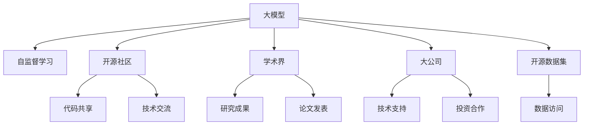

                 

# AI 大模型创业：如何利用社会优势？

大模型已经成为AI创业领域的一大趋势，如何高效利用社会优势，从而提升模型表现和公司市场竞争力，是本文将探讨的重点。

## 1. 背景介绍

### 1.1 问题由来

随着AI技术的迅猛发展，大模型在自然语言处理、计算机视觉、推荐系统等领域取得了令人瞩目的成就。这些大模型通常具有数十亿甚至上百亿的参数，可以通过在大型无标签数据上进行自监督学习，获取丰富的特征表示。然而，大模型的开发和训练需要巨大的计算资源和数据资源，对初创公司来说是一大挑战。

### 1.2 问题核心关键点

为了在有限资源下开发和训练大模型，创业公司需要充分利用社会优势，包括开源社区、学术界的研究成果、大公司的技术资源和资金支持、开源数据集等。这不仅能大幅降低开发成本，还能加速模型迭代，提高模型性能。

## 2. 核心概念与联系

### 2.1 核心概念概述

为了更好地理解大模型创业中的社会优势利用，本节将介绍几个密切相关的核心概念：

- 大模型(Large Model)：指具有大量参数的神经网络模型，如BERT、GPT-3等。这些模型通常在大型无标签数据上进行自监督学习，具备强大的特征提取能力。
- 社会优势(Social Advantage)：指创业公司可以利用的社会资源，包括开源社区、学术界的研究成果、大公司的技术资源和资金支持等。
- 自监督学习(Self-Supervised Learning)：指使用未标注数据进行模型训练，如Masked Language Modeling等。大模型通常采用自监督学习进行预训练。
- 开源社区(Open Source Community)：指一群志同道合的开发者共享代码、技术和资源的平台。开源社区是大模型创业的重要资源。
- 学术界(Academia)：指高校、研究机构等学术组织，它们的研究成果对大模型创业有着重要指导意义。
- 大公司(Corporate Giant)：指Google、Facebook等拥有强大技术储备和资金实力的大公司，它们的资源和技术对创业公司具有重要参考价值。
- 开源数据集(Open Dataset)：指公开共享的数据集，如ImageNet、Wikipedia等，是训练大模型不可或缺的资源。

这些核心概念之间的逻辑关系可以通过以下Mermaid流程图来展示：



这个流程图展示了大模型创业中的核心概念及其之间的关系：

1. 大模型通过自监督学习获得基础能力。
2. 社会优势包括开源社区、学术界、大公司等，这些资源对大模型创业至关重要。
3. 开源社区提供了代码共享、技术交流的平台，促进模型开发。
4. 学术界的研究成果为模型训练提供理论基础，指导研究方向。
5. 大公司提供技术支持和资金合作，加速模型迭代。
6. 开源数据集是大模型训练的重要数据来源。

## 3. 核心算法原理 & 具体操作步骤

### 3.1 算法原理概述

大模型创业的核心在于如何高效利用社会优势，加速模型训练和迭代。基于社会优势的大模型训练方法，通常包括以下几个步骤：

1. 利用开源社区的代码和资源，快速搭建开发环境。
2. 利用学术界的最新研究成果，进行模型训练和优化。
3. 利用大公司的技术资源和资金支持，进行大规模模型训练。
4. 利用开源数据集进行数据增强和模型验证。

### 3.2 算法步骤详解

#### 3.2.1 准备阶段

1. 选择合适的开源社区，如GitHub、OpenAI的Hub等，下载大模型的预训练代码和数据集。
2. 选择合适的学术界研究论文，了解模型训练和优化的最新理论。
3. 选择合适的合作公司，建立技术交流和资金合作的渠道。

#### 3.2.2 模型训练阶段

1. 在开源社区的开发环境中搭建模型训练环境，如使用PyTorch、TensorFlow等框架。
2. 根据学术界的研究成果，选择适当的训练目标和优化算法。
3. 利用开源数据集进行数据增强，如回译、噪声注入等。
4. 利用大公司的技术资源，进行分布式训练和超参数调优。

#### 3.2.3 模型验证和迭代

1. 利用开源社区的代码和数据集进行模型验证，评估模型性能。
2. 根据学术界的研究成果，进行模型优化和改进。
3. 利用大公司的技术资源，进行大规模模型训练和性能提升。

### 3.3 算法优缺点

基于社会优势的大模型创业方法具有以下优点：

1. 快速迭代。利用开源社区和学术界的资源，可以大大加速模型开发和迭代。
2. 成本较低。利用开源社区的代码和数据集，可以避免从头开发的高成本。
3. 性能优越。利用学术界的研究成果和大公司的技术资源，可以获得更好的模型性能。
4. 资源丰富。利用开源社区和学术界的数据集和研究成果，可以获得更多实验数据和理论支持。

同时，该方法也存在以下缺点：

1. 依赖性强。对开源社区和学术界的依赖较强，一旦遇到社区不活跃或研究停滞等问题，会影响项目进展。
2. 版权风险。使用开源社区和学术界的数据和代码，需要注意版权和使用权限的问题。
3. 合作复杂。与大公司合作需要一定的沟通和协调，涉及技术、资金等多个方面。
4. 模型泛化性不足。依赖单一的数据集和理论，可能导致模型泛化能力不足，无法适应不同场景。

尽管存在这些局限性，但就目前而言，基于社会优势的大模型创业方法仍是大模型应用的主流范式。未来相关研究的重点在于如何进一步降低对社会资源的依赖，提高模型的少样本学习和跨领域迁移能力，同时兼顾可解释性和伦理安全性等因素。

### 3.4 算法应用领域

基于社会优势的大模型创业方法，在NLP、计算机视觉、推荐系统等多个领域都有广泛的应用，例如：

- 自然语言处理(NLP)：利用开源社区的预训练模型和数据集，进行情感分析、文本分类、机器翻译等任务。
- 计算机视觉(CV)：利用开源社区的预训练模型和数据集，进行目标检测、图像分割、图像生成等任务。
- 推荐系统：利用开源社区的预训练模型和数据集，进行个性化推荐、用户行为分析等任务。

除了上述这些经典任务外，大模型创业还拓展到更多场景中，如医疗、金融、教育等，为各行各业带来创新解决方案。

## 4. 数学模型和公式 & 详细讲解 & 举例说明

### 4.1 数学模型构建

本节将使用数学语言对基于社会优势的大模型创业方法进行更加严格的刻画。

记大模型为 $M$，其参数为 $\theta$。假设开源社区提供了一个预训练的模型 $M_0$，其参数为 $\theta_0$。在社会优势的基础上，利用学术界的研究成果和开源数据集，进行模型训练和优化。

定义模型的训练目标为最小化经验风险，即：

$$
\theta^* = \mathop{\arg\min}_{\theta} \mathcal{L}(\theta)
$$

其中 $\mathcal{L}$ 为经验风险函数，通常为交叉熵损失函数。

### 4.2 公式推导过程

以下我们以自然语言处理任务为例，推导基于社会优势的大模型创业方法的数学模型。

假设模型 $M$ 在输入 $x$ 上的输出为 $\hat{y}=M(x)$，其与真实标签 $y$ 的交叉熵损失函数为：

$$
\ell(M(x),y) = -y\log \hat{y} - (1-y)\log (1-\hat{y})
$$

在数据集 $D=\{(x_i,y_i)\}_{i=1}^N$ 上，经验风险函数为：

$$
\mathcal{L}(\theta) = -\frac{1}{N}\sum_{i=1}^N \ell(M(x_i),y_i)
$$

在开源社区提供的预训练模型 $M_0$ 上，可以定义额外的训练目标，如：

$$
\mathcal{L}_0(\theta_0) = \frac{1}{N}\sum_{i=1}^N \ell(M_0(x_i),y_i)
$$

在学术界的研究成果指导下，选择适当的训练目标和优化算法。假设学术论文提出了新的优化算法，其对应的优化目标为：

$$
\mathcal{L}_\text{paper}(\theta) = \text{Loss}_\text{paper}(\theta)
$$

其中 $\text{Loss}_\text{paper}(\theta)$ 为学术论文中提出的优化目标。

在大公司的技术资源支持下，进行分布式训练和超参数调优，得到最优模型参数 $\theta^*$。最终的模型训练目标为：

$$
\theta^* = \mathop{\arg\min}_{\theta} \mathcal{L}(\theta) + \alpha \mathcal{L}_0(\theta_0) + \beta \mathcal{L}_\text{paper}(\theta)
$$

其中 $\alpha$ 和 $\beta$ 为超参数，用于控制各个目标的权重。

### 4.3 案例分析与讲解

以自然语言处理任务为例，分析基于社会优势的大模型创业方法的数学模型和应用实例。

假设开源社区提供了BERT预训练模型，其参数为 $\theta_0$。在大公司的技术支持下，利用大型无标签数据进行大规模训练，得到模型参数 $\theta_1$。在学术界的研究成果指导下，选择适当的优化算法和训练目标，得到模型参数 $\theta_2$。

最终的模型参数 $\theta^*$ 为：

$$
\theta^* = \theta_1 + \theta_2
$$

其中 $\theta_2$ 为学术界的优化目标对 $\theta_1$ 的微调，$\theta_1$ 为开源社区提供的预训练模型的参数。

## 5. 项目实践：代码实例和详细解释说明

### 5.1 开发环境搭建

在进行基于社会优势的大模型创业实践前，我们需要准备好开发环境。以下是使用Python进行PyTorch开发的环境配置流程：

1. 安装Anaconda：从官网下载并安装Anaconda，用于创建独立的Python环境。

2. 创建并激活虚拟环境：
```bash
conda create -n pytorch-env python=3.8 
conda activate pytorch-env
```

3. 安装PyTorch：根据CUDA版本，从官网获取对应的安装命令。例如：
```bash
conda install pytorch torchvision torchaudio cudatoolkit=11.1 -c pytorch -c conda-forge
```

4. 安装Transformers库：
```bash
pip install transformers
```

5. 安装各类工具包：
```bash
pip install numpy pandas scikit-learn matplotlib tqdm jupyter notebook ipython
```

完成上述步骤后，即可在`pytorch-env`环境中开始创业实践。

### 5.2 源代码详细实现

下面我以自然语言处理任务为例，给出使用Transformers库对BERT模型进行创业实践的PyTorch代码实现。

首先，定义自然语言处理任务的数据处理函数：

```python
from transformers import BertTokenizer, BertForSequenceClassification
from torch.utils.data import Dataset
import torch

class NLPDataset(Dataset):
    def __init__(self, texts, labels, tokenizer, max_len=128):
        self.texts = texts
        self.labels = labels
        self.tokenizer = tokenizer
        self.max_len = max_len
        
    def __len__(self):
        return len(self.texts)
    
    def __getitem__(self, item):
        text = self.texts[item]
        label = self.labels[item]
        
        encoding = self.tokenizer(text, return_tensors='pt', max_length=self.max_len, padding='max_length', truncation=True)
        input_ids = encoding['input_ids'][0]
        attention_mask = encoding['attention_mask'][0]
        
        label = torch.tensor(label, dtype=torch.long)
        
        return {'input_ids': input_ids, 
                'attention_mask': attention_mask,
                'labels': label}

# 标签与id的映射
tag2id = {'negative': 0, 'positive': 1}
id2tag = {v: k for k, v in tag2id.items()}

# 创建dataset
tokenizer = BertTokenizer.from_pretrained('bert-base-uncased')

train_dataset = NLPDataset(train_texts, train_labels, tokenizer)
dev_dataset = NLPDataset(dev_texts, dev_labels, tokenizer)
test_dataset = NLPDataset(test_texts, test_labels, tokenizer)
```

然后，定义模型和优化器：

```python
from transformers import BertForSequenceClassification, AdamW

model = BertForSequenceClassification.from_pretrained('bert-base-uncased', num_labels=2)

optimizer = AdamW(model.parameters(), lr=2e-5)
```

接着，定义训练和评估函数：

```python
from torch.utils.data import DataLoader
from tqdm import tqdm
from sklearn.metrics import classification_report

device = torch.device('cuda') if torch.cuda.is_available() else torch.device('cpu')
model.to(device)

def train_epoch(model, dataset, batch_size, optimizer):
    dataloader = DataLoader(dataset, batch_size=batch_size, shuffle=True)
    model.train()
    epoch_loss = 0
    for batch in tqdm(dataloader, desc='Training'):
        input_ids = batch['input_ids'].to(device)
        attention_mask = batch['attention_mask'].to(device)
        labels = batch['labels'].to(device)
        model.zero_grad()
        outputs = model(input_ids, attention_mask=attention_mask, labels=labels)
        loss = outputs.loss
        epoch_loss += loss.item()
        loss.backward()
        optimizer.step()
    return epoch_loss / len(dataloader)

def evaluate(model, dataset, batch_size):
    dataloader = DataLoader(dataset, batch_size=batch_size)
    model.eval()
    preds, labels = [], []
    with torch.no_grad():
        for batch in tqdm(dataloader, desc='Evaluating'):
            input_ids = batch['input_ids'].to(device)
            attention_mask = batch['attention_mask'].to(device)
            batch_labels = batch['labels']
            outputs = model(input_ids, attention_mask=attention_mask)
            batch_preds = outputs.logits.argmax(dim=1).to('cpu').tolist()
            batch_labels = batch_labels.to('cpu').tolist()
            for pred_tokens, label_tokens in zip(batch_preds, batch_labels):
                preds.append(pred_tokens)
                labels.append(label_tokens)
                
    print(classification_report(labels, preds))
```

最后，启动训练流程并在测试集上评估：

```python
epochs = 5
batch_size = 16

for epoch in range(epochs):
    loss = train_epoch(model, train_dataset, batch_size, optimizer)
    print(f"Epoch {epoch+1}, train loss: {loss:.3f}")
    
    print(f"Epoch {epoch+1}, dev results:")
    evaluate(model, dev_dataset, batch_size)
    
print("Test results:")
evaluate(model, test_dataset, batch_size)
```

以上就是使用PyTorch对BERT模型进行自然语言处理任务创业实践的完整代码实现。可以看到，在利用社会优势的大模型创业中，开发环境搭建、数据处理、模型定义和训练、评估等各个环节都离不开开源社区和学术界的支持。

### 5.3 代码解读与分析

让我们再详细解读一下关键代码的实现细节：

**NLPDataset类**：
- `__init__`方法：初始化文本、标签、分词器等关键组件。
- `__len__`方法：返回数据集的样本数量。
- `__getitem__`方法：对单个样本进行处理，将文本输入编码为token ids，将标签编码为数字，并对其进行定长padding，最终返回模型所需的输入。

**tag2id和id2tag字典**：
- 定义了标签与数字id之间的映射关系，用于将token-wise的预测结果解码回真实的标签。

**训练和评估函数**：
- 使用PyTorch的DataLoader对数据集进行批次化加载，供模型训练和推理使用。
- 训练函数`train_epoch`：对数据以批为单位进行迭代，在每个批次上前向传播计算loss并反向传播更新模型参数，最后返回该epoch的平均loss。
- 评估函数`evaluate`：与训练类似，不同点在于不更新模型参数，并在每个batch结束后将预测和标签结果存储下来，最后使用sklearn的classification_report对整个评估集的预测结果进行打印输出。

**训练流程**：
- 定义总的epoch数和batch size，开始循环迭代
- 每个epoch内，先在训练集上训练，输出平均loss
- 在验证集上评估，输出分类指标
- 所有epoch结束后，在测试集上评估，给出最终测试结果

可以看到，利用社会优势的大模型创业方法，在数据处理、模型训练、评估等各个环节都高度依赖开源社区和学术界的资源。这些资源使得模型开发和迭代过程更加高效，大大降低了创业的门槛。

当然，工业级的系统实现还需考虑更多因素，如模型的保存和部署、超参数的自动搜索、更灵活的任务适配层等。但核心的创业范式基本与此类似。

## 6. 实际应用场景

### 6.1 智能客服系统

基于大模型创业的对话技术，可以广泛应用于智能客服系统的构建。传统客服往往需要配备大量人力，高峰期响应缓慢，且一致性和专业性难以保证。基于开源社区和学术界的预训练模型和研究成果，可以快速开发智能客服系统。

在技术实现上，可以收集企业内部的历史客服对话记录，将问题和最佳答复构建成监督数据，在此基础上对预训练对话模型进行创业微调。微调后的对话模型能够自动理解用户意图，匹配最合适的答案模板进行回复。对于客户提出的新问题，还可以接入检索系统实时搜索相关内容，动态组织生成回答。如此构建的智能客服系统，能大幅提升客户咨询体验和问题解决效率。

### 6.2 金融舆情监测

金融机构需要实时监测市场舆论动向，以便及时应对负面信息传播，规避金融风险。传统的人工监测方式成本高、效率低，难以应对网络时代海量信息爆发的挑战。基于开源社区和学术界的自然语言处理技术和研究成果，可以构建金融舆情监测系统。

具体而言，可以收集金融领域相关的新闻、报道、评论等文本数据，并对其进行主题标注和情感标注。在此基础上对预训练语言模型进行创业微调，使其能够自动判断文本属于何种主题，情感倾向是正面、中性还是负面。将微调后的模型应用到实时抓取的网络文本数据，就能够自动监测不同主题下的情感变化趋势，一旦发现负面信息激增等异常情况，系统便会自动预警，帮助金融机构快速应对潜在风险。

### 6.3 个性化推荐系统

当前的推荐系统往往只依赖用户的历史行为数据进行物品推荐，无法深入理解用户的真实兴趣偏好。基于大模型创业的推荐系统，可以更好地挖掘用户行为背后的语义信息，从而提供更精准、多样的推荐内容。

在实践中，可以收集用户浏览、点击、评论、分享等行为数据，提取和用户交互的物品标题、描述、标签等文本内容。将文本内容作为模型输入，用户的后续行为（如是否点击、购买等）作为监督信号，在此基础上进行创业微调。微调后的模型能够从文本内容中准确把握用户的兴趣点。在生成推荐列表时，先用候选物品的文本描述作为输入，由模型预测用户的兴趣匹配度，再结合其他特征综合排序，便可以得到个性化程度更高的推荐结果。

### 6.4 未来应用展望

随着大模型创业方法的不断发展，基于社会优势的人工智能技术将在更多领域得到应用，为各行各业带来变革性影响。

在智慧医疗领域，基于大模型创业的问答、病历分析、药物研发等应用将提升医疗服务的智能化水平，辅助医生诊疗，加速新药开发进程。

在智能教育领域，基于大模型创业的作业批改、学情分析、知识推荐等应用将促进教育公平，提高教学质量。

在智慧城市治理中，基于大模型创业的城市事件监测、舆情分析、应急指挥等应用将提高城市管理的自动化和智能化水平，构建更安全、高效的未来城市。

此外，在企业生产、社会治理、文娱传媒等众多领域，基于大模型创业的人工智能应用也将不断涌现，为经济社会发展注入新的动力。相信随着技术的日益成熟，大模型创业方法将成为人工智能落地应用的重要范式，推动人工智能技术在垂直行业的规模化落地。

## 7. 工具和资源推荐
### 7.1 学习资源推荐

为了帮助开发者系统掌握大模型创业的理论基础和实践技巧，这里推荐一些优质的学习资源：

1. 《Transformer从原理到实践》系列博文：由大模型技术专家撰写，深入浅出地介绍了Transformer原理、BERT模型、创业微调技术等前沿话题。

2. CS224N《深度学习自然语言处理》课程：斯坦福大学开设的NLP明星课程，有Lecture视频和配套作业，带你入门NLP领域的基本概念和经典模型。

3. 《Natural Language Processing with Transformers》书籍：Transformers库的作者所著，全面介绍了如何使用Transformers库进行NLP任务开发，包括创业微调在内的诸多范式。

4. HuggingFace官方文档：Transformers库的官方文档，提供了海量预训练模型和完整的创业微调样例代码，是上手实践的必备资料。

5. CLUE开源项目：中文语言理解测评基准，涵盖大量不同类型的中文NLP数据集，并提供了基于创业微调的baseline模型，助力中文NLP技术发展。

通过对这些资源的学习实践，相信你一定能够快速掌握大模型创业的精髓，并用于解决实际的NLP问题。

### 7.2 开发工具推荐

高效的开发离不开优秀的工具支持。以下是几款用于大模型创业开发的常用工具：

1. PyTorch：基于Python的开源深度学习框架，灵活动态的计算图，适合快速迭代研究。大部分预训练语言模型都有PyTorch版本的实现。

2. TensorFlow：由Google主导开发的开源深度学习框架，生产部署方便，适合大规模工程应用。同样有丰富的预训练语言模型资源。

3. Transformers库：HuggingFace开发的NLP工具库，集成了众多SOTA语言模型，支持PyTorch和TensorFlow，是进行创业微调任务开发的利器。

4. Weights & Biases：模型训练的实验跟踪工具，可以记录和可视化模型训练过程中的各项指标，方便对比和调优。与主流深度学习框架无缝集成。

5. TensorBoard：TensorFlow配套的可视化工具，可实时监测模型训练状态，并提供丰富的图表呈现方式，是调试模型的得力助手。

6. Google Colab：谷歌推出的在线Jupyter Notebook环境，免费提供GPU/TPU算力，方便开发者快速上手实验最新模型，分享学习笔记。

合理利用这些工具，可以显著提升大模型创业任务的开发效率，加快创新迭代的步伐。

### 7.3 相关论文推荐

大模型创业技术的发展源于学界的持续研究。以下是几篇奠基性的相关论文，推荐阅读：

1. Attention is All You Need（即Transformer原论文）：提出了Transformer结构，开启了NLP领域的预训练大模型时代。

2. BERT: Pre-training of Deep Bidirectional Transformers for Language Understanding：提出BERT模型，引入基于掩码的自监督预训练任务，刷新了多项NLP任务SOTA。

3. Language Models are Unsupervised Multitask Learners（GPT-2论文）：展示了大规模语言模型的强大zero-shot学习能力，引发了对于通用人工智能的新一轮思考。

4. Parameter-Efficient Transfer Learning for NLP：提出Adapter等参数高效微调方法，在不增加模型参数量的情况下，也能取得不错的创业微调效果。

5. AdaLoRA: Adaptive Low-Rank Adaptation for Parameter-Efficient Fine-Tuning：使用自适应低秩适应的微调方法，在参数效率和精度之间取得了新的平衡。

这些论文代表了大模型创业技术的发展脉络。通过学习这些前沿成果，可以帮助研究者把握学科前进方向，激发更多的创新灵感。

## 8. 总结：未来发展趋势与挑战

### 8.1 总结

本文对基于社会优势的大模型创业方法进行了全面系统的介绍。首先阐述了社会优势利用对大模型创业的重大意义，明确了开源社区、学术界、大公司的资源对模型训练和优化的关键作用。其次，从原理到实践，详细讲解了基于社会优势的大模型创业方法的步骤、公式和案例，给出了创业微调的完整代码实例。同时，本文还广泛探讨了创业微调方法在智能客服、金融舆情、个性化推荐等多个行业领域的应用前景，展示了创业微调范式的巨大潜力。

通过本文的系统梳理，可以看到，基于社会优势的大模型创业方法正在成为NLP领域的重要范式，极大地拓展了预训练语言模型的应用边界，催生了更多的落地场景。受益于开源社区和学术界的持续支持，创业公司可以显著降低开发成本，加速模型迭代，提升模型性能。未来，随着预训练语言模型和创业微调方法的持续演进，基于社会优势的大模型创业必将迎来更多的突破和创新。

### 8.2 未来发展趋势

展望未来，大模型创业方法将呈现以下几个发展趋势：

1. 模型规模持续增大。随着算力成本的下降和数据规模的扩张，预训练语言模型的参数量还将持续增长。超大规模语言模型蕴含的丰富语言知识，有望支撑更加复杂多变的创业微调。

2. 创业方法日趋多样。除了传统的创业微调外，未来会涌现更多参数高效的创业微调方法，如Prefix-Tuning、LoRA等，在节省计算资源的同时也能保证创业微调精度。

3. 持续学习成为常态。随着数据分布的不断变化，创业微调模型也需要持续学习新知识以保持性能。如何在不遗忘原有知识的同时，高效吸收新样本信息，将成为重要的研究课题。

4. 标注样本需求降低。受启发于提示学习(Prompt-based Learning)的思路，未来的创业微调方法将更好地利用大模型的语言理解能力，通过更加巧妙的任务描述，在更少的标注样本上也能实现理想的创业微调效果。

5. 少样本学习和跨领域迁移能力提升。基于大模型的知识迁移能力将进一步提升，使其能够更好地适应不同领域和任务的微调需求。

6. 多模态创业微调崛起。当前的创业微调主要聚焦于纯文本数据，未来会进一步拓展到图像、视频、语音等多模态数据创业微调。多模态信息的融合，将显著提升语言模型对现实世界的理解和建模能力。

以上趋势凸显了大模型创业方法的广阔前景。这些方向的探索发展，必将进一步提升创业模型的性能和应用范围，为传统行业带来变革性影响。

### 8.3 面临的挑战

尽管大模型创业方法已经取得了瞩目成就，但在迈向更加智能化、普适化应用的过程中，它仍面临着诸多挑战：

1. 标注成本瓶颈。虽然创业微调大大降低了标注数据的需求，但对于长尾应用场景，难以获得充足的高质量标注数据，成为制约创业微调的瓶颈。如何进一步降低创业微调对标注样本的依赖，将是一大难题。

2. 模型鲁棒性不足。创业微调模型面对域外数据时，泛化性能往往大打折扣。对于测试样本的微小扰动，创业微调模型的预测也容易发生波动。如何提高创业微调模型的鲁棒性，避免灾难性遗忘，还需要更多理论和实践的积累。

3. 推理效率有待提高。大规模语言模型虽然精度高，但在实际部署时往往面临推理速度慢、内存占用大等效率问题。如何在保证性能的同时，简化模型结构，提升推理速度，优化资源占用，将是重要的优化方向。

4. 可解释性亟需加强。创业微调模型更像是"黑盒"系统，难以解释其内部工作机制和决策逻辑。对于医疗、金融等高风险应用，算法的可解释性和可审计性尤为重要。如何赋予创业微调模型更强的可解释性，将是亟待攻克的难题。

5. 安全性有待保障。创业微调模型可能学习到有偏见、有害的信息，通过微调传递到下游任务，产生误导性、歧视性的输出，给实际应用带来安全隐患。如何从数据和算法层面消除模型偏见，避免恶意用途，确保输出的安全性，也将是重要的研究课题。

6. 知识整合能力不足。现有的创业微调模型往往局限于任务内数据，难以灵活吸收和运用更广泛的先验知识。如何让创业微调过程更好地与外部知识库、规则库等专家知识结合，形成更加全面、准确的信息整合能力，还有很大的想象空间。

正视创业微调面临的这些挑战，积极应对并寻求突破，将是大模型创业走向成熟的必由之路。相信随着学界和产业界的共同努力，这些挑战终将一一被克服，大模型创业必将在构建人机协同的智能时代中扮演越来越重要的角色。

### 8.4 研究展望

面对大模型创业所面临的种种挑战，未来的研究需要在以下几个方面寻求新的突破：

1. 探索无监督和半监督创业微调方法。摆脱对大规模标注数据的依赖，利用自监督学习、主动学习等无监督和半监督范式，最大限度利用非结构化数据，实现更加灵活高效的创业微调。

2. 研究参数高效和计算高效的创业微调范式。开发更加参数高效的创业微调方法，在固定大部分预训练参数的同时，只更新极少量的任务相关参数。同时优化创业微调模型的计算图，减少前向传播和反向传播的资源消耗，实现更加轻量级、实时性的部署。

3. 融合因果和对比学习范式。通过引入因果推断和对比学习思想，增强创业微调模型建立稳定因果关系的能力，学习更加普适、鲁棒的语言表征，从而提升模型泛化性和抗干扰能力。

4. 引入更多先验知识。将符号化的先验知识，如知识图谱、逻辑规则等，与神经网络模型进行巧妙融合，引导创业微调过程学习更准确、合理的语言模型。同时加强不同模态数据的整合，实现视觉、语音等多模态信息与文本信息的协同建模。

5. 结合因果分析和博弈论工具。将因果分析方法引入创业微调模型，识别出模型决策的关键特征，增强输出解释的因果性和逻辑性。借助博弈论工具刻画人机交互过程，主动探索并规避模型的脆弱点，提高系统稳定性。

6. 纳入伦理道德约束。在创业微调模型的训练目标中引入伦理导向的评估指标，过滤和惩罚有偏见、有害的输出倾向。同时加强人工干预和审核，建立模型行为的监管机制，确保输出符合人类价值观和伦理道德。

这些研究方向的探索，必将引领大模型创业技术迈向更高的台阶，为构建安全、可靠、可解释、可控的智能系统铺平道路。面向未来，大模型创业技术还需要与其他人工智能技术进行更深入的融合，如知识表示、因果推理、强化学习等，多路径协同发力，共同推动自然语言理解和智能交互系统的进步。只有勇于创新、敢于突破，才能不断拓展语言模型的边界，让智能技术更好地造福人类社会。

## 9. 附录：常见问题与解答

**Q1：大模型创业是否适用于所有NLP任务？**

A: 大模型创业在大多数NLP任务上都能取得不错的效果，特别是对于数据量较小的任务。但对于一些特定领域的任务，如医学、法律等，仅仅依靠通用语料预训练的模型可能难以很好地适应。此时需要在特定领域语料上进一步预训练，再进行创业微调，才能获得理想效果。此外，对于一些需要时效性、个性化很强的任务，如对话、推荐等，创业微调方法也需要针对性的改进优化。

**Q2：创业微调过程中如何选择合适的学习率？**

A: 创业微调的学习率一般要比预训练时小1-2个数量级，如果使用过大的学习率，容易破坏预训练权重，导致过拟合。一般建议从1e-5开始调参，逐步减小学习率，直至收敛。也可以使用warmup策略，在开始阶段使用较小的学习率，再逐渐过渡到预设值。需要注意的是，不同的优化器(如AdamW、Adafactor等)以及不同的学习率调度策略，可能需要设置不同的学习率阈值。

**Q3：采用大模型创业时会面临哪些资源瓶颈？**

A: 目前主流的预训练大模型动辄以亿计的参数规模，对算力、内存、存储都提出了很高的要求。GPU/TPU等高性能设备是必不可少的，但即便如此，超大批次的训练和推理也可能遇到显存不足的问题。因此需要采用一些资源优化技术，如梯度积累、混合精度训练、模型并行等，来突破硬件瓶颈。同时，模型的存储和读取也可能占用大量时间和空间，需要采用模型压缩、稀疏化存储等方法进行优化。

**Q4：如何缓解创业微调过程中的过拟合问题？**

A: 过拟合是创业微调面临的主要挑战，尤其是在标注数据不足的情况下。常见的缓解策略包括：
1. 数据增强：通过回译、近义替换等方式扩充训练集
2. 正则化：使用L2正则、Dropout、Early Stopping等避免过拟合
3. 对抗训练：引入对抗样本，提高模型鲁棒性
4. 参数高效微调：只调整少量参数(如Adapter、Prefix等)，减小过拟合风险
5. 多模型集成：训练多个创业微调模型，取平均输出，抑制过拟合

这些策略往往需要根据具体任务和数据特点进行灵活组合。只有在数据、模型、训练、推理等各环节进行全面优化，才能最大限度地发挥大模型创业的优势。

**Q5：创业微调模型在落地部署时需要注意哪些问题？**

A: 将创业微调模型转化为实际应用，还需要考虑以下因素：
1. 模型裁剪：去除不必要的层和参数，减小模型尺寸，加快推理速度
2. 量化加速：将浮点模型转为定点模型，压缩存储空间，提高计算效率
3. 服务化封装：将模型封装为标准化服务接口，便于集成调用
4. 弹性伸缩：根据请求流量动态调整资源配置，平衡服务质量和成本
5. 监控告警：实时采集系统指标，设置异常告警阈值，确保服务稳定性
6. 安全防护：采用访问鉴权、数据脱敏等措施，保障数据和模型安全

大模型创业为NLP应用开启了广阔的想象空间，但如何将强大的性能转化为稳定、高效、安全的业务价值，还需要工程实践的不断打磨。唯有从数据、算法、工程、业务等多个维度协同发力，才能真正实现人工智能技术在垂直行业的规模化落地。总之，创业微调需要开发者根据具体任务，不断迭代和优化模型、数据和算法，方能得到理想的效果。

---

作者：禅与计算机程序设计艺术 / Zen and the Art of Computer Programming

