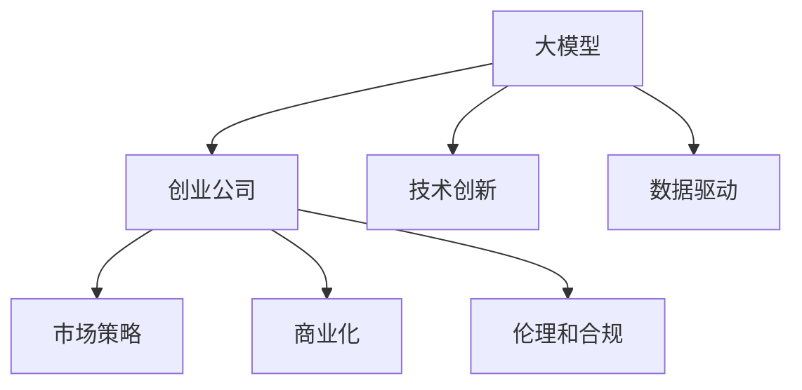

                 

# AI 大模型创业：如何利用竞争优势？

> 关键词：AI大模型, 创业, 竞争优势, 技术创新, 数据驱动, 战略规划, 市场定位, 商业化路径

## 1. 背景介绍

### 1.1 问题由来
随着人工智能(AI)技术的高速发展，大模型在各行各业中的应用越来越广泛，从医疗、金融、教育到零售、制造，大模型几乎渗透到了所有领域。大模型凭借其强大的泛化能力和多模态学习的能力，正在成为一种通用的技术基础设施，为各种创新应用提供了强有力的支撑。然而，尽管大模型的潜力巨大，但其应用和推广仍然面临着诸多挑战，包括技术门槛高、落地成本高、数据隐私和安全等问题。

在这样一个背景下，基于大模型的创业公司应运而生。这些公司通过整合和优化大模型技术，结合行业需求，提供专业的AI解决方案，从而获得了市场的广泛认可。但大模型创业并非易事，技术创新、数据驱动、市场策略等各方面的综合能力决定了公司的竞争优势。

### 1.2 问题核心关键点
大模型创业公司要想在激烈的市场竞争中脱颖而出，需要以下几个核心关键点的有效把握：

1. **技术创新能力**：持续的技术研发是创业公司保持竞争力的基础。在深度学习、自然语言处理、计算机视觉等领域的最新算法和模型是公司技术创新的核心驱动力。

2. **数据驱动能力**：大模型性能的提升高度依赖于高质量、多样化的数据。创业公司需要构建高效的数据收集、标注和治理机制，确保数据的准确性和时效性。

3. **市场策略和定位**：选择正确的市场定位和策略是创业公司成功的关键。明确目标用户和业务场景，提供针对性的解决方案，可以有效提升市场份额。

4. **商业化路径**：如何将技术优势转化为实际的商业价值，是创业公司的核心挑战。合适的定价策略、渠道选择、客户服务体系等，都是实现商业化的重要因素。

5. **伦理和合规**：AI应用在带来便利的同时，也可能引发隐私、伦理、法律等问题。公司需要制定严格的数据使用和保护策略，确保符合相关法律法规。

6. **长期可持续性**：大模型的更新迭代速度快，技术更新迭代也迅速。公司需要建立持续的产品研发和团队管理机制，保证企业的长期发展。

## 2. 核心概念与联系

### 2.1 核心概念概述

在探讨大模型创业的竞争优势时，我们需要理解以下几个关键概念及其相互之间的联系：

- **大模型（Large Model）**：指使用深度学习技术训练的庞大神经网络模型，如BERT、GPT、Transformer等。大模型通过在大规模数据上进行预训练，可以自动学习和提取丰富的特征，具备强大的泛化能力。

- **创业公司（Startup）**：指在技术创新或业务模式创新方面具备竞争优势，且处于早期发展阶段，有巨大成长潜力的公司。

- **竞争优势（Competitive Advantage）**：指公司通过技术、数据、市场策略等方面的独特优势，在市场中占据有利地位，从而获得超越竞争对手的绩效表现。

- **技术创新（Technological Innovation）**：指通过新技术的研发和应用，持续提升产品和服务性能，保持市场竞争力。

- **数据驱动（Data-Driven）**：指利用数据驱动业务决策，通过数据洞察发现业务机会，优化业务流程。

- **市场策略（Market Strategy）**：指根据市场需求和竞争环境，制定和调整公司的市场定位、定价策略、渠道选择等，以实现商业目标。

- **商业化（Commercialization）**：指将研发成果转化为实际产品的过程，包括产品设计、市场营销、销售服务等环节。

- **伦理和合规（Ethics and Compliance）**：指遵守相关法律法规和道德规范，确保技术应用符合社会和用户需求。

这些概念之间的逻辑关系可以通过以下Mermaid流程图来展示：



这个流程图展示了大模型与创业公司之间的联系，以及创业公司获取竞争优势所需的关键能力。

## 3. 核心算法原理 & 具体操作步骤

### 3.1 算法原理概述

大模型创业的核心在于如何利用大模型的技术优势，结合自身的技术创新和市场策略，实现商业化。以下是基于大模型的创业公司需要考虑的几个核心算法原理：

1. **模型选择与优化**：根据目标任务的特性和数据集的特点，选择合适的预训练模型，并通过微调等手段进行优化，使其适应特定任务需求。

2. **数据处理与增强**：高质量的数据是提升模型性能的关键。创业公司需要构建高效的数据收集、标注和治理机制，确保数据的准确性和多样性。同时，通过数据增强技术，如数据扩充、对抗样本生成等，进一步提升模型泛化能力。

3. **算法选择与定制**：根据任务特点和业务需求，选择合适的算法，并进行必要的定制化开发，以适应具体的场景。例如，针对不同模态的数据（如文本、图像、语音），需要设计不同的算法和模型结构。

4. **模型训练与调优**：利用大规模并行计算资源，高效训练模型。在训练过程中，需要设置合理的超参数，并进行必要的调优，以达到最佳性能。

5. **部署与优化**：将训练好的模型部署到生产环境中，并进行性能优化，以确保模型的实时性和可扩展性。

### 3.2 算法步骤详解

基于大模型的创业公司通常需要经历以下几个关键步骤：

**Step 1: 需求分析与市场调研**
- 深入了解目标行业的痛点和需求，明确业务场景和用户需求。
- 调研市场上的现有解决方案，分析其优缺点和市场竞争力。

**Step 2: 技术选型与定制**
- 选择合适的预训练大模型，根据需求进行微调或定制开发。
- 设计适合特定任务的数据处理流程和算法框架。

**Step 3: 数据收集与预处理**
- 构建数据收集管道，获取高质量的标注数据。
- 对数据进行清洗、标注和增强，确保数据质量。

**Step 4: 模型训练与调优**
- 利用大规模计算资源进行模型训练，设置合理的超参数。
- 监控模型训练过程，进行必要的调优，确保模型性能。

**Step 5: 部署与优化**
- 将训练好的模型部署到生产环境中，进行性能优化。
- 集成必要的监控和告警机制，确保系统稳定运行。

**Step 6: 市场推广与反馈循环**
- 通过市场营销和用户反馈，不断优化产品和解决方案。
- 持续收集用户需求和反馈，更新和迭代产品。

### 3.3 算法优缺点

基于大模型的创业公司，其算法选择和实施具有以下优缺点：

**优点**：
- 利用大模型的广泛知识，可以快速推出高效、精准的解决方案。
- 数据驱动和模型训练，可以不断提升产品性能，保持市场竞争力。
- 技术创新和定制化开发，能够灵活适应行业需求，提供差异化的服务。

**缺点**：
- 对数据和计算资源的需求高，初期投入成本大。
- 技术更新迭代快，需要持续投入研发资源。
- 市场策略和商业化复杂，需要综合考虑多个因素。

### 3.4 算法应用领域

基于大模型的创业公司，主要应用于以下几个领域：

- **医疗健康**：利用大模型进行疾病诊断、患者画像、药物研发等。
- **金融科技**：利用大模型进行信用评估、风险控制、智能投顾等。
- **智能制造**：利用大模型进行生产调度、质量检测、供应链优化等。
- **零售电商**：利用大模型进行商品推荐、客户画像、智能客服等。
- **智能交通**：利用大模型进行交通流量预测、智能导航、车联网等。

## 4. 数学模型和公式 & 详细讲解 & 举例说明

### 4.1 数学模型构建

大模型创业涉及多个领域的数学模型，这里以自然语言处理(NLP)为例，构建基于大模型的文本分类模型。假设我们有标注数据集 $D = \{(x_i, y_i)\}_{i=1}^N$，其中 $x_i$ 是文本样本，$y_i$ 是文本分类标签。

定义模型的参数空间为 $\theta$，输入样本为 $x_i$，输出为 $y_i$，则模型输出的概率为 $p(y_i|x_i;\theta)$。我们希望最大化模型的预测准确率，即最小化交叉熵损失函数：

$$
\mathcal{L}(\theta) = -\frac{1}{N}\sum_{i=1}^N y_i \log p(y_i|x_i;\theta) + (1-y_i) \log (1-p(y_i|x_i;\theta))
$$

模型的训练目标是最小化损失函数 $\mathcal{L}(\theta)$，通过反向传播算法更新模型参数 $\theta$，使其更加适应特定任务的特征。

### 4.2 公式推导过程

以BERT模型的二分类任务为例，其输入为 $x_i$，输出为 $y_i$，模型参数为 $\theta$。模型的隐藏层输出为 $h_i = \text{BERT}(x_i;\theta)$，预测输出为 $p(y_i|x_i;\theta) = \text{softmax}([h_i; 1-h_i])$。

将 $p(y_i|x_i;\theta)$ 代入交叉熵损失函数，得：

$$
\mathcal{L}(\theta) = -\frac{1}{N}\sum_{i=1}^N y_i \log p(y_i|x_i;\theta) + (1-y_i) \log (1-p(y_i|x_i;\theta))
$$

使用反向传播算法，计算损失函数对模型参数 $\theta$ 的梯度，并更新模型参数：

$$
\theta \leftarrow \theta - \eta \nabla_{\theta}\mathcal{L}(\theta) - \eta\lambda\theta
$$

其中 $\eta$ 为学习率，$\lambda$ 为正则化系数，$\nabla_{\theta}\mathcal{L}(\theta)$ 为损失函数对模型参数的梯度，可以通过自动微分技术高效计算。

### 4.3 案例分析与讲解

以医疗领域的疾病诊断为例，假设我们有一个包含大量病人数据的数据集 $D$，每个病人的数据包括症状描述和疾病标签。

**Step 1: 数据预处理**：对症状描述进行分词、清洗、标注等预处理，得到文本样本 $x_i$ 和标签 $y_i$。

**Step 2: 模型选择与定制**：选择BERT模型作为预训练模型，根据特定疾病分类任务进行微调。

**Step 3: 模型训练与调优**：利用大规模计算资源进行模型训练，设置合适的超参数，监控训练过程，进行必要的调优。

**Step 4: 模型评估与部署**：在验证集上评估模型性能，将训练好的模型部署到生产环境中，集成必要的监控和告警机制，确保系统稳定运行。

**Step 5: 反馈循环与迭代**：收集病人数据，持续收集用户反馈，更新和迭代模型。

## 5. 项目实践：代码实例和详细解释说明

### 5.1 开发环境搭建

在进行大模型创业项目的开发前，我们需要准备好开发环境。以下是使用Python进行PyTorch开发的环境配置流程：

1. 安装Anaconda：从官网下载并安装Anaconda，用于创建独立的Python环境。

2. 创建并激活虚拟环境：
```bash
conda create -n pytorch-env python=3.8 
conda activate pytorch-env
```

3. 安装PyTorch：根据CUDA版本，从官网获取对应的安装命令。例如：
```bash
conda install pytorch torchvision torchaudio cudatoolkit=11.1 -c pytorch -c conda-forge
```

4. 安装Transformers库：
```bash
pip install transformers
```

5. 安装各类工具包：
```bash
pip install numpy pandas scikit-learn matplotlib tqdm jupyter notebook ipython
```

完成上述步骤后，即可在`pytorch-env`环境中开始创业项目的开发。

### 5.2 源代码详细实现

这里我们以医疗领域的疾病诊断任务为例，给出使用Transformers库对BERT模型进行微调的PyTorch代码实现。

首先，定义疾病分类任务的数据处理函数：

```python
from transformers import BertTokenizer
from torch.utils.data import Dataset
import torch

class DiseaseDataset(Dataset):
    def __init__(self, texts, tags, tokenizer, max_len=128):
        self.texts = texts
        self.tags = tags
        self.tokenizer = tokenizer
        self.max_len = max_len
        
    def __len__(self):
        return len(self.texts)
    
    def __getitem__(self, item):
        text = self.texts[item]
        tags = self.tags[item]
        
        encoding = self.tokenizer(text, return_tensors='pt', max_length=self.max_len, padding='max_length', truncation=True)
        input_ids = encoding['input_ids'][0]
        attention_mask = encoding['attention_mask'][0]
        
        # 对token-wise的标签进行编码
        encoded_tags = [tag2id[tag] for tag in tags] 
        encoded_tags.extend([tag2id['O']] * (self.max_len - len(encoded_tags)))
        labels = torch.tensor(encoded_tags, dtype=torch.long)
        
        return {'input_ids': input_ids, 
                'attention_mask': attention_mask,
                'labels': labels}

# 标签与id的映射
tag2id = {'O': 0, '疾病A': 1, '疾病B': 2, '疾病C': 3}
id2tag = {v: k for k, v in tag2id.items()}

# 创建dataset
tokenizer = BertTokenizer.from_pretrained('bert-base-cased')

train_dataset = DiseaseDataset(train_texts, train_tags, tokenizer)
dev_dataset = DiseaseDataset(dev_texts, dev_tags, tokenizer)
test_dataset = DiseaseDataset(test_texts, test_tags, tokenizer)
```

然后，定义模型和优化器：

```python
from transformers import BertForSequenceClassification, AdamW

model = BertForSequenceClassification.from_pretrained('bert-base-cased', num_labels=len(tag2id))

optimizer = AdamW(model.parameters(), lr=2e-5)
```

接着，定义训练和评估函数：

```python
from torch.utils.data import DataLoader
from tqdm import tqdm
from sklearn.metrics import classification_report

device = torch.device('cuda') if torch.cuda.is_available() else torch.device('cpu')
model.to(device)

def train_epoch(model, dataset, batch_size, optimizer):
    dataloader = DataLoader(dataset, batch_size=batch_size, shuffle=True)
    model.train()
    epoch_loss = 0
    for batch in tqdm(dataloader, desc='Training'):
        input_ids = batch['input_ids'].to(device)
        attention_mask = batch['attention_mask'].to(device)
        labels = batch['labels'].to(device)
        model.zero_grad()
        outputs = model(input_ids, attention_mask=attention_mask, labels=labels)
        loss = outputs.loss
        epoch_loss += loss.item()
        loss.backward()
        optimizer.step()
    return epoch_loss / len(dataloader)

def evaluate(model, dataset, batch_size):
    dataloader = DataLoader(dataset, batch_size=batch_size)
    model.eval()
    preds, labels = [], []
    with torch.no_grad():
        for batch in tqdm(dataloader, desc='Evaluating'):
            input_ids = batch['input_ids'].to(device)
            attention_mask = batch['attention_mask'].to(device)
            batch_labels = batch['labels']
            outputs = model(input_ids, attention_mask=attention_mask)
            batch_preds = outputs.logits.argmax(dim=2).to('cpu').tolist()
            batch_labels = batch_labels.to('cpu').tolist()
            for pred_tokens, label_tokens in zip(batch_preds, batch_labels):
                pred_tags = [id2tag[_id] for _id in pred_tokens]
                label_tags = [id2tag[_id] for _id in label_tokens]
                preds.append(pred_tags[:len(label_tags)])
                labels.append(label_tags)
                
    print(classification_report(labels, preds))
```

最后，启动训练流程并在测试集上评估：

```python
epochs = 5
batch_size = 16

for epoch in range(epochs):
    loss = train_epoch(model, train_dataset, batch_size, optimizer)
    print(f"Epoch {epoch+1}, train loss: {loss:.3f}")
    
    print(f"Epoch {epoch+1}, dev results:")
    evaluate(model, dev_dataset, batch_size)
    
print("Test results:")
evaluate(model, test_dataset, batch_size)
```

以上就是使用PyTorch对BERT进行疾病诊断任务微调的完整代码实现。可以看到，得益于Transformers库的强大封装，我们可以用相对简洁的代码完成BERT模型的加载和微调。

### 5.3 代码解读与分析

让我们再详细解读一下关键代码的实现细节：

**DiseaseDataset类**：
- `__init__`方法：初始化文本、标签、分词器等关键组件。
- `__len__`方法：返回数据集的样本数量。
- `__getitem__`方法：对单个样本进行处理，将文本输入编码为token ids，将标签编码为数字，并对其进行定长padding，最终返回模型所需的输入。

**tag2id和id2tag字典**：
- 定义了标签与数字id之间的映射关系，用于将token-wise的预测结果解码回真实的标签。

**训练和评估函数**：
- 使用PyTorch的DataLoader对数据集进行批次化加载，供模型训练和推理使用。
- 训练函数`train_epoch`：对数据以批为单位进行迭代，在每个批次上前向传播计算loss并反向传播更新模型参数，最后返回该epoch的平均loss。
- 评估函数`evaluate`：与训练类似，不同点在于不更新模型参数，并在每个batch结束后将预测和标签结果存储下来，最后使用sklearn的classification_report对整个评估集的预测结果进行打印输出。

**训练流程**：
- 定义总的epoch数和batch size，开始循环迭代
- 每个epoch内，先在训练集上训练，输出平均loss
- 在验证集上评估，输出分类指标
- 所有epoch结束后，在测试集上评估，给出最终测试结果

可以看到，PyTorch配合Transformers库使得BERT微调的代码实现变得简洁高效。开发者可以将更多精力放在数据处理、模型改进等高层逻辑上，而不必过多关注底层的实现细节。

当然，工业级的系统实现还需考虑更多因素，如模型的保存和部署、超参数的自动搜索、更灵活的任务适配层等。但核心的微调范式基本与此类似。

## 6. 实际应用场景

### 6.1 智能医疗

基于大模型的创业公司，在智能医疗领域有着广阔的应用前景。智能医疗系统能够提高医疗服务的效率和准确性，降低医疗成本，改善患者体验。

具体而言，可以构建智能医疗问答系统，利用大模型对用户的健康问题进行智能回答，提供疾病预防、健康管理等服务。同时，智能医疗影像分析系统，可以对医学影像进行自动诊断，辅助医生进行更精准的诊疗。

### 6.2 金融科技

金融科技领域是大模型创业的另一重要应用场景。通过大模型对海量金融数据进行分析和挖掘，能够预测市场趋势，发现投资机会，优化风险管理。

例如，可以构建智能投顾系统，利用大模型对市场行情进行预测，辅助投资者制定投资策略。同时，智能反欺诈系统，可以通过大模型对金融交易行为进行分析，识别潜在的欺诈行为，提升金融安全。

### 6.3 智能制造

大模型在智能制造领域的应用，能够提高生产效率，降低成本，提升产品质量。智能制造系统可以对生产线进行实时监控，预测设备故障，优化生产调度，实现智能化生产。

具体而言，可以构建智能质量检测系统，利用大模型对产品缺陷进行自动识别，提升产品合格率。同时，智能生产调度系统，可以通过大模型对生产数据进行优化分析，提升生产效率，降低能耗。

### 6.4 零售电商

基于大模型的创业公司，在零售电商领域也有着广阔的应用前景。智能零售系统能够提升客户体验，增加销售额，优化库存管理。

例如，可以构建智能推荐系统，利用大模型对客户行为进行分析，提供个性化商品推荐，提升客户满意度。同时，智能库存管理系统，可以通过大模型对销售数据进行分析，优化库存策略，降低库存成本。

## 7. 工具和资源推荐

### 7.1 学习资源推荐

为了帮助开发者系统掌握大模型创业的理论基础和实践技巧，这里推荐一些优质的学习资源：

1. 《深度学习》系列书籍：斯坦福大学Andrew Ng教授的深度学习课程，全面系统地介绍了深度学习的基本概念和算法，适合初学者入门。

2. 《AI SuperClass》课程：由Google的AI负责人Andrew Ng教授主讲，涵盖深度学习、自然语言处理、计算机视觉等多个领域的最新研究进展，适合进阶学习。

3. 《NLP with Transformers》书籍：Transformers库的作者之一James Bradbury所著，详细介绍了如何利用Transformers库进行自然语言处理任务开发，包括微调、提示学习等前沿技术。

4. 《AI创业》课程：由AI创业领域的专家主讲，分享AI创业的实践经验和成功案例，适合有志于创业的开发者。

5. AI创业社区：国内外各大AI创业社区，汇集了大量的创业项目、资源和经验分享，是学习和交流的好去处。

通过对这些资源的学习实践，相信你一定能够快速掌握大模型创业的精髓，并用于解决实际的AI问题。

### 7.2 开发工具推荐

高效的开发离不开优秀的工具支持。以下是几款用于大模型创业开发的常用工具：

1. PyTorch：基于Python的开源深度学习框架，灵活动态的计算图，适合快速迭代研究。大部分预训练语言模型都有PyTorch版本的实现。

2. TensorFlow：由Google主导开发的开源深度学习框架，生产部署方便，适合大规模工程应用。同样有丰富的预训练语言模型资源。

3. Transformers库：HuggingFace开发的NLP工具库，集成了众多SOTA语言模型，支持PyTorch和TensorFlow，是进行创业任务开发的利器。

4. Weights & Biases：模型训练的实验跟踪工具，可以记录和可视化模型训练过程中的各项指标，方便对比和调优。与主流深度学习框架无缝集成。

5. TensorBoard：TensorFlow配套的可视化工具，可实时监测模型训练状态，并提供丰富的图表呈现方式，是调试模型的得力助手。

6. Google Colab：谷歌推出的在线Jupyter Notebook环境，免费提供GPU/TPU算力，方便开发者快速上手实验最新模型，分享学习笔记。

合理利用这些工具，可以显著提升大模型创业任务的开发效率，加快创新迭代的步伐。

### 7.3 相关论文推荐

大模型创业涉及多个领域的最新研究，以下是几篇奠基性的相关论文，推荐阅读：

1. Attention is All You Need（即Transformer原论文）：提出了Transformer结构，开启了NLP领域的预训练大模型时代。

2. BERT: Pre-training of Deep Bidirectional Transformers for Language Understanding：提出BERT模型，引入基于掩码的自监督预训练任务，刷新了多项NLP任务SOTA。

3. Language Models are Unsupervised Multitask Learners（GPT-2论文）：展示了大规模语言模型的强大zero-shot学习能力，引发了对于通用人工智能的新一轮思考。

4. Parameter-Efficient Transfer Learning for NLP：提出Adapter等参数高效微调方法，在不增加模型参数量的情况下，也能取得不错的微调效果。

5. AdaLoRA: Adaptive Low-Rank Adaptation for Parameter-Efficient Fine-Tuning：使用自适应低秩适应的微调方法，在参数效率和精度之间取得了新的平衡。

这些论文代表了大模型创业技术的发展脉络。通过学习这些前沿成果，可以帮助研究者把握学科前进方向，激发更多的创新灵感。

## 8. 总结：未来发展趋势与挑战

### 8.1 总结

本文对基于大模型的创业公司的技术创新、数据驱动、市场策略、商业化路径等方面进行了全面系统的介绍。首先阐述了创业公司利用大模型的技术优势，快速推出高效、精准的解决方案。其次，从原理到实践，详细讲解了创业公司如何利用大模型进行技术选型、数据处理、模型训练和优化，确保模型的性能和效果。

通过本文的系统梳理，可以看到，基于大模型的创业公司正通过技术创新和数据驱动，不断提升产品和服务质量，满足不同领域的需求。未来，随着技术进步和市场需求的变化，大模型创业将进一步拓展应用场景，提升业务竞争力。

### 8.2 未来发展趋势

展望未来，大模型创业技术将呈现以下几个发展趋势：

1. **多模态融合**：未来的大模型创业将更多地融合多模态数据，提升模型的综合性能和应用范围。例如，将文本、图像、语音等多种数据源进行融合，构建更加全面的AI解决方案。

2. **隐私保护和伦理**：随着数据隐私和安全问题日益突出，未来的创业公司将更加注重数据保护和伦理规范。将隐私保护技术、数据脱敏技术等融入产品设计中，确保数据使用的合法性和安全性。

3. **实时性和高效性**：大模型的应用场景对实时性和高效性提出了更高的要求。未来的创业公司将采用更多的优化技术，如模型压缩、量化加速等，提升模型的计算速度和内存占用效率。

4. **自监督学习和无监督学习**：未来的大模型创业将更多地应用自监督学习和无监督学习方法，减少对大规模标注数据的需求，提高模型的泛化能力和可解释性。

5. **跨领域知识整合**：未来的创业公司将更注重跨领域知识的整合，通过知识图谱、规则库等工具，提升模型的决策能力和表现。

6. **AI辅助决策**：未来的创业公司将更多地利用AI技术辅助决策，提高决策的科学性和准确性。例如，在金融、医疗等领域，利用AI技术进行风险评估、诊断辅助等。

### 8.3 面临的挑战

尽管大模型创业技术取得了显著进展，但仍面临诸多挑战：

1. **数据获取和标注成本高**：高质量的大规模数据获取和标注成本高，创业公司需要解决数据获取的瓶颈问题。

2. **模型计算资源需求大**：大模型的训练和推理对计算资源需求大，初期投入成本高，创业公司需要有效管理资源。

3. **技术更新快**：大模型的更新迭代速度快，创业公司需要持续投入研发资源，跟上技术进步的步伐。

4. **市场竞争激烈**：AI创业市场竞争激烈，创业公司需要不断创新，提升产品和服务质量，以获取市场份额。

5. **伦理和合规问题**：AI应用在带来便利的同时，也可能引发隐私、伦理、法律等问题，创业公司需要制定严格的数据使用和保护策略。

6. **商业化难度大**：将技术优势转化为商业价值，需要综合考虑定价策略、渠道选择、客户服务体系等多方面因素，创业公司需要具备较强的市场策略能力。

### 8.4 研究展望

面对大模型创业面临的挑战，未来的研究需要在以下几个方面寻求新的突破：

1. **低成本数据获取**：探索低成本的数据获取和标注方法，如利用众包、主动学习等技术，减少对大规模标注数据的需求。

2. **高效模型训练**：开发高效的大模型训练技术，如分布式训练、模型并行、模型压缩等，降低计算成本，提高训练效率。

3. **智能决策支持**：结合知识图谱、规则库等工具，构建更加智能的决策支持系统，提升AI应用的实用性和可靠性。

4. **隐私保护技术**：开发隐私保护技术，如差分隐私、联邦学习等，确保数据使用的合法性和安全性。

5. **无监督和半监督学习**：利用无监督和半监督学习方法，减少对大规模标注数据的需求，提高模型的泛化能力和可解释性。

6. **跨领域知识整合**：将跨领域知识与AI技术相结合，提升模型的综合性能和应用范围。

这些研究方向的探索，必将引领大模型创业技术迈向更高的台阶，为构建安全、可靠、可解释、可控的智能系统铺平道路。面向未来，大模型创业需要从技术、市场、伦理等多方面综合发力，才能真正实现人工智能技术在垂直行业的规模化落地。总之，大模型创业需要不断创新、不断优化，方能持续推动AI技术的进步和应用。

## 9. 附录：常见问题与解答

**Q1：大模型创业公司的技术优势有哪些？**

A: 大模型创业公司的技术优势主要体现在以下几个方面：
1. **技术创新能力**：利用大模型的强大性能，快速推出高效、精准的解决方案。
2. **数据驱动**：通过数据驱动业务决策，发现新的业务机会，优化业务流程。
3. **模型训练效率**：利用大规模计算资源，高效训练模型，提升模型性能。
4. **算法选择灵活**：根据任务特点和业务需求，选择合适的算法，并进行必要的定制化开发。
5. **跨领域知识整合**：将跨领域知识与AI技术相结合，提升模型的综合性能和应用范围。

**Q2：大模型创业公司如何获取高质量的数据？**

A: 大模型创业公司获取高质量数据的主要途径包括：
1. **公开数据集**：利用公开数据集进行模型训练和验证，如GLUE、CoNLL等。
2. **爬虫技术**：通过爬虫技术获取互联网上的数据，进行清洗和标注。
3. **众包平台**：利用众包平台获取标注数据，如Amazon Mechanical Turk等。
4. **合作机构**：与政府、企业、研究机构等合作，获取特定的数据集。
5. **数据合成**：利用数据合成技术，生成模拟数据，减少对真实数据的依赖。

**Q3：大模型创业公司如何降低计算成本？**

A: 大模型创业公司可以通过以下方法降低计算成本：
1. **模型压缩和量化**：对大模型进行压缩和量化，降低存储和计算资源的需求。
2. **分布式训练**：利用分布式训练技术，高效利用计算资源，提升训练效率。
3. **模型并行和混合精度**：采用模型并行和混合精度训练技术，减少计算资源消耗。
4. **本地部署和边缘计算**：在本地或边缘设备上进行模型部署，降低云资源的使用成本。

**Q4：大模型创业公司如何进行市场策略和定位？**

A: 大模型创业公司进行市场策略和定位主要需要考虑以下几个因素：
1. **目标市场和用户需求**：明确目标市场和用户需求，制定合适的市场定位。
2. **竞争分析**：对市场中的竞争对手进行分析，识别自身优势和劣势，制定差异化策略。
3. **产品定价**：根据产品价值和市场需求，制定合理的产品定价策略。
4. **销售渠道**：选择合适的销售渠道，如线上销售、线下代理等，扩大市场覆盖。
5. **客户服务**：提供优质的客户服务，建立良好的用户口碑，提升市场份额。

**Q5：大模型创业公司如何确保伦理和合规？**

A: 大模型创业公司确保伦理和合规主要需要采取以下措施：
1. **数据隐私保护**：制定严格的数据隐私保护策略，确保数据使用的合法性和安全性。
2. **伦理审查**：建立伦理审查机制，对AI应用进行伦理评估和监督。
3. **法律合规**：遵守相关法律法规，确保AI应用符合法律要求。
4. **透明性和可解释性**：提高AI应用的透明性和可解释性，增强用户信任。
5. **社会责任**：承担社会责任，确保AI应用对社会有益。

通过合理应对这些挑战，并不断创新和优化，大模型创业公司将能够在AI技术领域取得更大的成功。

---

作者：禅与计算机程序设计艺术 / Zen and the Art of Computer Programming

