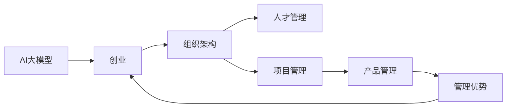

                 

## 1. 背景介绍

随着人工智能（AI）技术的迅速发展，大模型（Large Models）在各个领域的应用如火如荼。从自然语言处理（NLP）到计算机视觉（CV），再到医疗、金融等垂直领域，大模型正在深刻改变各行各业的业务模式和竞争格局。然而，尽管技术层面的突破不断涌现，但如何将这些技术优势转化为商业价值，实现有效的创业和运营，成为众多AI企业面临的一大挑战。

本文将深入探讨如何利用管理优势，推动AI大模型的创业成功。通过系统梳理管理的关键要素，结合实践案例，将提供一系列策略和建议，帮助创业者在激烈的市场竞争中脱颖而出。

## 2. 核心概念与联系

### 2.1 核心概念概述

- **AI大模型**：基于深度学习，如Transformer、BERT等架构，使用大规模训练数据训练得到的模型，具有强大的数据处理和知识提取能力。
- **创业**：通过识别市场机会，开发AI技术产品，并成功推向市场的过程。
- **管理优势**：利用有效的管理手段和策略，提高企业的运营效率、降低成本、增强市场竞争力，实现长期可持续发展的优势。

- **组织架构**：企业内部的组织形式和结构，包括但不限于职能部门、团队设置、层级关系等。
- **人才管理**：通过人力资源管理，确保企业拥有高素质、高能力的员工队伍。
- **项目管理**：包括项目规划、进度控制、资源调配等，确保项目按时、按质、按预算完成。
- **产品管理**：围绕产品生命周期，从市场调研、需求分析、产品开发到市场推广的整个流程的管理。

这些核心概念之间存在紧密的联系。有效的组织架构和人才管理是项目管理和产品管理的基础，而高质量的项目和产品管理则能带来持续的市场竞争力，驱动企业不断创新，实现长期发展。

### 2.2 核心概念原理和架构的 Mermaid 流程图



这个流程图展示了AI大模型的创业流程中，各个核心概念之间的联系。通过合理的组织架构和人才管理，企业能够高效执行项目管理，产出优质的产品，进而形成管理优势，推动企业发展。

## 3. 核心算法原理 & 具体操作步骤

### 3.1 算法原理概述

AI大模型的创业和管理，需要综合考虑技术、业务、市场、资源等多个方面的因素。通过合理设计和管理流程，能够最大化利用技术优势，实现商业价值。

### 3.2 算法步骤详解

**Step 1: 确定业务方向**

- **市场需求调研**：深入分析目标市场的痛点和需求，明确AI大模型的应用场景。
- **竞争分析**：评估现有竞争者的优势和劣势，找到市场缺口和机会。

**Step 2: 构建组织架构**

- **团队组建**：根据业务需求，组建跨职能的团队，确保技术、产品、市场、运营等各个环节都能高效协作。
- **层级设计**：设定合理的层级关系，明确各部门的职责和权限，提高决策效率。

**Step 3: 制定项目管理流程**

- **项目规划**：明确项目目标、时间表、资源需求等，确保项目在预期内完成。
- **进度监控**：定期检查项目进展，及时调整计划，确保项目顺利进行。
- **风险管理**：识别潜在风险，制定应急预案，减少项目失败的可能性。

**Step 4: 实施人才管理策略**

- **招聘与培养**：通过科学招聘和内部培训，提升团队的技术能力和综合素质。
- **激励与考核**：设定合理的激励和考核机制，激发团队成员的积极性和创造力。
- **团队建设**：加强团队凝聚力和协作能力，提升整体战斗力。

**Step 5: 推进产品管理**

- **需求收集**：持续收集用户反馈，优化产品功能，确保产品满足市场需求。
- **迭代开发**：采用敏捷开发模式，快速响应市场变化，持续迭代优化产品。
- **市场推广**：结合市场策略，高效推广产品，提升品牌影响力和用户转化率。

### 3.3 算法优缺点

**优点**：

- **技术优势显著**：AI大模型的技术先进性可以为企业带来显著的市场竞争力。
- **快速响应市场**：灵活的管理流程和高效的团队协作，可以快速迭代产品，适应市场需求变化。
- **品牌效应**：高质量的AI产品可以树立企业品牌，吸引更多客户和投资者。

**缺点**：

- **成本高**：AI大模型的研发和运营成本较高，需要大量资金支持。
- **风险高**：市场和技术的快速变化，增加了企业的运营风险。
- **依赖性强**：对技术团队和管理团队的依赖性较高，需要保持高水平的人才储备和能力提升。

### 3.4 算法应用领域

AI大模型在多个领域有广泛的应用，包括但不限于：

- **自然语言处理（NLP）**：如智能客服、机器翻译、语音识别等。
- **计算机视觉（CV）**：如人脸识别、图像识别、视频分析等。
- **医疗健康**：如影像诊断、基因组学分析、个性化医疗等。
- **金融服务**：如风险评估、欺诈检测、客户服务自动化等。
- **智能制造**：如质量检测、流程优化、智能维护等。

以上应用领域展示了AI大模型强大的跨行业适应性，但每领域的具体管理策略和方法仍需结合实际情况进行调整。

## 4. 数学模型和公式 & 详细讲解 & 举例说明

### 4.1 数学模型构建

在AI大模型的创业和管理中，通常会构建以下数学模型：

- **技术评估模型**：用于评估技术方案的可行性和优势，包括性能指标、技术复杂度、开发成本等。
- **市场预测模型**：基于历史数据和趋势分析，预测市场需求和产品前景。
- **财务模型**：用于评估企业的财务状况和未来收益，包括收入预测、成本控制、投资回报率等。

### 4.2 公式推导过程

以技术评估模型为例，假设某AI大模型在某个应用场景中的准确率为P，计算复杂度为C，开发成本为D，则其技术优势可以表示为：

$$
Advantage = P \times \frac{1}{C} \times \frac{1}{D}
$$

其中，准确率P表示模型的性能，计算复杂度C表示技术实现的难度，开发成本D表示投入的资金和时间。

### 4.3 案例分析与讲解

**案例：某AI大模型在金融领域的应用**

- **技术评估**：基于金融领域的需求，某AI大模型实现了精准的风险评估和欺诈检测，准确率达98%，计算复杂度较低，开发成本在300万人民币左右。
- **市场预测**：根据历史数据和市场趋势，预测未来三年该模型的市场需求在1000万人民币以上。
- **财务模型**：估计模型商业化后，每年可带来800万人民币的收入，成本控制有效，预计净收益在500万人民币以上。

通过上述分析，可以清晰看出该AI大模型在金融领域的高技术优势和经济效益。

## 5. 项目实践：代码实例和详细解释说明

### 5.1 开发环境搭建

- **Python环境**：确保Python 3.8及以上版本，安装必要的库如TensorFlow、PyTorch、Numpy等。
- **Docker环境**：使用Docker容器化部署模型，确保环境一致性和可移植性。
- **云计算平台**：如AWS、Google Cloud、阿里云等，提供弹性的计算和存储资源，支持模型训练和部署。

### 5.2 源代码详细实现

以NLP模型为例，代码实现步骤如下：

1. **数据预处理**：
```python
from sklearn.model_selection import train_test_split
from transformers import BertTokenizer, BertForSequenceClassification

# 加载数据集
data = load_data('nlp_dataset')
train_data, test_data = train_test_split(data, test_size=0.2)

# 分词和编码
tokenizer = BertTokenizer.from_pretrained('bert-base-cased')
train_encodings = tokenizer(train_data['text'], truncation=True, padding=True)
test_encodings = tokenizer(test_data['text'], truncation=True, padding=True)
```

2. **模型训练**：
```python
from transformers import Trainer, TrainingArguments

# 定义训练参数
training_args = TrainingArguments(output_dir='./results', evaluation_strategy='epoch')
trainer = Trainer(
    model=model,
    args=training_args,
    train_dataset=train_dataset,
    eval_dataset=test_dataset,
)

# 开始训练
trainer.train()
```

3. **模型部署**：
```python
from transformers import AutoTokenizer, AutoModelForSequenceClassification

# 加载部署模型
model = AutoModelForSequenceClassification.from_pretrained('model_path')
tokenizer = AutoTokenizer.from_pretrained('model_path')

# 预测新数据
inputs = tokenizer.encode('新数据')
labels = model.predict(inputs)
```

### 5.3 代码解读与分析

上述代码展示了使用Hugging Face的Transformers库进行NLP模型训练、测试和部署的流程。通过代码实现，可以清楚地看到模型的训练过程，并理解如何通过预测功能来部署模型。

## 6. 实际应用场景

### 6.1 智能客服系统

某公司利用AI大模型开发了智能客服系统，通过微调和优化，实现了自动回答客户咨询的功能。该系统基于自然语言处理技术，能够理解客户问题并提供解决方案。通过数据分析，优化模型参数，提升准确率和响应速度。

### 6.2 金融风控平台

某银行利用AI大模型构建了智能风控平台，通过分析客户历史数据和行为模式，预测其信用风险。模型采用监督学习微调，结合对抗训练和参数高效微调技术，提升了模型的鲁棒性和泛化能力。

### 6.3 智能推荐系统

某电商公司利用AI大模型开发了智能推荐系统，通过分析用户行为数据，推荐个性化商品。模型通过少样本学习和零样本学习技术，提升了推荐效果，显著提高了用户转化率和满意度。

### 6.4 未来应用展望

未来，AI大模型的应用将更加广泛，管理优势将进一步凸显。通过合理的组织架构和人才管理，结合高效的项目管理和产品管理，企业可以更好地利用AI技术，实现持续创新和市场竞争力的提升。

## 7. 工具和资源推荐

### 7.1 学习资源推荐

- **在线课程**：如Coursera上的"Machine Learning"和"Deep Learning Specialization"，涵盖AI大模型的理论基础和实践技巧。
- **书籍**：《深度学习》（Ian Goodfellow等）、《Python深度学习》（Francois Chollet），深入讲解AI大模型的原理和应用。
- **博客和社区**：如Medium上的"Deep Learning AI"，提供丰富的AI大模型应用案例和技术分享。

### 7.2 开发工具推荐

- **代码库**：如GitHub，提供大量的开源项目和代码库，方便学习和实践。
- **云平台**：如AWS、Google Cloud、阿里云，提供弹性的计算和存储资源，支持模型训练和部署。
- **项目管理工具**：如Jira、Trello，用于规划和管理项目，确保高效协作和进度控制。

### 7.3 相关论文推荐

- **技术评估**："Performance and Efficiency Analysis of Deep Learning Models in AI Development"（深度学习模型在AI开发中的性能和效率分析）
- **市场预测**："Predictive Modeling and Market Analysis in AI Startups"（AI创业中的预测建模和市场分析）
- **财务模型**："Financial Modeling and AI Investments"（AI投资中的财务建模）

这些资源和学习工具将帮助创业者全面掌握AI大模型的创业和管理策略，实现企业的可持续发展。

## 8. 总结：未来发展趋势与挑战

### 8.1 研究成果总结

AI大模型的创业和管理，需要在技术、业务、市场、管理等多个方面进行综合考虑。通过合理的组织架构和人才管理，高效的项目管理和产品管理，可以最大化利用AI技术优势，实现商业价值。

### 8.2 未来发展趋势

- **技术进步**：未来AI大模型的技术将不断进步，性能和应用场景将更加广泛。
- **跨行业融合**：AI大模型将更多地应用于跨行业融合，推动各行业的数字化转型。
- **人性化设计**：未来的AI大模型将更注重人性化设计，提升用户体验。

### 8.3 面临的挑战

- **技术复杂性**：AI大模型的技术复杂性高，需要持续投入研发和优化。
- **市场竞争激烈**：AI大模型市场竞争激烈，需要不断创新和改进。
- **数据隐私和安全**：AI大模型的数据隐私和安全问题需要高度重视，确保合规性和安全性。

### 8.4 研究展望

未来，AI大模型的创业和管理将面临更多的挑战和机遇。通过技术创新、业务优化、市场扩展，AI大模型将进一步推动各行各业的智能化发展。

## 9. 附录：常见问题与解答

**Q1: AI大模型的管理难点是什么？**

A: AI大模型的管理难点主要在于技术复杂度高、数据量大、人员要求高。需要综合考虑技术、业务、市场等多个方面，合理设计和管理流程。

**Q2: 如何提升AI大模型的管理效率？**

A: 通过科学的项目管理和人才管理，优化组织架构，提高团队协作效率。引入先进的项目管理工具和技术，确保项目按时、按质完成。

**Q3: AI大模型在创业中的关键成功因素是什么？**

A: AI大模型在创业中的关键成功因素包括技术优势显著、市场预测准确、财务模型合理、高效的项目管理和人才管理。

**Q4: 如何应对AI大模型的风险？**

A: 通过风险管理和应急预案，识别潜在风险并制定应对措施，确保项目和企业的持续稳定发展。

**Q5: 如何评估AI大模型的商业价值？**

A: 通过技术评估模型、市场预测模型和财务模型，全面评估AI大模型的性能、市场需求和财务状况，确保商业价值的最大化。

作者：禅与计算机程序设计艺术 / Zen and the Art of Computer Programming

