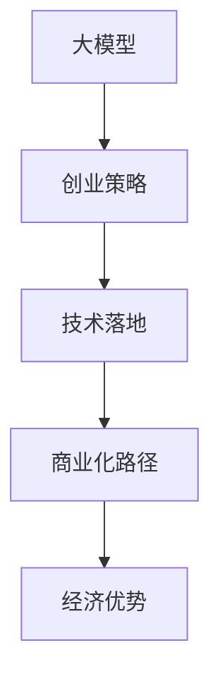

                 

# AI 大模型创业：如何利用经济优势？

> 关键词：
- AI 大模型
- 创业策略
- 经济优势
- 技术落地
- 商业化路径

## 1. 背景介绍

在人工智能(AI)技术的快速发展的背景下，大模型已经成为众多创业公司青睐的关键资产。大模型的普遍应用和集成，不仅在学术界引起了广泛关注，也引发了工业界对未来技术和商业模式的深刻思考。在这篇文章中，我们将探讨如何利用AI大模型在创业中的经济优势，分析其在技术落地和商业化过程中面临的挑战，并提出一些可行的策略。

### 1.1 问题由来

随着深度学习技术的迅速发展，大模型在自然语言处理(NLP)、计算机视觉(CV)、语音识别(SR)等诸多领域中取得了卓越的成果。这些大模型不仅在学术竞赛中屡屡刷新记录，也吸引了大量创业公司的关注。然而，尽管大模型在技术上具有显著优势，但将其商业化仍面临诸多挑战。例如，模型训练成本高昂，硬件资源需求大，模型的应用场景多样性等。本文旨在通过系统的分析和研究，为AI大模型的创业公司提供实用的指导和建议。

### 1.2 问题核心关键点

在AI大模型创业中，如何充分利用其经济优势，是企业持续发展的关键。经济优势主要体现在以下几个方面：

1. **数据价值**：利用大模型对海量数据进行有效处理和分析，提取有价值的信息，从而在数据密集型的行业获得竞争优势。
2. **技术壁垒**：构建起难以复制的技术壁垒，形成独特商业模式，吸引投资者和用户。
3. **应用场景广度**：大模型在多样化的应用场景中表现出高灵活性，可快速适配不同的行业和领域。
4. **资源整合**：通过整合各种资源，如数据、算法、硬件等，实现更高效的资源利用。
5. **市场扩展**：凭借大模型的广泛应用，快速扩展市场份额，提升品牌影响力。

本文将重点分析这些经济优势，并探讨如何在实际应用中最大化利用这些优势。

## 2. 核心概念与联系

### 2.1 核心概念概述

为更好地理解AI大模型在创业中的经济优势，本节将介绍几个关键概念：

- **大模型**：以Transformer模型为代表，通过海量数据预训练得到的强大模型。具有高精度、泛化能力强等特性。
- **创业策略**：指初创企业根据自身情况和市场需求，制定的发展方向和实施计划。
- **技术落地**：将前沿技术应用到具体业务场景中的过程，通常涉及模型适配、算法优化等环节。
- **商业化路径**：指将技术产品推向市场的过程，包括产品设计、市场推广、客户服务等多个环节。
- **经济优势**：指企业通过应用大模型在技术、市场、资源整合等方面获得的竞争优势。

这些概念之间的联系紧密，共同构成了AI大模型在创业中的核心框架。通过理解这些概念，可以更清晰地把握大模型创业的优势和挑战。

### 2.2 核心概念原理和架构的 Mermaid 流程图



这个流程图展示了AI大模型在创业中的关键环节和核心概念之间的关系：

1. 大模型作为技术基础，为创业公司提供核心竞争力。
2. 创业策略制定方向和计划，指导技术落地的实施。
3. 技术落地将前沿技术应用到实际业务中，实现商业价值。
4. 商业化路径将产品推向市场，实现盈利和扩展。
5. 经济优势是大模型创业带来的直接结果，是创业公司持续发展的动力。

## 3. 核心算法原理 & 具体操作步骤

### 3.1 算法原理概述

AI大模型在创业中的经济优势，主要体现在以下几个方面：

1. **数据价值最大化**：大模型能够高效处理和分析大量数据，提取有用的信息，辅助决策。
2. **技术壁垒构建**：大模型的训练和优化涉及复杂算法，难以简单复制，构建技术壁垒。
3. **广泛应用场景**：大模型在多个领域中表现出优秀的性能，可快速适应不同行业需求。
4. **资源整合优化**：大模型需要高性能硬件，利用这一特性，可整合优化资源，提升效率。
5. **市场扩展能力**：大模型的广泛应用为公司带来良好品牌声誉，有助于快速扩展市场份额。

### 3.2 算法步骤详解

AI大模型在创业中的应用涉及多个步骤，下面详细介绍：

1. **数据准备**：收集和清洗数据，构建数据集，为模型的训练和应用提供数据支撑。
2. **模型训练**：利用大模型进行训练，优化模型参数，使其在特定任务上表现优异。
3. **算法适配**：根据具体应用场景，设计适应性算法，优化模型输出。
4. **技术落地**：将模型集成到具体业务系统中，实现业务流程自动化。
5. **商业化推广**：通过市场营销和客户服务，推广产品，获取客户反馈，持续优化产品。
6. **持续优化**：利用大数据和用户反馈，持续优化模型和业务流程，保持竞争优势。

### 3.3 算法优缺点

利用AI大模型创业的优点主要在于：

- **高精度**：大模型在特定任务上表现出色，准确度高，有助于提升业务质量。
- **泛化能力强**：大模型具备良好泛化能力，能够处理多种复杂场景。
- **资源整合能力**：利用高性能硬件，整合计算资源，提升效率。
- **市场扩展速度快**：大模型品牌效果好，有助于快速拓展市场。

缺点主要在于：

- **高成本**：模型训练和硬件设备成本高，初创企业难以承担。
- **复杂度**：模型复杂度高，实施和优化难度大。
- **可解释性不足**：大模型黑盒特性，难以解释其内部工作机制。
- **依赖性强**：对数据和硬件的依赖性大，风险较高。

### 3.4 算法应用领域

AI大模型在多个领域中具有广泛的应用前景，包括：

- **金融科技**：利用大模型进行风险评估、客户分类等。
- **医疗健康**：通过大模型进行疾病诊断、病历分析等。
- **智能制造**：利用大模型进行质量检测、设备维护等。
- **智能客服**：通过大模型实现自然语言交互、情感分析等。
- **自动驾驶**：利用大模型进行图像识别、路径规划等。

## 4. 数学模型和公式 & 详细讲解 & 举例说明

### 4.1 数学模型构建

本节将通过数学语言对AI大模型在创业中的经济优势进行更加严谨的描述。

设AI大模型为 $M(x)$，其中 $x$ 为输入数据，$M(x)$ 为模型输出。创业公司利用大模型处理数据，构建数据集 $D = \{(x_i, y_i)\}_{i=1}^N$，其中 $x_i$ 为输入数据，$y_i$ 为对应的标签。模型的优化目标为最小化损失函数 $L$：

$$
L = \frac{1}{N} \sum_{i=1}^N \ell(M(x_i), y_i)
$$

其中 $\ell$ 为损失函数，$\ell(M(x_i), y_i)$ 表示模型在输入 $x_i$ 上的输出 $M(x_i)$ 与标签 $y_i$ 之间的差异。

### 4.2 公式推导过程

以金融科技中的信用评分为例，公式推导如下：

设模型 $M(x)$ 输入为客户的财务数据，输出为信用评分 $y$。假设模型的损失函数为均方误差：

$$
\ell(M(x_i), y_i) = (M(x_i) - y_i)^2
$$

则总损失函数为：

$$
L = \frac{1}{N} \sum_{i=1}^N (M(x_i) - y_i)^2
$$

对模型参数 $\theta$ 进行梯度下降优化：

$$
\theta \leftarrow \theta - \eta \nabla_{\theta}L(\theta)
$$

其中 $\eta$ 为学习率，$\nabla_{\theta}L(\theta)$ 为损失函数对模型参数的梯度。

### 4.3 案例分析与讲解

以智能客服系统为例，展示AI大模型在创业中的应用：

1. **数据准备**：收集历史客服对话数据，构建数据集。
2. **模型训练**：利用大模型进行训练，优化模型参数。
3. **算法适配**：设计自然语言处理算法，优化模型输出。
4. **技术落地**：将模型集成到客服系统中，实现自动化对话。
5. **商业化推广**：通过市场营销推广产品，获取用户反馈。
6. **持续优化**：利用用户反馈，持续优化模型和系统。

## 5. 项目实践：代码实例和详细解释说明

### 5.1 开发环境搭建

为了实现AI大模型在创业中的应用，需要搭建相应的开发环境。以下是一个基于Python和PyTorch的开发环境搭建示例：

1. **安装Anaconda**：
   ```bash
   conda install anaconda
   ```

2. **创建虚拟环境**：
   ```bash
   conda create --name myenv python=3.8
   conda activate myenv
   ```

3. **安装PyTorch和相关库**：
   ```bash
   pip install torch torchvision torchaudio
   pip install transformers
   ```

### 5.2 源代码详细实现

以下是一个简单的AI大模型在金融科技中的应用示例，展示如何利用大模型进行信用评分：

```python
import torch
from transformers import BertModel

# 加载模型和预训练权重
model = BertModel.from_pretrained('bert-base-uncased')
model.load_state_dict(torch.load('model.pth'))

# 定义损失函数
def compute_loss(model, inputs, labels):
    logits = model(inputs)
    loss = torch.mean((logits - labels)**2)
    return loss

# 定义训练函数
def train(model, train_dataset, optimizer, epochs):
    for epoch in range(epochs):
        total_loss = 0
        for inputs, labels in train_dataset:
            optimizer.zero_grad()
            loss = compute_loss(model, inputs, labels)
            loss.backward()
            optimizer.step()
            total_loss += loss.item()
        print(f'Epoch {epoch+1}, loss: {total_loss/len(train_dataset)}')

# 训练模型
train(model, train_dataset, optimizer, epochs=10)
```

### 5.3 代码解读与分析

上述代码实现了利用大模型进行信用评分预测的基本流程。具体解读如下：

1. **模型加载**：使用BertModel加载预训练模型和权重。
2. **损失函数**：定义均方误差损失函数，用于衡量模型输出与标签的差异。
3. **训练函数**：对模型进行梯度下降优化，最小化损失函数。
4. **数据准备**：加载训练集数据，进行模型训练。

### 5.4 运行结果展示

训练结束后，可以对测试集进行预测，并计算模型性能指标：

```python
from sklearn.metrics import mean_squared_error

# 加载测试集数据
test_dataset = ...

# 进行模型预测
predictions = []
for inputs, _ in test_dataset:
    logits = model(inputs)
    predictions.append(logits.mean())

# 计算模型性能
mse = mean_squared_error(test_labels, predictions)
print(f'Test MSE: {mse}')
```

## 6. 实际应用场景

### 6.1 金融科技

在金融科技领域，AI大模型可以应用于信用评分、风险评估、客户分类等任务。通过分析客户的财务数据、行为数据，利用大模型提取特征，并进行分类预测，提升决策的准确性和效率。

### 6.2 医疗健康

在医疗健康领域，AI大模型可以用于疾病诊断、病历分析、患者分类等任务。利用大模型分析医学影像、电子病历等数据，提取关键信息，辅助医生进行诊断和治疗决策。

### 6.3 智能制造

在智能制造领域，AI大模型可以用于质量检测、设备维护、生产调度等任务。通过分析生产过程中的数据，利用大模型进行异常检测和故障预测，优化生产流程，提高生产效率。

### 6.4 智能客服

在智能客服领域，AI大模型可以用于自然语言处理、情感分析、意图识别等任务。通过分析用户对话数据，利用大模型进行语义理解，提供个性化服务，提升客户满意度。

### 6.5 自动驾驶

在自动驾驶领域，AI大模型可以用于图像识别、路径规划、行为预测等任务。通过分析车辆传感器数据，利用大模型进行环境感知和行为决策，提升驾驶安全性。

## 7. 工具和资源推荐

### 7.1 学习资源推荐

为了更好地掌握AI大模型的应用，推荐以下学习资源：

1. **《深度学习》课程**：斯坦福大学李飞飞教授主讲的深度学习课程，详细讲解了深度学习基础和前沿技术。
2. **《TensorFlow实战》书籍**：TensorFlow官方文档和实战书籍，介绍了TensorFlow的使用和优化技巧。
3. **《PyTorch深度学习》书籍**：PyTorch官方文档和实战书籍，介绍了PyTorch的使用和优化技巧。
4. **《Transformer》论文**：Transformer模型的原始论文，详细介绍了Transformer模型的原理和应用。
5. **《自然语言处理入门》书籍**：自然语言处理领域的经典入门书籍，详细介绍了NLP基础和前沿技术。

### 7.2 开发工具推荐

以下是一些常用的AI大模型开发工具：

1. **PyTorch**：深度学习框架，支持动态计算图，易于开发和调试。
2. **TensorFlow**：深度学习框架，支持静态计算图，生产部署方便。
3. **Transformers**：NLP领域常用模型库，支持多种预训练模型的微调和应用。
4. **TensorBoard**：TensorFlow配套的可视化工具，实时监测模型训练状态。
5. **Weights & Biases**：模型训练的实验跟踪工具，记录和可视化模型训练过程中的各项指标。

### 7.3 相关论文推荐

以下是几篇经典的AI大模型论文，推荐阅读：

1. **Attention is All You Need**：Transformer模型的原始论文，详细介绍了Transformer模型的原理和应用。
2. **BERT: Pre-training of Deep Bidirectional Transformers for Language Understanding**：BERT模型的原始论文，详细介绍了BERT模型的预训练和应用。
3. **GPT-2**：GPT-2模型的原始论文，详细介绍了GPT-2模型的预训练和应用。
4. **T5: Exploring the Limits of Transfer Learning with a Unified Text-to-Text Transformer**：T5模型的原始论文，详细介绍了T5模型的预训练和应用。
5. **Transformer-XL: Attentive Language Models Beyond a Fixed-Length Context**：Transformer-XL模型的原始论文，详细介绍了Transformer-XL模型的原理和应用。

## 8. 总结：未来发展趋势与挑战

### 8.1 研究成果总结

本文系统地介绍了AI大模型在创业中的应用，分析了其在数据价值、技术壁垒、应用场景等方面的经济优势，并通过代码实例展示了其在实际应用中的基本流程。

### 8.2 未来发展趋势

未来，AI大模型在创业中的应用将继续深化，呈现出以下趋势：

1. **数据驱动**：AI大模型将继续依赖海量数据进行训练和优化，提升模型性能。
2. **技术融合**：AI大模型与其他AI技术（如强化学习、自然语言处理）的融合将进一步增强其应用能力。
3. **硬件优化**：针对AI大模型的硬件优化将更加普及，提升训练和推理效率。
4. **隐私保护**：AI大模型在处理敏感数据时，隐私保护技术将更加成熟。
5. **可解释性**：AI大模型的可解释性将得到进一步提升，增强用户信任。

### 8.3 面临的挑战

尽管AI大模型在创业中具有显著优势，但也面临以下挑战：

1. **数据获取难度**：海量数据获取难度大，成本高。
2. **计算资源需求**：AI大模型需要高性能硬件支持，计算资源需求大。
3. **算法复杂度**：AI大模型训练和优化算法复杂，实施难度大。
4. **伦理和法律问题**：AI大模型在应用过程中可能涉及伦理和法律问题，需加以规范。
5. **市场需求不确定性**：AI大模型应用的市场需求具有不确定性，需灵活应对。

### 8.4 研究展望

未来，AI大模型在创业中的研究将重点关注以下几个方面：

1. **数据治理**：建立数据治理机制，保障数据安全和隐私保护。
2. **技术标准化**：制定AI大模型的技术标准，提升模型应用的一致性和可比性。
3. **算法优化**：优化AI大模型的算法，提升模型的训练和推理效率。
4. **应用场景拓展**：拓展AI大模型的应用场景，提升其通用性。
5. **伦理法律规范**：制定AI大模型的伦理法律规范，确保其应用符合社会价值观。

## 9. 附录：常见问题与解答

**Q1：AI大模型在创业中需要考虑哪些因素？**

A: 在AI大模型创业中，需要考虑以下因素：

1. **数据获取**：获取大量高质量数据，构建数据集。
2. **模型训练**：利用大模型进行训练，优化模型参数。
3. **算法适配**：根据具体应用场景，设计适应性算法，优化模型输出。
4. **技术落地**：将模型集成到具体业务系统中，实现业务流程自动化。
5. **商业化推广**：通过市场营销推广产品，获取用户反馈。
6. **持续优化**：利用用户反馈，持续优化模型和系统。

**Q2：AI大模型在创业中如何构建技术壁垒？**

A: 利用AI大模型在技术落地和商业化过程中，构建技术壁垒主要通过以下几个方面：

1. **模型优化**：针对特定任务进行模型优化，提升模型性能。
2. **算法创新**：在算法设计和应用上进行创新，形成独特的技术方案。
3. **知识整合**：将多种知识与AI大模型结合，形成独特的知识体系。
4. **硬件资源**：利用高性能硬件，构建资源密集型技术壁垒。
5. **专利申请**：申请专利，保护技术创新成果。

**Q3：AI大模型在创业中如何优化资源利用？**

A: 在AI大模型创业中，优化资源利用主要通过以下几个方面：

1. **数据预处理**：对数据进行预处理和清洗，提升数据质量。
2. **模型并行**：采用模型并行技术，提升训练效率。
3. **硬件优化**：利用GPU/TPU等高性能硬件，优化计算资源利用。
4. **分布式训练**：采用分布式训练技术，提升训练效率。
5. **模型压缩**：采用模型压缩技术，减小模型尺寸，提升推理效率。

**Q4：AI大模型在创业中如何处理数据隐私问题？**

A: 在AI大模型创业中，处理数据隐私问题主要通过以下几个方面：

1. **数据匿名化**：对敏感数据进行匿名化处理，保护用户隐私。
2. **差分隐私**：采用差分隐私技术，保护数据隐私。
3. **数据加密**：对数据进行加密处理，保护数据安全。
4. **访问控制**：对数据访问进行控制，限制数据使用权限。
5. **合规审核**：遵守相关法律法规，确保数据使用合规。

**Q5：AI大模型在创业中如何提高模型可解释性？**

A: 在AI大模型创业中，提高模型可解释性主要通过以下几个方面：

1. **模型简化**：对模型进行简化，提高模型可解释性。
2. **特征解释**：利用特征重要性解释模型决策过程。
3. **可视化技术**：采用可视化技术，展示模型内部工作机制。
4. **知识图谱**：构建知识图谱，解释模型决策路径。
5. **用户反馈**：收集用户反馈，优化模型解释方式。

---

作者：禅与计算机程序设计艺术 / Zen and the Art of Computer Programming

