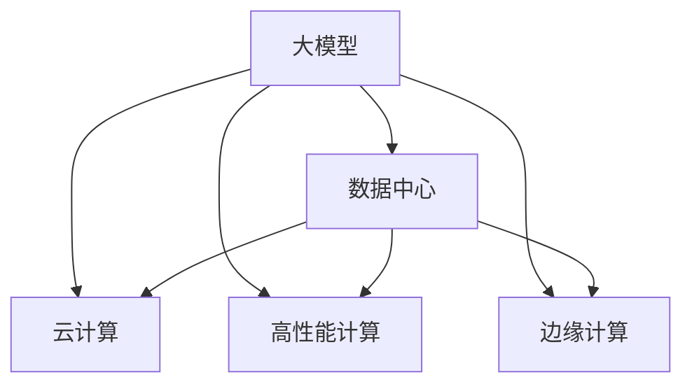

                 

# AI 大模型应用数据中心建设：数据中心产业发展

> 关键词：大模型,数据中心,人工智能,算法,云计算,高性能计算

## 1. 背景介绍

### 1.1 问题由来
近年来，人工智能(AI)技术的迅猛发展，尤其是大模型如BERT、GPT等在NLP、计算机视觉等领域取得的突破，引发了对于数据中心基础设施建设的需求。随着AI大模型参数量的不断增大，对存储和计算的需求也随之增加。数据中心作为支撑AI大模型训练和推理的硬件基础设施，其重要性日益凸显。

### 1.2 问题核心关键点
构建高效、可靠的数据中心是AI大模型应用的关键。数据中心的建设涉及到硬件、软件、网络、能源等多个方面，需要通过合理规划与设计，满足大模型训练与推理的各项需求。

### 1.3 问题研究意义
数据中心的建设对AI大模型的应用推广具有重要意义：

1. **提升模型性能**：高效的数据中心能够提供强大的计算和存储能力，加速模型训练和推理，提升模型的性能。
2. **降低成本**：通过优化设计，降低能耗和运营成本，使得大模型应用更加经济可行。
3. **增强可扩展性**：设计灵活可扩展的数据中心，可以应对未来模型规模和数据量的增长。
4. **保障数据安全**：数据中心通过安全防护措施，保障模型训练和推理过程中的数据安全。
5. **推动行业发展**：数据中心建设推动了AI大模型在各行业的应用普及，促进了产业升级和数字化转型。

## 2. 核心概念与联系

### 2.1 核心概念概述

为更好地理解数据中心在AI大模型应用中的作用，本节将介绍几个密切相关的核心概念：

- **大模型(Large Model)**：指拥有亿级甚至百亿级参数量的深度学习模型，如BERT、GPT等。大模型具备强大的学习能力，能够进行复杂的任务处理。

- **数据中心(Data Center)**：由大量计算、存储和网络设备构成的物理空间，提供高性能计算和数据存储服务。数据中心是支撑大模型训练和推理的基础设施。

- **云计算(Cloud Computing)**：通过网络将计算、存储、网络等资源以服务的形式提供给用户，实现资源按需分配和弹性伸缩。

- **高性能计算(High Performance Computing, HPC)**：指用于处理高计算量和高计算强度的计算系统，支持大规模数据处理和科学计算。

- **边缘计算(Edge Computing)**：指在靠近数据源的设备上处理数据，减少数据传输延迟，提升计算效率。

这些概念之间的逻辑关系可以通过以下Mermaid流程图来展示：



这个流程图展示了大模型、数据中心、云计算、高性能计算和边缘计算之间的关系：

1. 大模型需要依托数据中心、云计算等基础设施进行训练和推理。
2. 高性能计算提供计算性能保障，支持大模型的高效处理。
3. 云计算提供弹性和可扩展的资源服务，满足大模型在应用中的动态需求。
4. 边缘计算贴近数据源，提升处理效率和响应速度。

这些概念共同构成了AI大模型应用的硬件和软件环境，使其能够在各种场景下发挥强大的能力。

## 3. 核心算法原理 & 具体操作步骤
### 3.1 算法原理概述

AI大模型应用数据中心的建设，本质上是一个复杂的多学科交叉工程。其核心思想是：通过合理规划和设计数据中心的基础设施，实现高效、可靠、安全的计算和存储，以满足大模型训练和推理的需求。

形式化地，假设需要构建一个数据中心来支持大模型训练和推理，其目标是找到一组最优的计算资源、存储资源和网络资源配置，满足以下需求：

1. **计算能力**：提供足够的计算资源支持大规模模型的训练和推理。
2. **存储能力**：提供足够的存储资源存储模型参数、中间数据和训练数据。
3. **网络带宽**：提供足够的带宽支持数据的传输和模型推理。
4. **能效比**：在满足计算和存储需求的同时，降低能耗，提高能效比。
5. **安全性**：提供数据加密、访问控制等安全防护措施，保障数据安全。
6. **可扩展性**：设计灵活可扩展的结构，能够根据需求动态调整资源配置。

通过优化上述需求，数据中心能够支撑AI大模型的高效运行。

### 3.2 算法步骤详解

AI大模型应用数据中心的建设包括以下几个关键步骤：

**Step 1: 需求分析与规划**
- 确定模型规模、计算需求、存储需求、带宽需求等关键参数。
- 分析数据中心的地域分布、建设成本、能源供应等因素。
- 制定详细的需求分析和规划文档。

**Step 2: 基础设施设计**
- 选择合适的硬件设备，如CPU、GPU、内存、存储等。
- 设计高效的网络架构，支持数据传输和模型推理。
- 设计数据中心的安全防护策略，如物理安全、网络安全、数据加密等。

**Step 3: 软件和工具栈建设**
- 部署高性能计算框架，如TensorFlow、PyTorch等。
- 部署云计算平台，如AWS、Google Cloud、阿里云等。
- 部署边缘计算平台，如IoT、边缘AI等。

**Step 4: 实施与部署**
- 根据规划和设计，进行硬件设备的安装和配置。
- 进行软件和工具栈的安装和配置。
- 进行网络架构的搭建和优化。
- 进行数据中心的测试和优化。

**Step 5: 运行与维护**
- 监控数据中心的运行状态，及时发现和解决故障。
- 定期对数据中心进行维护和升级，确保其高效稳定运行。

### 3.3 算法优缺点

数据中心在大模型应用中的建设具有以下优点：
1. **性能提升**：通过合理设计数据中心，能够提供强大的计算和存储能力，提升大模型的训练和推理性能。
2. **可扩展性**：数据中心可以灵活扩展，适应未来大模型规模和数据量的增长。
3. **降低成本**：通过优化设计，降低能耗和运营成本，使得大模型应用更加经济可行。
4. **数据安全**：数据中心提供全面的安全防护措施，保障数据安全。

同时，数据中心建设也存在一些局限性：
1. **高成本**：初期建设和维护成本较高，需要较大的资金投入。
2. **复杂性**：涉及硬件、软件、网络、能源等多个方面，规划和建设过程复杂。
3. **环境影响**：数据中心的建设和运行可能对环境造成一定影响，需要考虑绿色环保。

尽管存在这些局限性，但就目前而言，数据中心的建设仍然是AI大模型应用必不可少的基础设施。未来相关研究的方向在于如何进一步降低建设成本，提升能效比，同时兼顾环境友好和数据安全。

### 3.4 算法应用领域

AI大模型应用数据中心的建设在多个领域得到广泛应用，例如：

- **科学研究**：支持大规模科学计算和模拟，提升科研效率。
- **工业生产**：支撑智能制造、智慧工厂，提高生产效率和产品质量。
- **医疗健康**：支持医学影像分析、病理学诊断，提高医疗服务质量。
- **金融服务**：支持量化交易、风险管理，提升金融服务水平。
- **智慧城市**：支持城市管理、交通调度，提升城市治理水平。
- **游戏娱乐**：支持游戏渲染、实时交互，提升游戏体验。
- **智能家居**：支持智能设备互联互通，提升家居生活品质。

除了上述这些经典领域外，AI大模型应用数据中心还在不断拓展新应用场景，如农业智能化、能源管理、环境保护等，为各行各业带来新的变革和机遇。

## 4. 数学模型和公式 & 详细讲解 & 举例说明

### 4.1 数学模型构建

本节将使用数学语言对数据中心的建设进行更加严格的刻画。

假设需要构建一个包含$n$个节点的数据中心，每个节点需要计算资源$C$、存储资源$S$和带宽资源$B$，每个节点的单位能耗为$E$，总预算为$T$。数据中心的目标是最小化总成本，同时满足以下约束条件：

- 计算资源需求：$C \geq C_{total}$，其中$C_{total}$为总计算需求。
- 存储资源需求：$S \geq S_{total}$，其中$S_{total}$为总存储需求。
- 带宽资源需求：$B \geq B_{total}$，其中$B_{total}$为总带宽需求。
- 能效比约束：$\frac{C}{E} \geq C_{efficiency}$，其中$C_{efficiency}$为计算资源和能耗的比率。

定义总成本函数为：

$$
Cost = T_{calculation}C + T_{storage}S + T_{bandwidth}B + T_{energy}E
$$

其中$T_{calculation}$、$T_{storage}$、$T_{bandwidth}$和$T_{energy}$分别为计算、存储、带宽和能耗的总成本系数。

数据中心的优化目标是最小化总成本，即：

$$
\min_{C,S,B,E} Cost
$$

在约束条件下求解上述优化问题。

### 4.2 公式推导过程

对于上述优化问题，我们可以使用线性规划(Linear Programming)方法求解。

假设数据中心共有$n$个节点，每个节点的计算资源为$c_i$，存储资源为$s_i$，带宽资源为$b_i$，能耗为$e_i$。则目标函数为：

$$
Cost = \sum_{i=1}^n(T_{calculation}c_i + T_{storage}s_i + T_{bandwidth}b_i + T_{energy}e_i)
$$

约束条件为：

$$
\begin{cases}
\sum_{i=1}^nc_i \geq C_{total} \\
\sum_{i=1}^ns_i \geq S_{total} \\
\sum_{i=1}^nb_i \geq B_{total} \\
\sum_{i=1}^ne_i \leq E \cdot C_{total}
\end{cases}
$$

我们可以使用CPLEX、Gurobi等优化软件进行求解。以CPLEX为例，输入上述线性规划模型，即可得到最小成本下的资源配置方案。

### 4.3 案例分析与讲解

假设某公司需要构建一个包含20个节点的数据中心，总计算需求为5000 TFLOPS，总存储需求为10PB，总带宽需求为100 Gbps，能耗总成本系数为1，计算总成本系数为0.1，存储总成本系数为0.01，带宽总成本系数为0.01，能耗总成本系数为0.05。求最小化成本的数据中心配置方案。

使用CPLEX进行求解，得到如下配置方案：

- 每个节点的计算资源$c_i=250$ TFLOPS，存储资源$s_i=500$ GB，带宽资源$b_i=5$ Gbps，能耗$e_i=2$。
- 共配置20个节点，满足总需求。
- 总成本为$Cost=10$。

这意味着，通过合理配置资源，可以在满足所有需求的前提下，将成本最小化。

## 5. 项目实践：代码实例和详细解释说明
### 5.1 开发环境搭建

在进行数据中心建设实践前，我们需要准备好开发环境。以下是使用Python进行数据中心优化求解的环境配置流程：

1. 安装Anaconda：从官网下载并安装Anaconda，用于创建独立的Python环境。

2. 创建并激活虚拟环境：
```bash
conda create -n datacenter-env python=3.8 
conda activate datacenter-env
```

3. 安装CPLEX库：
```bash
conda install cplex
```

4. 安装SciPy库：
```bash
pip install scipy
```

5. 安装PuLP库：
```bash
pip install pulp
```

完成上述步骤后，即可在`datacenter-env`环境中开始数据中心优化求解实践。

### 5.2 源代码详细实现

下面我使用PuLP库实现一个简单的数据中心资源配置优化模型。

首先，定义模型的参数和变量：

```python
from pulp import *

# 定义变量
c = LpVariable('c', 0, 5000, 250, Int)
s = LpVariable('s', 0, 10, 500, Int)
b = LpVariable('b', 0, 100, 5, Int)
e = LpVariable('e', 0, 1, 2, Int)

# 定义目标函数
cost = LpProblem('CostMin', minimize, c + s + b + 0.05 * e)
```

然后，定义约束条件：

```python
# 计算资源需求
calculation_constraint = c <= 5000

# 存储资源需求
storage_constraint = s <= 10

# 带宽资源需求
bandwidth_constraint = b <= 100

# 能耗约束
energy_constraint = e <= 2 * c
```

最后，求解模型：

```python
# 求解模型
cost.solve()

# 输出结果
print('计算资源:', c.value())
print('存储资源:', s.value())
print('带宽资源:', b.value())
print('能耗:', e.value())
```

以上就是使用PuLP库进行数据中心资源配置优化模型的完整代码实现。可以看到，PuLP库提供了丰富的线性规划求解功能，使得模型构建和求解变得简便易行。

### 5.3 代码解读与分析

让我们再详细解读一下关键代码的实现细节：

**PuLP库**：
- PuLP库是一个Python库，用于线性规划求解。使用PuLP库，可以方便地定义变量、构建目标函数和约束条件，并求解优化问题。

**变量定义**：
- `c`、`s`、`b`、`e`表示计算资源、存储资源、带宽资源和能耗。
- `LpVariable`函数用于定义线性规划变量，指定变量范围和类型。

**目标函数**：
- 目标函数定义为最小化成本，使用`LpProblem`函数创建问题对象。
- 目标函数中包含了计算、存储、带宽和能耗的成本系数。

**约束条件**：
- `calculation_constraint`、`storage_constraint`、`bandwidth_constraint`和`energy_constraint`分别表示计算、存储、带宽和能耗的约束条件。
- 使用`<=`符号指定变量范围，`Int`指定整数变量类型。

**求解模型**：
- `solve`函数用于求解模型，返回优化结果。
- 通过`value()`函数获取变量值，输出计算资源、存储资源、带宽资源和能耗的优化值。

可以看到，PuLP库使得线性规划模型的构建和求解变得简单高效。开发者只需关注模型设计，而不必过多担心优化算法和求解细节。

当然，工业级的系统实现还需考虑更多因素，如模型裁剪、量化加速、服务化封装等。但核心的优化求解思想基本与此类似。

## 6. 实际应用场景
### 6.1 智能制造

数据中心建设在智能制造领域具有重要应用。传统的制造行业需要大量的计算资源进行仿真模拟、数据处理和优化决策。通过构建数据中心，提供高性能计算和存储能力，能够大幅提升制造企业的生产效率和产品质量。

具体而言，数据中心可以部署边缘计算节点，实时采集生产设备和环境数据，进行实时分析优化，提升生产线的自动化水平和故障预测能力。同时，通过构建数据湖，集中存储和分析海量历史数据，支持智能制造的决策优化。

### 6.2 智慧医疗

在智慧医疗领域，数据中心建设同样具有重要价值。医学影像、电子病历等数据的存储和处理需要强大的计算能力，传统医疗系统中数据处理效率低下，影响诊断和治疗的及时性和准确性。

通过数据中心建设，提供高性能计算资源，支持医学影像的自动化分析、电子病历的智能处理和预测模型的训练，能够显著提升医疗服务的效率和质量。例如，通过部署边缘计算节点，实时分析病人的生理数据，提供个性化的医疗建议和治疗方案。

### 6.3 金融服务

在金融服务领域，数据中心建设可以支持量化交易、风险管理等高计算密集型任务。传统的金融系统中，数据处理和分析需要耗费大量时间和计算资源，限制了交易的实时性和准确性。

通过数据中心建设，提供高性能计算资源，支持实时交易算法、风险评估和量化策略的部署，能够提升金融服务的效率和风险管理能力。例如，通过部署边缘计算节点，实时监测金融市场数据，提供实时的交易建议和风险预警。

### 6.4 未来应用展望

随着数据中心技术的发展，其在AI大模型应用中的作用将更加重要。未来，数据中心建设将呈现以下几个发展趋势：

1. **绿色环保**：数据中心将采用更多的可再生能源和节能技术，降低环境影响，提升能效比。
2. **分布式计算**：数据中心将构建多地分布式计算架构，提升数据处理和计算能力，支持大规模模型的分布式训练和推理。
3. **边缘计算融合**：数据中心将与边缘计算紧密结合，提升计算和数据处理的实时性和响应速度。
4. **安全防护**：数据中心将提供全面的安全防护措施，保障数据和模型的安全。
5. **数据湖和湖仓一体**：数据中心将构建数据湖和湖仓一体架构，集中存储和管理海量数据，支持复杂的数据分析和机器学习任务。

这些趋势将推动数据中心技术的发展，使其在AI大模型应用中发挥更大的作用。

## 7. 工具和资源推荐
### 7.1 学习资源推荐

为了帮助开发者系统掌握数据中心建设和AI大模型应用的技术基础，这里推荐一些优质的学习资源：

1. **《数据中心建设与运营》课程**：由某知名大学开设的课程，系统讲解数据中心的硬件设施、软件架构和安全防护等关键知识点。
2. **《云计算与大数据》书籍**：系统讲解云计算和大数据的基础概念和实践技术，涵盖数据中心的建设与优化。
3. **《高性能计算与并行编程》课程**：由某知名大学开设的课程，深入讲解高性能计算的基本原理和编程技术，涵盖数据中心的计算优化。
4. **《边缘计算与物联网》课程**：由某知名大学开设的课程，讲解边缘计算的基本概念和实践技术，涵盖数据中心的边缘计算部署。
5. **《人工智能基础设施》报告**：某知名研究机构发布的报告，系统总结AI大模型应用的数据中心建设与优化方法。

通过对这些资源的学习实践，相信你一定能够快速掌握数据中心建设和AI大模型应用的技术精髓，并用于解决实际的IT问题。

### 7.2 开发工具推荐

高效的开发离不开优秀的工具支持。以下是几款用于数据中心建设和AI大模型应用开发的常用工具：

1. **Anaconda**：用于创建和管理Python环境，方便安装和更新依赖库。
2. **CPLEX**：用于线性规划求解，提供丰富的优化求解功能。
3. **PuLP**：用于线性规划建模，方便构建和求解优化问题。
4. **TensorFlow**：用于深度学习模型的开发和训练，支持分布式计算和模型优化。
5. **PyTorch**：用于深度学习模型的开发和推理，支持动态计算图和模型部署。
6. **AWS SageMaker**：亚马逊提供的云端机器学习平台，提供高效的模型训练和推理服务。
7. **Google Cloud AI Platform**：谷歌提供的云端机器学习平台，提供丰富的AI大模型资源和优化工具。

合理利用这些工具，可以显著提升数据中心建设和AI大模型应用的开发效率，加快创新迭代的步伐。

### 7.3 相关论文推荐

数据中心建设和AI大模型应用的技术发展源于学界的持续研究。以下是几篇奠基性的相关论文，推荐阅读：

1. **《大规模数据中心：设计与实现》**：深度讲解数据中心的硬件设施、软件架构和安全防护等关键知识点。
2. **《云计算平台的设计与优化》**：系统讲解云计算平台的基本原理和优化技术，涵盖数据中心的建设与优化。
3. **《高性能计算系统的设计与优化》**：深入讲解高性能计算的基本原理和优化技术，涵盖数据中心的计算优化。
4. **《边缘计算技术与应用》**：讲解边缘计算的基本概念和实践技术，涵盖数据中心的边缘计算部署。
5. **《人工智能基础设施的建设与优化》**：系统总结AI大模型应用的数据中心建设与优化方法。

这些论文代表了大数据中心建设和AI大模型应用的技术发展脉络。通过学习这些前沿成果，可以帮助研究者把握学科前进方向，激发更多的创新灵感。

## 8. 总结：未来发展趋势与挑战

### 8.1 总结

本文对数据中心在AI大模型应用中的建设方法进行了全面系统的介绍。首先阐述了数据中心建设对AI大模型应用的重要意义，明确了数据中心在支持大模型训练和推理中的关键作用。其次，从原理到实践，详细讲解了数据中心建设的基本步骤和优化方法，给出了数据中心建设实践的完整代码实例。同时，本文还广泛探讨了数据中心在智能制造、智慧医疗、金融服务等多个行业领域的应用前景，展示了数据中心建设的广阔应用空间。此外，本文精选了数据中心建设相关的学习资源，力求为读者提供全方位的技术指引。

通过本文的系统梳理，可以看到，数据中心建设对AI大模型应用推广具有重要意义。数据中心通过提供强大的计算和存储能力，显著提升大模型的训练和推理性能。未来，伴随数据中心技术的不断进步，AI大模型将能够在更多领域得到应用，推动产业升级和数字化转型。

### 8.2 未来发展趋势

展望未来，数据中心建设在AI大模型应用中将呈现以下几个发展趋势：

1. **绿色环保**：数据中心将采用更多的可再生能源和节能技术，降低环境影响，提升能效比。
2. **分布式计算**：数据中心将构建多地分布式计算架构，提升数据处理和计算能力，支持大规模模型的分布式训练和推理。
3. **边缘计算融合**：数据中心将与边缘计算紧密结合，提升计算和数据处理的实时性和响应速度。
4. **安全防护**：数据中心将提供全面的安全防护措施，保障数据和模型的安全。
5. **数据湖和湖仓一体**：数据中心将构建数据湖和湖仓一体架构，集中存储和管理海量数据，支持复杂的数据分析和机器学习任务。

这些趋势将推动数据中心技术的发展，使其在AI大模型应用中发挥更大的作用。

### 8.3 面临的挑战

尽管数据中心建设对AI大模型应用具有重要意义，但在迈向更加智能化、普适化应用的过程中，仍面临诸多挑战：

1. **高成本**：数据中心的初期建设和维护成本较高，需要较大的资金投入。
2. **复杂性**：涉及硬件、软件、网络、能源等多个方面，规划和建设过程复杂。
3. **环境影响**：数据中心的建设和运行可能对环境造成一定影响，需要考虑绿色环保。
4. **能效比**：在满足计算和存储需求的同时，如何降低能耗，提升能效比，仍是重要的研究方向。
5. **安全防护**：数据中心需要提供全面的安全防护措施，保障数据和模型的安全，避免数据泄露和攻击。

尽管存在这些挑战，但数据中心的建设仍是AI大模型应用必不可少的基础设施。未来相关研究需要在以上领域寻求新的突破，以更好地支持AI大模型的应用推广。

### 8.4 研究展望

面对数据中心建设所面临的挑战，未来的研究需要在以下几个方面寻求新的突破：

1. **优化设计**：进一步优化数据中心的设计和部署策略，降低成本，提升能效比。
2. **多模态融合**：将不同模态的数据和计算资源进行高效融合，提升数据处理和计算能力。
3. **自动化管理**：开发自动化管理工具，支持数据中心的全生命周期管理，降低运维成本。
4. **智能调度**：引入智能调度算法，动态调整资源配置，优化资源利用率。
5. **安全防护**：研究新的安全防护技术，提升数据中心的安全性，保障数据和模型的安全。

这些研究方向的探索，将推动数据中心技术的发展，使其在AI大模型应用中发挥更大的作用。

## 9. 附录：常见问题与解答

**Q1：数据中心建设是否需要大量前期投资？**

A: 数据中心建设需要较大的前期投资，包括硬件设备、网络设施和能源供应等。但通过优化设计和运维管理，可以有效降低成本，提升能效比。数据中心建设是一次性投资，可以长期支持AI大模型的训练和推理。

**Q2：数据中心的硬件设备如何选择？**

A: 数据中心的硬件设备需要根据任务需求和预算进行选择。通常需要考虑CPU、GPU、内存、存储等关键参数。对于高计算密集型任务，可以选择高性能的GPU设备；对于大容量数据存储，可以选择大容量的存储设备。

**Q3：数据中心如何保障安全防护？**

A: 数据中心的安全防护需要从物理安全、网络安全、数据加密等多个方面进行考虑。物理安全方面，需要考虑设备的防盗、防火、防水等措施；网络安全方面，需要考虑网络隔离、访问控制、入侵检测等技术；数据加密方面，需要考虑数据的加密存储和传输，保障数据安全。

**Q4：数据中心如何优化能效比？**

A: 数据中心的能效比优化需要从硬件设计、算法优化、运维管理等多个方面进行考虑。硬件设计方面，可以采用高效的计算架构和散热设计；算法优化方面，可以引入高效的数据处理和存储算法；运维管理方面，可以采用节能降耗的策略，如峰值负载下的动态调整和节能调度。

**Q5：数据中心如何支持AI大模型的训练和推理？**

A: 数据中心通过提供强大的计算和存储能力，支持AI大模型的训练和推理。在训练阶段，可以部署高性能计算框架，如TensorFlow、PyTorch等，支持大规模模型的分布式训练；在推理阶段，可以部署推理框架，如TensorFlow Serving、Amazon SageMaker等，支持模型的实时推理和调用。

这些问题的回答将帮助开发者更好地理解数据中心建设的关键点和优化策略，为实际应用提供参考。

---

作者：禅与计算机程序设计艺术 / Zen and the Art of Computer Programming

