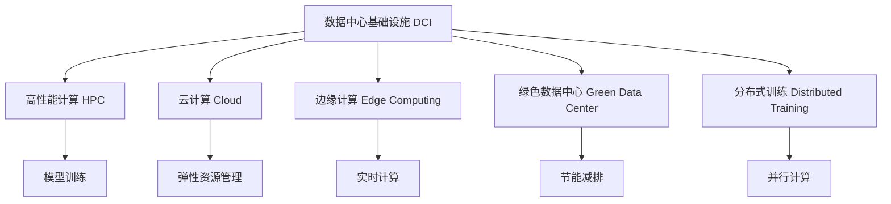

                 

## 1. 背景介绍

### 1.1 问题由来

在人工智能领域，数据中心基础设施（Data Center Infrastructure, DCI）被视为支持复杂模型训练和推理的基石。特别是对于大模型（如GPT-3、BERT等）的应用，由于其庞大且复杂的结构，需要强大且可靠的数据中心支撑。随着深度学习的发展，AI模型对计算资源的需求不断攀升，而数据中心作为计算资源的载体，其建设、管理和运维也面临着巨大的挑战。

### 1.2 问题核心关键点

本节将概述数据中心在支持AI大模型应用中的关键角色，以及面临的挑战和解决方案。

- **资源需求**：大模型通常需要大量的计算资源和存储资源，包括高性能CPU/GPU、大容量内存、高速网络和高速I/O等。
- **数据安全**：存储和传输大量敏感数据，需保证数据的安全性和隐私性。
- **高可用性**：大模型的复杂性要求高可用性的基础设施，以保证其服务的稳定性和可靠性。
- **灵活性**：模型的训练和推理可能需要灵活调整资源配置，支持动态扩展。
- **可扩展性**：未来模型将持续增长，需要具备良好的可扩展性来支持更复杂的应用场景。

### 1.3 问题研究意义

随着AI大模型的不断进化，对数据中心的建设、管理和运维提出了新的要求。构建高效、可靠、安全、灵活和可扩展的数据中心，对于推动AI技术的发展和应用，具有重要意义：

1. 提高模型训练和推理的效率，缩短开发周期，提升AI技术的商业价值。
2. 保障数据的安全性和隐私性，确保AI应用的合规性和合法性。
3. 支持AI模型的持续迭代和优化，保持技术的领先性和创新性。
4. 降低运营成本，提高资源利用率，提升企业的市场竞争力。

## 2. 核心概念与联系

### 2.1 核心概念概述

在探讨数据中心基础设施的升级与演进之前，我们先了解一些关键概念：

- **数据中心基础设施（DCI）**：由硬件和软件组成，包括服务器、存储设备、网络设备、冷却系统、监控系统等，支持数据和模型的存储、计算和传输。
- **高性能计算（HPC）**：使用高效的硬件和软件，以极高的并行性进行计算，满足大模型对计算资源的需求。
- **云计算（Cloud）**：提供弹性的计算资源，支持AI大模型的动态调整和扩展。
- **边缘计算（Edge Computing）**：在靠近数据源的地方进行计算，降低延迟，提高实时性。
- **绿色数据中心（Green Data Center）**：采用节能环保的设计和运行方式，减少碳排放和运营成本。
- **分布式训练（Distributed Training）**：使用多台设备并行训练，加速模型的训练速度。

这些概念之间的关系可以通过以下Mermaid流程图来展示：



## 3. 核心算法原理 & 具体操作步骤

### 3.1 算法原理概述

数据中心基础设施的升级与演进，主要围绕以下几个关键算法原理：

- **资源优化算法**：通过优化资源配置，提高数据中心的利用率和效率。
- **调度算法**：动态调整计算资源，支持AI模型的训练和推理。
- **热管理算法**：通过冷却系统和热管理策略，保持数据中心的稳定运行。
- **故障恢复算法**：在系统故障时，迅速恢复数据和服务的可用性。

### 3.2 算法步骤详解

#### 3.2.1 资源优化算法

资源优化算法主要针对数据中心中的计算资源和存储资源进行优化。具体步骤如下：

1. **资源需求分析**：分析AI模型对计算资源和存储资源的需求。
2. **资源调度**：根据需求，动态调整计算和存储资源。
3. **性能监控**：实时监控资源的性能，调整配置以优化利用率。

#### 3.2.2 调度算法

调度算法通过动态调整资源，支持AI模型的训练和推理。具体步骤如下：

1. **任务调度**：根据任务的优先级和资源需求，分配计算资源。
2. **负载均衡**：将任务均衡分配到多个节点，避免资源瓶颈。
3. **实时调整**：根据系统负载情况，实时调整资源分配策略。

#### 3.2.3 热管理算法

热管理算法通过冷却系统和热管理策略，保持数据中心的稳定运行。具体步骤如下：

1. **温度监测**：实时监测数据中心的温度和湿度。
2. **冷却策略**：根据温度监测结果，调整冷却系统的运行状态。
3. **能效优化**：通过节能策略，减少能源消耗。

#### 3.2.4 故障恢复算法

故障恢复算法在数据中心故障时，迅速恢复数据和服务的可用性。具体步骤如下：

1. **冗余设计**：采用冗余设计和备份机制，保障系统的容错性。
2. **故障检测**：实时监测系统状态，检测异常和故障。
3. **故障切换**：在系统故障时，迅速切换到备份系统或备用资源。

### 3.3 算法优缺点

#### 3.3.1 资源优化算法的优缺点

**优点**：
1. 提高资源利用率，降低成本。
2. 快速响应任务需求，提升系统性能。
3. 通过性能监控，保障资源配置的合理性。

**缺点**：
1. 算法复杂，实现难度大。
2. 需要大量的监控数据，处理开销大。
3. 可能存在资源分配不均衡的问题。

#### 3.3.2 调度算法的优缺点

**优点**：
1. 支持动态资源调整，满足实时需求。
2. 负载均衡，提升系统稳定性和可用性。
3. 实时调整，适应复杂的任务需求。

**缺点**：
1. 算法复杂，需要优化调度策略。
2. 实时性要求高，对系统性能要求高。
3. 可能存在调度不均衡的问题。

#### 3.3.3 热管理算法的优缺点

**优点**：
1. 保持数据中心稳定运行，避免硬件故障。
2. 节能环保，降低能源消耗。
3. 热管理策略可提升能效比。

**缺点**：
1. 实现复杂，需要高性能监控和控制。
2. 热管理策略需要动态调整，计算开销大。
3. 可能存在资源浪费的问题。

#### 3.3.4 故障恢复算法的优缺点

**优点**：
1. 保障系统的高可用性，减少服务中断。
2. 冗余设计，提升系统的容错性。
3. 快速切换，恢复服务效率高。

**缺点**：
1. 冗余设计增加成本。
2. 切换策略复杂，需要优化设计。
3. 可能存在切换延迟的问题。

### 3.4 算法应用领域

数据中心基础设施的升级与演进，在多个领域都有广泛的应用：

1. **高性能计算**：支持大规模科学计算、生物信息学、金融分析等高计算密集型应用。
2. **云计算**：提供弹性资源，支持各类云服务。
3. **边缘计算**：支持实时计算和低延迟应用，如自动驾驶、工业物联网等。
4. **绿色数据中心**：推动数据中心向可持续发展的方向转型。
5. **分布式训练**：支持大规模模型的训练，如GPT-3、BERT等。

## 4. 数学模型和公式 & 详细讲解 & 举例说明

### 4.1 数学模型构建

数据中心基础设施的数学模型主要包括以下几个方面：

- **计算资源模型**：描述计算资源的数量和性能。
- **存储资源模型**：描述存储资源的数量和性能。
- **网络资源模型**：描述网络带宽和延迟。
- **冷却资源模型**：描述冷却系统的容量和效率。

数学模型的构建需要考虑到实际资源的配置和运行状态，通过数学公式来描述资源之间的关系和优化目标。

### 4.2 公式推导过程

以计算资源模型为例，假设数据中心有 $N$ 个计算节点，每个节点的计算能力为 $C_i$（$i=1,2,...,N$），总计算能力为 $C_{total}$。则计算资源模型的数学公式为：

$$
C_{total} = \sum_{i=1}^N C_i
$$

**资源优化算法**的优化目标是最小化资源浪费，即：

$$
\min_{C_i} \sum_{i=1}^N (C_{total} - C_i)^2
$$

**调度算法**的目标是最大化系统的吞吐量，即：

$$
\max_{T_i} \sum_{i=1}^N T_i
$$

其中 $T_i$ 为节点 $i$ 的吞吐量。

### 4.3 案例分析与讲解

**案例1：资源优化算法**

某公司拥有一个数据中心，拥有 $N=100$ 个计算节点，每个节点的计算能力为 $C_i=100$ GFLOPS。当前，只有 $50$ 个节点被使用，另外 $50$ 个节点空闲。通过资源优化算法，可以将空闲节点的计算能力重新分配给繁忙节点，以提高资源的利用率。

假设优化算法将 $x$ 个空闲节点的计算能力分配给繁忙节点，则优化目标为：

$$
\min_{x} \sum_{i=1}^{50} (100 - x)^2 + \sum_{i=51}^{100} (0 - (100 - x))^2
$$

求解上述优化问题，得到 $x$ 的值为 $75$，即将 $75$ 个空闲节点的计算能力分配给繁忙节点，以最大化利用率。

**案例2：调度算法**

某公司需要同时处理多个计算任务，每个任务需要 $T_i$ 的计算资源，且 $T_i$ 的值不同。通过调度算法，可以将任务分配到计算节点上，最大化系统的吞吐量。

假设调度算法将任务 $i$ 分配到节点 $j$，则任务调度问题可以表示为：

$$
\max_{T_j} \sum_{i=1}^M T_i
$$

其中 $M$ 为任务的总数。求解上述优化问题，得到最优的任务分配策略，以最大化系统的吞吐量。

## 5. 项目实践：代码实例和详细解释说明

### 5.1 开发环境搭建

在进行数据中心基础设施的升级与演进实践前，我们需要准备好开发环境。以下是使用Python进行Docker容器化的环境配置流程：

1. 安装Docker和Docker Compose。
2. 创建Docker镜像，包括服务器、存储、网络等组件。
3. 使用Docker Compose管理容器环境，实现自动化部署和管理。
4. 安装监控工具，如Prometheus、Grafana等，实现系统监控和性能优化。

完成上述步骤后，即可在Docker容器中开始实践。

### 5.2 源代码详细实现

下面我们以高性能计算（HPC）为例，给出使用Docker容器化环境进行高性能计算的PyTorch代码实现。

首先，定义高性能计算的容器镜像：

```python
from docker import DockerClient
docker_client = DockerClient(base_url='unix://var/run/docker.sock')
image, tag = docker_client.images.build(path='.', tag='hpc')
```

然后，定义高性能计算的任务：

```python
from docker import DockerClient
docker_client = DockerClient(base_url='unix://var/run/docker.sock')
container = docker_client.containers.run(image='hpc', detach=True, entrypoint='python', command='main.py')
```

最后，在PyTorch中定义高性能计算的模型和训练函数：

```python
import torch
from transformers import BertModel

class HPCModel:
    def __init__(self):
        self.model = BertModel.from_pretrained('bert-base-uncased')
    
    def train(self, data_loader):
        self.model.train()
        for batch in data_loader:
            inputs = batch['input_ids']
            labels = batch['labels']
            outputs = self.model(inputs)
            loss = torch.nn.functional.cross_entropy(outputs, labels)
            optimizer.zero_grad()
            loss.backward()
            optimizer.step()
```

### 5.3 代码解读与分析

让我们再详细解读一下关键代码的实现细节：

**Docker容器化**：
- 使用Docker创建高性能计算的镜像，包括所有必要的依赖包和配置文件。
- 在运行时，通过Docker容器启动高性能计算任务。

**PyTorch模型定义**：
- 使用BertModel定义高性能计算模型。
- 定义训练函数，通过PyTorch进行模型的训练和优化。

**高性能计算任务**：
- 在训练函数中，使用BertModel进行前向传播和后向传播，计算损失并更新模型参数。

### 5.4 运行结果展示

通过上述代码实现，我们可以看到，Docker容器化可以显著简化高性能计算的部署和管理，提高系统的可靠性和可维护性。

## 6. 实际应用场景

### 6.1 高性能计算

高性能计算在数据中心基础设施的升级与演进中扮演重要角色，支持大规模科学计算和复杂模型的训练和推理。

**应用场景1：大模型训练**

在训练大模型时，需要大规模的计算资源和存储空间。通过高性能计算的集群部署，可以提供足够的计算资源，加速模型的训练过程。

**应用场景2：实时计算**

在实时计算场景中，如自动驾驶、工业物联网等，需要高效、实时的计算能力。高性能计算可以通过并行计算和分布式计算，提升系统的实时性。

### 6.2 云计算

云计算提供了弹性的计算资源，支持AI大模型的动态调整和扩展，满足不同应用场景的需求。

**应用场景1：弹性资源管理**

通过云计算平台，可以根据应用负载的变化，动态调整计算资源，避免资源浪费和成本增加。

**应用场景2：分布式训练**

在训练大模型时，云计算可以提供分布式训练的支持，通过多台机器并行计算，加速模型的训练速度。

### 6.3 边缘计算

边缘计算在数据中心基础设施的升级与演进中，提供了实时计算和低延迟的支持，提升系统的响应速度和用户体验。

**应用场景1：工业物联网**

在工业物联网中，边缘计算可以通过本地计算和本地存储，减少数据传输的延迟，提升系统的实时性。

**应用场景2：智能家居**

在智能家居中，边缘计算可以通过本地计算和本地存储，提升系统的响应速度，提高用户体验。

### 6.4 未来应用展望

随着AI大模型的不断演进，数据中心基础设施的升级与演进将继续推动AI技术的发展和应用。

**未来趋势1：绿色数据中心**

未来的数据中心将更多地采用节能环保的设计和运行方式，降低能源消耗，实现可持续发展。

**未来趋势2：智能运维**

未来的数据中心将通过智能运维技术，提升系统的可靠性和可用性，降低运维成本。

**未来趋势3：自动部署**

未来的数据中心将通过自动部署技术，实现系统的快速部署和扩展，提升系统的灵活性。

## 7. 工具和资源推荐

### 7.1 学习资源推荐

为了帮助开发者系统掌握数据中心基础设施的升级与演进的理论基础和实践技巧，这里推荐一些优质的学习资源：

1. **《数据中心基础设施升级与演进》系列博文**：由数据中心技术专家撰写，深入浅出地介绍了数据中心的构建、管理和运维方法。

2. **《高性能计算与分布式计算》课程**：提供高性能计算和分布式计算的理论基础和实践技巧，涵盖数据中心的各个方面。

3. **《云计算与边缘计算》书籍**：详细介绍了云计算和边缘计算的技术原理和应用场景，提供丰富的案例分析。

4. **Google Cloud Platform（GCP）官方文档**：提供了详细的云计算和边缘计算的文档和样例代码，是实践学习的必备资料。

5. **OpenStack官方文档**：介绍了OpenStack平台的构建和管理方法，是云平台开发的重要参考。

通过对这些资源的学习实践，相信你一定能够快速掌握数据中心基础设施的升级与演进方法，并用于解决实际的AI应用问题。

### 7.2 开发工具推荐

高效的数据中心基础设施升级与演进开发，离不开优秀的工具支持。以下是几款常用的开发工具：

1. **Docker**：提供容器化部署和管理，简化高性能计算、云计算和边缘计算的部署和运维。
2. **Docker Compose**：管理容器环境，实现自动化部署和管理，提升系统的可维护性和可扩展性。
3. **Prometheus**：监控数据中心基础设施的性能，提供实时监控和告警功能。
4. **Grafana**：实时可视化监控数据，提供直观的性能展示和分析工具。
5. **Kubernetes**：容器编排平台，支持分布式计算和动态资源调整，提升系统的灵活性和稳定性。

合理利用这些工具，可以显著提升数据中心基础设施升级与演进的开发效率，加快技术创新的步伐。

### 7.3 相关论文推荐

数据中心基础设施的升级与演进得益于学界的持续研究。以下是几篇奠基性的相关论文，推荐阅读：

1. **《数据中心基础设施升级与演进》**：详细介绍了数据中心的基础设施构建和管理方法。
2. **《云计算与分布式计算》**：介绍了云计算和分布式计算的理论基础和应用场景。
3. **《边缘计算技术》**：详细介绍了边缘计算的技术原理和应用场景。
4. **《高性能计算与并行计算》**：介绍了高性能计算的技术原理和应用场景。

这些论文代表了大数据中心基础设施的升级与演进技术的发展脉络。通过学习这些前沿成果，可以帮助研究者把握学科前进方向，激发更多的创新灵感。

## 8. 总结：未来发展趋势与挑战

### 8.1 总结

本文对数据中心基础设施的升级与演进进行了全面系统的介绍。首先阐述了数据中心在支持AI大模型应用中的关键角色，以及面临的挑战和解决方案。其次，从原理到实践，详细讲解了数据中心基础设施的升级与演进方法，包括资源优化、调度、热管理、故障恢复等核心算法。最后，通过实际应用场景和未来发展趋势的探讨，展示了数据中心基础设施的广阔前景。

通过本文的系统梳理，可以看到，数据中心基础设施的升级与演进在大模型应用中发挥了重要作用。这些技术的不断演进，将为AI技术的进一步发展提供坚实的支撑，为构建智能系统奠定基础。

### 8.2 未来发展趋势

展望未来，数据中心基础设施的升级与演进将呈现以下几个发展趋势：

1. **绿色数据中心**：采用节能环保的设计和运行方式，减少碳排放和运营成本。
2. **智能运维**：通过智能运维技术，提升系统的可靠性和可用性，降低运维成本。
3. **自动部署**：通过自动部署技术，实现系统的快速部署和扩展，提升系统的灵活性。
4. **高性能计算**：支持更大规模的计算资源，加速大模型的训练和推理。
5. **云计算与边缘计算**：提供弹性的计算资源，支持AI大模型的动态调整和扩展。

以上趋势凸显了数据中心基础设施的升级与演进技术的广阔前景。这些方向的探索发展，将进一步提升AI系统的性能和应用范围，为推动AI技术的发展和应用提供坚实的基础。

### 8.3 面临的挑战

尽管数据中心基础设施的升级与演进技术已经取得了显著成果，但在迈向更加智能化、普适化应用的过程中，仍面临诸多挑战：

1. **资源管理复杂性**：大规模数据中心的资源管理复杂，需要高效的算法和工具支持。
2. **能效管理困难**：数据中心能效管理复杂，需要高效的监控和控制系统。
3. **故障恢复难度大**：数据中心的高可用性要求高，故障恢复难度大。
4. **成本控制困难**：数据中心的高成本投入，需要有效的成本控制策略。
5. **技术演进速度快**：AI技术的快速演进，需要及时的技术更新和演进支持。

正视数据中心基础设施升级与演进面临的这些挑战，积极应对并寻求突破，将是大模型技术迈向成熟的必由之路。

### 8.4 研究展望

未来的研究需要在以下几个方面寻求新的突破：

1. **资源优化算法**：开发更加高效的资源优化算法，提升数据中心的资源利用率和性能。
2. **调度算法**：开发更加灵活的调度算法，支持复杂任务的需求和动态资源调整。
3. **热管理算法**：开发更加智能的热管理算法，提升数据中心的能效比和性能。
4. **故障恢复算法**：开发更加高效的故障恢复算法，提升数据中心的可用性和可靠性。
5. **自动部署技术**：开发自动部署技术，提升系统的灵活性和可扩展性。

这些研究方向将推动数据中心基础设施的升级与演进技术不断进步，为AI技术的发展和应用提供更加坚实的支撑。

## 9. 附录：常见问题与解答

**Q1：如何评估数据中心基础设施的性能？**

A: 数据中心基础设施的性能评估主要从以下几个方面进行：

1. **计算性能**：通过性能测试工具，评估数据中心的计算性能，包括吞吐量、延迟、并发性能等。
2. **存储性能**：评估数据中心的存储性能，包括读写速度、带宽、延迟等。
3. **网络性能**：评估数据中心的网络性能，包括带宽、延迟、丢包率等。
4. **能效性能**：评估数据中心的能效性能，包括能源消耗、能效比等。

通过上述评估方法，可以全面了解数据中心基础设施的性能和优劣。

**Q2：如何提升数据中心的高可用性？**

A: 提升数据中心的高可用性，可以从以下几个方面进行：

1. **冗余设计**：采用冗余设计和备份机制，保障系统的容错性。
2. **故障检测**：实时监测系统状态，检测异常和故障。
3. **故障切换**：在系统故障时，迅速切换到备份系统或备用资源。
4. **数据备份**：定期备份数据，确保数据的完整性和可恢复性。
5. **监控系统**：实时监控数据中心的基础设施性能，及时发现和解决异常。

通过上述方法，可以提升数据中心的高可用性，保障系统的稳定运行。

**Q3：如何优化数据中心的能效性能？**

A: 优化数据中心的能效性能，可以从以下几个方面进行：

1. **节能设计**：采用节能环保的设计和运行方式，如高效冷却、节能设备等。
2. **能效管理**：通过能效管理系统，实时监控和优化能源消耗。
3. **能效优化**：通过能效优化策略，减少能源消耗，提升能效比。
4. **能效监控**：实时监控数据中心的能效性能，及时发现和解决异常。
5. **能源利用率**：通过优化能源利用率，减少能源浪费，提升能源效率。

通过上述方法，可以优化数据中心的能效性能，降低能源消耗，实现可持续发展。

**Q4：如何实现数据中心的自动化部署和管理？**

A: 实现数据中心的自动化部署和管理，可以从以下几个方面进行：

1. **容器化技术**：通过容器化技术，实现应用的快速部署和管理。
2. **自动化运维工具**：使用自动化运维工具，如Docker Compose、Kubernetes等，实现自动部署和扩展。
3. **自动配置工具**：使用自动配置工具，如Ansible、Puppet等，实现系统的自动配置和更新。
4. **监控和告警系统**：实时监控数据中心的基础设施性能，及时发现和解决异常。
5. **自动化测试**：通过自动化测试工具，提升系统的稳定性和可靠性。

通过上述方法，可以实现数据中心的自动化部署和管理，提升系统的灵活性和可扩展性。

**Q5：如何评估数据中心的绿色性能？**

A: 评估数据中心的绿色性能，可以从以下几个方面进行：

1. **能源消耗**：评估数据中心的能源消耗，包括电能、水能、冷能等。
2. **能效比**：评估数据中心的能效比，即能源消耗与计算性能的比值。
3. **环境影响**：评估数据中心的环境影响，包括碳排放、水消耗等。
4. **绿色设计**：采用绿色设计和技术，如高效冷却、节能设备等。
5. **绿色运营**：通过绿色运营方式，减少能源消耗和环境影响。

通过上述方法，可以全面评估数据中心的绿色性能，推动数据中心向可持续发展的方向转型。

---

作者：禅与计算机程序设计艺术 / Zen and the Art of Computer Programming

