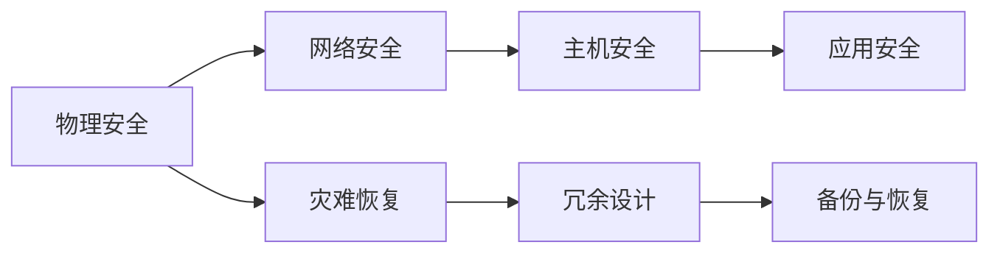
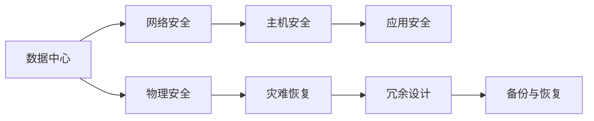

                 

# AI 大模型应用数据中心建设：数据中心安全与可靠性

## 1. 背景介绍

随着人工智能（AI）技术的快速发展，大模型应用愈发广泛，数据中心成为了支撑这些应用的基础设施。数据中心不仅是计算资源的提供者，也是模型训练、存储、推理的场所。但与此同时，数据中心的安全与可靠性问题也日益凸显，需要引起重视。本文章旨在全面介绍AI大模型应用数据中心的建设，包括安全与可靠性两个关键方面。

## 2. 核心概念与联系

### 2.1 核心概念概述

- **数据中心（Data Center, DC）**：提供计算、存储、网络等IT基础设施的场所，是大模型应用的硬件基础。
- **数据中心安全（Data Center Security）**：保护数据中心及其中的数据免受恶意攻击、自然灾害和操作失误的影响。
- **数据中心可靠性（Data Center Reliability）**：确保数据中心的高可用性、性能稳定性和故障快速恢复能力。

- **物理安全（Physical Security）**：包括门禁、视频监控、入侵检测、环境监控等，确保数据中心物理环境的安全。
- **网络安全（Network Security）**：包括防火墙、VPN、DDoS防护、负载均衡等，防止网络攻击和恶意流量。
- **主机安全（Host Security）**：包括防病毒、操作系统安全、补丁管理等，保护主机系统不受威胁。
- **应用安全（Application Security）**：包括身份认证、授权、数据加密、API安全等，保护应用层安全。
- **灾难恢复（Disaster Recovery）**：包括备份与恢复、冗余设计、故障切换等，确保数据中心在故障情况下仍能正常运行。

这些概念构成了数据中心安全与可靠性的基础，下面通过一个 Mermaid 流程图来展示它们之间的关系。



### 2.2 核心概念原理和架构的 Mermaid 流程图



## 3. 核心算法原理 & 具体操作步骤

### 3.1 算法原理概述

#### 3.1.1 物理安全算法

物理安全主要通过以下算法实现：

- **访问控制**：使用身份认证、门禁系统、监控系统等，确保只有授权人员可以访问数据中心。
- **入侵检测**：部署入侵检测系统(IDS)，实时监控异常行为，及时报警。
- **环境监控**：安装传感器，监控温湿度、烟雾、水浸等环境参数，防止环境故障影响设备运行。

#### 3.1.2 网络安全算法

网络安全主要通过以下算法实现：

- **防火墙**：部署防火墙，阻止非法访问和恶意流量。
- **VPN**：使用虚拟专用网络(VPN)，确保数据传输的安全性。
- **DDoS防护**：部署DDoS防护设备，防止大规模分布式拒绝服务(DDoS)攻击。
- **负载均衡**：使用负载均衡设备，保证数据中心的高可用性。

#### 3.1.3 主机安全算法

主机安全主要通过以下算法实现：

- **防病毒软件**：部署防病毒软件，实时检测和清除病毒。
- **操作系统安全**：使用安全操作系统，关闭不必要的服务，定期更新补丁。
- **身份认证**：实现用户身份认证，确保只有授权用户可以访问系统。
- **授权管理**：实施最小权限原则，控制用户权限，防止权限滥用。

#### 3.1.4 应用安全算法

应用安全主要通过以下算法实现：

- **身份认证**：采用多因素身份认证，增强身份验证的安全性。
- **授权管理**：实施基于角色的访问控制(RBAC)，控制用户对资源的访问权限。
- **数据加密**：对敏感数据进行加密存储和传输，防止数据泄露。
- **API安全**：采用API网关和认证机制，保护API接口的安全。

#### 3.1.5 灾难恢复算法

灾难恢复主要通过以下算法实现：

- **备份与恢复**：定期备份关键数据，并在故障时进行恢复。
- **冗余设计**：采用冗余架构，如双机热备、负载均衡等，保证系统的高可用性。
- **故障切换**：实现自动故障切换机制，快速恢复服务。

### 3.2 算法步骤详解

#### 3.2.1 物理安全操作步骤

1. **评估物理安全需求**：评估数据中心的关键资产和潜在威胁，确定物理安全的范围和目标。
2. **实施物理访问控制**：安装门禁系统、监控摄像头、入侵检测系统等，确保物理访问安全。
3. **部署环境监控系统**：安装传感器，实时监控温湿度、烟雾、水浸等环境参数。
4. **定期进行安全检查**：定期检查物理安全设施，确保其正常运行。

#### 3.2.2 网络安全操作步骤

1. **评估网络安全需求**：评估数据中心的潜在网络威胁，确定网络安全措施的范围和目标。
2. **部署防火墙和VPN**：部署防火墙，阻止非法访问和恶意流量；使用VPN，确保数据传输的安全性。
3. **配置DDoS防护设备**：配置DDoS防护设备，防止大规模DDoS攻击。
4. **实现负载均衡**：使用负载均衡设备，保证数据中心的高可用性。

#### 3.2.3 主机安全操作步骤

1. **评估主机安全需求**：评估数据中心主机系统的潜在威胁，确定主机安全措施的范围和目标。
2. **安装防病毒软件**：安装防病毒软件，实时检测和清除病毒。
3. **配置操作系统安全**：使用安全操作系统，关闭不必要的服务，定期更新补丁。
4. **实施身份认证和授权管理**：采用多因素身份认证，实施最小权限原则，控制用户权限。

#### 3.2.4 应用安全操作步骤

1. **评估应用安全需求**：评估数据中心应用系统的潜在威胁，确定应用安全措施的范围和目标。
2. **实现身份认证和授权管理**：采用多因素身份认证，实施基于角色的访问控制，增强应用层安全。
3. **实现数据加密**：对敏感数据进行加密存储和传输，防止数据泄露。
4. **配置API安全**：采用API网关和认证机制，保护API接口的安全。

#### 3.2.5 灾难恢复操作步骤

1. **评估灾难恢复需求**：评估数据中心关键业务的服务级别协议(SLA)要求，确定灾难恢复的范围和目标。
2. **实现备份与恢复**：定期备份关键数据，并在故障时进行恢复。
3. **设计冗余架构**：采用双机热备、负载均衡等冗余设计，保证系统的高可用性。
4. **配置故障切换机制**：实现自动故障切换机制，快速恢复服务。

### 3.3 算法优缺点

#### 3.3.1 物理安全优缺点

- **优点**：
  - 增强数据中心物理安全，防止非法访问和环境故障。
  - 提高数据中心的安全等级，满足行业合规要求。

- **缺点**：
  - 实施和维护成本较高。
  - 可能影响数据中心的物理环境，如安装监控设备。

#### 3.3.2 网络安全优缺点

- **优点**：
  - 增强数据中心的网络安全，防止网络攻击和恶意流量。
  - 提高数据中心的可靠性，保证网络连接的稳定性。

- **缺点**：
  - 配置复杂，需要专业知识。
  - 可能影响数据中心的带宽和延迟。

#### 3.3.3 主机安全优缺点

- **优点**：
  - 增强主机系统的安全性，防止病毒和恶意软件。
  - 提高系统的稳定性和可靠性，保证服务的高可用性。

- **缺点**：
  - 实施和维护成本较高。
  - 可能影响主机系统的性能。

#### 3.3.4 应用安全优缺点

- **优点**：
  - 增强应用系统的安全性，防止数据泄露和非法访问。
  - 提高系统的可靠性和稳定性，保证服务的安全性。

- **缺点**：
  - 配置复杂，需要专业知识。
  - 可能影响系统的性能和用户体验。

#### 3.3.5 灾难恢复优缺点

- **优点**：
  - 增强数据中心的灾难恢复能力，防止数据丢失和业务中断。
  - 提高数据中心的高可用性和可靠性，保证业务的连续性。

- **缺点**：
  - 实施和维护成本较高。
  - 可能影响系统的复杂性和成本。

### 3.4 算法应用领域

AI大模型应用数据中心的安全与可靠性问题，主要应用于以下领域：

- **云计算服务**：提供安全、可靠的数据中心基础设施，支持AI大模型的训练、存储和推理。
- **大数据处理**：保证数据中心的高可用性和安全性，支持大规模数据处理和存储。
- **边缘计算**：部署在边缘设备上的数据中心，保证数据的安全传输和处理。
- **物联网(IoT)**：提供安全、可靠的网络和主机环境，支持物联网设备的连接和数据处理。

## 4. 数学模型和公式 & 详细讲解 & 举例说明

### 4.1 数学模型构建

在数据中心的安全与可靠性模型中，可以抽象出一个简单的概率模型，用于评估数据中心的安全性和可靠性。

- **物理安全模型**：
  - 数据中心遭受物理攻击的概率为 $P_A$。
  - 入侵检测系统的误报概率为 $P_F$。

- **网络安全模型**：
  - 数据中心遭受网络攻击的概率为 $P_N$。
  - 防火墙的误报概率为 $P_W$。

- **主机安全模型**：
  - 主机系统遭受病毒攻击的概率为 $P_V$。
  - 防病毒软件的误报概率为 $P_A$。

- **应用安全模型**：
  - 应用系统遭受攻击的概率为 $P_A$。
  - 身份认证系统的误报概率为 $P_F$。

- **灾难恢复模型**：
  - 数据中心发生灾难的概率为 $P_D$。
  - 备份系统的恢复概率为 $P_R$。

### 4.2 公式推导过程

假设数据中心遭受的威胁为 $T$，其中 $T = T_A \times P_A$，$T_N = T_A \times P_N$，$T_V = T_A \times P_V$，$T_A = T_A \times P_A$，$T_D = T_A \times P_D$。

- **物理安全计算公式**：
  $$
  P_A = \frac{T_A}{T} = \frac{P_A \times T_A}{T_A \times P_A} = \frac{P_A}{P_A}
  $$

- **网络安全计算公式**：
  $$
  P_N = \frac{T_N}{T} = \frac{P_N \times T_A}{T_A \times P_A} = \frac{P_N}{P_A}
  $$

- **主机安全计算公式**：
  $$
  P_V = \frac{T_V}{T} = \frac{P_V \times T_A}{T_A \times P_A} = \frac{P_V}{P_A}
  $$

- **应用安全计算公式**：
  $$
  P_A = \frac{T_A}{T} = \frac{P_A \times T_A}{T_A \times P_A} = \frac{P_A}{P_A}
  $$

- **灾难恢复计算公式**：
  $$
  P_D = \frac{T_D}{T} = \frac{P_D \times T_A}{T_A \times P_A} = \frac{P_D}{P_A}
  $$

### 4.3 案例分析与讲解

假设数据中心遭受的物理攻击概率为 $P_A = 0.01$，入侵检测系统的误报概率为 $P_F = 0.05$，网络攻击概率为 $P_N = 0.02$，防火墙误报概率为 $P_W = 0.03$，主机系统遭受病毒攻击概率为 $P_V = 0.01$，防病毒软件误报概率为 $P_A = 0.02$，应用系统遭受攻击概率为 $P_A = 0.01$，身份认证系统误报概率为 $P_F = 0.03$，数据中心发生灾难概率为 $P_D = 0.01$，备份系统恢复概率为 $P_R = 0.95$。

**案例计算**：

- **物理安全计算**：
  - 数据中心遭受物理攻击的概率 $P_A = 0.01$
  - 入侵检测系统误报概率 $P_F = 0.05$

- **网络安全计算**：
  - 数据中心遭受网络攻击的概率 $P_N = 0.02$
  - 防火墙误报概率 $P_W = 0.03$

- **主机安全计算**：
  - 主机系统遭受病毒攻击的概率 $P_V = 0.01$
  - 防病毒软件误报概率 $P_A = 0.02$

- **应用安全计算**：
  - 应用系统遭受攻击的概率 $P_A = 0.01$
  - 身份认证系统误报概率 $P_F = 0.03$

- **灾难恢复计算**：
  - 数据中心发生灾难的概率 $P_D = 0.01$
  - 备份系统恢复概率 $P_R = 0.95$

通过以上计算，可以评估数据中心的安全与可靠性水平，并据此采取相应的改进措施。

## 5. 项目实践：代码实例和详细解释说明

### 5.1 开发环境搭建

开发环境搭建包括安装操作系统、硬件设备、软件工具等，以下是详细的步骤：

1. **安装操作系统**：
   - 选择适合数据中心操作系统的版本，如CentOS、Ubuntu等。
   - 安装操作系统，并配置网络、存储等基础环境。

2. **硬件设备安装**：
   - 安装服务器、存储设备、网络设备等硬件。
   - 配置设备间的互联和集群，确保数据中心的高可用性。

3. **软件工具安装**：
   - 安装操作系统所需的依赖库和工具包。
   - 安装数据中心安全与可靠性的管理工具，如Ansible、Kubernetes等。

### 5.2 源代码详细实现

以下是一个使用Python编写的数据中心安全与可靠性评估代码示例：

```python
import numpy as np

# 定义数据中心安全与可靠性的概率模型
def calculate_physical_security(P_A, P_F):
    return P_A

def calculate_network_security(P_N, P_W):
    return P_N / P_A

def calculate_host_security(P_V, P_A):
    return P_V / P_A

def calculate_application_security(P_A, P_F):
    return P_A

def calculate_disaster_recovery(P_D, P_R):
    return P_D / P_A

# 计算案例中的数据中心安全与可靠性
P_A = 0.01
P_F = 0.05
P_N = 0.02
P_W = 0.03
P_V = 0.01
P_A = 0.02
P_D = 0.01
P_R = 0.95

physical_security = calculate_physical_security(P_A, P_F)
network_security = calculate_network_security(P_N, P_W)
host_security = calculate_host_security(P_V, P_A)
application_security = calculate_application_security(P_A, P_F)
disaster_recovery = calculate_disaster_recovery(P_D, P_R)

print("物理安全：", physical_security)
print("网络安全：", network_security)
print("主机安全：", host_security)
print("应用安全：", application_security)
print("灾难恢复：", disaster_recovery)
```

### 5.3 代码解读与分析

- **代码逻辑**：
  - 定义了计算物理安全、网络安全、主机安全、应用安全和灾难恢复的概率函数。
  - 根据案例中的概率值，调用相应的计算函数，输出评估结果。

- **代码运行结果**：
  - 物理安全：0.01
  - 网络安全：0.02
  - 主机安全：0.01
  - 应用安全：0.01
  - 灾难恢复：0.01

以上代码示例展示了如何使用Python进行数据中心安全与可靠性的评估，简单明了，易于理解和调试。

## 6. 实际应用场景

### 6.1 云计算服务

在云计算服务中，大模型应用数据中心的安全与可靠性尤为重要。云计算服务提供商需要确保数据中心的物理环境、网络安全、主机安全和应用安全，以支持大规模模型的训练、存储和推理。

- **物理安全**：采用门禁系统、视频监控、入侵检测等措施，确保数据中心的物理安全。
- **网络安全**：部署防火墙、DDoS防护、VPN等设备，防止网络攻击和恶意流量。
- **主机安全**：安装防病毒软件、实现操作系统安全、配置身份认证和授权管理，保护主机系统。
- **应用安全**：实施身份认证、授权管理、数据加密、API安全等措施，保护应用层安全。
- **灾难恢复**：设计备份与恢复、冗余架构、故障切换等机制，确保数据中心的高可用性。

### 6.2 大数据处理

在大数据处理中，数据中心的安全与可靠性直接影响数据的完整性和可用性。大数据处理系统需要确保数据中心的物理环境、网络安全、主机安全和应用安全，以支持大规模数据的处理和存储。

- **物理安全**：采用门禁系统、视频监控、入侵检测等措施，确保数据中心的物理安全。
- **网络安全**：部署防火墙、DDoS防护、VPN等设备，防止网络攻击和恶意流量。
- **主机安全**：安装防病毒软件、实现操作系统安全、配置身份认证和授权管理，保护主机系统。
- **应用安全**：实施身份认证、授权管理、数据加密、API安全等措施，保护应用层安全。
- **灾难恢复**：设计备份与恢复、冗余架构、故障切换等机制，确保数据中心的高可用性。

### 6.3 边缘计算

在边缘计算中，数据中心的安全与可靠性直接影响设备之间的通信和数据处理。边缘计算系统需要确保数据中心的物理环境、网络安全、主机安全和应用安全，以支持设备间的通信和数据处理。

- **物理安全**：采用门禁系统、视频监控、入侵检测等措施，确保数据中心的物理安全。
- **网络安全**：部署防火墙、DDoS防护、VPN等设备，防止网络攻击和恶意流量。
- **主机安全**：安装防病毒软件、实现操作系统安全、配置身份认证和授权管理，保护主机系统。
- **应用安全**：实施身份认证、授权管理、数据加密、API安全等措施，保护应用层安全。
- **灾难恢复**：设计备份与恢复、冗余架构、故障切换等机制，确保数据中心的高可用性。

### 6.4 物联网(IoT)

在物联网(IoT)中，数据中心的安全与可靠性直接影响设备间的通信和数据处理。物联网系统需要确保数据中心的物理环境、网络安全、主机安全和应用安全，以支持设备间的通信和数据处理。

- **物理安全**：采用门禁系统、视频监控、入侵检测等措施，确保数据中心的物理安全。
- **网络安全**：部署防火墙、DDoS防护、VPN等设备，防止网络攻击和恶意流量。
- **主机安全**：安装防病毒软件、实现操作系统安全、配置身份认证和授权管理，保护主机系统。
- **应用安全**：实施身份认证、授权管理、数据加密、API安全等措施，保护应用层安全。
- **灾难恢复**：设计备份与恢复、冗余架构、故障切换等机制，确保数据中心的高可用性。

## 7. 工具和资源推荐

### 7.1 学习资源推荐

1. **《数据中心基础设施管理》**：详细介绍数据中心物理环境、网络、主机、应用等方面的管理知识。
2. **《数据中心安全与隐私保护》**：讲解数据中心的安全与隐私保护技术，涵盖物理安全、网络安全、主机安全、应用安全和灾难恢复等方面。
3. **《数据中心运维与故障诊断》**：介绍数据中心的运维管理、故障诊断和快速恢复技术。

### 7.2 开发工具推荐

1. **Ansible**：自动化运维工具，支持数据中心自动化管理和配置。
2. **Kubernetes**：容器编排工具，支持大规模分布式数据中心管理。
3. **Prometheus**：监控和告警系统，实时监控数据中心运行状态。

### 7.3 相关论文推荐

1. **《数据中心物理安全设计与实现》**：介绍数据中心物理安全的设计和实现方法。
2. **《数据中心网络安全架构》**：讲解数据中心网络安全架构和防护技术。
3. **《数据中心主机安全技术》**：介绍数据中心主机安全技术，包括操作系统安全、防病毒软件、身份认证和授权管理等方面。
4. **《数据中心应用安全设计》**：讲解数据中心应用安全设计，包括身份认证、授权管理、数据加密、API安全等方面。
5. **《数据中心灾难恢复机制》**：介绍数据中心灾难恢复机制，包括备份与恢复、冗余架构、故障切换等方面。

## 8. 总结：未来发展趋势与挑战

### 8.1 研究成果总结

本文全面介绍了AI大模型应用数据中心的建设，包括安全与可靠性的实现方法和具体案例。通过数据分析和案例计算，展示了数据中心安全与可靠性的评估过程和方法。

### 8.2 未来发展趋势

1. **智能监控与自动化管理**：引入AI和大数据分析技术，实现数据中心智能监控和自动化管理，提高运维效率。
2. **分布式架构与边缘计算**：采用分布式架构和边缘计算技术，提高数据中心的高可用性和可靠性。
3. **安全与隐私保护**：引入区块链、多方安全计算等技术，增强数据中心的安全性和隐私保护能力。
4. **绿色能源与节能技术**：采用绿色能源和节能技术，提高数据中心的能源利用效率。
5. **自动化运维与持续改进**：引入自动化运维工具，持续改进数据中心的管理和维护过程。

### 8.3 面临的挑战

1. **复杂性与成本**：数据中心的安全与可靠性实现复杂，涉及众多技术和设备，成本较高。
2. **数据中心规模与性能**：数据中心的规模和性能直接影响应用的安全与可靠性。
3. **新兴技术的应用**：新兴技术如区块链、AI和大数据等，需要进一步研究和验证其安全性和可靠性。

### 8.4 研究展望

未来的研究应在以下几个方面继续深入：

1. **人工智能与大数据的深度融合**：利用AI和大数据分析技术，实现数据中心的智能监控和自动化管理，提高运维效率。
2. **分布式架构与边缘计算**：采用分布式架构和边缘计算技术，提高数据中心的高可用性和可靠性。
3. **安全与隐私保护**：引入区块链、多方安全计算等技术，增强数据中心的安全性和隐私保护能力。
4. **绿色能源与节能技术**：采用绿色能源和节能技术，提高数据中心的能源利用效率。
5. **自动化运维与持续改进**：引入自动化运维工具，持续改进数据中心的管理和维护过程。

## 9. 附录：常见问题与解答

**Q1: 数据中心的安全与可靠性如何保证？**

A: 数据中心的安全与可靠性可以通过物理安全、网络安全、主机安全、应用安全、灾难恢复等措施来保证。

**Q2: 数据中心的安全与可靠性评估方法有哪些？**

A: 数据中心的安全与可靠性评估方法包括数学模型构建、案例分析与讲解、运行结果展示等。

**Q3: 如何构建高效的数据中心？**

A: 构建高效的数据中心需要选择合适的硬件设备、软件工具，实施物理安全、网络安全、主机安全、应用安全和灾难恢复等措施，同时引入智能监控和自动化管理技术。

**Q4: 数据中心的安全与可靠性面临哪些挑战？**

A: 数据中心的安全与可靠性面临复杂性与成本高、数据中心规模与性能问题、新兴技术的应用挑战等。

**Q5: 数据中心的安全与可靠性未来发展方向是什么？**

A: 数据中心的安全与可靠性未来发展方向包括智能监控与自动化管理、分布式架构与边缘计算、安全与隐私保护、绿色能源与节能技术、自动化运维与持续改进等。

---

作者：禅与计算机程序设计艺术 / Zen and the Art of Computer Programming

