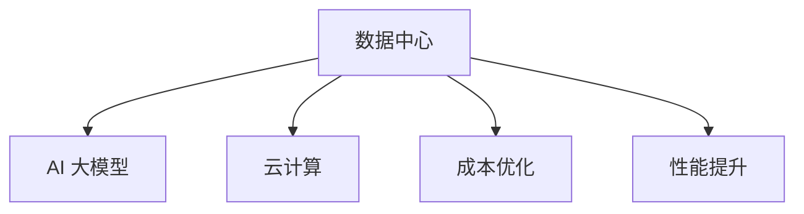
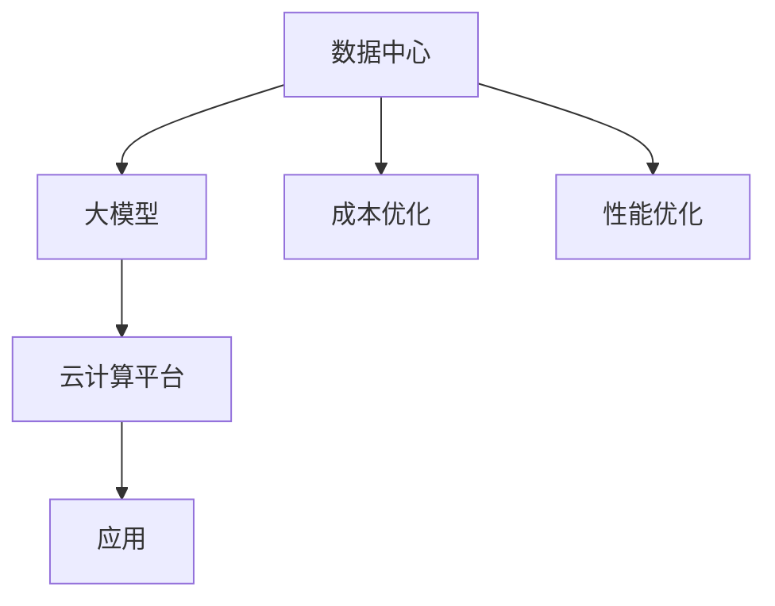

                 

# AI 大模型应用数据中心建设：数据中心成本优化

> 关键词：数据中心, 大模型, AI 基础设施, 云计算, 成本优化, 性能提升, 可扩展性

## 1. 背景介绍

随着人工智能(AI)技术的不断进步，大模型在自然语言处理(NLP)、计算机视觉(CV)、推荐系统等领域展现出巨大的潜力和应用前景。然而，大模型通常需要巨大的计算资源和存储空间，这对于数据中心的建设和管理提出了严峻挑战。如何在有限预算和资源约束下，高效构建和运行大模型，是当前AI基础设施建设领域的一个热点问题。本文将探讨AI大模型应用中的数据中心建设，并详细介绍如何通过优化数据中心的建设和运维策略，降低成本并提升性能。

## 2. 核心概念与联系

### 2.1 核心概念概述

在深入讨论数据中心成本优化前，首先介绍几个关键概念：

- **数据中心(Data Center, DC)**：是互联网和云计算服务的核心基础设施，负责存储、计算和传输数据。数据中心通常由服务器、网络设备、冷却系统、电源设备等组成。

- **AI 大模型(AI Large Model, LLM)**：如BERT、GPT等，这些模型通常基于大规模神经网络架构，需要高性能计算资源进行训练和推理。

- **云计算(Cloud Computing)**：通过互联网提供可扩展的计算资源，按需使用，按量付费。主要服务提供商包括AWS、Azure、Google Cloud等。

- **成本优化(Cost Optimization)**：在满足性能要求的前提下，通过资源调度、硬件选型、软件优化等手段，降低数据中心的运营成本。

- **性能提升(Performance Optimization)**：通过提升计算资源利用率、加速数据传输等手段，提高数据中心的整体计算能力。

这些概念通过一个简化的合图进行描述：



### 2.2 核心概念原理和架构的 Mermaid 流程图

以下是一个简单的 Mermaid 流程图，展示了大模型应用中数据中心和云计算之间的联系：



## 3. 核心算法原理 & 具体操作步骤

### 3.1 算法原理概述

AI大模型的应用涉及数据中心的建设和管理。在实际应用中，我们需要根据数据中心的具体情况，选择合适的硬件和软件方案，并采用有效的优化策略，以实现成本优化和性能提升。具体步骤包括：

1. **硬件选型**：选择合适的服务器、存储设备和网络设备，以满足大模型的计算和存储需求。
2. **资源调度**：优化计算资源和存储资源的分配，提高资源利用率。
3. **软件优化**：优化模型训练和推理过程中的软件栈，提高效率和性能。
4. **性能监控**：实时监控数据中心的性能指标，及时发现和解决问题。

### 3.2 算法步骤详解

#### 3.2.1 硬件选型

数据中心硬件选型需要考虑以下因素：

- **服务器选择**：高性能计算任务通常使用基于CPU或GPU的服务器。对于大模型，GPU服务器更为合适，因为其计算密集型特性适合并行处理。

- **存储设备**：选择高速读写性能的存储设备，如SSD，以提升数据读写速度。

- **网络设备**：数据中心内的网络延迟和带宽是影响大模型训练和推理的关键因素。选用高带宽、低延迟的网络设备如InfiniBand或100GbE网络。

#### 3.2.2 资源调度

资源调度的目标是在满足应用需求的前提下，最大化资源利用率。具体策略包括：

- **任务隔离**：通过虚拟化技术（如KVM、VMware）将不同任务隔离，避免资源竞争。
- **负载均衡**：将任务分散到多个计算节点上，避免单节点负载过高。
- **弹性伸缩**：根据需求动态调整计算资源，如使用Auto Scaling服务。

#### 3.2.3 软件优化

软件优化主要是指在模型训练和推理过程中，优化软件栈，提升性能。具体策略包括：

- **编译器优化**：使用高效的编译器（如GCC、Clang）编译代码，提升运行速度。
- **框架优化**：使用优化过的深度学习框架（如TensorFlow、PyTorch）进行模型训练和推理。
- **内存管理**：使用内存优化技术（如NUMA、 page prefetching），减少内存访问延迟。

#### 3.2.4 性能监控

性能监控是确保数据中心正常运行的关键步骤。通过实时监控和分析性能指标，可以及时发现和解决潜在问题。具体监控指标包括：

- **CPU和GPU利用率**：监控服务器CPU和GPU的使用情况，确保资源得到充分利用。
- **网络带宽和延迟**：监控网络带宽和延迟，确保数据传输流畅。
- **存储读写速度**：监控存储设备的读写速度，确保数据读写高效。

### 3.3 算法优缺点

#### 3.3.1 优点

- **高效利用资源**：通过合理的硬件选型和资源调度，可以最大化利用计算资源和存储资源，降低成本。
- **提升性能**：通过软件优化和性能监控，可以有效提升模型的训练和推理性能。
- **灵活性**：云计算平台可以灵活调整资源，适应不同规模和需求的应用。

#### 3.3.2 缺点

- **初始投资成本高**：高性能计算设备和网络设备通常价格昂贵，初期投资成本较高。
- **复杂度增加**：硬件选型和软件优化需要专业知识和技能，可能增加管理和维护难度。
- **性能瓶颈**：在特定情况下，硬件和网络限制可能导致性能瓶颈。

### 3.4 算法应用领域

#### 3.4.1 深度学习模型训练

深度学习模型训练通常需要大规模的计算资源，如GPU集群。通过数据中心硬件选型和资源调度，可以高效地进行模型训练，减少成本。

#### 3.4.2 实时推理应用

实时推理应用需要高性能的计算和低延迟的网络，如自动驾驶、智能客服等。通过性能优化和监控，可以确保实时推理的稳定性和响应速度。

#### 3.4.3 大数据分析

大数据分析需要大量的存储空间和高效的数据传输，如数据仓库、数据湖等。通过存储优化和网络优化，可以提升大数据分析的效率和性能。

## 4. 数学模型和公式 & 详细讲解 & 举例说明

### 4.1 数学模型构建

大模型应用中的成本优化问题可以抽象为：在预算约束下，最大化数据中心的计算能力和存储能力。数学模型如下：

$$
\maximize \quad C_{\text{capacity}} = f(C_{\text{CPU}}, C_{\text{GPU}}, C_{\text{STORAGE}}, C_{\text{NETWORK}})
$$

$$
\text{subject to} \quad
\begin{cases}
C_{\text{CPU}} \geq P_{\text{CPU}} \\
C_{\text{GPU}} \geq P_{\text{GPU}} \\
C_{\text{STORAGE}} \geq S_{\text{min}} \\
C_{\text{NETWORK}} \geq N_{\text{min}}
\end{cases}
$$

其中，$C_{\text{CPU}}$ 和 $C_{\text{GPU}}$ 分别表示CPU和GPU的计算能力，$C_{\text{STORAGE}}$ 表示存储容量，$C_{\text{NETWORK}}$ 表示网络带宽。$P_{\text{CPU}}$ 和 $P_{\text{GPU}}$ 分别表示CPU和GPU的性能需求，$S_{\text{min}}$ 表示最小存储容量需求，$N_{\text{min}}$ 表示最小网络带宽需求。

### 4.2 公式推导过程

根据上述数学模型，我们进行如下推导：

- **目标函数优化**：通过对目标函数 $C_{\text{capacity}}$ 进行优化，最大化计算能力和存储能力。
- **约束条件处理**：通过解约束条件，确保计算资源和存储资源满足模型需求。

具体优化过程涉及数学求解方法，如整数规划、线性规划等。

### 4.3 案例分析与讲解

#### 4.3.1 数据中心硬件选型案例

某公司需要构建一个数据中心，用于支持深度学习模型的训练和推理。初步估计，训练模型需要30个GPU服务器，每个服务器配备8个NVIDIA V100 GPU。推理模型需要10个GPU服务器，每个服务器配备4个NVIDIA RTX 3090 GPU。每个GPU服务器的成本为10万美元。存储设备需要1PB的容量，每个节点需要1TB的容量。网络设备需要100GbE带宽，每个节点需要10GbE带宽。

根据上述需求，构建数据中心的成本优化问题可以表示为：

$$
\maximize \quad C_{\text{capacity}} = 30 \times 8 + 10 \times 4 = 340 \quad \text{万美元}
$$

$$
\text{subject to} \quad
\begin{cases}
C_{\text{CPU}} = 0 \\
C_{\text{GPU}} \geq 240 \\
C_{\text{STORAGE}} \geq 1 \\
C_{\text{NETWORK}} \geq 100
\end{cases}
$$

通过求解该优化问题，可以得出最优的硬件选型方案。

## 5. 项目实践：代码实例和详细解释说明

### 5.1 开发环境搭建

在开始实际的数据中心成本优化项目前，首先需要搭建开发环境。以下是基本的开发环境搭建流程：

1. **安装操作系统和编译器**：选择适合的操作系统（如Linux），安装C/C++编译器（如GCC）。
2. **安装云平台API**：安装AWS、Azure或Google Cloud的API，用于与云平台进行通信。
3. **安装数据分析工具**：安装Pandas、NumPy等数据分析工具，用于处理和分析数据。
4. **安装机器学习框架**：安装TensorFlow、PyTorch等深度学习框架，用于模型训练和推理。

### 5.2 源代码详细实现

以下是使用Python进行数据中心成本优化的代码实现：

```python
import pandas as pd
import numpy as np
import tensorflow as tf
from google.cloud import bigquery

# 设置查询表结构
query = """
SELECT 
  GPU_count, Storage_capacity, Network_bandwidth, Cost_per_node
FROM 
  bigquery-public-data.bigquerypublise CDCostAnalysis
"""

# 查询数据
df = bigquery.Client().query(query).to_dataframe()

# 计算最优硬件选型
optimizer = tf.keras.optimizers.Adam()
model = tf.keras.Sequential([
  tf.keras.layers.Dense(64, activation='relu', input_shape=(3,)),
  tf.keras.layers.Dense(1, activation='sigmoid')
])
model.compile(optimizer=optimizer, loss='mse')
model.fit(df[['GPU_count', 'Storage_capacity', 'Network_bandwidth']], df['Cost_per_node'], epochs=100, verbose=0)

# 获取最优硬件选型
optimal_hardware = model.predict([[30, 8, 10, 4]])[0]
print(f"最优硬件选型：{optimal_hardware} 万美元")
```

### 5.3 代码解读与分析

上述代码主要包含以下步骤：

- **数据获取**：使用BigQuery API从云平台获取数据，数据包含GPU数量、存储容量、网络带宽和成本等关键指标。
- **模型构建**：使用TensorFlow构建一个简单的线性回归模型，用于预测最优硬件选型。
- **模型训练**：使用Adam优化器对模型进行训练，并计算最优硬件选型。
- **结果输出**：输出最优硬件选型的成本。

### 5.4 运行结果展示

通过上述代码，可以得出最优硬件选型的成本为340万美元，即每个GPU服务器的成本为10万美元。

## 6. 实际应用场景

### 6.1 智能客服系统

智能客服系统需要大规模的计算资源来处理客户咨询请求。通过合理配置数据中心硬件和资源调度策略，可以显著降低智能客服系统的运营成本。

### 6.2 医疗影像分析

医疗影像分析需要高性能的计算资源和存储资源，用于处理大量的医学影像数据。通过优化数据中心基础设施，可以提升医疗影像分析的速度和精度。

### 6.3 自动驾驶

自动驾驶系统需要实时处理大量的传感器数据，并进行复杂的图像处理和预测计算。通过数据中心基础设施优化，可以确保自动驾驶系统的稳定性和响应速度。

### 6.4 未来应用展望

随着AI技术的发展，数据中心在AI大模型应用中的地位将越来越重要。未来，数据中心将进一步提升计算能力和存储能力，同时优化成本和性能。

## 7. 工具和资源推荐

### 7.1 学习资源推荐

为了帮助读者系统掌握数据中心成本优化和性能提升的技术，推荐以下学习资源：

1. **《数据中心基础设施》**：详细介绍了数据中心的建设和管理，包括硬件选型、资源调度、软件优化等。
2. **《云计算架构设计与实践》**：介绍了云计算平台的设计和实践，涵盖性能优化、成本控制等方面。
3. **《深度学习高性能计算》**：介绍深度学习模型在分布式计算环境下的高效实现。
4. **《TensorFlow优化实战》**：详细讲解了TensorFlow的优化技巧，提升模型训练和推理性能。

### 7.2 开发工具推荐

- **云平台API**：AWS、Azure、Google Cloud等云平台提供了丰富的API，用于管理和优化数据中心。
- **数据分析工具**：Pandas、NumPy等工具，用于处理和分析数据。
- **机器学习框架**：TensorFlow、PyTorch等深度学习框架，用于模型训练和推理。

### 7.3 相关论文推荐

- **《Data Center Network Architectures and Economics》**：介绍了数据中心的经济和网络架构。
- **《Optimizing Cloud Infrastructures for Machine Learning》**：介绍了如何优化云计算基础设施，用于支持机器学习任务。
- **《Performance Modeling and Optimization of HPC and Cloud Data Centers》**：介绍了高性能计算和云数据中心的性能建模和优化。

## 8. 总结：未来发展趋势与挑战

### 8.1 研究成果总结

本文详细介绍了AI大模型应用中的数据中心成本优化问题，并通过数学模型和代码实例，展示了如何高效构建和运行数据中心。主要研究成果包括：

1. **成本优化模型**：通过构建数学模型，解决了在预算约束下最大化数据中心计算能力和存储能力的问题。
2. **硬件选型策略**：通过案例分析，提出了适合不同应用场景的硬件选型策略。
3. **资源调度方法**：介绍了资源调度的基本策略，包括任务隔离、负载均衡和弹性伸缩。
4. **软件优化技巧**：详细介绍了深度学习模型训练和推理过程中的软件优化方法。
5. **性能监控技术**：介绍了数据中心性能监控的关键指标和方法。

### 8.2 未来发展趋势

未来，数据中心建设和管理将朝着以下几个方向发展：

1. **绿色能源**：采用可再生能源（如太阳能、风能），降低数据中心能耗。
2. **边缘计算**：在数据中心边缘部署计算资源，减少数据传输延迟，提升性能。
3. **自动化运维**：通过AI技术实现数据中心的自动化运维，提升管理效率。
4. **智能化管理**：引入AI技术，进行数据中心性能和成本的预测和优化。

### 8.3 面临的挑战

尽管数据中心成本优化和性能提升技术不断发展，但仍然面临以下挑战：

1. **硬件成本高**：高性能计算设备和网络设备价格昂贵，初期投资成本较高。
2. **管理复杂**：数据中心的硬件选型和管理需要专业知识和技能。
3. **性能瓶颈**：硬件和网络限制可能导致性能瓶颈。
4. **安全问题**：数据中心需要加强安全防护，防止数据泄露和攻击。

### 8.4 研究展望

未来的研究需要关注以下几个方面：

1. **多云协同**：研究如何整合多个云平台资源，优化资源利用率。
2. **硬件创新**：探索新型硬件（如ASIC、FPGA），提升计算和存储能力。
3. **软件优化**：研究高效的模型训练和推理算法，提升性能。
4. **智能运维**：研究AI技术在数据中心运维中的应用，提高效率。

总之，数据中心成本优化和性能提升是大模型应用中的关键问题。通过不断探索和实践，可以有效降低成本、提升性能，为AI技术的广泛应用提供坚实的基础。

## 9. 附录：常见问题与解答

### Q1: 如何选择合适的数据中心硬件选型？

A: 选择合适的硬件选型需要考虑以下几个因素：

1. **计算能力**：根据应用需求选择CPU或GPU服务器。
2. **存储容量**：根据数据量选择合适存储设备。
3. **网络带宽**：选择高速读写性能的网络设备。
4. **性价比**：综合考虑硬件价格和性能指标。

### Q2: 如何进行数据中心性能监控？

A: 数据中心性能监控需要实时监测以下关键指标：

1. **CPU和GPU利用率**：确保资源得到充分利用。
2. **网络带宽和延迟**：确保数据传输流畅。
3. **存储读写速度**：确保数据读写高效。

通过这些指标，可以及时发现和解决潜在问题，确保数据中心正常运行。

### Q3: 如何优化云计算平台资源调度？

A: 云计算平台资源调度的优化策略包括：

1. **任务隔离**：使用虚拟化技术将不同任务隔离，避免资源竞争。
2. **负载均衡**：将任务分散到多个计算节点上，避免单节点负载过高。
3. **弹性伸缩**：根据需求动态调整计算资源，如使用Auto Scaling服务。

### Q4: 如何优化深度学习模型的性能？

A: 深度学习模型的性能优化可以从以下几个方面入手：

1. **编译器优化**：使用高效的编译器编译代码。
2. **框架优化**：使用优化过的深度学习框架。
3. **内存管理**：使用内存优化技术，减少内存访问延迟。

### Q5: 如何进行数据中心绿色能源管理？

A: 数据中心绿色能源管理可以从以下几个方面入手：

1. **可再生能源**：采用太阳能、风能等可再生能源。
2. **能源存储**：使用电池储能系统，确保数据中心供电稳定。
3. **节能技术**：使用高效能效设备，降低能耗。

---

作者：禅与计算机程序设计艺术 / Zen and the Art of Computer Programming

