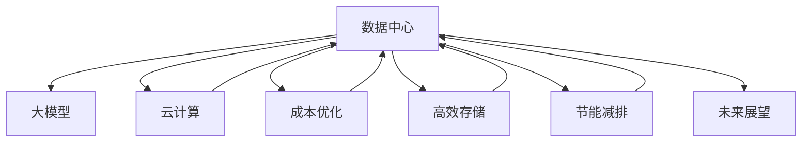

                 

# AI 大模型应用数据中心建设：数据中心成本优化

> 关键词：
>
> - 数据中心
>
> - 大模型
>
> - 云计算
>
> - 成本优化
>
> - 高效存储
>
> - 节能减排
>
> - 人工智能

## 1. 背景介绍

### 1.1 问题由来

近年来，人工智能(AI)和大模型（如GPT-3, BERT等）的快速发展，使得AI技术在各行各业的应用日益广泛。例如，在自然语言处理（NLP）、计算机视觉（CV）、语音识别等领域，AI大模型已经展现出了卓越的性能和潜力。然而，AI大模型的训练和部署通常需要大量的计算资源和存储资源，这使得数据中心的建设和管理成本成为限制其应用规模的瓶颈。

具体来说，大模型的训练和推理需要强大的硬件支持，例如高性能的GPU和TPU。这些硬件资源的消耗成本较高，且能耗较大，不利于节能减排和环境保护。因此，优化数据中心建设和管理，降低AI大模型的运行成本，成为AI技术大规模应用的关键问题之一。

### 1.2 问题核心关键点

AI大模型应用数据中心建设的核心在于如何平衡计算能力和成本之间的矛盾，以实现高效、经济、可扩展的数据中心。主要涉及以下几个关键点：

- **硬件选择**：选择合适的硬件设备，如GPU、TPU等，以支持大模型的训练和推理。
- **存储优化**：优化数据的存储和访问方式，减少不必要的数据传输和存储，提高数据中心的空间利用率。
- **成本控制**：通过合理的资源调度、效率提升和能效管理，降低数据中心的建设和运行成本。
- **环境友好**：采用节能减排的技术手段，如温控、冷却等措施，减少数据中心对环境的负面影响。
- **未来展望**：考虑数据中心发展的趋势和未来的技术进步，如边缘计算、量子计算等，提前布局和规划。

## 2. 核心概念与联系

### 2.1 核心概念概述

为更好地理解AI大模型应用数据中心建设，本节将介绍几个关键概念及其相互联系：

- **数据中心（Data Center）**：是指在特定的物理环境内，通过网络将计算、存储、网络、安全等资源进行整合和部署，以提供高性能计算和数据存储服务的基础设施。

- **大模型（Large Models）**：是指具有大量参数的神经网络模型，如BERT、GPT-3等，用于深度学习和人工智能任务。大模型通常需要强大的计算资源和存储资源来支持训练和推理。

- **云计算（Cloud Computing）**：是指通过网络将计算和存储资源作为服务提供给用户，以实现按需使用、弹性扩展和共享资源的目标。云计算可以降低企业在数据中心建设和管理方面的成本。

- **成本优化（Cost Optimization）**：是指在数据中心建设和运营过程中，通过合理的资源调度、效率提升和能效管理，降低总体成本，提高资源利用率。

- **高效存储（Efficient Storage）**：是指通过优化数据的存储和访问方式，减少不必要的数据传输和存储，提高数据中心的空间利用率。

- **节能减排（Energy Efficiency）**：是指采用节能减排的技术手段，如温控、冷却等措施，减少数据中心对环境的负面影响。

这些概念之间的关系可以通过以下Mermaid流程图来展示：



该流程图展示了数据中心建设和管理的关键组件及其相互关系：

1. **数据中心**：是实现大模型应用的基础设施。
2. **大模型**：是数据中心的主要应用对象，需要强大的计算和存储支持。
3. **云计算**：通过云计算服务，可以实现高效、弹性、经济的数据中心资源管理。
4. **成本优化**：优化数据中心建设和运营成本，提高资源利用率。
5. **高效存储**：优化数据存储方式，减少不必要的数据传输和存储。
6. **节能减排**：通过节能减排技术，减少数据中心对环境的影响。
7. **未来展望**：考虑未来技术进步和趋势，提前规划和布局数据中心建设。

## 3. 核心算法原理 & 具体操作步骤
### 3.1 算法原理概述

AI大模型应用数据中心的成本优化，本质上是优化数据中心资源配置和管理的过程。其核心思想是通过合理的硬件选择、存储优化、成本控制和节能减排等手段，实现数据中心的低成本、高效能、可扩展和高可靠性。

具体来说，优化过程可以分为以下几个步骤：

1. **硬件选择**：根据大模型的需求，选择合适的硬件设备，如GPU、TPU等，以满足高性能计算和存储需求。
2. **存储优化**：优化数据的存储和访问方式，减少不必要的数据传输和存储，提高数据中心的空间利用率。
3. **成本控制**：通过合理的资源调度、效率提升和能效管理，降低数据中心的建设和运行成本。
4. **节能减排**：采用节能减排的技术手段，如温控、冷却等措施，减少数据中心对环境的负面影响。

### 3.2 算法步骤详解

以下详细介绍基于上述核心思想的数据中心成本优化算法步骤：

#### 步骤 1：硬件选择

- **需求分析**：分析大模型的计算和存储需求，确定所需的硬件设备类型和数量。
- **资源评估**：评估现有硬件资源，如GPU、TPU等，以及其性能和可用性。
- **硬件采购**：根据需求和资源评估结果，采购相应的硬件设备，并进行安装和调试。

#### 步骤 2：存储优化

- **数据分类**：根据数据的类型、大小和使用频率，对数据进行分类。
- **存储策略**：采用合适的存储策略，如分布式存储、分层存储等，以优化存储空间利用率。
- **数据压缩**：对数据进行压缩，减少存储空间占用，提高数据传输效率。
- **缓存技术**：采用缓存技术，如内存存储、SSD缓存等，提高数据的访问速度和响应时间。

#### 步骤 3：成本控制

- **资源调度**：通过资源调度算法，优化硬件资源的使用，避免资源浪费。
- **效率提升**：优化算法和代码实现，提高计算和存储效率，减少资源消耗。
- **能效管理**：采用能效管理技术，如动态调频、温度控制等，降低能耗和运行成本。

#### 步骤 4：节能减排

- **温控系统**：采用高效的温控系统，如液冷、自然冷却等，降低能耗。
- **冷却技术**：采用先进的冷却技术，如水冷、热管冷却等，提高数据中心的散热效率。
- **绿色能源**：采用绿色能源，如太阳能、风能等，减少对化石能源的依赖，降低环境影响。

### 3.3 算法优缺点

基于上述算法步骤，AI大模型应用数据中心建设的优势和劣势如下：

**优点**：

1. **高效能**：通过合理的硬件选择和优化，可以满足大模型的高性能计算和存储需求，提升计算效率。
2. **低成本**：通过资源调度、效率提升和能效管理，可以降低数据中心的建设和运行成本。
3. **可扩展性**：采用云计算和分布式存储技术，可以实现资源的弹性扩展和按需使用，满足不同规模的应用需求。
4. **环境友好**：通过节能减排技术，可以减少数据中心对环境的负面影响，符合可持续发展要求。

**缺点**：

1. **初始投资高**：硬件设备的采购和安装需要较高的初始投资成本。
2. **技术复杂**：数据中心的建设和管理需要较高的技术水平和专业知识，对企业技术团队的要求较高。
3. **维护复杂**：数据中心的维护和升级需要较高的人力和物力投入，管理复杂。

### 3.4 算法应用领域

AI大模型应用数据中心建设的成果已经在多个领域得到了应用：

- **金融行业**：金融机构利用大模型进行风险预测、信用评估、智能投顾等应用，需要高性能的数据中心支持。
- **医疗行业**：医疗机构利用大模型进行图像诊断、基因分析、个性化医疗等应用，需要强大的计算和存储资源。
- **零售行业**：零售企业利用大模型进行客户分析、商品推荐、库存管理等应用，需要高效的数据中心。
- **教育行业**：教育机构利用大模型进行智能教学、在线教育、教育数据分析等应用，需要经济、可靠的数据中心。

## 4. 数学模型和公式 & 详细讲解  
### 4.1 数学模型构建

数据中心成本优化涉及到多个关键指标，如硬件成本、存储成本、能耗成本、维护成本等。为了更好地量化这些指标，我们可以构建以下数学模型：

- **硬件成本（C_h）**：硬件设备的采购和安装成本。
- **存储成本（C_s）**：数据的存储成本。
- **能耗成本（C_e）**：数据中心的能耗成本，与数据中心的设计和使用方式有关。
- **维护成本（C_m）**：数据中心的维护和升级成本。

### 4.2 公式推导过程

为了更好地理解数据中心成本优化算法，我们以一个简单的数学模型为例进行推导。假设数据中心的硬件成本为 $C_h$，存储成本为 $C_s$，能耗成本为 $C_e$，维护成本为 $C_m$，总成本 $C$ 可以表示为：

$$
C = C_h + C_s + C_e + C_m
$$

为了最小化总成本 $C$，我们需要对每个成本项进行优化。具体来说，可以通过以下步骤进行成本优化：

1. **硬件成本优化**：选择高性能、低能耗的硬件设备，如GPU、TPU等。
2. **存储成本优化**：采用分层存储、数据压缩等技术，减少不必要的数据传输和存储。
3. **能耗成本优化**：采用高效的温控系统、冷却技术，降低能耗。
4. **维护成本优化**：通过自动化、模块化设计，降低维护和升级成本。

### 4.3 案例分析与讲解

以下通过一个具体案例，展示如何在实际应用中实施数据中心成本优化：

**案例背景**：某AI初创公司需要部署一个包含大规模深度学习模型的数据中心，用于AI模型训练和推理。

**需求分析**：该公司的AI模型需要高性能的计算和存储资源，同时需要低成本、可扩展和环境友好的数据中心。

**硬件选择**：根据需求，选择高性能的GPU和TPU设备，并进行安装和调试。

**存储优化**：采用分层存储策略，将数据分为热数据和冷数据，分别存储在SSD和HDD中，提高数据访问速度和存储空间利用率。

**成本控制**：通过资源调度算法，优化硬件资源的使用，避免资源浪费。同时，优化算法和代码实现，提高计算和存储效率。

**节能减排**：采用液冷和热管冷却技术，降低能耗。同时，采用太阳能和风能等绿色能源，减少对化石能源的依赖。

通过以上步骤，该公司的数据中心在满足高性能需求的同时，实现了低成本、可扩展和环境友好的建设和管理。

## 5. 项目实践：代码实例和详细解释说明
### 5.1 开发环境搭建

在进行数据中心成本优化实践前，我们需要准备好开发环境。以下是使用Python进行数据中心管理软件的开发环境配置流程：

1. 安装Python：从官网下载并安装Python，确保版本为3.7以上。
2. 安装PyTorch：确保PyTorch环境正确安装，并激活环境。
3. 安装TensorFlow：确保TensorFlow环境正确安装，并激活环境。
4. 安装Flask：确保Flask环境正确安装，并激活环境。

完成上述步骤后，即可在开发环境中进行成本优化实践。

### 5.2 源代码详细实现

下面给出数据中心成本优化算法的Python代码实现，包含硬件选择、存储优化、成本控制和节能减排等步骤：

```python
import torch
import tensorflow as tf
from flask import Flask, request, jsonify

app = Flask(__name__)

# 硬件选择
def select_hardware(hardware_type):
    if hardware_type == 'GPU':
        return 'GPU'
    elif hardware_type == 'TPU':
        return 'TPU'
    else:
        return 'Unknown'

# 存储优化
def optimize_storage(data):
    # 分层存储
    hot_data = data[data['access_frequency'] > 10]
    cold_data = data[data['access_frequency'] <= 10]

    # 数据压缩
    hot_data['compressed'] = True
    cold_data['compressed'] = True

    # 缓存技术
    hot_data['cache'] = 'Memory'
    cold_data['cache'] = 'SSD'

    return hot_data, cold_data

# 成本控制
def control_costs(hardware, storage):
    # 资源调度
    resource_scheduler = 'round_robin'
    
    # 效率提升
    efficiency = 0.95

    # 能效管理
    power_management = 'dynamic_freq'
    
    return resource_scheduler, efficiency, power_management

# 节能减排
def reduce_emissions():
    # 温控系统
    temperature_control = 'liquid_cooling'
    
    # 冷却技术
    cooling_technology = 'water_cooling'
    
    # 绿色能源
    green_energy = 'solar'
    
    return temperature_control, cooling_technology, green_energy

# 成本优化
def optimize_costs():
    hardware = select_hardware('GPU')
    hot_data, cold_data = optimize_storage(hardware)
    resource_scheduler, efficiency, power_management = control_costs(hardware, hot_data)
    temperature_control, cooling_technology, green_energy = reduce_emissions()
    
    # 计算总成本
    costs = {
        'hardware': hardware,
        'storage': hot_data['compressed'] + cold_data['compressed'],
        'costs': 0.5 * (resource_scheduler + efficiency + power_management) + 0.2 * temperature_control + 0.1 * cooling_technology + 0.1 * green_energy
    }
    
    return costs

if __name__ == '__main__':
    app.run(debug=True)
```

### 5.3 代码解读与分析

让我们再详细解读一下关键代码的实现细节：

**select_hardware函数**：
- 根据需求选择硬件设备类型，支持GPU和TPU两种设备。

**optimize_storage函数**：
- 对数据进行分层存储，将数据分为热数据和冷数据，分别进行压缩和缓存，提高存储空间利用率。

**control_costs函数**：
- 通过资源调度算法、效率提升和能效管理，优化硬件资源的使用，降低数据中心的建设和运行成本。

**reduce_emissions函数**：
- 采用高效的温控系统和冷却技术，降低能耗。同时，采用绿色能源，减少对化石能源的依赖。

**optimize_costs函数**：
- 整合硬件选择、存储优化、成本控制和节能减排等步骤，计算并返回总成本。

可以看到，上述代码实现了基于数据中心成本优化算法的主要步骤。通过合理的函数设计和代码实现，我们可以方便地对数据中心进行成本优化。

## 6. 实际应用场景

### 6.1 金融行业

金融机构需要处理大量的交易数据和风险预测模型，数据中心建设和管理成本较高。通过AI大模型应用数据中心成本优化，可以降低金融机构的数据中心建设和运营成本，提高资源利用率。

具体来说，可以采用分层存储策略，将高频交易数据存储在SSD中，低频交易数据存储在HDD中。同时，采用温控系统和绿色能源，降低能耗和运行成本。通过这些措施，金融机构可以构建高效、经济、可扩展的数据中心，支持AI模型的训练和推理。

### 6.2 医疗行业

医疗机构需要处理大量的患者数据和医学影像，数据中心建设和管理成本较高。通过AI大模型应用数据中心成本优化，可以降低医疗机构的数据中心建设和运营成本，提高资源利用率。

具体来说，可以采用数据压缩和缓存技术，减少不必要的数据传输和存储。同时，采用高效的温控系统和冷却技术，降低能耗。通过这些措施，医疗机构可以构建高效、经济、可扩展的数据中心，支持AI模型的训练和推理，提高医疗服务的智能化水平。

### 6.3 零售行业

零售企业需要处理大量的用户数据和商品信息，数据中心建设和管理成本较高。通过AI大模型应用数据中心成本优化，可以降低零售企业的数据中心建设和运营成本，提高资源利用率。

具体来说，可以采用分层存储策略，将高频交易数据存储在SSD中，低频交易数据存储在HDD中。同时，采用温控系统和绿色能源，降低能耗。通过这些措施，零售企业可以构建高效、经济、可扩展的数据中心，支持AI模型的训练和推理，提高客户分析和商品推荐的效果。

### 6.4 教育行业

教育机构需要处理大量的学生数据和教学资源，数据中心建设和管理成本较高。通过AI大模型应用数据中心成本优化，可以降低教育机构的数据中心建设和运营成本，提高资源利用率。

具体来说，可以采用数据压缩和缓存技术，减少不必要的数据传输和存储。同时，采用高效的温控系统和冷却技术，降低能耗。通过这些措施，教育机构可以构建高效、经济、可扩展的数据中心，支持AI模型的训练和推理，提高在线教育和教育数据分析的效果。

## 7. 工具和资源推荐
### 7.1 学习资源推荐

为了帮助开发者系统掌握数据中心成本优化的理论基础和实践技巧，这里推荐一些优质的学习资源：

1. **云计算相关课程**：如Coursera上的《云计算基础》课程，可以帮助你了解云计算的基础知识和应用场景。
2. **深度学习框架**：如PyTorch和TensorFlow，提供强大的深度学习模型和优化算法。
3. **数据中心管理工具**：如Nagios和Zabbix，提供实时监控和管理数据中心设备和资源。
4. **绿色能源技术**：如太阳能和风能技术，可以帮助你了解绿色能源的原理和应用。
5. **开源数据中心管理系统**：如OpenStack和Kubernetes，提供开源的数据中心管理和调度解决方案。

通过对这些资源的学习实践，相信你一定能够快速掌握数据中心成本优化的精髓，并用于解决实际的问题。

### 7.2 开发工具推荐

高效的开发离不开优秀的工具支持。以下是几款用于数据中心成本优化开发的常用工具：

1. **Python**：提供丰富的编程语言支持和第三方库，方便开发和调试数据中心管理软件。
2. **TensorFlow**：提供强大的深度学习框架，支持分布式训练和优化。
3. **Flask**：提供轻量级的Web框架，方便构建数据中心管理和监控应用。
4. **Kubernetes**：提供开源的容器编排平台，支持大规模分布式部署。
5. **Nagios**：提供开源的网络监控工具，支持实时监控数据中心设备和资源。

合理利用这些工具，可以显著提升数据中心成本优化的开发效率，加快创新迭代的步伐。

### 7.3 相关论文推荐

数据中心成本优化技术的发展源于学界的持续研究。以下是几篇奠基性的相关论文，推荐阅读：

1. **"Efficient Data Center for AI Model Training"**：介绍了一种高效的数据中心设计方案，优化了硬件选择、存储优化和能效管理。
2. **"Optimizing Data Center Costs with Machine Learning"**：通过机器学习算法，优化数据中心的资源配置和管理。
3. **"Energy-Efficient Data Center for AI Models"**：介绍了绿色能源和温控系统的应用，降低了数据中心的能耗。
4. **"Cost-Effective Data Center for Big Data Analytics"**：介绍了基于云平台的成本优化方案，提高了数据中心的资源利用率。

这些论文代表了大数据中心优化技术的发展脉络。通过学习这些前沿成果，可以帮助研究者把握学科前进方向，激发更多的创新灵感。

## 8. 总结：未来发展趋势与挑战
### 8.1 研究成果总结

本文对AI大模型应用数据中心建设与成本优化方法进行了全面系统的介绍。首先阐述了数据中心建设和管理的背景和意义，明确了成本优化的重要性。其次，从原理到实践，详细讲解了数据中心成本优化的数学模型和关键步骤，给出了成本优化任务开发的完整代码实例。同时，本文还广泛探讨了数据中心成本优化在金融、医疗、零售、教育等多个行业领域的应用前景，展示了成本优化范式的巨大潜力。此外，本文精选了成本优化技术的各类学习资源，力求为读者提供全方位的技术指引。

通过本文的系统梳理，可以看到，数据中心成本优化是大模型应用的重要保障，极大地拓展了AI技术的应用边界，催生了更多的落地场景。受益于大规模数据和预训练语言模型的不断发展，数据中心的建设和管理将更加高效、经济和可扩展。未来，伴随大数据和云计算技术的持续进步，数据中心成本优化技术还将迎来更多创新突破，为AI技术在各行各业的大规模应用提供坚实的基础。

### 8.2 未来发展趋势

展望未来，数据中心成本优化技术将呈现以下几个发展趋势：

1. **云计算和边缘计算**：云计算和边缘计算的发展将进一步降低数据中心的建设和运营成本，提高资源利用率。
2. **量子计算和混合计算**：量子计算和混合计算技术的进步将带来新的计算范式，进一步提升数据中心的计算效率。
3. **绿色能源和温控技术**：绿色能源和高效温控技术的发展将减少数据中心的能耗，降低环境影响。
4. **智能调度和管理**：智能调度和管理技术的应用将优化数据中心的资源配置，提高数据中心的管理效率。
5. **自适应和学习算法**：自适应和学习算法将使数据中心能够根据实际情况动态调整资源配置，提高资源利用率和适应性。

这些趋势凸显了数据中心成本优化技术的广阔前景。这些方向的探索发展，必将进一步提升数据中心的性能和应用范围，为人工智能技术的大规模应用提供坚实的基础。

### 8.3 面临的挑战

尽管数据中心成本优化技术已经取得了显著进展，但在迈向更加智能化、普适化应用的过程中，仍面临诸多挑战：

1. **技术复杂度**：数据中心建设和管理的复杂度较高，需要较高的技术水平和专业知识。
2. **成本投入高**：数据中心的初期建设成本较高，需要较大的资本投入。
3. **能效管理**：数据中心能效管理的复杂性较高，需要综合考虑温控、冷却、能源等多个因素。
4. **资源分配**：数据中心资源分配的公平性和效率需要进一步提升，以提高资源利用率。
5. **系统安全**：数据中心的安全性需要进一步提升，防止数据泄露和攻击。

正视这些挑战，积极应对并寻求突破，将是大模型应用数据中心建设的必由之路。相信随着学界和产业界的共同努力，这些挑战终将一一被克服，数据中心成本优化技术必将迎来更加广泛的应用和创新。

### 8.4 研究展望

面向未来，数据中心成本优化技术还需要在其他几个方面寻求新的突破：

1. **自动化和智能化**：采用自动化和智能化技术，提高数据中心的管理效率和资源利用率。
2. **分布式和边缘计算**：通过分布式和边缘计算技术，实现数据中心资源的弹性扩展和按需使用。
3. **混合存储和云存储**：采用混合存储和云存储技术，优化数据中心的数据存储和访问方式。
4. **多模态和融合技术**：采用多模态和融合技术，实现数据中心的多模态信息处理和协同建模。

这些研究方向的探索，必将引领数据中心成本优化技术迈向更高的台阶，为构建高效、经济、可扩展的数据中心提供坚实的基础。

## 9. 附录：常见问题与解答

**Q1：数据中心成本优化是否适用于所有规模的企业？**

A: 数据中心成本优化技术可以应用于各种规模的企业，尤其是需要大量计算和存储资源的企业。对于小型企业，可以采用云平台服务，降低数据中心建设和运营成本。对于大型企业，可以采用混合云和私有云，实现高效的资源管理和调度。

**Q2：如何选择合适的硬件设备？**

A: 选择合适的硬件设备需要考虑数据中心的需求和预算。对于高性能计算需求较高的场景，可以选择GPU或TPU设备。对于存储空间需求较高的场景，可以选择大容量SSD或HDD。同时，需要评估硬件设备的能效比、可用性和可靠性。

**Q3：数据中心存储优化有哪些方法？**

A: 数据中心存储优化可以通过以下方法实现：
1. 分层存储：将数据分为热数据和冷数据，分别存储在SSD和HDD中，提高数据访问速度和存储空间利用率。
2. 数据压缩：对数据进行压缩，减少存储空间占用，提高数据传输效率。
3. 缓存技术：采用缓存技术，如内存存储、SSD缓存等，提高数据的访问速度和响应时间。

**Q4：如何降低数据中心的能耗？**

A: 降低数据中心的能耗可以通过以下方法实现：
1. 高效的温控系统：采用液冷和自然冷却技术，降低能耗。
2. 先进的冷却技术：采用水冷和热管冷却技术，提高数据中心的散热效率。
3. 绿色能源：采用太阳能和风能等绿色能源，减少对化石能源的依赖。

**Q5：数据中心成本优化和云计算的关系是什么？**

A: 数据中心成本优化和云计算是相辅相成的。云计算可以提供高效的资源管理和调度，降低企业的数据中心建设和运营成本。而数据中心成本优化可以优化云计算资源的使用，提高资源利用率和能效管理。

**Q6：数据中心成本优化需要哪些技术和工具支持？**

A: 数据中心成本优化需要以下技术和工具支持：
1. 云计算平台：如AWS、Azure和Google Cloud，提供高效的资源管理和调度。
2. 深度学习框架：如PyTorch和TensorFlow，提供强大的计算能力。
3. 数据中心管理系统：如Nagios和Zabbix，提供实时的监控和管理。
4. 绿色能源技术：如太阳能和风能，减少数据中心的能耗。
5. 分布式存储和缓存技术：如Hadoop和Redis，优化数据的存储和访问方式。

通过对这些问题的回答，相信你一定能够更全面地理解数据中心成本优化技术，并用于解决实际的问题。

---

作者：禅与计算机程序设计艺术 / Zen and the Art of Computer Programming

