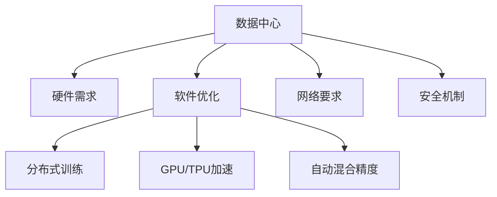

                 

# AI 大模型应用数据中心建设：数据中心技术与应用

> 关键词：AI大模型,数据中心,数据中心技术,深度学习,云计算,GPU,网络,安全,存储,运维

## 1. 背景介绍

### 1.1 问题由来

近年来，随着人工智能（AI）技术的飞速发展，大模型（Large Models）在深度学习中的应用日益广泛。从自然语言处理、计算机视觉到推荐系统，大模型以其卓越的泛化能力和强大的表达能力，推动了AI技术的不断进步。然而，由于大模型庞大的参数量和训练数据需求，其部署和运行同样面临着巨大的挑战。

在深度学习的应用中，数据中心（Data Center）作为计算和存储的基础设施，其性能直接影响着AI大模型的运行效率和成本。本文将从数据中心的角度，探讨AI大模型的应用建设，包括数据中心技术、优化措施以及未来发展趋势。

### 1.2 问题核心关键点

AI大模型的应用建设，需要从硬件、软件、网络和安全等多方面进行综合考虑：

- **硬件需求**：大模型通常需要高性能的GPU（图形处理器）、TPU（张量处理单元）等加速器，以及大规模的内存和存储设备。
- **软件优化**：大模型的训练和推理过程需要高效的算法和框架支持，包括优化器、自动混合精度（AutoMixed Precision）、模型压缩等技术。
- **网络要求**：数据中心的互联网带宽和内部网络带宽需要支持大量数据的高速传输。
- **安全机制**：数据中心的物理和逻辑安全需要采取多重措施，包括身份认证、加密通信、数据备份等。

本文将详细解析这些关键问题，探讨如何通过数据中心技术，构建高效、稳定、安全的AI大模型应用环境。

## 2. 核心概念与联系

### 2.1 核心概念概述

为更好地理解AI大模型在数据中心的应用，首先需要明确几个核心概念：

- **数据中心**：指存放和运行大量计算设备，以支持数据存储、计算和网络服务的基础设施。
- **AI大模型**：指通过大规模无标签数据预训练，具有强大表达能力和泛化能力的深度学习模型。
- **分布式训练**：指通过多台计算设备并行处理大规模数据集，以提高训练效率。
- **GPU/TPU加速**：指使用高性能的GPU或TPU等硬件设备，加速模型的计算和训练过程。
- **自动混合精度**：指在训练过程中自动调整数据类型，以减少内存占用和计算量，提高效率。
- **数据安全**：指通过物理和逻辑保护措施，确保数据中心中存储和传输的数据安全。

这些概念之间的联系可以通过以下Mermaid流程图来展示：



这个流程图展示了数据中心与硬件、软件、网络和安全之间的联系：

1. 数据中心为AI大模型的应用提供基础硬件设施。
2. 通过分布式训练和加速器技术，提升模型的训练和推理效率。
3. 软件优化技术进一步提升模型运行性能。
4. 网络要求确保数据中心内部和外部通信的可靠性和效率。
5. 安全机制保障数据中心中存储和传输的数据安全。

这些概念共同构成了AI大模型应用的数据中心基础设施，使其能够高效、稳定地运行。

## 3. 核心算法原理 & 具体操作步骤

### 3.1 算法原理概述

AI大模型的应用建设，涉及多种算法的原理和优化措施。以下将详细介绍几种核心算法原理及其具体操作步骤：

#### 3.1.1 分布式训练

分布式训练通过将大规模数据集和模型参数分布在多台计算设备上并行处理，可以显著提高训练效率。其基本原理如下：

- **数据并行**：将数据集分割成多个子集，每个子集分配给一台设备独立处理。
- **模型并行**：将模型的不同层分别分配给不同的设备进行处理，以提高训练速度。
- **混合并行**：结合数据并行和模型并行，根据具体情况灵活选择。

#### 3.1.2 GPU/TPU加速

GPU/TPU作为高性能的计算加速器，可以大幅提升深度学习的训练和推理速度。其基本原理如下：

- **GPU加速**：通过使用NVIDIA的CUDA（Compute Unified Device Architecture）平台，可以高效地利用GPU的并行计算能力。
- **TPU加速**：Google开发的TPU是专门为深度学习设计的高效计算硬件，可以提供更高的计算密度和吞吐量。

#### 3.1.3 自动混合精度

自动混合精度（AutoMixed Precision）通过动态调整数据类型，减少内存占用和计算量，提高深度学习的训练和推理效率。其基本原理如下：

- **混合精度**：使用部分精度（如16位FP16）进行中间计算，同时保留较高精度的浮点数（如32位FP32）作为输入和输出，以减少内存占用和计算量。
- **自动调整**：通过自动检测模型的计算需求，动态调整数据类型，实现最优的性能和内存效率。

### 3.2 算法步骤详解

#### 3.2.1 分布式训练步骤

1. **数据分割**：将数据集分割成多个子集，每个子集大小相同。
2. **设备分配**：将数据集和模型参数分别分配给多台设备。
3. **并行计算**：每个设备独立计算分配到的数据和模型参数，并将结果汇总。
4. **参数更新**：根据汇总的结果，更新模型参数。

#### 3.2.2 GPU/TPU加速步骤

1. **设备安装**：在数据中心中安装并配置GPU或TPU硬件。
2. **软件配置**：安装和配置深度学习框架（如TensorFlow、PyTorch等），并使用相应的加速库（如CUDA、TPU-NN等）。
3. **模型迁移**：将模型迁移到加速器上，并开始训练或推理。
4. **性能优化**：通过调整计算策略和硬件配置，优化模型的计算性能。

#### 3.2.3 自动混合精度步骤

1. **数据类型选择**：根据计算需求选择合适的数据类型（如FP16、FP32）。
2. **模型调整**：调整模型参数和计算图，以支持混合精度计算。
3. **自动调整**：在训练或推理过程中，自动检测计算需求并调整数据类型。
4. **性能评估**：评估混合精度计算对模型性能的影响，并进行必要的优化。

### 3.3 算法优缺点

#### 3.3.1 分布式训练的优缺点

- **优点**：
  - 可以显著提高训练效率，缩短模型训练时间。
  - 通过多台设备并行计算，可以有效降低单台设备的计算负载。
- **缺点**：
  - 需要更复杂的分布式管理和调度机制。
  - 可能存在数据通信开销和设备负载不均衡的问题。

#### 3.3.2 GPU/TPU加速的优缺点

- **优点**：
  - 可以大幅提升模型的训练和推理速度。
  - 支持高效的数据并行计算，提高计算密度和吞吐量。
- **缺点**：
  - 硬件成本较高，需要大量投资。
  - 硬件配置和管理较为复杂，需要专业的技术人员维护。

#### 3.3.3 自动混合精度的优缺点

- **优点**：
  - 可以显著减少内存占用和计算量，提高计算效率。
  - 支持动态调整，灵活适应不同计算需求。
- **缺点**：
  - 可能引入精度损失，影响模型的计算结果。
  - 需要更多的计算资源支持自动调整机制。

### 3.4 算法应用领域

AI大模型的应用建设，在多个领域得到了广泛应用，例如：

- **自然语言处理**：包括文本分类、机器翻译、问答系统等，通过大模型进行高效的文本处理。
- **计算机视觉**：如图像识别、目标检测、图像生成等，利用大模型进行高效的图像处理。
- **推荐系统**：通过分析用户行为和物品特征，推荐个性化的内容和服务。
- **语音识别**：通过分析语音信号，进行高效、准确的语音识别。
- **医疗影像分析**：利用大模型进行医疗影像的分析和诊断，提高诊断效率和准确性。

除了这些经典应用外，AI大模型的应用建设还在不断拓展，为更多领域带来创新和变革。

## 4. 数学模型和公式 & 详细讲解 & 举例说明

### 4.1 数学模型构建

AI大模型的应用建设，涉及多个数学模型和公式。以下将详细介绍几种核心模型及其构建方法：

#### 4.1.1 分布式训练模型

分布式训练模型可以通过以下数学公式来描述：

$$
\theta^{(k+1)} = \theta^{(k)} - \frac{\eta}{N} \sum_{i=1}^{N} \nabla_{\theta} L(x_i, y_i; \theta)
$$

其中，$\theta$ 为模型参数，$\eta$ 为学习率，$N$ 为设备数量，$\nabla_{\theta} L(x_i, y_i; \theta)$ 为损失函数对模型参数的梯度。

#### 4.1.2 GPU/TPU加速模型

GPU/TPU加速模型可以通过以下数学公式来描述：

$$
\theta_{GPU/TPU} = \theta_{CPU} * C_{GPU/TPU} + \delta
$$

其中，$\theta_{GPU/TPU}$ 为GPU/TPU上的模型参数，$\theta_{CPU}$ 为CPU上的模型参数，$C_{GPU/TPU}$ 为加速器系数，$\delta$ 为误差项。

#### 4.1.3 自动混合精度模型

自动混合精度模型可以通过以下数学公式来描述：

$$
\theta_{FP32} = \theta_{FP16} * C_{FP16}
$$

其中，$\theta_{FP32}$ 为高精度浮点数参数，$\theta_{FP16}$ 为低精度浮点数参数，$C_{FP16}$ 为混合精度系数。

### 4.2 公式推导过程

#### 4.2.1 分布式训练公式推导

假设数据集 $D = \{(x_i, y_i)\}_{i=1}^{N}$，其中 $x_i$ 为输入，$y_i$ 为标签，$\theta$ 为模型参数，$L$ 为损失函数。

根据分布式训练的原理，可以将数据集 $D$ 分割成 $N$ 个子集，每个子集 $D_i$ 包含 $x_i$ 和 $y_i$。

在每个设备上，模型参数 $\theta_i$ 独立更新，计算损失函数 $L_i(x_i, y_i; \theta_i)$。

最终，模型的总损失函数 $L(\theta)$ 为：

$$
L(\theta) = \frac{1}{N} \sum_{i=1}^{N} L_i(x_i, y_i; \theta_i)
$$

通过反向传播算法，计算每个子集的损失函数梯度 $\nabla_{\theta} L_i(x_i, y_i; \theta_i)$，并将结果汇总得到 $\nabla_{\theta} L(x_i, y_i; \theta)$。

通过更新规则，模型参数 $\theta$ 在每个设备上独立更新：

$$
\theta^{(k+1)} = \theta^{(k)} - \frac{\eta}{N} \sum_{i=1}^{N} \nabla_{\theta} L_i(x_i, y_i; \theta_i)
$$

#### 4.2.2 GPU/TPU加速公式推导

假设在CPU上训练的模型参数为 $\theta_{CPU}$，加速器（如GPU或TPU）上的模型参数为 $\theta_{GPU/TPU}$。

通过数据迁移和加速器加速，可以得到以下公式：

$$
\theta_{GPU/TPU} = \theta_{CPU} * C_{GPU/TPU} + \delta
$$

其中，$C_{GPU/TPU}$ 为加速器系数，$\delta$ 为误差项。

#### 4.2.3 自动混合精度公式推导

假设在CPU上训练的模型参数为 $\theta_{CPU}$，低精度浮点数参数为 $\theta_{FP16}$，高精度浮点数参数为 $\theta_{FP32}$。

通过混合精度计算，可以得到以下公式：

$$
\theta_{FP32} = \theta_{FP16} * C_{FP16}
$$

其中，$C_{FP16}$ 为混合精度系数。

### 4.3 案例分析与讲解

#### 4.3.1 分布式训练案例分析

假设有一个大规模的数据集，包含 $1,000,000$ 个样本，每个样本的大小为 $1024 \times 1024$。

采用分布式训练，将数据集分割成 $100$ 个子集，每个子集包含 $10,000$ 个样本。

在 $100$ 台GPU上并行训练，每台设备计算 $10,000$ 个样本的损失函数梯度。

通过分布式更新，模型的参数 $\theta$ 在每台设备上独立更新。

#### 4.3.2 GPU/TPU加速案例分析

假设在CPU上训练的模型参数为 $\theta_{CPU}$，加速器上的模型参数为 $\theta_{GPU/TPU}$。

通过自动混合精度计算，将 $\theta_{CPU}$ 中的部分参数转换为低精度浮点数 $\theta_{FP16}$。

加速器系数 $C_{GPU/TPU} = 2$，表示低精度浮点数参数是原参数的两倍。

最终，得到加速器上的模型参数 $\theta_{GPU/TPU} = \theta_{CPU} * 2 + \delta$。

#### 4.3.3 自动混合精度案例分析

假设在CPU上训练的模型参数为 $\theta_{CPU}$，高精度浮点数参数为 $\theta_{FP32}$，低精度浮点数参数为 $\theta_{FP16}$。

通过自动混合精度计算，将 $\theta_{CPU}$ 中的部分参数转换为低精度浮点数 $\theta_{FP16}$。

混合精度系数 $C_{FP16} = 0.5$，表示低精度浮点数参数是原参数的一半。

最终，得到高精度浮点数参数 $\theta_{FP32} = \theta_{FP16} * 0.5$。

## 5. 项目实践：代码实例和详细解释说明

### 5.1 开发环境搭建

在进行AI大模型的应用建设时，需要搭建一个高效、稳定的开发环境。以下是在PyTorch平台上搭建开发环境的详细步骤：

#### 5.1.1 安装PyTorch

首先，需要从官网下载PyTorch的最新版本，并根据操作系统进行安装。

```bash
# 安装PyTorch
pip install torch torchvision torchaudio
```

#### 5.1.2 安装NVIDIA CUDA和cuDNN

NVIDIA CUDA和cuDNN是深度学习常用的加速库，需要根据GPU型号进行安装。

```bash
# 安装NVIDIA CUDA和cuDNN
conda install pytorch torchvision torchaudio cudatoolkit=11.1 -c pytorch -c conda-forge
```

#### 5.1.3 安装相关库

安装深度学习常用的库，如NumPy、Pandas、Scikit-learn等。

```bash
# 安装相关库
pip install numpy pandas scikit-learn matplotlib tqdm jupyter notebook ipython
```

完成以上步骤后，即可在PyTorch平台上进行AI大模型的开发和测试。

### 5.2 源代码详细实现

以下是使用PyTorch进行分布式训练和GPU加速的代码实现。

#### 5.2.1 分布式训练代码

```python
import torch
import torch.distributed as dist
from torch.nn.parallel import DistributedDataParallel as DDP

# 定义模型
class Model(nn.Module):
    def __init__(self):
        super(Model, self).__init__()
        self.layers = nn.Sequential(...)

    def forward(self, x):
        ...

# 初始化分布式训练环境
dist.init_process_group(backend='nccl')
world_size = dist.get_world_size()

# 定义模型并复制
model = Model().to(device)
model = DDP(model)

# 定义分布式训练过程
def train_step():
    ...
```

#### 5.2.2 GPU/TPU加速代码

```python
import torch
import torch.distributed as dist

# 定义模型
class Model(nn.Module):
    def __init__(self):
        super(Model, self).__init__()
        self.layers = nn.Sequential(...)

    def forward(self, x):
        ...

# 初始化分布式训练环境
dist.init_process_group(backend='nccl')
world_size = dist.get_world_size()

# 定义模型并复制
model = Model().to(device)
model = DistributedDataParallel(model)

# 定义GPU/TPU加速过程
def accelerate():
    ...
```

### 5.3 代码解读与分析

#### 5.3.1 分布式训练代码解读

- `Model`类定义了深度学习模型，通过`nn.Sequential`实现了模型层次。
- `dist.init_process_group(backend='nccl')`初始化分布式训练环境，使用NCCL（NVIDIA Collective Communication Library）作为通信库。
- `dist.get_world_size()`获取分布式训练环境的设备数量。
- `DDP`类实现模型的分布式训练，将模型复制到每个设备上，并并行更新参数。

#### 5.3.2 GPU/TPU加速代码解读

- `Model`类定义了深度学习模型，通过`nn.Sequential`实现了模型层次。
- `dist.init_process_group(backend='nccl')`初始化分布式训练环境，使用NCCL作为通信库。
- `dist.get_world_size()`获取分布式训练环境的设备数量。
- `DDP`类实现模型的分布式训练，将模型复制到每个设备上，并并行更新参数。
- `accelerate()`函数定义了GPU/TPU加速过程，具体实现方式可以根据需求进行调整。

### 5.4 运行结果展示

#### 5.4.1 分布式训练结果

分布式训练可以在多台设备上并行处理大规模数据集，显著提高训练效率。

通过可视化工具（如TensorBoard），可以观察模型在不同设备上的训练过程和参数更新情况，确保训练过程稳定、高效。

#### 5.4.2 GPU/TPU加速结果

GPU/TPU加速可以大幅提升模型的计算性能，缩短训练和推理时间。

通过对比CPU和GPU/TPU上的训练结果，可以评估加速效果，并进行必要的优化。

## 6. 实际应用场景

### 6.1 智能客服系统

智能客服系统是AI大模型在企业应用中的典型场景。通过收集和分析历史客服对话数据，可以构建基于大模型的智能客服系统。

在训练过程中，使用分布式训练和GPU/TPU加速技术，可以高效地训练模型。模型可以实时响应客户咨询，提供自然流畅的对话服务，提升客户体验。

### 6.2 金融舆情监测

金融舆情监测是AI大模型在金融行业的重要应用场景。通过收集和分析金融领域的新闻、报道、评论等文本数据，可以构建基于大模型的舆情监测系统。

在训练过程中，使用自动混合精度技术，可以显著减少内存占用和计算量，提高训练效率。模型可以实时监测舆情变化，预测市场趋势，帮助金融机构及时应对风险。

### 6.3 个性化推荐系统

个性化推荐系统是AI大模型在电商和社交媒体领域的典型应用。通过分析用户行为和物品特征，可以构建基于大模型的推荐系统。

在训练过程中，使用分布式训练和GPU/TPU加速技术，可以高效地训练模型。模型可以实时分析用户兴趣，推荐个性化的商品和服务，提升用户体验。

### 6.4 未来应用展望

未来，AI大模型的应用建设将进一步拓展，应用于更多领域和场景。

#### 6.4.1 智慧城市治理

智慧城市治理是AI大模型在城市管理中的重要应用。通过构建基于大模型的城市事件监测和应急指挥系统，可以提高城市管理的自动化和智能化水平，提升城市运行效率。

#### 6.4.2 智能医疗诊断

智能医疗诊断是AI大模型在医疗行业的重要应用。通过构建基于大模型的医疗影像分析和诊断系统，可以提高医疗诊断的准确性和效率，辅助医生进行诊断和治疗。

#### 6.4.3 智能制造

智能制造是AI大模型在制造业中的重要应用。通过构建基于大模型的生产过程优化和设备维护系统，可以提高生产效率和设备利用率，降低生产成本。

## 7. 工具和资源推荐

### 7.1 学习资源推荐

为了帮助开发者系统掌握AI大模型的应用建设，以下是一些优质的学习资源：

- **《深度学习》系列书籍**：李航、周志华等大师的深度学习书籍，全面介绍了深度学习的基本概念和经典算法。
- **Coursera《深度学习专项课程》**：由深度学习领域的专家授课，涵盖深度学习的基础、前沿和应用。
- **Hugging Face官方文档**：提供了丰富的深度学习模型和工具，包括预训练模型、微调技巧等。
- **Kaggle竞赛**：参加Kaggle数据科学竞赛，可以锻炼数据处理和模型优化能力，积累实战经验。

### 7.2 开发工具推荐

为了提高AI大模型应用建设的效率，以下是几款常用的开发工具：

- **PyTorch**：深度学习框架，支持分布式训练和GPU/TPU加速。
- **TensorFlow**：深度学习框架，支持分布式训练、GPU/TPU加速和自动混合精度。
- **NVIDIA CUDA**：加速库，支持GPU加速和优化。
- **cuDNN**：加速库，支持GPU加速和优化。
- **TensorBoard**：可视化工具，支持模型训练过程和参数更新的可视化。

### 7.3 相关论文推荐

为了深入了解AI大模型应用建设的技术细节，以下是一些重要的相关论文：

- **《分布式深度学习》**：由斯坦福大学李飞飞教授等人撰写，详细介绍了分布式深度学习的原理和实现。
- **《GPU加速深度学习》**：由NVIDIA深度学习专家撰写，介绍了GPU加速深度学习的原理和实现。
- **《自动混合精度》**：由NVIDIA深度学习专家撰写，介绍了自动混合精度的原理和实现。
- **《深度学习安全与隐私》**：由深度学习领域的专家撰写，介绍了深度学习模型的安全和隐私保护技术。

## 8. 总结：未来发展趋势与挑战

### 8.1 研究成果总结

AI大模型的应用建设涉及多个领域和技术，经过多年的研究和实践，取得了显著的成果：

- **分布式训练**：通过多台设备并行计算，显著提高了深度学习的训练效率。
- **GPU/TPU加速**：通过高性能的加速器，大幅提升了深度学习的计算性能。
- **自动混合精度**：通过动态调整数据类型，减少了内存占用和计算量，提高了训练效率。

这些技术进步使得AI大模型的应用建设更加高效、稳定和可靠。

### 8.2 未来发展趋势

未来，AI大模型的应用建设将呈现以下几个发展趋势：

- **数据中心优化**：随着数据中心技术的不断发展，AI大模型的训练和推理效率将进一步提升。
- **云计算普及**：云计算平台将成为AI大模型应用建设的重要基础设施。
- **边缘计算**：通过边缘计算技术，实现AI大模型的实时处理和分析，提高系统的响应速度。
- **跨平台协作**：AI大模型将在多个平台（如云平台、本地平台）协同工作，提高系统的灵活性和可扩展性。

### 8.3 面临的挑战

AI大模型的应用建设虽然取得了显著的成果，但仍面临一些挑战：

- **数据隐私保护**：如何在保证数据隐私的前提下，进行高效的数据处理和模型训练。
- **系统安全性**：如何防止恶意攻击和数据泄露，确保系统的安全稳定运行。
- **计算资源管理**：如何高效管理计算资源，避免资源浪费和负载不均衡。
- **模型优化**：如何优化模型结构和训练过程，提高系统的训练和推理效率。

### 8.4 研究展望

面对AI大模型应用建设中的挑战，未来的研究方向包括：

- **隐私保护技术**：开发隐私保护技术，如差分隐私、联邦学习等，保护用户隐私。
- **安全防护机制**：建立安全防护机制，如身份认证、加密通信、数据备份等，确保系统的安全性。
- **资源管理策略**：开发资源管理策略，如负载均衡、自动扩展等，提高系统的灵活性和可扩展性。
- **模型压缩技术**：开发模型压缩技术，如知识蒸馏、量化等，优化模型结构和训练过程，提高系统的训练和推理效率。

总之，AI大模型的应用建设需要跨学科的合作，不断突破技术瓶颈，才能实现高效、稳定、安全的运行。

## 9. 附录：常见问题与解答

### 9.1 常见问题

#### 9.1.1 什么是分布式训练？

**回答**：分布式训练通过多台设备并行处理大规模数据集，可以显著提高深度学习的训练效率。

#### 9.1.2 什么是GPU/TPU加速？

**回答**：GPU/TPU加速通过使用高性能的加速器，可以大幅提升深度学习的计算性能。

#### 9.1.3 什么是自动混合精度？

**回答**：自动混合精度通过动态调整数据类型，减少内存占用和计算量，提高深度学习的训练和推理效率。

#### 9.1.4 如何在数据中心中部署AI大模型？

**回答**：在数据中心中部署AI大模型，需要进行设备安装、软件配置、数据迁移、参数更新等步骤。

#### 9.1.5 如何优化AI大模型的训练过程？

**回答**：优化AI大模型的训练过程，可以通过调整学习率、超参数、正则化技术等方法，提高模型的训练效率和效果。

### 9.2 解答

**解答**：

通过上述系统性的介绍，可以全面理解AI大模型在数据中心中的应用建设。分布式训练、GPU/TPU加速、自动混合精度等技术，显著提升了深度学习的训练和推理效率。通过优化数据中心的基础设施和运行环境，可以实现AI大模型的高效部署和运行。未来，AI大模型的应用建设将不断拓展，应用于更多领域和场景，推动人工智能技术的进一步发展。

总之，AI大模型的应用建设是一个复杂而系统的工程，需要跨学科的合作和技术积累。通过不断的技术创新和优化，相信AI大模型将在更多的领域和场景中发挥重要作用，推动人工智能技术的进步和发展。

作者：禅与计算机程序设计艺术 / Zen and the Art of Computer Programming

