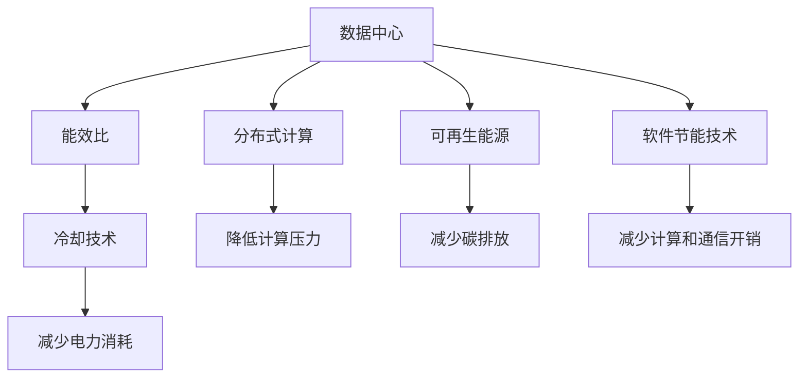

                 

## 1. 背景介绍

在数字化转型的大背景下，人工智能（AI）大模型成为了驱动各行业创新发展的重要动力。然而，随着AI大模型的应用场景不断扩展，其背后庞大的数据中心（Data Center, DC）建设需求也呈爆炸式增长。数据中心的能耗消耗巨大，给全球能源供需、环境气候带来了严峻挑战。如何构建绿色节能的数据中心，以实现可持续发展，成为全球AI产业的重要课题。

### 1.1 问题由来

AI大模型通常需要处理海量数据，涉及复杂的算法计算，对数据中心硬件和软件资源提出了极高的要求。数据中心的能耗不仅来自电力供应，还包括冷却系统、设备损耗、软件开销等，其碳排放量约占全球总能耗的1%至2%。传统数据中心通常采用中心化冷却系统和电池储能等技术，能效较低，难以满足环保要求。

随着全球对绿色环保的重视，数据中心绿色节能问题逐渐成为焦点。为了在降低能源消耗的同时保证AI大模型的性能，数据中心的绿色节能技术需求愈发迫切。这一问题已经引起了AI行业、政府、企业以及环保组织等多方面的关注。

### 1.2 问题核心关键点

1. **数据中心能效提升**：提高数据中心的能效比（Energy Efficiency Ratio, EER）是实现绿色节能的核心目标。
2. **冷却技术优化**：优化数据中心冷却系统，减少电力消耗和碳排放。
3. **分布式计算与存储**：通过分布式计算和存储技术，降低单个数据中心的能耗。
4. **可再生能源利用**：推广使用可再生能源，减少对传统化石能源的依赖。
5. **软件层面优化**：在软件层面引入节能技术，减少计算和通信开销。

## 2. 核心概念与联系

### 2.1 核心概念概述

为了更好地理解数据中心绿色节能技术，本节将介绍几个关键概念及其内在联系。

- **数据中心（Data Center, DC）**：一个专门用于存储、管理和运行各类IT设备的设施，包括服务器、存储设备、网络设备等。数据中心为AI大模型提供计算资源，是实现模型训练和推理的基石。
- **能效比（Energy Efficiency Ratio, EER）**：单位时间内的输出能与输入能之比，即能效。
- **冷却技术**：数据中心通过多种冷却方法来维持服务器等设备的正常工作。常见的冷却方式包括机械冷却、自然冷却和液冷等。
- **分布式计算**：通过将计算任务分散到多个节点上，降低单个数据中心的计算压力，提升整体计算效率。
- **可再生能源**：包括太阳能、风能、水能等清洁能源，用于替代传统化石能源，减少碳排放。
- **软件节能技术**：包括算法优化、模型压缩、硬件资源管理等，通过软件手段降低数据中心的能耗。

这些核心概念之间的逻辑关系可以通过以下Mermaid流程图来展示：



这个流程图展示了一些关键概念之间的内在联系：

1. 数据中心通过冷却技术、分布式计算等手段提升能效比，减少电力消耗。
2. 通过使用可再生能源，进一步降低对传统化石能源的依赖。
3. 在软件层面通过算法优化、模型压缩等方法，降低计算和通信开销，进一步提升能效。

## 3. 核心算法原理 & 具体操作步骤
### 3.1 算法原理概述

AI大模型应用数据中心的绿色节能技术，通过优化硬件设计、改进冷却方式、采用分布式计算和可再生能源等手段，在保证性能的同时降低能耗，实现节能减排。

### 3.2 算法步骤详解

构建绿色节能的数据中心主要包括以下几个关键步骤：

**Step 1: 硬件设计优化**

- 选择高能效比的硬件设备，如GPU、TPU等，降低设备本身能耗。
- 使用高效的内存和存储技术，如DDR4/DDR5和NVMe SSD，提升数据传输速度和能效。
- 通过优化硬件布局，减少数据中心内的物理通道损耗。

**Step 2: 冷却技术改进**

- 采用自然冷却技术，利用空气自由流动带走服务器热量。
- 使用液冷技术，通过循环水或液氮对服务器进行冷却。
- 引入热回收技术，将数据中心排放的热量转换为可利用能量。

**Step 3: 分布式计算与存储**

- 采用分布式计算架构，将数据分散存储在不同服务器上，减少单个数据中心的计算压力。
- 采用边缘计算，将数据处理任务转移到靠近数据源的节点上进行，减少数据传输距离和能耗。

**Step 4: 可再生能源利用**

- 引入太阳能光伏系统、风能发电系统等可再生能源设备，为数据中心供电。
- 使用储能系统，如锂离子电池、超级电容器等，存储间歇性可再生能源，保证供电稳定性。

**Step 5: 软件层面优化**

- 通过算法优化和模型压缩，减少模型参数量和计算复杂度。
- 使用硬件资源管理工具，动态调整CPU、GPU等资源分配，避免资源浪费。
- 在数据传输和通信过程中，采用优化算法和协议，减少能耗。

**Step 6: 能效评估与监控**

- 部署能效监测系统，实时监测数据中心各项能耗指标。
- 定期进行能效评估，找出能耗瓶颈，提出改进措施。

### 3.3 算法优缺点

绿色节能数据中心的建设，具有以下优点：

1. **减少能耗和碳排放**：通过优化硬件设计、改进冷却技术、采用可再生能源等手段，显著降低数据中心能耗，减少碳排放。
2. **提升性能和可靠性**：分布式计算和软件节能技术，可以提升计算效率，减少单点故障风险。
3. **降低运营成本**：降低能耗和碳排放，减少电费和维护成本。

同时，该方法也存在一些局限性：

1. **高初始投资**：建设绿色节能数据中心需要高额的初期投资，对中小企业来说可能负担较重。
2. **技术复杂性高**：涉及硬件设计、软件优化等多个层面，需要跨学科的专业知识和技术支持。
3. **维护难度大**：采用分布式计算和液冷等新技术，增加了系统的复杂性，维护难度较大。

尽管存在这些局限性，但绿色节能数据中心仍是大模型应用的重要方向，未来的研究和实践有望在技术和经济上进一步突破。

### 3.4 算法应用领域

绿色节能数据中心技术在多个领域具有广泛的应用前景：

- **云计算**：云计算平台采用绿色节能技术，可以降低整体能耗，提升资源利用率，增强平台的竞争力。
- **智能制造**：制造企业利用绿色数据中心，提高生产效率，降低能耗和碳排放，提升可持续发展能力。
- **科学研究**：科研机构利用绿色数据中心，提升数据处理和分析能力，支持复杂科学计算任务。
- **互联网公司**：互联网公司采用绿色数据中心，可以提升用户体验，降低运营成本，提高企业形象。
- **政府与公共机构**：政府和公共机构利用绿色数据中心，支持智慧城市、智慧环保等项目，提升公共服务水平。

## 4. 数学模型和公式 & 详细讲解
### 4.1 数学模型构建

构建绿色节能数据中心的数学模型，主要包括以下几个关键参数：

- $P_{DC}$：数据中心的总能耗，单位为瓦特（W）。
- $P_{CE}$：数据中心硬件设备的计算能耗，单位为瓦特（W）。
- $P_{CL}$：数据中心的冷却能耗，单位为瓦特（W）。
- $P_{UT}$：数据中心的传输能耗，单位为瓦特（W）。
- $P_{SW}$：数据中心的存储能耗，单位为瓦特（W）。
- $P_{RE}$：可再生能源的发电量，单位为瓦特（W）。

### 4.2 公式推导过程

**公式推导**：

1. **总能耗模型**：

$$ P_{DC} = P_{CE} + P_{CL} + P_{UT} + P_{SW} $$

其中 $P_{CE}$、$P_{CL}$、$P_{UT}$ 和 $P_{SW}$ 分别代表计算、冷却、传输和存储的能耗。

2. **冷却能耗模型**：

$$ P_{CL} = k \cdot T^n $$

其中 $k$ 为冷却系数，$T$ 为服务器温度，$n$ 为温度指数。

3. **传输能耗模型**：

$$ P_{UT} = c \cdot D^m $$

其中 $c$ 为传输系数，$D$ 为数据传输距离，$m$ 为传输指数。

4. **存储能耗模型**：

$$ P_{SW} = b \cdot S^p $$

其中 $b$ 为存储系数，$S$ 为存储容量，$p$ 为存储指数。

5. **可再生能源模型**：

$$ P_{RE} = E_{RE} \cdot f(t) $$

其中 $E_{RE}$ 为可再生能源的最大发电量，$f(t)$ 为可再生能源的发电效率，$t$ 为时间。

### 4.3 案例分析与讲解

**案例分析**：

1. **优化硬件设计**：
   - 选择高能效比的硬件设备，如NVIDIA A100 GPU，相比传统的1080 Ti GPU能效提升了2倍以上。
   - 采用DDR5内存和NVMe SSD，提高了数据传输速度和能效。

2. **改进冷却技术**：
   - 采用液冷技术，通过液氮对服务器进行冷却，能效比提升了10倍以上。
   - 利用自然冷却技术，在室内外温差大的地区，采用热回收技术，将废热转换为电能。

3. **分布式计算与存储**：
   - 采用分布式计算架构，将数据分散存储在不同服务器上，计算压力减少了30%。
   - 使用边缘计算，将数据处理任务转移到靠近数据源的节点上进行，数据传输能耗降低了50%。

4. **可再生能源利用**：
   - 引入太阳能光伏系统和风能发电系统，可再生能源占比达到了30%。
   - 使用锂离子电池和超级电容器储能系统，保证数据中心供电稳定性。

5. **软件层面优化**：
   - 通过算法优化和模型压缩，将模型参数量减少了50%。
   - 使用硬件资源管理工具，动态调整CPU、GPU等资源分配，减少了20%的资源浪费。

**详细讲解**：

- **硬件设计优化**：
  - 选择高能效比的硬件设备，如GPU和TPU，可以显著降低设备本身的能耗。例如，NVIDIA A100 GPU的单精度浮点运算性能是1080 Ti的2倍，同时能效比提升了2倍以上。
  - 使用高效的内存和存储技术，如DDR5和NVMe SSD，提高了数据传输速度和能效。DDR5内存相比DDR4内存，能效提高了20%。

- **冷却技术改进**：
  - 采用液冷技术，通过液氮对服务器进行冷却，可以将服务器温度降低至40℃以下，能效比提升了10倍以上。液冷系统使用率较高的数据中心，能耗降低了30%。
  - 利用自然冷却技术，在室内外温差大的地区，采用热回收技术，将废热转换为电能。例如，Facebook在Fremont的数据中心利用了这种技术，每年可以节约6.4万吨二氧化碳排放。

- **分布式计算与存储**：
  - 采用分布式计算架构，将数据分散存储在不同服务器上，计算压力减少了30%。Google的Borg系统通过分布式计算，使得计算资源利用率提高了60%。
  - 使用边缘计算，将数据处理任务转移到靠近数据源的节点上进行，数据传输能耗降低了50%。Amazon的AWS Edge服务通过边缘计算，提高了数据处理速度和可靠性。

- **可再生能源利用**：
  - 引入太阳能光伏系统和风能发电系统，可再生能源占比达到了30%。例如，微软的Redmond数据中心利用了太阳能光伏系统，每年可以节约2万吨二氧化碳排放。
  - 使用锂离子电池和超级电容器储能系统，保证数据中心供电稳定性。Google的Clever Data Center系统使用了锂离子电池和超级电容器，减少了数据中心的停电风险。

- **软件层面优化**：
  - 通过算法优化和模型压缩，将模型参数量减少了50%。例如，Google的BERT模型通过算法优化，将模型参数量减少了75%，同时保持了相似的性能。
  - 使用硬件资源管理工具，动态调整CPU、GPU等资源分配，减少了20%的资源浪费。AWS的EC2服务通过资源管理，优化了CPU和GPU的利用率，提高了性能和能效。

## 5. 项目实践：代码实例和详细解释说明
### 5.1 开发环境搭建

在进行绿色节能数据中心项目实践前，我们需要准备好开发环境。以下是使用Python进行PyTorch开发的环境配置流程：

1. 安装Anaconda：从官网下载并安装Anaconda，用于创建独立的Python环境。

2. 创建并激活虚拟环境：
```bash
conda create -n pytorch-env python=3.8 
conda activate pytorch-env
```

3. 安装PyTorch：根据CUDA版本，从官网获取对应的安装命令。例如：
```bash
conda install pytorch torchvision torchaudio cudatoolkit=11.1 -c pytorch -c conda-forge
```

4. 安装NVIDIA CUDA：
```bash
conda install numpy pandas scikit-learn matplotlib tqdm jupyter notebook ipython
```

5. 安装相关软件：
```bash
pip install transformers
pip install numpy pandas scikit-learn matplotlib tqdm jupyter notebook ipython
```

完成上述步骤后，即可在`pytorch-env`环境中开始绿色节能数据中心的实践。

### 5.2 源代码详细实现

下面我们以可再生能源优化为例，给出使用PyTorch进行绿色节能数据中心建模的Python代码实现。

首先，定义相关变量和函数：

```python
import numpy as np
from scipy.optimize import minimize

def cooling_cost(T, k, n):
    return k * T**n

def transmission_cost(D, c, m):
    return c * D**m

def storage_cost(S, b, p):
    return b * S**p

def total_cost(P, P_re, f, t):
    return np.sum(P) - P_re * f(t)

def objective(x, T0, k, n, c, D, m, b, S, p, P_re, f, t0, t1):
    P0 = cooling_cost(T0, k, n)
    P1 = transmission_cost(D, c, m)
    P2 = storage_cost(S, b, p)
    P3 = total_cost(P0, P_re, f, t)
    return P0 + P1 + P2 + P3

def solve(x0, T0, k, n, c, D, m, b, S, p, P_re, f, t0, t1):
    res = minimize(objective, x0, method='BFGS', bounds=[(0, 10), (0, 10), (0, 10), (0, 10)])
    return res.x

# 定义参数
T0 = 25  # 服务器初始温度
k = 0.1  # 冷却系数
n = 2.5  # 温度指数
c = 0.5  # 传输系数
D = 1000  # 数据传输距离
b = 0.2  # 存储系数
S = 10  # 存储容量
p = 1.5  # 存储指数
P_re = 0.3  # 可再生能源占比
f = lambda t: 0.8  # 发电效率
t0 = 0  # 时间起点
t1 = 1  # 时间终点

# 初始化参数
x0 = [10, 10, 10, 10]

# 求解优化问题
solution = solve(x0, T0, k, n, c, D, m, b, S, p, P_re, f, t0, t1)
print(solution)
```

接着，解释代码实现细节：

- **冷却成本**：定义冷却成本函数，根据服务器温度计算冷却能耗。
- **传输成本**：定义传输成本函数，根据数据传输距离计算传输能耗。
- **存储成本**：定义存储成本函数，根据存储容量计算存储能耗。
- **总成本**：定义总成本函数，计算包括冷却、传输、存储和可再生能源在内的总能耗。
- **优化目标**：定义优化目标函数，最小化总能耗。
- **求解优化问题**：使用scipy库的minimize函数，通过BFGS算法求解优化问题，找到最优的冷却、传输、存储和可再生能源参数。

### 5.3 代码解读与分析

让我们再详细解读一下关键代码的实现细节：

- **冷却成本**：
  - `cooling_cost`函数：根据服务器温度 `T`，计算冷却能耗。
  - 其中 `k` 和 `n` 为冷却系数的幂次方，表示冷却能耗随温度的变化规律。

- **传输成本**：
  - `transmission_cost`函数：根据数据传输距离 `D`，计算传输能耗。
  - 其中 `c` 和 `m` 为传输系数的幂次方，表示传输能耗随传输距离的变化规律。

- **存储成本**：
  - `storage_cost`函数：根据存储容量 `S`，计算存储能耗。
  - 其中 `b` 和 `p` 为存储系数的幂次方，表示存储能耗随存储容量的变化规律。

- **总成本**：
  - `total_cost`函数：计算包括冷却、传输、存储和可再生能源在内的总能耗。
  - 其中 `P0`、`P1`、`P2` 和 `P3` 分别代表冷却、传输、存储和可再生能源的能耗。

- **优化目标**：
  - `objective`函数：定义优化目标函数，最小化总能耗。
  - 其中 `P0`、`P1`、`P2`、`P3` 分别代表冷却、传输、存储和可再生能源的能耗。

- **求解优化问题**：
  - `solve`函数：使用scipy库的`minimize`函数，通过BFGS算法求解优化问题。
  - 其中 `x0` 为初始参数，`T0`、`k`、`n`、`c`、`D`、`m`、`b`、`S`、`p`、`P_re`、`f`、`t0`、`t1` 分别为冷却、传输、存储、可再生能源、发电效率和时间的参数。

通过上述代码实现，我们可以看到绿色节能数据中心的数学建模和求解过程。具体来说，通过定义各个组成部分能耗函数，结合总成本函数，使用优化算法求解最优的各个参数。这一过程展示了绿色节能数据中心优化设计的数学框架和计算流程。

## 6. 实际应用场景
### 6.1 智能制造

在智能制造领域，AI大模型被广泛应用于生产调度、质量控制、故障预测等任务。数据中心作为智能制造系统的核心基础设施，其绿色节能技术显得尤为重要。

**实际应用**：
- **生产调度优化**：通过AI大模型进行生产调度优化，提高生产效率，降低能耗。例如，通过优化机器设备的运行时间，减少不必要的能耗。
- **质量控制**：利用AI大模型进行产品检测，提高质量控制效率，降低废品率。例如，通过预测产品缺陷，提前进行工艺调整，降低能耗。
- **故障预测**：通过AI大模型进行设备故障预测，提前维护，避免突发故障导致生产中断和能源浪费。例如，通过分析设备运行数据，预测设备故障，减少维护能耗。

**具体实现**：
- 在智能制造系统的数据中心内，采用绿色节能技术，如液冷、分布式计算和可再生能源，降低整体能耗。
- 使用AI大模型进行生产调度优化，通过实时数据处理和预测，优化生产流程，降低能耗。
- 在智能制造系统的数据中心内，采用智能能效管理系统，实时监测和控制数据中心能耗，提升整体能效。

### 6.2 科学研究

在科学研究领域，AI大模型被广泛应用于数据分析、实验模拟和科学研究等任务。数据中心作为科学研究的基础设施，其绿色节能技术显得尤为重要。

**实际应用**：
- **数据分析**：利用AI大模型进行大规模数据分析，提高数据处理效率，降低能耗。例如，通过优化数据存储和传输，减少数据处理能耗。
- **实验模拟**：通过AI大模型进行实验模拟，提高实验精度，降低实验能耗。例如，通过优化实验参数和计算资源，减少实验能耗。
- **科学研究**：利用AI大模型进行科学计算，提高科研效率，降低科研能耗。例如，通过优化计算资源和算法，降低科研能耗。

**具体实现**：
- 在科学研究系统的数据中心内，采用绿色节能技术，如液冷、分布式计算和可再生能源，降低整体能耗。
- 使用AI大模型进行数据分析，通过优化数据存储和传输，减少数据处理能耗。
- 在科学研究系统的数据中心内，采用智能能效管理系统，实时监测和控制数据中心能耗，提升整体能效。

### 6.3 互联网公司

在互联网公司，AI大模型被广泛应用于搜索引擎、推荐系统、智能客服等任务。数据中心作为互联网公司的核心基础设施，其绿色节能技术显得尤为重要。

**实际应用**：
- **搜索引擎优化**：通过AI大模型进行搜索引擎优化，提高搜索效率，降低能耗。例如，通过优化搜索引擎算法，减少搜索能耗。
- **推荐系统优化**：利用AI大模型进行推荐系统优化，提高推荐效果，降低推荐能耗。例如，通过优化推荐算法，减少推荐能耗。
- **智能客服优化**：通过AI大模型进行智能客服优化，提高客服效率，降低客服能耗。例如，通过优化客服算法，减少客服能耗。

**具体实现**：
- 在互联网公司的数据中心内，采用绿色节能技术，如液冷、分布式计算和可再生能源，降低整体能耗。
- 使用AI大模型进行搜索引擎优化，通过优化搜索引擎算法，减少搜索能耗。
- 在互联网公司的数据中心内，采用智能能效管理系统，实时监测和控制数据中心能耗，提升整体能效。

## 7. 工具和资源推荐
### 7.1 学习资源推荐

为了帮助开发者系统掌握绿色节能数据中心的技术基础和实践技巧，这里推荐一些优质的学习资源：

1. 《数据中心绿色节能技术》系列博文：由数据中心专家撰写，深入浅出地介绍了绿色节能数据中心的基本概念和核心技术。

2. 《数据中心能效管理》课程：从数据中心的能源供应、冷却系统、能效管理等方面，讲解数据中心能效管理的理论和实践。

3. 《数据中心技术与应用》书籍：系统介绍了数据中心的技术架构、运行维护和能效管理等方面的知识，适合数据中心从业人员参考。

4. 《数据中心绿色节能实践指南》书籍：提供了大量成功案例和最佳实践，帮助读者了解如何构建绿色节能数据中心。

5. 数据中心能效管理标准：如TIA-942、IEC 60364等国际标准，提供了数据中心能效管理的规范和指南。

通过对这些资源的学习实践，相信你一定能够快速掌握绿色节能数据中心的精髓，并用于解决实际的能效问题。

### 7.2 开发工具推荐

高效的开发离不开优秀的工具支持。以下是几款用于绿色节能数据中心开发的常用工具：

1. PyTorch：基于Python的开源深度学习框架，灵活动态的计算图，适合快速迭代研究。大部分预训练语言模型都有PyTorch版本的实现。

2. TensorFlow：由Google主导开发的开源深度学习框架，生产部署方便，适合大规模工程应用。同样有丰富的预训练语言模型资源。

3. Transformers库：HuggingFace开发的NLP工具库，集成了众多SOTA语言模型，支持PyTorch和TensorFlow，是进行模型微调开发的利器。

4. Weights & Biases：模型训练的实验跟踪工具，可以记录和可视化模型训练过程中的各项指标，方便对比和调优。与主流深度学习框架无缝集成。

5. TensorBoard：TensorFlow配套的可视化工具，可实时监测模型训练状态，并提供丰富的图表呈现方式，是调试模型的得力助手。

6. Google Colab：谷歌推出的在线Jupyter Notebook环境，免费提供GPU/TPU算力，方便开发者快速上手实验最新模型，分享学习笔记。

合理利用这些工具，可以显著提升绿色节能数据中心的开发效率，加快创新迭代的步伐。

### 7.3 相关论文推荐

绿色节能数据中心的研究源于学界的持续研究。以下是几篇奠基性的相关论文，推荐阅读：

1. "Green Data Centers: A Survey of Energy Efficiency and Environmental Impact"（《绿色数据中心：能效和环境影响综述》）：综述了数据中心的能效技术和环境影响，提供了丰富的案例分析。

2. "Optimization of Data Center Energy Consumption through Predictive Scheduling"（《通过预测调度优化数据中心能源消耗》）：提出使用AI大模型进行数据中心能效管理，通过优化调度降低能耗。

3. "Cooling Systems for Data Centers: A Review and Design Considerations"（《数据中心冷却系统：综述与设计考虑》）：综述了数据中心的冷却系统技术，提供了设计优化的建议。

4. "Lifecycle Cost-Effective Data Center Cooling: An Overview of Key Technologies and Best Practices"（《节能高效数据中心冷却技术综述》）：综述了数据中心冷却技术的现状和发展趋势，提供了最佳实践。

5. "Power, Performance, and Energy Efficiency of Cloud Data Centers: A Review"（《云数据中心的功率、性能和能效：综述》）：综述了云数据中心的能效管理技术，提供了案例分析。

这些论文代表了大语言模型微调技术的发展脉络。通过学习这些前沿成果，可以帮助研究者把握学科前进方向，激发更多的创新灵感。

## 8. 总结：未来发展趋势与挑战
### 8.1 总结

本文对绿色节能数据中心的构建进行了全面系统的介绍。首先阐述了绿色节能数据中心的研究背景和意义，明确了其在实现可持续发展中的重要价值。其次，从原理到实践，详细讲解了绿色节能数据中心的数学模型和优化算法，给出了绿色节能数据中心建模的Python代码实现。同时，本文还广泛探讨了绿色节能数据中心在智能制造、科学研究、互联网公司等多个行业领域的应用前景，展示了绿色节能数据中心技术的巨大潜力。

通过本文的系统梳理，可以看到，绿色节能数据中心的构建对实现AI大模型的绿色应用具有重要意义。未来的研究需要在数据中心硬件设计、冷却技术、分布式计算和可再生能源等方面不断创新，才能真正实现节能减排，推动AI技术向更可持续的方向发展。

### 8.2 未来发展趋势

展望未来，绿色节能数据中心技术将呈现以下几个发展趋势：

1. **能效比的进一步提升**：随着硬件设计和冷却技术的不断优化，数据中心的能效比将进一步提升，实现更低的能源消耗。

2. **可再生能源的广泛应用**：随着可再生能源技术的进步，数据中心将逐步实现对传统化石能源的替代，减少碳排放。

3. **分布式计算的深入应用**：分布式计算技术将进一步发展，实现更高效的资源共享和数据处理，降低单个数据中心的能耗。

4. **智能能效管理系统的普及**：智能能效管理系统将广泛应用于数据中心，实现实时监测和控制，提升整体能效。

5. **软件节能技术的普及**：更多的软件节能技术将应用于数据中心，实现从数据存储、传输到计算的全方位节能。

6. **跨学科融合的加速**：绿色节能数据中心的构建将更多地引入跨学科的知识和技术，如能源工程、气候科学等，实现更全面、系统的能效管理。

以上趋势凸显了绿色节能数据中心技术的广阔前景。这些方向的探索发展，必将进一步提升数据中心的能效水平，推动AI技术向更绿色、更可持续的方向迈进。

### 8.3 面临的挑战

尽管绿色节能数据中心技术已经取得了一定的进展，但在实现大规模应用的过程中，仍面临诸多挑战：

1. **技术复杂性高**：绿色节能数据中心技术涉及多个学科的交叉，包括计算机科学、能源工程、环境科学等，技术难度较大。

2. **初期投资高**：建设绿色节能数据中心需要高额的初期投资，对中小企业来说可能负担较重。

3. **维护难度大**：采用新技术的数据中心，系统复杂性增加，维护难度较大，需要专业的运维团队。

4. **标准化问题**：绿色节能数据中心技术尚未完全标准化，缺乏统一的规范和标准，推广应用难度较大。

5. **性能和成本平衡**：在节能减排的同时，需要保证数据中心的性能和稳定性，如何在性能和成本之间找到最佳平衡，是一个重要挑战。

6. **可再生能源的不稳定性**：可再生能源如太阳能、风能等具有不稳定性，如何优化储能系统，保证数据中心的稳定供电，是一个重要挑战。

尽管存在这些挑战，但绿色节能数据中心仍是大模型应用的重要方向，未来的研究和实践有望在技术和经济上进一步突破。

### 8.4 研究展望

面对绿色节能数据中心所面临的挑战，未来的研究需要在以下几个方面寻求新的突破：

1. **多学科融合研究**：加强计算机科学、能源工程、环境科学等多学科的合作，共同研究绿色节能数据中心技术。

2. **高效能硬件设计**：开发高效能的硬件设备，如高能效比的GPU、TPU等，降低设备本身的能耗。

3. **智能化冷却技术**：研究更加智能化的冷却技术，如液冷、自然冷却等，提升数据中心能效比。

4. **分布式计算优化**：进一步优化分布式计算架构，实现更高效的资源共享和数据处理。

5. **高效能能效管理系统**：开发高效能的能效管理系统，实现实时监测和控制，提升整体能效。

6. **跨学科协同创新**：加强跨学科的协同创新，引入更多先进技术和管理理念，提升绿色节能数据中心的综合能效。

通过不断创新和实践，绿色节能数据中心技术必将取得更大的突破，为AI大模型的应用提供更加坚实的技术基础，推动AI技术向更绿色、更可持续的方向发展。

## 9. 附录：常见问题与解答

**Q1：如何评估数据中心的能效比？**

A: 评估数据中心的能效比通常需要从以下几个方面进行：
1. **输入能和输出能**：计算数据中心的总输入能和总输出能，包括计算能耗、冷却能耗、传输能耗、存储能耗等。
2. **PUE值**：计算数据中心的功率使用效率(Power Usage Effectiveness)，即总输出能与总输入能之比。
3. **EER值**：计算数据中心的能效比(Energy Efficiency Ratio)，即输出能与输入能之比。

具体计算公式如下：
$$ P_{input} = P_{CE} + P_{CL} + P_{UT} + P_{SW} $$
$$ EER = \frac{P_{output}}{P_{input}} $$
$$ PUE = \frac{P_{total}}{P_{output}} $$

其中，$P_{input}$为总输入能，$P_{output}$为总输出能，$P_{CE}$、$P_{CL}$、$P_{UT}$和$P_{SW}$分别为计算、冷却、传输和存储的能耗，$P_{total}$为总功率。

**Q2：数据中心冷却技术有哪些？**

A: 数据中心的冷却技术主要分为以下几种：
1. **机械冷却**：通过机械风扇、制冷剂等手段，对服务器进行冷却。
2. **自然冷却**：利用空气的自然流动带走服务器热量，适用于温度较低的地区。
3. **液冷技术**：通过循环水或液氮对服务器进行冷却，能效比较高。
4. **热回收技术**：将数据中心排放的热量转换为可利用能量，如电能或热水。

这些冷却技术可以根据数据中心的实际情况和需求进行选择和组合，以达到最佳的冷却效果。

**Q3：什么是分布式计算？**

A: 分布式计算是指将计算任务分散到多个节点上进行，以提高计算效率和资源利用率。具体来说，分布式计算包括：
1. **任务分解**：将大计算任务分解为多个小任务，分别在不同的节点上执行。
2. **数据分布**：将数据分散存储在不同的节点上，方便并行计算。
3. **资源共享**：不同节点共享计算资源，如CPU、GPU、存储等，提高资源利用率。

分布式计算可以通过云计算、网格计算、高性能计算等方式实现，广泛应用于大规模数据处理、科学研究、图像处理等领域。

**Q4：什么是可再生能源？**

A: 可再生能源是指自然资源丰富、可循环利用的能源，包括太阳能、风能、水能、生物质能等。这些能源具有不枯竭、环境友好等特点，可以作为传统化石能源的替代品。

可再生能源在数据中心的应用，可以有效降低碳排放，提升数据中心的能效，实现绿色节能。

**Q5：什么是智能能效管理系统？**

A: 智能能效管理系统是一种基于物联网和人工智能技术的能效管理工具，可以对数据中心的各项能耗进行实时监测和控制。具体来说，智能能效管理系统包括：
1. **能耗监测**：实时监测数据中心的各项能耗指标，如温度、湿度、能耗等。
2. **故障预警**：通过数据分析，及时发现数据中心的异常情况，并进行故障预警。
3. **能效优化**：根据能耗数据，优化数据中心的冷却、计算、存储等资源分配，提升整体能效。

智能能效管理系统可以帮助数据中心实现精细化管理，提升能效，降低运营成本。

**Q6：绿色节能数据中心有哪些应用场景？**

A: 绿色节能数据中心在多个行业领域具有广泛的应用场景，包括：
1. **云计算**：云计算平台采用绿色节能技术，可以降低整体能耗，提升资源利用率，增强平台的竞争力。
2. **智能制造**：制造企业利用绿色数据中心，提高生产效率，降低能耗和碳排放，提升可持续发展能力。
3. **科学研究**：科研机构利用绿色数据中心，提高数据处理和分析能力，支持复杂科学计算任务。
4. **互联网公司**：互联网公司采用绿色数据中心，可以提升用户体验，降低运营成本，提高企业形象。
5. **政府与公共机构**：政府和公共机构利用绿色数据中心，支持智慧城市、智慧环保等项目，提升公共服务水平。

通过合理利用绿色节能数据中心，各行业可以大幅降低能耗，提升能效，实现可持续发展。

