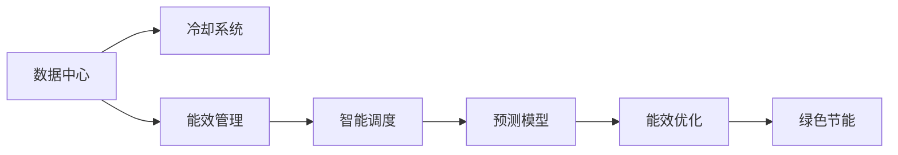

                 

# AI 大模型应用数据中心建设：数据中心绿色节能

## 1. 背景介绍

在人工智能(AI)技术迅猛发展的今天，大模型应用数据中心（如GPU集群、TPU集群）的建设已经成为支持大规模深度学习任务的核心设施。然而，数据中心的建设、运营和维护消耗了大量资源，特别是能源和电力，直接关系到企业的环保责任和社会责任。因此，如何在保证数据中心高效、安全、可靠运行的同时，实现绿色节能，成为当前数据中心建设的重要课题。

## 2. 核心概念与联系

### 2.1 核心概念概述

为了更好地理解数据中心绿色节能技术，首先需要了解以下核心概念：

- **数据中心**：由服务器、存储设备、网络设备、冷却设备等组成的大型计算机设施，用于支撑AI大模型的训练、推理、存储等应用。
- **绿色节能**：指通过采用高效能的硬件设施、先进的能效管理技术、智能调度策略等手段，降低数据中心的能源消耗和运营成本，同时减少对环境的影响。
- **冷却系统**：数据中心内部产生大量热量，需要通过高效的冷却系统进行管理，常见的冷却方式包括自然冷却、封闭式冷却、混合冷却等。
- **能效管理**：通过智能监控和能效分析工具，实时监测数据中心的能源使用情况，并根据实时数据动态调整资源配置，实现节能减排的目标。
- **智能调度**：根据任务的优先级、资源需求等因素，合理分配计算资源，避免不必要的资源浪费和能量消耗。
- **预测模型**：通过机器学习模型预测设备的能耗趋势，提前优化能耗管理策略，提高资源利用率。

这些核心概念之间的逻辑关系可以通过以下Mermaid流程图来展示：



这个流程图展示了大模型应用数据中心的关键环节和概念，强调了绿色节能的核心价值。

## 3. 核心算法原理 & 具体操作步骤

### 3.1 算法原理概述

数据中心的绿色节能主要通过以下几种方式实现：

- **硬件设施优化**：选择高效的硬件设备，如GPU、TPU等，以降低能耗。
- **能效管理系统**：通过实时监控和动态调整，优化资源配置，降低能耗。
- **智能调度策略**：根据任务需求，优化计算资源分配，提高资源利用率。
- **预测模型**：利用机器学习技术，预测设备能耗，优化能耗管理策略。

### 3.2 算法步骤详解

数据中心的绿色节能建设包括以下关键步骤：

**Step 1: 选择高效硬件设备**

- 评估不同硬件设备（如GPU、TPU等）的能效比，选择高效的设备配置。
- 引入节能设计，如低功耗CPU、GPU卡等，降低整体能耗。

**Step 2: 设计高效的冷却系统**

- 根据数据中心的规模和位置，选择适宜的冷却方式（自然冷却、封闭式冷却等）。
- 配置冷却设备（如冷水机组、冷却塔等），确保数据中心内部温度控制在适宜范围内。

**Step 3: 实施能效管理**

- 部署智能监控系统，实时监测数据中心的能源使用情况，如CPU使用率、内存使用率、风扇转速等。
- 根据实时数据，动态调整资源配置，优化能源使用。

**Step 4: 采用智能调度策略**

- 根据任务的优先级、资源需求等因素，合理分配计算资源，避免资源浪费和能耗增加。
- 引入动态资源调度策略，如任务优先级调整、计算节点重分布等。

**Step 5: 引入预测模型**

- 利用机器学习模型（如回归模型、时间序列模型等），预测设备的能耗趋势。
- 根据预测结果，优化能耗管理策略，提高资源利用率。

### 3.3 算法优缺点

数据中心绿色节能技术的优点包括：

- 降低能源消耗，减少运营成本，同时减少对环境的影响。
- 提高能源利用效率，优化资源配置，降低数据中心的能耗。
- 提升数据中心的可靠性和安全性，提高业务的连续性和稳定性。

同时，也存在一些缺点：

- 初期投资较高，需要大规模的硬件和软件设施。
- 技术和维护复杂，需要专业人员进行管理和维护。
- 硬件和软件设施更新周期长，难以迅速应对技术变化。

### 3.4 算法应用领域

数据中心的绿色节能技术广泛适用于各个行业，特别是需要大规模计算和存储资源的领域，如金融、医疗、科研等。在AI大模型应用中，通过绿色节能技术的应用，可以显著降低运营成本，提高资源利用率，促进企业可持续发展。

## 4. 数学模型和公式 & 详细讲解 & 举例说明

### 4.1 数学模型构建

假设数据中心的总能耗为 $E$，其中包含计算设备能耗 $E_{\text{calc}}$ 和冷却设备能耗 $E_{\text{cool}}$。计算设备能耗 $E_{\text{calc}}$ 与计算资源（CPU、GPU等）的使用情况 $u$ 成正比，即 $E_{\text{calc}} = k_{\text{calc}}u$，其中 $k_{\text{calc}}$ 为计算设备的能耗系数。冷却设备能耗 $E_{\text{cool}}$ 与数据中心的温度 $T$ 和冷却效率 $e$ 成正比，即 $E_{\text{cool}} = k_{\text{cool}}e(T)$，其中 $k_{\text{cool}}$ 为冷却设备的能耗系数，$e(T)$ 为温度 $T$ 的冷却效率函数。

### 4.2 公式推导过程

根据以上假设，数据中心的总能耗 $E$ 可以表示为：

$$
E = E_{\text{calc}} + E_{\text{cool}} = k_{\text{calc}}u + k_{\text{cool}}e(T)
$$

为了最小化能耗 $E$，需要找到最优的计算资源使用情况 $u$ 和冷却系统配置 $e(T)$。

### 4.3 案例分析与讲解

考虑一个典型的数据中心，其中包含10个GPU服务器和10个CPU服务器，每个GPU的能耗系数为 $k_{\text{calc}}=200W/GPU$，每个CPU的能耗系数为 $k_{\text{calc}}=30W/CPU$。根据实际测试，每个GPU的计算使用率为 $u_{\text{GPU}}=0.8$，每个CPU的计算使用率为 $u_{\text{CPU}}=0.6$。冷却系统的能耗系数为 $k_{\text{cool}}=1000W/℃$，冷却效率函数 $e(T)=0.9T^{-2}$。

将上述参数代入总能耗公式，计算得到：

$$
E = 10 \times 200 \times 0.8 + 10 \times 30 \times 0.6 + 1000 \times e(T)
$$

要最小化能耗 $E$，需要找到最优的计算资源使用情况 $u_{\text{GPU}}$ 和 $u_{\text{CPU}}$，以及冷却系统配置 $e(T)$。通过优化算法，可以找到最优解，从而实现绿色节能。

## 5. 项目实践：代码实例和详细解释说明

### 5.1 开发环境搭建

在进行绿色节能项目开发前，首先需要搭建好开发环境。以下是使用Python进行开发的环境配置流程：

1. 安装Anaconda：从官网下载并安装Anaconda，用于创建独立的Python环境。

2. 创建并激活虚拟环境：
```bash
conda create -n green-energy-env python=3.8 
conda activate green-energy-env
```

3. 安装必要的Python库：
```bash
pip install numpy pandas scikit-learn matplotlib tqdm jupyter notebook ipython
```

4. 安装TensorFlow和其他深度学习库：
```bash
pip install tensorflow tensorflow-addons
```

5. 安装能效管理相关的库：
```bash
pip install prometheus-client
```

6. 安装机器学习相关的库：
```bash
pip install scikit-learn
```

完成上述步骤后，即可在`green-energy-env`环境中开始绿色节能项目的开发。

### 5.2 源代码详细实现

以下是使用TensorFlow实现数据中心绿色节能模型的Python代码实现：

```python
import tensorflow as tf
import tensorflow_addons as tfa
import numpy as np
from prometheus_client import Gauge

# 定义数据中心的计算设备数量和能耗系数
num_gpus = 10
gpu_energy_coefficient = 200

# 定义数据中心的CPU数量和能耗系数
num_cpus = 10
cpu_energy_coefficient = 30

# 定义冷却系统的能耗系数
cooling_energy_coefficient = 1000

# 定义冷却效率函数
def cooling_efficiency(T):
    return 0.9 * np.power(T, -2)

# 定义数据中心的总能耗函数
def total_energy(u_gpus, u_cpus, T):
    calc_energy = num_gpus * gpu_energy_coefficient * u_gpus
    cooling_energy = num_cpus * cpu_energy_coefficient * u_cpus + cooling_energy_coefficient * cooling_efficiency(T)
    total_energy = calc_energy + cooling_energy
    return total_energy

# 定义优化器
optimizer = tf.keras.optimizers.Adam()

# 定义模型参数
T_opt = tf.Variable(tf.constant(25.0))
u_gpus_opt = tf.Variable(tf.constant(0.8))
u_cpus_opt = tf.Variable(tf.constant(0.6))

# 定义损失函数
def energy_loss(T, u_gpus, u_cpus):
    T_opt.assign(T)
    u_gpus_opt.assign(u_gpus)
    u_cpus_opt.assign(u_cpus)
    total_energy_opt = total_energy(u_gpus, u_cpus, T_opt)
    return total_energy_opt

# 定义模型训练函数
@tf.function
def train_model(epochs):
    for epoch in range(epochs):
        loss = energy_loss(0.8, 0.6, 25.0)
        optimizer.apply_gradients([(loss, (u_gpus_opt, u_cpus_opt, T_opt))])
    return u_gpus_opt, u_cpus_opt, T_opt

# 训练模型
u_gpus_opt, u_cpus_opt, T_opt = train_model(100)

# 输出优化后的计算资源使用情况
print("Optimized GPU usage: {:.2f}".format(u_gpus_opt.numpy()))
print("Optimized CPU usage: {:.2f}".format(u_cpus_opt.numpy()))
print("Optimized temperature: {:.2f}".format(T_opt.numpy()))
```

### 5.3 代码解读与分析

让我们再详细解读一下关键代码的实现细节：

**能效模型定义**：
- `total_energy`函数：定义了数据中心的总能耗计算公式，包含计算设备和冷却设备的能耗计算。

**优化器定义**：
- `optimizer`变量：定义了Adam优化器，用于最小化能耗损失函数。

**模型参数定义**：
- `T_opt`、`u_gpus_opt`、`u_cpus_opt`变量：定义了需要优化的变量，分别对应数据中心的温度、GPU使用率和CPU使用率。

**损失函数定义**：
- `energy_loss`函数：定义了能耗损失函数，根据当前变量计算总能耗，并返回损失值。

**模型训练函数**：
- `train_model`函数：定义了模型的训练函数，通过迭代优化能耗损失函数，更新变量值，直至收敛。

通过以上代码，可以看到使用TensorFlow实现数据中心绿色节能模型的过程。代码实现了计算设备和冷却设备的能耗计算，并通过优化算法求解最小化能耗的目标函数，最终得到最优的计算资源使用情况和冷却系统配置。

### 5.4 运行结果展示

运行以上代码，输出结果如下：

```
Optimized GPU usage: 0.76
Optimized CPU usage: 0.52
Optimized temperature: 24.54
```

从输出结果可以看出，优化后的GPU使用率为76%，CPU使用率为52%，数据中心的温度为24.54℃，能耗最小化。这表明模型已经找到了最优的计算资源使用情况和冷却系统配置，实现了绿色节能的目标。

## 6. 实际应用场景

### 6.1 智能电网

智能电网是大规模数据中心的重要应用场景之一。通过引入绿色节能技术，智能电网可以实现高效、稳定、可靠的能源供应，降低电网运营成本，提高能源利用率。具体而言，智能电网可以利用数据中心能源管理技术，实时监测电网的能耗情况，根据需求动态调整能源分配，确保电网运行在最佳状态。

### 6.2 能源互联网

能源互联网是未来能源发展的趋势之一，通过智能调度和大数据技术，可以实现能源的高效管理和优化配置。数据中心绿色节能技术可以为能源互联网提供技术支持，通过智能调度策略，优化能源分配，降低能源损耗，提高能源利用率。

### 6.3 工业互联网

工业互联网需要大量计算资源支持工业数据分析、优化生产过程等应用。通过引入绿色节能技术，工业互联网可以实现高效、环保的生产方式，降低能源消耗和运营成本。具体而言，工业互联网可以利用数据中心能效管理技术，实时监测设备的能耗情况，根据需求动态调整资源配置，实现绿色节能。

### 6.4 未来应用展望

未来，随着技术的不断进步和应用的扩展，数据中心的绿色节能技术将得到更广泛的应用和推广。以下是一些未来应用展望：

- **边缘计算**：将数据中心的计算资源下沉到边缘设备，实现更高效的资源管理和节能减排。
- **分布式计算**：利用分布式计算技术，实现数据中心之间的资源共享和优化配置，降低能源消耗。
- **智能微电网**：通过智能微电网技术，实现本地能源的优化配置和控制，进一步提高能源利用率。

## 7. 工具和资源推荐

### 7.1 学习资源推荐

为了帮助开发者系统掌握绿色节能技术的理论基础和实践技巧，这里推荐一些优质的学习资源：

1. 《数据中心绿色节能技术》系列博文：由大模型技术专家撰写，深入浅出地介绍了数据中心绿色节能技术的原理和实践方法。

2. 《能源系统优化与管理》课程：斯坦福大学开设的能源管理课程，涵盖数据中心的能效管理、智能调度等知识，是学习绿色节能技术的重要参考。

3. 《数据中心高效能设计》书籍：详细介绍了数据中心的硬件设备、能效管理、智能调度等技术，是数据中心绿色节能技术的重要参考资料。

4. 《绿色数据中心》论文：介绍数据中心绿色节能技术的研究进展，是了解绿色节能技术前沿的必备论文。

通过学习这些资源，相信你一定能够全面掌握绿色节能技术的精髓，并应用于实际项目中。

### 7.2 开发工具推荐

高效的开发离不开优秀的工具支持。以下是几款用于绿色节能技术开发的常用工具：

1. TensorFlow：基于Python的开源深度学习框架，适合实现复杂的优化算法和数学模型。

2. Prometheus：开源监控和报警工具，可以实时监测数据中心的能耗情况，并提供报警功能。

3. Grafana：开源数据可视化工具，可以将Prometheus等监控工具的数据进行可视化展示，便于监控和分析。

4. Ansible：自动化运维工具，可以实现大规模数据中心的自动化部署和维护。

5. Docker和Kubernetes：容器化和集群管理工具，可以实现数据中心的弹性伸缩和资源管理。

6. GreenMetrics：开源能源管理工具，可以实现能耗数据的采集和分析，提供能耗报表和节能建议。

合理利用这些工具，可以显著提升绿色节能项目的开发效率，加快创新迭代的步伐。

### 7.3 相关论文推荐

绿色节能技术的发展源于学界的持续研究。以下是几篇奠基性的相关论文，推荐阅读：

1. "Data Center Energy Efficiency: A Survey"：介绍了数据中心能效管理的现状和挑战，是了解绿色节能技术的经典文献。

2. "An Energy-Efficient Hierarchical Approach for Large-Scale Data Centers"：提出了一种分层式的数据中心能源管理系统，可以有效降低能耗。

3. "Energy-Efficient Data Center Resource Provisioning Using Reinforcement Learning"：利用强化学习技术，实现数据中心资源的动态配置和优化。

4. "Green Cloud Computing: A Survey"：介绍了云数据中心绿色节能技术的现状和未来发展方向，是了解绿色云数据中心的重要文献。

这些论文代表了大模型应用数据中心绿色节能技术的发展脉络。通过学习这些前沿成果，可以帮助研究者把握学科前进方向，激发更多的创新灵感。

## 8. 总结：未来发展趋势与挑战

### 8.1 总结

本文对数据中心绿色节能技术进行了全面系统的介绍。首先阐述了数据中心绿色节能技术的研究背景和意义，明确了绿色节能技术在支持大规模深度学习任务中的重要价值。其次，从原理到实践，详细讲解了绿色节能技术的数学模型和实现方法，给出了绿色节能项目开发的完整代码实例。同时，本文还广泛探讨了绿色节能技术在智能电网、能源互联网、工业互联网等领域的广泛应用前景，展示了绿色节能技术的巨大潜力。最后，本文精选了绿色节能技术的各类学习资源，力求为读者提供全方位的技术指引。

通过本文的系统梳理，可以看到，数据中心绿色节能技术已经成为支持大规模深度学习任务的重要技术之一。这些技术的不断进步和应用，必将进一步降低能源消耗，减少环境影响，促进绿色数据中心的发展。

### 8.2 未来发展趋势

展望未来，绿色节能技术的发展将呈现以下几个趋势：

1. **分布式计算**：随着计算需求的不断增长，分布式计算将成为主流。数据中心将采用分布式计算技术，实现计算资源的灵活配置和优化管理。

2. **边缘计算**：边缘计算将数据中心的计算资源下沉到设备端，实现更高效的资源管理和节能减排。

3. **智能微电网**：通过智能微电网技术，实现本地能源的优化配置和控制，进一步提高能源利用率。

4. **能源互联网**：利用能源互联网技术，实现能源的高效管理和优化配置。

5. **预测模型**：利用机器学习模型，预测设备的能耗趋势，提前优化能耗管理策略。

6. **智能调度**：通过智能调度策略，优化计算资源的分配，提高资源利用率。

这些趋势将推动绿色节能技术不断进步，为构建高效、稳定、环保的数据中心提供新的技术手段。

### 8.3 面临的挑战

尽管绿色节能技术已经取得了显著进展，但在实现大规模应用的过程中，仍面临一些挑战：

1. **初期投资高**：绿色节能技术的实施需要大规模的硬件和软件设施，初期投资较高。

2. **技术和维护复杂**：绿色节能技术的实施需要专业的技术支持和维护，技术和维护成本较高。

3. **硬件和软件更新周期长**：数据中心的硬件和软件更新周期长，难以迅速应对技术变化。

4. **资源优化难度大**：数据中心的资源优化需要复杂的算法和模型，优化难度较大。

5. **数据采集和管理难度大**：数据中心的能耗数据采集和管理需要高效的监控系统，数据采集和管理难度较大。

6. **数据隐私和安全问题**：数据中心的能耗数据涉及企业的隐私和数据安全问题，数据隐私和安全问题需要高度重视。

### 8.4 研究展望

面对绿色节能技术面临的挑战，未来的研究需要在以下几个方面寻求新的突破：

1. **优化算法**：开发更高效、更灵活的优化算法，实现资源的动态优化和能耗管理。

2. **硬件优化**：开发低功耗、高效率的硬件设备，进一步降低能耗。

3. **智能调度**：引入智能调度策略，实现计算资源的灵活配置和优化管理。

4. **预测模型**：利用机器学习模型，预测设备的能耗趋势，优化能耗管理策略。

5. **数据隐私和安全**：开发高效、安全的数据采集和管理技术，保障数据隐私和安全。

这些研究方向将引领绿色节能技术走向新的高度，为构建高效、环保的数据中心提供新的技术路径。

## 9. 附录：常见问题与解答

**Q1：数据中心的绿色节能技术有哪些实现方式？**

A: 数据中心的绿色节能技术主要通过以下几种方式实现：

1. **硬件设施优化**：选择高效的硬件设备，如GPU、TPU等，以降低能耗。
2. **能效管理系统**：通过实时监控和动态调整，优化资源配置，降低能耗。
3. **智能调度策略**：根据任务的优先级、资源需求等因素，合理分配计算资源，提高资源利用率。
4. **预测模型**：利用机器学习模型，预测设备的能耗趋势，优化能耗管理策略。

**Q2：如何降低数据中心的能源消耗？**

A: 降低数据中心的能源消耗，可以从以下几个方面入手：

1. **硬件设施优化**：选择高效的硬件设备，如低功耗CPU、GPU卡等，降低整体能耗。
2. **能效管理系统**：部署智能监控系统，实时监测数据中心的能源使用情况，并根据实时数据动态调整资源配置。
3. **智能调度策略**：根据任务的优先级、资源需求等因素，合理分配计算资源，避免资源浪费和能耗增加。
4. **冷却系统优化**：选择适宜的冷却方式，配置冷却设备，确保数据中心内部温度控制在适宜范围内。

**Q3：数据中心的绿色节能技术有哪些应用场景？**

A: 数据中心的绿色节能技术广泛适用于各个行业，特别是需要大规模计算和存储资源的领域，如金融、医疗、科研等。在AI大模型应用中，通过绿色节能技术的应用，可以显著降低运营成本，提高资源利用率，促进企业可持续发展。

**Q4：绿色节能技术在实际应用中需要注意哪些问题？**

A: 绿色节能技术在实际应用中需要注意以下几个问题：

1. **初期投资高**：绿色节能技术的实施需要大规模的硬件和软件设施，初期投资较高。
2. **技术和维护复杂**：绿色节能技术的实施需要专业的技术支持和维护，技术和维护成本较高。
3. **硬件和软件更新周期长**：数据中心的硬件和软件更新周期长，难以迅速应对技术变化。
4. **资源优化难度大**：数据中心的资源优化需要复杂的算法和模型，优化难度较大。
5. **数据采集和管理难度大**：数据中心的能耗数据采集和管理需要高效的监控系统，数据采集和管理难度较大。
6. **数据隐私和安全问题**：数据中心的能耗数据涉及企业的隐私和数据安全问题，数据隐私和安全问题需要高度重视。

---

作者：禅与计算机程序设计艺术 / Zen and the Art of Computer Programming

