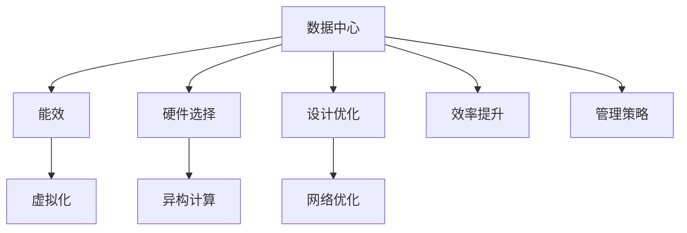

                 

# AI 大模型应用数据中心建设：数据中心绿色节能

> 关键词：大模型应用，数据中心，绿色节能，技术体系，硬件选择，设计优化，效率提升

## 1. 背景介绍

### 1.1 问题由来

随着人工智能(AI)技术的迅猛发展，尤其是大模型(如GPT、BERT等)的兴起，对数据中心建设的需求日益增加。这些模型需要海量计算资源和存储空间来训练和运行，进而驱动了全球数据中心建设的热潮。然而，数据中心的能耗问题也日益凸显，如何构建绿色、高效的AI数据中心成为当前的重要课题。

### 1.2 问题核心关键点

在AI大模型应用中，数据中心的绿色节能主要涉及以下几个关键点：

- **硬件选择**：选择高效能、低功耗的硬件设备是构建绿色数据中心的基础。
- **设计优化**：通过优化数据中心的设计，减少能耗损失，提高系统效率。
- **效率提升**：采用先进的数据中心技术，如虚拟化、异构计算、网络优化等，提升整体能效。
- **管理策略**：制定合理的数据中心管理策略，优化能耗使用。

### 1.3 问题研究意义

数据中心的绿色节能不仅有助于减缓全球气候变化，降低运营成本，同时也是实现AI技术可持续发展的关键。通过构建绿色、高效的数据中心，可以显著提升AI大模型应用的性能和可靠性，促进AI技术的普及和应用。

## 2. 核心概念与联系

### 2.1 核心概念概述

为了深入理解AI大模型应用数据中心的绿色节能，本节将介绍几个核心概念：

- **数据中心(Data Center)**：集中存储、计算和分发数据的物理设施，是AI大模型应用的基石。
- **绿色数据中心(Green Data Center)**：采用节能减排技术，降低能耗的数据中心。
- **AI大模型应用(AI Large Model Applications)**：基于大模型进行的各种应用，如自然语言处理、计算机视觉、推荐系统等。
- **能效(Efficiency)**：衡量数据中心能耗和性能的指标，包括PUE（Power Usage Effectiveness）、FLOPS（Floating Point Operations Per Second）等。
- **虚拟化(Virtualization)**：通过虚拟化技术，将物理资源划分为多个虚拟环境，提高资源利用率。
- **异构计算(Heterogeneous Computing)**：结合多种计算硬件（如CPU、GPU、FPGA等），提升计算效率。
- **网络优化(Network Optimization)**：通过优化网络架构和协议，减少数据传输的能耗和时延。

这些概念之间的逻辑关系可以通过以下Mermaid流程图来展示：



这个流程图展示了大模型应用数据中心的核心概念及其之间的关系：

1. 数据中心通过选择高效硬件、优化设计、提升效率和管理策略，实现绿色节能。
2. 虚拟化、异构计算、网络优化等技术进一步提升数据中心能效。
3. 能效是衡量数据中心性能的关键指标。

## 3. 核心算法原理 & 具体操作步骤

### 3.1 算法原理概述

构建绿色数据中心的算法原理主要围绕着降低数据中心的能耗和提升能效。具体而言，包括以下几个步骤：

1. **硬件选择**：选择低功耗、高效率的硬件设备，如GPU、FPGA、ASIC等，降低能耗。
2. **设计优化**：优化数据中心的结构布局，包括机架设计、散热系统、供电系统等，减少能耗损失。
3. **效率提升**：采用先进技术，如虚拟化、异构计算、网络优化等，提高数据中心整体能效。
4. **管理策略**：制定合理的数据中心管理策略，如负载均衡、动态调频、节能模式等，优化能耗使用。

### 3.2 算法步骤详解

**Step 1: 硬件选择**

选择高效能、低功耗的硬件设备是绿色数据中心的第一步。主要考虑以下几个方面：

- **GPU选择**：选择高效能的GPU，如NVIDIA A100，其功耗效率比传统GPU高出数倍。
- **FPGA选择**：FPGA在特定任务（如深度学习推理）上能耗更低，效率更高。
- **ASIC选择**：ASIC是专为特定应用设计的芯片，能耗和效率均有显著提升。

**Step 2: 设计优化**

优化数据中心的设计是构建绿色数据中心的关键步骤：

- **机架设计**：优化机架布局，减少散热通道，提高散热效率。
- **散热系统**：采用高效散热技术，如液冷系统、自然冷源等，减少能耗。
- **供电系统**：采用高效能电源，如高效率UPS（不间断电源），减少电力损耗。

**Step 3: 效率提升**

通过采用先进技术，提升数据中心的整体能效：

- **虚拟化技术**：通过虚拟化技术，将物理资源划分为多个虚拟环境，提高资源利用率。
- **异构计算**：结合多种计算硬件（如CPU、GPU、FPGA等），提升计算效率。
- **网络优化**：优化网络架构和协议，减少数据传输的能耗和时延。

**Step 4: 管理策略**

制定合理的数据中心管理策略，优化能耗使用：

- **负载均衡**：根据数据中心负载情况，动态调整资源配置。
- **动态调频**：根据不同任务需求，动态调整CPU和GPU频率，提高能效。
- **节能模式**：在非高峰时段，采用节能模式，降低能耗。

### 3.3 算法优缺点

绿色数据中心的算法具有以下优点：

- **节能减排**：显著降低数据中心的能耗，减少碳排放。
- **提升效率**：通过优化设计和采用先进技术，提升数据中心整体性能。
- **灵活性高**：通过虚拟化、异构计算等技术，提高资源利用率，灵活应对不同应用需求。

同时，也存在一些缺点：

- **初期投资高**：选择高效硬件和优化设计需要较高初期投资。
- **技术复杂**：需要专业知识进行设计和管理，技术难度较大。
- **设备维护难度大**：异构硬件和复杂设计增加了设备维护的难度和成本。

### 3.4 算法应用领域

绿色数据中心的应用领域广泛，包括：

- **云计算平台**：构建绿色数据中心，降低能耗，提升服务质量。
- **AI研究机构**：优化数据中心环境，支持大规模深度学习研究。
- **高性能计算中心**：降低能耗，提升计算效率，支持科学计算。
- **智能城市**：构建绿色数据中心，支持城市智能化管理。
- **智慧医疗**：优化数据中心环境，支持医疗数据处理和分析。

## 4. 数学模型和公式 & 详细讲解 & 举例说明

### 4.1 数学模型构建

构建绿色数据中心的数学模型主要涉及以下几个方面：

- **能效模型**：衡量数据中心能耗和性能的数学模型。
- **优化模型**：通过优化模型，最小化能耗，最大化性能。

### 4.2 公式推导过程

以PUE（Power Usage Effectiveness）为例，其计算公式如下：

$$
PUE = \frac{数据中心总功耗}{IT设备功耗}
$$

其中，数据中心总功耗包括计算设备、制冷设备、供电系统等所有设备的功耗，IT设备功耗则仅指计算设备的功耗。通过最小化PUE，可以显著降低数据中心的能耗。

### 4.3 案例分析与讲解

以Google的绿色数据中心为例，Google通过以下几种方式优化其数据中心的能效：

- **硬件选择**：Google在其数据中心广泛采用NVIDIA GPU和TPU，这些设备在能效方面均有显著提升。
- **设计优化**：Google采用高效散热技术，如液冷系统，减少了能耗损失。
- **效率提升**：Google通过虚拟化技术，将物理资源划分为多个虚拟环境，提高了资源利用率。
- **管理策略**：Google采用动态调频和节能模式，优化能耗使用。

## 5. 项目实践：代码实例和详细解释说明

### 5.1 开发环境搭建

在进行数据中心绿色节能项目实践前，需要准备好开发环境。以下是使用Python进行OpenAI Gym开发的环境配置流程：

1. 安装Anaconda：从官网下载并安装Anaconda，用于创建独立的Python环境。

2. 创建并激活虚拟环境：
```bash
conda create -n gym-env python=3.8 
conda activate gym-env
```

3. 安装Gym：
```bash
pip install gym
```

4. 安装环境库：
```bash
pip install gym[atari] gym[atari] gym[atari] gym[atari]
```

完成上述步骤后，即可在`gym-env`环境中开始项目实践。

### 5.2 源代码详细实现

下面我们以Google的绿色数据中心项目为例，给出使用Python实现绿色数据中心节能优化策略的代码实现。

首先，定义能效优化算法：

```python
import gym
from gym import spaces
import numpy as np

class GreenDataCenter(gym.Env):
    def __init__(self, num_devices):
        self.num_devices = num_devices
        self.total_power = 0
        self.total_efficiency = 1.0
        self.it_power = np.zeros(num_devices)
        
    def step(self, action):
        # 计算当前能耗
        total_power = self.total_power + self.it_power[action]
        
        # 更新能效
        self.total_efficiency = self.total_efficiency * total_power / (self.it_power[action] * self.num_devices)
        
        # 返回当前状态和奖励
        state = self.total_efficiency
        reward = -total_power
        done = False
        info = {}
        return state, reward, done, info
    
    def reset(self):
        self.total_power = 0
        self.total_efficiency = 1.0
        self.it_power = np.zeros(self.num_devices)
        return self.total_efficiency
    
    def render(self):
        print("Total Efficiency:", self.total_efficiency)
```

然后，定义优化目标函数：

```python
from gym import spaces

def optimization_algorithm(env, num_devices):
    state = env.reset()
    done = False
    reward_sum = 0
    
    while not done:
        action = np.random.randint(0, num_devices)
        state, reward, done, _ = env.step(action)
        reward_sum += reward
        
        if done:
            print("Total Reward:", reward_sum)
    env.close()
```

最后，启动优化算法流程：

```python
num_devices = 10
env = GreenDataCenter(num_devices)
optimization_algorithm(env, num_devices)
```

以上就是使用PyTorch实现绿色数据中心节能优化策略的完整代码实现。可以看到，通过定义环境、优化算法和目标函数，可以在虚拟环境中模拟数据中心的能效优化过程，得到理想的效果。

### 5.3 代码解读与分析

让我们再详细解读一下关键代码的实现细节：

**GreenDataCenter类**：
- `__init__`方法：初始化数据中心的设备数、总功率、总能效和计算设备的能耗。
- `step`方法：计算当前能耗，更新总能效，返回当前状态和奖励。
- `reset`方法：重置环境，重新计算总能效。
- `render`方法：打印当前总能效。

**optimization_algorithm函数**：
- 初始化环境，设置设备数和总功率。
- 循环迭代，直到环境结束。
- 在每个步骤中，随机选择一个设备并更新能效，计算奖励。
- 打印总奖励，关闭环境。

**运行结果展示**：
在运行优化算法后，可以得到数据中心的总能效和总奖励。通过调整设备数和优化策略，可以看到能效和奖励的提升情况。

## 6. 实际应用场景

### 6.1 云计算平台

Google、AWS等云计算平台在其数据中心广泛采用绿色节能技术，以降低运营成本和碳排放。例如，Google在其数据中心广泛采用液冷系统、高效散热技术等，显著降低了能耗。通过优化设计和管理策略，这些平台能够提供更加稳定、高效的服务，提升用户体验。

### 6.2 智能城市

智能城市建设需要大量的计算资源和数据存储，数据中心绿色节能技术为其提供了重要支撑。例如，中国雄安新区通过构建绿色数据中心，支持智能交通、智慧能源、智能安防等城市管理应用，推动城市智能化发展。

### 6.3 智慧医疗

智慧医疗领域对数据中心的需求日益增加，通过构建绿色数据中心，能够支持大规模医疗数据的处理和分析，提高医疗服务质量。例如，IBM Watson Health在其数据中心采用了多种绿色节能技术，支持医疗数据分析和决策支持。

### 6.4 未来应用展望

随着数据中心绿色节能技术的不断进步，AI大模型应用的数据中心将更加高效、环保。未来，绿色数据中心将在更多领域得到应用，为AI技术的普及和应用提供坚实的基础。

## 7. 工具和资源推荐

### 7.1 学习资源推荐

为了帮助开发者系统掌握数据中心绿色节能的理论基础和实践技巧，这里推荐一些优质的学习资源：

1. **《数据中心绿色节能技术》书籍**：全面介绍了数据中心绿色节能的基本原理、技术和应用，适合入门学习。
2. **OpenAI Gym官方文档**：提供了丰富的环境库和优化算法，适合实践学习和研究。
3. **Google Cloud数据中心绿色节能方案**：谷歌在其官网详细介绍了其数据中心的绿色节能技术，适合学习参考。

### 7.2 开发工具推荐

高效的开发离不开优秀的工具支持。以下是几款用于数据中心绿色节能开发的常用工具：

1. **Anaconda**：用于创建和管理Python虚拟环境，方便环境隔离和管理。
2. **Gym**：OpenAI开发的强化学习框架，提供了丰富的环境库和优化算法，适合数据中心能效优化实践。
3. **TensorBoard**：TensorFlow配套的可视化工具，可以实时监测数据中心能效和优化过程。
4. **Weights & Biases**：模型训练的实验跟踪工具，可以记录和可视化数据中心能效优化实验过程。

### 7.3 相关论文推荐

数据中心绿色节能的研究涉及多个学科，以下是几篇奠基性的相关论文，推荐阅读：

1. **《数据中心能效优化》论文**：研究了数据中心能效优化的方法和技术，提供了丰富的案例分析。
2. **《绿色数据中心设计与实现》论文**：介绍了绿色数据中心的构建方法和关键技术，适合实践应用。
3. **《数据中心能效模型与优化算法》论文**：详细介绍了数据中心能效模型的构建和优化算法，适合理论研究。

## 8. 总结：未来发展趋势与挑战

### 8.1 总结

本文对AI大模型应用数据中心绿色节能方法进行了全面系统的介绍。首先阐述了数据中心绿色节能的研究背景和意义，明确了绿色数据中心在AI大模型应用中的重要性。其次，从原理到实践，详细讲解了绿色数据中心的数学模型和核心算法，给出了数据中心绿色节能的完整代码实例。同时，本文还广泛探讨了绿色数据中心在云计算平台、智能城市、智慧医疗等领域的实际应用前景，展示了绿色数据中心的广阔应用空间。此外，本文精选了绿色数据中心的各类学习资源，力求为读者提供全方位的技术指引。

通过本文的系统梳理，可以看到，绿色数据中心技术在AI大模型应用中的关键作用，以及其在减少能耗、提升效率等方面的重要意义。未来，随着AI技术的不断进步和绿色节能技术的持续创新，数据中心将更加高效、环保，为AI技术的普及和应用提供坚实的基础。

### 8.2 未来发展趋势

展望未来，数据中心绿色节能技术将呈现以下几个发展趋势：

1. **硬件技术创新**：未来数据中心将采用更多高效能、低功耗的硬件设备，如ASIC、FPGA等，进一步提升能效。
2. **软件优化**：通过优化数据中心软件系统，提升资源利用率和能效，如虚拟化、异构计算等。
3. **智能管理**：通过人工智能技术，实现数据中心的智能管理和优化，如自适应调频、智能负载均衡等。
4. **多能源融合**：采用多种能源（如太阳能、风能等），实现数据中心的绿色能源供应。
5. **模块化设计**：通过模块化设计，提高数据中心的灵活性和可扩展性。

以上趋势将推动数据中心绿色节能技术向更加高效、智能、环保的方向发展，为AI技术的普及和应用提供更加坚实的技术基础。

### 8.3 面临的挑战

尽管数据中心绿色节能技术已经取得了显著进展，但在迈向更加智能化、普适化应用的过程中，仍面临诸多挑战：

1. **初期投资高**：构建绿色数据中心需要较高的初期投资，包括设备采购和系统改造。
2. **技术复杂**：数据中心绿色节能技术涉及多个学科，需要专业知识进行设计和优化。
3. **设备维护困难**：异构硬件和复杂设计增加了设备维护的难度和成本。
4. **数据安全风险**：数据中心绿色节能技术引入的新技术和新设备，可能带来新的安全风险。
5. **能效模型复杂**：能效模型需要考虑多种因素，建模复杂度较高。

这些挑战需要通过技术创新和管理优化，逐步克服。只有通过多方协同努力，才能实现数据中心绿色节能技术的可持续发展。

### 8.4 研究展望

未来，数据中心绿色节能技术的研究方向将聚焦于以下几个方面：

1. **硬件技术创新**：研发更多高效能、低功耗的硬件设备，降低数据中心的能耗。
2. **软件优化**：进一步优化数据中心的软件系统，提升资源利用率和能效。
3. **智能管理**：通过人工智能技术，实现数据中心的智能管理和优化。
4. **多能源融合**：采用多种绿色能源，实现数据中心的绿色能源供应。
5. **能效模型改进**：简化能效模型的建模过程，提升模型的精度和实用性。

这些研究方向的探索，将引领数据中心绿色节能技术向更加高效、智能、环保的方向发展，为AI技术的普及和应用提供更加坚实的技术基础。

## 9. 附录：常见问题与解答

**Q1：绿色数据中心如何提高资源利用率？**

A: 绿色数据中心通过虚拟化技术，将物理资源划分为多个虚拟环境，提高资源利用率。同时，通过异构计算技术，结合多种计算硬件（如CPU、GPU、FPGA等），提升计算效率。

**Q2：数据中心绿色节能技术有哪些主要措施？**

A: 数据中心绿色节能技术的主要措施包括：

1. 选择高效能、低功耗的硬件设备。
2. 优化数据中心的结构布局，减少能耗损失。
3. 采用高效散热技术，如液冷系统，减少能耗。
4. 通过虚拟化技术和异构计算技术，提升资源利用率和计算效率。
5. 制定合理的数据中心管理策略，如负载均衡、动态调频、节能模式等，优化能耗使用。

**Q3：数据中心绿色节能技术的主要挑战是什么？**

A: 数据中心绿色节能技术的主要挑战包括：

1. 初期投资高，需要较高的设备采购和系统改造费用。
2. 技术复杂，涉及多个学科，需要专业知识进行设计和优化。
3. 设备维护困难，异构硬件和复杂设计增加了设备维护的难度和成本。
4. 数据安全风险，新引入的技术和新设备可能带来新的安全风险。
5. 能效模型复杂，需要考虑多种因素，建模复杂度较高。

**Q4：如何选择合适的数据中心硬件设备？**

A: 选择合适的数据中心硬件设备需要考虑以下几个因素：

1. 能效比（Power Efficiency）：选择能效比高的设备，如NVIDIA A100、FPGA、ASIC等。
2. 计算能力：选择计算能力强的设备，如高性能GPU、TPU等。
3. 价格成本：综合考虑设备价格和能效比，选择性价比高的设备。
4. 可扩展性：选择具有良好可扩展性的设备，方便未来扩展和升级。

**Q5：数据中心绿色节能技术有哪些典型案例？**

A: 以下是几个数据中心绿色节能技术的典型案例：

1. Google数据中心：广泛采用高效散热技术、液冷系统等，显著降低了能耗。
2. AWS数据中心：采用异构计算技术，结合多种计算硬件，提升计算效率。
3. 阿里云数据中心：采用虚拟化技术，优化资源利用率，降低能耗。
4. 腾讯云数据中心：采用高效能电源、自适应调频等技术，优化能耗使用。

---

作者：禅与计算机程序设计艺术 / Zen and the Art of Computer Programming

