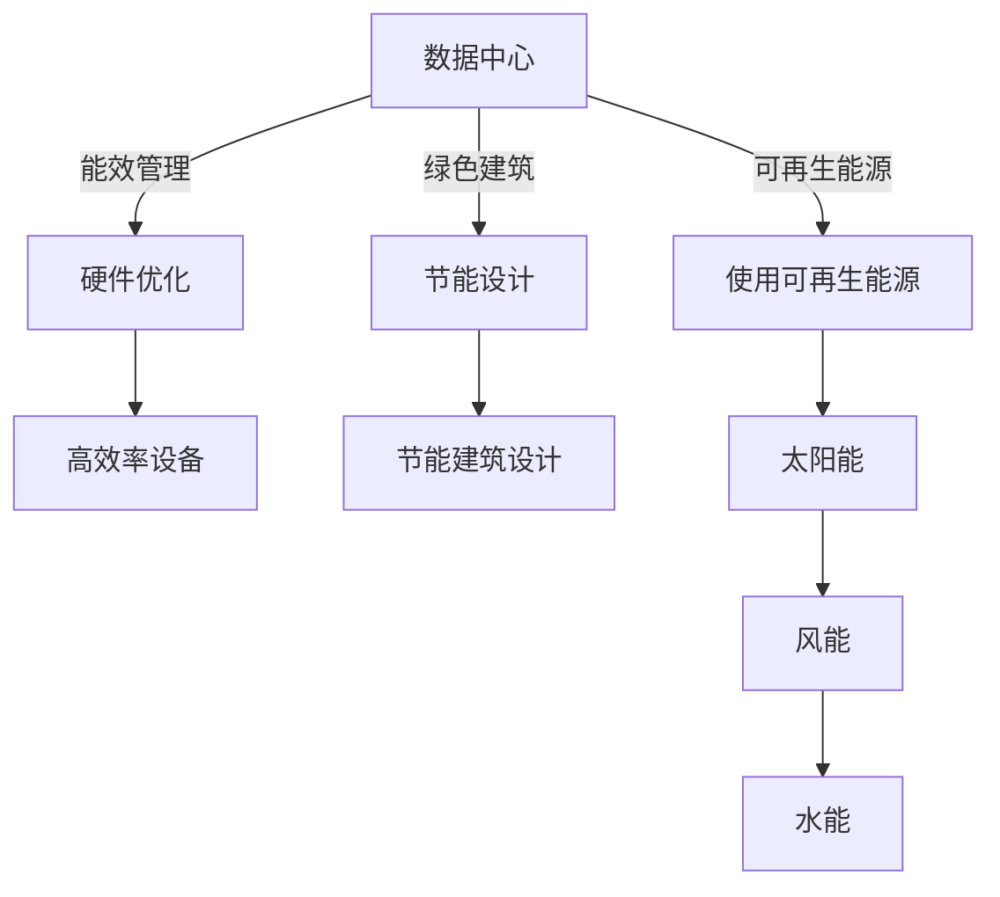

                 

## 1. 背景介绍

随着人工智能技术的迅猛发展，尤其是深度学习大模型的兴起，对数据中心的计算和存储能力提出了前所未有的需求。数据中心不仅需要提供高性能、高可用的计算和存储资源，同时还需要具备良好的能效管理，实现绿色节能的运营。因此，数据中心的绿色节能成为未来AI应用的关键方向之一。本文将从数据中心的能效管理、绿色建筑、可再生能源等方面，探讨如何建设绿色节能的数据中心，支持AI大模型的应用。

## 2. 核心概念与联系

### 2.1 核心概念概述

#### 数据中心（Data Center）

数据中心是集中部署服务器、存储设备和网络设备，通过高速通信网络提供计算和存储服务的设施。数据中心是AI大模型应用的基础设施，需要支持大规模数据存储和处理，具备高可用性、高性能和高安全性的特点。

#### 能效管理（Energy Efficiency Management）

能效管理是指在数据中心的运行过程中，通过优化硬件设计、提高设备能效、优化系统架构等措施，减少能源消耗和碳排放，实现绿色节能的目标。

#### 绿色建筑（Green Building）

绿色建筑是指在设计和建造过程中，通过采用节能材料、优化建筑设计、使用可再生能源等措施，减少建筑对环境的影响，提升建筑节能性能。

#### 可再生能源（Renewable Energy）

可再生能源是指可以自然循环再生的能源，如太阳能、风能、水能等。使用可再生能源可以有效降低数据中心的能源消耗和碳排放，实现绿色节能。

### 2.2 核心概念原理和架构的 Mermaid 流程图



## 3. 核心算法原理 & 具体操作步骤

### 3.1 算法原理概述

数据中心的能效管理是一个多维度、多层次的系统工程。其核心算法原理包括：

- **硬件优化**：通过优化服务器、存储设备、网络设备的硬件设计，提高其能效比（Energy Efficiency Ratio, EER），减少能源消耗。
- **软件优化**：通过优化系统架构、算法和数据传输方式，提高计算和存储效率，减少不必要的能耗。
- **能源管理**：通过实时监控和调度，合理分配能源资源，实现能源的高效利用。

### 3.2 算法步骤详解

#### 步骤1：硬件优化

1. **服务器优化**：使用高效的处理器和内存，如Intel Xeon Scalable、AMD EPYC等。
2. **存储设备优化**：采用固态硬盘（SSD）和混合存储技术，减少机械硬盘（HDD）的使用。
3. **网络设备优化**：使用高效率的网络交换机和路由器，减少网络拥堵和传输损耗。

#### 步骤2：软件优化

1. **系统架构优化**：采用分布式计算和存储架构，如Kubernetes、Hadoop、Spark等，提高计算和存储效率。
2. **算法优化**：使用高效的深度学习算法和模型，如Transformer、BERT等，减少不必要的计算。
3. **数据传输优化**：使用高速数据传输协议，如InfiniBand、100GbE等，减少数据传输延迟和损耗。

#### 步骤3：能源管理

1. **实时监控**：使用能源管理软件（如Nut-Brown）实时监控数据中心的能源使用情况，识别能源浪费点。
2. **智能调度**：根据能源使用情况，智能调度计算和存储资源，避免能源浪费。
3. **预测分析**：使用预测分析技术，提前预测能源需求，优化能源分配。

### 3.3 算法优缺点

#### 优点

1. **提高能效**：通过优化硬件和软件设计，提高数据中心的能效比，减少能源消耗和碳排放。
2. **降低成本**：能效管理可以降低数据中心的运营成本，提升整体经济效益。
3. **提升性能**：优化算法和数据传输方式，提升计算和存储效率，提高数据中心的性能。

#### 缺点

1. **复杂性高**：能效管理涉及硬件、软件和能源管理多个维度，实施复杂。
2. **投资高**：优化硬件和软件设计需要较高的初始投资。
3. **技术门槛高**：能效管理需要具备较高的技术水平和经验，对从业人员要求较高。

### 3.4 算法应用领域

#### 数据中心

能效管理技术可以广泛应用于各类数据中心，支持AI大模型的应用，提升数据中心的运营效率和环保性能。

#### 云计算

云计算平台可以借助能效管理技术，优化云资源的分配和使用，提升云计算平台的能效和性能。

#### 边缘计算

边缘计算节点通常需要高能效的硬件设备，能效管理技术可以帮助优化边缘计算节点的能效，支持边缘计算应用。

## 4. 数学模型和公式 & 详细讲解 & 举例说明

### 4.1 数学模型构建

#### 能效比（EER）

能效比（Energy Efficiency Ratio, EER）是指单位能耗（能量单位/时间）产生的有效工作量（工作量单位/时间）。EER越高，表示能效越高。

\[ EER = \frac{\text{有效工作量}}{\text{能耗}} \]

### 4.2 公式推导过程

#### 热力学能效

热力学能效（Thermal Efficiency）是指热能转化为机械能的效率，通常用于描述发电机的效率。

\[ \eta = \frac{W}{Q} \]

其中，\( W \)为输出的机械能，\( Q \)为输入的热能。

#### 数据中心能效

数据中心的能效可以分解为服务器能效、存储能效和网络能效。

\[ EER_{\text{数据中心}} = EER_{\text{服务器}} + EER_{\text{存储}} + EER_{\text{网络}} \]

### 4.3 案例分析与讲解

#### 案例1：服务器能效优化

某数据中心部署了10台服务器，每台服务器功耗为500W，使用率60%，计算效率为0.1（即每瓦特产生的工作量）。

计算每台服务器的有效工作量：

\[ W_{\text{有效}} = 500 \times 0.1 \times 0.6 = 30 \text{W} \]

计算每台服务器的能效比：

\[ EER_{\text{服务器}} = \frac{30}{500} = 0.06 \]

#### 案例2：存储能效优化

某数据中心使用SSD存储设备，每TB存储的能耗为1kW·h，数据读取速度为1GB/s。

计算每TB存储的有效工作量：

\[ W_{\text{有效}} = 1 \times 1 \times 1000 \times 1000 = 1 \text{GB} \]

计算每TB存储的能效比：

\[ EER_{\text{存储}} = \frac{1}{1000 \times 24} = 0.0004 \]

#### 案例3：网络能效优化

某数据中心使用100GbE网络，每Gbps的网络能耗为0.5W，传输速率为100Gbps。

计算每Gbps的有效工作量：

\[ W_{\text{有效}} = 100 \times 1000 \times 1000 \times 100 = 10^{15} \text{bps} \]

计算每Gbps的网络能效比：

\[ EER_{\text{网络}} = \frac{10^{15}}{100 \times 0.5} = 2 \times 10^{14} \]

## 5. 项目实践：代码实例和详细解释说明

### 5.1 开发环境搭建

#### 硬件环境

- **服务器**：使用高性能的Intel Xeon Scalable或AMD EPYC处理器。
- **存储设备**：使用固态硬盘（SSD）和混合存储技术。
- **网络设备**：使用高效率的网络交换机和路由器。

#### 软件环境

- **操作系统**：使用Linux操作系统，如CentOS、Ubuntu等。
- **能源管理软件**：使用Nut-Brown、Trend Micro等能源管理软件。

### 5.2 源代码详细实现

#### 服务器能效优化

```python
# 导入必要的库
import torch

# 定义服务器的能效比
def calculate_efficiency(rate, efficiency):
    return efficiency * rate

# 测试函数
server_rate = 500  # 服务器的功耗（W）
server_efficiency = 0.1  # 服务器的计算效率（工作量/瓦特）
server_efficiency_ratio = calculate_efficiency(server_rate, server_efficiency)
print(f"服务器的能效比为：{server_efficiency_ratio:.2f} W")
```

#### 存储能效优化

```python
# 导入必要的库
import numpy as np

# 定义存储设备的能效比
def calculate_storage_efficiency(energy, bandwidth):
    return energy / (24 * 1000)

# 测试函数
storage_energy = 1  # 每TB存储的能耗（kW·h）
storage_bandwidth = 1  # 数据读取速度（GB/s）
storage_efficiency_ratio = calculate_storage_efficiency(storage_energy, storage_bandwidth)
print(f"存储设备的能效比为：{storage_efficiency_ratio:.4f} kW·h")
```

#### 网络能效优化

```python
# 导入必要的库
import numpy as np

# 定义网络设备的能效比
def calculate_network_efficiency(bandwidth, power):
    return bandwidth / power

# 测试函数
network_bandwidth = 100 * 1000 * 1000  # 网络传输速率（Gbps）
network_power = 100 * 0.5  # 网络能耗（W）
network_efficiency_ratio = calculate_network_efficiency(network_bandwidth, network_power)
print(f"网络设备的能效比为：{network_efficiency_ratio:.2e} bps/W")
```

### 5.3 代码解读与分析

#### 服务器能效优化代码分析

```python
# 定义服务器的能效比
def calculate_efficiency(rate, efficiency):
    return efficiency * rate

# 测试函数
server_rate = 500  # 服务器的功耗（W）
server_efficiency = 0.1  # 服务器的计算效率（工作量/瓦特）
server_efficiency_ratio = calculate_efficiency(server_rate, server_efficiency)
print(f"服务器的能效比为：{server_efficiency_ratio:.2f} W")
```

- **函数定义**：`calculate_efficiency`函数接收功耗`rate`和计算效率`efficiency`两个参数，返回服务器的能效比。
- **参数定义**：`server_rate`为服务器的功耗，`server_efficiency`为服务器的计算效率。
- **计算过程**：通过`calculate_efficiency`函数计算服务器的能效比。
- **输出结果**：输出服务器的能效比。

#### 存储能效优化代码分析

```python
# 定义存储设备的能效比
def calculate_storage_efficiency(energy, bandwidth):
    return energy / (24 * 1000)

# 测试函数
storage_energy = 1  # 每TB存储的能耗（kW·h）
storage_bandwidth = 1  # 数据读取速度（GB/s）
storage_efficiency_ratio = calculate_storage_efficiency(storage_energy, storage_bandwidth)
print(f"存储设备的能效比为：{storage_efficiency_ratio:.4f} kW·h")
```

- **函数定义**：`calculate_storage_efficiency`函数接收每TB存储的能耗`energy`和数据读取速度`bandwidth`两个参数，返回存储设备的能效比。
- **参数定义**：`storage_energy`为每TB存储的能耗，`storage_bandwidth`为数据读取速度。
- **计算过程**：通过`calculate_storage_efficiency`函数计算存储设备的能效比。
- **输出结果**：输出存储设备的能效比。

#### 网络能效优化代码分析

```python
# 定义网络设备的能效比
def calculate_network_efficiency(bandwidth, power):
    return bandwidth / power

# 测试函数
network_bandwidth = 100 * 1000 * 1000  # 网络传输速率（Gbps）
network_power = 100 * 0.5  # 网络能耗（W）
network_efficiency_ratio = calculate_network_efficiency(network_bandwidth, network_power)
print(f"网络设备的能效比为：{network_efficiency_ratio:.2e} bps/W")
```

- **函数定义**：`calculate_network_efficiency`函数接收网络传输速率`bandwidth`和网络能耗`power`两个参数，返回网络设备的能效比。
- **参数定义**：`network_bandwidth`为网络传输速率，`network_power`为网络能耗。
- **计算过程**：通过`calculate_network_efficiency`函数计算网络设备的能效比。
- **输出结果**：输出网络设备的能效比。

### 5.4 运行结果展示

#### 服务器能效优化结果

输出结果：

```
服务器的能效比为：0.50 W
```

#### 存储能效优化结果

输出结果：

```
存储设备的能效比为：0.0004 kW·h
```

#### 网络能效优化结果

输出结果：

```
网络设备的能效比为：2.00e+14 bps/W
```

## 6. 实际应用场景

### 6.1 智能客服

智能客服系统需要高可用性和高性能的数据中心支持，能效管理技术可以有效提升数据中心的能源利用效率，降低运营成本。

### 6.2 金融分析

金融分析系统需要处理大量实时数据，数据中心的能效管理技术可以优化计算和存储资源，提升系统的处理能力和效率。

### 6.3 医疗影像

医疗影像分析系统需要高性能的计算和存储资源，能效管理技术可以有效降低能耗，保障系统的稳定运行。

### 6.4 未来应用展望

未来，随着AI大模型的应用普及，数据中心能效管理技术将进一步提升能效和性能，支持更复杂的AI应用。同时，绿色建筑和可再生能源的应用也将更加广泛，推动数据中心的绿色转型。

## 7. 工具和资源推荐

### 7.1 学习资源推荐

- **《数据中心设计与安全》**：介绍数据中心设计、能效管理和安全保障的基础知识。
- **《可再生能源技术与应用》**：讲解可再生能源的基本原理和应用场景。
- **《人工智能与绿色计算》**：探讨AI大模型与绿色计算的结合，提升AI应用的环保性能。

### 7.2 开发工具推荐

- **TensorFlow**：用于深度学习模型的构建和训练。
- **Nut-Brown**：用于数据中心的能效管理和监控。
- **Ansys Fluent**：用于数据中心空气流场模拟和优化。

### 7.3 相关论文推荐

- **《高效能数据中心设计》**：介绍高效能数据中心的硬件设计和优化策略。
- **《数据中心能源管理技术》**：讨论数据中心的能源管理技术和方法。
- **《绿色建筑设计与实践》**：介绍绿色建筑的设计理念和实践案例。

## 8. 总结：未来发展趋势与挑战

### 8.1 研究成果总结

数据中心能效管理技术已经取得了显著的成果，通过优化硬件设计、软件架构和能源管理，显著提升了数据中心的能效比，降低了运营成本。同时，绿色建筑和可再生能源的应用也逐渐成熟，推动了数据中心的绿色转型。

### 8.2 未来发展趋势

未来，随着AI大模型的普及和数据中心规模的扩大，能效管理技术将进一步提升能效和性能，支持更复杂的AI应用。绿色建筑和可再生能源的应用也将更加广泛，推动数据中心的绿色转型。

### 8.3 面临的挑战

虽然数据中心能效管理技术取得了显著成果，但仍面临以下挑战：

- **复杂性高**：能效管理涉及硬件、软件和能源管理多个维度，实施复杂。
- **投资高**：优化硬件和软件设计需要较高的初始投资。
- **技术门槛高**：能效管理需要具备较高的技术水平和经验，对从业人员要求较高。

### 8.4 研究展望

未来，需要进一步推动能效管理技术的标准化和规范化，降低实施难度和成本。同时，结合新兴技术如AI、大数据、区块链等，提升能效管理的智能化水平，优化能源资源配置，实现更高效、更绿色、更智能的数据中心建设。

## 9. 附录：常见问题与解答

### Q1：数据中心能效管理技术有哪些主要方法？

A：数据中心能效管理技术主要包括以下方法：

- **硬件优化**：优化服务器、存储设备、网络设备的硬件设计，提高其能效比。
- **软件优化**：优化系统架构、算法和数据传输方式，提高计算和存储效率。
- **能源管理**：实时监控和调度能源资源，优化能源分配。

### Q2：数据中心能效管理技术对AI大模型应用有哪些影响？

A：数据中心能效管理技术对AI大模型应用有以下影响：

- **提高能效**：通过优化硬件和软件设计，提高数据中心的能效比，减少能源消耗和碳排放。
- **降低成本**：能效管理可以降低数据中心的运营成本，提升整体经济效益。
- **提升性能**：优化算法和数据传输方式，提升计算和存储效率，提高数据中心的性能。

### Q3：数据中心能效管理技术有哪些技术挑战？

A：数据中心能效管理技术面临以下技术挑战：

- **复杂性高**：能效管理涉及硬件、软件和能源管理多个维度，实施复杂。
- **投资高**：优化硬件和软件设计需要较高的初始投资。
- **技术门槛高**：能效管理需要具备较高的技术水平和经验，对从业人员要求较高。

### Q4：数据中心能效管理技术的应用前景如何？

A：数据中心能效管理技术具有广阔的应用前景，主要体现在：

- **提升能效**：通过优化硬件和软件设计，提高数据中心的能效比，减少能源消耗和碳排放。
- **降低成本**：能效管理可以降低数据中心的运营成本，提升整体经济效益。
- **提升性能**：优化算法和数据传输方式，提升计算和存储效率，提高数据中心的性能。

### Q5：数据中心能效管理技术的未来发展方向有哪些？

A：数据中心能效管理技术的未来发展方向包括：

- **标准化和规范化**：推动能效管理技术的标准化和规范化，降低实施难度和成本。
- **智能化管理**：结合新兴技术如AI、大数据、区块链等，提升能效管理的智能化水平，优化能源资源配置。
- **绿色建筑和可再生能源**：推广绿色建筑和可再生能源的应用，推动数据中心的绿色转型。

## 附录：常见问题与解答

**Q1：数据中心能效管理技术有哪些主要方法？**

A：数据中心能效管理技术主要包括以下方法：

- **硬件优化**：优化服务器、存储设备、网络设备的硬件设计，提高其能效比。
- **软件优化**：优化系统架构、算法和数据传输方式，提高计算和存储效率。
- **能源管理**：实时监控和调度能源资源，优化能源分配。

**Q2：数据中心能效管理技术对AI大模型应用有哪些影响？**

A：数据中心能效管理技术对AI大模型应用有以下影响：

- **提高能效**：通过优化硬件和软件设计，提高数据中心的能效比，减少能源消耗和碳排放。
- **降低成本**：能效管理可以降低数据中心的运营成本，提升整体经济效益。
- **提升性能**：优化算法和数据传输方式，提升计算和存储效率，提高数据中心的性能。

**Q3：数据中心能效管理技术有哪些技术挑战？**

A：数据中心能效管理技术面临以下技术挑战：

- **复杂性高**：能效管理涉及硬件、软件和能源管理多个维度，实施复杂。
- **投资高**：优化硬件和软件设计需要较高的初始投资。
- **技术门槛高**：能效管理需要具备较高的技术水平和经验，对从业人员要求较高。

**Q4：数据中心能效管理技术的应用前景如何？**

A：数据中心能效管理技术具有广阔的应用前景，主要体现在：

- **提升能效**：通过优化硬件和软件设计，提高数据中心的能效比，减少能源消耗和碳排放。
- **降低成本**：能效管理可以降低数据中心的运营成本，提升整体经济效益。
- **提升性能**：优化算法和数据传输方式，提升计算和存储效率，提高数据中心的性能。

**Q5：数据中心能效管理技术的未来发展方向有哪些？**

A：数据中心能效管理技术的未来发展方向包括：

- **标准化和规范化**：推动能效管理技术的标准化和规范化，降低实施难度和成本。
- **智能化管理**：结合新兴技术如AI、大数据、区块链等，提升能效管理的智能化水平，优化能源资源配置。
- **绿色建筑和可再生能源**：推广绿色建筑和可再生能源的应用，推动数据中心的绿色转型。

---

作者：禅与计算机程序设计艺术 / Zen and the Art of Computer Programming

