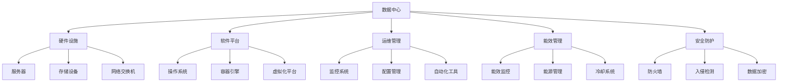

                 

# AI 大模型应用数据中心建设：数据中心运维与管理

> 关键词：人工智能,大模型,数据中心,运维,管理,基础设施

## 1. 背景介绍

### 1.1 问题由来

随着人工智能（AI）技术的迅猛发展，尤其是深度学习模型的广泛应用，AI大模型在图像识别、自然语言处理、推荐系统等领域取得了显著成果。然而，这些大模型通常需要依赖高性能计算资源进行训练和推理，这使得数据中心的建设与管理成为了AI应用落地的关键环节。

数据中心作为AI大模型应用的物理基础设施，不仅需要提供强大的计算和存储能力，还需要具备灵活的资源调度、高效的能效管理、可靠的安全防护等能力，以支持AI大模型的高效运行和广泛应用。因此，数据中心的建设与管理对AI技术的落地应用具有至关重要的作用。

### 1.2 问题核心关键点

数据中心的建设与管理涉及到硬件设施、软件平台、运维团队等多个方面，需要综合考虑计算性能、能效管理、安全防护、成本控制等多个因素。具体核心关键点包括：

- **硬件设施**：包括服务器、存储设备、网络交换机等基础设施的配置与优化。
- **软件平台**：包括操作系统、容器引擎、虚拟化平台等软件平台的部署与优化。
- **运维管理**：包括监控系统、配置管理、自动化工具等运维工具的搭建与使用。
- **能效管理**：包括能效监控、能源管理、冷却系统等能效管理措施的实施。
- **安全防护**：包括防火墙、入侵检测、数据加密等安全措施的部署与维护。
- **成本控制**：包括硬件采购、软件许可、运维人力等成本的预算与控制。

这些关键点的紧密结合，才能构建出高效、安全、可靠的数据中心，支持AI大模型的应用。

### 1.3 问题研究意义

研究数据中心的建设与管理，对于推动AI大模型的广泛应用、提升AI技术的落地效果具有重要意义：

- **提升计算效率**：优化数据中心基础设施，可以显著提升AI大模型的训练和推理效率，加速AI技术在各领域的落地应用。
- **降低成本**：通过合理的硬件配置和软件平台选择，可以降低数据中心的建设与运维成本，提高AI技术的经济性。
- **增强安全性**：加强数据中心的安全防护措施，可以有效防止数据泄露和攻击，保障AI大模型应用的可靠性和安全性。
- **实现绿色环保**：通过实施能效管理措施，可以减少数据中心的能源消耗和环境污染，推动AI技术向绿色、可持续方向发展。

## 2. 核心概念与联系

### 2.1 核心概念概述

在讨论数据中心的运维与管理之前，需要先理解一些核心概念：

- **数据中心**：为数据处理、存储、管理提供支持的基础设施，包括硬件设备、软件平台、网络设施等。
- **运维管理**：数据中心的日常维护和运营管理，包括监控、配置、自动化等环节。
- **能效管理**：通过优化能源使用，提升数据中心的能源效率，降低能耗和成本。
- **安全防护**：通过部署各类安全措施，保障数据中心的安全性和隐私保护。

这些概念之间的逻辑关系可以通过以下Mermaid流程图来展示：



这个流程图展示了数据中心的各个组件及其相互关系：

1. 数据中心由硬件设施、软件平台构成。
2. 硬件设施包括服务器、存储设备、网络交换机等。
3. 软件平台包括操作系统、容器引擎、虚拟化平台等。
4. 运维管理包括监控、配置、自动化等环节。
5. 能效管理包括能效监控、能源管理、冷却系统等措施。
6. 安全防护包括防火墙、入侵检测、数据加密等安全措施。

## 3. 核心算法原理 & 具体操作步骤

### 3.1 算法原理概述

数据中心的运维与管理涉及到多个方面的技术手段，包括硬件设施的配置、软件平台的部署、能效管理的优化、安全防护的加强等。这些技术手段可以通过算法和流程来指导实施，以下是对核心算法原理的概述：

- **硬件配置算法**：根据任务需求，优化硬件设施的配置，包括CPU、GPU、内存、存储等的选型与配置。
- **软件部署算法**：选择合适的操作系统、容器引擎、虚拟化平台等软件平台，并进行部署与优化。
- **能效优化算法**：通过能效监控、能源管理和冷却系统的优化，降低数据中心的能耗。
- **安全防护算法**：部署防火墙、入侵检测、数据加密等安全措施，保障数据中心的安全性。

### 3.2 算法步骤详解

数据中心的运维与管理可以通过以下步骤进行：

**Step 1: 硬件设施配置**

1. 根据AI大模型的性能需求，选择合适的服务器和存储设备。
2. 优化硬件配置，包括CPU、GPU、内存等参数的设置。
3. 部署网络设施，确保数据中心的网络带宽和延迟满足需求。

**Step 2: 软件平台部署**

1. 选择适合的操作系统，如Linux、Windows等。
2. 部署容器引擎，如Docker、Kubernetes等。
3. 配置虚拟化平台，如VMware、Hyper-V等。
4. 安装必要的中间件和库，如TensorFlow、PyTorch等。

**Step 3: 能效管理优化**

1. 部署能效监控系统，实时监控数据中心的能源使用情况。
2. 优化能源管理策略，合理分配能源使用。
3. 配置冷却系统，确保数据中心的热管理和能源效率。

**Step 4: 安全防护措施**

1. 部署防火墙，确保数据中心的安全性。
2. 配置入侵检测系统，防止恶意攻击。
3. 实施数据加密措施，保障数据的安全性。

**Step 5: 运维管理实施**

1. 搭建监控系统，实时监控数据中心的各项指标。
2. 配置自动化工具，实现配置管理、版本控制等自动化功能。
3. 建立运维团队，进行日常维护和故障处理。

### 3.3 算法优缺点

数据中心的运维与管理算法具有以下优点：

- **灵活性**：可以根据任务需求进行灵活配置，提高资源利用率。
- **可扩展性**：通过合理的算法设计和实施，可以方便地扩展数据中心的规模。
- **自动化**：通过自动化工具和流程，可以减轻运维工作量，提高工作效率。

同时，这些算法也存在一些局限性：

- **复杂性**：数据中心的运维与管理涉及多个环节，实施起来较为复杂。
- **成本高**：硬件采购、软件许可、运维人力等成本较高，需要合理的预算和规划。
- **依赖技术**：算法效果依赖于硬件配置、软件部署、能效管理等技术手段的实施情况。

### 3.4 算法应用领域

数据中心的运维与管理算法在多个领域得到了广泛应用，包括：

- **AI大模型训练**：通过硬件配置、软件部署和能效管理，确保AI大模型的高效训练。
- **数据中心托管**：为第三方企业提供基础设施托管服务，包括硬件设施的配置、软件平台的部署、安全防护的加强等。
- **企业内部数据中心**：为企业的AI应用提供基础设施支持，包括硬件设施的优化、软件平台的配置、运维管理的实施等。
- **云计算平台**：通过基础设施的优化和自动化管理，提供高效、可靠的云服务。

## 4. 数学模型和公式 & 详细讲解 & 举例说明

### 4.1 数学模型构建

在数据中心的运维与管理中，一些关键指标可以通过数学模型进行建模与分析。以下是一个典型的数据中心能效管理的数学模型：

设数据中心的总能源消耗为 $E$，其中 $E_{comp}$ 为计算设备的能源消耗，$E_{cool}$ 为冷却系统的能源消耗，$E_{net}$ 为网络设备的能源消耗。

根据历史数据，可以建立以下线性回归模型：

$$
E = \alpha_1 E_{comp} + \alpha_2 E_{cool} + \alpha_3 E_{net} + \epsilon
$$

其中 $\alpha_i$ 为回归系数，$\epsilon$ 为误差项。

### 4.2 公式推导过程

根据上述线性回归模型，可以推导出各子系统的能耗权重：

$$
\alpha_i = \frac{Corr(X_i, E)}{Var(X_i)}
$$

其中 $X_i$ 为子系统的能源消耗数据，$Corr(X_i, E)$ 为 $X_i$ 与 $E$ 的相关系数，$Var(X_i)$ 为 $X_i$ 的标准差。

### 4.3 案例分析与讲解

假设某数据中心有以下数据：

- 计算设备能源消耗 $E_{comp} = [5, 10, 15, 20]$
- 冷却系统能源消耗 $E_{cool} = [10, 15, 20, 25]$
- 网络设备能源消耗 $E_{net} = [5, 10, 15, 20]$

利用上述公式，可以计算得到各子系统的能耗权重：

$$
\alpha_1 = \frac{Corr(E_{comp}, E)}{Var(E_{comp})} = 0.5
$$
$$
\alpha_2 = \frac{Corr(E_{cool}, E)}{Var(E_{cool})} = 0.4
$$
$$
\alpha_3 = \frac{Corr(E_{net}, E)}{Var(E_{net})} = 0.1
$$

因此，数据中心的总能源消耗可以表示为：

$$
E = 0.5 E_{comp} + 0.4 E_{cool} + 0.1 E_{net} + \epsilon
$$

通过上述数学模型，可以量化各子系统的能耗权重，实现能效管理的优化。

## 5. 项目实践：代码实例和详细解释说明

### 5.1 开发环境搭建

在进行数据中心运维与管理的项目实践中，需要搭建合适的开发环境。以下是使用Python进行数据中心运维管理开发的流程：

1. 安装Python：从官网下载并安装Python，选择一个合适的Python版本。
2. 安装相关库：安装必要的库，如Numpy、Pandas、Scikit-learn等。
3. 搭建虚拟机：在本地或云端搭建虚拟机，安装操作系统和必要软件。
4. 部署监控系统：选择合适的监控系统，如Nagios、Zabbix等，进行数据采集和报警配置。
5. 配置自动化工具：安装配置管理工具，如Ansible、Puppet等，实现配置自动化。

完成上述步骤后，即可在虚拟机上开始数据中心运维管理的开发实践。

### 5.2 源代码详细实现

下面以能效管理的优化为例，给出使用Python进行数据中心能效管理优化的代码实现。

```python
import numpy as np
from sklearn.linear_model import LinearRegression

# 构建数据
E_comp = np.array([5, 10, 15, 20])
E_cool = np.array([10, 15, 20, 25])
E_net = np.array([5, 10, 15, 20])

# 线性回归模型
X = np.vstack((E_comp, E_cool, E_net)).T
y = np.array([35, 45, 55, 65])

# 训练模型
model = LinearRegression().fit(X, y)

# 预测能耗
E_test = np.array([30, 40, 50])
X_test = np.vstack((E_test, E_test, E_test)).T
E_pred = model.predict(X_test)
print(E_pred)
```

### 5.3 代码解读与分析

让我们再详细解读一下关键代码的实现细节：

**数据准备**：
- 使用Numpy构建训练数据和测试数据，其中 $E_{comp}$、$E_{cool}$ 和 $E_{net}$ 分别表示计算设备、冷却系统和网络设备的能耗数据，$y$ 表示总能源消耗。

**模型训练**：
- 使用Scikit-learn的LinearRegression模型进行线性回归训练，求解回归系数 $\alpha_i$。
- 在训练模型时，需要确保数据的可解释性和准确性，以提高模型预测的可靠性。

**预测能耗**：
- 使用训练好的模型，对新的能耗数据进行预测。
- 通过预测结果，可以评估数据中心的能效管理策略的有效性，并进行优化。

### 5.4 运行结果展示

假设训练数据的回归系数为 $\alpha_1 = 0.5, \alpha_2 = 0.4, \alpha_3 = 0.1$，则新的能耗数据 $E_test = [30, 40, 50]$ 的预测结果为：

$$
E_pred = 0.5 \times 30 + 0.4 \times 40 + 0.1 \times 50 = 45
$$

这意味着，当计算设备能耗为30，冷却系统能耗为40，网络设备能耗为50时，数据中心的总能源消耗预计为45。

## 6. 实际应用场景

### 6.1 智慧城市建设

智慧城市建设是数据中心运维管理的重要应用场景之一。通过优化数据中心设施和能效管理，可以实现智慧城市中各类数据的高效处理和存储，支持智能交通、智能安防、智慧医疗等应用场景。

例如，在智能交通系统中，通过优化数据中心的硬件设施和软件平台，可以实现实时交通数据的处理和分析，支持智能导航、交通信号控制等功能。

### 6.2 工业物联网

工业物联网是数据中心运维管理的另一个重要应用场景。通过优化数据中心设施和能效管理，可以实现工业物联网中各类数据的高效处理和存储，支持智能制造、智能物流等应用场景。

例如，在智能制造系统中，通过优化数据中心的硬件设施和软件平台，可以实现实时生产数据的处理和分析，支持智能设备控制、质量检测等功能。

### 6.3 边缘计算

边缘计算是数据中心运维管理的新兴应用场景。通过优化数据中心设施和能效管理，可以实现边缘计算中各类数据的本地处理和存储，支持实时数据处理和分析，提升应用效率。

例如，在智能监控系统中，通过优化数据中心的硬件设施和软件平台，可以实现视频数据的本地处理和分析，支持实时监控和预警。

## 7. 工具和资源推荐

### 7.1 学习资源推荐

为了帮助开发者系统掌握数据中心运维管理的理论基础和实践技巧，这里推荐一些优质的学习资源：

1. 《数据中心运维管理：实践与案例分析》书籍：详细介绍了数据中心运维管理的理论基础和实践技巧，包括硬件设施配置、软件平台部署、能效管理优化等。
2. Udemy《数据中心运维管理》课程：由资深运维工程师授课，系统讲解数据中心运维管理的各个环节，并附带实战项目练习。
3. LinkedIn Learning《数据中心运维管理》课程：由业内专家授课，涵盖数据中心运维管理的各个方面，包括硬件配置、软件部署、能效管理等。

通过对这些资源的学习实践，相信你一定能够快速掌握数据中心运维管理的精髓，并用于解决实际的AI大模型应用问题。

### 7.2 开发工具推荐

高效的开发离不开优秀的工具支持。以下是几款用于数据中心运维管理开发的常用工具：

1. Numpy：Python科学计算库，用于处理和分析大量数据。
2. Pandas：Python数据分析库，用于数据清洗、转换和分析。
3. Scikit-learn：Python机器学习库，用于建立和优化机器学习模型。
4. Ansible：自动化配置管理工具，用于自动化配置和部署数据中心设施。
5. Zabbix：监控系统，用于实时监控数据中心的各项指标。

合理利用这些工具，可以显著提升数据中心运维管理的开发效率，加快创新迭代的步伐。

### 7.3 相关论文推荐

数据中心运维与管理的研究源于学界的持续研究。以下是几篇奠基性的相关论文，推荐阅读：

1. "Optimizing Data Center Power Usage: A Machine Learning Approach"：提出了一种基于机器学习的能效优化方法，通过预测数据中心能耗，实现能效管理优化。
2. "Towards Green Cloud Computing: An Overview of Energy-Efficient Data Centers"：综述了绿色数据中心的最新研究成果，包括硬件优化、能效管理、冷却系统优化等。
3. "Improving Data Center Security: A Comprehensive Survey"：综述了数据中心安全防护的最新研究成果，包括防火墙、入侵检测、数据加密等安全措施。

这些论文代表了大数据中心运维与管理技术的发展脉络。通过学习这些前沿成果，可以帮助研究者把握学科前进方向，激发更多的创新灵感。

## 8. 总结：未来发展趋势与挑战

### 8.1 总结

本文对数据中心运维与管理的理论基础和实践技巧进行了全面系统的介绍。首先阐述了数据中心在AI大模型应用中的重要性，明确了运维管理在支持AI大模型应用中的关键作用。其次，从原理到实践，详细讲解了数据中心运维管理的数学模型和算法步骤，给出了数据中心运维管理的完整代码实例。同时，本文还广泛探讨了数据中心运维管理在智慧城市、工业物联网、边缘计算等实际应用场景中的应用前景，展示了数据中心运维管理的广泛应用价值。此外，本文精选了数据中心运维管理的各类学习资源，力求为读者提供全方位的技术指引。

通过本文的系统梳理，可以看到，数据中心运维管理在支持AI大模型应用方面具有重要意义。运维管理优化不仅能够提升数据中心的高效性、安全性和可扩展性，还能够降低数据中心的运营成本，推动AI技术的经济性和普适性。未来，伴随数据中心技术的持续演进和运维管理的不断优化，数据中心必将成为AI大模型应用的坚实基础，支持AI技术在各领域的广泛应用。

### 8.2 未来发展趋势

展望未来，数据中心运维与管理技术将呈现以下几个发展趋势：

1. **绿色化**：数据中心运维管理将更加注重能效优化，采用新型绿色能源和冷却系统，实现能源使用的最小化。
2. **智能化**：通过引入人工智能技术，实现数据中心的自动化运维和故障预测，提升数据中心的高效性和可靠性。
3. **云端化**：数据中心运维管理将更多地向云计算平台转移，提供灵活的资源调度和管理服务。
4. **边缘化**：随着5G等网络技术的普及，数据中心运维管理将更多地向边缘计算方向发展，提升数据处理和存储的实时性。
5. **安全化**：数据中心运维管理将更加注重安全防护，引入最新的安全技术和措施，保障数据中心的安全性和隐私保护。

这些趋势将推动数据中心运维管理技术向更高效、更可靠、更智能、更安全的方向发展，支持AI大模型在更多领域的广泛应用。

### 8.3 面临的挑战

尽管数据中心运维与管理技术已经取得了显著进展，但在迈向更加智能化、普适化应用的过程中，仍面临诸多挑战：

1. **能效问题**：数据中心的高能耗问题仍然较为突出，需要通过优化硬件设施和能效管理，实现绿色低碳的发展。
2. **安全性问题**：数据中心的安全防护措施需要不断升级，以应对日益复杂的网络攻击和数据泄露风险。
3. **成本问题**：数据中心的建设和运维成本较高，需要合理的预算和规划，以控制成本。
4. **资源管理**：数据中心设施和能效管理的优化需要综合考虑多方面因素，实施起来较为复杂。
5. **技术更新**：数据中心运维管理技术需要不断更新，以适应新的技术发展趋势和应用需求。

这些挑战需要通过技术创新、管理优化和产业协同，不断解决和突破，推动数据中心运维管理技术的持续进步。

### 8.4 研究展望

面对数据中心运维管理所面临的挑战，未来的研究需要在以下几个方面寻求新的突破：

1. **能效优化算法**：开发更加高效、绿色的能效管理算法，实现数据中心能源使用的最小化。
2. **智能运维系统**：引入人工智能技术，实现数据中心的自动化运维和故障预测，提升数据中心的高效性和可靠性。
3. **安全防护技术**：研究更加先进的安全防护技术，保障数据中心的安全性和隐私保护。
4. **边缘计算技术**：研究边缘计算技术，提升数据处理和存储的实时性，满足更多的应用需求。
5. **云计算技术**：研究云计算技术，提供灵活的资源调度和管理服务，支持数据中心的云端化发展。

这些研究方向的探索发展，必将推动数据中心运维管理技术迈向更高的台阶，为AI大模型的应用提供更坚实的基础。

## 9. 附录：常见问题与解答

**Q1: 数据中心运维与管理中常见的硬件设施有哪些？**

A: 数据中心运维与管理中常见的硬件设施包括：

- **服务器**：数据处理的核心设备，提供计算能力。
- **存储设备**：数据存储的核心设备，提供数据存储和备份功能。
- **网络交换机**：数据传输的核心设备，提供网络通信和流量控制功能。
- **电源设备**：提供稳定可靠的电力供应，保障数据中心的正常运行。
- **冷却系统**：通过冷却设备和空气循环，保证数据中心的热管理和能效优化。

**Q2: 数据中心运维管理中的软件平台有哪些？**

A: 数据中心运维管理中常见的软件平台包括：

- **操作系统**：如Linux、Windows等，提供数据中心的基础运行环境。
- **容器引擎**：如Docker、Kubernetes等，提供虚拟化资源管理和应用容器化。
- **虚拟化平台**：如VMware、Hyper-V等，提供硬件资源虚拟化和隔离功能。
- **中间件**：如TensorFlow、PyTorch等，提供深度学习模型的开发和部署。
- **配置管理工具**：如Ansible、Puppet等，提供自动化配置和部署功能。

**Q3: 数据中心运维管理中的能效管理措施有哪些？**

A: 数据中心运维管理中的能效管理措施包括：

- **能效监控**：通过能效监控系统实时监测数据中心的能源使用情况，及时发现能源浪费。
- **能源管理**：优化能源使用策略，合理分配能源使用，降低能耗和成本。
- **冷却系统**：优化冷却设备和管理措施，提升数据中心的热管理和能效优化。

**Q4: 数据中心运维管理中的安全防护措施有哪些？**

A: 数据中心运维管理中的安全防护措施包括：

- **防火墙**：通过防火墙过滤网络流量，防止非法访问和攻击。
- **入侵检测**：通过入侵检测系统监控数据中心的网络活动，及时发现和处理异常行为。
- **数据加密**：通过数据加密措施保护数据传输和存储的安全性，防止数据泄露和篡改。

**Q5: 数据中心运维管理中的运维管理工具有哪些？**

A: 数据中心运维管理中的运维管理工具包括：

- **监控系统**：如Nagios、Zabbix等，提供数据中心的实时监控和告警功能。
- **配置管理工具**：如Ansible、Puppet等，提供自动化配置和部署功能。
- **自动化工具**：如Jenkins、GitLab CI等，提供持续集成和持续部署功能。
- **日志管理系统**：如ELK Stack等，提供数据中心的日志管理和分析功能。

通过对这些问题的回答，可以更好地理解数据中心运维管理的核心概念和关键措施，从而在实际应用中更好地实现数据中心的高效管理与优化。

---

作者：禅与计算机程序设计艺术 / Zen and the Art of Computer Programming

