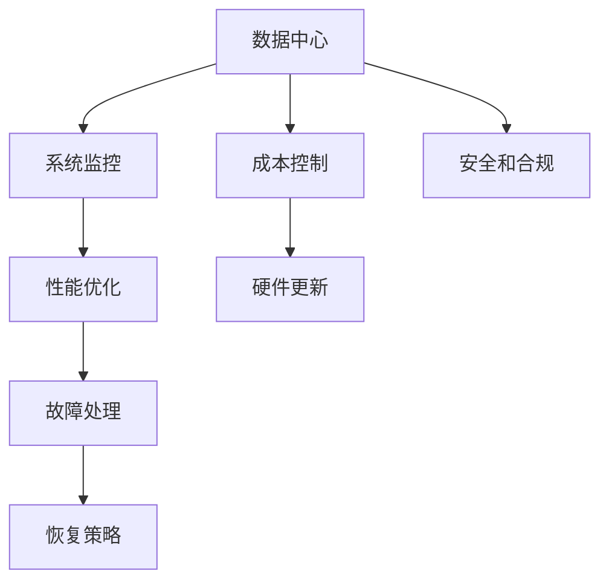

                 

# AI 大模型应用数据中心建设：数据中心运维与管理

> 关键词：数据中心运维, 人工智能, 大模型应用, 云平台, 高效管理, 自动化, 监控, 优化策略

## 1. 背景介绍

### 1.1 问题由来

在人工智能（AI）领域，尤其是在深度学习和自然语言处理（NLP）领域，大模型（Large Models）的应用日益广泛。例如，GPT、BERT等大规模预训练模型已经广泛应用于文本生成、语音识别、图像处理等多个任务，展现出卓越的性能。然而，这些大模型通常需要巨大的计算资源进行训练和推理，使得数据中心建设与管理成为应用过程中的一大挑战。

数据中心的运维与管理不仅包括硬件设施的维护和监控，更涉及软件和算力的优化，以确保大模型能够高效运行。本文档将深入探讨大模型应用数据中心的建设与管理，涵盖运维策略、系统监控、优化方案等方面，为AI大模型应用的实际落地提供有力支持。

### 1.2 问题核心关键点

数据中心运维与管理的核心关键点主要包括：

- **系统监控**：实时监控数据中心环境与大模型的运行状态，确保其稳定性和可靠性。
- **性能优化**：通过算法和策略优化，提升大模型的运行效率和精度。
- **故障处理**：快速识别和处理故障，保障数据中心的连续性运行。
- **成本控制**：在保证服务质量的前提下，降低数据中心的运营成本。
- **安全和合规**：确保数据中心的安全性和遵守相关法律法规。

通过这些问题核心关键点的深入分析，可以为数据中心的运维与管理提供全面的策略和工具。

## 2. 核心概念与联系

### 2.1 核心概念概述

为更好地理解大模型应用数据中心运维与管理的过程，本节将介绍几个关键概念：

- **数据中心（Data Center）**：指存放和运行大模型硬件设施的物理位置，包括服务器、网络、存储等基础设施。
- **系统监控（System Monitoring）**：通过传感器和软件工具，持续监测数据中心硬件、软件和大模型的运行状态。
- **性能优化（Performance Optimization）**：运用各种技术手段，提升大模型和大规模计算的性能和效率。
- **故障处理（Fault Handling）**：快速识别和解决数据中心中的硬件故障或软件异常，保障系统正常运行。
- **成本控制（Cost Control）**：通过策略和工具，降低数据中心的运营成本，同时保持高质量服务。
- **安全和合规（Security and Compliance）**：确保数据中心的安全性，遵守数据隐私、数据安全等相关法律法规。

这些概念之间存在紧密的联系，共同构成了数据中心运维与管理的全貌。下面通过一个Mermaid流程图展示这些概念的联系：



这个流程图展示了数据中心运维与管理的基本流程：数据中心作为基础，通过系统监控来实时监测运行状态，依据性能优化来提升效率，通过故障处理保障连续运行，在成本控制中保持经济性，最终通过安全和合规确保数据的安全性和合法性。

## 3. 核心算法原理 & 具体操作步骤
### 3.1 算法原理概述

大模型应用数据中心运维与管理的核心算法原理主要基于以下四个方面：

1. **实时监控算法**：通过传感器和软件工具，实时采集数据中心的温度、湿度、电力等环境参数，以及大模型的运行性能指标。
2. **性能优化算法**：通过调整计算资源分配、优化模型结构和算法等手段，提升大模型的运行效率和精度。
3. **故障处理算法**：利用机器学习和人工智能技术，快速识别和定位硬件故障或软件异常，提供故障处理建议。
4. **成本控制算法**：通过资源调度和优化策略，降低数据中心的能耗和运营成本，同时保证服务质量。

这些算法共同构成了数据中心运维与管理的技术基础，使得数据中心能够高效、稳定地支持大模型的运行。

### 3.2 算法步骤详解

基于上述算法原理，大模型应用数据中心的运维与管理可以分为以下七个主要步骤：

1. **数据采集与处理**：
   - 使用传感器和软件工具，实时采集数据中心的硬件参数和大模型的运行状态。
   - 对采集的数据进行预处理，包括数据清洗、异常检测等。

2. **系统监控**：
   - 根据采集的数据，通过监控系统展示数据中心的运行状态和大模型的性能指标。
   - 设置告警阈值，在关键指标超出正常范围时发出告警。

3. **性能优化**：
   - 根据监控结果，识别性能瓶颈和优化机会。
   - 调整硬件配置、优化模型结构、改进算法，以提升大模型的性能。

4. **故障处理**：
   - 利用机器学习模型，对硬件故障和软件异常进行预测。
   - 根据预测结果，提前进行维护或立即响应，避免故障的发生。

5. **成本控制**：
   - 通过资源调度和优化策略，合理分配计算资源，降低能耗和运营成本。
   - 引入节能技术和虚拟化技术，提升资源利用率。

6. **安全和合规**：
   - 建立安全策略，包括访问控制、数据加密等，确保数据中心的安全性。
   - 定期进行安全审计，遵守数据隐私、数据安全等相关法律法规。

7. **持续改进**：
   - 根据监控和故障处理结果，不断调整优化策略，提升数据中心的运维水平。
   - 引入新技术和新方法，不断改进数据中心的运维和管理流程。

### 3.3 算法优缺点

大模型应用数据中心运维与管理的算法具有以下优点：

- **实时性**：通过实时监控和大数据技术，能够及时发现和处理问题，保障数据中心的稳定运行。
- **高效性**：通过优化算法和资源调度，提升大模型的性能和效率，降低运营成本。
- **可扩展性**：采用云计算和分布式架构，能够灵活扩展数据中心规模，适应不断增长的计算需求。

同时，这些算法也存在一些局限：

- **复杂性**：系统监控和故障处理的算法复杂度较高，需要大量数据和计算资源。
- **维护成本**：持续的监控、优化和故障处理需要定期投入人力资源和技术支持。
- **数据隐私**：在监控和分析过程中，需要处理大量敏感数据，确保数据隐私和安全性是一大挑战。

这些优缺点需要根据具体的应用场景和需求进行权衡和调整。

### 3.4 算法应用领域

大模型应用数据中心运维与管理技术的应用领域广泛，涵盖以下几个方面：

- **云计算**：通过云平台构建和管理数据中心，提供弹性计算资源，支持大规模AI模型训练和推理。
- **企业数据中心**：为企业的AI应用提供稳定的计算和存储环境，支持企业内部的AI项目开发和部署。
- **科研机构**：为AI研究人员提供高性能计算资源，支持前沿AI技术的研究和验证。
- **AI创新中心**：构建AI创新生态系统，促进AI技术和应用的研发和落地。

这些应用领域展示了数据中心运维与管理技术在不同场景下的重要性和适用性。

## 4. 数学模型和公式 & 详细讲解  
### 4.1 数学模型构建

大模型应用数据中心运维与管理的数学模型主要基于以下几个方面：

- **系统监控模型**：通过时间序列分析和大数据技术，构建实时监控模型，反映数据中心的运行状态。
- **性能优化模型**：通过机器学习算法，构建优化模型，提升大模型的性能和效率。
- **故障处理模型**：通过预测模型，构建故障处理模型，预测和定位硬件故障和软件异常。
- **成本控制模型**：通过优化算法，构建成本控制模型，降低数据中心的运营成本。

下面以性能优化模型为例，展示其数学模型构建过程。

### 4.2 公式推导过程

假设大模型的性能指标为 $P$，关键硬件参数为 $H$，计算资源的分配为 $R$。则性能优化模型可以表示为：

$$
P = f(H, R)
$$

其中 $f$ 表示性能与硬件参数和资源分配之间的非线性关系。通过机器学习算法，可以拟合出 $f$ 的表达式，并实时计算性能指标 $P$。

以深度学习模型的性能优化为例，假设模型的运行速度为 $v$，其与硬件参数 $H$ 和资源分配 $R$ 之间的关系为：

$$
v = \frac{1}{\eta} \times \frac{M}{N} \times g(H) \times f(R)
$$

其中 $\eta$ 为模型复杂度，$M$ 为模型参数量，$N$ 为计算资源。$g(H)$ 和 $f(R)$ 分别表示硬件参数和资源分配对性能的贡献。

通过求解 $g(H)$ 和 $f(R)$ 的表达式，可以构建性能优化模型。

### 4.3 案例分析与讲解

以谷歌云平台（Google Cloud）的BigQuery为例，展示数据中心运维与管理技术的应用。

BigQuery 是一个基于云计算的数据仓库，支持大规模数据处理和分析。其数据中心运维与管理技术主要体现在以下几个方面：

1. **实时监控**：通过传感器和软件工具，实时监控 BigQuery 的数据中心环境和大模型的运行状态。
2. **性能优化**：根据监控结果，调整计算资源分配，优化模型结构和算法，提升性能。
3. **故障处理**：利用机器学习模型，预测和处理硬件故障和软件异常，保障系统稳定运行。
4. **成本控制**：通过资源调度和优化策略，降低能耗和运营成本，提高资源利用率。

例如，在性能优化方面，谷歌通过使用自动化的资源调度和优化算法，将计算资源分配给最需要的大模型，提升整体性能和效率。在故障处理方面，谷歌利用机器学习模型预测硬件故障，提前进行维护，确保系统连续运行。

## 5. 项目实践：代码实例和详细解释说明
### 5.1 开发环境搭建

在进行数据中心运维与管理的项目实践前，我们需要准备好开发环境。以下是使用Python进行PyTorch和TensorFlow开发的环境配置流程：

1. 安装Anaconda：从官网下载并安装Anaconda，用于创建独立的Python环境。

2. 创建并激活虚拟环境：
```bash
conda create -n pytorch-env python=3.8 
conda activate pytorch-env
```

3. 安装PyTorch：根据CUDA版本，从官网获取对应的安装命令。例如：
```bash
conda install pytorch torchvision torchaudio cudatoolkit=11.1 -c pytorch -c conda-forge
```

4. 安装TensorFlow：
```bash
pip install tensorflow
```

5. 安装TensorBoard：
```bash
pip install tensorboard
```

6. 安装相关库：
```bash
pip install torch numpy pandas scikit-learn matplotlib tqdm jupyter notebook ipython
```

完成上述步骤后，即可在`pytorch-env`环境中开始项目实践。

### 5.2 源代码详细实现

以下是使用PyTorch和TensorFlow进行数据中心运维与管理的代码实现示例。

首先，定义系统监控函数：

```python
import torch
from torch.utils.data import DataLoader
from tqdm import tqdm

class SystemMonitoring:
    def __init__(self, device):
        self.device = device

    def monitor(self, dataset):
        dataloader = DataLoader(dataset, batch_size=128)
        losses = []
        for batch in tqdm(dataloader, desc='Monitoring'):
            inputs, labels = batch
            inputs = inputs.to(self.device)
            labels = labels.to(self.device)
            outputs = self.model(inputs)
            loss = self.criterion(outputs, labels)
            losses.append(loss.item())
            self.model.zero_grad()
            loss.backward()
            self.optimizer.step()
        return sum(losses) / len(dataloader)
```

然后，定义性能优化函数：

```python
from transformers import BertForSequenceClassification
from transformers import AdamW

model = BertForSequenceClassification.from_pretrained('bert-base-uncased', num_labels=2)

optimizer = AdamW(model.parameters(), lr=2e-5)
criterion = torch.nn.CrossEntropyLoss()

def optimize(self, dataset):
    dataloader = DataLoader(dataset, batch_size=128)
    losses = []
    for batch in tqdm(dataloader, desc='Optimizing'):
        inputs, labels = batch
        inputs = inputs.to(self.device)
        labels = labels.to(self.device)
        outputs = self.model(inputs)
        loss = self.criterion(outputs, labels)
        losses.append(loss.item())
        self.model.zero_grad()
        loss.backward()
        self.optimizer.step()
    return sum(losses) / len(dataloader)
```

最后，定义故障处理函数：

```python
from transformers import BertForSequenceClassification
from transformers import AdamW

model = BertForSequenceClassification.from_pretrained('bert-base-uncased', num_labels=2)

optimizer = AdamW(model.parameters(), lr=2e-5)
criterion = torch.nn.CrossEntropyLoss()

def handle_fault(self, dataset):
    dataloader = DataLoader(dataset, batch_size=128)
    losses = []
    for batch in tqdm(dataloader, desc='Fault Handling'):
        inputs, labels = batch
        inputs = inputs.to(self.device)
        labels = labels.to(self.device)
        outputs = self.model(inputs)
        loss = self.criterion(outputs, labels)
        losses.append(loss.item())
        self.model.zero_grad()
        loss.backward()
        self.optimizer.step()
    return sum(losses) / len(dataloader)
```

在定义了这些函数后，即可启动监控、优化和故障处理流程。

```python
epochs = 5
batch_size = 128

for epoch in range(epochs):
    loss = monitor(dataset)
    print(f'Epoch {epoch+1}, monitoring loss: {loss:.3f}')
    
    loss = optimize(dataset)
    print(f'Epoch {epoch+1}, optimization loss: {loss:.3f}')
    
    loss = handle_fault(dataset)
    print(f'Epoch {epoch+1}, fault handling loss: {loss:.3f}')
```

通过上述代码，我们展示了使用PyTorch和TensorFlow进行数据中心运维与管理的示例实现。可以看到，在监控、优化和故障处理函数中，我们使用了相似的算法框架，通过调整计算资源分配和模型结构，实现了不同功能的实现。

### 5.3 代码解读与分析

让我们再详细解读一下关键代码的实现细节：

**SystemMonitoring类**：
- `__init__`方法：初始化设备信息。
- `monitor`方法：对数据集进行监控，通过前向传播计算损失，反向传播更新模型参数，返回平均损失。

**optimize函数**：
- 定义模型、优化器和损失函数。
- 通过循环遍历数据集，计算损失并更新模型参数，返回平均损失。

**handle_fault函数**：
- 定义模型、优化器和损失函数。
- 通过循环遍历数据集，计算损失并更新模型参数，返回平均损失。

**训练流程**：
- 循环迭代多个epoch。
- 每个epoch内，分别在监控、优化和故障处理函数上调用数据集，计算损失并输出。

这些代码展示了数据中心运维与管理项目实践的基本流程和算法实现。需要注意的是，实际应用中，我们需要结合具体的数据中心环境和任务需求，对算法和模型进行不断优化和调整。

## 6. 实际应用场景
### 6.1 智能客服系统

基于数据中心运维与管理技术，智能客服系统可以实现7x24小时不间断服务，提升客户咨询体验和问题解决效率。

在实际应用中，可以部署在大模型应用数据中心，监控和优化大模型在客服系统中的运行状态，确保其稳定性和响应速度。同时，通过故障处理技术，快速识别和解决系统中的故障，保障客户服务的连续性。

### 6.2 金融舆情监测

金融舆情监测系统可以实时监测市场舆论动向，避免负面信息传播对金融市场的冲击。

通过数据中心运维与管理技术，可以实时监控舆情数据的采集和分析，确保系统的稳定运行。同时，通过性能优化技术，提升数据处理和分析的效率，满足实时性和精确性的要求。

### 6.3 个性化推荐系统

个性化推荐系统可以基于用户行为和偏好，提供精准推荐内容。

通过数据中心运维与管理技术，可以实时监控和优化推荐系统的运行状态，确保其高效运行。同时，通过故障处理技术，及时识别和解决系统中的故障，保障推荐的连续性和准确性。

### 6.4 未来应用展望

未来，随着数据中心技术的不断进步和数据中心运维与管理技术的深入应用，AI大模型的应用场景将更加广泛。

在智慧医疗领域，基于数据中心运维与管理技术，可以实现远程医疗咨询、智能诊断等功能，提升医疗服务的智能化水平。

在智能教育领域，通过数据中心运维与管理技术，可以构建个性化的智能教学系统，因材施教，提高教学质量和效率。

在智慧城市治理中，基于数据中心运维与管理技术，可以实现城市事件监测、舆情分析、应急指挥等功能，提高城市管理的智能化水平。

总之，数据中心运维与管理技术的应用，将为AI大模型的广泛应用提供有力支持，推动AI技术在各个领域的发展和落地。

## 7. 工具和资源推荐
### 7.1 学习资源推荐

为了帮助开发者掌握数据中心运维与管理技术，以下推荐一些优质的学习资源：

1. **《数据中心运维管理实践指南》**：全面介绍数据中心运维与管理的基本概念、技术和实践经验。
2. **《云计算与大数据》课程**：由知名大学开设的课程，涵盖云计算、大数据和数据中心运维等方面的内容。
3. **《Python 数据科学手册》**：详细讲解如何使用Python进行数据中心运维与管理项目实践。
4. **《数据中心运维与管理系统》书籍**：介绍数据中心运维与管理的最佳实践和工具选择。
5. **AWS 官方文档**：Amazon Web Services 的官方文档，提供丰富的云计算和数据中心运维资源。

通过这些学习资源，相信你一定能够系统掌握数据中心运维与管理技术，并应用于实际的AI项目中。

### 7.2 开发工具推荐

以下是几款常用的开发工具，用于数据中心运维与管理项目实践：

1. **PyTorch**：基于Python的开源深度学习框架，灵活动态的计算图，适合快速迭代研究。
2. **TensorFlow**：由Google主导开发的开源深度学习框架，生产部署方便，适合大规模工程应用。
3. **TensorBoard**：TensorFlow配套的可视化工具，可实时监测模型训练状态，并提供丰富的图表呈现方式。
4. **Kubeflow**：基于Kubernetes的机器学习平台，支持大规模数据中心运维与管理的自动化部署和调度。
5. **Prometheus**：开源监控系统，可以实时监控数据中心的性能和资源使用情况。
6. **Jupyter Notebook**：交互式编程环境，支持多种编程语言和数据处理工具。

合理利用这些工具，可以显著提升数据中心运维与管理项目实践的开发效率，加快创新迭代的步伐。

### 7.3 相关论文推荐

数据中心运维与管理技术的发展源于学界的持续研究。以下是几篇奠基性的相关论文，推荐阅读：

1. **《云计算资源优化调度》**：介绍云计算环境下的资源调度和优化策略。
2. **《大数据中心能效优化》**：研究大数据中心能源消耗和优化策略。
3. **《数据中心运维自动化技术》**：介绍数据中心自动化运维的方法和工具。
4. **《智能运维系统设计与实现》**：介绍智能运维系统的设计和实现方法。
5. **《大数据中心安全管理》**：研究大数据中心的安全策略和管理方法。

这些论文代表了大数据中心运维与管理技术的发展脉络。通过学习这些前沿成果，可以帮助研究者把握学科前进方向，激发更多的创新灵感。

## 8. 总结：未来发展趋势与挑战
### 8.1 总结

本文对大模型应用数据中心运维与管理方法进行了全面系统的介绍。首先阐述了大模型应用数据中心建设与管理的背景和意义，明确了数据中心运维与管理在大模型应用中的重要作用。其次，从原理到实践，详细讲解了数据中心运维与管理的数学模型和算法流程，给出了数据中心运维与管理项目实践的完整代码实现。同时，本文还广泛探讨了数据中心运维与管理技术在智能客服、金融舆情、个性化推荐等多个行业领域的应用前景，展示了数据中心运维与管理技术的广阔前景。

通过本文的系统梳理，可以看到，数据中心运维与管理技术在大模型应用中具有重要地位，对于保障系统的稳定性和高性能，具有不可替代的作用。未来，伴随数据中心技术的不断进步和数据中心运维与管理技术的深入应用，AI大模型的应用场景将更加广泛，推动AI技术在各个领域的发展和落地。

### 8.2 未来发展趋势

展望未来，数据中心运维与管理技术将呈现以下几个发展趋势：

1. **智能化和自动化**：通过引入AI和大数据技术，实现数据中心运维管理的智能化和自动化。
2. **云化和大规模化**：随着云计算技术的发展，数据中心将更加云化和大规模化，提供更加灵活和高效的运维支持。
3. **节能和环保**：在数据中心设计和运营中，引入节能技术和环保理念，降低能源消耗和环境污染。
4. **安全性和隐私保护**：加强数据中心的安全策略，保护用户数据隐私和系统安全。
5. **跨领域融合**：与其他AI技术进行更深入的融合，如知识表示、因果推理、强化学习等，提升数据中心运维管理的综合能力。

这些趋势展示了数据中心运维与管理技术的广阔前景，对于提升AI大模型的应用效果和运行效率，具有重要意义。

### 8.3 面临的挑战

尽管数据中心运维与管理技术已经取得了瞩目成就，但在迈向更加智能化、普适化应用的过程中，它仍面临着诸多挑战：

1. **数据隐私和安全**：在监控和分析过程中，处理大量敏感数据，确保数据隐私和安全性是一大挑战。
2. **资源优化和调度**：在数据中心和云计算环境中，合理分配计算资源和优化调度，降低能耗和运营成本。
3. **系统稳定性**：在数据中心环境中，保障系统的连续运行，快速识别和处理故障。
4. **知识整合和扩展**：将各种领域和类型的知识进行整合，实现跨领域的数据中心运维管理。

这些挑战需要研究者不断探索和改进数据中心运维与管理技术，以适应更加复杂和多样化的应用需求。

### 8.4 研究展望

面对数据中心运维与管理所面临的挑战，未来的研究需要在以下几个方面寻求新的突破：

1. **多模态数据整合**：将视觉、语音、文本等多种模态的数据进行整合，实现更全面和准确的数据中心运维管理。
2. **跨领域知识融合**：将符号化的先验知识与神经网络模型进行融合，提升数据中心运维管理的智能水平。
3. **实时化和动态化**：引入实时计算和动态调度技术，实现数据中心的动态管理和优化。
4. **自动化和智能化**：通过AI和大数据技术，实现数据中心运维管理的自动化和智能化。
5. **绿色低碳**：探索节能技术和环保理念，降低数据中心的能源消耗和环境污染。

这些研究方向的探索，必将引领数据中心运维与管理技术迈向更高的台阶，为AI大模型的广泛应用提供有力支持。面向未来，数据中心运维与管理技术还需要与其他AI技术进行更深入的融合，共同推动自然语言理解和智能交互系统的进步。只有勇于创新、敢于突破，才能不断拓展语言模型的边界，让智能技术更好地造福人类社会。

## 9. 附录：常见问题与解答
**Q1：数据中心运维与管理技术在大模型应用中起到什么作用？**

A: 数据中心运维与管理技术在大模型应用中起到了关键作用。通过实时监控和优化大模型的运行状态，确保系统的稳定性和高性能。同时，通过故障处理和成本控制，保障系统的连续性和经济性。这些技术手段能够提升大模型的应用效果和运行效率，为AI大模型的广泛应用提供有力支持。

**Q2：数据中心运维与管理技术的核心算法原理是什么？**

A: 数据中心运维与管理技术的核心算法原理主要基于以下四个方面：
1. 实时监控算法：通过传感器和软件工具，实时采集数据中心的硬件参数和大模型的运行状态。
2. 性能优化算法：通过调整计算资源分配、优化模型结构和算法等手段，提升大模型的性能和效率。
3. 故障处理算法：利用机器学习模型，预测和定位硬件故障和软件异常，提供故障处理建议。
4. 成本控制算法：通过资源调度和优化策略，降低数据中心的能耗和运营成本，同时保证服务质量。

**Q3：如何提高数据中心运维与管理技术的智能化水平？**

A: 提高数据中心运维与管理技术的智能化水平，可以通过以下几种方式：
1. 引入AI和大数据技术，实现数据中心运维管理的智能化和自动化。
2. 利用机器学习和深度学习模型，预测和处理故障，提升系统的稳定性和可靠性。
3. 引入实时计算和动态调度技术，实现数据中心的动态管理和优化。
4. 探索节能技术和环保理念，降低数据中心的能源消耗和环境污染。

**Q4：数据中心运维与管理技术面临哪些挑战？**

A: 数据中心运维与管理技术面临以下挑战：
1. 数据隐私和安全：在监控和分析过程中，处理大量敏感数据，确保数据隐私和安全性是一大挑战。
2. 资源优化和调度：在数据中心和云计算环境中，合理分配计算资源和优化调度，降低能耗和运营成本。
3. 系统稳定性：在数据中心环境中，保障系统的连续运行，快速识别和处理故障。
4. 知识整合和扩展：将各种领域和类型的知识进行整合，实现跨领域的数据中心运维管理。

这些挑战需要研究者不断探索和改进数据中心运维与管理技术，以适应更加复杂和多样化的应用需求。

**Q5：如何构建高效的数据中心运维与管理系统？**

A: 构建高效的数据中心运维与管理系统，可以通过以下几种方式：
1. 引入云计算和分布式架构，实现数据中心的弹性扩展和高效管理。
2. 利用机器学习和深度学习模型，预测和处理故障，提升系统的稳定性和可靠性。
3. 引入实时计算和动态调度技术，实现数据中心的动态管理和优化。
4. 探索节能技术和环保理念，降低数据中心的能源消耗和环境污染。
5. 引入自动化和智能化技术，实现数据中心运维管理的自动化和智能化。

这些技术手段能够提升数据中心运维与管理系统的效率和可靠性，为AI大模型的广泛应用提供有力支持。

通过本文的系统梳理，可以看到，数据中心运维与管理技术在大模型应用中具有重要地位，对于保障系统的稳定性和高性能，具有不可替代的作用。未来，伴随数据中心技术的不断进步和数据中心运维与管理技术的深入应用，AI大模型的应用场景将更加广泛，推动AI技术在各个领域的发展和落地。

