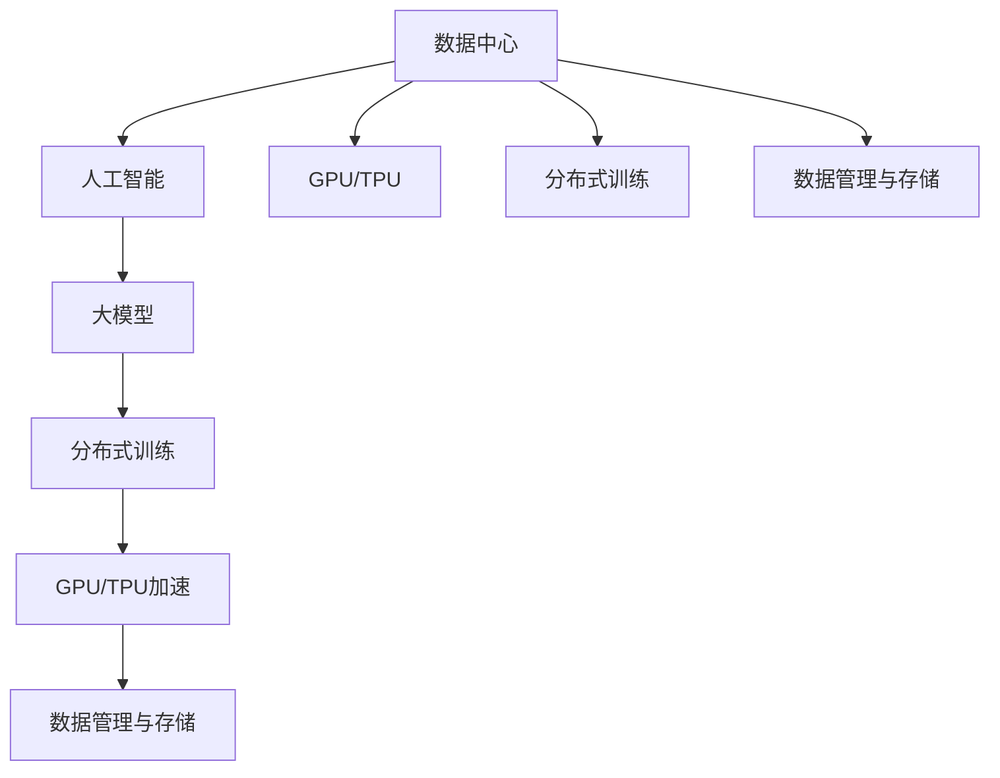

                 

# AI 大模型应用数据中心建设：数据中心运营与管理

> 关键词：人工智能(AI), 大模型, 数据中心建设, 运营与管理

## 1. 背景介绍

### 1.1 问题由来
随着人工智能(AI)技术的飞速发展，大模型（Large Models）成为推动AI应用的关键引擎。这些大模型通常基于深度学习，拥有数亿乃至数十亿个参数，能够在图像识别、自然语言处理、语音识别等领域取得突破性进展。但大模型的训练和应用需要大规模的数据中心作为支撑，对数据中心的建设、运营与管理提出了新的挑战。

### 1.2 问题核心关键点
本节将探讨大模型应用中数据中心建设、运营与管理的核心问题：

1. **数据中心基础设施**：如何构建和升级数据中心，以满足大模型训练和推理的需求？
2. **数据中心资源优化**：如何在有限的资源条件下，最大化数据中心的使用效率？
3. **数据中心安全性**：如何确保数据中心的安全性，避免数据泄露和系统故障？
4. **数据中心成本控制**：如何平衡数据中心建设与运营的成本和效益？
5. **数据中心维护与升级**：如何定期维护和升级数据中心，保障系统的高可用性和性能？

### 1.3 问题研究意义
本文聚焦于大模型应用中的数据中心建设、运营与管理，旨在为AI技术的落地应用提供系统性指导。通过对这些问题的深入研究，我们能够更好地理解和构建高效、安全、成本可控的数据中心，从而推动AI技术的普及和应用。

## 2. 核心概念与联系

### 2.1 核心概念概述

为更好地理解数据中心在大模型应用中的作用，本节将介绍几个密切相关的核心概念：

1. **数据中心（Data Center）**：由服务器、存储、网络、电力等硬件设施组成，用于支持数据处理和存储的物理设施。数据中心是大模型训练、推理的物理基础。

2. **人工智能（AI）**：利用数据中心提供的计算和存储资源，通过算法模型对大量数据进行学习和推理，从而实现自主决策和智能交互的技术。

3. **大模型（Large Models）**：具有数十亿甚至数百亿参数的深度学习模型，如BERT、GPT等。这些模型需要大规模数据中心的支撑，进行分布式训练和推理。

4. **分布式训练（Distributed Training）**：在多台服务器上同时训练模型，并行处理数据，加速训练过程。分布式训练是大模型训练的必由之路。

5. **GPU/TPU加速**：通过使用GPU（图形处理器）或TPU（张量处理器）等硬件加速器，大幅提升训练和推理的计算效率。

6. **数据管理与存储**：包括数据采集、清洗、存储、检索等过程，是大模型训练和推理的基础。

这些核心概念之间的逻辑关系可以通过以下Mermaid流程图来展示：



这个流程图展示了数据中心在AI大模型应用中的核心作用：

1. 数据中心为人工智能提供必要的计算和存储资源。
2. 通过分布式训练和GPU/TPU加速，大幅提升大模型的训练和推理效率。
3. 数据管理与存储是数据中心的重要组成部分，为大模型提供基础数据支持。

## 3. 核心算法原理 & 具体操作步骤
### 3.1 算法原理概述

大模型应用的数据中心建设、运营与管理，涉及多学科知识，包括计算机体系结构、分布式系统、数据管理等。其核心原理是：

1. **硬件资源调度**：通过硬件资源调度算法，合理分配GPU/TPU等加速资源，最大化利用数据中心计算能力。
2. **网络优化**：优化数据中心内部和外部的网络架构，确保数据的高速传输和低延迟。
3. **存储管理**：设计高效的数据存储和管理策略，保证数据的一致性、可靠性和可扩展性。
4. **安全防护**：采用多层次的安全防护措施，保障数据中心的网络、服务器和数据安全。
5. **成本控制**：通过合理的资源利用和成本预算，控制数据中心的建设和运营成本。

### 3.2 算法步骤详解

#### 3.2.1 数据中心硬件资源调度

**步骤1：评估硬件需求**
- 分析大模型的计算和存储需求，确定所需的GPU/TPU数量和配置。
- 考虑未来需求增长，预留一定扩展空间。

**步骤2：选择硬件设备**
- 选择高性能、稳定的GPU/TPU设备，并确保其与软件环境兼容。
- 考虑能耗和成本，选择适合的设备型号。

**步骤3：安装部署硬件**
- 安装和配置硬件设备，并进行网络连通性测试。
- 设置设备电源、冷却系统，确保设备稳定运行。

**步骤4：配置调度算法**
- 设计基于负载均衡、任务优先级的调度算法，确保资源高效利用。
- 使用Kubernetes、Mesos等容器编排工具，实现自动化资源分配和调度。

#### 3.2.2 数据中心网络优化

**步骤1：评估网络需求**
- 分析数据中心内部和外部的网络带宽需求，确定所需的网络架构。
- 考虑网络冗余和容错，设计合理的网络拓扑。

**步骤2：选择网络设备**
- 选择高性能、稳定的网络交换机和路由器设备。
- 考虑网络延迟和带宽，选择适合的设备型号。

**步骤3：安装部署网络设备**
- 安装和配置网络设备，并进行网络连通性测试。
- 设置网络安全策略，如防火墙、入侵检测等。

**步骤4：配置网络优化**
- 使用SDN（软件定义网络）技术，实现网络流量的精细控制和优化。
- 使用负载均衡技术，确保数据的高速传输和低延迟。

#### 3.2.3 数据中心存储管理

**步骤1：评估存储需求**
- 分析大模型的数据存储需求，确定所需的存储容量和性能。
- 考虑数据备份和恢复，设计合理的存储策略。

**步骤2：选择存储设备**
- 选择高性能、可靠的存储设备，如SSD、HDD等。
- 考虑存储的扩展性和冗余，选择适合的设备型号。

**步骤3：安装部署存储设备**
- 安装和配置存储设备，并进行数据一致性测试。
- 设置存储备份和恢复机制，确保数据的可靠性。

**步骤4：配置存储管理**
- 使用分布式文件系统（如HDFS、Ceph），实现数据的高可用性和可扩展性。
- 使用数据冗余和容错技术，确保数据的可靠性和一致性。

#### 3.2.4 数据中心安全防护

**步骤1：评估安全需求**
- 分析数据中心的安全需求，确定所需的安全措施。
- 考虑数据泄露和系统故障的风险，设计多层次的安全防护策略。

**步骤2：选择安全设备**
- 选择高性能、可靠的安全设备，如防火墙、入侵检测系统（IDS）、入侵防御系统（IPS）等。
- 考虑数据传输和存储的安全，选择适合的安全设备。

**步骤3：安装部署安全设备**
- 安装和配置安全设备，并进行安全策略的测试和验证。
- 设置访问控制、数据加密等安全措施，确保数据和系统的安全。

**步骤4：配置安全防护**
- 使用网络隔离技术，将敏感数据和核心设备隔离。
- 使用加密技术，确保数据在传输和存储中的安全。

#### 3.2.5 数据中心成本控制

**步骤1：评估成本需求**
- 分析数据中心的建设和运营成本，确定预算和资源分配。
- 考虑未来的需求增长和扩展，预留一定的成本空间。

**步骤2：选择成本优化策略**
- 使用能效管理技术，优化设备的使用效率和能耗。
- 使用资源池化技术，合理分配资源，减少浪费。

**步骤3：安装部署成本优化工具**
- 安装和配置成本管理工具，如Ansible、Puppet等。
- 设置成本监控和预警机制，实时监测和控制成本。

**步骤4：配置成本控制**
- 使用云计算服务（如AWS、Google Cloud），实现成本的灵活控制和优化。
- 使用自动化工具，实现成本的精细化和动态管理。

### 3.3 算法优缺点

大模型应用数据中心建设、运营与管理的算法具有以下优点：

1. **高效利用资源**：通过合理的硬件资源调度、网络优化和存储管理，最大化数据中心的计算、存储和网络资源的使用效率。
2. **保障系统安全性**：多层次的安全防护措施，确保数据中心的网络、服务器和数据安全，防止数据泄露和系统故障。
3. **控制成本效益**：合理的成本优化策略，平衡数据中心的建设和运营成本，确保经济效益。
4. **支持模型训练与推理**：通过分布式训练和GPU/TPU加速，大幅提升大模型的训练和推理效率，满足大规模数据处理需求。

同时，该算法也存在一定的局限性：

1. **复杂度较高**：涉及多学科知识，设计、部署和维护的复杂度较高。
2. **成本投入高**：初期建设和维护的高成本可能对中小型企业和个人开发者构成挑战。
3. **技术门槛高**：需要具备一定的计算机体系结构、分布式系统和网络安全等相关知识，门槛较高。

尽管存在这些局限性，但就目前而言，大模型应用数据中心建设、运营与管理的算法仍是大模型应用的重要保障。未来相关研究的重点在于如何进一步降低技术门槛，提升资源利用效率，降低成本，同时兼顾系统安全性和成本效益。

### 3.4 算法应用领域

大模型应用数据中心建设、运营与管理的算法已在多个领域得到应用，例如：

1. **云计算平台**：如AWS、Google Cloud等，通过分布式计算资源池化，提供高效、稳定、安全的大模型训练和推理服务。
2. **人工智能企业**：如OpenAI、DeepMind等，通过自建数据中心，提供高性能的AI应用服务。
3. **科学研究机构**：如麻省理工学院、斯坦福大学等，通过数据中心资源，支持高水平的人工智能研究和实验。
4. **政府和公共服务**：如智慧城市、公共安全等，通过数据中心支持大规模的公共数据处理和分析。
5. **企业生产系统**：如智能制造、自动驾驶等，通过数据中心支持高性能的生产和决策系统。

## 4. 数学模型和公式 & 详细讲解

### 4.1 数学模型构建

本节将使用数学语言对大模型应用数据中心建设、运营与管理的核心算法进行更严格的刻画。

设数据中心内GPU/TPU数量为 $N$，每个设备的计算能力为 $C$，网络带宽为 $B$，存储容量为 $S$，安全防护成本为 $S_c$，成本优化策略的效益为 $E$。则数据中心的总体效用 $U$ 可以表示为：

$$
U = f(C, N, B, S, S_c, E)
$$

其中 $f$ 为效用函数，考虑到各资源之间的相互作用，可以表示为：

$$
U = C \times N + B \times N + S \times \frac{N}{N_{max}} \times \frac{S}{S_{max}} - S_c - E
$$

其中 $N_{max}$ 和 $S_{max}$ 分别为设备数量和存储容量的最大值。

### 4.2 公式推导过程

**推导目标**：求解数据中心总体效用最大化的问题。

**优化目标**：

$$
\max_{C, N, B, S, S_c, E} U
$$

**约束条件**：

1. 计算能力限制：$C_{total} = N \times C$
2. 存储容量限制：$S_{total} = S_{used} + S_{backup}$
3. 网络带宽限制：$B_{total} = N \times B$
4. 安全防护成本：$S_c = k \times C_{total}$
5. 成本优化策略效益：$E = \frac{k_{opt}}{C_{total}} \times (C_{total} - C_{opt})$

其中 $C_{total}$ 和 $S_{total}$ 分别为总计算能力和总存储容量，$S_{used}$ 和 $S_{backup}$ 分别为使用的存储容量和备份的存储容量，$k$ 和 $k_{opt}$ 分别为安全防护成本系数和优化策略效益系数。

通过求解上述优化问题，可以找到最优的资源分配方案，最大化数据中心的总体效用。

### 4.3 案例分析与讲解

**案例1：Google Cloud AI平台**

Google Cloud AI平台通过大规模分布式计算资源和网络优化，提供高性能的大模型训练和推理服务。其核心架构包括：

1. **分布式训练**：使用TensorFlow、PyTorch等深度学习框架，支持大规模分布式训练。
2. **GPU/TPU加速**：提供高性能的GPU和TPU设备，支持深度学习模型的加速训练。
3. **网络优化**：使用高速网络交换机和路由器，实现低延迟、高带宽的数据传输。
4. **安全防护**：多层次的安全防护措施，确保数据和系统的安全。
5. **成本控制**：使用云计算服务，实现灵活的成本管理和优化。

**案例2：DeepMind大模型训练中心**

DeepMind通过自建大模型训练中心，提供高性能的AI应用服务。其核心架构包括：

1. **大模型训练**：使用大规模GPU集群，支持数亿参数的大模型训练。
2. **分布式推理**：使用高性能的TPU集群，支持大规模分布式推理。
3. **网络优化**：使用高速网络交换机和路由器，实现低延迟、高带宽的数据传输。
4. **存储管理**：使用分布式文件系统，实现大规模数据的高可用性和可扩展性。
5. **安全防护**：多层次的安全防护措施，确保数据和系统的安全。
6. **成本控制**：使用能效管理技术，优化设备的使用效率和能耗。

## 5. 项目实践：代码实例和详细解释说明

### 5.1 开发环境搭建

在进行数据中心建设、运营与管理的项目实践前，我们需要准备好开发环境。以下是使用Python进行Kubernetes开发的环境配置流程：

1. 安装Kubernetes：从官网下载并安装Kubernetes集群，包括Master和多个Worker节点。
2. 安装Docker：安装Docker容器引擎，支持容器的创建和运行。
3. 安装Kubeadm：安装Kubeadm工具，用于集群初始化和节点管理。
4. 安装Helm：安装Helm包管理器，用于管理和部署应用。
5. 安装MinIO：安装MinIO对象存储服务，支持大规模数据存储和管理。

完成上述步骤后，即可在Kubernetes集群上开始数据中心建设、运营与管理的实践。

### 5.2 源代码详细实现

下面以Kubernetes集群中大模型训练任务为例，给出完整的代码实现。

```python
from kubernetes import client, config

# 配置Kubernetes集群
config.load_kube_config()

# 创建Kubernetes API客户端
v1 = client.CoreV1Api()

# 创建部署
deployment = client.V1Deployment(
    api_version="v1",
    metadata=client.V1ObjectMeta(
        name="large-model-deployment",
        labels={"hello": "world"}
    ),
    spec=client.V1DeploymentSpec(
        replicas=3,
        selector=client.V1LabelSelector(
            match_labels={"hello": "world"}
        ),
        template=client.V1PodTemplateSpec(
            metadata=client.V1ObjectMeta(
                labels={"hello": "world"}
            ),
            spec=client.V1PodSpec(
                containers=[
                    client.V1Container(
                        name="large-model-container",
                        image="large-model:latest",
                        ports=[
                            client.V1ContainerPort(
                                container_port=8080
                            )
                        ]
                    )
                ]
            )
        )
    )
)

# 创建服务
service = client.V1Service(
    api_version="v1",
    metadata=client.V1ObjectMeta(
        name="large-model-service"
    ),
    spec=client.V1ServiceSpec(
        selector={"hello": "world"},
        ports=[
            client.V1ServicePort(
                port=8080,
                target_port=8080
            )
        ]
    )
)

# 部署资源
v1.create_namespaced_deployment(namespace="default", body=deployment)
v1.create_namespaced_service(namespace="default", body=service)
```

### 5.3 代码解读与分析

让我们再详细解读一下关键代码的实现细节：

**Kubernetes部署与Service定义**：
- 使用Kubernetes API客户端创建Deployment和Service对象，定义了部署的数量、标签选择、容器镜像、端口映射等关键信息。
- 部署的容器镜像假设为预训练好的大模型镜像，通过定义Service对象，实现对外暴露的IP地址和端口。

**Kubernetes资源管理**：
- 使用Kubeadm初始化Kubernetes集群，并使用Helm包管理器管理和部署应用。
- 使用MinIO对象存储服务，提供大规模数据存储和管理功能。
- 使用Kubernetes内置的RBAC（基于角色的访问控制）机制，确保资源的安全访问和控制。

## 6. 实际应用场景

### 6.1 智能制造

在智能制造领域，大模型应用数据中心可以提供高性能的计算和存储资源，支持大规模的生产数据分析和决策系统。例如，通过大模型训练和推理，可以实现智能质量检测、智能排产和智能设备维护等功能。

### 6.2 自动驾驶

在自动驾驶领域，大模型应用数据中心可以提供高性能的计算和存储资源，支持大规模的传感器数据处理和模型训练。例如，通过大模型训练和推理，可以实现自动驾驶的感知、决策和控制功能。

### 6.3 智慧城市

在智慧城市领域，大模型应用数据中心可以提供高性能的计算和存储资源，支持大规模的城市数据处理和分析。例如，通过大模型训练和推理，可以实现智慧交通、智慧安防和智慧环保等功能。

### 6.4 未来应用展望

未来，大模型应用数据中心将呈现以下几个发展趋势：

1. **边缘计算的普及**：随着5G、IoT等技术的发展，边缘计算将变得更加普及。边缘计算可以大幅缩短数据传输时延，提升大模型的实时处理能力。
2. **AI芯片的研发**：AI芯片如TPU、ASIC等将成为主流，进一步提升大模型的计算效率和能效比。
3. **异构计算的支持**：通过支持异构计算资源，如GPU、FPGA、ASIC等，提升大模型的处理能力和灵活性。
4. **云边协同**：云边协同计算将更加普及，通过云边结合，提升大模型的处理能力和数据管理能力。
5. **联邦学习的应用**：联邦学习可以有效保护数据隐私，适用于大规模分布式数据处理场景，是大模型应用的重要方向。

## 7. 工具和资源推荐

### 7.1 学习资源推荐

为了帮助开发者系统掌握大模型应用数据中心建设、运营与管理的理论基础和实践技巧，这里推荐一些优质的学习资源：

1. Kubernetes官方文档：详细的Kubernetes文档，涵盖部署、管理、监控等各个方面，是学习Kubernetes的最佳资源。
2. Google Cloud AI平台文档：Google Cloud AI平台的官方文档，涵盖大模型训练、推理、部署等各个环节。
3. DeepMind大模型训练中心文档：DeepMind大模型训练中心的官方文档，涵盖大模型训练、推理、部署等各个环节。
4. 《分布式系统架构设计》书籍：深入讲解分布式系统架构设计，涵盖负载均衡、数据管理、安全防护等关键问题。
5. 《Kubernetes实战》书籍：实战指导，涵盖Kubernetes的安装、部署、管理、监控等各个方面。

通过对这些资源的学习实践，相信你一定能够快速掌握大模型应用数据中心建设、运营与管理的精髓，并用于解决实际的AI问题。

### 7.2 开发工具推荐

高效的开发离不开优秀的工具支持。以下是几款用于大模型应用数据中心建设、运营与管理的常用工具：

1. Kubernetes：用于容器编排和资源调度，支持大规模分布式计算。
2. Helm：用于应用管理和部署，提供便捷的包管理和部署工具。
3. MinIO：用于大规模对象存储，支持高可靠性和高扩展性的数据存储和管理。
4. Terraform：用于基础设施即代码（Infrastructure as Code），支持自动化资源管理和部署。
5. Ansible：用于自动化运维，支持自动化配置和资源管理。
6. Puppet：用于自动化配置和资源管理，支持多种自动化任务。

合理利用这些工具，可以显著提升大模型应用数据中心建设、运营与管理的开发效率，加快创新迭代的步伐。

### 7.3 相关论文推荐

大模型应用数据中心建设、运营与管理的理论研究已经取得了丰硕成果，以下是几篇具有代表性的论文：

1. Google AI大模型训练中心：介绍Google Cloud AI平台的建设与运营，涵盖计算资源调度、网络优化、安全防护等关键问题。
2. DeepMind大模型训练中心的架构设计：介绍DeepMind大模型训练中心的建设与运营，涵盖硬件资源调度、存储管理、网络优化等关键问题。
3. Kubernetes在AI应用中的实践：介绍Kubernetes在AI应用中的部署与优化，涵盖资源调度、网络优化、安全防护等关键问题。
4. 分布式深度学习系统的设计与优化：介绍分布式深度学习系统的设计，涵盖资源调度、网络优化、数据管理等关键问题。
5. 大规模分布式计算系统的设计与优化：介绍大规模分布式计算系统的设计，涵盖资源调度、网络优化、数据管理等关键问题。

这些论文代表了大模型应用数据中心建设、运营与管理的最新研究成果，通过学习这些前沿成果，可以帮助研究者把握学科前进方向，激发更多的创新灵感。

## 8. 总结：未来发展趋势与挑战

### 8.1 总结

本文对大模型应用数据中心建设、运营与管理的核心问题进行了全面系统的介绍。首先阐述了数据中心在大模型应用中的核心作用，明确了数据中心建设、运营与管理的核心目标和关键环节。其次，从原理到实践，详细讲解了数据中心硬件资源调度、网络优化、存储管理、安全防护和成本控制等关键问题，给出了详细的操作步骤和实例代码。同时，本文还探讨了数据中心在大模型应用中的广泛应用场景，展望了未来发展的趋势和挑战。

通过本文的系统梳理，可以看到，数据中心在大模型应用中的重要性不言而喻，是大模型训练和推理的物理基础。通过深入研究数据中心的建设、运营与管理，我们能够更好地构建高效、安全、成本可控的大模型应用环境，推动AI技术的普及和应用。

### 8.2 未来发展趋势

展望未来，大模型应用数据中心建设、运营与管理将呈现以下几个发展趋势：

1. **边缘计算与云边协同**：随着5G、IoT等技术的发展，边缘计算将变得更加普及。云边协同计算将进一步提升大模型的实时处理能力和数据管理能力。
2. **AI芯片的研发与应用**：AI芯片如TPU、ASIC等将成为主流，进一步提升大模型的计算效率和能效比。
3. **异构计算的支持**：通过支持异构计算资源，如GPU、FPGA、ASIC等，提升大模型的处理能力和灵活性。
4. **联邦学习的应用**：联邦学习可以有效保护数据隐私，适用于大规模分布式数据处理场景，是大模型应用的重要方向。
5. **边缘计算的安全防护**：边缘计算设备的安全防护将是未来的重要研究方向，需要设计更加安全、可靠的安全防护机制。
6. **数据中心的管理与运维**：数据中心的管理与运维将是未来的重要研究方向，需要设计更加灵活、高效的管理与运维工具和策略。

以上趋势凸显了大模型应用数据中心建设、运营与管理的广阔前景。这些方向的探索发展，必将进一步提升数据中心的性能和效率，推动AI技术的普及和应用。

### 8.3 面临的挑战

尽管大模型应用数据中心建设、运营与管理技术已经取得了显著进展，但在迈向更加智能化、普适化应用的过程中，仍面临诸多挑战：

1. **技术复杂度**：数据中心建设、运营与管理涉及多学科知识，设计、部署和维护的复杂度较高，需要跨学科团队协作。
2. **高昂成本**：初期建设和维护的高成本可能对中小型企业和个人开发者构成挑战，需要通过资源池化、云计算等手段降低成本。
3. **技术门槛高**：需要具备一定的计算机体系结构、分布式系统和网络安全等相关知识，门槛较高。
4. **性能瓶颈**：大模型应用对计算、存储和网络资源的需求巨大，如何高效利用这些资源，是未来研究的重点。
5. **安全风险**：数据中心面临的安全风险复杂多样，如何设计多层次的安全防护措施，是未来研究的重点。
6. **运维难度大**：数据中心的运维难度大，如何设计灵活、高效的管理与运维工具和策略，是未来研究的重点。

正视数据中心建设、运营与管理面临的这些挑战，积极应对并寻求突破，将是大模型应用数据中心建设、运营与管理走向成熟的必由之路。相信随着学界和产业界的共同努力，这些挑战终将一一被克服，大模型应用数据中心建设、运营与管理必将在构建高效、安全、成本可控的AI应用环境中扮演越来越重要的角色。

### 8.4 研究展望

面向未来，大模型应用数据中心建设、运营与管理的研究需要在以下几个方面寻求新的突破：

1. **边缘计算与云边协同**：探索边缘计算与云边协同的优化策略，提升大模型的实时处理能力和数据管理能力。
2. **AI芯片的研发与应用**：研发高性能、低成本的AI芯片，提升大模型的计算效率和能效比。
3. **异构计算的支持**：探索异构计算资源的高效利用，提升大模型的处理能力和灵活性。
4. **联邦学习的应用**：探索联邦学习在大模型应用中的优化策略，提升数据隐私保护和分布式训练效率。
5. **边缘计算的安全防护**：探索边缘计算设备的安全防护机制，设计多层次的安全防护措施。
6. **数据中心的管理与运维**：探索灵活、高效的数据中心管理与运维工具和策略，提升数据中心的高可用性和性能。

这些研究方向将引领大模型应用数据中心建设、运营与管理技术的进一步发展，推动AI技术的普及和应用。唯有勇于创新、敢于突破，才能不断拓展数据中心的边界，让AI技术更好地造福人类社会。

## 9. 附录：常见问题与解答

**Q1：什么是大模型？**

A: 大模型（Large Models）通常指具有数十亿甚至数百亿参数的深度学习模型，如BERT、GPT等。这些模型能够处理大规模数据集，学习丰富的语言知识和常识，具备强大的语言理解和生成能力。

**Q2：如何选择合适的数据中心硬件设备？**

A: 选择合适的数据中心硬件设备需要考虑以下几个因素：
1. 计算能力：选择高性能、稳定的GPU/TPU设备，确保足够的计算能力。
2. 存储容量：选择高性能、可靠的存储设备，如SSD、HDD等，确保足够的存储容量。
3. 网络带宽：选择高速网络交换机和路由器，确保网络带宽足够。
4. 能效比：选择能效比高的设备，确保能源利用效率。
5. 成本：综合考虑设备性能、价格和可用性，选择最合适的设备。

**Q3：什么是分布式训练？**

A: 分布式训练（Distributed Training）是指在多台服务器上同时训练模型，并行处理数据，加速训练过程。分布式训练是大模型训练的必由之路，可以大幅提升训练效率和模型精度。

**Q4：什么是边缘计算？**

A: 边缘计算（Edge Computing）是指将数据和计算任务分布式部署在网络边缘设备上，减少数据传输时延，提升计算效率和响应速度。边缘计算在大模型应用中具有重要应用前景。

**Q5：如何保障数据中心的安全性？**

A: 数据中心的安全性保障需要设计多层次的安全防护措施，包括：
1. 物理安全：确保数据中心的物理安全，防止设备损坏和数据泄露。
2. 网络安全：使用防火墙、入侵检测等安全设备，防止网络攻击。
3. 访问控制：使用RBAC（基于角色的访问控制）机制，确保资源的安全访问和控制。
4. 数据加密：使用加密技术，确保数据在传输和存储中的安全。

**Q6：什么是Kubernetes？**

A: Kubernetes是一个开源的容器编排和调度系统，用于管理和调度集群中的容器化应用。Kubernetes通过容器编排、资源管理、负载均衡等技术，提供高效、可靠、可扩展的分布式计算平台。

---

作者：禅与计算机程序设计艺术 / Zen and the Art of Computer Programming

