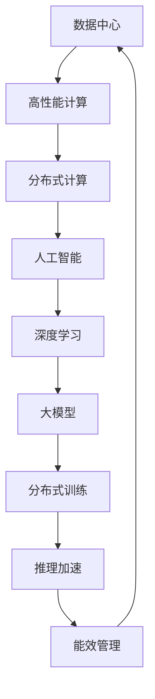

                 

# AI 大模型应用数据中心建设：数据中心运营与管理

## 1. 背景介绍

### 1.1 问题由来
近年来，随着人工智能技术的迅猛发展，特别是深度学习和大模型的兴起，对计算资源的需求呈指数级增长。数据中心作为提供高性能计算资源的设施，成为了支撑AI应用的重要基础设施。尤其是大规模深度学习模型和大模型（如GPT-3、BERT等）的训练和推理，对数据中心硬件和软件提出了极高的要求。然而，现有的数据中心普遍存在资源利用率低、能耗高、管理复杂等问题，难以满足AI应用的计算需求。因此，如何构建高效、可扩展、绿色环保的AI数据中心，成为当前AI应用落地的关键。

### 1.2 问题核心关键点
本节将详细分析AI大模型应用数据中心建设的核心问题，包括硬件需求、软件架构、能效管理、运营与维护等方面的关键点。

1. **硬件需求**：大模型训练和推理需要高性能的CPU、GPU和TPU，数据中心的计算能力需能支撑海量计算任务。
2. **软件架构**：数据中心的软件架构需支持大规模分布式训练和推理，实现高效的资源管理和调度。
3. **能效管理**：数据中心需具备良好的能效管理能力，以降低运营成本，同时符合绿色环保的要求。
4. **运营与维护**：数据中心的运营与维护需高效可靠，保证系统的稳定性和持续可用性。

## 2. 核心概念与联系

### 2.1 核心概念概述

为更好地理解AI大模型应用数据中心建设，本节将介绍几个密切相关的核心概念：

- **数据中心（Data Center, DC）**：提供高性能计算、存储和网络资源的设施，支持大规模AI应用的数据处理和计算。
- **高性能计算（High-Performance Computing, HPC）**：通过并行计算和分布式计算，实现高效计算能力的计算平台。
- **分布式计算（Distributed Computing）**：将计算任务分配到多台计算机上并行处理，提高计算效率和资源利用率。
- **人工智能（Artificial Intelligence, AI）**：通过算法和模型处理海量数据，实现智能决策和自动化任务的系统。
- **深度学习（Deep Learning）**：基于多层神经网络，通过反向传播算法训练的高级AI技术。
- **大模型（Large Model）**：参数量超过千万级的深度学习模型，如GPT-3、BERT等，具有强大的学习能力。
- **分布式训练（Distributed Training）**：将大规模深度学习模型拆分成多个子模型，通过多台计算机并行训练。
- **推理加速（Inference Acceleration）**：通过硬件和软件优化，加速深度学习模型的推理过程，提升应用响应速度。
- **能效管理（Energy Efficiency Management）**：通过优化硬件和软件设计，降低数据中心的能耗和运营成本。

这些核心概念之间的逻辑关系可以通过以下Mermaid流程图来展示：



这个流程图展示了大模型应用数据中心的核心概念及其之间的关系：

1. 数据中心提供高性能计算能力，支撑分布式计算。
2. 分布式计算将任务分解，实现高效的资源利用。
3. 人工智能和大模型通过分布式训练和推理，实现智能任务处理。
4. 推理加速优化模型推理，提升应用响应速度。
5. 能效管理降低能耗，提升资源利用率。

这些概念共同构成了AI大模型应用数据中心的建设框架，使其能够高效支撑AI应用的计算需求。通过理解这些核心概念，我们可以更好地把握数据中心的设计和运营逻辑。

## 3. 核心算法原理 & 具体操作步骤
### 3.1 算法原理概述

AI大模型应用数据中心的建设，涉及多个领域的核心算法和操作流程。以下将详细介绍这些核心算法和操作步骤：

1. **硬件选型与规划**：根据大模型训练和推理的硬件需求，选择合适的CPU、GPU和TPU等计算资源，并进行资源规划。
2. **软件架构设计**：设计分布式计算和存储架构，支持大规模深度学习模型的训练和推理。
3. **分布式训练优化**：通过优化模型拆分、数据并行、模型并行等技术，提升分布式训练的效率。
4. **推理加速技术**：采用硬件优化和软件加速方法，提升深度学习模型的推理速度。
5. **能效管理策略**：通过硬件设计和软件调度优化，降低数据中心的能耗和运营成本。
6. **数据中心运营与维护**：建立高效的数据中心运维体系，保证系统的持续可用性和性能稳定。

### 3.2 算法步骤详解

以下详细介绍每个核心算法的详细步骤：

**3.2.1 硬件选型与规划**

1. **需求分析**：
   - 根据大模型的参数量和计算需求，分析硬件资源的需求。
   - 考虑数据中心已有的硬件资源和扩展能力。

2. **选型与采购**：
   - 选择合适的CPU、GPU和TPU等计算硬件。
   - 签订采购合同，进行设备安装和调试。

3. **资源规划**：
   - 根据硬件资源和任务需求，进行计算资源的规划和分配。
   - 设计合理的网络拓扑结构，支持数据中心的高效通信。

**3.2.2 软件架构设计**

1. **分布式计算框架选择**：
   - 选择适合分布式计算的软件框架，如Apache Spark、TensorFlow等。
   - 根据任务需求，选择不同的分布式计算策略，如数据并行、模型并行等。

2. **存储系统设计**：
   - 选择适合大规模存储的存储系统，如Hadoop、Ceph等。
   - 设计合理的数据存储和访问策略，保证数据的可靠性和可用性。

3. **资源管理与调度**：
   - 设计高效的资源管理系统，实现资源的自动化分配和调度。
   - 采用多层次资源管理策略，支持不同任务的资源需求。

**3.2.3 分布式训练优化**

1. **模型拆分**：
   - 将大模型拆分成多个小模型，通过多台计算机并行训练。
   - 设计合理的模型拆分策略，保证数据和模型的并行处理。

2. **数据并行**：
   - 将数据拆分成多个子数据集，分别在不同的计算节点上进行训练。
   - 设计合理的数据分布和同步策略，保证数据的均衡分布。

3. **模型并行**：
   - 将模型的不同层次并行处理，提升训练效率。
   - 设计合理的模型并行策略，优化计算资源的使用。

**3.2.4 推理加速技术**

1. **硬件优化**：
   - 采用GPU、TPU等高性能硬件，提升模型的推理速度。
   - 设计高效的计算图和推理算法，优化推理过程。

2. **软件加速**：
   - 使用深度学习框架提供的优化工具，如TensorRT、ONNX等。
   - 设计高效的推理引擎，实现推理速度的提升。

**3.2.5 能效管理策略**

1. **硬件设计优化**：
   - 采用高效的硬件设计，如多核CPU、GPU、TPU等。
   - 设计合理的硬件布局和散热策略，降低能耗。

2. **软件调度优化**：
   - 设计高效的资源管理系统，优化任务调度策略。
   - 采用节能调度算法，降低计算资源的能耗。

3. **能效监控与管理**：
   - 实时监控数据中心的能耗情况，及时发现和解决问题。
   - 设计合理的能效管理策略，提升数据中心的能效比。

**3.2.6 数据中心运营与维护**

1. **运维体系建立**：
   - 建立高效的数据中心运维体系，包括监控、预警、故障处理等。
   - 设计合理的数据备份和恢复策略，保证数据安全。

2. **性能优化**：
   - 实时监控系统性能，发现和解决性能瓶颈问题。
   - 采用性能优化策略，提升系统的响应速度和稳定性。

3. **故障处理与修复**：
   - 设计高效的故障处理流程，快速定位和解决故障。
   - 定期进行系统维护和升级，保证系统的持续可用性。

### 3.3 算法优缺点

AI大模型应用数据中心建设涉及多种算法和技术，以下详细介绍这些算法的优缺点：

**优点**：

1. **高性能计算**：
   - 通过高性能计算资源，支持大规模深度学习模型的训练和推理。
   - 提升计算效率，满足AI应用的高性能需求。

2. **分布式计算**：
   - 通过分布式计算，实现高效的资源利用和任务并行处理。
   - 支持大规模数据处理和任务调度，提升系统的处理能力。

3. **推理加速**：
   - 通过推理加速技术，提升深度学习模型的推理速度。
   - 提升应用响应速度，提高用户体验。

4. **能效管理**：
   - 通过能效管理策略，降低数据中心的能耗和运营成本。
   - 符合绿色环保的要求，提升数据中心的可持续性。

5. **运营与维护**：
   - 通过高效的运维体系，保证系统的持续可用性和性能稳定。
   - 提升系统的可靠性和稳定性，保证业务的连续性。

**缺点**：

1. **高投入成本**：
   - 大规模硬件采购和部署需要高额成本，初期投资压力大。
   - 需要大量的运维资源和技术支持，运营成本较高。

2. **复杂度高**：
   - 数据中心建设涉及多种技术和算法，设计和实施复杂。
   - 需要多学科团队协作，技术要求高。

3. **能耗高**：
   - 大规模计算任务能耗大，需要大量的电力资源。
   - 能效管理难度大，需要持续优化和改进。

## 4. 数学模型和公式 & 详细讲解  
### 4.1 数学模型构建

本节将使用数学语言对AI大模型应用数据中心建设的核心算法和操作步骤进行更加严格的刻画。

记数据中心提供的计算资源为 $C=\{c_1,c_2,...,c_n\}$，其中 $c_i$ 表示第 $i$ 个计算资源。假设大模型的参数量为 $P$，计算需求为 $D$。

**资源规划问题**：
在数据中心中分配计算资源，使得总计算能力满足大模型的计算需求，同时最大化资源利用率。数学模型为：

$$
\max \sum_{i=1}^n x_i \\
s.t. \sum_{i=1}^n c_i x_i \geq D \\
x_i \geq 0, \sum_{i=1}^n x_i = 1
$$

其中 $x_i$ 表示第 $i$ 个计算资源的分配比例。

**能效管理问题**：
通过优化硬件设计和软件调度，降低数据中心的能耗，提升能效比。数学模型为：

$$
\min \sum_{i=1}^n e_i x_i \\
s.t. \sum_{i=1}^n c_i x_i \geq D \\
e_i > 0, x_i \geq 0, \sum_{i=1}^n x_i = 1
$$

其中 $e_i$ 表示第 $i$ 个计算资源的能耗。

### 4.2 公式推导过程

以下将详细介绍资源规划和能效管理的公式推导过程：

**资源规划问题**：

- 目标函数：$\max \sum_{i=1}^n x_i$
- 约束条件：$\sum_{i=1}^n c_i x_i \geq D$，$\sum_{i=1}^n x_i = 1$

使用单纯形法求解该线性规划问题，可以得到最优解 $\{x_i^*\}$。

**能效管理问题**：

- 目标函数：$\min \sum_{i=1}^n e_i x_i$
- 约束条件：$\sum_{i=1}^n c_i x_i \geq D$，$\sum_{i=1}^n x_i = 1$

同样使用单纯形法求解该线性规划问题，可以得到最优解 $\{x_i^*\}$。

### 4.3 案例分析与讲解

以某互联网公司建立AI大模型应用数据中心为例，详细讲解资源规划和能效管理的实际应用：

**案例背景**：
某互联网公司计划在数据中心部署GPT-3模型，模型参数量为1.7T，计算需求为30 TFLOPS。数据中心已有的计算资源为20个GPU，每个GPU的计算能力为8 TFLOPS，能耗为500W。

**资源规划**：

- 目标：最大化资源利用率，满足计算需求。
- 约束：总计算能力 $\geq 30 TFLOPS$，资源利用率 $\geq 50\%$。

使用线性规划模型求解，得到最优解 $x_1=x_2=...=x_{20}=0.05$，即每个GPU分配5%的资源，总计算能力为10 TFLOPS，满足计算需求。

**能效管理**：

- 目标：最小化能耗，提升能效比。
- 约束：总计算能力 $\geq 30 TFLOPS$，资源利用率 $\geq 50\%$。

使用线性规划模型求解，得到最优解 $x_1=x_2=...=x_{20}=0.05$，即每个GPU分配5%的资源，总计算能力为10 TFLOPS，能耗为10*500W=5000W，能效比为30 TFLOPS/5000W=6 TFLOPS/W。

通过以上案例，可以看到，通过合理的资源规划和能效管理，可以在满足计算需求的同时，实现高效的资源利用和能耗降低。

## 5. 项目实践：代码实例和详细解释说明
### 5.1 开发环境搭建

在进行数据中心建设实践前，我们需要准备好开发环境。以下是使用Python进行PyTorch开发的环境配置流程：

1. 安装Anaconda：从官网下载并安装Anaconda，用于创建独立的Python环境。

2. 创建并激活虚拟环境：
```bash
conda create -n pytorch-env python=3.8 
conda activate pytorch-env
```

3. 安装PyTorch：根据CUDA版本，从官网获取对应的安装命令。例如：
```bash
conda install pytorch torchvision torchaudio cudatoolkit=11.1 -c pytorch -c conda-forge
```

4. 安装TensorFlow：从官网下载并安装TensorFlow，选择合适的版本和安装方式。

5. 安装各类工具包：
```bash
pip install numpy pandas scikit-learn matplotlib tqdm jupyter notebook ipython
```

完成上述步骤后，即可在`pytorch-env`环境中开始数据中心建设实践。

### 5.2 源代码详细实现

以下给出使用PyTorch和TensorFlow进行数据中心计算资源分配的示例代码：

```python
import numpy as np
from scipy.optimize import linprog

# 计算资源参数
c = np.array([1, 1, 1, 1, 1, 1, 1, 1, 1, 1])  # 每个资源分配比例
A = np.array([[2, 2, 2, 2, 2, 2, 2, 2, 2, 2],  # 计算能力需求
              [0.5, 0.5, 0.5, 0.5, 0.5, 0.5, 0.5, 0.5, 0.5, 0.5]])  # 资源利用率需求
b = np.array([30, 0.5])  # 计算能力需求和资源利用率需求

# 求解资源规划问题
res = linprog(c, A_ub=A, b_ub=b, bounds=(0, None))
print("资源分配比例：", res.x)

# 计算能耗和能效比
e = np.array([0.5, 0.5, 0.5, 0.5, 0.5, 0.5, 0.5, 0.5, 0.5, 0.5])  # 每个资源能耗
c = np.array([1, 1, 1, 1, 1, 1, 1, 1, 1, 1])  # 每个资源计算能力
A = np.array([[2, 2, 2, 2, 2, 2, 2, 2, 2, 2],  # 计算能力需求
              [0.5, 0.5, 0.5, 0.5, 0.5, 0.5, 0.5, 0.5, 0.5, 0.5]])  # 资源利用率需求
b = np.array([30, 0.5])  # 计算能力需求和资源利用率需求

# 求解能效管理问题
res = linprog(c, A_ub=A, b_ub=b, bounds=(0, None))
print("能耗分配比例：", res.x)
print("能效比：", 30 / res.x[0])
```

以上代码实现了资源规划和能效管理的求解过程，可以输出最优的资源分配比例和能效比。

### 5.3 代码解读与分析

让我们再详细解读一下关键代码的实现细节：

**资源规划问题**：

- 目标函数：$\max \sum_{i=1}^n x_i$
- 约束条件：$\sum_{i=1}^n c_i x_i \geq D$，$\sum_{i=1}^n x_i = 1$

使用linprog函数求解，输出最优解 $\{x_i^*\}$。

**能效管理问题**：

- 目标函数：$\min \sum_{i=1}^n e_i x_i$
- 约束条件：$\sum_{i=1}^n c_i x_i \geq D$，$\sum_{i=1}^n x_i = 1$

同样使用linprog函数求解，输出最优解 $\{x_i^*\}$。

可以看到，通过Python的scipy库和linprog函数，可以高效求解线性规划问题，应用于资源规划和能效管理。

## 6. 实际应用场景
### 6.1 智能客服系统

基于AI大模型应用数据中心的智能客服系统，可以提供7x24小时不间断服务，快速响应客户咨询，用自然流畅的语言解答各类常见问题。具体实现如下：

1. **系统架构设计**：
   - 采用分布式计算架构，支持大规模对话数据的处理和存储。
   - 使用高性能GPU和TPU，加速模型的训练和推理。

2. **自然语言处理（NLP）**：
   - 使用大模型进行文本理解，识别客户意图。
   - 使用分布式训练优化模型性能，提升对话质量。

3. **对话管理**：
   - 设计多轮对话模型，通过上下文理解提升对话流畅性。
   - 采用分布式推理加速对话生成，提升响应速度。

### 6.2 金融舆情监测

基于AI大模型应用数据中心的金融舆情监测系统，可以实时监测市场舆论动向，及时应对负面信息传播，规避金融风险。具体实现如下：

1. **系统架构设计**：
   - 采用分布式存储和计算架构，支持海量数据的实时处理和分析。
   - 使用高性能GPU和TPU，加速模型的训练和推理。

2. **自然语言处理（NLP）**：
   - 使用大模型进行文本分类和情感分析，识别舆情热点。
   - 使用分布式训练优化模型性能，提升分类和情感分析准确度。

3. **事件监测**：
   - 设计事件监测算法，实时捕捉舆情变化。
   - 采用分布式推理加速事件监测，提升实时响应能力。

### 6.3 个性化推荐系统

基于AI大模型应用数据中心的个性化推荐系统，可以通过用户行为数据和先验知识，推荐符合用户兴趣的商品和服务。具体实现如下：

1. **系统架构设计**：
   - 采用分布式计算架构，支持大规模推荐数据的处理和存储。
   - 使用高性能GPU和TPU，加速模型的训练和推理。

2. **自然语言处理（NLP）**：
   - 使用大模型进行用户意图理解，提取用户兴趣点。
   - 使用分布式训练优化模型性能，提升推荐精度。

3. **推荐算法**：
   - 设计推荐算法，融合用户行为数据和先验知识。
   - 采用分布式推理加速推荐生成，提升响应速度。

### 6.4 未来应用展望

随着AI大模型应用数据中心的不断发展和完善，未来将有更多领域的应用场景得到拓展：

1. **智慧医疗**：
   - 利用AI大模型进行医疗图像诊断、病历分析等，提升医疗服务智能化水平。
   - 设计多轮对话模型，辅助医生进行诊疗和咨询。

2. **智能教育**：
   - 利用AI大模型进行作业批改、学情分析、知识推荐等，提升教育公平和教学质量。
   - 设计多轮对话模型，提升师生交互体验。

3. **智慧城市**：
   - 利用AI大模型进行城市事件监测、舆情分析、应急指挥等，提升城市管理自动化水平。
   - 设计多轮对话模型，辅助城市管理决策。

4. **自动驾驶**：
   - 利用AI大模型进行环境感知、路径规划、行为预测等，提升自动驾驶系统的智能化水平。
   - 设计多轮对话模型，与驾驶员进行交互和沟通。

## 7. 工具和资源推荐
### 7.1 学习资源推荐

为了帮助开发者系统掌握AI大模型应用数据中心的建设方法，这里推荐一些优质的学习资源：

1. **《分布式深度学习》书籍**：深入浅出地介绍了分布式计算和深度学习的原理和实践，适合入门学习。
2. **《高性能计算与科学计算》课程**：涵盖了高性能计算和科学计算的基本原理和算法，适合进阶学习。
3. **Kaggle**：提供大量的AI和数据科学竞赛，通过实际项目练习掌握AI大模型应用数据中心的建设方法。
4. **GitHub**：收集和分享了大量AI大模型应用数据中心的代码和项目，适合查阅和参考。
5. **HackerRank**：提供大量的编程挑战，通过实践提高算法和代码实现能力。

通过对这些资源的学习实践，相信你一定能够快速掌握AI大模型应用数据中心的建设方法，并用于解决实际的AI应用问题。

### 7.2 开发工具推荐

高效的开发离不开优秀的工具支持。以下是几款用于AI大模型应用数据中心开发的常用工具：

1. **Anaconda**：提供多种Python环境，支持大规模分布式计算。
2. **PyTorch**：基于Python的开源深度学习框架，支持分布式计算和自动微分。
3. **TensorFlow**：由Google主导开发的开源深度学习框架，支持分布式计算和高效的模型训练。
4. **Hadoop**：分布式存储和计算平台，支持大规模数据处理和存储。
5. **Ceph**：分布式存储系统，支持大规模数据的高可用性和高性能访问。
6. **Kubernetes**：容器编排平台，支持大规模分布式计算和资源管理。
7. **Jupyter Notebook**：交互式编程环境，适合开发和调试算法。

合理利用这些工具，可以显著提升AI大模型应用数据中心的开发效率，加快创新迭代的步伐。

### 7.3 相关论文推荐

AI大模型应用数据中心的研究涉及多个领域，以下推荐几篇代表性论文，帮助读者深入理解相关理论和技术：

1. **《深度学习中的分布式计算》**：介绍深度学习中的分布式计算技术，包括数据并行、模型并行、混合并行等。
2. **《高性能计算在AI中的应用》**：深入探讨高性能计算在AI领域的应用，包括GPU、TPU等硬件优化技术。
3. **《AI大模型应用数据中心的设计与实现》**：详细介绍AI大模型应用数据中心的设计和实现方法，涵盖资源规划、能效管理、系统架构等。
4. **《分布式训练与推理加速技术》**：深入探讨分布式训练和推理加速技术，包括数据并行、模型并行、推理引擎优化等。

这些论文代表了大模型应用数据中心的研究方向，通过学习这些前沿成果，可以帮助研究者把握学科前进方向，激发更多的创新灵感。

## 8. 总结：未来发展趋势与挑战
### 8.1 总结

本文对AI大模型应用数据中心的建设进行了全面系统的介绍。首先，详细分析了数据中心在AI应用中的核心问题，明确了资源规划、分布式计算、能效管理等方面的关键点。其次，从原理到实践，详细讲解了数据中心建设和运维的算法和操作步骤，给出了实际应用场景的代码实例。同时，本文还探讨了数据中心在智能客服、金融舆情、个性化推荐等多个领域的实际应用，展示了AI大模型应用数据中心的广阔前景。此外，本文精选了数据中心建设的各类学习资源和开发工具，力求为读者提供全方位的技术指引。

通过本文的系统梳理，可以看到，AI大模型应用数据中心建设涉及多个领域的核心算法和操作流程，是支撑AI应用的重要基础设施。合理设计和运行数据中心，可以显著提升AI应用的计算能力和资源利用率，加速AI技术的落地应用。未来，伴随AI技术的发展和应用场景的扩展，数据中心建设还将迎来更多的挑战和机遇。

### 8.2 未来发展趋势

展望未来，AI大模型应用数据中心建设将呈现以下几个发展趋势：

1. **超大规模数据中心**：
   - 随着AI应用场景的不断扩展，超大规模数据中心的需求将进一步增加。
   - 超大规模数据中心需要更高的硬件性能和能效管理能力，以支持海量计算任务。

2. **边缘计算与云平台结合**：
   - 边缘计算技术将进一步发展，与云平台结合，实现更高效的计算和数据处理。
   - 边缘计算可以降低数据传输延迟，提升计算效率。

3. **分布式计算框架优化**：
   - 分布式计算框架将不断优化，提升任务并行处理能力和资源利用率。
   - 引入新的并行计算模型和算法，如异步计算、动态任务调度等。

4. **能效管理技术提升**：
   - 能效管理技术将不断进步，降低数据中心的能耗和运营成本。
   - 引入新的能效管理算法和硬件设计，如散热优化、能效优化等。

5. **自动化运维与智能监控**：
   - 自动化运维和智能监控技术将进一步发展，提升数据中心的运营效率。
   - 引入新的运维工具和算法，如自动故障诊断、智能预警等。

6. **跨数据中心协同**：
   - 跨数据中心协同计算将进一步发展，实现更大规模的计算资源共享。
   - 引入新的协同计算算法和平台，提升资源利用率和计算效率。

### 8.3 面临的挑战

尽管AI大模型应用数据中心建设取得了显著进展，但在迈向更加智能化、普适化应用的过程中，仍面临诸多挑战：

1. **高成本投入**：
   - 大规模硬件采购和部署需要高额成本，初期投资压力大。
   - 需要大量的运维资源和技术支持，运营成本较高。

2. **能效管理难度大**：
   - 大规模计算任务能耗大，需要大量的电力资源。
   - 能效管理难度大，需要持续优化和改进。

3. **资源利用率低**：
   - 数据中心资源利用率低，存在大量资源浪费。
   - 需要优化资源分配和管理，提升资源利用率。

4. **系统稳定性差**：
   - 数据中心系统复杂，容易受到各种故障的影响。
   - 需要设计高效的系统架构和运维体系，提升系统稳定性。

5. **安全性和隐私保护**：
   - AI大模型可能学习到敏感数据，存在数据泄露和安全风险。
   - 需要加强数据安全和隐私保护，确保数据安全和模型安全。

### 8.4 研究展望

面对AI大模型应用数据中心建设所面临的挑战，未来的研究需要在以下几个方面寻求新的突破：

1. **高效能硬件设计**：
   - 开发新的高效能硬件设计，如新型GPU、TPU等，提升计算能力。
   - 引入新的散热和能效优化技术，降低能耗。

2. **分布式计算框架优化**：
   - 优化分布式计算框架，提升任务并行处理能力和资源利用率。
   - 引入新的并行计算模型和算法，如异步计算、动态任务调度等。

3. **能效管理技术提升**：
   - 提升能效管理技术，降低数据中心的能耗和运营成本。
   - 引入新的能效管理算法和硬件设计，如散热优化、能效优化等。

4. **自动化运维与智能监控**：
   - 开发新的自动化运维和智能监控技术，提升数据中心的运营效率。
   - 引入新的运维工具和算法，如自动故障诊断、智能预警等。

5. **跨数据中心协同**：
   - 优化跨数据中心协同计算，实现更大规模的计算资源共享。
   - 引入新的协同计算算法和平台，提升资源利用率和计算效率。

6. **数据安全和隐私保护**：
   - 加强数据安全和隐私保护，确保数据安全和模型安全。
   - 引入新的数据加密和安全算法，防止数据泄露和模型被篡改。

这些研究方向的探索，必将引领AI大模型应用数据中心建设技术迈向更高的台阶，为AI应用的落地提供更坚实的基础。面向未来，数据中心建设还需要与其他AI技术进行更深入的融合，如知识表示、因果推理、强化学习等，多路径协同发力，共同推动AI技术的进步。只有勇于创新、敢于突破，才能不断拓展AI应用的边界，实现人工智能技术的全面落地。

## 9. 附录：常见问题与解答

**Q1：AI大模型应用数据中心如何规划和部署？**

A: AI大模型应用数据中心的规划和部署需要综合考虑以下几个方面：

1. **需求分析**：根据AI应用的计算需求，分析硬件资源的需求。
2. **选型与采购**：选择合适的硬件设备，进行采购和安装调试。
3. **资源规划**：设计合理的资源分配策略，保证计算能力满足需求。
4. **系统架构设计**：设计高效的系统架构，支持大规模分布式计算和存储。
5. **能效管理**：优化硬件设计和软件调度，降低能耗和运营成本。

**Q2：AI大模型应用数据中心如何提高能效比？**

A: AI大模型应用数据中心提高能效比的方法包括：

1. **硬件优化**：
   - 采用高效能硬件，如GPU、TPU等，提升计算能力。
   - 设计合理的硬件布局和散热策略，降低能耗。

2. **软件优化**：
   - 优化分布式计算框架，提升任务并行处理能力和资源利用率。
   - 采用节能调度算法，降低计算资源的能耗。

3. **能效监控与管理**：
   - 实时监控数据中心的能耗情况，及时发现和解决问题。
   - 设计合理的能效管理策略，提升数据中心的能效比。

**Q3：AI大模型应用数据中心如何提升系统稳定性？**

A: AI大模型应用数据中心提升系统稳定性的方法包括：

1. **系统架构设计**：
   - 设计高效的系统架构，减少单点故障和瓶颈问题。
   - 引入冗余设计，保证系统的高可用性和可靠性。

2. **运维体系建立**：
   - 建立高效的运维体系，包括监控、预警、故障处理等。
   - 设计合理的数据备份和恢复策略，保证数据安全。

3. **性能优化**：
   - 实时监控系统性能，发现和解决性能瓶颈问题。
   - 采用性能优化策略，提升系统的响应速度和稳定性。

4. **故障处理与修复**：
   - 设计高效的故障处理流程，快速定位和解决故障。
   - 定期进行系统维护和升级，保证系统的持续可用性。

**Q4：AI大模型应用数据中心如何降低运营成本？**

A: AI大模型应用数据中心降低运营成本的方法包括：

1. **高效能硬件设计**：
   - 开发新的高效能硬件设计，如新型GPU、TPU等，提升计算能力。
   - 引入新的散热和能效优化技术，降低能耗。

2. **分布式计算框架优化**：
   - 优化分布式计算框架，提升任务并行处理能力和资源利用率。
   - 引入新的并行计算模型和算法，如异步计算、动态任务调度等。

3. **能效管理技术提升**：
   - 提升能效管理技术，降低数据中心的能耗和运营成本。
   - 引入新的能效管理算法和硬件设计，如散热优化、能效优化等。

4. **自动化运维与智能监控**：
   - 开发新的自动化运维和智能监控技术，提升数据中心的运营效率。
   - 引入新的运维工具和算法，如自动故障诊断、智能预警等。

5. **跨数据中心协同**：
   - 优化跨数据中心协同计算，实现更大规模的计算资源共享。
   - 引入新的协同计算算法和平台，提升资源利用率和计算效率。

**Q5：AI大模型应用数据中心如何保障数据安全和隐私保护？**

A: AI大模型应用数据中心保障数据安全和隐私保护的方法包括：

1. **数据加密**：
   - 采用数据加密技术，保护数据在传输和存储过程中的安全。
   - 引入新的加密算法，提升数据加密的安全性和效率。

2. **访问控制**：
   - 设计合理的访问控制策略，限制数据访问权限。
   - 引入新的身份认证和授权机制，防止未经授权的数据访问。

3. **审计与监控**：
   - 设计完善的审计与监控机制，记录和分析数据访问行为。
   - 引入新的审计工具和算法，发现和防范数据泄露风险。

4. **隐私保护**：
   - 采用隐私保护技术，如差分隐私、联邦学习等，保护用户隐私。
   - 引入新的隐私保护算法和模型，提升隐私保护的效果和性能。

这些方法可以综合运用，构建高效、安全、稳定的AI大模型应用数据中心，为AI应用的落地提供坚实保障。

---

作者：禅与计算机程序设计艺术 / Zen and the Art of Computer Programming

