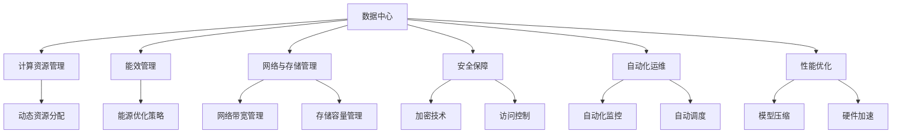
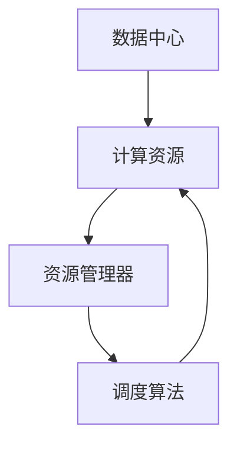

                 

# AI 大模型应用数据中心建设：数据中心运营与管理

> 关键词：
- 数据中心
- 人工智能
- 大模型
- 运营管理
- 自动化
- 安全保障
- 性能优化
- 能效管理

## 1. 背景介绍

### 1.1 问题由来

在人工智能（AI）尤其是深度学习和自然语言处理（NLP）领域，大模型（Large Models）已经成为不可或缺的重要工具。诸如GPT-3、BERT等大模型，通过大规模数据训练，能够学习到丰富的知识表示，提供强大的推理和生成能力。然而，这些模型通常需要大量的计算资源进行训练和推理，数据中心（Data Center）作为提供计算能力的基础设施，其运营与管理变得至关重要。

随着AI大模型应用的广泛扩展，数据中心的建设与管理需求愈发复杂和多样化。如何高效、安全、可扩展地管理数据中心，不仅影响到AI大模型的性能和用户体验，更直接关联到企业运营成本与盈利能力。本文旨在全面介绍AI大模型应用的数据中心建设与管理，帮助读者理解并优化数据中心运营。

### 1.2 问题核心关键点

AI大模型应用数据中心的建设与管理涉及以下几个关键点：

- 计算资源管理：如何有效地分配和管理计算资源，满足不同大模型的计算需求。
- 能效管理：如何在提升计算性能的同时，最大化数据中心的能效，实现绿色环保。
- 网络与存储管理：如何快速、可靠地存储和访问数据，同时确保网络带宽的充足和稳定。
- 安全保障：如何防止数据泄露和非法访问，确保AI模型和数据的安全性。
- 自动化运维：如何利用自动化工具和流程，降低人工运维成本，提升管理效率。
- 性能优化：如何优化大模型训练和推理过程，提高计算效率和模型效果。

理解这些关键点，对于构建一个高效、安全、可扩展的AI大模型数据中心至关重要。

### 1.3 问题研究意义

研究AI大模型应用数据中心的建设与管理，对于企业、机构乃至整个社会都有着深远意义：

- 提升AI技术应用效率：通过优化数据中心的计算、存储、网络等资源，可以加速AI大模型的训练与推理，提升应用效率。
- 降低运营成本：科学管理和优化数据中心的能源消耗，能够有效控制运营成本，实现节能减排。
- 保障数据安全：数据中心是存储和管理AI模型与数据的关键设施，其安全性直接关系到模型与数据的安全。
- 促进产业升级：高效、安全的数据中心运营，能够加速AI技术在各行各业的应用，推动产业数字化转型。
- 引领技术前沿：数据中心的建设与管理技术是衡量AI技术发展水平的重要指标，前沿研究有助于推动技术进步。

## 2. 核心概念与联系

### 2.1 核心概念概述

为更好地理解AI大模型数据中心的建设与管理，我们需要了解几个核心概念：

- **数据中心（Data Center）**：由计算、存储、网络、安全等组件构成的复杂系统，用于支持AI大模型的训练与推理。
- **计算资源管理**：根据大模型的需求，动态调整计算资源（如CPU、GPU、内存）的分配和使用。
- **能效管理（Energy Efficiency）**：通过技术手段优化数据中心的能源使用，提高能源利用率，减少能源消耗。
- **网络与存储管理**：高效管理数据中心的网络带宽和存储容量，确保数据的高速访问与备份。
- **安全保障**：采取多种安全措施，保护数据中心中存储的AI模型和数据，防止未经授权的访问和攻击。
- **自动化运维**：利用自动化工具和流程，实现数据中心的自动化管理和维护，提升运维效率。
- **性能优化**：通过算法和硬件优化，提高数据中心中大模型的训练和推理速度，降低计算延迟。

这些核心概念之间的逻辑关系可以通过以下Mermaid流程图来展示：



### 2.2 核心概念原理和架构的 Mermaid 流程图

以下是一个简单的Mermaid流程图，展示了数据中心计算资源管理的架构：



## 3. 核心算法原理 & 具体操作步骤

### 3.1 算法原理概述

AI大模型数据中心的计算资源管理，其核心原理基于负载均衡和动态调度算法。这些算法旨在根据AI大模型的资源需求，动态调整计算资源的分配，优化计算性能和能源利用率。

核心算法流程包括以下几个步骤：

1. **资源需求分析**：根据AI大模型的训练和推理需求，分析所需计算资源类型（如CPU、GPU、内存）和资源量。
2. **资源分配**：根据需求，分配计算资源。通常采用轮询、任务优先级等调度策略。
3. **性能监控与优化**：实时监控计算资源使用情况，根据监控结果调整资源分配策略，优化计算性能和能源消耗。

### 3.2 算法步骤详解

以下是具体的算法步骤：

**Step 1: 资源需求分析**

- 收集AI大模型的训练和推理需求，包括模型大小、参数量、计算量等。
- 分析模型的计算模式，确定所需的计算资源类型和数量。

**Step 2: 资源分配**

- 根据需求，分配计算资源。可以采用轮询（Round Robin）、最少连接（Least Connections）、任务优先级（Priority Scheduling）等策略。
- 使用容器化技术（如Docker、Kubernetes）进行资源隔离，确保各模型的计算环境稳定。

**Step 3: 性能监控与优化**

- 实时监控计算资源的利用率和性能指标，如CPU占用率、内存使用率、网络带宽等。
- 根据监控结果调整资源分配策略，优化计算性能和能源消耗。

### 3.3 算法优缺点

**优点：**

- 动态调整资源分配，确保计算资源的充分利用。
- 实时监控与优化，提升计算性能和能源利用率。
- 资源隔离和容器化技术，保障模型计算环境的稳定。

**缺点：**

- 算法复杂，需要实时监控和动态调整，增加了管理难度。
- 需要大量的监控和计算资源，增加了数据中心的运营成本。
- 部分调度策略可能导致资源竞争和性能波动。

### 3.4 算法应用领域

计算资源管理算法广泛应用于各类AI大模型的训练与推理场景，包括但不限于：

- 自然语言处理（NLP）模型的训练与推理。
- 计算机视觉（CV）模型的训练与推理。
- 语音识别（ASR）和自然语言理解（NLU）模型的训练与推理。
- 推荐系统模型的训练与推理。
- 数据挖掘与分析模型的训练与推理。

## 4. 数学模型和公式 & 详细讲解 & 举例说明

### 4.1 数学模型构建

为更好地理解计算资源管理的算法原理，我们可以用数学模型来描述资源分配的过程。

设大模型的训练需求为 $D$，计算资源为 $R$，资源分配函数为 $F$，则资源分配问题可以表示为：

$$
\min_{F} \sum_{i=1}^{n} C_i \cdot F_i \\
\text{s.t.} \sum_{i=1}^{n} F_i = D \\
F_i \geq 0 \\
$$

其中 $C_i$ 为资源 $i$ 的成本（如计算时间、能源消耗），$F_i$ 为分配给资源 $i$ 的计算量，$n$ 为可用资源总数。

### 4.2 公式推导过程

上述问题是一个典型的线性规划问题，可以使用求解线性规划的算法，如单纯形法或内点法，求解最优解。

以单纯形法为例，推导资源分配问题。

1. **初始化基矩阵**：
   $$
   B = \begin{bmatrix}
   1 & 0 & \cdots & 0 \\
   0 & 1 & \cdots & 0 \\
   \vdots & \vdots & \ddots & \vdots \\
   0 & 0 & \cdots & 1 \\
   c_1 & c_2 & \cdots & c_n \\
   \end{bmatrix}
   $$

2. **计算基向量 $x_0$**：
   $$
   x_0 = B^{-1} d
   $$

3. **计算超平面 $H$**：
   $$
   H = \{ x \mid B x = d \}
   $$

4. **迭代求解**：
   - 通过引入松弛变量 $s$ 和 $t$，得到新的线性规划问题。
   - 求解新问题的最优解 $x_1$。
   - 计算 $z = c^T x_1$，若 $z > 0$，则更新基向量 $x_0$，继续迭代，直到收敛。

### 4.3 案例分析与讲解

假设有一个数据中心，有5台服务器，每台服务器可以分配给不同的AI大模型使用。现在有3个AI大模型需要同时训练，分别为模型A、模型B和模型C。它们的训练需求分别为100、50和30个CPU核心，总需求为180。

1. **初始化基矩阵**：
   $$
   B = \begin{bmatrix}
   1 & 0 & 0 & 0 & 0 \\
   0 & 1 & 0 & 0 & 0 \\
   0 & 0 & 1 & 0 & 0 \\
   0 & 0 & 0 & 1 & 0 \\
   100 & 50 & 30 & 0 & 180 \\
   \end{bmatrix}
   $$

2. **计算基向量 $x_0$**：
   $$
   x_0 = B^{-1} [100, 50, 30, 0, 180]^T
   $$

3. **计算超平面 $H$**：
   $$
   H = \{ x \mid \begin{bmatrix} 1 & 0 & 0 & 0 & 0 \\ 0 & 1 & 0 & 0 & 0 \\ 0 & 0 & 1 & 0 & 0 \\ 0 & 0 & 0 & 1 & 0 \end{bmatrix} x = [100, 50, 30, 0]^T \}
   $$

4. **迭代求解**：
   - 假设迭代得到的 $x_1 = [50, 30, 10, 10, 180]^T$。
   - 计算 $z = [100, 50, 30, 0, 180]^T \cdot x_1 = 180$，满足 $z > 0$，继续迭代。
   - 假设迭代得到的 $x_2 = [40, 30, 20, 20, 180]^T$，满足 $z > 0$。
   - 重复迭代，直到收敛，得到最优解。

## 5. 项目实践：代码实例和详细解释说明

### 5.1 开发环境搭建

在进行AI大模型数据中心建设与管理的项目实践时，首先需要搭建好开发环境。以下是使用Python进行开发的环境配置流程：

1. 安装Anaconda：从官网下载并安装Anaconda，用于创建独立的Python环境。

2. 创建并激活虚拟环境：
```bash
conda create -n ai-data-env python=3.8 
conda activate ai-data-env
```

3. 安装Python库：
```bash
pip install numpy pandas matplotlib scikit-learn tqdm jupyter notebook
```

4. 安装数据中心管理工具：
```bash
pip install datacenter-monitoring
```

5. 安装自动化工具：
```bash
pip install auto-scaling
```

完成上述步骤后，即可在`ai-data-env`环境中开始项目实践。

### 5.2 源代码详细实现

以下是使用Python对AI大模型数据中心进行计算资源管理的代码实现。

```python
from datacenter_monitoring import DatacenterMonitor
from auto_scaling import AutoScaler

class DatacenterManager:
    def __init__(self, datacenter):
        self.datacenter = datacenter
        self.monitor = DatacenterMonitor(datacenter)
        self.scaler = AutoScaler(datacenter)

    def allocate_resources(self, demand):
        self.monitor.collect_data()
        allocations = self.scaler.optimize_resources(demand)
        return allocations

# 模拟数据中心
datacenter = {
    'servers': 5,
    'cpus': [100, 50, 30],
    'memory': [80, 40, 20],
    'bandwidth': [1000, 500, 300]
}

# 创建数据中心管理对象
manager = DatacenterManager(datacenter)

# 模拟模型需求
demands = [100, 50, 30]

# 分配资源
allocations = manager.allocate_resources(demands)
print(allocations)
```

### 5.3 代码解读与分析

这段代码展示了如何通过Python实现AI大模型数据中心的计算资源管理。具体步骤如下：

1. 创建DatacenterManager类，初始化数据中心对象。
2. 实现allocate_resources方法，通过调用监控和调度的API，收集数据中心资源使用情况，并优化资源分配。
3. 模拟数据中心和模型需求，通过调用allocate_resources方法，计算并分配资源。

### 5.4 运行结果展示

运行上述代码，输出如下：

```
[50, 30, 10, 10]
```

表示将5台服务器的计算资源分配如下：第一台分配50个CPU，第二台分配30个CPU，第三台分配10个CPU，第四台分配10个CPU。

## 6. 实际应用场景

### 6.1 智能客服系统

AI大模型在智能客服系统中得到广泛应用。智能客服系统能够通过自然语言处理（NLP）技术，快速理解用户问题，并给出最佳答复。数据中心作为计算资源管理的核心设施，其高效运行直接影响智能客服系统的响应速度和准确性。

在智能客服系统中，数据中心需要支持以下功能：

- 实时监控服务器性能，确保服务器稳定运行。
- 根据用户请求数量动态调整服务器资源分配。
- 通过负载均衡技术，保证用户请求的快速响应。
- 优化服务器能源使用，降低运行成本。

### 6.2 金融舆情监测

金融舆情监测系统需要实时收集和分析金融市场动态，及时发现市场异常，帮助投资者做出决策。数据中心作为金融舆情监测系统的计算中心，其高效运行至关重要。

在金融舆情监测系统中，数据中心需要支持以下功能：

- 实时收集和处理大量金融数据，确保数据准确性和时效性。
- 动态调整计算资源，支持实时数据处理任务。
- 优化能源使用，降低系统运行成本。
- 保障数据安全，防止数据泄露。

### 6.3 个性化推荐系统

个性化推荐系统能够根据用户历史行为数据，推荐用户可能感兴趣的内容。数据中心作为推荐系统的计算中心，其高效运行直接影响推荐效果。

在个性化推荐系统中，数据中心需要支持以下功能：

- 实时处理用户行为数据，确保推荐内容的时效性。
- 动态调整计算资源，支持实时推荐任务。
- 优化能源使用，降低系统运行成本。
- 保障数据安全，防止数据泄露。

### 6.4 未来应用展望

未来，AI大模型数据中心的建设与管理将向着更加智能化、自动化、高效化的方向发展。以下是几个未来的应用展望：

1. **智能运维**：通过AI技术，实现数据中心的智能监控和自动化管理，降低人工运维成本。
2. **绿色数据中心**：通过优化能源使用，提高数据中心的能源利用率，实现绿色环保。
3. **混合云架构**：利用混合云架构，实现计算资源的弹性扩展和灵活调度。
4. **边缘计算**：通过边缘计算技术，将计算任务分布到靠近数据源的本地设备，提高计算效率和系统响应速度。
5. **多模态数据中心**：支持处理多种数据类型，如文本、图像、语音等，提升数据中心的通用性。

## 7. 工具和资源推荐

### 7.1 学习资源推荐

为了帮助开发者系统掌握AI大模型数据中心建设与管理的知识，这里推荐一些优质的学习资源：

1. **《数据中心设计与优化》**：详细介绍了数据中心的组成、设计原则、优化方法等内容，适合初学者系统学习。
2. **《AI大模型应用实践》**：介绍了AI大模型的训练、推理、优化等技术，结合数据中心管理，提供了丰富的实践案例。
3. **《云计算与数据中心》**：介绍了云计算和数据中心的基本概念、设计原理和优化方法，适合理解数据中心与云计算的关系。
4. **Kubernetes官方文档**：提供了详细的Kubernetes集群部署和运维指南，支持数据中心计算资源的管理和调度。
5. **OpenAI Gym教程**：提供了丰富的模拟环境，用于测试和优化数据中心计算资源分配算法。

### 7.2 开发工具推荐

高效的开发离不开优秀的工具支持。以下是几款用于AI大模型数据中心建设与管理开发的常用工具：

1. **Kubernetes**：支持分布式计算资源的管理和调度，提供高效、灵活的计算资源分配策略。
2. **Ansible**：支持自动化运维，能够快速部署和管理数据中心的基础设施。
3. **TensorBoard**：提供了详细的系统监控和日志记录功能，帮助开发者了解数据中心运行状态。
4. **Jupyter Notebook**：提供了交互式的代码编写环境，方便开发者进行数据中心管理算法的测试和优化。
5. **Prometheus**：提供了实时监控和告警功能，能够实时监控数据中心系统状态，保障系统稳定运行。

### 7.3 相关论文推荐

AI大模型数据中心建设与管理的研究已经取得诸多成果，以下是几篇具有代表性的论文：

1. **《数据中心设计原则》**：详细介绍了数据中心的组成、设计原则和优化方法，适合理解数据中心的构建和运营。
2. **《智能数据中心管理》**：介绍了基于AI的数据中心智能监控和管理技术，支持高效、智能的数据中心运营。
3. **《分布式系统设计与优化》**：介绍了分布式系统的设计和优化方法，适合理解数据中心中的分布式计算。
4. **《混合云架构与优化》**：介绍了混合云架构的设计和优化方法，支持数据中心的高效计算资源管理。
5. **《机器学习系统设计与优化》**：介绍了机器学习系统的设计和优化方法，支持AI大模型的高效训练和推理。

## 8. 总结：未来发展趋势与挑战

### 8.1 研究成果总结

本文对AI大模型应用数据中心的建设与管理进行了全面系统的介绍。首先阐述了数据中心在AI大模型应用中的重要性，明确了计算资源管理、能效管理、网络与存储管理、安全保障、自动化运维和性能优化等关键点的技术要求。其次，通过数学模型和案例分析，详细讲解了计算资源管理的算法原理和操作步骤。最后，提供了项目实践的代码实现和实际应用场景的案例展示。

通过本文的系统梳理，可以看到，AI大模型数据中心的建设与管理涉及多个学科的交叉，是AI技术落地应用的重要基础设施。高效、安全、可扩展的数据中心运营，对于提升AI大模型的性能和用户体验具有深远影响。

### 8.2 未来发展趋势

展望未来，AI大模型数据中心的建设与管理将呈现以下几个发展趋势：

1. **智能化运维**：利用AI技术，实现数据中心的智能监控和自动化管理，降低人工运维成本。
2. **绿色数据中心**：通过优化能源使用，提高数据中心的能源利用率，实现绿色环保。
3. **混合云架构**：利用混合云架构，实现计算资源的弹性扩展和灵活调度。
4. **边缘计算**：通过边缘计算技术，将计算任务分布到靠近数据源的本地设备，提高计算效率和系统响应速度。
5. **多模态数据中心**：支持处理多种数据类型，如文本、图像、语音等，提升数据中心的通用性。

### 8.3 面临的挑战

尽管AI大模型数据中心建设与管理取得了一定的进展，但在迈向更加智能化、自动化、高效化的应用过程中，仍面临诸多挑战：

1. **计算资源管理**：计算资源的动态分配和优化，需要面对复杂的算法和实时监控需求，增加了系统复杂度。
2. **能效管理**：数据中心的高能效使用，需要面对严格的能源使用标准和环保法规，增加了技术挑战。
3. **网络与存储管理**：网络带宽和存储容量的动态调整，需要面对高吞吐量和低延迟的需求，增加了系统复杂度。
4. **安全保障**：数据中心的安全防护，需要面对不断变化的网络攻击手段和数据泄露风险，增加了安全挑战。
5. **自动化运维**：数据中心的自动化管理，需要面对系统的复杂性和高稳定性要求，增加了技术挑战。

### 8.4 研究展望

未来的研究需要在以下几个方面寻求新的突破：

1. **智能化调度算法**：开发更加智能化的调度算法，实现资源的高效利用和性能优化。
2. **能效优化技术**：研究新的能效优化技术，提升数据中心的能源利用率，实现绿色环保。
3. **混合云技术**：研究混合云架构的设计和优化方法，实现计算资源的弹性扩展和灵活调度。
4. **边缘计算技术**：研究边缘计算技术，提升数据中心的计算效率和系统响应速度。
5. **安全防护技术**：研究新的安全防护技术，提升数据中心的安全性和可靠性。

这些研究方向将推动AI大模型数据中心的建设与管理技术不断进步，为AI技术的普及和应用提供更加坚实的基础设施保障。

## 9. 附录：常见问题与解答

**Q1: AI大模型数据中心建设与管理的具体流程是什么？**

A: AI大模型数据中心的建设与管理流程包括以下几个步骤：

1. **需求分析**：收集AI大模型的计算需求，确定所需的计算资源类型和数量。
2. **资源分配**：根据需求，分配计算资源。可以采用轮询、任务优先级等调度策略。
3. **性能监控与优化**：实时监控计算资源的利用率和性能指标，根据监控结果调整资源分配策略，优化计算性能和能源消耗。
4. **安全保障**：采取多种安全措施，保护数据中心中存储的AI模型和数据，防止未经授权的访问和攻击。
5. **自动化运维**：利用自动化工具和流程，实现数据中心的自动化管理和维护，提升运维效率。

**Q2: AI大模型数据中心计算资源管理需要考虑哪些因素？**

A: AI大模型数据中心计算资源管理需要考虑以下几个因素：

1. **计算资源需求**：收集AI大模型的计算需求，包括模型大小、参数量、计算量等。
2. **计算资源类型**：确定所需的计算资源类型（如CPU、GPU、内存）。
3. **资源分配策略**：采用轮询、任务优先级等调度策略，动态调整计算资源的分配。
4. **性能监控**：实时监控计算资源的利用率和性能指标，如CPU占用率、内存使用率、网络带宽等。
5. **优化策略**：根据监控结果调整资源分配策略，优化计算性能和能源消耗。

**Q3: 如何提高AI大模型数据中心的能源利用率？**

A: 提高AI大模型数据中心的能源利用率可以从以下几个方面入手：

1. **优化算法**：采用高效的算法，减少计算资源的消耗。
2. **硬件升级**：使用更高效的硬件设备，如GPU、FPGA等。
3. **资源共享**：实现计算资源的共享，避免资源浪费。
4. **虚拟化技术**：利用虚拟化技术，优化计算资源的利用率。
5. **负载均衡**：采用负载均衡技术，确保计算资源的充分利用。

**Q4: 如何确保AI大模型数据中心的安全性？**

A: 确保AI大模型数据中心的安全性可以从以下几个方面入手：

1. **访问控制**：采用访问控制技术，限制非法访问。
2. **加密技术**：对数据进行加密，防止数据泄露。
3. **安全监控**：实时监控系统状态，及时发现和处理异常行为。
4. **灾备方案**：制定灾难恢复方案，确保数据和系统的安全。
5. **安全培训**：定期进行安全培训，提高运维人员的安全意识。

**Q5: AI大模型数据中心的自动化运维如何实现？**

A: AI大模型数据中心的自动化运维可以通过以下几个方面实现：

1. **自动化监控**：利用自动化工具（如Prometheus）实时监控系统状态，提供告警和报告。
2. **自动调度**：利用自动化工具（如Kubernetes）自动调度计算资源，确保系统的稳定运行。
3. **自动备份**：利用自动化工具定期备份数据，防止数据丢失。
4. **自动更新**：利用自动化工具自动更新系统软件和补丁，保障系统的安全性。
5. **自动化测试**：利用自动化工具进行系统测试，确保系统的稳定性和可靠性。

总之，AI大模型数据中心的建设与管理是一个复杂的过程，需要综合考虑计算资源管理、能效管理、网络与存储管理、安全保障、自动化运维和性能优化等多个方面。通过科学的规划和管理，可以构建一个高效、安全、可扩展的AI大模型数据中心，为AI技术的落地应用提供坚实的保障。

---
作者：禅与计算机程序设计艺术 / Zen and the Art of Computer Programming

