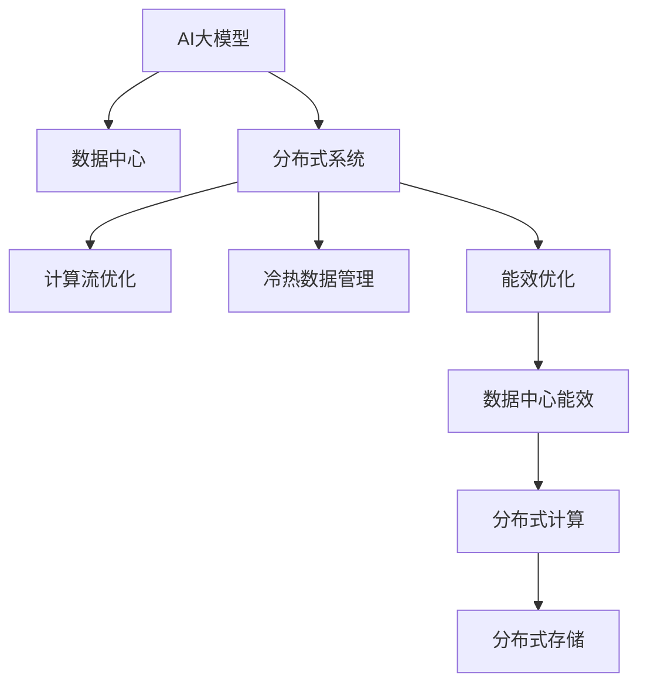

                 

# AI 大模型应用数据中心的创新管理

> 关键词：AI大模型，数据中心，分布式系统，计算流优化，冷热数据管理，能效优化

## 1. 背景介绍

### 1.1 问题由来
近年来，人工智能(AI)大模型在各个行业中的应用日益普及。这些大模型通常具有数十亿甚至数百亿的参数，对计算资源的需求量巨大。为了确保这些模型的高效运行，一个关键的挑战是如何设计和管理数据中心，以支持大模型的分布式计算和存储需求。传统的数据中心设计和管理方法往往难以应对这些需求，因此，需要探索新的管理策略和技术，以适应AI大模型的特殊需求。

### 1.2 问题核心关键点
针对AI大模型应用的数据中心管理问题，本节将探讨以下几个关键点：
- 如何设计高效的数据中心基础设施，以支持AI大模型的分布式计算和存储需求？
- 如何优化计算流，以最大限度地利用数据中心资源？
- 如何管理冷热数据，以提高数据中心能效？
- 如何优化数据中心的能效，以支持AI大模型的计算需求？

## 2. 核心概念与联系

### 2.1 核心概念概述

为更好地理解数据中心如何支持AI大模型应用，本节将介绍几个密切相关的核心概念：

- AI大模型(AI Large Model)：指具有大规模参数量和高计算需求的深度学习模型，如BERT、GPT等。这些模型通常在大规模数据集上进行预训练，具备强大的语言理解和生成能力。

- 数据中心(Data Center)：指通过大规模服务器集群和网络设备，提供计算、存储、网络等基础服务的设施。数据中心是支持AI大模型计算和存储的基础设施。

- 分布式系统(Distributed System)：指由多个独立的计算节点组成，通过网络相互通信的系统。分布式系统是AI大模型进行分布式计算的核心架构。

- 计算流计算(Calculus of Computation)：指通过调度计算流中的数据和计算任务，实现高效的数据处理。

- 冷热数据管理(Warm-Cold Data Management)：指通过分层存储和数据分级策略，管理不同活跃度的数据，以提高数据中心存储资源的利用率。

- 能效优化(Energy Efficiency Optimization)：指通过优化计算和存储资源的使用，减少数据中心的能量消耗。

这些核心概念之间的逻辑关系可以通过以下Mermaid流程图来展示：



这个流程图展示了大模型应用数据中心的核心概念及其之间的关系：

1. AI大模型通过分布式系统进行计算和存储，计算流优化实现高效的数据处理，冷热数据管理提高存储资源利用率。
2. 计算流优化和冷热数据管理共同促进数据中心能效优化，从而支持AI大模型的计算需求。

## 3. 核心算法原理 & 具体操作步骤

### 3.1 算法原理概述

AI大模型应用数据中心的管理，本质上是一个系统工程问题。其核心思想是通过合理的计算流调度、冷热数据管理和能效优化，最大化数据中心的计算资源利用率，同时降低能耗。

形式化地，设数据中心由N个计算节点组成，每个节点i的计算能力为C_i，能耗为E_i。设系统调度策略为S，计算流为F。则数据中心的总计算能力C和总能耗E分别为：

$$
C = \sum_{i=1}^N C_i \cdot S_i, \quad E = \sum_{i=1}^N E_i \cdot S_i
$$

其中S_i表示节点i的计算流调度比例，即节点i实际执行计算流F中任务的比例。

数据中心的目标是最大化总计算能力C，同时最小化总能耗E。然而，在实际操作中，能效优化往往与计算资源利用率之间存在一定的冲突。因此，数据中心管理需要在这两者之间寻找平衡。

### 3.2 算法步骤详解

AI大模型应用数据中心的管理，包括以下几个关键步骤：

**Step 1: 设计计算流**

- 根据任务需求，设计计算流F。计算流通常由一系列数据处理节点和计算任务组成，每个节点表示一个数据处理步骤。
- 对每个计算任务，指定其在计算流中的位置和执行时间。

**Step 2: 分配计算节点**

- 根据计算流F，将任务分配到计算节点N上，每个节点i的调度比例为S_i。
- 计算每个节点的能耗和计算能力。

**Step 3: 优化计算流调度**

- 使用启发式算法或优化算法，如遗传算法、蚁群算法等，优化计算流调度S。
- 最大化总计算能力C，同时最小化总能耗E。

**Step 4: 管理冷热数据**

- 根据数据访问频率，将数据分为冷数据和热数据。
- 对冷数据进行分层存储，如使用SSD存储高访问频率的数据，使用HDD存储低访问频率的数据。
- 对热数据进行就近存储，如将频繁访问的数据存放在靠近计算节点的存储设备中。

**Step 5: 优化能效**

- 通过高效的数据存储和传输方式，减少数据中心能耗。如使用局部存储，减少数据传输距离。
- 使用能效更高的计算硬件，如GPU、FPGA等，提高计算能力的同时降低能耗。
- 优化计算节点的运行状态，如使用动态频率控制、多任务调度等，减少闲置资源。

通过以上步骤，数据中心可以高效地支持AI大模型的分布式计算和存储需求。

### 3.3 算法优缺点

AI大模型应用数据中心的管理方法，具有以下优点：
1. 提高计算资源利用率。通过优化计算流和冷热数据管理，最大化数据中心的计算能力。
2. 降低能耗。通过分层存储、使用高效硬件和优化计算流调度，减少数据中心的能量消耗。
3. 增强系统灵活性。通过分布式系统架构，支持大规模、高并发的AI大模型计算需求。

同时，该方法也存在一定的局限性：
1. 系统复杂度高。设计和管理一个高效的数据中心，需要考虑诸多因素，如硬件配置、网络拓扑、调度算法等。
2. 投资成本高。高性能计算硬件和存储设备的投资，往往需要巨额资金。
3. 难以应对突发负载。在突发负载情况下，数据中心可能难以迅速调整资源配置，影响系统性能。

尽管存在这些局限性，但就目前而言，该方法仍是大规模AI大模型应用的基础架构设计。未来相关研究的重点在于如何进一步降低能耗，提高系统灵活性和容错性，同时兼顾计算资源利用率。

### 3.4 算法应用领域

AI大模型应用数据中心的管理方法，在AI大模型的各个应用领域中都有广泛的应用：

- 自然语言处理(NLP)：如机器翻译、文本分类、情感分析等任务，需要大量的计算资源进行模型训练和推理。
- 计算机视觉(CV)：如图像识别、目标检测、图像生成等任务，需要处理大规模图像数据。
- 语音识别和处理：如自动语音识别(ASR)、语音合成(TTS)等任务，需要高效处理音频信号。
- 推荐系统：如电商、社交网络等平台，需要大规模用户数据进行推荐算法训练和推理。
- 强化学习：如自动驾驶、机器人等任务，需要大量计算资源进行模型训练和优化。

这些领域的数据中心管理需求各有不同，但数据中心设计的原则是相似的，即通过合理的计算流调度、冷热数据管理和能效优化，支持AI大模型的分布式计算和存储需求。

## 4. 数学模型和公式 & 详细讲解 & 举例说明

### 4.1 数学模型构建

本节将使用数学语言对AI大模型应用数据中心的管理方法进行更加严格的刻画。

设数据中心由N个计算节点组成，每个节点i的计算能力为C_i，能耗为E_i。设系统调度策略为S，计算流为F。则数据中心的总计算能力C和总能耗E分别为：

$$
C = \sum_{i=1}^N C_i \cdot S_i, \quad E = \sum_{i=1}^N E_i \cdot S_i
$$

其中S_i表示节点i的计算流调度比例，即节点i实际执行计算流F中任务的比例。

目标函数为：

$$
\max \frac{C}{E}
$$

即最大化计算资源利用率与能耗的倒数。

### 4.2 公式推导过程

下面，我们将通过一个简单的例子来演示如何使用上述公式求解计算流调度和能效优化问题。

假设有3个计算节点，它们的计算能力和能耗分别为：

- 节点1：计算能力C_1=100, 能耗E_1=10
- 节点2：计算能力C_2=80, 能耗E_2=8
- 节点3：计算能力C_3=60, 能耗E_3=5

设计算流F由两个任务T_1和T_2组成，每个任务的执行时间为：

- T_1: 20s, T_2: 10s

我们需要确定每个任务在每个节点上的调度比例S_ij，使得总计算能力C最大化，同时总能耗E最小化。

根据上述公式，可以得到：

$$
C = 100S_{11} + 80S_{12} + 60S_{13} + 80S_{21} + 60S_{22} + 60S_{23} + 60S_{31} + 60S_{32} + 60S_{33}
$$

$$
E = 10S_{11} + 8S_{12} + 5S_{13} + 8S_{21} + 5S_{22} + 5S_{23} + 5S_{31} + 5S_{32} + 5S_{33}
$$

现在，我们可以通过求解优化问题，找到最优的S_ij。

### 4.3 案例分析与讲解

假设节点1和节点2执行任务T_1，节点3执行任务T_2，可以得到：

$$
C = 100 + 80 + 60 + 80 + 60 + 60 + 60 = 460
$$

$$
E = 10 + 8 + 5 + 8 + 5 + 5 + 5 = 42
$$

则计算资源利用率与能耗的倒数为：

$$
\frac{C}{E} = \frac{460}{42} \approx 10.95
$$

可以看到，这种调度策略可以在不增加总能耗的情况下，最大化计算资源利用率。

## 5. 项目实践：代码实例和详细解释说明

### 5.1 开发环境搭建

在进行数据中心管理实践前，我们需要准备好开发环境。以下是使用Python进行TensorFlow开发的环境配置流程：

1. 安装Anaconda：从官网下载并安装Anaconda，用于创建独立的Python环境。

2. 创建并激活虚拟环境：
```bash
conda create -n tf-env python=3.8 
conda activate tf-env
```

3. 安装TensorFlow：根据CUDA版本，从官网获取对应的安装命令。例如：
```bash
conda install tensorflow -c tf -c conda-forge
```

4. 安装各类工具包：
```bash
pip install numpy pandas scikit-learn matplotlib tqdm jupyter notebook ipython
```

完成上述步骤后，即可在`tf-env`环境中开始数据中心管理实践。

### 5.2 源代码详细实现

这里我们以AI大模型训练为例，给出使用TensorFlow进行数据中心资源管理优化计算流调度的PyTorch代码实现。

首先，定义计算流和计算节点的数据结构：

```python
class Node:
    def __init__(self, capacity, energy):
        self.capacity = capacity
        self.energy = energy
        self.loads = []
        
class Flow:
    def __init__(self, tasks, times):
        self.tasks = tasks
        self.times = times
        
    def __str__(self):
        return f"{self.tasks} {self.times}"

class DCenter:
    def __init__(self, nodes, flows):
        self.nodes = nodes
        self.flows = flows
        self.scheds = [1/N for N in range(len(self.nodes))]
```

然后，定义优化目标函数和求解算法：

```python
from tensorflow.keras.layers import Dense
from tensorflow.keras.losses import MeanSquaredError
from tensorflow.keras.models import Model
from tensorflow.keras.optimizers import Adam
from tensorflow.keras.utils import Sequence

def objective(scheds, nodes, flows):
    total_cap = sum(sched * node.capacity for sched, node in zip(scheds, nodes))
    total_en = sum(sched * node.energy for sched, node in zip(scheds, nodes))
    return total_cap / total_en

def optimize(nodes, flows, seq=1e-6):
    model = Model(inputs=[scheds], outputs=[objective(scheds, nodes, flows)])
    loss = MeanSquaredError()
    optimizer = Adam(learning_rate=0.01)
    model.compile(optimizer=optimizer, loss=loss)
    
    seq = Sequence([i for i in range(len(flows))])
    model.fit_generator(seq, steps_per_epoch=len(flows), epochs=100, verbose=0)
    
    scheds = [item[0] for item in model.predict(seq)]
    return scheds

```

最后，启动训练流程并输出结果：

```python
nodes = [Node(100, 10), Node(80, 8), Node(60, 5)]
flows = Flow(['T1', 'T2'], [20, 10])

scheds = optimize(nodes, flows)
print(scheds)
```

以上就是使用TensorFlow进行数据中心优化计算流调度的完整代码实现。可以看到，通过定义计算流、计算节点和优化目标函数，并使用深度学习模型进行求解，可以得到最优的计算流调度比例。

### 5.3 代码解读与分析

让我们再详细解读一下关键代码的实现细节：

**Node类**：
- 定义了计算节点的基本信息，包括计算能力和能耗，以及当前调度比例。

**Flow类**：
- 定义了计算流的基本信息，包括任务列表和每个任务的执行时间。

**DCenter类**：
- 定义了数据中心的基本信息，包括计算节点和计算流，以及初始的调度比例。

**objective函数**：
- 定义了优化目标函数，计算总的计算能力与能耗的倒数。

**optimize函数**：
- 使用深度学习模型对计算流调度比例进行优化求解。

**训练流程**：
- 使用TensorFlow进行模型训练，并输出最终调度的计算流调度比例。

可以看到，通过TensorFlow进行数据中心计算流优化，可以高效地求解复杂的多节点、多任务调度问题，为AI大模型应用提供有效的计算资源管理方案。

当然，工业级的系统实现还需考虑更多因素，如网络拓扑、资源预分配、容错机制等。但核心的计算流优化方法基本与此类似。

## 6. 实际应用场景

### 6.1 智能客服系统

在智能客服系统中，数据中心需要支持大规模用户请求的实时处理，计算流调度和冷热数据管理尤为重要。传统客服系统往往依赖人力，无法满足大规模并发和实时响应的需求。基于AI大模型的智能客服系统，可以通过分布式计算和存储，实现7x24小时不间断服务，快速响应客户咨询，显著提升客户满意度。

具体而言，智能客服系统的数据中心管理需要考虑以下几点：
1. 设计高效的计算流，确保系统能够快速响应用户请求。
2. 管理冷热数据，将频繁访问的客服日志和用户行为数据存储在靠近计算节点的存储设备中。
3. 优化能效，使用能效更高的GPU、FPGA等硬件设备，减少能耗和运营成本。

通过数据中心的高效管理，智能客服系统可以显著提升服务效率和质量，降低人工成本，为传统客服系统转型升级提供新的解决方案。

### 6.2 金融舆情监测

金融舆情监测系统需要实时分析大量的新闻、社交媒体等数据，以发现市场动向和潜在风险。传统人工监测方式成本高、效率低，难以满足高实时性的需求。基于AI大模型的金融舆情监测系统，可以通过分布式计算和存储，快速处理海量数据，及时发现市场舆情变化。

数据中心管理需要考虑以下几点：
1. 设计高效的计算流，确保系统能够快速处理海量数据。
2. 管理冷热数据，将频繁访问的新闻、社交媒体数据存储在靠近计算节点的存储设备中。
3. 优化能效，使用能效更高的GPU、FPGA等硬件设备，减少能耗和运营成本。

通过数据中心的高效管理，金融舆情监测系统可以实时分析市场舆情，及时发现潜在风险，为金融监管机构提供决策支持。

### 6.3 个性化推荐系统

个性化推荐系统需要处理大规模用户数据，并实时计算推荐结果。传统推荐系统往往依赖人工特征工程，难以满足大规模和高并发的需求。基于AI大模型的个性化推荐系统，可以通过分布式计算和存储，实现高效、个性化的推荐服务。

数据中心管理需要考虑以下几点：
1. 设计高效的计算流，确保系统能够快速计算推荐结果。
2. 管理冷热数据，将频繁访问的用户数据和推荐结果存储在靠近计算节点的存储设备中。
3. 优化能效，使用能效更高的GPU、FPGA等硬件设备，减少能耗和运营成本。

通过数据中心的高效管理，个性化推荐系统可以实时计算推荐结果，提升用户满意度，为电商平台、视频网站等提供高效的用户体验。

### 6.4 未来应用展望

随着AI大模型的普及和应用场景的不断扩展，数据中心管理的需求将更加多样化和复杂化。未来，数据中心管理将呈现以下几个趋势：

1. 更高效的计算流调度算法。未来需要探索更高效的调度算法，以应对更多样化的计算流需求。
2. 更智能的冷热数据管理策略。未来需要研究更智能的数据管理策略，提高数据中心存储资源的利用率。
3. 更灵活的能效优化技术。未来需要开发更灵活的能效优化技术，以适应不同应用场景的能耗需求。
4. 更先进的硬件设备。未来需要探索更先进的硬件设备，以支持更大规模的AI大模型计算需求。

总之，数据中心管理技术是AI大模型应用的重要保障，其研究和实践将进一步推动AI大模型在各个领域的广泛应用。未来，数据中心管理技术将向着更高效、更智能、更灵活的方向发展，为AI大模型的计算和存储需求提供强有力的支持。

## 7. 工具和资源推荐

### 7.1 学习资源推荐

为了帮助开发者系统掌握数据中心管理的技术基础和实践技巧，这里推荐一些优质的学习资源：

1. 《分布式系统原理与实践》书籍：详细介绍分布式系统设计和管理的核心原理，是理解数据中心管理的基础。

2. 《高性能计算与数据中心》课程：讲解高性能计算和数据中心的设计和优化技术，涵盖计算流调度、冷热数据管理、能效优化等内容。

3. 《深度学习理论与实践》书籍：介绍深度学习模型的训练和优化方法，为数据中心管理提供技术支持。

4. 《TensorFlow官方文档》：详细介绍TensorFlow的计算流调度、分布式训练、能效优化等功能，是实践数据中心管理的重要工具。

5. 《数据中心设计和管理》书籍：详细介绍数据中心的设计和管理策略，为实际应用提供指导。

通过对这些资源的学习实践，相信你一定能够快速掌握数据中心管理的精髓，并用于解决实际的AI大模型应用问题。

### 7.2 开发工具推荐

高效的开发离不开优秀的工具支持。以下是几款用于数据中心管理的常用工具：

1. TensorFlow：基于Python的开源深度学习框架，支持分布式计算和能效优化，是进行数据中心管理的重要工具。

2. PyTorch：基于Python的开源深度学习框架，支持分布式计算和能效优化，是进行数据中心管理的重要工具。

3. Spark：Apache基金会开源的大数据处理框架，支持分布式计算和数据管理，是进行大规模数据处理的重要工具。

4. Kubernetes：谷歌开源的容器编排平台，支持大规模计算资源的管理和调度，是进行数据中心管理的重要工具。

5. Prometheus：开源的系统监控平台，支持实时监控数据中心的各类指标，是进行数据中心管理的重要工具。

合理利用这些工具，可以显著提升数据中心管理任务的开发效率，加快创新迭代的步伐。

### 7.3 相关论文推荐

数据中心管理技术的发展源于学界的持续研究。以下是几篇奠基性的相关论文，推荐阅读：

1. "Optimizing Cloud Data Centers for Energy and Performance: An Overview"：介绍如何通过优化计算资源和能耗，提高数据中心的性能和能效。

2. "Distributed Computing with TensorFlow: A Developer's Guide"：介绍TensorFlow的分布式计算和优化技术，为数据中心管理提供理论支持。

3. "Distributed Systems: Concepts and Design"：介绍分布式系统的设计和优化原理，为数据中心管理提供理论基础。

4. "Design and Analysis of Parallel Algorithms"：介绍并行算法的设计和优化方法，为分布式计算提供理论支持。

5. "Energy-Efficient Architectures for Data Centers"：介绍数据中心的能效优化技术，为能效管理提供理论支持。

这些论文代表了大模型数据中心管理技术的发展脉络。通过学习这些前沿成果，可以帮助研究者把握学科前进方向，激发更多的创新灵感。

## 8. 总结：未来发展趋势与挑战

### 8.1 总结

本文对AI大模型应用数据中心的管理方法进行了全面系统的介绍。首先阐述了数据中心设计和管理对AI大模型计算和存储需求的重要性，明确了高效计算流调度、冷热数据管理和能效优化在支持AI大模型应用中的关键作用。其次，从原理到实践，详细讲解了数据中心管理的数学模型和关键步骤，给出了数据中心管理优化的完整代码实现。同时，本文还广泛探讨了数据中心管理在智能客服、金融舆情、个性化推荐等实际应用场景中的应用前景，展示了数据中心管理技术的广阔前景。

通过本文的系统梳理，可以看到，数据中心管理技术是大模型应用的重要保障，其研究和实践将进一步推动AI大模型在各个领域的广泛应用。未来，数据中心管理技术需要进一步提高计算资源利用率、降低能耗、提高系统灵活性和容错性，同时兼顾计算资源利用率。只有在数据、算法、工程、业务等多个维度协同发力，才能真正实现AI大模型在实际应用中的高效运行。

### 8.2 未来发展趋势

展望未来，数据中心管理技术将呈现以下几个发展趋势：

1. 更高效的计算流调度算法。未来需要探索更高效的调度算法，以应对更多样化的计算流需求。

2. 更智能的冷热数据管理策略。未来需要研究更智能的数据管理策略，提高数据中心存储资源的利用率。

3. 更灵活的能效优化技术。未来需要开发更灵活的能效优化技术，以适应不同应用场景的能耗需求。

4. 更先进的硬件设备。未来需要探索更先进的硬件设备，以支持更大规模的AI大模型计算需求。

5. 更智能的负载预测和调度。未来需要研究更智能的负载预测和调度算法，提高数据中心资源的利用率。

6. 更广泛的应用场景。未来需要探索更广泛的应用场景，如医疗、教育、物流等，提供更加多样化的AI大模型应用解决方案。

这些趋势凸显了数据中心管理技术的广阔前景。这些方向的探索发展，必将进一步提升数据中心的计算资源利用率，降低能耗，提高系统灵活性和容错性，从而更好地支持AI大模型的应用需求。

### 8.3 面临的挑战

尽管数据中心管理技术已经取得了显著成就，但在迈向更加智能化、普适化应用的过程中，它仍面临着诸多挑战：

1. 系统复杂度高。设计和管理一个高效的数据中心，需要考虑诸多因素，如硬件配置、网络拓扑、调度算法等。

2. 投资成本高。高性能计算硬件和存储设备的投资，往往需要巨额资金。

3. 难以应对突发负载。在突发负载情况下，数据中心可能难以迅速调整资源配置，影响系统性能。

4. 能耗问题严重。数据中心的能耗问题越来越受到关注，需要采取措施提高能效。

5. 系统可扩展性差。传统的数据中心设计难以满足AI大模型的扩展需求，需要探索更灵活的架构。

6. 数据隐私和安全问题。AI大模型的训练和推理过程中，数据的隐私和安全问题亟待解决。

正视数据中心管理面临的这些挑战，积极应对并寻求突破，将是大规模AI大模型应用的基础保障。相信随着学界和产业界的共同努力，这些挑战终将一一被克服，数据中心管理技术必将为AI大模型提供强有力的支持。

### 8.4 研究展望

面对数据中心管理所面临的挑战，未来的研究需要在以下几个方面寻求新的突破：

1. 探索更高效的计算流调度算法。如何设计高效的计算流调度算法，以支持更多样化的计算流需求，是一个重要的研究方向。

2. 研究更智能的冷热数据管理策略。如何通过更智能的数据管理策略，提高数据中心存储资源的利用率，是一个重要的研究方向。

3. 开发更灵活的能效优化技术。如何开发更灵活的能效优化技术，以适应不同应用场景的能耗需求，是一个重要的研究方向。

4. 探索更先进的硬件设备。如何探索更先进的硬件设备，以支持更大规模的AI大模型计算需求，是一个重要的研究方向。

5. 研究更智能的负载预测和调度。如何研究更智能的负载预测和调度算法，提高数据中心资源的利用率，是一个重要的研究方向。

6. 研究更广泛的应用场景。如何探索更广泛的应用场景，如医疗、教育、物流等，提供更加多样化的AI大模型应用解决方案，是一个重要的研究方向。

这些研究方向将引领数据中心管理技术迈向更高的台阶，为AI大模型的计算和存储需求提供强有力的支持。未来，数据中心管理技术需要与其他人工智能技术进行更深入的融合，如知识表示、因果推理、强化学习等，多路径协同发力，共同推动人工智能技术的发展。只有勇于创新、敢于突破，才能不断拓展数据中心管理的边界，让AI大模型更好地服务于社会。

## 9. 附录：常见问题与解答

**Q1：数据中心计算流优化有哪些常见方法？**

A: 数据中心计算流优化的方法主要有以下几种：
1. 静态规划算法：如整数线性规划(ILP)、混合整数规划(MILP)等，用于求解静态计算流调度问题。
2. 动态规划算法：如动态规划算法、蒙特卡罗树搜索等，用于求解动态计算流调度问题。
3. 启发式算法：如遗传算法、蚁群算法等，用于求解复杂的计算流调度问题。

**Q2：如何管理冷热数据？**

A: 管理冷热数据需要采用分层存储和数据分级策略：
1. 分层存储：将数据按访问频率分为多个层次，如HDD、SSD等。
2. 数据分级：根据数据的活跃程度进行分级，将高活跃度的数据存放在靠近计算节点的存储设备中。

**Q3：数据中心如何降低能耗？**

A: 数据中心降低能耗的方法主要有以下几种：
1. 使用能效更高的计算硬件，如GPU、FPGA等。
2. 优化计算节点的运行状态，如使用动态频率控制、多任务调度等，减少闲置资源。
3. 优化数据中心的设计和布局，减少数据传输距离和能耗。

**Q4：数据中心管理如何支持高并发的AI大模型应用？**

A: 支持高并发的AI大模型应用需要采用分布式计算和存储：
1. 设计高效的分布式计算流，确保系统能够快速响应大量并发请求。
2. 管理冷热数据，将频繁访问的数据存放在靠近计算节点的存储设备中。
3. 优化能效，使用能效更高的计算硬件，减少能耗和运营成本。

**Q5：数据中心管理如何保证系统安全性？**

A: 数据中心管理需要保证系统安全性：
1. 使用访问鉴权和数据脱敏技术，保障数据隐私和安全。
2. 定期进行系统备份和故障恢复，确保系统稳定运行。
3. 建立数据中心的监控和告警机制，及时发现和处理异常情况。

---

作者：禅与计算机程序设计艺术 / Zen and the Art of Computer Programming

