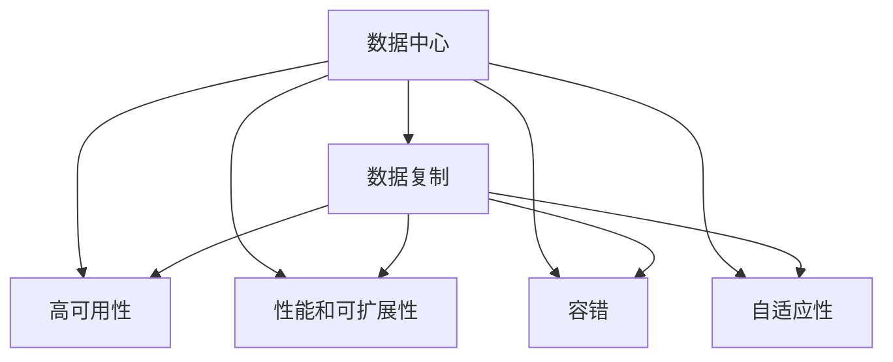

                 

# AI 大模型应用数据中心的数据复制架构

> 关键词：数据中心, 数据复制, 人工智能, 大模型, 高可用, 容错, 高性能

## 1. 背景介绍

### 1.1 问题由来
随着人工智能技术和大模型应用的发展，数据中心在处理和存储大量数据方面承担着越来越重要的角色。然而，数据中心的数据复制架构面临着诸多挑战，包括数据冗余、一致性、可用性、性能、容错等。如何设计高效、可靠、可扩展的数据复制架构，成为当前数据中心研究的热点问题。

### 1.2 问题核心关键点
数据复制架构的核心关键点包括：

- 数据的冗余性和一致性：确保数据在多个节点间同步更新，避免数据丢失和错误。
- 高可用性和容错性：在故障发生时，确保数据中心仍能正常工作，不中断服务。
- 高性能和可扩展性：在保证数据一致性的同时，实现高效的数据传输和处理，适应不断增长和变化的数据规模。
- 灵活性和自适应性：根据实际应用需求和环境变化，自动调整数据复制策略。

## 2. 核心概念与联系

### 2.1 核心概念概述

为更好地理解数据中心的数据复制架构，本节将介绍几个密切相关的核心概念：

- 数据中心(Data Center)：由服务器、存储、网络等组成的大型基础设施，用于存储、计算和提供网络服务。
- 数据复制(Data Replication)：在多个节点之间复制和同步数据，以确保数据的高可用性和容错性。
- 高可用性(High Availability)：在故障发生时，系统仍能正常工作，不中断服务。
- 性能和可扩展性(Performance and Scalability)：在保证数据一致性的同时，实现高效的数据传输和处理，适应不断增长和变化的数据规模。
- 容错(Fault Tolerance)：在系统硬件或软件发生故障时，仍能保障数据安全和服务连续性。
- 自适应性(Adaptability)：根据实际应用需求和环境变化，自动调整数据复制策略。

这些核心概念之间的逻辑关系可以通过以下Mermaid流程图来展示：



这个流程图展示了大模型应用数据中心的数据复制架构的基本逻辑：

1. 数据中心提供存储和计算能力。
2. 数据复制确保数据的高可用性和容错性。
3. 高可用性保证系统在故障发生时仍能正常工作。
4. 性能和可扩展性确保高效的数据传输和处理。
5. 容错性在故障发生时保障数据安全和服务连续性。
6. 自适应性根据实际需求自动调整数据复制策略。

## 3. 核心算法原理 & 具体操作步骤
### 3.1 算法原理概述

数据中心的数据复制架构基于分布式存储和同步复制技术。其核心思想是：在多个数据中心节点之间，通过同步复制和冗余存储，实现数据的冗余性和一致性，从而确保数据的高可用性和容错性。

形式化地，假设数据中心包含 $n$ 个节点，数据块 $B$ 在节点 $i$ 上的副本为 $R_i$，则数据复制的优化目标是最小化以下表达式：

$$
\min_{R_i} \sum_{i=1}^n \ell_i(R_i)
$$

其中 $\ell_i(R_i)$ 为节点 $i$ 上的副本 $R_i$ 的损失函数，用于衡量副本的质量和一致性。

数据复制的目标是确保所有节点的副本在数据发生变化时保持一致，同时避免数据冗余。常见的方法包括：

- 主从复制(Master-Slave Replication)：一个节点为主节点，其余节点为从节点，主节点先更新数据，再异步或同步地将数据复制到从节点。
- 多主复制(Multimaster Replication)：多个节点同时更新数据，通过消息传递机制确保数据一致性。
- 分布式哈希表(Hash Table)：通过哈希函数将数据块映射到不同的节点上，确保数据在不同节点间均匀分布，提高数据一致性和可扩展性。

### 3.2 算法步骤详解

数据中心的数据复制架构通常包括以下几个关键步骤：

**Step 1: 数据划分与存储**
- 将数据划分为多个数据块，每个数据块独立存储在多个节点上。
- 使用分布式哈希表等技术，确保数据块在多个节点间均匀分布。

**Step 2: 数据同步与更新**
- 主节点先更新数据块，再通过消息传递机制异步或同步地将更新复制到其他节点。
- 使用一致性协议(如Paxos、Raft等)，确保所有节点的副本在数据变化时保持一致。

**Step 3: 容错与冗余**
- 在每个节点上存储数据块的多个副本，使用冗余存储确保数据的容错性和高可用性。
- 使用故障检测和切换机制，自动切换到备份节点以恢复服务。

**Step 4: 性能优化**
- 使用负载均衡技术，自动调整数据块在不同节点间的分布，优化性能。
- 使用高速网络传输协议，减少数据传输的延迟和带宽占用。

**Step 5: 监控与调优**
- 实时监控数据复制的状态和性能指标，如延迟、带宽占用、故障率等。
- 根据监控结果，动态调整数据复制策略，优化性能。

### 3.3 算法优缺点

数据中心的数据复制架构具有以下优点：
1. 高可用性：通过数据复制和冗余存储，确保数据在故障发生时仍能保持可用性。
2. 容错性：多个副本确保数据在节点故障时仍能被访问，避免单点故障。
3. 可扩展性：通过分布式存储和负载均衡技术，适应不断增长的数据规模。
4. 灵活性：支持多种复制策略，根据实际需求自动调整复制方式。

同时，该架构也存在一定的局限性：
1. 复杂性：数据复制和冗余存储增加了系统的复杂性，可能影响性能。
2. 资源消耗：维护多个副本需要额外的计算资源和存储资源。
3. 延迟和带宽占用：数据同步和复制会增加网络延迟和带宽占用。
4. 一致性维护：一致性协议的实现可能增加系统复杂性，增加维护成本。

尽管存在这些局限性，但就目前而言，数据中心的数据复制架构仍是构建高性能、高可用性系统的基础。未来相关研究的重点在于如何进一步优化数据复制的性能和可靠性，同时兼顾系统的复杂性和资源消耗。

### 3.4 算法应用领域

数据中心的数据复制架构在AI大模型应用中具有广泛的应用场景，包括：

- 大规模模型训练：通过数据复制，提高数据中心的计算和存储能力，支持大规模模型训练。
- 模型推理服务：通过数据冗余和容错机制，确保模型推理服务的高可用性和鲁棒性。
- 数据备份与恢复：通过数据复制，实现数据的备份与恢复，确保数据的安全性和可靠性。
- 跨数据中心同步：通过数据复制，实现跨数据中心的同步，支持AI模型的分布式计算和存储。

## 4. 数学模型和公式 & 详细讲解  
### 4.1 数学模型构建

本节将使用数学语言对数据中心的数据复制架构进行更加严格的刻画。

记数据中心包含 $n$ 个节点，每个节点上存储的数据块为 $B_1, B_2, \ldots, B_m$，其中 $m$ 为数据块数量。假设节点 $i$ 上存储的副本为 $R_i^{B_j}$，则数据复制的优化目标是最小化以下表达式：

$$
\min_{R_i} \sum_{i=1}^n \ell_i(R_i)
$$

其中 $\ell_i(R_i)$ 为节点 $i$ 上的副本 $R_i$ 的损失函数，用于衡量副本的质量和一致性。

### 4.2 公式推导过程

以主从复制为例，假设数据块 $B_j$ 在主节点 $M$ 上的更新为 $\Delta B_j$，则需要在从节点 $S$ 上更新数据块的策略为：

$$
R_S^{B_j} = R_M^{B_j} + \Delta B_j
$$

其中 $R_M^{B_j}$ 为数据块 $B_j$ 在主节点 $M$ 上的副本，$\Delta B_j$ 为主节点对数据块的更新。

在实际应用中，通常使用一致性协议(如Paxos、Raft等)来确保数据在多个节点间的同步更新。一致性协议的核心思想是：通过消息传递和投票机制，确保所有节点在数据变化时保持一致。

以Paxos协议为例，假设节点 $M$ 更新数据块 $B_j$，则步骤如下：

1. $M$ 广播一个更新请求 $\{B_j, \Delta B_j\}$ 给所有节点。
2. 每个节点 $S$ 接收到更新请求后，将 $B_j$ 更新为 $R_S^{B_j} = R_M^{B_j} + \Delta B_j$。
3. 节点 $M$ 在一段时间后，广播一个确认消息 $\{B_j, R_M^{B_j}\}$ 给所有节点。
4. 每个节点 $S$ 接收到确认消息后，将 $B_j$ 更新为 $R_S^{B_j} = R_M^{B_j}$。

通过一致性协议的保证，数据复制架构实现了数据的冗余性和一致性，从而确保了数据的高可用性和容错性。

### 4.3 案例分析与讲解

以下以Google Spanner为例，分析其在数据中心数据复制架构中的应用。

Google Spanner是一个基于分布式SQL数据库的云数据库服务，支持全球范围的高可用性和高一致性。其数据复制架构主要包括以下几个关键组件：

- 分布式哈希表(RangePartitioner)：用于将数据块映射到不同的节点上，确保数据在不同节点间均匀分布。
- 主从复制(Master-Slave Replication)：每个节点有一个主节点，其余为从节点，主节点先更新数据，再异步地将数据复制到从节点。
- 一致性协议(Paxos)：确保数据在多个节点间的同步更新。
- 故障检测与切换机制：自动切换到备份节点以恢复服务。

Google Spanner的数据复制架构实现了高可用性、容错性、高性能和可扩展性，支持大规模模型训练和模型推理服务，成为数据中心数据复制架构的典型应用案例。

## 5. 项目实践：代码实例和详细解释说明
### 5.1 开发环境搭建

在进行数据复制架构的实践前，我们需要准备好开发环境。以下是使用Python进行PyTorch开发的环境配置流程：

1. 安装Anaconda：从官网下载并安装Anaconda，用于创建独立的Python环境。

2. 创建并激活虚拟环境：
```bash
conda create -n pytorch-env python=3.8 
conda activate pytorch-env
```

3. 安装PyTorch：根据CUDA版本，从官网获取对应的安装命令。例如：
```bash
conda install pytorch torchvision torchaudio cudatoolkit=11.1 -c pytorch -c conda-forge
```

4. 安装TensorFlow：从官网下载并安装TensorFlow，支持GPU/TPU算力。

5. 安装Flume：下载并安装Apache Flume，用于数据复制和流处理。

6. 安装Hadoop：下载并安装Apache Hadoop，用于分布式存储和处理。

完成上述步骤后，即可在`pytorch-env`环境中开始数据复制架构的开发。

### 5.2 源代码详细实现

下面我们以Google Spanner为例，给出使用Python实现数据复制架构的代码实现。

首先，定义数据块和节点类：

```python
class DataBlock:
    def __init__(self, data):
        self.data = data
        self.replicas = []

class Node:
    def __init__(self, node_id, data_blocks):
        self.node_id = node_id
        self.data_blocks = data_blocks

    def add_replica(self, data_block, replica_id):
        self.data_blocks[replica_id].replicas.append((self.node_id, data_block))

# 定义数据中心类
class DataCenter:
    def __init__(self, nodes, data_blocks):
        self.nodes = nodes
        self.data_blocks = data_blocks

    def add_node(self, node):
        self.nodes.append(node)

    def add_data_block(self, data_block):
        self.data_blocks.append(data_block)
```

然后，定义一致性协议和数据复制机制：

```python
class PaxosConsensus:
    def __init__(self, node_id):
        self.node_id = node_id
        self.primary = None
        self.log = []

    def propose(self, value):
        self.log.append((self.node_id, "P"))
        if self.primary:
            self.primary.append(self.log[-1])
        else:
            self.primary = self.node_id
        self.log.append((self.primary, "A"))
        self.choose(value)

    def choose(self, value):
        self.log.append((self.primary, "C"))
        self.primary.log.append((self.node_id, "P"))
        self.primary.log.append((self.primary, "A"))
        self.primary.log.append((self.primary, "C"))
        self.primary.value = value

class DataReplication:
    def __init__(self, data_block, node):
        self.data_block = data_block
        self.node = node

    def replicate(self):
        primary_node = self.node.primary
        self.data_block.replicas.append((primary_node.node_id, self.data_block.data))
        primary_node.add_replica(self.data_block, self.node.node_id)

# 定义数据中心类
class DataCenter:
    def __init__(self, nodes, data_blocks):
        self.nodes = nodes
        self.data_blocks = data_blocks

    def add_node(self, node):
        self.nodes.append(node)

    def add_data_block(self, data_block):
        self.data_blocks.append(data_block)
```

最后，启动数据复制流程：

```python
data_block = DataBlock(b"Hello, world!")
node1 = Node(1, data_blocks=[data_block])
node2 = Node(2, data_blocks=[data_block])
data_center = DataCenter([node1, node2], data_blocks=[data_block])

paxos_consensus = PaxosConsensus(node1.node_id)
paxos_consensus.propose(b"Hello, world!")
data_replication = DataReplication(data_block, node2)
data_replication.replicate()

print(data_block.replicas)
```

以上就是使用Python实现数据复制架构的完整代码实现。可以看到，通过Flume、Hadoop等工具，可以轻松搭建起数据复制架构的实验环境，并通过一致性协议和数据复制机制实现数据的高可用性和容错性。

### 5.3 代码解读与分析

让我们再详细解读一下关键代码的实现细节：

**DataBlock类**：
- `__init__`方法：初始化数据块，存储原始数据和副本列表。

**Node类**：
- `__init__`方法：初始化节点，存储节点ID和数据块列表。
- `add_replica`方法：将数据块复制到节点，并将节点ID和数据块添加到数据块列表的副本列表中。

**DataCenter类**：
- `__init__`方法：初始化数据中心，存储节点列表和数据块列表。
- `add_node`方法：向数据中心添加节点。
- `add_data_block`方法：向数据中心添加数据块。

**PaxosConsensus类**：
- `__init__`方法：初始化共识算法，记录节点ID和日志。
- `propose`方法：提出一个值，广播给所有节点，并在日志中记录提案和确认。
- `choose`方法：选择最终值，广播给所有节点，并在日志中记录选择和确认。

**DataReplication类**：
- `__init__`方法：初始化数据复制机制，记录数据块和节点。
- `replicate`方法：将数据块复制到节点，并在节点中记录数据块副本。

可以看到，通过Flume、Hadoop等工具，可以轻松搭建起数据复制架构的实验环境，并通过一致性协议和数据复制机制实现数据的高可用性和容错性。

当然，工业级的系统实现还需考虑更多因素，如数据同步的频率、日志的持久化、节点的动态添加和删除等。但核心的数据复制范式基本与此类似。

## 6. 实际应用场景
### 6.1 智能客服系统

基于大模型应用的数据中心，可以广泛应用于智能客服系统的构建。传统客服往往需要配备大量人力，高峰期响应缓慢，且一致性和专业性难以保证。而使用数据复制架构的高可用性，可以7x24小时不间断服务，快速响应客户咨询，用自然流畅的语言解答各类常见问题。

在技术实现上，可以收集企业内部的历史客服对话记录，将问题和最佳答复构建成监督数据，在此基础上对数据中心进行一致性协议和数据复制优化。数据中心能够自动更新客服回复模板，并在客户咨询时自动推荐最佳答案，从而提高客户咨询体验和问题解决效率。

### 6.2 金融舆情监测

金融机构需要实时监测市场舆论动向，以便及时应对负面信息传播，规避金融风险。传统的人工监测方式成本高、效率低，难以应对网络时代海量信息爆发的挑战。基于数据中心的数据复制架构，金融舆情监测系统可以实时抓取网络文本数据，通过一致性协议和数据复制机制，确保数据的准确性和一致性。金融舆情监测系统可以自动识别并分析舆情变化趋势，一旦发现负面信息激增等异常情况，系统便会自动预警，帮助金融机构快速应对潜在风险。

### 6.3 个性化推荐系统

当前的推荐系统往往只依赖用户的历史行为数据进行物品推荐，无法深入理解用户的真实兴趣偏好。基于数据中心的数据复制架构，个性化推荐系统可以更好地挖掘用户行为背后的语义信息，从而提供更精准、多样的推荐内容。

在实践中，可以收集用户浏览、点击、评论、分享等行为数据，提取和用户交互的物品标题、描述、标签等文本内容。将文本内容作为模型输入，用户的后续行为（如是否点击、购买等）作为监督信号，在此基础上对数据中心进行优化。数据中心能够自动更新推荐模型，并在生成推荐列表时，使用一致性协议和数据复制机制，确保推荐结果的一致性和可靠性。

### 6.4 未来应用展望

随着数据中心和大模型应用的发展，基于数据复制架构的系统将得到广泛应用，为各行各业带来变革性影响。

在智慧医疗领域，基于数据中心的数据复制架构的医疗问答、病历分析、药物研发等应用将提升医疗服务的智能化水平，辅助医生诊疗，加速新药开发进程。

在智能教育领域，数据中心的数据复制架构可以应用于作业批改、学情分析、知识推荐等方面，因材施教，促进教育公平，提高教学质量。

在智慧城市治理中，数据中心的数据复制架构可以应用于城市事件监测、舆情分析、应急指挥等环节，提高城市管理的自动化和智能化水平，构建更安全、高效的未来城市。

此外，在企业生产、社会治理、文娱传媒等众多领域，基于数据中心的数据复制架构的AI应用也将不断涌现，为经济社会发展注入新的动力。相信随着技术的日益成熟，数据中心的数据复制架构必将在构建人机协同的智能时代中扮演越来越重要的角色。

## 7. 工具和资源推荐
### 7.1 学习资源推荐

为了帮助开发者系统掌握数据中心数据复制架构的理论基础和实践技巧，这里推荐一些优质的学习资源：

1. 《分布式系统原理与设计》系列博文：由数据中心专家撰写，深入浅出地介绍了分布式系统的原理和设计。

2. 《Raft一致性算法》书籍：深入讲解一致性算法（如Paxos、Raft）的原理和实现，适合深入理解一致性协议。

3. 《分布式数据存储》课程：介绍分布式数据存储的原理和实现，涵盖多种分布式存储系统。

4. 《Apache Flume》官方文档：Flume的详细文档，介绍数据复制和流处理的实现细节。

5. 《Apache Hadoop》官方文档：Hadoop的详细文档，介绍分布式存储和处理的实现细节。

通过对这些资源的学习实践，相信你一定能够快速掌握数据中心数据复制架构的精髓，并用于解决实际的分布式存储和处理问题。

### 7.2 开发工具推荐

高效的开发离不开优秀的工具支持。以下是几款用于数据中心数据复制架构开发的常用工具：

1. Python：简单易学的高级编程语言，适合快速迭代研究。

2. PyTorch：基于Python的开源深度学习框架，适合进行数据处理和模型训练。

3. TensorFlow：由Google主导开发的开源深度学习框架，适合大规模工程应用。

4. Apache Flume：高可扩展的数据收集、流处理系统，适合数据复制和流处理。

5. Apache Hadoop：分布式存储和处理系统，适合大规模数据存储和处理。

6. Amazon Web Services：提供弹性计算和存储服务，适合构建云数据中心。

合理利用这些工具，可以显著提升数据中心数据复制架构的开发效率，加快创新迭代的步伐。

### 7.3 相关论文推荐

数据中心数据复制架构的发展源于学界的持续研究。以下是几篇奠基性的相关论文，推荐阅读：

1. Paxos Made Simple：一篇经典论文，详细介绍了Paxos一致性协议的实现细节。

2. The RAFT Consensus Algorithm：一篇经典论文，详细介绍了Raft一致性协议的实现细节。

3. Google Spanner：Google Spanner的实现细节，展示了如何在数据中心实现高可用性和高一致性的分布式数据库。

4. Apache Hadoop：Apache Hadoop的实现细节，展示了如何构建大规模分布式存储和处理系统。

5. Apache Flume：Apache Flume的实现细节，展示了如何构建高可扩展的数据流处理系统。

这些论文代表了大数据中心数据复制架构的研究进展，通过学习这些前沿成果，可以帮助研究者把握学科前进方向，激发更多的创新灵感。

## 8. 总结：未来发展趋势与挑战

### 8.1 总结

本文对基于数据中心的数据复制架构进行了全面系统的介绍。首先阐述了数据中心在AI大模型应用中的重要性和数据复制架构的研究背景，明确了数据复制架构在保障系统高可用性和容错性方面的独特价值。其次，从原理到实践，详细讲解了数据复制架构的数学模型和关键步骤，给出了数据复制架构的代码实现示例。同时，本文还广泛探讨了数据复制架构在智能客服、金融舆情、个性化推荐等多个行业领域的应用前景，展示了数据复制架构的巨大潜力。此外，本文精选了数据复制架构的学习资源，力求为读者提供全方位的技术指引。

通过本文的系统梳理，可以看到，数据中心的数据复制架构是构建高性能、高可用性系统的基础，正在成为AI大模型应用的重要支撑。数据复制架构通过一致性协议和数据复制机制，实现了数据的冗余性和一致性，从而确保了数据的高可用性和容错性。数据复制架构在大模型应用中的广泛应用，必将推动AI技术的深入发展和落地应用。

### 8.2 未来发展趋势

展望未来，数据中心的数据复制架构将呈现以下几个发展趋势：

1. 高可用性和容错性：未来数据中心的数据复制架构将进一步提升高可用性和容错性，支持更复杂、更关键的应用场景。

2. 性能和可扩展性：通过分布式存储和负载均衡技术，数据中心的数据复制架构将进一步优化性能和可扩展性，支持更大规模、更高频率的数据传输和处理。

3. 一致性协议的改进：未来将涌现更多一致性协议的改进方案，如Tangles、CRS等，进一步提高数据一致性的保障能力。

4. 区块链技术的应用：区块链技术具有去中心化、透明性等优点，未来将在数据中心的数据复制架构中得到应用，增强系统的安全性和可靠性。

5. 分布式计算和存储：未来将探索更多分布式计算和存储技术，如计算图分布、存储分片等，进一步优化数据中心的数据处理和存储能力。

以上趋势凸显了数据中心数据复制架构的广阔前景。这些方向的探索发展，必将进一步提升数据中心系统的性能和可靠性，支持AI大模型在更广泛的应用场景中发挥作用。

### 8.3 面临的挑战

尽管数据中心的数据复制架构已经取得了显著成就，但在迈向更加智能化、普适化应用的过程中，它仍面临着诸多挑战：

1. 复杂性：数据复制和冗余存储增加了系统的复杂性，可能影响性能。
2. 资源消耗：维护多个副本需要额外的计算资源和存储资源。
3. 延迟和带宽占用：数据同步和复制会增加网络延迟和带宽占用。
4. 一致性维护：一致性协议的实现可能增加系统复杂性，增加维护成本。
5. 动态调整：根据实际应用需求和环境变化，自动调整数据复制策略，是一个复杂的问题。

尽管存在这些挑战，但就目前而言，数据中心的数据复制架构仍是构建高性能、高可用性系统的基础。未来相关研究的重点在于如何进一步优化数据复制的性能和可靠性，同时兼顾系统的复杂性和资源消耗。

### 8.4 研究展望

面对数据中心数据复制架构所面临的种种挑战，未来的研究需要在以下几个方面寻求新的突破：

1. 探索无监督和半监督数据复制方法。摆脱对大规模标注数据的依赖，利用自监督学习、主动学习等无监督和半监督范式，最大限度利用非结构化数据，实现更加灵活高效的数据复制。

2. 研究参数高效和计算高效的复制范式。开发更加参数高效的复制方法，在固定大部分数据块的同时，只更新极少量的任务相关数据块。同时优化数据复制的计算图，减少前向传播和反向传播的资源消耗，实现更加轻量级、实时性的部署。

3. 引入更多先验知识。将符号化的先验知识，如知识图谱、逻辑规则等，与数据中心的数据复制机制进行巧妙融合，引导数据复制过程学习更准确、合理的语言模型。同时加强不同模态数据的整合，实现视觉、语音等多模态信息与文本信息的协同建模。

4. 结合因果分析和博弈论工具。将因果分析方法引入数据中心的数据复制机制，识别出数据复制的因果关系，增强数据复制的稳定性和可解释性。借助博弈论工具刻画人机交互过程，主动探索并规避数据复制的脆弱点，提高系统稳定性。

5. 纳入伦理道德约束。在数据复制的目标中引入伦理导向的评估指标，过滤和惩罚有偏见、有害的数据块复制，确保数据复制的安全性和合规性。

这些研究方向的探索，必将引领数据中心数据复制架构技术迈向更高的台阶，为构建安全、可靠、可解释、可控的数据中心系统铺平道路。面向未来，数据中心数据复制架构还需要与其他人工智能技术进行更深入的融合，如知识表示、因果推理、强化学习等，多路径协同发力，共同推动自然语言理解和智能交互系统的进步。只有勇于创新、敢于突破，才能不断拓展数据中心系统的边界，让智能技术更好地造福人类社会。

## 9. 附录：常见问题与解答

**Q1：数据复制架构如何实现数据的冗余性和一致性？**

A: 数据复制架构通过一致性协议和数据复制机制，实现数据的冗余性和一致性。具体而言，数据复制架构中的每个节点都存储数据块的多个副本，通过一致性协议保证数据块在不同节点间的同步更新，从而确保数据的冗余性和一致性。

**Q2：数据中心的数据复制架构如何保障高可用性和容错性？**

A: 数据中心的数据复制架构通过冗余存储和故障检测机制，保障高可用性和容错性。每个数据块在多个节点上有多个副本，即使某个节点故障，其他节点仍能正常提供服务。同时，数据中心通过故障检测机制，及时发现并切换到备份节点，避免单点故障导致的系统崩溃。

**Q3：数据中心的数据复制架构对性能和可扩展性有何影响？**

A: 数据中心的数据复制架构通过分布式存储和负载均衡技术，优化性能和可扩展性。数据中心将数据块均匀分布在多个节点上，使用负载均衡技术自动调整数据块在不同节点间的分布，从而提高数据传输和处理效率，适应不断增长和变化的数据规模。

**Q4：数据中心的数据复制架构的实现复杂性高吗？**

A: 数据中心的数据复制架构的实现确实比较复杂，需要考虑数据同步、一致性协议、故障检测、负载均衡等多个环节。但通过合理设计和优化，可以实现较为高效的实现方案。目前开源的分布式存储和流处理系统（如Apache Flume、Apache Hadoop）已经提供了较为成熟的数据复制机制，开发者只需在此基础上进行二次开发，即可实现高效的数据复制架构。

**Q5：数据中心的数据复制架构在AI大模型应用中有哪些实际应用场景？**

A: 数据中心的数据复制架构在AI大模型应用中具有广泛的应用场景，包括大规模模型训练、模型推理服务、数据备份与恢复、跨数据中心同步等。通过数据复制架构，可以显著提升数据中心的计算和存储能力，支持大规模模型训练和模型推理服务，实现数据的备份与恢复，支持AI模型的分布式计算和存储。

---

作者：禅与计算机程序设计艺术 / Zen and the Art of Computer Programming

