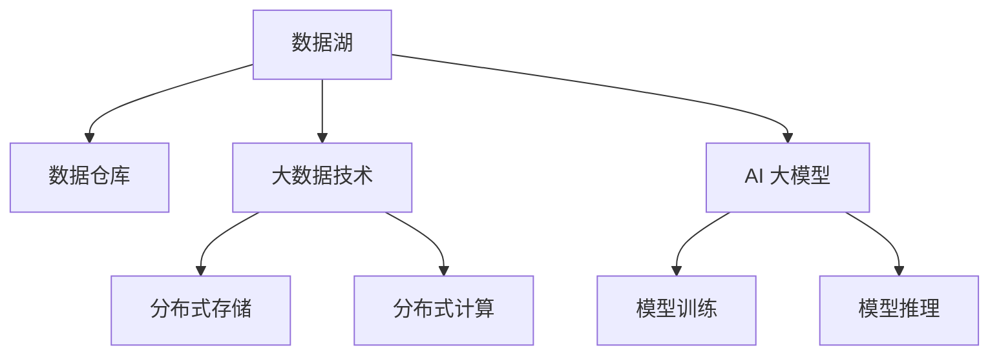

                 

# AI 大模型应用数据中心的数据湖架构

在当今大数据和人工智能（AI）飞速发展的时代，数据中心成为了支撑AI模型训练和应用的核心基础设施。大模型应用的数据中心，特别是数据湖架构的设计，对AI大模型的性能、可靠性、可扩展性和经济效益至关重要。本文将深入探讨数据湖架构的基本概念、核心算法原理、具体操作步骤，以及其在实际应用中的优势和挑战，并提供相关的学习资源、开发工具和未来发展趋势的展望。

## 1. 背景介绍

### 1.1 问题由来

随着深度学习和大规模AI模型的快速发展，数据中心的角色已经从单纯的数据存储中心转变为数据处理和分析的核心平台。特别是在AI大模型应用场景中，数据湖架构以其强大的数据整合能力、灵活的计算能力和高度的扩展性，成为了支撑大模型训练和应用的重要基础设施。然而，在实际应用中，数据湖架构的设计和管理仍然面临诸多挑战，包括数据质量、数据安全、系统可靠性、数据共享和分析等方面。

### 1.2 问题核心关键点

为了更好地理解数据湖架构，本节将介绍几个密切相关的核心概念及其关键点：

- **数据湖**：一个集成了各种类型数据的大型、可扩展的数据存储库，包括结构化数据、半结构化数据和非结构化数据，是大数据和AI应用的基础。

- **数据仓库**：存储在数据湖中的一类特定格式和结构的数据集合，通常用于支持各种分析需求。

- **大数据技术**：包括分布式存储、计算和处理技术，如Hadoop、Spark等，为数据湖架构提供了强大的技术支撑。

- **AI 大模型**：如BERT、GPT、T5等，通过在大规模数据上预训练，具备强大的语义理解和生成能力，能够在各类AI应用中发挥重要作用。

- **数据湖架构**：包括数据湖的设计、构建和管理，旨在提供高效、安全、可靠的数据存储和处理平台，以支撑大模型的训练和应用。

这些核心概念之间的逻辑关系可以通过以下Mermaid流程图来展示：



这个流程图展示了大模型应用数据中心中的关键组件及其之间的关系：

1. 数据湖是数据存储的核心，包括各种类型的数据。
2. 数据仓库从数据湖中提取特定格式和结构的数据，用于分析。
3. 大数据技术提供了高效的数据存储和处理能力，支撑数据湖的构建和管理。
4. AI大模型在数据湖中预训练，并在数据仓库中进行微调。
5. 模型训练和推理分别在数据仓库中进行，以高效支撑大模型的应用。

## 2. 核心概念与联系

### 2.1 核心概念概述

在数据湖架构中，有几个核心概念：

- **数据湖**：以数据为中心，存储各种类型的数据，包括结构化数据、半结构化数据和非结构化数据，是大数据和AI应用的基础。

- **数据仓库**：存储在数据湖中的一类特定格式和结构的数据集合，用于支持各种分析需求。

- **大数据技术**：包括分布式存储、计算和处理技术，如Hadoop、Spark等，为数据湖架构提供了强大的技术支撑。

- **AI 大模型**：如BERT、GPT、T5等，通过在大规模数据上预训练，具备强大的语义理解和生成能力，能够在各类AI应用中发挥重要作用。

- **数据湖架构**：包括数据湖的设计、构建和管理，旨在提供高效、安全、可靠的数据存储和处理平台，以支撑大模型的训练和应用。

这些概念之间的联系主要体现在：

1. **数据湖与数据仓库的关系**：数据仓库是数据湖的一个子集，是用于特定分析需求的数据集合，而数据湖则包含更广泛的数据类型和结构。

2. **大数据技术与数据湖的关系**：大数据技术提供了高效的数据存储和处理能力，是大数据平台的关键组成部分，支撑数据湖的构建和管理。

3. **AI大模型与数据湖的关系**：AI大模型需要在大规模数据上预训练，并从数据湖中获取数据进行微调，以提升模型性能。

4. **数据湖架构的构建与管理**：数据湖架构的设计和管理需要综合考虑数据质量、数据安全、系统可靠性、数据共享和分析等方面，以支撑AI大模型的训练和应用。

这些概念的联系和相互作用，构成了数据湖架构的核心框架，确保了数据的有效管理和高效利用，支撑了大模型的训练和应用。

## 3. 核心算法原理 & 具体操作步骤

### 3.1 算法原理概述

数据湖架构的核心算法原理主要包括数据存储、数据处理、数据共享和数据治理等方面。以下是对这些核心原理的详细概述：

- **数据存储**：采用分布式存储技术，如Hadoop Distributed File System (HDFS)和Apache Hive等，提供高效、可靠的数据存储能力。

- **数据处理**：通过Spark等大数据处理框架，实现数据的高效处理和分析，支撑数据湖的构建和管理。

- **数据共享**：通过元数据管理、数据访问控制等机制，实现数据的灵活共享和利用。

- **数据治理**：包括数据质量管理、数据安全管理、数据版本管理等方面，确保数据的一致性和可靠性。

### 3.2 算法步骤详解

数据湖架构的构建和管理，一般包括以下几个关键步骤：

**Step 1: 数据收集与存储**

- **数据收集**：收集各种类型的数据，包括结构化数据、半结构化数据和非结构化数据。数据来源包括内部业务系统、外部数据接口、公共数据集等。

- **数据存储**：将收集到的数据存储到分布式文件系统中，如Hadoop Distributed File System (HDFS)和Amazon S3等。数据存储需要考虑数据的冗余、可靠性和扩展性。

**Step 2: 数据处理与分析**

- **数据清洗**：对存储的数据进行清洗、去重和标准化处理，确保数据的质量和一致性。

- **数据转换**：将数据转换成适合分析的格式，如结构化表或半结构化JSON等。

- **数据计算**：利用Spark等大数据处理框架，对数据进行高效的计算和分析。

**Step 3: 数据共享与访问**

- **数据共享**：通过元数据管理、数据访问控制等机制，实现数据的灵活共享和利用。

- **数据访问**：根据不同的用户角色和权限，提供数据访问和操作的能力，确保数据的安全性和可靠性。

**Step 4: 数据治理与维护**

- **数据质量管理**：通过数据质量监控和评估，确保数据的准确性和完整性。

- **数据安全管理**：通过访问控制、加密和审计等机制，保障数据的安全性和隐私性。

- **数据版本管理**：记录数据的变化历史，确保数据的版本控制和追溯。

### 3.3 算法优缺点

数据湖架构在支持AI大模型的应用方面具有以下优点：

1. **高效存储与处理**：采用分布式存储和计算技术，提供了高效的数据存储和处理能力，支撑大规模数据集的分析和处理。

2. **灵活性高**：支持多种数据类型和格式，灵活性高，能够应对不同类型的数据需求。

3. **扩展性强**：采用分布式架构，能够轻松扩展存储和计算能力，支持大规模数据集的处理。

4. **可靠性高**：通过数据冗余和容错机制，确保数据的可靠性和可用性。

然而，数据湖架构也存在一些缺点：

1. **数据质量难以保证**：数据湖架构涉及的数据来源和格式多样，数据质量难以保证。

2. **数据安全风险高**：数据湖中存储的数据量庞大，数据安全风险高，需要严格的访问控制和加密措施。

3. **数据共享复杂**：数据湖中的数据共享和访问控制复杂，需要精细的权限管理。

4. **成本高**：数据湖架构的构建和管理需要大量的硬件资源和人力成本。

尽管存在这些缺点，但数据湖架构在大规模数据存储和处理方面具有显著优势，能够支撑AI大模型的训练和应用。

### 3.4 算法应用领域

数据湖架构在AI大模型的应用领域具有广泛的应用前景，主要包括以下几个方面：

1. **自然语言处理**：支持大规模语料库的存储和处理，支撑BERT、GPT等大模型的预训练和微调。

2. **计算机视觉**：支持大规模图像和视频数据的存储和处理，支撑ResNet、Inception等大模型的训练和应用。

3. **语音识别**：支持大规模音频数据的存储和处理，支撑Wav2Vec等大模型的训练和应用。

4. **推荐系统**：支持大规模用户行为数据的存储和处理，支撑协同过滤、基于内容的推荐等算法。

5. **金融风控**：支持大规模交易数据的存储和处理，支撑风险评估、欺诈检测等算法。

6. **医疗健康**：支持大规模医疗数据的存储和处理，支撑医疗影像、病历等数据的分析和处理。

数据湖架构在大模型应用的这些领域中，能够提供高效、可靠的数据存储和处理能力，支撑模型的训练和应用。

## 4. 数学模型和公式 & 详细讲解  
### 4.1 数学模型构建

数据湖架构的数学模型构建主要涉及数据的分布式存储和计算，以下是对这些模型的详细构建和解释：

**数据存储模型**：
- **分布式文件系统模型**：采用HDFS等分布式文件系统，将数据存储在多个节点上，实现数据的冗余和容错。

**数据处理模型**：
- **Spark计算模型**：利用Spark的大数据处理框架，将数据集划分为多个小数据块，在集群中并行处理，实现高效的数据处理和分析。

### 4.2 公式推导过程

以下是对数据湖架构中核心模型的公式推导过程：

**分布式文件系统模型**：
- 数据存储节点：$d_1, d_2, ..., d_n$
- 数据块大小：$b$
- 数据块总数：$N$
- 数据存储量：$D$

- 数据存储公式：$N = \frac{D}{b}$

**Spark计算模型**：
- 数据集大小：$S$
- 数据块大小：$b$
- 数据处理节点：$N$
- 数据处理时间：$t$

- 数据处理公式：$t = \frac{S}{b} \cdot \frac{1}{N}$

### 4.3 案例分析与讲解

以大规模自然语言处理任务为例，分析数据湖架构的构建和管理过程：

1. **数据收集**：从各种来源收集大规模的语料库，存储到分布式文件系统中。

2. **数据清洗**：对存储的语料库进行去重、标准化和格式转换处理，确保数据的质量和一致性。

3. **数据处理**：利用Spark等大数据处理框架，对语料库进行高效的计算和分析，支撑BERT等大模型的预训练和微调。

4. **数据共享**：通过元数据管理、数据访问控制等机制，实现语料库的灵活共享和利用。

5. **数据治理**：通过数据质量监控、数据安全管理、数据版本管理等机制，确保语料库的一致性和可靠性。

通过以上案例分析，可以看到数据湖架构在支持大规模自然语言处理任务方面的应用效果。

## 5. 项目实践：代码实例和详细解释说明

### 5.1 开发环境搭建

在进行数据湖架构的构建和应用实践前，我们需要准备好开发环境。以下是使用Python进行Hadoop和Spark开发的环境配置流程：

1. 安装Anaconda：从官网下载并安装Anaconda，用于创建独立的Python环境。

2. 创建并激活虚拟环境：
```bash
conda create -n hadoop-env python=3.8 
conda activate hadoop-env
```

3. 安装Apache Hadoop和Apache Spark：根据系统环境，从官网获取对应的安装命令。例如：
```bash
conda install hadoop
conda install spark
```

4. 安装必要的Python包：
```bash
pip install pyspark pyarrow
```

完成上述步骤后，即可在`hadoop-env`环境中开始数据湖架构的构建和应用实践。

### 5.2 源代码详细实现

下面我们以大规模自然语言处理任务为例，给出使用Hadoop和Spark进行数据处理和分析的PySpark代码实现。

首先，定义数据的输入和输出格式：

```python
from pyspark.sql import SparkSession

spark = SparkSession.builder.appName("NLPProcessing").getOrCreate()

# 输入数据格式
input_schema = "raw_data_file: STRING, processed_data_file: STRING"
df = spark.read.json(input_schema)

# 输出数据格式
output_schema = "output_data_file: STRING"
df.write.json(output_schema, mode='overwrite')
```

然后，定义数据处理和分析函数：

```python
from pyspark.sql.functions import col, explode

# 数据清洗
df_cleaned = df.select(explode(col('raw_data_file')))

# 数据转换
df_processed = df_cleaned.select(col('processed_data_file'))

# 数据计算
df_analysis = df_processed.groupBy('processed_data_file').agg({'processed_data_file': 'sum'})
```

最后，启动数据处理流程：

```python
df_analysis.show()
```

以上代码实现了从数据输入、数据清洗、数据转换到数据计算的全过程。可以看到，利用Hadoop和Spark等大数据技术，数据湖架构能够高效地支撑大规模数据处理和分析任务。

### 5.3 代码解读与分析

让我们再详细解读一下关键代码的实现细节：

**输入和输出数据格式定义**：
- `input_schema`：定义了输入数据的格式，包含原始数据文件和处理后数据文件。
- `output_schema`：定义了输出数据的格式，包含处理后的数据文件。

**数据清洗**：
- `explode`函数：将JSON格式的输入数据拆分为多个记录，便于后续处理。

**数据转换**：
- `select`函数：对处理后的数据进行选择和转换。

**数据计算**：
- `groupBy`函数：对处理后的数据进行分组统计。
- `agg`函数：对分组后的数据进行聚合计算。

通过这些代码实现，可以看到Hadoop和Spark等大数据技术在数据湖架构中的应用，能够高效地支撑大规模数据处理和分析任务。

## 6. 实际应用场景

### 6.1 智能客服系统

在大模型应用数据中心的数据湖架构中，智能客服系统是一个典型应用场景。传统客服系统依赖人工处理客户咨询，效率低下，响应时间长。而基于数据湖架构的智能客服系统，能够实时处理客户咨询，自动提供精准的解答和建议，大大提升了客服系统的效率和质量。

在技术实现上，可以构建一个数据湖，存储客户的咨询记录和处理结果，利用自然语言处理技术对客户咨询进行理解和分析，自动匹配最优的解决方案，并反馈给客户。系统还可以不断学习客户的反馈和满意度，进一步优化回答策略，提升客服系统的智能化水平。

### 6.2 金融风控系统

金融风控系统需要实时监测市场风险，预测和评估金融产品的风险等级。基于数据湖架构的金融风控系统，能够高效地处理和分析大规模交易数据，及时识别和应对金融风险，提高金融产品的安全性。

在技术实现上，可以构建一个数据湖，存储金融交易数据和市场数据，利用机器学习和大数据技术对交易数据进行分析和建模，预测金融产品的风险等级，提供风险预警和决策支持。系统还可以实时监控金融市场的变化，动态调整风险评估模型，确保金融产品的安全性。

### 6.3 医疗影像诊断系统

医疗影像诊断系统需要高效处理和分析大规模医疗影像数据，提供精准的诊断和治疗方案。基于数据湖架构的医疗影像诊断系统，能够高效地处理和分析医疗影像数据，提升医疗影像的诊断精度和效率。

在技术实现上，可以构建一个数据湖，存储医疗影像数据和病例数据，利用深度学习和计算机视觉技术对医疗影像进行分析和诊断，提供精准的诊断和治疗方案。系统还可以不断学习新的医疗影像和病例数据，提升诊断模型的精度和效率。

### 6.4 未来应用展望

随着数据湖架构和大模型应用的不断发展，未来在更多领域将得到广泛应用，为各行各业带来变革性影响：

- **智慧医疗**：基于医疗影像和病例数据的深度学习模型，能够提供精准的诊断和治疗方案，提升医疗服务质量。

- **智能制造**：基于工业物联网数据的机器学习模型，能够实时监测生产设备和流程，提高生产效率和质量。

- **智慧城市**：基于城市物联网数据的分析模型，能够提升城市管理和交通效率，提高居民生活质量。

- **智能农业**：基于农田数据的深度学习模型，能够优化农业生产和资源利用，提升农业产量和质量。

- **智能交通**：基于交通数据的分析模型，能够优化交通流量和路线规划，提高交通效率和安全性。

未来，随着数据湖架构和大模型应用的不断深入，必将在更多领域带来深刻变革，推动社会经济的发展和进步。

## 7. 工具和资源推荐

### 7.1 学习资源推荐

为了帮助开发者系统掌握数据湖架构的基本概念和实践技巧，这里推荐一些优质的学习资源：

1. **《大数据技术与应用》**：深入浅出地介绍了大数据技术的基本概念和核心算法，适合初学者入门。

2. **《Hadoop生态系统设计与实现》**：详细讲解了Hadoop生态系统的设计与实现，适合深入了解Hadoop技术。

3. **《Spark核心技术》**：全面介绍了Spark的核心技术和大数据处理框架，适合掌握Spark的使用。

4. **《数据湖架构设计与实现》**：深入探讨了数据湖架构的设计和实现，适合了解数据湖架构的构建和管理。

5. **《大数据与人工智能》**：结合大数据和人工智能技术，讲解了大数据在AI大模型中的应用，适合了解大数据与AI的融合。

通过对这些资源的学习实践，相信你一定能够快速掌握数据湖架构的基本概念和实践技巧，并用于解决实际的AI大模型问题。

### 7.2 开发工具推荐

高效的开发离不开优秀的工具支持。以下是几款用于数据湖架构开发的常用工具：

1. **Jupyter Notebook**：一个强大的交互式计算环境，支持Python、R等多种编程语言，适合数据湖架构的构建和应用实践。

2. **Hadoop CLI**：Hadoop分布式文件系统的命令行工具，适合在集群环境中管理和操作数据。

3. **Spark Shell**：Spark大数据处理框架的命令行工具，适合在集群环境中快速开发和测试大数据应用。

4. **Apache Zeppelin**：一个交互式的数据分析和可视化平台，支持多种数据处理框架，适合进行数据处理和分析。

5. **DataRobot**：一个自动化机器学习平台，支持自动化的数据处理、模型训练和部署，适合大规模数据处理和应用。

合理利用这些工具，可以显著提升数据湖架构的开发效率，加快创新迭代的步伐。

### 7.3 相关论文推荐

数据湖架构和大模型应用的研究源于学界的持续研究。以下是几篇奠基性的相关论文，推荐阅读：

1. **《分布式文件系统：Hadoop》**：介绍Hadoop分布式文件系统的基本原理和设计思路，适合了解HDFS的核心概念。

2. **《Spark：快速的大数据处理引擎》**：详细介绍Spark大数据处理框架的基本原理和核心算法，适合掌握Spark的使用。

3. **《数据湖：构建高效的大数据平台》**：探讨数据湖架构的设计和实现，适合了解数据湖架构的构建和管理。

4. **《深度学习与大数据的融合》**：结合深度学习和大数据技术，讲解了大数据在AI大模型中的应用，适合了解大数据与AI的融合。

5. **《数据湖与AI大模型》**：探讨数据湖架构在大模型训练和应用中的作用，适合了解数据湖在大模型中的应用。

这些论文代表了大模型数据湖架构的发展脉络，通过学习这些前沿成果，可以帮助研究者把握学科前进方向，激发更多的创新灵感。

## 8. 总结：未来发展趋势与挑战

### 8.1 总结

本文对数据湖架构在大模型应用中的基本概念、核心算法原理、具体操作步骤进行了全面系统的介绍。首先阐述了数据湖架构的基本概念及其与AI大模型的联系，明确了数据湖架构在大模型应用中的重要性。其次，从原理到实践，详细讲解了数据湖架构的核心算法和具体操作步骤，提供了数据湖架构构建和应用的完整代码实例。同时，本文还广泛探讨了数据湖架构在智能客服、金融风控、医疗影像等实际应用中的优势和挑战，展示了数据湖架构在大模型应用中的广阔前景。

通过本文的系统梳理，可以看到，数据湖架构在大模型应用中具有强大的支撑能力，能够高效、安全、可靠地存储和处理大规模数据，支撑AI大模型的训练和应用。未来，随着数据湖架构和大模型应用的不断演进，必将进一步提升NLP系统的性能和应用范围，为人类认知智能的进化带来深远影响。

### 8.2 未来发展趋势

展望未来，数据湖架构在大模型应用中仍将呈现以下几个发展趋势：

1. **数据规模不断扩大**：随着AI应用的不断普及，数据湖中的数据规模将不断扩大，数据湖架构需要具备更高的扩展性和灵活性，以支撑大规模数据的存储和处理。

2. **数据治理更加严格**：数据湖架构需要更加严格的数据治理机制，确保数据的质量和安全性，保障数据湖的稳定运行。

3. **大数据技术不断进步**：大数据技术将不断进步，提升数据湖架构的存储和处理能力，降低数据处理成本。

4. **AI大模型更加智能**：AI大模型将不断提升，具备更强的语言理解和生成能力，能够更好地适应复杂的应用场景。

5. **跨领域应用更加广泛**：数据湖架构将广泛应用于智慧医疗、智能制造、智慧城市等多个领域，推动各行各业的技术升级和智能化进程。

以上趋势凸显了数据湖架构在大模型应用中的重要性和发展潜力，未来的研究需要在数据规模、数据治理、大数据技术、AI大模型和跨领域应用等方面持续突破，进一步提升数据湖架构的性能和应用范围。

### 8.3 面临的挑战

尽管数据湖架构在大模型应用中具有显著优势，但在实际应用中也面临诸多挑战：

1. **数据质量难以保证**：数据湖架构涉及的数据来源和格式多样，数据质量难以保证。

2. **数据安全风险高**：数据湖中存储的数据量庞大，数据安全风险高，需要严格的访问控制和加密措施。

3. **数据共享复杂**：数据湖中的数据共享和访问控制复杂，需要精细的权限管理。

4. **成本高**：数据湖架构的构建和管理需要大量的硬件资源和人力成本。

尽管存在这些挑战，但数据湖架构在大规模数据存储和处理方面具有显著优势，能够支撑AI大模型的训练和应用。

### 8.4 研究展望

面对数据湖架构和大模型应用面临的挑战，未来的研究需要在以下几个方面寻求新的突破：

1. **数据质量管理**：通过数据质量监控和评估，确保数据的准确性和完整性，提升数据湖架构的数据质量。

2. **数据安全管理**：通过访问控制、加密和审计等机制，保障数据的安全性和隐私性，提升数据湖架构的安全性。

3. **数据共享机制**：通过元数据管理和数据访问控制等机制，实现数据的灵活共享和利用，提升数据湖架构的数据共享能力。

4. **成本优化**：通过优化硬件资源和人力成本，降低数据湖架构的构建和管理成本，提升数据湖架构的经济效益。

这些研究方向的探索，必将引领数据湖架构在大模型应用中的进一步发展和应用，推动AI技术在各行各业中的落地和普及。

## 9. 附录：常见问题与解答

**Q1：什么是数据湖架构？**

A: 数据湖架构是一种集中管理和存储各种类型数据的大型、可扩展的数据平台，包括结构化数据、半结构化数据和非结构化数据，能够支撑大规模数据的存储和处理，是大数据和AI应用的基础。

**Q2：数据湖架构在大模型应用中有什么优势？**

A: 数据湖架构在大模型应用中具有以下优势：

1. 高效存储与处理：采用分布式存储和计算技术，提供高效的数据存储和处理能力，支撑大规模数据集的分析和处理。

2. 灵活性高：支持多种数据类型和格式，灵活性高，能够应对不同类型的数据需求。

3. 扩展性强：采用分布式架构，能够轻松扩展存储和计算能力，支持大规模数据集的处理。

4. 可靠性高：通过数据冗余和容错机制，确保数据的可靠性和可用性。

**Q3：数据湖架构的构建和管理需要考虑哪些因素？**

A: 数据湖架构的构建和管理需要考虑以下因素：

1. 数据收集与存储：收集各种类型的数据，存储到分布式文件系统中，确保数据的冗余和容错。

2. 数据处理与分析：对存储的数据进行清洗、去重和标准化处理，利用大数据处理框架进行高效的计算和分析。

3. 数据共享与访问：通过元数据管理、数据访问控制等机制，实现数据的灵活共享和利用。

4. 数据治理与维护：通过数据质量监控、数据安全管理、数据版本管理等机制，确保数据的一致性和可靠性。

**Q4：如何优化数据湖架构的成本？**

A: 数据湖架构的成本优化可以从以下几个方面入手：

1. 硬件资源优化：通过选择合适的硬件配置和存储方案，降低数据湖架构的构建和管理成本。

2. 数据压缩和稀疏化：采用数据压缩和稀疏化存储等技术，减少数据存储和传输的资源消耗。

3. 分布式计算优化：通过优化计算资源分配和任务调度，提高数据处理效率，降低数据湖架构的运行成本。

4. 多租户架构：采用多租户架构，共享计算资源和存储资源，降低数据湖架构的维护和管理成本。

通过这些优化措施，可以在保证数据湖架构性能的前提下，显著降低其构建和管理的成本。

**Q5：数据湖架构在大模型应用中面临哪些挑战？**

A: 数据湖架构在大模型应用中面临以下挑战：

1. 数据质量难以保证：数据湖架构涉及的数据来源和格式多样，数据质量难以保证。

2. 数据安全风险高：数据湖中存储的数据量庞大，数据安全风险高，需要严格的访问控制和加密措施。

3. 数据共享复杂：数据湖中的数据共享和访问控制复杂，需要精细的权限管理。

4. 成本高：数据湖架构的构建和管理需要大量的硬件资源和人力成本。

尽管存在这些挑战，但数据湖架构在大规模数据存储和处理方面具有显著优势，能够支撑AI大模型的训练和应用。

---

作者：禅与计算机程序设计艺术 / Zen and the Art of Computer Programming

