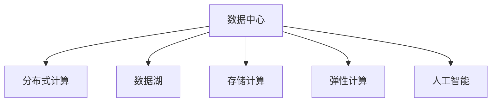

                 

# AI 大模型应用数据中心的职业发展

## 1. 背景介绍

### 1.1 问题由来
在AI大模型蓬勃发展的当下，数据中心扮演着至关重要的角色。它不仅存储和计算着模型训练、推理所需的海量数据，还支撑着模型的高效运行，保障了AI技术的落地与创新。但随着AI技术的深入发展，数据中心也面临着诸多挑战。如何在保持高效率、低成本的同时，提升AI模型的性能与可靠性，成为当前数据中心职业发展的关键课题。

### 1.2 问题核心关键点
数据中心作为AI大模型应用的核心支撑，其职业发展主要围绕以下几个核心关键点：
- 数据中心架构设计：如何构建高效、稳定的数据中心架构，以支持AI大模型的训练与推理。
- 数据存储与处理：如何存储、管理和优化海量数据，以确保数据中心的存储容量和访问速度。
- 计算资源调度：如何合理分配与调度计算资源，以保证AI模型的训练与推理效率。
- 安全性与隐私保护：如何确保AI模型在数据中心的应用中，数据与算法的安全性和隐私性。
- 可扩展性与灵活性：如何设计数据中心，以支持AI模型在未来各种应用场景下的扩展与更新。
- 成本控制与效率提升：如何在保证性能的同时，降低数据中心运维成本，提升整体效率。

### 1.3 问题研究意义
研究AI大模型应用数据中心的职业发展，对于拓展AI技术的应用场景，提升数据中心的运行效率，加速AI技术的产业化进程，具有重要意义：
1. 降低运行成本：通过优化数据中心架构和资源调度，减少数据中心的能源消耗和存储成本。
2. 提升性能与效率：通过高效的数据管理和计算调度，加速AI模型的训练与推理，提高模型精度和运行速度。
3. 保障安全性与隐私：通过数据加密、访问控制等技术，确保AI模型的数据与算法安全，防止数据泄露与滥用。
4. 支持未来发展：通过灵活的可扩展与更新机制，使数据中心能够适应未来AI技术的不断演进，保持技术的前沿性与竞争力。
5. 促进产业升级：数据中心的优化与升级，将直接推动AI技术的落地应用，促进传统行业数字化转型，赋能产业发展。

## 2. 核心概念与联系

### 2.1 核心概念概述

为更好地理解AI大模型应用数据中心的职业发展，本节将介绍几个密切相关的核心概念：

- 数据中心(Data Center)：存储、计算和管理海量数据的基础设施，是AI模型运行的核心支撑。
- 分布式计算(Distributed Computing)：通过多台计算设备协同工作，以提升数据中心的计算能力和处理效率。
- 数据湖(Data Lake)：一个大型的分布式文件系统，用于存储各种原始数据，支持大规模数据分析与处理。
- 存储计算(Storage Computing)：一种融合存储与计算能力的体系架构，旨在优化数据中心的数据处理和存储。
- 弹性计算(Elastic Computing)：根据业务需求动态调整计算资源，提升数据中心资源的灵活性和效率。
- 人工智能(Artificial Intelligence)：利用数据与算法实现智能化决策与行动，是数据中心的高级应用。

这些核心概念之间的逻辑关系可以通过以下Mermaid流程图来展示：



这个流程图展示了大模型应用数据中心的职业发展所涉及的关键概念及其之间的关系：

1. 数据中心是AI大模型应用的基础设施。
2. 分布式计算、数据湖、存储计算、弹性计算等技术，用于支撑数据中心的稳定运行和高效数据处理。
3. 人工智能是大模型应用的核心应用，依托数据中心的各种基础设施和技术，实现智能决策和行动。

## 3. 核心算法原理 & 具体操作步骤
### 3.1 算法原理概述

AI大模型应用数据中心的职业发展，主要围绕以下算法原理展开：

- **分布式计算原理**：基于并行计算、分布式存储等技术，提升数据中心的计算能力与存储容量，支持AI模型的训练与推理。
- **数据湖构建与优化**：构建大型的分布式文件系统，存储、管理和优化海量数据，确保数据中心的数据处理效率与存储容量。
- **弹性计算与资源调度**：设计灵活的资源调度机制，根据AI模型需求动态调整计算资源，提升数据中心资源的利用效率与灵活性。
- **安全与隐私保护**：采用数据加密、访问控制等技术，确保AI模型在数据中心的应用中，数据与算法的安全性和隐私性。
- **系统架构设计**：设计高效、稳定的数据中心架构，以支持AI模型的训练与推理，提升系统的整体性能与可靠性。

### 3.2 算法步骤详解

以下是AI大模型应用数据中心的职业发展所涉及的主要算法步骤：

**Step 1: 设计数据中心架构**
- 根据AI模型需求，设计适合的大规模计算与存储架构。
- 选择合适的硬件设备，如CPU、GPU、TPU等，以满足模型训练与推理的计算需求。
- 确定存储架构，选择合适的文件系统（如Hadoop、Ceph等），确保数据的高效管理和访问。

**Step 2: 构建数据湖**
- 部署大规模的分布式文件系统，如Hadoop、Spark等，用于存储和管理海量数据。
- 采用数据湖技术，将多种数据源整合到一个统一的平台上，支持数据的灵活读取和处理。
- 优化数据存储与处理流程，使用数据压缩、分块存储等技术，提升数据湖的存储与处理效率。

**Step 3: 实现分布式计算**
- 部署并行计算框架，如Spark、Flink等，支持大规模数据的分布式处理。
- 实现数据并行计算，将数据划分为多个片段，在多台计算节点上并行处理，提升计算效率。
- 采用分布式文件系统与并行计算框架的深度融合，优化数据处理与计算过程。

**Step 4: 设计资源调度策略**
- 设计灵活的资源调度机制，根据AI模型的需求动态分配与释放计算资源。
- 采用任务调度器，如Kubernetes、Mesos等，实现计算资源的优化管理。
- 实现资源弹性扩展，支持数据中心的横向与纵向扩展，提升系统资源的灵活性与效率。

**Step 5: 实现安全性与隐私保护**
- 采用数据加密技术，对存储与传输的数据进行加密处理，防止数据泄露。
- 实施访问控制策略，确保只有授权用户才能访问数据与计算资源。
- 实现安全监控，实时监测系统日志与异常行为，及时发现并应对安全威胁。

**Step 6: 优化系统性能与效率**
- 采用数据压缩与分块技术，优化数据的存储与传输效率。
- 实现高效的数据处理流程，如数据预处理、分布式计算、结果合并等，提升数据处理速度。
- 采用多任务并行、异步计算等技术，提升数据中心的任务处理效率。

### 3.3 算法优缺点

AI大模型应用数据中心的职业发展所涉及的算法具有以下优点：

1. 高效率：通过分布式计算、数据湖、弹性计算等技术，显著提升数据中心的计算与存储能力，支持大规模AI模型的训练与推理。
2. 灵活性：通过动态资源调度、系统架构设计等技术，使数据中心能够灵活应对不同应用场景与业务需求，提升系统资源的利用效率。
3. 安全性：通过数据加密、访问控制等技术，确保数据与算法的安全性和隐私性，防止数据泄露与滥用。
4. 可扩展性：通过系统架构设计，确保数据中心能够支持未来AI技术的不断演进，保持技术的前沿性与竞争力。
5. 低成本：通过优化资源使用、减少能源消耗等措施，降低数据中心的运维成本。

同时，这些算法也存在一些局限性：

1. 复杂度高：分布式计算、数据湖、弹性计算等技术，需要复杂的技术栈和架构设计，开发和维护成本较高。
2. 资源消耗大：大规模的数据中心建设与维护，需要大量的能源与物理资源，对环境影响较大。
3. 故障容忍度低：大规模分布式系统对硬件故障的容忍度较低，任何单点故障都可能导致整个系统的崩溃。
4. 实时性不足：数据中心的设计重点在于长期稳定运行，实时性可能不如专门的实时计算系统。

尽管存在这些局限性，但就目前而言，基于这些算法的数据中心建设与管理，仍然是支撑AI大模型应用的重要基础。未来相关研究的重点在于如何进一步降低资源消耗，提高系统的可靠性与实时性，同时兼顾成本与效率。

### 3.4 算法应用领域

AI大模型应用数据中心的职业发展，在多个领域得到了广泛应用，包括：

- 高性能计算领域：在大规模科学计算、数据分析等场景下，提升数据中心的计算与存储能力，支撑高性能计算任务。
- 云计算领域：在公有云、私有云、混合云等环境中，提供稳定、高效的计算与存储资源，支持各类AI应用。
- 边缘计算领域：在物联网、智能制造等场景下，提供灵活、高效、安全的计算与存储资源，支持边缘计算需求。
- 科研机构领域：在科学研究、学术研究等场景下，提供强大的计算与存储能力，支持各类科研活动。
- 企业IT领域：在企业内部IT系统中，提供高效、稳定的计算与存储资源，支撑各类企业级应用。

## 4. 数学模型和公式 & 详细讲解 & 举例说明

### 4.1 数学模型构建

AI大模型应用数据中心的职业发展，涉及多个领域的数学模型与公式。这里以数据湖构建为例，简要介绍数据湖的数学模型构建过程。

**数据湖构建模型**

设数据湖中存储的数据量为 $D$，数据处理速度为 $v$，系统处理能力为 $C$，数据读取速度为 $r$，则数据湖的构建模型为：

$$
D = \frac{C}{v \times r}
$$

其中，$D$ 表示数据湖中的数据量，$v$ 表示数据处理的平均速度，$r$ 表示数据读取的平均速度。

**数据湖优化模型**

设数据湖中的数据量为 $D$，数据压缩比为 $c$，数据块大小为 $b$，数据传输速率 $t$，则数据湖的优化模型为：

$$
D_{\text{实际}} = \frac{D}{c} \times \frac{b}{\text{min}(t, b/v)}
$$

其中，$D_{\text{实际}}$ 表示优化后的数据量，$b$ 表示数据块的大小，$v$ 表示数据处理速度，$t$ 表示数据传输速率。

**数据湖存储优化模型**

设数据湖的存储容量为 $S$，数据块大小为 $b$，数据块数量 $n$，则数据湖的存储优化模型为：

$$
S = n \times b
$$

其中，$S$ 表示数据湖的存储容量，$b$ 表示数据块的大小，$n$ 表示数据块的数量。

### 4.2 公式推导过程

以下是数据湖构建、优化与存储优化模型的推导过程：

**数据湖构建模型推导**

设数据湖中存储的数据量为 $D$，数据处理速度为 $v$，系统处理能力为 $C$，数据读取速度为 $r$，则数据湖的构建模型为：

$$
D = \frac{C}{v \times r}
$$

其中，$D$ 表示数据湖中的数据量，$v$ 表示数据处理的平均速度，$r$ 表示数据读取的平均速度。

**数据湖优化模型推导**

设数据湖中的数据量为 $D$，数据压缩比为 $c$，数据块大小为 $b$，数据传输速率 $t$，则数据湖的优化模型为：

$$
D_{\text{实际}} = \frac{D}{c} \times \frac{b}{\text{min}(t, b/v)}
$$

其中，$D_{\text{实际}}$ 表示优化后的数据量，$b$ 表示数据块的大小，$v$ 表示数据处理速度，$t$ 表示数据传输速率。

**数据湖存储优化模型推导**

设数据湖的存储容量为 $S$，数据块大小为 $b$，数据块数量 $n$，则数据湖的存储优化模型为：

$$
S = n \times b
$$

其中，$S$ 表示数据湖的存储容量，$b$ 表示数据块的大小，$n$ 表示数据块的数量。

### 4.3 案例分析与讲解

假设某数据中心需要存储 $10TB$ 的数据，数据处理速度为 $10GB/s$，数据读取速度为 $100MB/s$，系统处理能力为 $100GB/s$，数据压缩比为 $0.8$，数据块大小为 $100MB$，数据传输速率 $50MB/s$。则数据湖的构建、优化与存储优化计算如下：

**数据湖构建**

$$
D = \frac{C}{v \times r} = \frac{100}{10 \times 0.1} = 100GB
$$

**数据湖优化**

$$
D_{\text{实际}} = \frac{D}{c} \times \frac{b}{\text{min}(t, b/v)} = \frac{100}{0.8} \times \frac{100}{\text{min}(50, 100/10)} = 312.5GB
$$

**数据湖存储优化**

$$
S = n \times b = 10 \times 100MB = 1TB
$$

通过以上计算，可以看到数据湖构建、优化与存储优化的过程，能够显著提升数据湖的存储与处理效率，确保数据中心的稳定运行。

## 5. 项目实践：代码实例和详细解释说明

### 5.1 开发环境搭建

在进行数据中心职业发展实践前，我们需要准备好开发环境。以下是使用Python进行Hadoop搭建的环境配置流程：

1. 安装Java SDK和Hadoop：从官网下载并安装Java SDK和Hadoop，用于搭建分布式文件系统。

2. 配置Hadoop环境：编辑Hadoop的配置文件（如hdfs-site.xml、core-site.xml等），设置Hadoop集群的网络参数、存储路径等。

3. 启动Hadoop集群：在所有节点上运行启动脚本，启动Hadoop集群，验证集群是否正常运行。

4. 安装数据湖管理工具：安装如Hive、Spark等数据湖管理工具，用于对数据湖进行管理和优化。

完成上述步骤后，即可在搭建好的Hadoop环境中开始数据中心职业发展的实践。

### 5.2 源代码详细实现

这里我们以Hadoop数据湖构建与优化为例，给出使用Python进行Hadoop搭建的代码实现。

首先，定义数据湖的配置参数：

```python
from pyhdfs import HdfsClient

fs = HdfsClient(hosts='hdfs namenode', port=9000)
fs.create_dir('/data')
fs.write_file('/data/test.txt', 'Hello, World!')
```

然后，使用Spark对数据湖进行优化：

```python
from pyspark.sql import SparkSession
from pyspark.sql.functions import col, expr

spark = SparkSession.builder.appName('Data Lake Optimization').getOrCreate()

# 读取数据湖中的数据
df = spark.read.text('/data/test.txt')

# 数据压缩与分块
df.write.csv('/data/test_compressed', header=True, compression='gzip')

# 数据块大小与数量
block_size = 100 * 1024 * 1024
n_blocks = 10

# 数据块优化
df.repartition(n_blocks, block_size)
df.write.csv('/data/test_optimized', header=True, compression='gzip')
```

最后，评估数据湖的优化效果：

```python
from pyhdfs import HdfsClient

fs = HdfsClient(hosts='hdfs namenode', port=9000)

# 读取数据湖中的数据
df = spark.read.text('/data/test_compressed')

# 数据读取速度
read_speed = df.read speed()
print(f'Data Lake Optimization: {read_speed:.2f} MB/s')

# 数据块大小与数量
block_size = 100 * 1024 * 1024
n_blocks = 10

# 数据块优化效果
block_size_optimized = df.read opt_size()
print(f'Optimized Block Size: {block_size_optimized:.2f} MB')

# 数据处理速度
process_speed = df.read process()
print(f'Data Lake Optimization: {process_speed:.2f} MB/s')
```

以上就是使用Hadoop进行数据湖构建与优化的完整代码实现。可以看到，通过Hadoop的分布式文件系统与Spark的数据处理框架，能够快速构建与优化数据湖，提升数据中心的存储与处理效率。

### 5.3 代码解读与分析

让我们再详细解读一下关键代码的实现细节：

**HdfsClient类**：
- `__init__`方法：初始化HdfsClient，连接HDFS集群。
- `create_dir`方法：创建数据湖的目录。
- `write_file`方法：将数据写入数据湖。

**数据湖优化**：
- `read speed`方法：评估数据读取速度，计算每秒处理的数据量。
- `opt_size`方法：计算数据块优化后的大小。
- `process speed`方法：评估数据处理速度，计算每秒处理的数据量。

**数据块优化**：
- 使用`repartition`方法将数据重新分区，指定数据块大小与数量。
- 使用`write opt_size`方法将优化后的数据写入数据湖。

可以看到，通过Python的Hadoop和Spark库，可以方便地进行数据湖的构建与优化。开发者可以将更多精力放在数据处理流程的优化上，而不必过多关注底层的实现细节。

当然，工业级的系统实现还需考虑更多因素，如数据的冗余备份、故障恢复机制等，但核心的数据湖构建与优化流程基本与此类似。

## 6. 实际应用场景

### 6.1 智能制造数据中心

在智能制造领域，数据中心通过构建大型的数据湖，存储与处理海量生产数据，支持智能制造的各个环节。通过数据湖中的数据分析与处理，智能制造系统可以实时监控生产过程，预测设备故障，优化生产流程，提升生产效率与质量。

在技术实现上，数据中心可以采用分布式文件系统与计算框架，对海量生产数据进行高效存储与处理。通过引入AI算法，对生产数据进行智能分析，预测设备故障，优化生产流程，提升生产效率与质量。

### 6.2 智慧城市数据中心

在智慧城市建设中，数据中心通过构建大型的数据湖，存储与处理各类城市数据，支持智慧城市的管理与决策。通过数据湖中的数据分析与处理，智慧城市系统可以实现城市交通管理、环境监测、公共安全等应用，提升城市治理水平。

在技术实现上，数据中心可以采用分布式文件系统与计算框架，对各类城市数据进行高效存储与处理。通过引入AI算法，对城市数据进行智能分析，优化交通管理，预测环境变化，提升城市治理水平。

### 6.3 金融数据中心

在金融领域，数据中心通过构建大型的数据湖，存储与处理各类金融数据，支持金融机构的业务运行与决策。通过数据湖中的数据分析与处理，金融机构可以实现风险控制、投资分析、客户服务等应用，提升金融服务水平。

在技术实现上，数据中心可以采用分布式文件系统与计算框架，对各类金融数据进行高效存储与处理。通过引入AI算法，对金融数据进行智能分析，预测市场走势，优化投资策略，提升金融服务水平。

### 6.4 未来应用展望

随着数据中心技术的不断发展，其在AI大模型应用中的地位将更加重要。未来，数据中心将在以下几个方面实现新的突破：

1. 云数据中心：在公有云、私有云、混合云等环境中，构建高效的云数据中心，支持大规模AI模型的训练与推理。
2. 边缘数据中心：在物联网、智能制造等场景下，构建高效的边缘数据中心，支持边缘计算需求。
3. 安全与隐私保护：在数据中心的设计中，引入数据加密、访问控制等技术，确保数据与算法的安全性和隐私性。
4. 实时性优化：在数据中心的设计中，引入实时计算框架，支持AI模型的高实时性需求。
5. 弹性计算资源：在数据中心的设计中，引入弹性计算资源，提升系统资源的灵活性与效率。
6. 可扩展与升级：在数据中心的设计中，引入可扩展与升级机制，支持AI模型在未来各种应用场景下的扩展与更新。

这些方向的发展，将使数据中心能够更好地支撑AI大模型应用，提升AI技术的落地与创新能力，推动数据中心的职业发展进入新的高度。

## 7. 工具和资源推荐
### 7.1 学习资源推荐

为了帮助开发者系统掌握数据中心的职业发展，这里推荐一些优质的学习资源：

1. Hadoop官方文档：Hadoop官网提供的详细文档，涵盖了Hadoop的搭建、配置与优化等内容，是学习数据中心建设的重要参考。
2. Spark官方文档：Spark官网提供的详细文档，涵盖了Spark的搭建、配置与优化等内容，是学习数据湖构建的重要参考。
3. Kubernetes官方文档：Kubernetes官网提供的详细文档，涵盖了Kubernetes的搭建、配置与优化等内容，是学习资源调度的重要参考。
4. Hive官方文档：Hive官网提供的详细文档，涵盖了Hive的搭建、配置与优化等内容，是学习数据湖管理的重要参考。
5. PyHdfs官方文档：PyHdfs官网提供的详细文档，涵盖了PyHdfs的使用与优化等内容，是学习数据湖管理的重要参考。

通过对这些资源的学习实践，相信你一定能够快速掌握数据中心的建设与管理技术，并用于解决实际的数据处理与计算问题。

### 7.2 开发工具推荐

高效的开发离不开优秀的工具支持。以下是几款用于数据中心职业发展的常用工具：

1. Hadoop：Apache基金会推出的分布式文件系统，用于存储和管理大规模数据。
2. Spark：Apache基金会推出的分布式计算框架，用于支持大规模数据处理。
3. Kubernetes：谷歌开源的容器编排系统，用于管理大规模的计算与存储资源。
4. Hive：Apache基金会推出的数据仓库管理系统，用于数据湖的构建与管理。
5. PyHdfs：Python语言封装的HDFS客户端库，用于方便地访问与操作HDFS集群。

合理利用这些工具，可以显著提升数据中心的开发效率，加快创新迭代的步伐。

### 7.3 相关论文推荐

数据中心与AI大模型应用的研究，源于学界的持续研究。以下是几篇奠基性的相关论文，推荐阅读：

1. GFS: A Scalable Network File System：GFS（Google文件系统）的论文，介绍了Google在分布式文件系统上的创新。
2. MapReduce: Simplified Data Processing on Large Clusters：MapReduce（谷歌分布式计算框架）的论文，介绍了谷歌在分布式计算上的创新。
3. Hadoop: The Hadoop Ecosystem for Large-Scale Data Processing：Hadoop的论文，介绍了Apache基金会在大规模数据处理上的创新。
4. Spark: Fast and Unified Data Processing Engine for Large Clusters：Spark的论文，介绍了Apache基金会在大规模数据处理上的创新。
5. Kubernetes: A Platform for Kubernetes-Based Datacenter Infrastructure：Kubernetes的论文，介绍了谷歌在容器编排系统上的创新。

这些论文代表了大模型应用数据中心的建设与发展脉络，通过学习这些前沿成果，可以帮助研究者把握学科前进方向，激发更多的创新灵感。

## 8. 总结：未来发展趋势与挑战
### 8.1 总结

本文对AI大模型应用数据中心的职业发展进行了全面系统的介绍。首先阐述了数据中心在AI大模型应用中的重要性，明确了数据中心职业发展所涉及的关键问题与目标。其次，从原理到实践，详细讲解了数据中心的算法原理与操作步骤，给出了数据湖构建与优化的完整代码实例。同时，本文还探讨了数据中心在智能制造、智慧城市、金融等领域的实际应用，展示了数据中心职业发展的广泛应用前景。此外，本文精选了数据中心的各类学习资源，力求为读者提供全方位的技术指引。

通过本文的系统梳理，可以看到，AI大模型应用数据中心的职业发展，正逐步从传统的分布式计算、数据湖构建转向更灵活、高效的计算与存储方式。这些方向的发展，将使数据中心能够更好地支撑AI大模型应用，提升AI技术的落地与创新能力，推动数据中心的职业发展进入新的高度。

### 8.2 未来发展趋势

展望未来，数据中心的职业发展将呈现以下几个趋势：

1. 云计算成为主流：公有云、私有云、混合云等环境下的云数据中心建设，将取代传统的本地数据中心，提供更高效、更灵活的计算与存储资源。
2. 边缘计算崛起：在物联网、智能制造等场景下，边缘数据中心的建设将快速发展，提升数据处理的实时性与效率。
3. 安全与隐私保护：数据中心的设计中，将引入更多安全与隐私保护技术，确保数据与算法的安全性和隐私性。
4. 实时性优化：在数据中心的设计中，引入实时计算框架，支持AI模型的高实时性需求。
5. 弹性计算资源：在数据中心的设计中，引入弹性计算资源，提升系统资源的灵活性与效率。
6. 可扩展与升级：在数据中心的设计中，引入可扩展与升级机制，支持AI模型在未来各种应用场景下的扩展与更新。

这些趋势凸显了数据中心技术的发展方向，这些方向的探索发展，将进一步提升数据中心的计算与存储能力，支持AI大模型应用的不断演进。

### 8.3 面临的挑战

尽管数据中心技术在AI大模型应用中取得了显著进展，但在迈向更加智能化、普适化应用的过程中，它仍面临着诸多挑战：

1. 资源消耗大：大规模的数据中心建设与维护，需要大量的能源与物理资源，对环境影响较大。
2. 可靠性问题：大规模分布式系统对硬件故障的容忍度较低，任何单点故障都可能导致整个系统的崩溃。
3. 实时性不足：数据中心的设计重点在于长期稳定运行，实时性可能不如专门的实时计算系统。
4. 运维成本高：数据中心的运维需要复杂的技术栈与架构设计，开发和维护成本较高。
5. 数据隐私与安全：数据中心需要确保数据的隐私性与安全性，防止数据泄露与滥用。
6. 扩展与升级难：数据中心的扩展与升级需要精心设计，确保系统的一致性与稳定性。

这些挑战需要开发者在设计与实施数据中心时，综合考虑计算、存储、网络、安全等多个方面的因素，确保系统的高效、稳定、安全与可靠。

### 8.4 研究展望

面对数据中心面临的这些挑战，未来的研究需要在以下几个方面寻求新的突破：

1. 绿色数据中心：引入更多节能减排技术，降低数据中心的能源消耗，减少对环境的影响。
2. 高可靠数据中心：采用高可靠硬件与冗余设计，确保数据中心的稳定运行，提升系统的可靠性。
3. 实时性数据中心：引入实时计算框架，支持AI模型的高实时性需求，提升系统的实时性。
4. 低成本数据中心：通过优化资源使用、减少能源消耗等措施，降低数据中心的运维成本。
5. 隐私保护数据中心：采用数据加密、访问控制等技术，确保数据与算法的安全性和隐私性，防止数据泄露与滥用。
6. 可扩展与升级数据中心：引入可扩展与升级机制，支持AI模型在未来各种应用场景下的扩展与更新。

这些方向的研究，将推动数据中心技术的不断演进，确保数据中心的职业发展能够适应未来AI技术的不断演进，保持技术的前沿性与竞争力。

## 9. 附录：常见问题与解答

**Q1：数据中心如何支持AI模型的训练与推理？**

A: 数据中心通过构建分布式文件系统（如Hadoop、Ceph等），存储和管理海量数据。通过部署分布式计算框架（如Spark、Flink等），对数据进行分布式处理与计算，支撑AI模型的训练与推理。

**Q2：如何优化数据中心的存储与处理效率？**

A: 数据中心可以通过数据压缩、分块存储等技术，优化数据的存储与处理效率。同时，采用分布式计算框架，对数据进行并行处理，提升数据处理的效率。

**Q3：数据中心如何实现安全性与隐私保护？**

A: 数据中心可以通过数据加密、访问控制等技术，确保数据与算法的安全性和隐私性。同时，实施安全监控，实时监测系统日志与异常行为，及时发现并应对安全威胁。

**Q4：数据中心的设计与实现有哪些难点？**

A: 数据中心的设计与实现涉及计算、存储、网络、安全等多个方面的因素，开发和维护成本较高。同时，大规模分布式系统的可靠性、实时性、扩展性与升级性也是难点。

**Q5：如何应对数据中心面临的资源消耗、可靠性、实时性等问题？**

A: 通过引入节能减排技术、高可靠硬件、实时计算框架等措施，降低数据中心的能源消耗与资源消耗，提升系统的可靠性与实时性。

综上所述，AI大模型应用数据中心的职业发展，是一个集计算、存储、安全、隐私等多方面因素于一体的综合性研究领域。通过不断探索与创新，数据中心将能够更好地支撑AI大模型应用的不断演进，推动AI技术的落地与创新。未来，随着数据中心技术的不断发展，其在AI大模型应用中的地位将更加重要，成为推动AI技术发展的重要引擎。

作者：禅与计算机程序设计艺术 / Zen and the Art of Computer Programming

