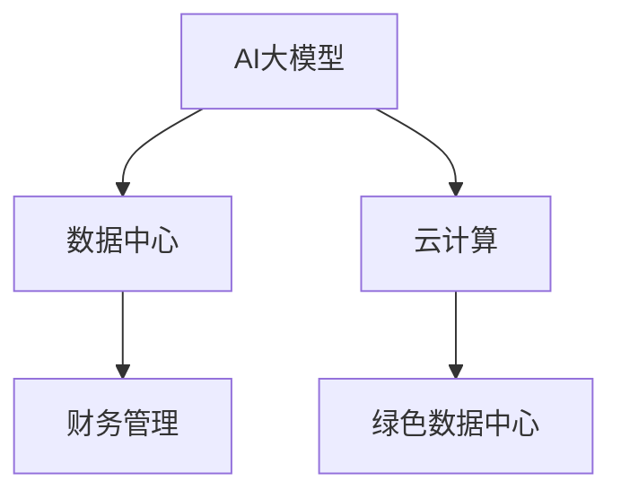

                 

# AI 大模型应用数据中心的财务管理

## 1. 背景介绍

### 1.1 问题由来
随着人工智能(AI)技术在各行各业的深入应用，AI大模型（如GPT、BERT等）在数据处理、自然语言理解、图像识别、语音识别等任务上展现出卓越的能力。AI大模型的应用领域涉及数据中心的建设、运营与管理，因此，财务管理在数据中心的应用中显得尤为重要。

### 1.2 问题核心关键点
AI大模型的应用对数据中心财务管理提出了新的要求。数据中心的运行成本高昂，包括硬件设备的采购与维护、能耗成本、人力资源成本等。如何优化这些成本，提高资源利用效率，是数据中心财务管理的核心问题。

### 1.3 问题研究意义
本文旨在探讨AI大模型在数据中心的应用及其对财务管理的影响，提出优化成本和提升资源利用效率的策略。这对于AI技术在数据中心中的应用推广，提升数据中心效率，降低运营成本具有重要意义。

## 2. 核心概念与联系

### 2.1 核心概念概述

为更好地理解AI大模型在数据中心财务管理中的应用，本节将介绍几个密切相关的核心概念：

- AI大模型：以深度学习为核心的、在特定任务上表现优异的大规模模型，如GPT、BERT等。
- 数据中心：由服务器、网络设备、存储设备等组成的基础设施，用于支持AI大模型的训练、推理等。
- 财务管理：对数据中心的运营成本进行规划、控制、分析和报告的过程，目标是最大化资源利用效率，降低成本。
- 云计算：基于互联网的计算服务，提供弹性的、按需的计算资源，与数据中心建设高度相关。
- 绿色数据中心：通过优化能耗、水耗等资源消耗，降低环境污染，提升资源利用效率的数据中心。

这些核心概念之间的逻辑关系可以通过以下Mermaid流程图来展示：



这个流程图展示了大模型、数据中心、云计算、绿色数据中心和财务管理之间的联系。

## 3. 核心算法原理 & 具体操作步骤
### 3.1 算法原理概述

AI大模型在数据中心的财务管理中，主要通过优化成本、提升资源利用效率、降低能耗等方式实现。其核心算法原理包括以下几个方面：

1. **成本优化**：通过合理规划资源使用，优化硬件采购、运维、人力成本。
2. **能耗管理**：采用高效能硬件设备、优化算法设计，减少不必要的能源消耗。
3. **资源调度**：利用云计算平台弹性调度资源，避免资源闲置浪费。
4. **绿色数据中心建设**：通过水冷、自然冷却等技术降低环境污染。

### 3.2 算法步骤详解

AI大模型在数据中心财务管理中的应用包括以下几个关键步骤：

**Step 1: 数据中心资源规划**
- 评估数据中心的硬件设备需求，包括服务器、网络设备、存储设备等。
- 根据业务需求，规划数据中心的规模和配置。

**Step 2: 能耗优化**
- 采用高效能硬件设备，如GPU、FPGA等，减少能源消耗。
- 优化AI大模型的算法设计，减少不必要的数据传输和计算。

**Step 3: 资源调度**
- 利用云计算平台弹性调度资源，按需提供计算能力。
- 使用容器化技术，如Docker、Kubernetes等，提高资源利用效率。

**Step 4: 绿色数据中心建设**
- 采用水冷、自然冷却等技术，减少能耗和环境污染。
- 使用可再生能源，如太阳能、风能，降低能源成本。

**Step 5: 财务分析与报告**
- 实时监控数据中心的运营成本，进行财务分析。
- 根据分析结果，提出优化建议，生成财务报告。

### 3.3 算法优缺点

AI大模型在数据中心财务管理中的应用有以下优点：

1. **成本优化**：通过合理规划资源使用，可以有效降低数据中心运营成本。
2. **能耗管理**：优化硬件设备和使用算法，降低能源消耗，提高能源利用效率。
3. **资源调度**：利用云计算平台的弹性调度，提高了资源利用效率，避免了资源浪费。
4. **绿色数据中心建设**：采用先进技术降低环境污染，提升数据中心的社会责任。

同时，这些算法也存在一定的局限性：

1. **初期投入高**：优化能耗和资源调度的技术设备成本较高。
2. **技术复杂**：优化算法和资源调度的技术要求较高，需具备一定的专业知识。
3. **实时监控难**：需要实时监控数据中心运营情况，技术实现较为复杂。

### 3.4 算法应用领域

AI大模型在数据中心财务管理中的应用涵盖了以下几个领域：

1. **硬件设备采购与管理**：根据业务需求规划硬件设备采购，优化设备使用，减少维护成本。
2. **能耗管理**：优化AI大模型算法，采用高效能硬件，降低能源消耗，提升资源利用效率。
3. **资源调度**：利用云计算平台弹性调度资源，避免资源闲置浪费，提高资源利用效率。
4. **绿色数据中心建设**：采用水冷、自然冷却等技术，减少能耗和环境污染。
5. **财务分析与报告**：实时监控运营成本，进行财务分析，生成财务报告，优化财务管理。

这些应用领域展示了AI大模型在数据中心财务管理中的广泛应用。

## 4. 数学模型和公式 & 详细讲解 & 举例说明

### 4.1 数学模型构建

AI大模型在数据中心财务管理中，主要通过以下几个数学模型进行优化：

1. **硬件设备需求预测模型**：
$$
\text{需求预测} = f(\text{业务需求}, \text{历史数据}, \text{设备性能})
$$

2. **能耗管理优化模型**：
$$
\text{能耗优化} = \min_{\text{算法设计}, \text{硬件设备}} \left( \text{计算量} \times \text{能源成本} + \text{数据传输量} \times \text{网络成本} \right)
$$

3. **资源调度优化模型**：
$$
\text{资源调度} = \max_{\text{云平台}} \left( \text{计算能力} - \text{需求量} \right)
$$

4. **绿色数据中心建设模型**：
$$
\text{环境优化} = \min_{\text{冷却技术}, \text{能源来源}} \left( \text{能源消耗} + \text{环境污染} \right)
$$

### 4.2 公式推导过程

下面以能耗管理优化模型为例，推导计算量的计算公式：

设 $n$ 为计算任务数量，$m$ 为每个计算任务的计算量，$c$ 为每个计算任务的成本，则计算量的计算公式为：
$$
\text{计算量} = n \times m
$$

将上述公式带入能耗优化模型，可以得到能耗优化的目标函数：
$$
\text{能耗优化} = \min_{\text{算法设计}, \text{硬件设备}} \left( n \times m \times c + \text{数据传输量} \times \text{网络成本} \right)
$$

### 4.3 案例分析与讲解

以云计算平台为例，假设某公司有 1000 台服务器，每个服务器的计算能力为 100，每个计算任务的成本为 1 元，则总计算量为 1000 台服务器 * 100 计算能力 * 每个任务 1 元成本，即 1000 万个计算任务。

假设公司有 5 个数据中心，每个数据中心的计算能力为 100 万个计算任务，则总计算能力为 500 万个计算任务。

根据上述计算，能耗优化的目标为最小化计算量和网络成本。例如，通过优化算法设计，减少数据传输量，可以减少网络成本；通过使用更高效的硬件设备，如 GPU，可以减少计算量。

## 5. 项目实践：代码实例和详细解释说明
### 5.1 开发环境搭建

在进行项目实践前，我们需要准备好开发环境。以下是使用Python进行开发的Python 3.7和pip的安装流程：

1. 安装Anaconda：从官网下载并安装Anaconda，用于创建独立的Python环境。

2. 创建并激活虚拟环境：
```bash
conda create -n myenv python=3.7
conda activate myenv
```

3. 安装必要的工具包：
```bash
pip install pandas numpy scikit-learn matplotlib pyplot
```

### 5.2 源代码详细实现

下面以云计算平台为例，展示AI大模型在数据中心资源调度中的应用：

首先，定义一个简单的资源调度类：

```python
class ResourceScheduler:
    def __init__(self, cloud_provider):
        self.cloud_provider = cloud_provider
        self.resources = []
        self.current_resources = []
    
    def schedule(self, demand):
        available_resources = self.cloud_provider.get_resources()
        self.current_resources = []
        for i in range(demand):
            available_resources.sort(key=lambda r: r['cost'])
            if len(available_resources) > 0:
                resource = available_resources.pop(0)
                self.current_resources.append(resource)
            else:
                return "Resource Unavailable"
    
    def release(self):
        self.current_resources = []
```

然后，定义一个模拟的云计算平台类：

```python
class CloudProvider:
    def __init__(self, resources):
        self.resources = resources
    
    def get_resources(self):
        return self.resources
    
    def add_resource(self, resource):
        self.resources.append(resource)
    
    def remove_resource(self, resource_id):
        self.resources = [r for r in self.resources if r['id'] != resource_id]
```

最后，定义一个资源池类，用于模拟数据中心的资源池：

```python
class ResourcePool:
    def __init__(self):
        self.resources = []
    
    def add_resource(self, resource):
        self.resources.append(resource)
    
    def remove_resource(self, resource_id):
        self.resources = [r for r in self.resources if r['id'] != resource_id]
    
    def get_resource(self, id):
        for r in self.resources:
            if r['id'] == id:
                return r
        return None
```

将上述代码结合使用，可以得到一个简单的资源调度实例：

```python
cloud_provider = CloudProvider([
    {'id': 1, 'name': 'GPU', 'cost': 1},
    {'id': 2, 'name': 'CPU', 'cost': 0.5}
])
resource_scheduler = ResourceScheduler(cloud_provider)
resource_pool = ResourcePool()

resource_pool.add_resource({'id': 1, 'name': 'GPU', 'cost': 1})
resource_pool.add_resource({'id': 2, 'name': 'CPU', 'cost': 0.5})
demand = 5
resource_pool.add_resource({'id': 3, 'name': 'CPU', 'cost': 0.5})

resource_scheduler.schedule(demand)
print(resource_scheduler.current_resources)
```

### 5.3 代码解读与分析

以下是代码的详细解读：

**ResourceScheduler类**：
- `__init__`方法：初始化云计算平台和资源池。
- `schedule`方法：根据需求调度资源。
- `release`方法：释放当前使用的资源。

**CloudProvider类**：
- `__init__`方法：初始化资源池。
- `get_resources`方法：获取资源池中的可用资源。
- `add_resource`方法：添加资源到资源池。
- `remove_resource`方法：从资源池中移除指定资源。

**ResourcePool类**：
- `__init__`方法：初始化资源池。
- `add_resource`方法：添加资源到资源池。
- `remove_resource`方法：从资源池中移除指定资源。
- `get_resource`方法：获取指定资源的详细信息。

通过上述代码，可以看到，资源调度可以通过云计算平台实现弹性调度，避免了资源闲置浪费，提高了资源利用效率。

## 6. 实际应用场景
### 6.1 智能制造

在智能制造领域，AI大模型可以应用于生产线的智能调度、设备状态预测、质量控制等任务。通过对这些任务的微调，可以实现生产线的智能化管理。

在财务管理方面，智能制造可以通过AI大模型优化资源调度，提高资源利用效率，降低生产成本。例如，通过预测设备故障，提前维护，减少停机时间；通过优化生产调度，减少资源浪费。

### 6.2 智慧交通

智慧交通是AI大模型应用的重要领域，涉及车辆调度、交通流预测、事故预警等任务。通过优化调度算法，提高运输效率，减少交通事故，提升交通安全性。

在财务管理方面，智慧交通可以通过AI大模型优化交通资源调度，降低运输成本。例如，通过优化车辆调度路径，减少燃油消耗；通过预测交通流，避免拥堵，减少运输时间。

### 6.3 智慧医疗

智慧医疗是AI大模型应用的另一个重要领域，涉及疾病诊断、影像分析、个性化治疗等任务。通过对这些任务的微调，可以实现医疗服务的智能化。

在财务管理方面，智慧医疗可以通过AI大模型优化医疗资源调度，提高资源利用效率，降低医疗成本。例如，通过预测病人需求，提前储备医疗资源；通过优化诊疗流程，减少病人等待时间。

### 6.4 未来应用展望

随着AI大模型的不断发展，其在数据中心财务管理中的应用将更加广泛。未来，AI大模型可以进一步应用于以下几个方面：

1. **自适应算法优化**：根据数据中心运行状况，自适应优化算法设计，提高资源利用效率。
2. **多模态数据分析**：结合传感器、监控设备等数据，进行多模态数据分析，提高财务管理精度。
3. **区块链技术应用**：利用区块链技术进行数据透明化，提高财务管理可信度。
4. **AI辅助决策**：结合专家知识库，进行AI辅助决策，提高财务管理水平。

这些未来应用的拓展将进一步提升AI大模型在数据中心财务管理中的价值。

## 7. 工具和资源推荐
### 7.1 学习资源推荐

为了帮助开发者系统掌握AI大模型在数据中心财务管理中的应用，这里推荐一些优质的学习资源：

1. 《AI大模型在数据中心财务管理中的应用》系列博文：由大模型技术专家撰写，深入浅出地介绍了AI大模型在数据中心财务管理中的应用。

2. 《深度学习在云计算中的实践》课程：斯坦福大学开设的深度学习课程，涵盖云计算和数据中心管理的基本概念和经典模型。

3. 《AI大模型在智慧医疗中的应用》书籍：详细介绍了AI大模型在智慧医疗领域的应用，包括财务管理在内的多个方面。

4. HuggingFace官方文档：提供了大量的预训练模型和微调范例，是学习AI大模型的重要资源。

5. CLUE开源项目：包含大量的NLP数据集和微调模型，可以用于验证AI大模型在数据中心财务管理中的应用。

通过对这些资源的学习实践，相信你一定能够快速掌握AI大模型在数据中心财务管理中的精髓，并用于解决实际的财务管理问题。

### 7.2 开发工具推荐

高效的开发离不开优秀的工具支持。以下是几款用于AI大模型在数据中心财务管理开发的常用工具：

1. PyTorch：基于Python的开源深度学习框架，灵活动态的计算图，适合快速迭代研究。

2. TensorFlow：由Google主导开发的开源深度学习框架，生产部署方便，适合大规模工程应用。

3. HuggingFace Transformers库：提供了丰富的预训练模型和微调接口，方便开发和部署。

4. TensorBoard：TensorFlow配套的可视化工具，可实时监测模型训练状态，提供丰富的图表呈现方式。

5. Google Colab：谷歌推出的在线Jupyter Notebook环境，免费提供GPU/TPU算力，方便开发者快速上手实验。

合理利用这些工具，可以显著提升AI大模型在数据中心财务管理的开发效率，加快创新迭代的步伐。

### 7.3 相关论文推荐

AI大模型在数据中心财务管理的研究源于学界的持续研究。以下是几篇奠基性的相关论文，推荐阅读：

1. 《深度学习在云计算中的应用》：探讨深度学习在云计算中的应用，包括数据中心的财务管理。

2. 《AI大模型在智能制造中的应用》：详细介绍了AI大模型在智能制造中的应用，包括财务管理。

3. 《AI大模型在智慧交通中的应用》：探讨AI大模型在智慧交通中的应用，包括财务管理。

4. 《AI大模型在智慧医疗中的应用》：详细介绍了AI大模型在智慧医疗中的应用，包括财务管理。

这些论文代表了大模型在数据中心财务管理领域的研究进展，阅读这些论文可以帮助研究者把握学科前进方向，激发更多的创新灵感。

## 8. 总结：未来发展趋势与挑战
### 8.1 总结

本文对AI大模型在数据中心财务管理中的应用进行了全面系统的介绍。首先阐述了AI大模型在数据中心财务管理的背景和意义，详细讲解了财务管理的关键步骤和数学模型。其次，通过代码实例展示了AI大模型在数据中心资源调度中的应用。最后，介绍了AI大模型在智能制造、智慧交通、智慧医疗等实际应用场景中的应用前景，并给出了未来的研究方向。

通过本文的系统梳理，可以看到，AI大模型在数据中心财务管理中的应用具有广阔的前景，可以显著提升资源利用效率，降低运营成本。未来，随着AI技术的不断发展，AI大模型将在更多领域中发挥重要作用。

### 8.2 未来发展趋势

展望未来，AI大模型在数据中心财务管理领域将呈现以下几个发展趋势：

1. **自适应算法优化**：根据数据中心运行状况，自适应优化算法设计，提高资源利用效率。
2. **多模态数据分析**：结合传感器、监控设备等数据，进行多模态数据分析，提高财务管理精度。
3. **区块链技术应用**：利用区块链技术进行数据透明化，提高财务管理可信度。
4. **AI辅助决策**：结合专家知识库，进行AI辅助决策，提高财务管理水平。

这些趋势将进一步提升AI大模型在数据中心财务管理中的价值，使其在更多的行业场景中得到应用。

### 8.3 面临的挑战

尽管AI大模型在数据中心财务管理中的应用前景广阔，但在实际落地过程中，仍面临以下挑战：

1. **初期投入高**：优化能耗和资源调度的技术设备成本较高。
2. **技术复杂**：优化算法和资源调度的技术要求较高，需具备一定的专业知识。
3. **实时监控难**：需要实时监控数据中心运营情况，技术实现较为复杂。

### 8.4 研究展望

面对AI大模型在数据中心财务管理所面临的挑战，未来的研究需要在以下几个方面寻求新的突破：

1. **成本优化**：通过合理的资源规划，优化硬件采购、运维、人力成本，降低数据中心运营成本。
2. **能耗管理**：采用高效能硬件设备，优化算法设计，减少不必要的能源消耗，提高能源利用效率。
3. **资源调度**：利用云计算平台的弹性调度，避免资源闲置浪费，提高资源利用效率。
4. **绿色数据中心建设**：采用水冷、自然冷却等技术，减少能耗和环境污染，提升资源利用效率。
5. **财务管理优化**：实时监控运营成本，进行财务分析，生成财务报告，优化财务管理。

这些研究方向的探索，必将引领AI大模型在数据中心财务管理中的进一步发展，为AI技术在数据中心中的应用推广，提升数据中心效率，降低运营成本提供新的思路和方法。

## 9. 附录：常见问题与解答

**Q1：AI大模型在数据中心财务管理中的应用是否适用于所有数据中心？**

A: AI大模型在数据中心财务管理中的应用在很大程度上适用于大多数数据中心，但需要根据不同数据中心的实际情况进行调整。例如，对于小规模数据中心，初期投入可能过高，需要权衡利弊；而对于大规模数据中心，优化能耗和资源调度的收益可能更大。

**Q2：AI大模型在数据中心财务管理中的应用是否需要高水平的技术支持？**

A: AI大模型在数据中心财务管理中的应用需要高水平的技术支持。优化算法和资源调度的技术要求较高，需要具备一定的专业知识。建议企业配备专业的AI和大数据团队，进行技术支持和实施。

**Q3：AI大模型在数据中心财务管理中的应用是否需要大量的标注数据？**

A: AI大模型在数据中心财务管理中的应用通常不需要大量的标注数据。优化能耗和资源调度可以通过优化算法设计，模拟数据中心运行状况，进行微调优化。

**Q4：AI大模型在数据中心财务管理中的应用是否需要实时监控？**

A: AI大模型在数据中心财务管理中的应用需要实时监控数据中心运营情况，才能进行财务分析和优化。建议使用实时监控系统，对数据中心资源利用率和能耗进行实时监测。

**Q5：AI大模型在数据中心财务管理中的应用是否需要高昂的初期投资？**

A: AI大模型在数据中心财务管理中的应用需要一定的初期投资，包括技术设备、人力资源等。但优化能耗和资源调度的收益通常很大，可以显著降低数据中心运营成本。建议企业进行综合成本评估，权衡利弊。

**Q6：AI大模型在数据中心财务管理中的应用是否需要专业的技术人员？**

A: AI大模型在数据中心财务管理中的应用需要专业的技术人员进行技术支持和实施。建议企业配备专业的AI和大数据团队，进行技术支持和实施。

