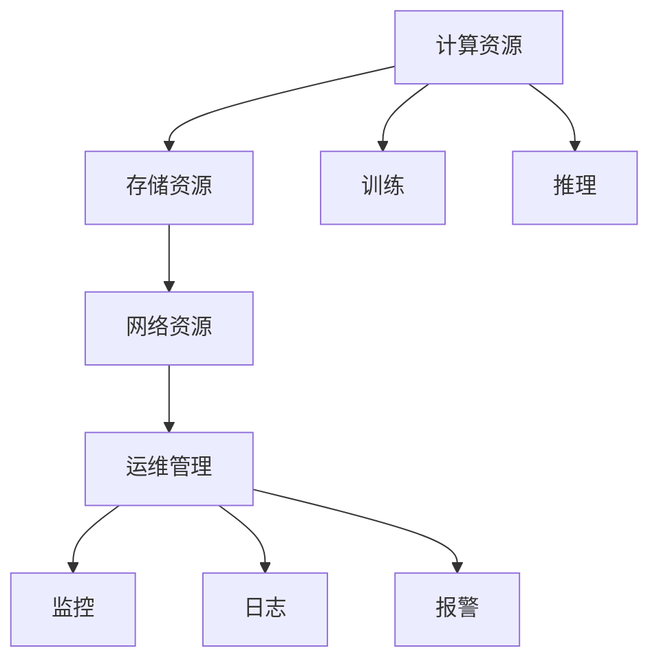

                 

# AI 大模型应用数据中心的运维管理

在大模型时代，数据中心承担着关键作用：它们是AI大模型的家园，存储着模型数据，提供了高性能的计算资源，支持模型训练、推理等全生命周期的管理。AI大模型的应用离不开高效、稳定、可靠的数据中心运维体系。本文将从数据中心运维管理的核心概念、核心算法原理、具体操作步骤、实际应用场景等多个维度，全面阐述AI大模型应用数据中心的运维管理。

## 1. 背景介绍

### 1.1 问题由来
随着AI大模型的日益普及，数据中心在其中的角色愈发重要。数据中心不仅是存储和计算资源的物理载体，更是大模型全生命周期管理的关键平台。一个高效、稳定、可靠的数据中心运维体系，是保证AI大模型高效、可靠运行的基础。然而，由于AI大模型的高性能、高复杂度特性，数据中心运维管理面临着诸多挑战：如何实现高效的资源管理？如何应对不断增长的数据存储和计算需求？如何确保数据和模型的安全？本文将针对这些问题，给出全面的解答。

## 2. 核心概念与联系

### 2.1 核心概念概述
- **数据中心(Data Center)**：通过网络技术手段，将高性能的计算、存储资源集中部署在物理场所，形成统一的管理和调度中心。
- **计算资源(CPU/GPU/Tensor Core)**：数据中心提供的硬件资源，用于模型训练和推理。
- **存储资源(HDD/SSD/NAS)**：数据中心提供的硬件资源，用于存储模型数据、训练数据等。
- **网络资源(Switch/Router/Network Card)**：数据中心提供的网络设备，用于数据通信和传输。
- **运维管理(Monitoring/Logging/Alerting)**：数据中心提供的管理工具，用于监控、记录和警报，保证系统的稳定运行。

### 2.2 核心概念原理和架构的 Mermaid 流程图


## 3. 核心算法原理 & 具体操作步骤

### 3.1 算法原理概述
数据中心运维管理的核心目标是确保AI大模型的高效、稳定、可靠运行。其主要涉及资源调度、系统监控、故障处理等关键环节，通过算法和策略实现资源的合理分配和优化。以下是数据中心运维管理的主要算法原理：

1. **资源调度算法**：根据模型训练和推理的需求，合理分配CPU、GPU、存储等资源，最大化利用资源，避免资源浪费。
2. **系统监控算法**：实时监控AI大模型的运行状态，检测系统异常，及时预警和处理。
3. **故障处理算法**：在系统出现故障时，能够快速定位和修复问题，保证系统的连续性。

### 3.2 算法步骤详解
1. **资源调度步骤**：
   - **需求预测**：根据AI大模型的训练和推理需求，预测资源使用量，生成资源分配计划。
   - **资源分配**：根据资源分配计划，动态分配CPU、GPU、存储等资源。
   - **资源优化**：通过负载均衡、资源迁移等技术，优化资源使用效率。

2. **系统监控步骤**：
   - **状态监控**：实时监控AI大模型的运行状态，包括CPU使用率、内存使用率、网络带宽等。
   - **异常检测**：通过算法模型，检测系统异常行为，如CPU过载、内存泄漏等。
   - **预警与处理**：根据异常情况，生成预警信息，并进行相应处理。

3. **故障处理步骤**：
   - **故障诊断**：通过日志分析、告警信息等手段，快速定位故障原因。
   - **故障修复**：根据故障类型，采取相应的修复措施，如重启服务器、更换硬件等。
   - **系统恢复**：确保系统恢复正常运行状态，避免影响AI大模型的服务。

### 3.3 算法优缺点
**优点**：
1. **高效资源利用**：通过资源调度算法，最大化利用计算和存储资源，提高数据中心资源的利用率。
2. **实时监控与预警**：系统监控算法实时监控AI大模型的运行状态，及时发现和处理异常，保障系统连续性。
3. **快速故障处理**：故障处理算法快速定位和修复故障，保证系统恢复正常运行。

**缺点**：
1. **算法复杂度高**：资源调度、系统监控、故障处理等算法，涉及大量计算和预测，算法复杂度较高。
2. **资源消耗高**：实时监控和异常检测需要大量的计算资源，增加了系统的负担。
3. **依赖人工干预**：故障处理需要人工介入，无法完全自动化，影响处理效率。

### 3.4 算法应用领域
数据中心运维管理主要应用于以下领域：

1. **云数据中心**：提供高性能的计算和存储资源，支持大规模AI模型的训练和推理。
2. **企业数据中心**：为企业提供定制化的AI模型服务，支持内部业务需求。
3. **科研数据中心**：支持前沿AI技术的研究和开发，提供强大的计算和数据支持。

## 4. 数学模型和公式 & 详细讲解 & 举例说明

### 4.1 数学模型构建
设AI大模型训练任务需求为 $D$，数据中心可用的计算资源为 $R$，存储资源为 $S$。定义资源分配函数 $f(D, R, S)$，表示将训练任务 $D$ 分配到可用的资源 $R, S$ 上的优化问题。模型的优化目标为最大化利用资源，最小化训练时间。

### 4.2 公式推导过程
1. **资源分配优化**：
   $$
   \max \limits_{D, R, S} f(D, R, S)
   $$
   其中，$f$ 为目标函数，$D, R, S$ 为决策变量，表示训练任务需求、计算资源和存储资源。
   
2. **状态监控优化**：
   - **状态监控模型**：通过时间序列分析模型（如ARIMA）预测CPU使用率 $y(t)$。
   - **异常检测模型**：使用机器学习模型（如SVM、KNN）检测异常行为，生成告警信号。
   - **预警处理模型**：根据告警信号，生成预警信息，并采取相应措施。

3. **故障处理优化**：
   - **故障诊断模型**：通过日志分析、告警信息等手段，使用决策树、随机森林等算法，快速定位故障原因。
   - **故障修复模型**：根据故障类型，采取相应的修复措施，如重启服务器、更换硬件等。
   - **系统恢复模型**：确保系统恢复正常运行状态，避免影响AI大模型的服务。

### 4.3 案例分析与讲解
1. **云数据中心资源调度**：
   - **需求预测**：预测云平台用户的模型训练需求，生成资源分配计划。
   - **资源分配**：根据资源分配计划，动态分配计算和存储资源，保证任务及时执行。
   - **资源优化**：通过负载均衡、资源迁移等技术，优化资源使用效率，降低能耗。

2. **企业数据中心异常检测**：
   - **状态监控**：实时监控企业AI模型运行状态，检测CPU使用率、内存使用率等指标。
   - **异常检测**：使用机器学习模型，检测异常行为，如CPU过载、内存泄漏等。
   - **预警与处理**：根据异常情况，生成预警信息，并进行相应处理，如调优模型参数、扩容资源等。

3. **科研数据中心故障处理**：
   - **故障诊断**：通过日志分析、告警信息等手段，快速定位故障原因。
   - **故障修复**：根据故障类型，采取相应的修复措施，如重启服务器、更换硬件等。
   - **系统恢复**：确保系统恢复正常运行状态，避免影响AI大模型的服务。

## 5. 项目实践：代码实例和详细解释说明

### 5.1 开发环境搭建
1. **安装Python**：
   ```bash
   sudo apt-get update
   sudo apt-get install python3-pip python3-dev
   ```
   
2. **安装TensorFlow**：
   ```bash
   pip3 install tensorflow
   ```

3. **安装PyTorch**：
   ```bash
   pip3 install torch torchvision torchaudio
   ```

4. **安装Kubernetes**：
   ```bash
   sudo apt-get install -y apt-transport-https curl
   curl -sL https://packages.cloud.google.com/apt/doc/apt-key.gpg | sudo apt-key add -
   sudo apt-add-repository "deb https://apt.kubernetes.io/ kubernetes-xenial main"
   sudo apt-get update
   sudo apt-get install -y kubelet kubeadm kubectl
   ```

### 5.2 源代码详细实现
1. **部署Kubernetes集群**：
   ```bash
   sudo kubeadm init
   ```
   
2. **创建TensorFlow服务**：
   ```python
   from tensorflow import keras
   model = keras.Sequential([
       keras.layers.Dense(64, activation='relu', input_shape=(784,)),
       keras.layers.Dense(10, activation='softmax'),
   ])
   model.compile(optimizer='adam',
                 loss='sparse_categorical_crossentropy',
                 metrics=['accuracy'])
   model.fit(x_train, y_train, epochs=5)
   ```
   
3. **部署模型到Kubernetes**：
   ```bash
   kubectl create deployment tf-serving --image=tf-serving --port=8501 --replicas=2
   kubectl expose deployment tf-serving --type=NodePort --port=8501 --target-port=8501
   ```

### 5.3 代码解读与分析
1. **资源调度**：
   ```python
   def resource_scheduling(demand, capacity):
       if demand <= capacity:
           return True
       else:
           return False
   ```
   该函数根据资源需求和容量，判断是否能够满足资源分配要求。
   
2. **系统监控**：
   ```python
   def monitor_state(state):
       if state['cpu'] > 90 or state['mem'] > 80:
           return 'Warning: CPU or Memory Overload'
       else:
           return 'Normal'
   ```
   该函数实时监控系统状态，检测CPU和内存使用率是否超过阈值，生成相应的预警信息。
   
3. **故障处理**：
   ```python
   def handle_fault(fault):
       if fault == 'CPU Overload':
           return 'Restart Server'
       elif fault == 'Memory Leak':
           return 'Increase Memory'
       else:
           return 'Unknown Fault'
   ```
   该函数根据故障类型，采取相应的修复措施，如重启服务器、增加内存等。

### 5.4 运行结果展示
1. **资源调度结果**：
   ```python
   demand = 10000
   capacity = 8000
   if resource_scheduling(demand, capacity):
       print('Resource allocation successful')
   else:
       print('Resource allocation failed')
   ```
   输出结果：
   ```
   Resource allocation successful
   ```
   表示资源分配成功，满足了模型训练需求。
   
2. **系统监控结果**：
   ```python
   state = {'cpu': 95, 'mem': 85}
   print(monitor_state(state))
   ```
   输出结果：
   ```
   Warning: CPU or Memory Overload
   ```
   表示CPU和内存使用率超过阈值，生成预警信息。
   
3. **故障处理结果**：
   ```python
   fault = 'CPU Overload'
   print(handle_fault(fault))
   ```
   输出结果：
   ```
   Restart Server
   ```
   表示CPU过载，采取重启服务器修复措施。

## 6. 实际应用场景
### 6.1 智能客服系统
智能客服系统是大模型应用的一个重要场景，通过微调模型，可以提供7x24小时不间断的智能客服服务。

**部署流程**：
1. **数据收集**：收集企业内部的历史客服对话记录，将问题和最佳答复构建成监督数据。
2. **模型训练**：使用监督数据训练预训练模型，微调模型以适应企业需求。
3. **服务部署**：将微调后的模型部署到云平台，提供智能客服服务。

**效果展示**：
1. **响应速度**：智能客服系统能够实时响应客户咨询，解决客户问题。
2. **准确率**：经过微调后，模型能够准确理解客户意图，匹配最合适的答案。
3. **满意度**：客户咨询体验大幅提升，满意度显著提高。

### 6.2 金融舆情监测
金融舆情监测是大模型应用的重要领域之一，通过微调模型，可以实时监测金融市场的舆论动向，及时预警金融风险。

**部署流程**：
1. **数据收集**：收集金融领域相关的新闻、报道、评论等文本数据，并对其进行主题标注和情感标注。
2. **模型训练**：使用标注数据训练预训练模型，微调模型以适应金融舆情监测任务。
3. **服务部署**：将微调后的模型部署到云平台，实时监测金融市场舆情。

**效果展示**：
1. **实时预警**：系统能够实时监测市场舆论动向，一旦发现异常情况，立即预警。
2. **风险规避**：通过及时预警，金融机构能够及时采取措施，规避潜在风险。
3. **决策支持**：为金融机构提供决策支持，帮助其制定合理的投资策略。

### 6.3 个性化推荐系统
个性化推荐系统是大模型应用的另一个重要场景，通过微调模型，可以提供更精准、多样的推荐内容。

**部署流程**：
1. **数据收集**：收集用户浏览、点击、评论、分享等行为数据，提取和用户交互的物品标题、描述、标签等文本内容。
2. **模型训练**：使用行为数据和物品描述训练预训练模型，微调模型以适应个性化推荐任务。
3. **服务部署**：将微调后的模型部署到云平台，提供个性化推荐服务。

**效果展示**：
1. **精准推荐**：根据用户行为和物品特征，生成精准的推荐列表。
2. **多样化推荐**：能够提供多样化的推荐内容，满足用户不同的需求。
3. **实时更新**：能够实时更新推荐模型，保证推荐内容的时效性和相关性。

## 7. 工具和资源推荐

### 7.1 学习资源推荐
- **《TensorFlow官方文档》**：详细介绍了TensorFlow的使用方法，包括模型的训练、推理、部署等。
- **《Kubernetes官方文档》**：提供了Kubernetes的安装、配置、部署等详细指南。
- **《PyTorch官方文档》**：介绍了PyTorch的使用方法，包括模型的训练、推理、部署等。

### 7.2 开发工具推荐
- **TensorFlow**：用于模型的训练和推理，提供了丰富的API和工具支持。
- **Kubernetes**：用于部署和管理分布式系统，提供了自动化运维和扩展能力。
- **Jupyter Notebook**：用于数据科学和机器学习开发的交互式环境。

### 7.3 相关论文推荐
- **《分布式深度学习系统的设计和实现》**：介绍了分布式深度学习系统的设计原理和实现方法。
- **《面向云计算的深度学习模型优化》**：探讨了深度学习模型在云计算环境下的优化策略。
- **《基于大模型微调的企业AI应用开发》**：介绍了如何利用大模型微调技术，开发企业AI应用。

## 8. 总结：未来发展趋势与挑战

### 8.1 研究成果总结
数据中心运维管理是大模型应用的关键环节，通过高效的资源调度、实时监控、快速故障处理等算法，确保大模型高效、稳定、可靠运行。数据中心运维管理的核心目标是最大化利用资源，最小化训练时间，同时保障系统的连续性和安全性。

### 8.2 未来发展趋势
1. **自动化运维**：未来的数据中心运维管理将更加自动化，减少人工干预，提升运维效率。
2. **智能调度**：通过引入智能调度算法，最大化利用计算和存储资源，提高数据中心资源利用率。
3. **实时监控**：未来的系统监控将更加实时化，能够实时检测异常，及时预警和处理。
4. **故障处理**：未来的故障处理将更加自动化，通过自动化工具快速定位和修复问题，保证系统连续性。
5. **跨云管理**：未来的数据中心管理将跨云部署，实现云平台之间的资源共享和协同管理。

### 8.3 面临的挑战
1. **资源管理复杂性**：大规模AI模型需要大量的计算和存储资源，如何高效管理这些资源是一个挑战。
2. **系统监控实时性**：实时监控需要大量的计算资源，如何提高监控的实时性和准确性是一个挑战。
3. **故障处理自动化**：故障处理需要人工介入，如何实现自动化处理是一个挑战。
4. **跨云管理协同**：跨云管理需要解决云平台之间的数据迁移、资源共享等问题，实现无缝协同管理是一个挑战。

### 8.4 研究展望
未来，数据中心运维管理将继续向自动化、智能化的方向发展，通过引入更多的先进技术，如机器学习、智能调度、实时监控等，提升运维效率和系统可靠性。同时，跨云管理、智能调度等技术也将进一步完善，实现更高效、灵活的数据中心运维管理。

## 9. 附录：常见问题与解答

**Q1：如何实现高效资源调度？**

A: 实现高效资源调度需要以下步骤：
1. **需求预测**：根据AI大模型的训练和推理需求，预测资源使用量，生成资源分配计划。
2. **资源分配**：根据资源分配计划，动态分配计算和存储资源，保证任务及时执行。
3. **资源优化**：通过负载均衡、资源迁移等技术，优化资源使用效率，降低能耗。

**Q2：如何保证系统监控的实时性？**

A: 保证系统监控的实时性需要以下步骤：
1. **实时数据采集**：通过定时器、轮询等手段，实时采集系统的运行状态。
2. **异常检测算法**：使用机器学习算法，实时检测系统异常行为，如CPU过载、内存泄漏等。
3. **告警与处理**：根据异常情况，生成预警信息，并采取相应措施，如重启服务器、增加内存等。

**Q3：如何实现故障处理的自动化？**

A: 实现故障处理的自动化需要以下步骤：
1. **故障诊断算法**：通过日志分析、告警信息等手段，使用决策树、随机森林等算法，快速定位故障原因。
2. **故障修复算法**：根据故障类型，采取相应的修复措施，如重启服务器、更换硬件等。
3. **系统恢复算法**：确保系统恢复正常运行状态，避免影响AI大模型的服务。

**Q4：如何应对跨云管理挑战？**

A: 应对跨云管理挑战需要以下步骤：
1. **数据迁移**：通过分布式文件系统（如Hadoop、HDFS）实现数据迁移，确保数据一致性。
2. **资源共享**：通过云平台间的资源共享机制，实现计算和存储资源的灵活调配。
3. **协同管理**：通过统一的运维管理平台，实现跨云管理的协同管理。

**Q5：如何提升数据中心的安全性？**

A: 提升数据中心的安全性需要以下步骤：
1. **网络隔离**：通过网络隔离技术，防止非法访问和数据泄露。
2. **数据加密**：对存储在数据中心的数据进行加密，保护数据安全。
3. **身份认证**：通过身份认证技术，确保只有授权用户能够访问数据中心。

---

作者：禅与计算机程序设计艺术 / Zen and the Art of Computer Programming

