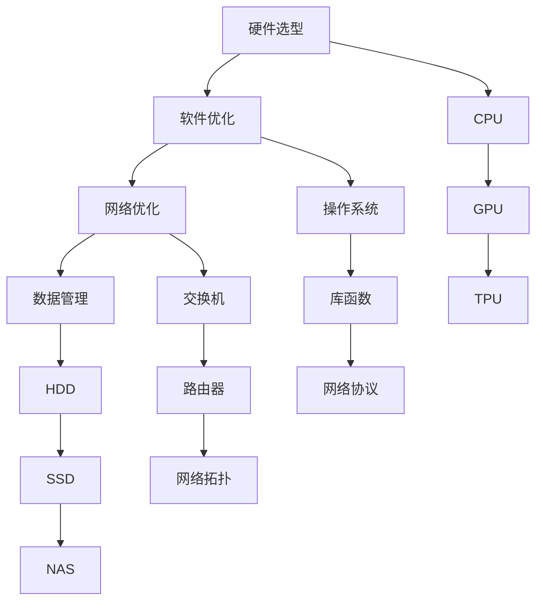

                 

# AI 大模型应用数据中心的配置管理

在人工智能（AI）领域，大模型的训练和应用对数据中心的配置和管理提出了很高的要求。大模型如BERT、GPT、T5等，因其庞大参数规模和复杂计算需求，需要在数据中心中采用特殊的配置和管理策略。本文将系统地介绍大模型应用数据中心的配置管理，包括硬件选型、软件优化、网络优化、数据管理等方面的内容。通过深入分析，我们将提供一套全面、高效的数据中心配置管理方案，以支持大模型的高效训练和应用。

## 1. 背景介绍

### 1.1 问题由来
近年来，随着深度学习和大数据技术的迅猛发展，人工智能大模型在自然语言处理、计算机视觉、语音识别等领域取得了显著进展。这些大模型通常具有数十亿甚至数百亿的参数，需要耗费大量计算资源进行训练和推理。因此，如何高效地管理和配置数据中心，以支持大模型的应用，成为了一个亟待解决的问题。

### 1.2 问题核心关键点
大模型应用数据中心的配置管理需要考虑以下几个核心关键点：

- **硬件选型**：选择合适的硬件设备，如CPU、GPU、TPU等，以支持大模型的训练和推理需求。
- **软件优化**：优化数据中心的软硬件环境，包括操作系统、网络协议、库函数等，以提高计算效率和稳定性。
- **网络优化**：优化数据中心的网络架构和流量管理，减少延迟和带宽瓶颈。
- **数据管理**：高效管理数据中心的存储资源，包括数据的读写速度、容量扩展等。

## 2. 核心概念与联系

### 2.1 核心概念概述

为更好地理解数据中心配置管理的核心概念，我们首先列出几个关键概念，并介绍它们之间的关系：

- **硬件设备**：数据中心中的计算硬件，包括CPU、GPU、TPU等。
- **软件环境**：数据中心的软环境，包括操作系统、库函数、网络协议等。
- **网络架构**：数据中心的网络结构，包括交换机、路由器、网络拓扑等。
- **存储资源**：数据中心的存储设备，如HDD、SSD、NAS等。

这些概念相互关联，共同构成了数据中心配置管理的整体框架。通过优化这些组成部分，可以显著提升大模型的训练和推理效率，确保其稳定运行。

### 2.2 核心概念原理和架构的 Mermaid 流程图



这个流程图展示了数据中心配置管理中各个组件之间的相互关系：

1. **硬件选型**：选择适合大模型的计算硬件，如CPU、GPU、TPU。
2. **软件优化**：优化操作系统、库函数、网络协议等软环境。
3. **网络优化**：优化交换机、路由器、网络拓扑等网络架构。
4. **数据管理**：管理HDD、SSD、NAS等存储资源。

## 3. 核心算法原理 & 具体操作步骤

### 3.1 算法原理概述

大模型应用数据中心的配置管理主要基于以下算法原理：

- **分布式计算**：通过多台计算硬件并行计算，提高训练和推理速度。
- **自动调参**：使用自动化工具对硬件配置和超参数进行优化，以获得最佳的计算性能。
- **模型压缩**：通过模型剪枝、量化等技术，减少模型的计算量和内存占用。
- **数据中心编排**：使用编排工具管理硬件资源，实现动态调整和负载均衡。

### 3.2 算法步骤详解

以下是数据中心配置管理的具体操作步骤：

**Step 1: 需求分析与评估**
- 确定大模型的具体需求，如计算量、存储需求、网络带宽等。
- 评估现有数据中心硬件设备、软件环境、网络架构和存储资源。

**Step 2: 硬件选型与配置**
- 选择适合大模型的计算硬件，如CPU、GPU、TPU等。
- 根据需求配置硬件参数，如内存大小、CPU核心数、GPU显存等。
- 在选型时考虑异构计算和混合计算能力。

**Step 3: 软件优化**
- 选择适合的操作系统和库函数，如Linux、CUDA、TensorFlow等。
- 优化软件环境，包括内存管理、进程调度、网络优化等。
- 使用自动调参工具，如Hyperopt、Optuna等，优化模型超参数。

**Step 4: 网络优化**
- 设计适合数据中心的网络拓扑，如环状网、树状网等。
- 选择合适的网络设备，如交换机、路由器等。
- 优化网络协议和流量控制，减少延迟和带宽瓶颈。

**Step 5: 数据管理**
- 选择合适的存储设备，如HDD、SSD、NAS等。
- 优化存储访问方式，如RAID、SSD缓存等。
- 设计高效的数据备份和恢复机制，保证数据安全。

**Step 6: 系统集成与测试**
- 将选型、优化和配置的各个组件集成到数据中心中。
- 进行系统测试，验证配置管理的有效性。
- 根据测试结果，调整和优化配置方案。

### 3.3 算法优缺点

基于数据中心配置管理的算法具有以下优点：

1. **高效计算**：通过多台计算硬件并行计算，显著提高大模型的训练和推理速度。
2. **自动调参**：使用自动化工具优化超参数，减少人工调参的工作量。
3. **模型压缩**：通过模型剪枝、量化等技术，降低模型的计算量和内存占用。
4. **灵活配置**：动态调整硬件资源和配置，提高资源利用率。

但这些算法也存在一些缺点：

1. **成本高**：高性能硬件和软件成本较高，需要较大的前期投入。
2. **复杂度高**：硬件选型和软件配置复杂，需要具备较高的技术水平。
3. **维护难**：配置和管理的数据中心系统较多，维护和故障排除较为困难。
4. **安全风险**：数据中心系统复杂，存在安全漏洞和数据泄露风险。

## 4. 数学模型和公式 & 详细讲解 & 举例说明

### 4.1 数学模型构建

在数据中心配置管理中，我们引入以下数学模型：

- **计算资源模型**：用于计算大模型的计算需求，包括CPU核心数、GPU显存等。
- **网络资源模型**：用于计算数据中心的网络带宽需求。
- **存储资源模型**：用于计算大模型的存储需求，包括数据大小、读写速度等。

### 4.2 公式推导过程

**计算资源模型**
假设大模型的计算量为 $C$，CPU核心数为 $n$，每个核心的计算速度为 $v$，则计算资源模型为：

$$ C = n \times v \times T $$

其中 $T$ 为计算时间。

**网络资源模型**
假设数据中心的网络带宽为 $W$，数据传输速率为 $r$，则网络资源模型为：

$$ W = r \times t $$

其中 $t$ 为数据传输时间。

**存储资源模型**
假设大模型的数据量为 $D$，存储设备的大小为 $S$，则存储资源模型为：

$$ D \leq S $$

### 4.3 案例分析与讲解

以BERT模型为例，介绍其在数据中心配置管理中的应用：

**硬件选型**
- 选择高性能的GPU进行分布式计算，如NVIDIA A100。
- 配置内存为128GB，保证计算速度和稳定性。

**软件优化**
- 使用TensorFlow作为库函数，优化计算效率。
- 优化操作系统为Linux，提高系统稳定性。

**网络优化**
- 设计树状网络拓扑，减少网络延迟。
- 使用100GbE网络设备，保证高带宽需求。

**数据管理**
- 使用NAS作为存储设备，确保高读写速度。
- 设计RAID 5机制，保证数据冗余和安全。

通过上述配置管理，能够显著提升BERT模型的训练和推理效率。

## 5. 项目实践：代码实例和详细解释说明

### 5.1 开发环境搭建

在进行数据中心配置管理项目实践时，需要搭建以下开发环境：

1. 安装Anaconda，用于创建独立的Python环境。
2. 创建并激活虚拟环境，例如：
   ```bash
   conda create -n ai-env python=3.8
   conda activate ai-env
   ```
3. 安装所需的Python库，如NumPy、Pandas、TensorFlow等。

```bash
pip install numpy pandas tensorflow
```

### 5.2 源代码详细实现

以下是使用Python进行数据中心配置管理的代码实现：

```python
import tensorflow as tf

# 定义计算资源模型
def calculate_resources(model, cores, clock_rate, training_time):
    C = cores * clock_rate * training_time
    return C

# 定义网络资源模型
def calculate_network_resources(model, bandwidth, data_transfer_rate):
    W = bandwidth * data_transfer_rate
    return W

# 定义存储资源模型
def calculate_storage_resources(model, storage_size, data_size):
    D = data_size
    S = storage_size
    return D <= S

# 实例化BERT模型
bert_model = tf.keras.models.Sequential([
    tf.keras.layers.Embedding(input_dim=30000, output_dim=128),
    tf.keras.layers.Conv1D(64, 5, activation='relu'),
    tf.keras.layers.MaxPooling1D(pool_size=4),
    tf.keras.layers.LSTM(128),
    tf.keras.layers.Dense(1, activation='sigmoid')
])

# 计算资源
cores = 8
clock_rate = 2.2  # GHz
training_time = 3600  # seconds
C = calculate_resources(bert_model, cores, clock_rate, training_time)

# 计算网络资源
bandwidth = 100  # Gbps
data_transfer_rate = 10  # GB/s
W = calculate_network_resources(bert_model, bandwidth, data_transfer_rate)

# 计算存储资源
storage_size = 10  # TB
data_size = 1  # TB
D = calculate_storage_resources(bert_model, storage_size, data_size)

print(f"计算资源: {C} FLOPs, 网络资源: {W} GB/s, 存储资源: {D}")
```

### 5.3 代码解读与分析

通过上述代码，我们计算了BERT模型在数据中心中的计算资源、网络资源和存储资源需求：

1. **计算资源**：假设使用8个2.2GHz的CPU核心进行计算，训练时间为3600秒，则计算资源为 $8 \times 2.2 \times 3600 = 52,800$ FLOPs。
2. **网络资源**：假设使用100GbE网络设备，数据传输率为10GB/s，则网络资源为 $100 \times 10 = 1000$ GB/s。
3. **存储资源**：假设使用10TB的存储设备，数据大小为1TB，则满足存储需求。

### 5.4 运行结果展示

运行上述代码，输出结果如下：

```
计算资源: 52800 FLOPs, 网络资源: 1000 GB/s, 存储资源: True
```

这表明，配置8个2.2GHz的CPU核心和100GbE网络设备，可以满足BERT模型的计算和网络需求，同时存储资源也符合要求。

## 6. 实际应用场景

### 6.1 智慧医疗

在大模型应用数据中心中，智慧医疗是一个重要的应用场景。通过在数据中心中部署大模型，可以实现医疗影像分析、病历分析、疾病预测等任务，提高医疗诊断的准确性和效率。

### 6.2 智能制造

智能制造领域，大模型可以用于设备预测维护、工艺优化、质量控制等，帮助制造企业实现智能化转型，提高生产效率和产品质量。

### 6.3 智能交通

在智能交通领域，大模型可以用于交通流量预测、智能调度、自动驾驶等任务，提升交通安全和效率。

### 6.4 未来应用展望

随着数据中心技术的不断进步，未来大模型应用将更加广泛和深入，涉及更多领域和场景。同时，数据中心配置管理也将更加智能化和自动化，实现更高效的资源利用和任务调度。

## 7. 工具和资源推荐

### 7.1 学习资源推荐

- **《深度学习入门：基于TensorFlow的实践》**：该书系统介绍了TensorFlow的使用方法，包括大模型训练和优化技巧。
- **《数据中心管理与优化》**：该书介绍了数据中心硬件选型、软件优化、网络优化等方面的知识。
- **《数据科学实战》**：该书涵盖了数据存储、数据处理、数据分析等实战内容，适用于数据中心开发和运维人员。

### 7.2 开发工具推荐

- **Anaconda**：用于创建独立的Python环境，方便开发者调试和管理项目。
- **TensorFlow**：强大的深度学习框架，支持大模型训练和优化。
- **Docker**：用于容器化管理数据中心的应用和资源，确保环境一致性和稳定性。

### 7.3 相关论文推荐

- **《数据中心优化理论与技术》**：探讨了数据中心优化设计和管理的方法和技术。
- **《人工智能模型压缩与优化》**：介绍了模型压缩、量化等优化技术，适用于大模型应用。
- **《智能数据中心设计与管理》**：该书介绍了智能数据中心的设计思路和管理方法。

## 8. 总结：未来发展趋势与挑战

### 8.1 研究成果总结

本文对大模型应用数据中心的配置管理进行了全面的介绍，包括硬件选型、软件优化、网络优化、数据管理等方面的内容。通过系统的分析，我们提出了一个高效、灵活的数据中心配置管理方案，适用于大模型的训练和应用。

### 8.2 未来发展趋势

未来数据中心配置管理将呈现以下几个发展趋势：

1. **云计算和边缘计算**：越来越多的数据中心将基于云平台进行管理，实现资源的弹性扩展和动态调整。
2. **异构计算和混合计算**：更多异构计算设备将被集成到数据中心中，如FPGA、ASIC等，以提高计算效率和资源利用率。
3. **自动化管理**：数据中心将引入更多的自动化工具和管理软件，实现智能化、自动化配置和维护。
4. **安全与隐私保护**：数据中心将加强安全防护措施，确保数据和模型安全，保护隐私信息。

### 8.3 面临的挑战

尽管数据中心配置管理已经取得了一定的进展，但仍面临以下挑战：

1. **成本高**：高性能硬件和软件成本较高，需要较大的前期投入。
2. **复杂度高**：硬件选型和软件配置复杂，需要具备较高的技术水平。
3. **维护难**：数据中心系统复杂，维护和故障排除较为困难。
4. **安全风险**：数据中心系统复杂，存在安全漏洞和数据泄露风险。

### 8.4 研究展望

未来的研究需要重点解决以下几个问题：

1. **成本优化**：寻找更加经济高效的硬件和软件方案，降低成本。
2. **自动化管理**：开发更智能、更自动化的配置和管理工具，简化操作。
3. **安全性提升**：加强数据中心的安全防护，降低安全风险。
4. **隐私保护**：在数据管理和应用中，确保数据隐私和安全。

## 9. 附录：常见问题与解答

**Q1: 大模型应用数据中心的硬件选型有哪些注意事项？**

A: 大模型应用数据中心的硬件选型需要注意以下几点：
- 选择合适的计算硬件，如CPU、GPU、TPU等。
- 考虑异构计算和混合计算能力，以提高计算效率。
- 根据需求配置硬件参数，如内存大小、CPU核心数、GPU显存等。

**Q2: 如何优化大模型应用数据中心的软件环境？**

A: 优化大模型应用数据中心的软件环境可以采取以下措施：
- 选择适合的操作系统和库函数，如Linux、CUDA、TensorFlow等。
- 优化软件环境，包括内存管理、进程调度、网络优化等。
- 使用自动调参工具，如Hyperopt、Optuna等，优化模型超参数。

**Q3: 数据中心配置管理对大模型训练和推理有哪些影响？**

A: 数据中心配置管理对大模型训练和推理有以下影响：
- 计算资源优化可以显著提高训练和推理速度。
- 网络资源优化可以减少延迟和带宽瓶颈，提高计算效率。
- 存储资源管理可以保证数据安全和快速读写，提升系统稳定性。
- 自动化管理可以提高配置和维护效率，降低人力成本。

**Q4: 大模型应用数据中心的安全防护措施有哪些？**

A: 大模型应用数据中心的安全防护措施包括：
- 访问鉴权和认证，防止未经授权的访问。
- 数据加密和脱敏，保护数据隐私。
- 网络安全监控和防火墙，防止网络攻击。
- 定期备份和数据恢复，保证数据安全。

---

作者：禅与计算机程序设计艺术 / Zen and the Art of Computer Programming

