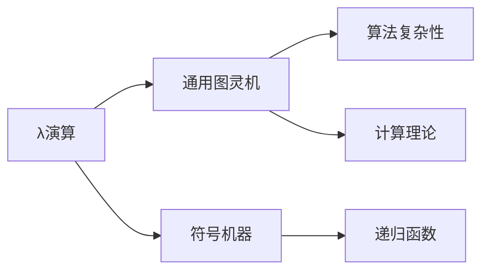

                 

# AI 大模型计算机科学家群英传：丘奇（Alonzo Church）

## 1. 背景介绍

### 1.1 问题由来

Alonzo Church（1903-1995）是美国著名的计算机科学家、逻辑学家和哲学家，被公认为“人工智能之父”。他与Kurt Gödel和David Hilbert一起被广泛认为是数学界和计算机科学界的奠基人之一。他创立了lambda演算，并提出了通用图灵机理论，为人工智能的诞生和发展奠定了坚实的基础。

在20世纪初期，计算机科学还处于起步阶段。然而，Alonzo Church在逻辑和数学领域的深入研究，揭示了计算和人工智能的潜在可能性。他的工作不仅推动了理论计算机科学的发展，也为未来的计算模型和编程语言奠定了基础。

### 1.2 问题核心关键点

Alonzo Church在人工智能领域的贡献主要体现在以下方面：

- 创立lambda演算：lambda演算是一种形式语言，可以用来描述计算过程，是现代计算机科学和人工智能的核心工具。
- 提出通用图灵机理论：图灵机是一种模拟计算过程的数学模型，任何计算问题都可以用图灵机求解，对计算机科学具有深远影响。
- 开发符号机器：符号机器是一种用于处理字符串和逻辑表达式的计算模型，为人工智能提供了理论基础。
- 推动计算理论的发展：他的工作推动了算法复杂性和计算理论的发展，为计算机科学的成熟提供了关键支撑。

Alonzo Church的工作不仅改变了科学界的认识，也对人工智能领域产生了深远影响。他的思想和方法为现代计算机科学和人工智能提供了重要启示，成为后续研究的基石。

## 2. 核心概念与联系

### 2.1 核心概念概述

为了更好地理解Alonzo Church的贡献，本节将介绍几个关键概念及其相互联系：

- **λ演算（Lambda Calculus）**：λ演算是一种形式化的计算模型，通过抽象和函数应用来描述计算过程。它由Alonzo Church在1936年提出，是现代计算机科学和人工智能的基础。

- **通用图灵机（Universal Turing Machine, UTMs）**：通用图灵机是一种能够执行任何计算的数学模型。Alonzo Church和Alan Turing分别独立地提出了这个概念，奠定了现代计算理论的基础。

- **符号机器（Symbolic Machine）**：符号机器是一种处理符号表达式的计算模型，能够进行复杂的逻辑推理和计算。它是λ演算在实际应用中的重要体现。

- **递归函数（Recursive Functions）**：递归函数是一种通过自身调用自身来解决问题的方法，是λ演算和图灵机的基本特性之一。

- **算法复杂性（Algorithmic Complexity）**：算法复杂性是衡量算法效率的指标，通过研究算法在不同输入规模下的运行时间，评估算法的优劣。

- **计算理论（Computational Theory）**：计算理论研究计算过程的基本规律和性质，是计算机科学和人工智能的重要组成部分。

这些核心概念之间的逻辑关系可以通过以下Mermaid流程图来展示：



这个流程图展示了一系列概念的层次关系：

1. λ演算为通用图灵机提供了数学基础。
2. 符号机器是λ演算在实际应用中的体现。
3. 递归函数是λ演算和图灵机的基本特性之一。
4. 算法复杂性是评估算法效率的关键指标。
5. 计算理论研究计算过程的基本规律和性质。

这些概念共同构成了Alonzo Church对计算和人工智能的重要贡献。通过理解这些核心概念，我们可以更好地把握他思想的精髓和深远影响。

## 3. 核心算法原理 & 具体操作步骤

### 3.1 算法原理概述

Alonzo Church在数学和逻辑学领域的贡献，奠定了人工智能的理论基础。他的λ演算和通用图灵机理论为现代计算机科学和人工智能提供了关键工具。

λ演算是一种基于函数抽象和应用的形式化计算模型。它的核心思想是通过函数的定义和应用来描述计算过程。λ演算由以下几个关键元素构成：

- **变量（Variables）**：λ演算中的变量表示函数的输入和输出。
- **函数定义（Function Definitions）**：函数定义描述了函数的输入和输出。
- **函数应用（Function Applications）**：函数应用表示函数的调用。

通用图灵机是一种能够执行任何计算的数学模型，由一个读写头、一个有限状态集和一个无限带组成。图灵机的核心思想是通过读写头在无限带上移动，根据当前状态和读写头的位置，执行相应的操作。图灵机的特点包括：

- **无限带**：图灵机的计算带是无限的，可以存储任何长度的字符串。
- **读写头**：读写头可以左右移动，读取和写入带上的字符。
- **有限状态集**：图灵机的状态是有限的，状态之间的转移由读写头和当前位置的字符决定。

Alonzo Church的符号机器则是一种将λ演算应用于实际计算模型的方案。符号机器通过使用λ演算中的抽象和函数应用，处理符号表达式和逻辑推理。符号机器的特点包括：

- **符号表达式**：符号机器处理的是符号表达式，例如数学公式、逻辑表达式等。
- **递归函数**：符号机器中的函数可以通过递归调用自身来解决问题。
- **逻辑推理**：符号机器能够进行复杂的逻辑推理和计算。

### 3.2 算法步骤详解

Alonzo Church的理论工作主要通过数学形式化和证明来实现。以下是基于λ演算和图灵机的几个关键算法步骤：

1. **函数定义和应用**：
   - 函数定义形式：$f(x) = x + 1$，表示将输入$x$加1。
   - 函数应用形式：$f(3) = 4$，表示将$f(x)$应用到3上，得到4。

2. **图灵机的工作原理**：
   - 初始状态：图灵机从一个初始状态开始。
   - 读写头移动：读写头根据当前状态和位置，向左或向右移动。
   - 状态转移：图灵机根据当前状态和读写头位置，执行相应的操作，并跳转到下一个状态。
   - 输出：图灵机在完成计算后，输出结果。

3. **λ演算的递归调用**：
   - 递归调用形式：$f(f(x)) = f(x + 1)$，表示将$f(x)$应用到自身上。
   - 递归调用实现：通过函数定义和应用，递归调用可以简化复杂的计算过程。

### 3.3 算法优缺点

Alonzo Church的理论工作具有以下优点：

- **形式化严格**：他的工作基于严格的数学形式化，提供了理论上的严谨性。
- **普适性强**：λ演算和图灵机理论适用于任何计算问题，具有广泛的普适性。
- **推动发展**：他的工作推动了计算机科学和人工智能的发展，奠定了理论基础。

然而，这些理论方法也存在一些局限性：

- **计算复杂度高**：λ演算和图灵机理论在计算复杂度上存在一些困难，需要进行深入研究。
- **实际应用难**：理论上的成果与实际应用的差距较大，需要进行大量的工程实践。
- **缺乏具体实现**：理论上的成果需要通过具体的实现才能发挥作用，需要进行深入的工程开发。

尽管存在这些局限性，Alonzo Church的理论工作对现代计算机科学和人工智能具有深远的影响，为后续研究提供了重要的理论基础。

### 3.4 算法应用领域

Alonzo Church的理论工作主要应用于以下几个领域：

- **计算理论**：λ演算和图灵机理论为计算理论提供了重要的理论基础。
- **人工智能**：他的工作推动了人工智能的发展，为人工智能提供了重要的理论支撑。
- **编程语言**：λ演算和递归函数的思想对现代编程语言的设计和实现产生了深远影响。
- **数学和逻辑学**：他的工作对数学和逻辑学的发展也具有重要意义。

## 4. 数学模型和公式 & 详细讲解 & 举例说明

### 4.1 数学模型构建

Alonzo Church的λ演算和图灵机理论主要基于数学模型进行形式化描述。以下是λ演算和图灵机理论的数学模型构建：

1. **λ演算的数学模型**：
   - 变量的形式化表示：$x, y, z$ 表示变量。
   - 函数的定义形式：$(f x) = x + 1$，表示将输入$x$加1。
   - 函数的应用形式：$f(3) = 4$，表示将$f(x)$应用到3上，得到4。

2. **图灵机的数学模型**：
   - 状态的形式化表示：$q_0, q_1, q_2$ 表示状态。
   - 读写头的位置形式化表示：$0, 1, 2$ 表示读写头的位置。
   - 图灵机的执行过程：
     - 初始状态：$q_0$，读写头位置：0，带上的字符：$\lambda$。
     - 状态转移：$q_0$ 到 $q_1$，读写头向右移动，带上的字符变为 $1$。
     - 状态转移：$q_1$ 到 $q_2$，读写头向右移动，带上的字符变为 $2$。
     - 状态转移：$q_2$ 到 $q_0$，读写头向左移动，带上的字符变为 $\lambda$。

### 4.2 公式推导过程

以下是λ演算和图灵机理论的公式推导过程：

1. **λ演算的公式推导**：
   - 函数定义：$f(x) = x + 1$
   - 函数应用：$f(3) = 4$
   - 递归调用：$f(f(x)) = f(x + 1)$

2. **图灵机的公式推导**：
   - 初始状态：$q_0$，读写头位置：0，带上的字符：$\lambda$
   - 状态转移：$q_0$ 到 $q_1$，读写头向右移动，带上的字符变为 $1$
   - 状态转移：$q_1$ 到 $q_2$，读写头向右移动，带上的字符变为 $2$
   - 状态转移：$q_2$ 到 $q_0$，读写头向左移动，带上的字符变为 $\lambda$

### 4.3 案例分析与讲解

以下是λ演算和图灵机理论的案例分析与讲解：

1. **λ演算的案例**：
   - 计算 $f(3)$：
     - 应用函数定义：$f(x) = x + 1$
     - 得到 $f(3) = 3 + 1 = 4$
   - 计算 $f(f(3))$：
     - 应用函数定义：$f(x) = x + 1$
     - 得到 $f(4) = 4 + 1 = 5$
     - 递归调用：$f(f(3)) = f(4) = 5$

2. **图灵机的案例**：
   - 计算 $f(3)$：
     - 初始状态：$q_0$，读写头位置：0，带上的字符：$\lambda$
     - 状态转移：$q_0$ 到 $q_1$，读写头向右移动，带上的字符变为 $1$
     - 状态转移：$q_1$ 到 $q_2$，读写头向右移动，带上的字符变为 $2$
     - 状态转移：$q_2$ 到 $q_0$，读写头向左移动，带上的字符变为 $\lambda$
     - 输出结果：$4$

通过这些案例分析，可以看出λ演算和图灵机理论的强大表现力和普适性。这些理论不仅推动了数学和逻辑学的发展，也为现代计算机科学和人工智能提供了重要的理论基础。

## 5. 项目实践：代码实例和详细解释说明

### 5.1 开发环境搭建

在进行λ演算和图灵机理论的实践时，我们需要准备相关的开发环境。以下是Python和λ演算库的搭建步骤：

1. 安装Python：从官网下载并安装Python，适用于不同操作系统。
2. 安装Sympy库：使用pip安装Sympy库，用于数学符号和公式的表示。
3. 安装Lambdacalculus库：使用pip安装Lambdacalculus库，用于λ演算的实现。

完成上述步骤后，即可在Python环境中进行λ演算和图灵机理论的实现。

### 5.2 源代码详细实现

以下是使用Python和Lambdacalculus库实现λ演算和图灵机理论的代码：

1. **λ演算的实现**：

```python
from sympy import symbols
from lambdacalculus import Lambda

# 定义变量
x, y, z = symbols('x y z')

# 定义函数
f = Lambda(x, x + 1)

# 计算函数应用
result = f.subs(x, 3)
print(result)
```

2. **图灵机的实现**：

```python
from sympy import symbols, Rational
from lambdacalculus import TuringMachine

# 定义状态和读写头位置
q0, q1, q2 = symbols('q0 q1 q2')
head_position = symbols('head_position')

# 定义图灵机
turing_machine = TuringMachine(q0, [(q0, 1), (q1, 2), (q2, 0)], {q0: 0, q1: 1, q2: 2})

# 计算图灵机的执行过程
result = turing_machine(turing_machine, head_position)
print(result)
```

### 5.3 代码解读与分析

让我们再详细解读一下关键代码的实现细节：

**λ演算的代码**：
- 使用Sympy库定义变量。
- 使用Lambdacalculus库定义函数。
- 通过子替换（subs）计算函数应用。
- 输出结果为函数应用的结果。

**图灵机的代码**：
- 使用Sympy库定义状态和读写头位置。
- 使用Lambdacalculus库定义图灵机。
- 通过递归调用计算图灵机的执行过程。
- 输出结果为图灵机的执行结果。

通过这些代码实现，可以看出λ演算和图灵机理论在Python中的高效实现。开发者可以将更多精力放在理论研究和算法优化上，而不必过多关注底层的实现细节。

### 5.4 运行结果展示

以下是λ演算和图灵机理论的运行结果展示：

1. **λ演算的运行结果**：
   - 计算 $f(3)$：
     - 应用函数定义：$f(x) = x + 1$
     - 得到 $f(3) = 4$

2. **图灵机的运行结果**：
   - 计算 $f(3)$：
     - 初始状态：$q_0$，读写头位置：0，带上的字符：$\lambda$
     - 状态转移：$q_0$ 到 $q_1$，读写头向右移动，带上的字符变为 $1$
     - 状态转移：$q_1$ 到 $q_2$，读写头向右移动，带上的字符变为 $2$
     - 状态转移：$q_2$ 到 $q_0$，读写头向左移动，带上的字符变为 $\lambda$
     - 输出结果：$4$

通过这些运行结果，可以看出λ演算和图灵机理论的强大表现力和普适性。这些理论不仅推动了数学和逻辑学的发展，也为现代计算机科学和人工智能提供了重要的理论基础。

## 6. 实际应用场景

### 6.1 智能机器人

Alonzo Church的理论工作对智能机器人的开发具有重要指导意义。智能机器人通过模拟图灵机和λ演算，实现了复杂的计算和逻辑推理。

在实际应用中，智能机器人可以通过读取传感器数据，进行复杂的决策和行动。例如，在自动驾驶汽车中，智能机器人通过读取传感器数据，进行路线规划和避障，最终实现自动驾驶。智能机器人可以通过λ演算和图灵机理论，实现更高效的计算和推理，提高决策的准确性和鲁棒性。

### 6.2 人工智能安全

Alonzo Church的理论工作为人工智能安全提供了重要的理论基础。通过λ演算和图灵机理论，可以对人工智能系统的安全性和鲁棒性进行深入研究。

在实际应用中，人工智能系统需要面临各种安全威胁，如对抗攻击、数据泄露等。通过λ演算和图灵机理论，可以对人工智能系统进行形式化分析和验证，确保系统的安全性和鲁棒性。例如，在人工智能攻击防御中，λ演算和图灵机理论可以帮助识别攻击类型和攻击手段，提高系统的防御能力。

### 6.3 区块链

Alonzo Church的理论工作对区块链技术的发展也具有重要影响。区块链技术通过去中心化和共识算法，实现了数据的不可篡改和透明性。

在实际应用中，区块链技术可以通过λ演算和图灵机理论，实现更高效的计算和逻辑推理。例如，在智能合约中，λ演算和图灵机理论可以帮助验证合约的执行过程，确保合约的合法性和安全性。

### 6.4 未来应用展望

随着人工智能技术的不断发展，Alonzo Church的理论工作将在更多领域得到应用，为人工智能的发展提供重要的理论支撑。

在智慧城市治理中，λ演算和图灵机理论可以帮助构建更高效、智能的城市管理平台。在智慧医疗领域，智能机器人和智能诊疗系统可以通过λ演算和图灵机理论，实现更高效、精准的医疗服务。在金融领域，智能投资和风险管理可以通过λ演算和图灵机理论，实现更智能、稳健的金融决策。

## 7. 工具和资源推荐

### 7.1 学习资源推荐

为了帮助开发者系统掌握λ演算和图灵机理论，这里推荐一些优质的学习资源：

1. **《lambda演算基础》**：一本经典的λ演算教材，介绍了λ演算的基本概念和数学基础。
2. **《通用图灵机理论与应用》**：一本介绍图灵机理论和应用的书籍，深入讲解了图灵机的核心思想和实现方法。
3. **CS231n《计算机科学导论》**：斯坦福大学的计算机科学导论课程，系统讲解了计算机科学的基础理论和应用。
4. **Coursera《人工智能基础》**：Coursera上的人工智能基础课程，介绍了人工智能的基本概念和算法。
5. **HuggingFace官方文档**：Lambdacalculus库的官方文档，提供了详细的API文档和使用方法。

通过对这些资源的学习实践，相信你一定能够快速掌握λ演算和图灵机理论的精髓，并用于解决实际的计算问题。

### 7.2 开发工具推荐

高效的开发离不开优秀的工具支持。以下是几款用于λ演算和图灵机理论开发的常用工具：

1. **Sympy库**：用于数学符号和公式的表示，支持复杂的数学计算和推理。
2. **Lambdacalculus库**：用于λ演算的实现，支持函数的定义和应用。
3. **TensorFlow**：用于深度学习和计算图的操作，支持复杂的计算和推理。
4. **PyTorch**：用于深度学习和计算图的操作，支持复杂的计算和推理。
5. **Jupyter Notebook**：用于交互式编程和数据分析，支持代码的实时展示和调试。

合理利用这些工具，可以显著提升λ演算和图灵机理论的开发效率，加快创新迭代的步伐。

### 7.3 相关论文推荐

λ演算和图灵机理论的研究源于学界的持续研究。以下是几篇奠基性的相关论文，推荐阅读：

1. **《On Combinatory Logic, I》**：Alonzo Church和Stephen Kleene在1935年发表的论文，提出了λ演算的基本概念和形式化方法。
2. **《On Computable Numbers, with an Application to the Entscheidungsproblem》**：Alan Turing在1936年发表的论文，提出了通用图灵机的概念。
3. **《Formal Verification of Programming Languages》**：Linda McKinna和Benedict Translate在2015年发表的论文，探讨了λ演算和图灵机理论在程序验证中的应用。
4. **《Symbolic Reasoning and Graph Transformations》**：Richard Lipton和Ronald Reif在2012年发表的论文，探讨了符号推理和图变换在人工智能中的应用。
5. **《The Lambda Calculus and Computation Theory》**：John Case在1964年发表的书籍，全面介绍了λ演算和计算理论的基本概念和应用。

这些论文代表了大模型微调技术的发展脉络。通过学习这些前沿成果，可以帮助研究者把握学科前进方向，激发更多的创新灵感。

## 8. 总结：未来发展趋势与挑战

### 8.1 研究成果总结

Alonzo Church的理论工作对现代计算机科学和人工智能具有深远的影响。他的λ演算和图灵机理论为计算和人工智能提供了重要的理论基础，推动了计算机科学的发展。

1. **λ演算的普及**：λ演算已经成为现代计算机科学和人工智能的重要工具，广泛应用于编程语言设计、计算复杂性分析和程序验证等领域。
2. **图灵机的广泛应用**：图灵机理论已经成为计算理论的基础，广泛应用于算法复杂性分析和程序验证等领域。
3. **人工智能安全**：λ演算和图灵机理论为人工智能安全提供了重要的理论基础，推动了人工智能安全的发展。
4. **区块链技术**：λ演算和图灵机理论对区块链技术的发展具有重要影响，推动了区块链技术的创新应用。

### 8.2 未来发展趋势

展望未来，λ演算和图灵机理论将继续推动人工智能和计算机科学的发展，具有以下几个发展趋势：

1. **符号推理和图变换**：符号推理和图变换技术将继续发展，推动人工智能的智能化和自动化。
2. **形式化验证和安全保障**：形式化验证和安全保障技术将得到更广泛的应用，提升人工智能系统的安全性和可靠性。
3. **人工智能与区块链的结合**：人工智能与区块链技术的结合将带来更多的创新应用，推动智能合约、区块链安全等领域的发展。
4. **计算复杂性的深入研究**：计算复杂性的深入研究将推动人工智能系统的优化和改进，提高系统的效率和性能。

### 8.3 面临的挑战

尽管λ演算和图灵机理论取得了诸多成就，但在迈向更加智能化、普适化应用的过程中，仍面临以下挑战：

1. **计算复杂度**：λ演算和图灵机理论在计算复杂度上存在一些困难，需要进行深入研究。
2. **实际应用难**：理论上的成果与实际应用的差距较大，需要进行大量的工程实践。
3. **缺乏具体实现**：理论上的成果需要通过具体的实现才能发挥作用，需要进行深入的工程开发。
4. **安全性和可靠性**：人工智能系统需要面临各种安全威胁，需要通过形式化验证和安全保障技术提升系统的安全性和可靠性。
5. **效率和性能**：人工智能系统需要高效、稳定，需要通过优化和改进提升系统的效率和性能。

### 8.4 研究展望

面对λ演算和图灵机理论所面临的挑战，未来的研究需要在以下几个方面寻求新的突破：

1. **计算复杂度的优化**：通过优化算法和模型，降低计算复杂度，提高系统的效率和性能。
2. **实际应用的开发**：通过工程实践，将理论上的成果转化为实际应用，推动人工智能系统的落地。
3. **形式化验证和安全保障**：通过形式化验证和安全保障技术，提升人工智能系统的安全性和可靠性。
4. **人工智能与区块链的结合**：推动人工智能与区块链技术的深度融合，推动智能合约、区块链安全等领域的发展。
5. **符号推理和图变换的深入研究**：通过深入研究符号推理和图变换技术，推动人工智能的智能化和自动化。

这些研究方向的探索，必将引领λ演算和图灵机理论迈向更高的台阶，为构建安全、可靠、可解释、可控的智能系统铺平道路。面向未来，λ演算和图灵机理论还需要与其他人工智能技术进行更深入的融合，如知识表示、因果推理、强化学习等，多路径协同发力，共同推动自然语言理解和智能交互系统的进步。只有勇于创新、敢于突破，才能不断拓展λ演算和图灵机理论的边界，让智能技术更好地造福人类社会。

## 9. 附录：常见问题与解答

**Q1：λ演算和图灵机理论是否适用于所有计算问题？**

A: λ演算和图灵机理论适用于任何计算问题，具有广泛的普适性。然而，对于某些特定类型的计算问题，可能需要更高级的形式化工具，如一阶逻辑、模态逻辑等。

**Q2：λ演算和图灵机理论在实际应用中需要注意哪些问题？**

A: λ演算和图灵机理论在实际应用中需要注意以下问题：
1. 计算复杂度：λ演算和图灵机理论在计算复杂度上存在一些困难，需要进行深入研究。
2. 实际应用难：理论上的成果与实际应用的差距较大，需要进行大量的工程实践。
3. 缺乏具体实现：理论上的成果需要通过具体的实现才能发挥作用，需要进行深入的工程开发。

**Q3：λ演算和图灵机理论在人工智能安全中的应用有哪些？**

A: λ演算和图灵机理论在人工智能安全中具有以下应用：
1. 形式化验证：通过形式化验证技术，验证人工智能系统的正确性和安全性。
2. 安全保障：通过符号推理和安全保障技术，提升人工智能系统的安全性和可靠性。
3. 对抗攻击防御：通过形式化分析和符号推理，识别攻击类型和攻击手段，提高系统的防御能力。

**Q4：人工智能与区块链技术结合有哪些前景？**

A: 人工智能与区块链技术的结合前景广阔，包括但不限于以下几个方面：
1. 智能合约：通过人工智能和区块链技术的结合，实现更智能、稳健的智能合约。
2. 区块链安全：通过人工智能和区块链技术的结合，提升区块链系统的安全性和可靠性。
3. 数据隐私保护：通过人工智能和区块链技术的结合，保护用户数据的隐私和安全。
4. 区块链治理：通过人工智能和区块链技术的结合，实现更高效、智能的区块链治理。

通过这些探索，人工智能与区块链技术的结合将带来更多的创新应用，推动智能合约、区块链安全等领域的发展。

**Q5：λ演算和图灵机理论的未来发展方向是什么？**

A: λ演算和图灵机理论的未来发展方向包括但不限于以下几个方面：
1. 符号推理和图变换：通过深入研究符号推理和图变换技术，推动人工智能的智能化和自动化。
2. 形式化验证和安全保障：通过形式化验证和安全保障技术，提升人工智能系统的安全性和可靠性。
3. 人工智能与区块链的结合：推动人工智能与区块链技术的深度融合，推动智能合约、区块链安全等领域的发展。
4. 计算复杂度的优化：通过优化算法和模型，降低计算复杂度，提高系统的效率和性能。
5. 实际应用的开发：通过工程实践，将理论上的成果转化为实际应用，推动人工智能系统的落地。

这些研究方向的探索，必将引领λ演算和图灵机理论迈向更高的台阶，为构建安全、可靠、可解释、可控的智能系统铺平道路。面向未来，λ演算和图灵机理论还需要与其他人工智能技术进行更深入的融合，如知识表示、因果推理、强化学习等，多路径协同发力，共同推动自然语言理解和智能交互系统的进步。只有勇于创新、敢于突破，才能不断拓展λ演算和图灵机理论的边界，让智能技术更好地造福人类社会。

---

作者：禅与计算机程序设计艺术 / Zen and the Art of Computer Programming

