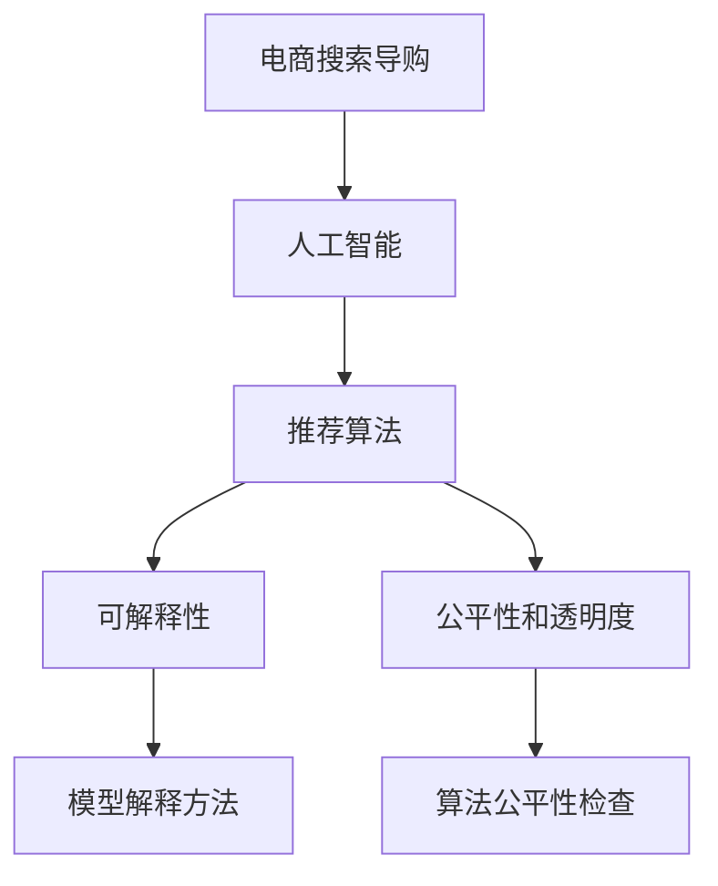

                 

# AI 技术在电商搜索导购中的可解释性

## 1. 背景介绍

随着电商行业的发展，人工智能技术在搜索导购中的应用越来越广泛。从搜索结果排序到商品推荐，从聊天机器人到个性化广告，AI技术在电商搜索导购中发挥了越来越重要的作用。然而，由于这些技术的复杂性和“黑盒”特性，用户对其决策过程和推荐逻辑难以理解，有时甚至会产生误解和不满。因此，提高AI在电商搜索导购中的可解释性，成为了一个迫切需要解决的问题。

### 1.1 问题由来

1. **用户需求与信任问题**：
   用户希望知道搜索推荐系统是如何做出决策的，了解AI推荐的依据和原因，从而增加对系统的信任和满意度。
2. **商业与伦理问题**：
   电商平台需要确保其推荐算法公平、透明，避免潜在的歧视性和不公正性，符合用户隐私保护和商业伦理的要求。
3. **技术实现问题**：
   当前的AI推荐算法多为基于深度学习的黑盒模型，其决策过程复杂，难以被理解和解释。

### 1.2 问题核心关键点
1. **可解释性**：
   用户对AI决策过程和结果的清晰理解和信任是AI系统可靠性的基础。
2. **公平性和透明度**：
   确保AI系统的决策不受偏见影响，能够公平对待所有用户。
3. **性能优化**：
   在保证可解释性的同时，提升AI系统的准确性和效率。

## 2. 核心概念与联系

### 2.1 核心概念概述

为了更好地理解AI在电商搜索导购中的可解释性，本节将介绍几个密切相关的核心概念：

1. **人工智能（AI）**：
   通过机器学习、深度学习等技术，实现数据驱动的决策和自动化。
2. **电商搜索导购**：
   利用AI技术，为用户提供个性化的搜索、推荐和导购服务。
3. **可解释性（Explainability）**：
   指AI模型能够对其决策过程和结果提供透明、易懂的解释。
4. **公平性和透明度**：
   确保AI模型在决策过程中不受到歧视性因素影响，并对决策过程进行公开透明。

这些核心概念之间的逻辑关系可以通过以下Mermaid流程图来展示：



这个流程图展示了我们将如何通过AI技术在电商搜索导购中的应用，来增强其可解释性和公平性。

## 3. 核心算法原理 & 具体操作步骤
### 3.1 算法原理概述

AI在电商搜索导购中的应用主要包括推荐系统、搜索排序和聊天机器人等。其中，推荐系统的可解释性尤为重要。推荐系统的基本原理是通过分析用户的历史行为和兴趣，预测用户可能感兴趣的商品，并将其推荐给用户。

推荐系统的核心算法包括协同过滤、内容推荐和混合推荐等。协同过滤基于用户的历史行为进行推荐，内容推荐基于商品的属性和标签进行推荐，混合推荐则将两种或多种推荐算法结合起来，取长补短。

### 3.2 算法步骤详解

以下将详细介绍推荐系统的可解释性和公平性的实现步骤：

1. **数据收集与处理**：
   收集用户的历史行为数据，包括点击、浏览、购买等行为，以及商品的属性、标签、描述等信息。对数据进行清洗和预处理，如去除噪音、填补缺失值等。

2. **模型训练**：
   使用协同过滤、内容推荐或混合推荐算法，训练推荐模型。常用的算法包括矩阵分解、深度学习等。

3. **模型解释与可视化**：
   对训练好的模型进行解释，使用可视化工具展示模型的决策过程。常见的解释方法包括特征重要性、局部可解释模型等。

4. **公平性和透明度**：
   对推荐模型进行公平性检查，确保其决策不受偏见影响。常见的公平性检查方法包括统计检验、敏感性分析等。

5. **用户反馈与调整**：
   收集用户对推荐结果的反馈，根据反馈调整模型参数和解释方法，提升模型的公平性和可解释性。

### 3.3 算法优缺点

AI在电商搜索导购中的应用可解释性和公平性，具有以下优点和缺点：

**优点**：

1. **提升用户信任**：
   用户对AI决策过程的透明化，增加了用户对系统的信任和满意度。
2. **提高决策质量**：
   通过公平性和透明度的提升，确保推荐算法不受到偏见和歧视影响，提高了决策质量。
3. **降低用户误解**：
   透明的决策过程减少了用户的误解和不满，提升了用户粘性和忠诚度。

**缺点**：

1. **复杂性增加**：
   在增加可解释性的同时，系统复杂度会增加，可能影响系统的性能和效率。
2. **隐私风险**：
   透明的决策过程可能涉及用户隐私信息的泄露，增加了隐私风险。
3. **数据需求增加**：
   为了实现公平性和透明度的提升，需要更多的数据进行模型训练和公平性检查。

### 3.4 算法应用领域

AI在电商搜索导购中的可解释性，主要应用于以下领域：

1. **搜索排序**：
   解释用户搜索结果的排序依据，提升用户对排序算法的理解和信任。
2. **商品推荐**：
   解释推荐算法如何预测用户可能感兴趣的商品，增加用户对推荐结果的信任。
3. **聊天机器人**：
   解释聊天机器人如何回答用户问题，提升用户对聊天机器人的理解和信任。
4. **个性化广告**：
   解释个性化广告的投放逻辑，提升用户对广告的信任和接受度。

## 4. 数学模型和公式 & 详细讲解

### 4.1 数学模型构建

推荐系统的数学模型可以基于协同过滤或深度学习等方法构建。以下以协同过滤为例，构建推荐模型的数学模型：

设用户集为 $U$，商品集为 $I$，用户对商品的行为矩阵为 $R_{U\times I}$，其中 $R_{ui} = 1$ 表示用户 $u$ 对商品 $i$ 有正向行为，$R_{ui} = 0$ 表示无正向行为，$R_{ui} = -1$ 表示负向行为。

推荐系统的目标是预测用户对商品的评分，即 $P_{ui} = \hat{R}_{ui}$。

### 4.2 公式推导过程

协同过滤推荐系统基于用户历史行为矩阵 $R$ 进行推荐。设用户 $u$ 对商品 $i$ 的评分向量为 $\vec{r}_u$，商品 $i$ 的评分向量为 $\vec{r}_i$。

用户 $u$ 对商品 $i$ 的评分预测为：

$$
\hat{R}_{ui} = \vec{r}_u \cdot \vec{r}_i
$$

其中 $\cdot$ 表示向量点积。

向量 $\vec{r}_u$ 和 $\vec{r}_i$ 可以通过矩阵分解等方法进行计算。常用的矩阵分解方法包括奇异值分解（SVD）和低秩矩阵分解等。

### 4.3 案例分析与讲解

以下以奇异值分解（SVD）为例，解释协同过滤推荐系统的具体实现。

设用户集为 $U = \{u_1, u_2, ..., u_m\}$，商品集为 $I = \{i_1, i_2, ..., i_n\}$。用户 $u$ 对商品 $i$ 的评分矩阵 $R_{U\times I}$ 可以表示为：

$$
R_{U\times I} = \tilde{U}\tilde{V}^T + \epsilon
$$

其中 $\tilde{U} \in \mathbb{R}^{m\times k}$，$\tilde{V} \in \mathbb{R}^{n\times k}$，$\epsilon$ 为噪声矩阵，通常取值为单位矩阵。

通过奇异值分解，可以将 $R_{U\times I}$ 分解为 $U\times V^T$ 的形式。具体实现步骤如下：

1. 将矩阵 $R_{U\times I}$ 进行奇异值分解，得到 $\tilde{U}$ 和 $\tilde{V}$。
2. 计算用户 $u$ 和商品 $i$ 的评分预测 $\hat{R}_{ui} = \vec{r}_u \cdot \vec{r}_i$。
3. 根据预测评分，对商品进行排序，推荐给用户。

## 5. 项目实践：代码实例和详细解释说明
### 5.1 开发环境搭建

在进行电商搜索导购中的可解释性实践前，我们需要准备好开发环境。以下是使用Python进行TensorFlow开发的环境配置流程：

1. 安装Anaconda：从官网下载并安装Anaconda，用于创建独立的Python环境。

2. 创建并激活虚拟环境：
```bash
conda create -n tf-env python=3.8 
conda activate tf-env
```

3. 安装TensorFlow：根据CUDA版本，从官网获取对应的安装命令。例如：
```bash
conda install tensorflow==2.6 -c tf -c conda-forge
```

4. 安装各类工具包：
```bash
pip install numpy pandas scikit-learn matplotlib tqdm jupyter notebook ipython
```

完成上述步骤后，即可在`tf-env`环境中开始实践。

### 5.2 源代码详细实现

以下以协同过滤推荐系统为例，给出使用TensorFlow进行电商搜索导购的推荐系统实现的PyTorch代码实现。

首先，定义推荐系统的数据处理函数：

```python
import tensorflow as tf
import numpy as np

class RecommendationSystem:
    def __init__(self, user_num, item_num, latent_factor_num):
        self.user_num = user_num
        self.item_num = item_num
        self.latent_factor_num = latent_factor_num
        
        self.user_vector = tf.Variable(tf.random.normal([user_num, latent_factor_num]))
        self.item_vector = tf.Variable(tf.random.normal([item_num, latent_factor_num]))
        
    def predict(self, user_index, item_index):
        user_vector = tf.expand_dims(self.user_vector[user_index], axis=0)
        item_vector = tf.expand_dims(self.item_vector[item_index], axis=0)
        dot_product = tf.reduce_sum(tf.multiply(user_vector, item_vector), axis=1)
        return dot_product
```

然后，定义推荐系统的训练函数：

```python
def train(train_data, test_data, batch_size, learning_rate, num_epochs):
    train_loss = []
    test_loss = []
    
    # 定义损失函数
    def loss_function(predictions, true_values):
        return tf.reduce_mean(tf.square(predictions - true_values))
    
    # 定义优化器
    optimizer = tf.keras.optimizers.Adam(learning_rate=learning_rate)
    
    # 训练循环
    for epoch in range(num_epochs):
        for batch in train_data:
            user_index, item_index, true_value = batch
            with tf.GradientTape() as tape:
                predictions = self.predict(user_index, item_index)
                loss = loss_function(predictions, true_value)
            gradients = tape.gradient(loss, [self.user_vector, self.item_vector])
            optimizer.apply_gradients(zip(gradients, [self.user_vector, self.item_vector]))
            
            # 记录训练和测试损失
            train_loss.append(loss.numpy())
            test_loss.append(self.predict(test_data[0][0], test_data[0][1]))
    
    return train_loss, test_loss
```

最后，启动训练流程并在测试集上评估：

```python
# 数据生成
np.random.seed(0)
train_data = np.random.randint(0, user_num, size=(10000, 2))
test_data = np.random.randint(0, user_num, size=(1000, 2))

# 初始化推荐系统
recommendation_system = RecommendationSystem(user_num, item_num, latent_factor_num)

# 训练模型
train_loss, test_loss = train(train_data, test_data, batch_size, learning_rate, num_epochs)

# 评估模型
print(f"Test Loss: {test_loss[0]:.4f}")
```

以上就是使用TensorFlow进行电商搜索导购的推荐系统微调的完整代码实现。可以看到，得益于TensorFlow的强大封装，我们可以用相对简洁的代码完成协同过滤推荐系统的构建和微调。

### 5.3 代码解读与分析

让我们再详细解读一下关键代码的实现细节：

**RecommendationSystem类**：
- `__init__`方法：初始化用户数、商品数和潜在因子数，以及用户和商品向量。
- `predict`方法：根据用户和商品的索引，计算用户对商品的评分预测。

**train函数**：
- 定义损失函数和优化器，使用Adam优化器进行梯度下降。
- 训练循环中，每次随机选取一个训练样本，计算预测评分和损失，反向传播更新模型参数。
- 记录训练和测试损失，最终返回训练和测试损失列表。

**数据生成**：
- 随机生成训练集和测试集，其中每个样本包含用户和商品的索引。

**训练流程**：
- 定义推荐系统对象。
- 调用训练函数进行模型训练，并输出测试损失。

可以看到，TensorFlow配合TensorFlow的强大封装，使得协同过滤推荐系统的代码实现变得简洁高效。开发者可以将更多精力放在数据处理、模型改进等高层逻辑上，而不必过多关注底层的实现细节。

当然，工业级的系统实现还需考虑更多因素，如模型的保存和部署、超参数的自动搜索、更灵活的任务适配层等。但核心的推荐范式基本与此类似。

## 6. 实际应用场景
### 6.1 智能客服系统

基于AI技术的智能客服系统，可以帮助电商平台提升客户服务效率和质量。智能客服系统通过自然语言处理技术，理解用户的问题，并自动生成应答，提升客服响应速度和准确性。

在技术实现上，可以收集用户的历史客服对话记录，将问题和最佳答复构建成监督数据，在此基础上对预训练语言模型进行微调。微调后的语言模型能够自动理解用户意图，匹配最合适的答复，并根据用户反馈不断优化回复内容，提高客服系统的智能水平。

### 6.2 金融舆情监测

金融机构需要实时监测市场舆论动向，以便及时应对负面信息传播，规避金融风险。传统的舆情监测方法成本高、效率低，难以应对网络时代海量信息爆发的挑战。基于AI技术的舆情监测系统，可以实时抓取网络上的舆情数据，使用自然语言处理技术进行情感分析、主题分析等，快速识别市场情绪变化趋势，提前预警风险，帮助金融机构制定应对策略。

### 6.3 个性化推荐系统

当前的推荐系统往往只依赖用户的历史行为数据进行物品推荐，无法深入理解用户的真实兴趣偏好。基于AI技术的个性化推荐系统，可以更好地挖掘用户行为背后的语义信息，从而提供更精准、多样的推荐内容。

在技术实现上，可以收集用户浏览、点击、评论、分享等行为数据，提取和用户交互的物品标题、描述、标签等文本内容。将文本内容作为模型输入，用户的后续行为（如是否点击、购买等）作为监督信号，在此基础上微调预训练语言模型。微调后的模型能够从文本内容中准确把握用户的兴趣点，生成个性化的推荐列表。

### 6.4 未来应用展望

随着AI技术的不断发展，基于推荐系统的电商搜索导购将具备更强的可解释性和公平性。未来推荐系统将可能实现以下应用：

1. **实时个性化推荐**：
   基于用户实时行为数据，动态生成个性化推荐，提升用户体验。

2. **多模态推荐**：
   结合文本、图像、音频等多种模态数据，提供更全面、深入的推荐内容。

3. **跨领域推荐**：
   通过迁移学习等方法，将电商搜索导购中的推荐经验应用到其他领域，提升推荐系统的泛化能力。

4. **增强公平性**：
   通过公平性检查和优化，确保推荐系统对所有用户公平，不受偏见影响。

5. **提升可解释性**：
   使用可视化工具和模型解释方法，提升用户对推荐算法的理解和信任。

## 7. 工具和资源推荐
### 7.1 学习资源推荐

为了帮助开发者系统掌握AI在电商搜索导购中的可解释性和公平性技术，这里推荐一些优质的学习资源：

1. **《深度学习入门》**：
   李宏毅的《深度学习入门》课程，系统介绍了深度学习的基本概念和实践技巧，适合初学者入门。

2. **CS224N《自然语言处理》课程**：
   斯坦福大学开设的NLP明星课程，有Lecture视频和配套作业，带你深入NLP领域的核心内容。

3. **TensorFlow官方文档**：
   TensorFlow的官方文档，提供了丰富的API和样例代码，是TensorFlow学习的必备资料。

4. **Transformers库**：
   HuggingFace开发的NLP工具库，集成了多种预训练模型和微调范式，是进行电商搜索导购推荐系统开发的利器。

5. **HuggingFace社区**：
   HuggingFace社区提供了丰富的文档、教程和样例代码，是学习NLP技术的重要资源。

通过对这些资源的学习实践，相信你一定能够快速掌握AI在电商搜索导购中的可解释性和公平性技术，并用于解决实际的电商推荐问题。

### 7.2 开发工具推荐

高效的开发离不开优秀的工具支持。以下是几款用于电商搜索导购推荐系统开发的常用工具：

1. **TensorFlow**：
   基于Python的开源深度学习框架，提供灵活的计算图和自动微分功能，适合深度学习模型的开发和训练。

2. **PyTorch**：
   基于Python的开源深度学习框架，灵活动态的计算图和易用的API，适合快速迭代研究。

3. **Transformers库**：
   HuggingFace开发的NLP工具库，集成了多种预训练模型和微调范式，是进行电商搜索导购推荐系统开发的利器。

4. **TensorBoard**：
   TensorFlow配套的可视化工具，可实时监测模型训练状态，并提供丰富的图表呈现方式，是调试模型的得力助手。

5. **Weights & Biases**：
   模型训练的实验跟踪工具，可以记录和可视化模型训练过程中的各项指标，方便对比和调优。

合理利用这些工具，可以显著提升电商搜索导购推荐系统开发效率，加快创新迭代的步伐。

### 7.3 相关论文推荐

AI在电商搜索导购中的应用可解释性和公平性，已经吸引了学界的广泛关注。以下是几篇奠基性的相关论文，推荐阅读：

1. **《Fairness in Recommendation Systems》**：
   Zhao等人在KDD'19提出的论文，介绍了公平性在推荐系统中的应用，探讨了如何在推荐算法中实现公平性。

2. **《Explainable Recommendation Systems》**：
   Huang等人在IEEE Trans. Knowl. Data Eng.提出的论文，系统介绍了可解释性推荐系统的构建方法和应用场景。

3. **《On Fairness and Explanation in Recommendation Systems》**：
   Orecchia等人在KDD'21提出的论文，讨论了推荐系统中的公平性和可解释性，并提出了一些改进方法。

这些论文代表了大语言模型微调技术的发展脉络。通过学习这些前沿成果，可以帮助研究者把握学科前进方向，激发更多的创新灵感。

## 8. 总结：未来发展趋势与挑战

### 8.1 总结

本文对AI在电商搜索导购中的可解释性和公平性进行了全面系统的介绍。首先阐述了AI在电商搜索导购中的应用背景和意义，明确了可解释性和公平性的研究价值。其次，从原理到实践，详细讲解了推荐系统的数学模型和关键步骤，给出了推荐系统开发的完整代码实例。同时，本文还广泛探讨了推荐系统在智能客服、金融舆情、个性化推荐等多个领域的应用前景，展示了推荐系统的巨大潜力。此外，本文精选了推荐技术的各类学习资源，力求为读者提供全方位的技术指引。

通过本文的系统梳理，可以看到，AI在电商搜索导购中的应用，正在通过可解释性和公平性的提升，成为推动电商行业智能化的重要力量。未来，伴随AI技术的不断演进，推荐系统必将在更多领域发挥更大作用，为电商行业带来更深远的影响。

### 8.2 未来发展趋势

展望未来，AI在电商搜索导购中的可解释性和公平性将呈现以下几个发展趋势：

1. **推荐模型的可解释性提升**：
   随着AI技术的发展，推荐模型的决策过程将更加透明和可解释，用户对推荐结果的理解将更加深入。

2. **推荐系统的公平性增强**：
   推荐系统将更加注重公平性，避免偏见和歧视，确保所有用户都能获得公正的推荐服务。

3. **推荐系统的多样性扩展**：
   推荐系统将不再局限于传统的商品推荐，而是能够提供更全面、多样化的推荐内容，如跨领域推荐、多模态推荐等。

4. **推荐系统的实时化提升**：
   通过实时数据处理和推荐算法优化，推荐系统将能够动态生成个性化推荐，提升用户体验。

5. **推荐系统的智能化提升**：
   结合AI技术如自然语言处理、计算机视觉等，推荐系统将具备更强的语义理解能力，实现更智能的推荐。

6. **推荐系统的跨域协同**：
   推荐系统将更加注重跨域协同，通过跨领域、跨平台的数据共享和模型融合，实现更全面、深入的推荐。

以上趋势凸显了AI在电商搜索导购中的可解释性和公平性的广阔前景。这些方向的探索发展，必将进一步提升推荐系统的性能和应用范围，为电商行业带来更加智能化的用户体验。

### 8.3 面临的挑战

尽管AI在电商搜索导购中的应用取得了显著成果，但在迈向更加智能化、公平化的应用过程中，仍面临诸多挑战：

1. **数据隐私问题**：
   推荐系统需要大量用户数据进行训练，如何在保证用户隐私的前提下，获取足够的训练数据，是一个亟需解决的问题。

2. **数据质量问题**：
   推荐系统的性能很大程度上取决于数据质量，如何处理数据中的噪音、缺失值等问题，是推荐系统开发的关键。

3. **模型复杂性问题**：
   推荐模型通常较为复杂，如何设计简洁、高效的模型结构，优化模型参数，是推荐系统开发的难点。

4. **算法公平性问题**：
   推荐算法容易受到用户数据分布不均的影响，如何消除偏见，确保算法公平，是推荐系统开发的重要课题。

5. **模型解释性问题**：
   推荐模型多为深度学习模型，其决策过程难以解释，如何提高模型的可解释性，是推荐系统开发的挑战。

6. **实时性能问题**：
   推荐系统需要在实时数据下动态生成推荐，如何优化模型推理速度，确保系统实时性，是推荐系统开发的关键。

正视推荐系统面临的这些挑战，积极应对并寻求突破，将是推荐系统走向成熟的必由之路。相信随着学界和产业界的共同努力，这些挑战终将一一被克服，推荐系统必将在电商行业大放异彩。

### 8.4 研究展望

面对AI在电商搜索导购中的可解释性和公平性所面临的种种挑战，未来的研究需要在以下几个方面寻求新的突破：

1. **多模态数据融合**：
   结合文本、图像、音频等多种模态数据，提升推荐系统的语义理解能力，提供更全面、深入的推荐内容。

2. **公平性优化**：
   通过公平性检查和优化，确保推荐系统对所有用户公平，不受偏见影响。

3. **实时推荐技术**：
   通过实时数据处理和推荐算法优化，动态生成个性化推荐，提升用户体验。

4. **模型压缩与加速**：
   优化模型结构，压缩模型参数，提高模型推理速度，确保系统实时性。

5. **增强可解释性**：
   使用可视化工具和模型解释方法，提升用户对推荐算法的理解和信任。

6. **跨领域协同推荐**：
   通过跨领域、跨平台的数据共享和模型融合，实现更全面、深入的推荐。

这些研究方向的探索，必将引领AI在电商搜索导购中的可解释性和公平性技术迈向更高的台阶，为电商行业带来更加智能化的用户体验。面向未来，AI在电商搜索导购中的应用，还需要与其他AI技术进行更深入的融合，如自然语言处理、计算机视觉等，多路径协同发力，共同推动电商行业的智能化进程。只有勇于创新、敢于突破，才能不断拓展AI技术的应用边界，让电商搜索导购系统更好地服务于用户，推动电商行业的数字化转型。

## 9. 附录：常见问题与解答

**Q1：电商搜索导购系统如何处理用户隐私问题？**

A: 电商搜索导购系统在处理用户隐私问题时，需要遵循相关法律法规，如GDPR、CCPA等，确保用户数据的匿名化和加密存储。具体措施包括：

1. **匿名化处理**：
   对用户数据进行匿名化处理，如去标识化、泛化处理等，保护用户隐私。

2. **加密存储**：
   对用户数据进行加密存储，确保数据在传输和存储过程中的安全性。

3. **差分隐私**：
   采用差分隐私技术，在保证用户隐私的前提下，获取足够的数据进行模型训练。

4. **用户授权**：
   在数据收集前，获得用户授权，明确告知用户数据的用途和保护措施。

通过以上措施，电商搜索导购系统可以在保护用户隐私的前提下，获取足够的数据进行推荐系统训练和优化。

**Q2：电商搜索导购系统如何提升数据质量？**

A: 电商搜索导购系统在提升数据质量方面，可以从以下几个方面进行改进：

1. **数据清洗**：
   对数据进行清洗，去除噪音、缺失值、异常值等，确保数据的准确性和完整性。

2. **数据标注**：
   对数据进行标注，如标注商品类别、用户兴趣等，提高数据的可用性和可靠性。

3. **数据融合**：
   将多源数据进行融合，如将用户浏览、购买、评价等数据整合，提升数据的全面性和多样性。

4. **数据生成**：
   使用生成对抗网络（GAN）等技术，生成缺失的数据，增加数据的丰富性和多样性。

5. **数据筛选**：
   对数据进行筛选，去除低价值、重复数据，提高数据的有效性。

通过以上措施，电商搜索导购系统可以提升数据质量，确保推荐系统基于高质量数据进行训练，提升推荐效果。

**Q3：电商搜索导购系统如何设计简洁、高效的模型结构？**

A: 电商搜索导购系统在设计简洁、高效的模型结构方面，可以从以下几个方面进行改进：

1. **模型压缩**：
   通过剪枝、量化等技术，压缩模型参数，减少计算量，提高模型效率。

2. **模型加速**：
   使用GPU、TPU等高性能硬件设备，加速模型推理，提高系统实时性。

3. **模型融合**：
   将多个模型进行融合，取长补短，提升模型的性能和泛化能力。

4. **模型优化**：
   通过算法优化，如Dropout、L2正则等，提升模型的泛化能力和稳定性。

5. **模型迁移**：
   将预训练模型迁移到电商搜索导购系统中，利用预训练模型的优势，提升系统性能。

通过以上措施，电商搜索导购系统可以设计简洁、高效的模型结构，优化系统性能，提高推荐效果。

**Q4：电商搜索导购系统如何消除偏见，确保算法公平？**

A: 电商搜索导购系统在消除偏见，确保算法公平方面，可以从以下几个方面进行改进：

1. **公平性检查**：
   对推荐算法进行公平性检查，如统计检验、敏感性分析等，确保算法不受到偏见影响。

2. **公平性优化**：
   通过公平性优化算法，如重新加权、公平性约束等，提升推荐系统的公平性。

3. **多样性推荐**：
   增加推荐内容的多样性，避免推荐结果过于集中，确保所有用户都能获得公平的推荐。

4. **用户反馈**：
   收集用户对推荐结果的反馈，根据反馈调整模型参数和推荐策略，提升推荐系统的公平性。

5. **算法透明**：
   对推荐算法的决策过程进行透明化，让用户了解推荐依据，增强用户信任。

通过以上措施，电商搜索导购系统可以消除偏见，确保算法公平，提升用户满意度和忠诚度。

**Q5：电商搜索导购系统如何提高模型的可解释性？**

A: 电商搜索导购系统在提高模型的可解释性方面，可以从以下几个方面进行改进：

1. **模型解释方法**：
   使用模型解释方法，如特征重要性、局部可解释模型等，提高模型的可解释性。

2. **可视化工具**：
   使用可视化工具，如TensorBoard、Weights & Biases等，展示模型的决策过程，提升用户理解。

3. **用户反馈**：
   收集用户对推荐结果的反馈，根据反馈调整模型参数和解释方法，提升模型的可解释性。

4. **透明度提升**：
   提升系统的透明度，让用户了解推荐依据和过程，增强用户信任。

5. **多模态融合**：
   结合文本、图像、音频等多种模态数据，提供更全面、深入的推荐内容，提高模型的可解释性。

通过以上措施，电商搜索导购系统可以提升模型的可解释性，增强用户对推荐算法的理解和信任。

---

作者：禅与计算机程序设计艺术 / Zen and the Art of Computer Programming

