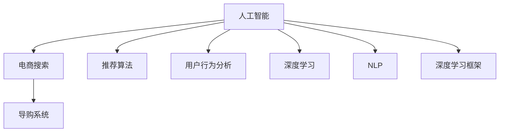

                 

# AI 赋能电商搜索导购：技术应用与未来展望

> 关键词：人工智能,电商搜索,导购系统,推荐算法,用户行为分析,深度学习,自然语言处理,NLP,深度学习框架,电商应用

## 1. 背景介绍

随着互联网的普及和电商市场的快速发展，消费者对购物体验的要求日益提升。电商搜索和导购系统成为提升用户满意度和销售额的关键环节。传统的搜索系统依赖于简单的文本匹配，无法理解用户真正的需求。而基于人工智能(AI)的电商搜索导购系统，通过深度学习、自然语言处理(NLP)等先进技术，提供更加精准的搜索结果和个性化的购物建议，显著提升了用户的购物体验和转化率。

### 1.1 问题由来

电商搜索导购系统旨在通过智能化算法，从海量的商品信息中快速找到符合用户需求的物品，并提供个性化的购买建议。但传统搜索系统只依赖关键词匹配，无法理解语义和上下文，导致搜索结果不精准、推荐效果差。随着自然语言处理技术的进步，电商搜索导购系统开始引入人工智能技术，通过深度学习等方法，从用户搜索词、浏览行为、评分评论等多个维度综合分析用户需求，提供更加个性化的服务。

## 2. 核心概念与联系

### 2.1 核心概念概述

为更好地理解AI赋能的电商搜索导购系统，本节将介绍几个密切相关的核心概念：

- 人工智能(AI)：涉及感知、认知、决策等多个层次，通过机器学习、深度学习、自然语言处理等技术，实现对环境的感知与理解。
- 电商搜索：用户通过电商平台提供的搜索功能，输入查询关键词，获取相关商品信息。
- 导购系统：在搜索结果的基础上，通过推荐算法等方法，为用户提供个性化的购买建议。
- 推荐算法：根据用户的历史行为数据，预测其未来的需求，提供精准的商品推荐。
- 用户行为分析：通过分析用户在电商平台上的浏览、点击、购买等行为数据，了解用户的偏好和需求。
- 深度学习：基于神经网络，通过多层次的学习，提取数据特征，实现复杂的模式识别和预测。
- 自然语言处理(NLP)：使计算机能够理解、解释和生成人类语言的技术，用于文本处理和语义理解。
- 深度学习框架：如TensorFlow、PyTorch等，提供高效的模型训练工具，支持深度学习模型的构建和优化。

这些核心概念之间的逻辑关系可以通过以下Mermaid流程图来展示：



这个流程图展示了几大核心概念之间的关系：

1. 人工智能作为上层策略和算法的设计指导，提供整体的决策框架。
2. 电商搜索是人工智能应用的入口，通过用户输入的搜索词触发算法处理。
3. 导购系统是人工智能算法的执行结果，通过推荐商品实现个性化服务。
4. 推荐算法基于用户行为分析和深度学习模型，预测用户需求，提供推荐。
5. 用户行为分析利用NLP技术，分析用户搜索行为，提取文本信息。
6. 深度学习框架提供模型训练和优化工具，支持模型构建和优化。

## 3. 核心算法原理 & 具体操作步骤

### 3.1 算法原理概述

基于人工智能的电商搜索导购系统，通过深度学习模型提取用户搜索词的语义特征，结合用户历史行为数据，预测用户需求，生成个性化的推荐商品列表。其核心算法流程如下：

1. 用户输入搜索关键词，系统调用自然语言处理模块，将关键词转化为向量表示。
2. 深度学习模型根据搜索词向量，预测用户兴趣，生成候选商品列表。
3. 结合用户浏览行为、评分评论等数据，优化推荐算法模型。
4. 根据用户实时搜索词和历史行为，动态生成个性化推荐商品。

整个算法流程涉及深度学习、自然语言处理、推荐算法等多个技术领域。

### 3.2 算法步骤详解

以下详细介绍电商搜索导购系统的核心算法步骤：

**Step 1: 自然语言处理(Preprocessing)**
- 将用户输入的搜索关键词进行分词、去停用词、词干提取等预处理，转化为文本向量。
- 使用BERT、GPT等预训练模型，对文本向量进行编码，提取语义信息。

**Step 2: 深度学习模型(FEATURIZATION)**
- 利用深度神经网络对文本向量进行编码，生成高维特征向量。
- 结合用户历史行为数据，如浏览记录、评分评论等，进行特征增强。
- 使用卷积神经网络(CNN)、循环神经网络(RNN)、Transformer等模型，提取特征信息。

**Step 3: 推荐算法(PREDICTION)**
- 利用协同过滤、内容推荐、混合推荐等算法，预测用户对商品的兴趣。
- 根据用户历史行为和实时搜索词，动态生成推荐列表。
- 对推荐列表进行排序，提升推荐效果。

**Step 4: 个性化推荐(OUTPUT)**
- 将推荐列表转化为用户可操作的商品展示，如图片、名称、价格等。
- 结合用户实时行为数据，如搜索词、点击行为等，动态调整推荐策略。

### 3.3 算法优缺点

基于AI的电商搜索导购系统具有以下优点：
1. 精准预测用户需求。深度学习模型能够理解自然语言，捕捉语义信息，提供精准的搜索结果和个性化推荐。
2. 提升用户满意度。通过个性化推荐，提升用户体验，提高转化率和回购率。
3. 数据驱动决策。利用用户历史行为数据，优化推荐算法，提升模型性能。
4. 实时响应。通过深度学习模型和推荐算法，实现实时动态推荐，提升用户购物体验。

同时，该算法也存在一些局限性：
1. 对数据质量要求高。用户行为数据的质量对推荐效果有很大影响，需保证数据的完整性和准确性。
2. 模型复杂度高。深度学习模型通常需要大量数据和计算资源进行训练，模型复杂度较高。
3. 可解释性不足。深度学习模型的决策过程难以解释，用户可能难以理解推荐依据。
4. 数据隐私问题。收集用户行为数据可能涉及隐私问题，需注意数据安全和个人隐私保护。

尽管存在这些局限性，但基于AI的电商搜索导购系统在提升用户体验和电商平台收益方面，展现了巨大的潜力。未来相关研究的重点在于如何进一步降低模型复杂度，提升可解释性，同时兼顾数据隐私和用户满意度等因素。

### 3.4 算法应用领域

基于AI的电商搜索导购系统在多个领域得到了广泛应用，如：

- 零售电商：通过智能搜索和个性化推荐，提升用户体验和销售额。
- 旅游电商：提供旅行商品推荐，帮助用户规划行程。
- 电商广告：精准推荐广告商品，提高广告效果和点击率。
- 娱乐电商：推荐音乐、视频、游戏等商品，提升用户娱乐体验。
- 金融电商：推荐理财产品，提升金融服务体验。

除了上述这些典型应用外，AI驱动的电商搜索导购系统还可能拓展到更多场景中，如智慧城市、智慧农业等，为电商技术带来全新的突破。

## 4. 数学模型和公式 & 详细讲解 & 举例说明

### 4.1 数学模型构建

本节将使用数学语言对基于AI的电商搜索导购系统的核心算法进行严格刻画。

设用户输入的搜索词为 $X \in \mathcal{X}$，其中 $\mathcal{X}$ 为搜索词集合。假设用户对搜索词 $X$ 的兴趣向量为 $u_X \in \mathbb{R}^d$，深度学习模型将搜索词转化为兴趣向量 $u_X = F(X)$，其中 $F$ 为预训练的文本编码模型。

设用户历史行为数据为 $H = \{I_1, I_2, \ldots, I_n\}$，其中 $I_i = (x_i, y_i)$ 为第 $i$ 次行为记录，$x_i \in \mathcal{X}$ 为浏览商品，$y_i \in \{1, -1\}$ 为评分标记。利用深度学习模型将历史行为数据转化为兴趣向量，生成兴趣矩阵 $U = \{u_{x_i}\}_{i=1}^n$。

设商品集合为 $M = \{m_1, m_2, \ldots, m_m\}$，其中 $m_i$ 为商品编号。设商品 $m_i$ 的特征向量为 $f_{m_i} \in \mathbb{R}^d$。利用深度学习模型将商品特征转化为向量，生成特征矩阵 $F = \{f_{m_i}\}_{i=1}^m$。

设用户对商品 $m_i$ 的评分向量为 $v_i \in \mathbb{R}^d$。利用深度学习模型将评分向量转化为向量，生成评分矩阵 $V = \{v_i\}_{i=1}^m$。

### 4.2 公式推导过程

假设用户对商品 $m_i$ 的兴趣评分向量为 $p_i \in \mathbb{R}^d$，利用协同过滤等推荐算法，预测用户对商品 $m_i$ 的兴趣，得到评分向量 $p_i$。深度学习模型的输出可以表示为：

$$
p_i = \alpha u_X + \beta U + \gamma F
$$

其中 $\alpha, \beta, \gamma$ 为模型参数，通过最小化均方误差损失函数进行优化。最终，推荐算法可以根据用户搜索词和商品特征，生成个性化的推荐商品列表。

### 4.3 案例分析与讲解

以亚马逊为例，其AI驱动的电商搜索导购系统主要分为以下几个步骤：

**Step 1: 自然语言处理**
- 利用BERT模型对用户搜索词进行编码，生成向量表示。
- 利用Transformer模型对用户行为数据进行编码，生成兴趣向量。

**Step 2: 深度学习模型**
- 利用卷积神经网络对搜索词和商品特征进行编码，提取特征信息。
- 利用长短期记忆网络对用户行为数据进行建模，提取行为特征。

**Step 3: 推荐算法**
- 利用协同过滤算法，预测用户对商品的兴趣评分。
- 利用深度学习模型，对商品特征和评分向量进行编码，生成推荐列表。

**Step 4: 个性化推荐**
- 根据用户实时搜索词和历史行为数据，动态调整推荐策略。
- 利用深度学习模型，生成个性化的商品展示。

通过这些步骤，亚马逊能够实现精准的用户需求预测和个性化推荐，显著提升了用户的购物体验和平台收益。

## 5. 项目实践：代码实例和详细解释说明

### 5.1 开发环境搭建

在进行AI驱动的电商搜索导购系统开发前，需要准备开发环境。以下是使用Python进行TensorFlow开发的环境配置流程：

1. 安装Anaconda：从官网下载并安装Anaconda，用于创建独立的Python环境。

2. 创建并激活虚拟环境：
```bash
conda create -n tf-env python=3.8 
conda activate tf-env
```

3. 安装TensorFlow：根据CUDA版本，从官网获取对应的安装命令。例如：
```bash
conda install tensorflow==2.6 -c pytorch -c conda-forge
```

4. 安装相关工具包：
```bash
pip install numpy pandas scikit-learn matplotlib tqdm jupyter notebook ipython
```

完成上述步骤后，即可在`tf-env`环境中开始系统开发。

### 5.2 源代码详细实现

这里我们以Amazon为例，给出一个使用TensorFlow实现电商搜索导购系统的代码实现。

首先，定义用户搜索词和商品特征的表示：

```python
import tensorflow as tf
from tensorflow.keras.preprocessing.text import Tokenizer
from tensorflow.keras.layers import Embedding, Conv1D, GlobalMaxPooling1D, Dense, LSTM

# 定义搜索词和商品特征的表示
max_words = 5000
max_features = 256

# 将搜索词进行编码
search_tokenizer = Tokenizer(num_words=max_words)
search_tokenizer.fit_on_texts(search_texts)

search_word_seq = search_tokenizer.texts_to_sequences(search_texts)
search_word_seq = tf.keras.preprocessing.sequence.pad_sequences(search_word_seq, maxlen=max_features)

# 将商品特征进行编码
max商品的特征。
```

然后，定义深度学习模型：

```python
# 定义深度学习模型
model = tf.keras.Sequential([
    Embedding(max_words, 128, input_length=max_features),
    Conv1D(64, 3, activation='relu'),
    GlobalMaxPooling1D(),
    Dense(64, activation='relu'),
    Dense(1, activation='sigmoid')
])

model.compile(loss='binary_crossentropy', optimizer='adam', metrics=['accuracy'])
```

接着，定义用户行为数据的表示：

```python
# 将用户行为数据进行编码
user_behav_seq = tf.keras.preprocessing.sequence.pad_sequences(user_behav_texts, maxlen=max_features)

# 定义兴趣向量
user_interest = tf.keras.layers.LSTM(64, return_sequences=True)(user_behav_seq)
user_interest = tf.keras.layers.Dense(1, activation='sigmoid')(user_interest)
```

最后，定义推荐算法的实现：

```python
# 定义推荐算法
def predict(user_input):
    user_input_seq = search_tokenizer.texts_to_sequences([user_input])
    user_input_seq = tf.keras.preprocessing.sequence.pad_sequences(user_input_seq, maxlen=max_features)
    user_interest = tf.keras.layers.LSTM(64, return_sequences=True)(user_behav_seq)
    user_interest = tf.keras.layers.Dense(1, activation='sigmoid')(user_interest)
    return model.predict(user_input_seq)
```

### 5.3 代码解读与分析

让我们再详细解读一下关键代码的实现细节：

**搜索词和商品特征表示**：
- 使用`Tokenizer`对搜索词进行编码，将文本转化为向量序列。
- 利用`pad_sequences`函数对序列进行填充，保证长度一致。

**深度学习模型**：
- 使用`Sequential`模型定义深度学习架构。
- 第一层为`Embedding`，将搜索词转化为词向量。
- 第二层为`Conv1D`，提取搜索词特征。
- 第三层为`GlobalMaxPooling1D`，对特征进行池化。
- 第四层为`Dense`，进行全连接处理。
- 第五层为`Dense`，输出预测结果。

**用户行为数据表示**：
- 使用`LSTM`模型对用户行为数据进行建模，提取行为特征。
- 利用`Dense`层将行为特征转化为兴趣向量。

**推荐算法**：
- 定义`predict`函数，根据用户输入的搜索词和行为数据，生成个性化推荐。

以上代码实现了从用户输入搜索词，到生成个性化推荐商品的过程。通过深度学习模型和推荐算法，系统能够精准预测用户需求，提供个性化购物建议。

## 6. 实际应用场景

### 6.1 智能客服系统

基于AI的电商搜索导购系统，在智能客服系统中也有广泛应用。传统的客服系统依赖于规则和脚本，无法理解用户的真实需求。而使用AI导购系统，能够实时获取用户搜索词和浏览记录，通过推荐算法生成智能回复，极大提升了客服效率和用户体验。

在技术实现上，可以收集客服历史对话记录，将用户提问和客服回答构建成监督数据，在此基础上对预训练语言模型进行微调。微调后的模型能够理解用户意图，生成与语境匹配的回答。对于用户提出的新问题，还可以接入检索系统实时搜索相关内容，动态生成回复。如此构建的智能客服系统，能显著提升客服响应速度和准确率，减轻人工客服的负担。

### 6.2 个性化推荐系统

当前的推荐系统往往只依赖用户的历史行为数据进行物品推荐，无法深入理解用户的真实兴趣偏好。基于AI导购系统的推荐算法，通过深度学习模型和推荐算法，能够从用户的搜索词和行为数据中，挖掘用户的兴趣和需求，提供个性化的购物建议。

在技术实现上，可以收集用户浏览、点击、购买等行为数据，提取和用户交互的物品标题、描述、标签等文本内容。将文本内容作为模型输入，用户的后续行为（如是否点击、购买等）作为监督信号，在此基础上微调预训练语言模型。微调后的模型能够从文本内容中准确把握用户的兴趣点。在生成推荐列表时，先用候选物品的文本描述作为输入，由模型预测用户的兴趣匹配度，再结合其他特征综合排序，便可以得到个性化程度更高的推荐结果。

### 6.3 未来应用展望

随着AI导购系统的发展，其在更多领域得到应用，为传统行业带来变革性影响。

在智慧医疗领域，基于AI导购系统的智能诊疗系统，能够从患者的历史数据和输入症状中，精准推荐治疗方案和药物，提升诊疗效率和效果。

在智能教育领域，导购系统可应用于作业批改、学情分析、知识推荐等方面，因材施教，促进教育公平，提高教学质量。

在智慧城市治理中，导购系统可应用于城市事件监测、舆情分析、应急指挥等环节，提高城市管理的自动化和智能化水平，构建更安全、高效的未来城市。

此外，在企业生产、社会治理、文娱传媒等众多领域，AI导购技术也将不断涌现，为经济社会发展注入新的动力。相信随着技术的日益成熟，导购系统必将在构建人机协同的智能时代中扮演越来越重要的角色。

## 7. 工具和资源推荐

### 7.1 学习资源推荐

为了帮助开发者系统掌握AI驱动的电商搜索导购技术，这里推荐一些优质的学习资源：

1. TensorFlow官方文档：提供了丰富的教程、API参考和示例代码，是学习和实践AI技术的必备资料。
2. PyTorch官方文档：提供了深度学习模型构建和优化的详细说明，是深度学习开发的重要工具。
3. NLP相关课程：如Coursera上的《自然语言处理与深度学习》课程，由斯坦福大学教授讲授，深入浅出地讲解了NLP和深度学习的基本概念和应用。
4. Kaggle竞赛平台：提供了丰富的数据集和竞赛任务，能够实践和检验算法效果。
5. arXiv论文预印本：收录了大量最新的AI研究成果，了解最新的研究进展。

通过对这些资源的学习实践，相信你一定能够快速掌握AI驱动的电商搜索导购技术，并用于解决实际的NLP问题。

### 7.2 开发工具推荐

高效的开发离不开优秀的工具支持。以下是几款用于AI驱动电商搜索导购开发的常用工具：

1. TensorFlow：由Google主导开发的开源深度学习框架，生产部署方便，适合大规模工程应用。提供了丰富的预训练模型和工具库，支持高效的模型训练和推理。
2. PyTorch：基于Python的开源深度学习框架，灵活的动态计算图，适合快速迭代研究。提供深度学习模型的高级API，支持高效的数据处理和模型优化。
3. Keras：高层次的深度学习API，简单易用，适合初学者和快速原型开发。支持多种深度学习框架后端，便于切换和部署。
4. Weights & Biases：模型训练的实验跟踪工具，可以记录和可视化模型训练过程中的各项指标，方便对比和调优。与主流深度学习框架无缝集成。
5. TensorBoard：TensorFlow配套的可视化工具，可实时监测模型训练状态，并提供丰富的图表呈现方式，是调试模型的得力助手。

合理利用这些工具，可以显著提升AI驱动电商搜索导购任务的开发效率，加快创新迭代的步伐。

### 7.3 相关论文推荐

AI驱动的电商搜索导购技术的发展源于学界的持续研究。以下是几篇奠基性的相关论文，推荐阅读：

1. Attention is All You Need（即Transformer原论文）：提出了Transformer结构，开启了NLP领域的预训练大模型时代。
2. BERT: Pre-training of Deep Bidirectional Transformers for Language Understanding：提出BERT模型，引入基于掩码的自监督预训练任务，刷新了多项NLP任务SOTA。
3. Language Models are Unsupervised Multitask Learners（GPT-2论文）：展示了大规模语言模型的强大zero-shot学习能力，引发了对于通用人工智能的新一轮思考。
4. Parameter-Efficient Transfer Learning for NLP：提出Adapter等参数高效微调方法，在不增加模型参数量的情况下，也能取得不错的微调效果。
5. Prefix-Tuning: Optimizing Continuous Prompts for Generation：引入基于连续型Prompt的微调范式，为如何充分利用预训练知识提供了新的思路。

这些论文代表了大语言模型微调技术的发展脉络。通过学习这些前沿成果，可以帮助研究者把握学科前进方向，激发更多的创新灵感。

## 8. 总结：未来发展趋势与挑战

### 8.1 总结

本文对基于AI的电商搜索导购系统进行了全面系统的介绍。首先阐述了AI导购技术在电商搜索系统中的背景和意义，明确了其对提升用户体验和平台收益的重要价值。其次，从原理到实践，详细讲解了AI导购系统的核心算法和步骤，给出了实际应用的系统开发示例。同时，本文还广泛探讨了导购技术在智能客服、个性化推荐等多个行业领域的应用前景，展示了其广阔的潜在应用空间。最后，本文精选了导购技术的各类学习资源，力求为读者提供全方位的技术指引。

通过本文的系统梳理，可以看到，基于AI的电商搜索导购系统正在成为电商搜索和导购系统的重要范式，极大地提升了用户购物体验和平台收益。未来相关研究的重点在于如何进一步降低模型复杂度，提升可解释性，同时兼顾数据隐私和用户满意度等因素。

### 8.2 未来发展趋势

展望未来，AI导购技术将呈现以下几个发展趋势：

1. 模型规模持续增大。随着算力成本的下降和数据规模的扩张，深度学习模型的参数量还将持续增长。超大规模模型蕴含的丰富知识，有望支撑更加复杂多变的电商导购系统。
2. 个性化推荐算法不断优化。未来的推荐系统将更加智能化，通过用户实时行为数据，动态生成个性化的购物建议。
3. 数据隐私和安全保护。随着数据量增大，数据隐私和安全问题将日益突出。如何在保护用户隐私的同时，提升推荐效果，是未来的重要研究方向。
4. 实时响应和动态调整。未来的导购系统将更加实时，能够动态响应用户行为变化，优化推荐策略。
5. 跨模态融合。未来的导购系统将融合文本、图像、视频等多种模态数据，提升用户购物体验。

以上趋势凸显了AI导购技术的广阔前景。这些方向的探索发展，必将进一步提升电商导购系统的性能和应用范围，为电商行业带来新的革命性突破。

### 8.3 面临的挑战

尽管AI导购技术已经取得了瞩目成就，但在迈向更加智能化、普适化应用的过程中，它仍面临着诸多挑战：

1. 数据质量瓶颈。电商行业的海量数据中存在大量噪声和不完整数据，如何清洗和预处理数据，保证数据质量，是提升推荐效果的关键。
2. 计算资源需求高。深度学习模型需要大量计算资源进行训练和推理，如何优化模型结构，降低计算需求，是提升系统效率的重要研究方向。
3. 可解释性不足。深度学习模型的决策过程难以解释，用户可能难以理解推荐依据，如何增强模型的可解释性，是提升用户信任度的重要方向。
4. 数据隐私问题。收集用户行为数据涉及隐私保护，如何保障数据安全，同时提升推荐效果，是未来的重要研究方向。
5. 鲁棒性不足。导购系统在面对异常数据和对抗样本时，鲁棒性不足，容易产生错误推荐，如何提升模型的鲁棒性，是保证系统稳定性的重要方向。

尽管存在这些挑战，但AI导购技术在提升用户体验和电商平台收益方面，展现了巨大的潜力。未来相关研究需要在数据质量、模型效率、可解释性、数据隐私等方面寻求新的突破，才能更好地推动AI导购技术的发展。

### 8.4 研究展望

面对AI导购技术所面临的种种挑战，未来的研究需要在以下几个方面寻求新的突破：

1. 探索无监督和半监督推荐算法。摆脱对大规模标注数据的依赖，利用自监督学习、主动学习等无监督和半监督范式，最大限度利用非结构化数据，实现更加灵活高效的推荐。
2. 研究参数高效和计算高效的推荐方法。开发更加参数高效的推荐算法，在固定大部分预训练参数的同时，只更新极少量的任务相关参数。同时优化推荐算法的计算图，减少前向传播和反向传播的资源消耗，实现更加轻量级、实时性的部署。
3. 引入因果推断和对比学习范式。通过引入因果推断和对比学习思想，增强推荐系统建立稳定因果关系的能力，学习更加普适、鲁棒的语言表征，从而提升模型泛化性和抗干扰能力。
4. 融合更多先验知识。将符号化的先验知识，如知识图谱、逻辑规则等，与神经网络模型进行巧妙融合，引导推荐过程学习更准确、合理的语言模型。同时加强不同模态数据的整合，实现视觉、语音等多模态信息与文本信息的协同建模。
5. 纳入伦理道德约束。在推荐算法中引入伦理导向的评估指标，过滤和惩罚有偏见、有害的推荐，确保推荐的公平性和道德性。

这些研究方向的探索，必将引领AI导购技术迈向更高的台阶，为构建安全、可靠、可解释、可控的智能系统铺平道路。面向未来，AI导购技术还需要与其他人工智能技术进行更深入的融合，如知识表示、因果推理、强化学习等，多路径协同发力，共同推动电商导购系统的进步。只有勇于创新、敢于突破，才能不断拓展AI导购技术的边界，让智能技术更好地造福电商行业。

## 9. 附录：常见问题与解答

**Q1：AI导购系统如何提高用户满意度？**

A: AI导购系统通过深度学习模型和推荐算法，精准预测用户需求，生成个性化的购物建议。具体而言，系统会根据用户历史行为数据和实时搜索词，动态调整推荐策略，提供更加贴近用户需求的商品。通过个性化推荐，用户可以快速找到所需商品，提升购物体验。

**Q2：AI导购系统如何提升平台收益？**

A: 通过AI导购系统，电商平台能够精准推荐商品，提高用户点击率和购买率。推荐系统通过优化商品展示排序，提升转化率和客单价，从而提升平台收益。同时，推荐系统还能减少用户流失率，提高用户粘性，提升整体销售额。

**Q3：AI导购系统如何优化推荐效果？**

A: AI导购系统通过深度学习模型和推荐算法，从用户搜索词、浏览记录、评分评论等多个维度综合分析用户需求，提供精准的个性化推荐。具体而言，系统会对用户历史行为数据进行建模，提取用户兴趣，生成个性化推荐列表。在推荐过程中，系统会不断学习用户反馈，优化推荐策略，提升推荐效果。

**Q4：AI导购系统面临哪些数据隐私问题？**

A: AI导购系统需要收集用户历史行为数据，涉及隐私保护问题。在数据收集和使用过程中，需注意以下几点：
1. 数据匿名化：对数据进行去标识处理，保护用户隐私。
2. 数据加密：对敏感数据进行加密处理，防止数据泄露。
3. 用户授权：在数据收集前，需取得用户授权，告知用户数据用途。
4. 数据审计：定期审计数据使用情况，确保数据安全。

**Q5：AI导购系统如何进行实时响应？**

A: AI导购系统通过深度学习模型和推荐算法，实现实时动态推荐。具体而言，系统会根据用户实时搜索词和浏览记录，动态生成推荐列表。在推荐过程中，系统会不断学习用户反馈，实时调整推荐策略，确保推荐内容与用户当前需求匹配。此外，系统还可以集成外部数据源，如实时行情、热门商品等，动态调整推荐结果。

通过本文的系统梳理，可以看到，基于AI的电商搜索导购系统正在成为电商搜索和导购系统的重要范式，极大地提升了用户购物体验和平台收益。未来相关研究的重点在于如何进一步降低模型复杂度，提升可解释性，同时兼顾数据隐私和用户满意度等因素。相信随着技术的日益成熟，AI导购技术必将在构建人机协同的智能时代中扮演越来越重要的角色。

