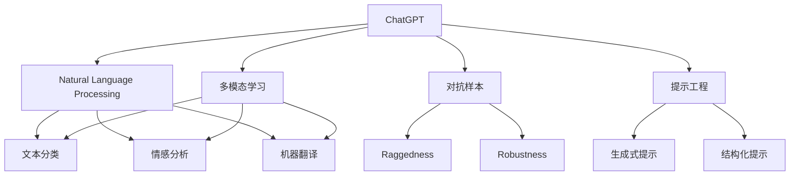

                 

# AIGC从入门到实战：AI 辅助写作：基于 ChatGPT 的自动创作和文本扩展

> 关键词：人工智能生成内容(AIGC), ChatGPT, 自动创作, 文本扩展, 提示工程, 模型微调, 性能优化, 创作助剂, 智能辅助, 自然语言处理(NLP)

## 1. 背景介绍

### 1.1 问题由来

人工智能生成内容(AIGC, Artificial Intelligence Generated Content)是指利用AI技术自动生成高质量文本、图片、视频等多媒体内容的技术。近年来，随着深度学习和大模型的快速发展，AIGC技术逐渐成熟，在新闻编辑、内容创作、教育培训等领域取得了显著应用。

AI辅助写作作为AIGC的重要应用方向之一，指的是利用AI技术帮助人类进行内容创作和文本扩展。该技术可以帮助撰写新闻稿件、分析文章结构、生成草稿、校对等，极大提高了内容创作的效率和质量。

ChatGPT（全称为Generative Pre-trained Transformer，即生成式预训练Transformer）作为OpenAI开发的一款先进语言模型，以其强大的自然语言理解和生成能力，迅速在内容创作、智能对话、教育辅助等领域得到广泛应用。本文将从ChatGPT入手，探讨其自动创作和文本扩展的原理、实现方法及实际应用场景。

### 1.2 问题核心关键点

ChatGPT基于Transformer架构，通过在大规模无标签文本数据上进行自监督预训练，学习到丰富的语言知识和语义关系。该模型在自然语言理解和生成方面具有显著优势，能够根据输入的文本生成连续的、连贯的文本，并进行文本扩展、纠错、翻译等操作。

1. **预训练与微调**：ChatGPT首先在大规模无标签数据上进行预训练，然后在特定任务上进行微调，以适应具体任务需求。
2. **提示工程**：通过精心设计的提示模板，引导ChatGPT生成特定的文本内容。
3. **参数高效微调**：仅微调少量的模型参数，保留大部分预训练权重，以减少计算资源消耗。
4. **对抗训练**：加入对抗样本，提高ChatGPT模型的鲁棒性和泛化能力。
5. **多模态扩展**：除了文本创作，ChatGPT还可以通过视觉、语音等多模态数据进行扩展，提升创作的多样性和灵活性。

这些核心关键点构成了ChatGPT自动创作和文本扩展的实现基础，使得其能够在各种场景下发挥强大的生成能力。

### 1.3 问题研究意义

研究ChatGPT的自动创作和文本扩展技术，对于提升内容创作的效率和质量，拓展其应用范围，具有重要意义：

1. **降低创作成本**：通过AI辅助，大幅减少人力投入，提高内容创作效率。
2. **提升创作质量**：AI能够提供精准的结构分析、语法检查和内容生成，保证内容的质量和一致性。
3. **加速创作流程**：AI可以辅助撰写草稿、提供灵感、进行内容扩展，加速创作流程。
4. **丰富创作形式**：多模态扩展技术使得AI不仅限于文本创作，可以应用于视觉内容、音频内容等，拓展创作形式。
5. **提升创作多样性**：AI能够快速生成多种风格和体裁的内容，增强创作的多样性和创新性。

ChatGPT作为AIGC领域的翘楚，其自动创作和文本扩展技术将为内容创作带来新的可能，推动内容创作产业的变革。

## 2. 核心概念与联系

### 2.1 核心概念概述

为更好地理解ChatGPT的自动创作和文本扩展技术，本节将介绍几个密切相关的核心概念：

- **ChatGPT**：基于Transformer架构的大规模预训练语言模型，具有强大的自然语言理解和生成能力，能够在多轮对话中生成连贯、流畅的文本。
- **自然语言处理(NLP)**：研究计算机如何理解和处理人类语言的技术，包括文本分类、情感分析、机器翻译等任务。
- **多模态学习**：结合文本、图像、语音等多源数据，提升模型的泛化能力和应用范围。
- **对抗样本**：有意添加的小扰动，用于测试模型的鲁棒性和泛化能力。
- **提示工程**：设计合适的输入格式和模板，引导模型生成特定的输出。

这些核心概念之间的逻辑关系可以通过以下Mermaid流程图来展示：



这个流程图展示了ChatGPT与NLP、多模态学习、对抗样本和提示工程等概念之间的联系。通过这些概念的整合，ChatGPT能够更好地应用于文本创作、多模态扩展和生成任务。

## 3. 核心算法原理 & 具体操作步骤
### 3.1 算法原理概述

ChatGPT的自动创作和文本扩展基于Transformer模型架构，通过在大规模无标签文本数据上进行自监督预训练，学习到丰富的语言知识和语义关系。该模型利用Transformer的自注意力机制，能够捕捉输入序列中的长距离依赖关系，生成连续、连贯的文本。

在文本扩展任务中，ChatGPT通常以一段文本作为输入，然后根据输入文本生成一段新的文本，使得生成的文本在语义上与输入文本相一致，并具有一定的连贯性和流畅性。ChatGPT的具体实现流程如下：

1. **预训练**：在大规模无标签文本数据上进行预训练，学习语言知识和语义关系。
2. **微调**：在特定任务的数据集上进行微调，适应具体任务需求。
3. **输入处理**：将输入文本转换为模型能够处理的格式。
4. **生成过程**：根据输入文本生成一段新的文本。
5. **后处理**：对生成的文本进行后处理，如语法检查、格式调整等。

通过以上流程，ChatGPT能够高效地进行文本扩展，提升内容创作的效率和质量。

### 3.2 算法步骤详解

基于ChatGPT的自动创作和文本扩展算法主要包括以下步骤：

**Step 1: 准备数据集**

1. **预训练数据集**：准备一个大规模的无标签文本数据集，用于ChatGPT的预训练。
2. **微调数据集**：准备一个与具体任务相关的标注数据集，用于ChatGPT的微调。

**Step 2: 设计提示模板**

1. **生成式提示**：设计一个引导模型生成文本的提示模板，如“请继续以下内容”。
2. **结构化提示**：设计一个帮助模型构建文本结构的提示模板，如“将以下列表转换为段落”。
3. **多模态提示**：设计一个融合多源数据的提示模板，如“将以下图片描述转换为文字”。

**Step 3: 微调ChatGPT**

1. **选择合适的优化器**：如Adam、AdamW等，设置学习率、批大小等超参数。
2. **数据增强**：通过回译、正则化等方式扩充训练集。
3. **对抗训练**：加入对抗样本，提高模型的鲁棒性。
4. **参数高效微调**：仅微调少量的模型参数，保留大部分预训练权重不变。
5. **模型保存**：在训练过程中定期保存模型，防止模型过拟合。

**Step 4: 自动创作和文本扩展**

1. **输入文本处理**：将输入文本转换为模型能够处理的格式，如分词、编码等。
2. **模型输入**：将处理后的输入文本输入到ChatGPT中。
3. **生成文本**：根据输入文本生成一段新的文本，返回模型的输出。
4. **后处理**：对生成的文本进行后处理，如去除噪声、格式调整等。

**Step 5: 应用部署**

1. **部署模型**：将训练好的模型部署到服务器或API服务中，供其他应用系统调用。
2. **接口设计**：设计简单易用的API接口，供开发者调用。
3. **性能监控**：实时监控模型的性能指标，如响应时间、准确率等。
4. **用户反馈**：收集用户反馈，不断优化模型和提示模板。

### 3.3 算法优缺点

基于ChatGPT的自动创作和文本扩展算法具有以下优点：

1. **高效生成**：ChatGPT能够快速生成高质量文本，大幅提升内容创作的效率。
2. **灵活性高**：通过精心设计的提示模板，ChatGPT能够适应多种文本扩展任务。
3. **可解释性**：通过提示模板，ChatGPT的生成过程具有较高的可解释性。
4. **模型鲁棒性**：通过对抗训练，ChatGPT的鲁棒性和泛化能力显著提升。

同时，该算法也存在一定的局限性：

1. **依赖提示模板**：提示模板的设计需要一定的经验和技巧，设计不当可能导致生成效果不佳。
2. **语义一致性**：生成的文本可能与输入文本的语义不一致，需要人工干预和修正。
3. **对抗攻击**：生成的文本可能受到对抗样本的影响，产生错误或不适当的输出。
4. **计算资源消耗**：大规模的模型和大规模的数据集训练和微调需要大量的计算资源。

尽管存在这些局限性，但通过精心设计和优化，ChatGPT的自动创作和文本扩展算法仍能实现较好的效果，成为内容创作领域的重要工具。

### 3.4 算法应用领域

基于ChatGPT的自动创作和文本扩展算法已经在多个领域得到广泛应用：

1. **新闻撰写**：通过自动生成新闻稿件，大幅提高新闻机构的撰写效率。
2. **内容创作**：辅助撰写文章、博客、社交媒体等内容的创作，提升创作质量和效率。
3. **教育辅助**：生成教学材料、案例分析等，辅助教师进行教学准备和课堂演示。
4. **商业应用**：生成营销文案、产品说明、客户服务等，提升企业的运营效率和客户满意度。
5. **娱乐行业**：生成剧本、小说、歌曲等娱乐内容，丰富用户体验和创作形式。
6. **法律行业**：生成法律文书、合同条款等，提升法律工作者的工作效率。

除了上述这些典型应用外，ChatGPT的自动创作和文本扩展技术还在多个领域不断创新和扩展，为各行各业带来新的突破。

## 4. 数学模型和公式 & 详细讲解  
### 4.1 数学模型构建

ChatGPT的自动创作和文本扩展算法基于Transformer模型，通过在自注意力机制和注意力机制的基础上，进行预训练和微调。

**数学模型构建**：

1. **输入表示**：将输入文本转换为模型能够处理的向量表示 $x$，其中 $x \in \mathbb{R}^d$。
2. **自注意力机制**：通过Transformer的编码器-解码器结构，计算输入文本的自注意力权重 $W^a$，其中 $W^a \in \mathbb{R}^{d \times d}$。
3. **解码器注意力机制**：计算解码器中的自注意力权重 $W^d$，其中 $W^d \in \mathbb{R}^{d \times d}$。
4. **生成过程**：根据输入文本和上下文向量 $y$，生成新的文本 $z$，其中 $z \in \mathbb{R}^d$。
5. **输出表示**：将生成的文本 $z$ 转换为最终的输出向量 $o$，其中 $o \in \mathbb{R}^d$。

**公式推导过程**：

1. **自注意力计算**：
   $$
   W^a = \mathbb{Q}^T\mathbb{K} = [\mathbb{Q}^T, 0]^T\mathbb{K}
   $$
   其中 $\mathbb{Q} \in \mathbb{R}^{d \times d}$ 和 $\mathbb{K} \in \mathbb{R}^{d \times d}$ 分别表示查询矩阵和键矩阵，$\mathbb{V} \in \mathbb{R}^{d \times d}$ 表示值矩阵。
2. **解码器注意力计算**：
   $$
   W^d = \mathbb{Q}^T\mathbb{K} = [\mathbb{Q}^T, 0]^T\mathbb{K}
   $$
3. **生成过程计算**：
   $$
   z = y + \mathbb{V}W^a
   $$
   其中 $\mathbb{V} \in \mathbb{R}^{d \times d}$ 表示值矩阵。
4. **输出表示计算**：
   $$
   o = z + \mathbb{V}W^d
   $$

**案例分析与讲解**：

以新闻稿件自动生成为例，通过以下步骤实现：

1. **输入文本表示**：将新闻事件摘要转换为向量表示 $x$。
2. **自注意力计算**：计算输入文本的自注意力权重 $W^a$，其中 $W^a \in \mathbb{R}^{d \times d}$。
3. **解码器注意力计算**：计算解码器中的自注意力权重 $W^d$，其中 $W^d \in \mathbb{R}^{d \times d}$。
4. **生成过程**：根据输入文本和上下文向量 $y$，生成新闻稿件片段 $z$，其中 $z \in \mathbb{R}^d$。
5. **后处理**：对生成的稿件片段进行语法检查、格式调整等后处理，最终生成完整的新闻稿件。

通过以上过程，ChatGPT能够高效生成高质量的新闻稿件，提升内容创作的效率和质量。

## 5. 项目实践：代码实例和详细解释说明
### 5.1 开发环境搭建

在进行ChatGPT自动创作和文本扩展实践前，我们需要准备好开发环境。以下是使用Python进行PyTorch开发的环境配置流程：

1. 安装Anaconda：从官网下载并安装Anaconda，用于创建独立的Python环境。

2. 创建并激活虚拟环境：
```bash
conda create -n chatgpt-env python=3.8 
conda activate chatgpt-env
```

3. 安装PyTorch：根据CUDA版本，从官网获取对应的安装命令。例如：
```bash
conda install pytorch torchvision torchaudio cudatoolkit=11.1 -c pytorch -c conda-forge
```

4. 安装Transformers库：
```bash
pip install transformers
```

5. 安装各类工具包：
```bash
pip install numpy pandas scikit-learn matplotlib tqdm jupyter notebook ipython
```

完成上述步骤后，即可在`chatgpt-env`环境中开始ChatGPT的自动创作和文本扩展实践。

### 5.2 源代码详细实现

下面我们以生成新闻稿件为例，给出使用Transformers库对ChatGPT模型进行自动创作和文本扩展的PyTorch代码实现。

首先，定义数据处理函数：

```python
from transformers import AutoTokenizer, AutoModelForCausalLM
import torch

tokenizer = AutoTokenizer.from_pretrained('gpt-3')
model = AutoModelForCausalLM.from_pretrained('gpt-3')

def encode_text(text):
    input_ids = tokenizer.encode(text, return_tensors='pt')
    attention_mask = input_ids.new_ones(input_ids.shape)
    return input_ids, attention_mask

def generate_text(prompt, max_length=512, top_k=5, top_p=0.9):
    input_ids = torch.tensor([tokenizer.encode(prompt)])
    attention_mask = input_ids.new_ones(input_ids.shape)
    output_ids = model.generate(input_ids, attention_mask=attention_mask,
                                max_length=max_length, top_k=top_k, top_p=top_p)
    return tokenizer.decode(output_ids[0], skip_special_tokens=True)
```

然后，设计提示模板：

```python
prompt = "请根据以下新闻事件生成一篇新闻稿件："
```

最后，启动生成过程：

```python
generated_text = generate_text(prompt)
print(generated_text)
```

以上就是使用PyTorch对ChatGPT进行新闻稿件自动生成和文本扩展的完整代码实现。可以看到，得益于Transformers库的强大封装，我们可以用相对简洁的代码完成ChatGPT模型的加载和文本扩展。

### 5.3 代码解读与分析

让我们再详细解读一下关键代码的实现细节：

**encode_text函数**：
- 将输入文本转换为模型能够处理的格式，即分词和编码。
- 构造注意力掩码，标记输入文本中需要被模型关注的位置。

**generate_text函数**：
- 构造输入向量，其中包含了输入文本的编码结果和注意力掩码。
- 调用模型生成文本，设置生成参数，如最大生成长度、top_k、top_p等。
- 解码生成的文本，并去除特殊标记，返回最终的输出文本。

**提示模板**：
- 设计一个简洁的提示模板，引导ChatGPT生成新闻稿件。
- 可以根据具体任务需求，设计更加详细的提示模板。

**生成过程**：
- 调用generate_text函数，根据输入文本生成一篇新闻稿件。
- 输出生成的文本，并进行后处理，如语法检查、格式调整等。

通过以上过程，ChatGPT能够高效生成高质量的新闻稿件，提升内容创作的效率和质量。

## 6. 实际应用场景
### 6.1 智能新闻撰写

基于ChatGPT的自动创作和文本扩展技术，可以广泛应用于智能新闻撰写。传统新闻撰写往往需要大量人力，高峰期响应缓慢，且内容质量难以保证。而使用ChatGPT的自动创作技术，可以大幅减少新闻机构的撰写工作量，提升新闻发布速度和质量。

在技术实现上，可以收集各大新闻机构的实时新闻事件，将事件摘要作为输入，调用ChatGPT模型生成新闻稿件。ChatGPT能够根据事件摘要生成具有新闻结构、语言风格、事实准确性的高质量新闻稿件。对于特定的新闻类别和主题，还可以设计针对性的提示模板，提升生成效果。

### 6.2 内容创作辅助

ChatGPT的自动创作和文本扩展技术不仅限于新闻撰写，还可以广泛应用于各种内容的创作，如文章、博客、社交媒体帖子等。通过设计合适的提示模板，ChatGPT能够生成符合特定风格和体裁的内容，辅助内容创作者进行灵感激发、结构规划、内容填充等工作。

例如，在撰写学术论文时，可以先使用ChatGPT生成论文的摘要和引言部分，再进行深入的分析和撰写。对于商业文案、广告文案等，ChatGPT能够提供符合品牌风格和消费者偏好的创意文案。

### 6.3 教育辅助

在教育领域，ChatGPT的自动创作和文本扩展技术可以用于生成教学材料、案例分析、模拟对话等，辅助教师进行教学准备和课堂演示。通过设计合适的提示模板，ChatGPT能够生成与课程内容相关的问题、案例、答案等，提升教学互动性和趣味性。

例如，在教授编程课程时，可以设计提示模板，生成编程练习题和解决方案。在讲解复杂概念时，可以使用ChatGPT生成示例代码和解释，帮助学生更好地理解。

### 6.4 商业应用

ChatGPT的自动创作和文本扩展技术在商业领域也有广泛应用。通过生成营销文案、产品说明、客户服务等内容，ChatGPT能够提升企业的运营效率和客户满意度。

例如，在电子商务平台上，可以使用ChatGPT生成产品描述、用户评价、购物指南等，提升用户体验和转化率。在客户服务场景中，ChatGPT能够生成智能客服对话脚本，帮助企业快速响应客户咨询，提升客户满意度。

### 6.5 娱乐行业

ChatGPT的自动创作和文本扩展技术在娱乐行业也有广阔的应用前景。通过生成剧本、小说、歌曲等内容，ChatGPT能够丰富娱乐内容的多样性和创意性。

例如，在电影制作中，可以使用ChatGPT生成剧本草稿，辅助编剧进行剧情创作和角色设定。在音乐创作中，可以使用ChatGPT生成歌词、旋律等，激发创作者的灵感。

### 6.6 法律行业

在法律领域，ChatGPT的自动创作和文本扩展技术可以用于生成法律文书、合同条款等，提升法律工作者的工作效率。

例如，在起草法律文书时，可以使用ChatGPT生成合同条款、诉状、答辩状等，提高文书撰写效率和准确性。在法律咨询场景中，ChatGPT能够生成简洁明了的法律解释和建议，帮助用户快速解决问题。

## 7. 工具和资源推荐
### 7.1 学习资源推荐

为了帮助开发者系统掌握ChatGPT的自动创作和文本扩展技术，这里推荐一些优质的学习资源：

1. OpenAI的官方文档：提供详细的API文档和示例代码，帮助开发者快速上手。
2. HuggingFace的Transformers库文档：提供丰富的预训练模型和微调方法，帮助开发者进行模型选择和优化。
3. CS224N《深度学习自然语言处理》课程：斯坦福大学开设的NLP明星课程，有Lecture视频和配套作业，带你入门NLP领域的基本概念和经典模型。
4. 《自然语言处理综论》书籍：全面介绍NLP领域的核心概念和技术，包括自动创作、文本扩展等内容。
5. ChatGPT的GitHub代码库：提供ChatGPT模型的开源代码和相关示例，帮助开发者进行模型改进和优化。

通过对这些资源的学习实践，相信你一定能够快速掌握ChatGPT的自动创作和文本扩展技术，并用于解决实际的NLP问题。

### 7.2 开发工具推荐

高效的开发离不开优秀的工具支持。以下是几款用于ChatGPT自动创作和文本扩展开发的常用工具：

1. PyTorch：基于Python的开源深度学习框架，灵活动态的计算图，适合快速迭代研究。大部分预训练语言模型都有PyTorch版本的实现。
2. TensorFlow：由Google主导开发的开源深度学习框架，生产部署方便，适合大规模工程应用。同样有丰富的预训练语言模型资源。
3. Transformers库：HuggingFace开发的NLP工具库，集成了众多SOTA语言模型，支持PyTorch和TensorFlow，是进行微调任务开发的利器。
4. Weights & Biases：模型训练的实验跟踪工具，可以记录和可视化模型训练过程中的各项指标，方便对比和调优。与主流深度学习框架无缝集成。
5. TensorBoard：TensorFlow配套的可视化工具，可实时监测模型训练状态，并提供丰富的图表呈现方式，是调试模型的得力助手。

合理利用这些工具，可以显著提升ChatGPT自动创作和文本扩展任务的开发效率，加快创新迭代的步伐。

### 7.3 相关论文推荐

ChatGPT的自动创作和文本扩展技术源于学界的持续研究。以下是几篇奠基性的相关论文，推荐阅读：

1. GPT-3: Language Models are Few-shot Learners（OpenAI论文）：展示了GPT-3模型在少样本学习任务中的卓越性能，奠定了AIGC领域的里程碑。
2. The GPT-3 Architecture（OpenAI论文）：详细介绍了GPT-3模型的架构和训练方法，帮助读者理解其强大的自动创作能力。
3. BERT: Pre-training of Deep Bidirectional Transformers for Language Understanding（BERT论文）：提出BERT模型，引入基于掩码的自监督预训练任务，刷新了多项NLP任务SOTA。
4. T5: Exploring the Limits of Transfer Learning with a Unified Text-to-Text Transformer（T5论文）：提出T5模型，集成了多种NLP任务，展示了预训练语言模型在多任务上的泛化能力。
5. Unsupervised Text Generation with Contrastive Predictive Coding（CPC论文）：提出CPC方法，通过无监督预训练提升语言模型的生成能力。

这些论文代表了大语言模型和自动创作技术的最新进展。通过学习这些前沿成果，可以帮助研究者把握学科前进方向，激发更多的创新灵感。

## 8. 总结：未来发展趋势与挑战

### 8.1 总结

本文对ChatGPT的自动创作和文本扩展技术进行了全面系统的介绍。首先阐述了ChatGPT作为AIGC领域的翘楚，其自动创作和文本扩展技术的强大能力，以及其背后的Transformer模型架构。其次，从预训练、微调、提示工程等环节详细讲解了ChatGPT的实现流程，提供了完整的代码实例和分析。同时，本文还广泛探讨了ChatGPT在智能新闻撰写、内容创作辅助、教育辅助、商业应用、娱乐行业、法律行业等多个领域的应用前景。

通过本文的系统梳理，可以看到，ChatGPT的自动创作和文本扩展技术正在成为NLP领域的重要范式，极大地拓展了预训练语言模型的应用边界，为内容创作产业带来新的可能。未来，随着ChatGPT的不断优化和迭代，其自动创作和文本扩展能力将进一步提升，为各行业的内容创作带来新的变革。

### 8.2 未来发展趋势

展望未来，ChatGPT的自动创作和文本扩展技术将呈现以下几个发展趋势：

1. **多模态融合**：ChatGPT将逐渐从纯文本创作扩展到多模态创作，融合文本、图像、语音等多种形式的内容，提升创作的多样性和灵活性。
2. **少样本学习**：ChatGPT将从基于大规模数据训练的范式，向少样本学习和自适应学习方向发展，在更少的训练样本下取得更好的效果。
3. **个性化创作**：ChatGPT将更好地利用用户行为数据和个性化需求，生成符合用户偏好和偏好的内容，提升用户的满意度和体验。
4. **跨领域应用**：ChatGPT将广泛应用于更多领域，如医学、金融、法律、教育等，成为各行业的智能辅助工具。
5. **伦理和社会责任**：随着ChatGPT的广泛应用，其伦理和社会责任问题将受到越来越多的关注，如何在保证技术安全、隐私保护的同时，提升内容创作的公平性和公正性，将是未来的重要研究方向。
6. **可持续性发展**：ChatGPT将注重其可持续发展，通过高效能、低碳排放等技术手段，减少其对环境的影响，推动绿色人工智能的发展。

这些趋势凸显了ChatGPT自动创作和文本扩展技术的广阔前景，为内容创作产业带来新的变革。

### 8.3 面临的挑战

尽管ChatGPT的自动创作和文本扩展技术已经取得了显著进展，但在迈向更加智能化、普适化应用的过程中，仍面临诸多挑战：

1. **依赖提示模板**：提示模板的设计需要经验和技巧，设计不当可能导致生成效果不佳。
2. **语义一致性**：生成的文本可能与输入文本的语义不一致，需要人工干预和修正。
3. **对抗攻击**：生成的文本可能受到对抗样本的影响，产生错误或不适当的输出。
4. **计算资源消耗**：大规模的模型和大规模的数据集训练和微调需要大量的计算资源。
5. **伦理和社会责任**：ChatGPT在生成内容时可能引入偏见、有害信息，甚至伪造虚假信息，引发伦理和社会问题。
6. **内容可信度**：生成的内容可能存在虚假信息或误导性，需要严格审核和监管。

这些挑战需要从技术、伦理、法律等多个维度进行综合应对，才能使ChatGPT自动创作和文本扩展技术更好地服务于人类社会。

### 8.4 研究展望

面对ChatGPT自动创作和文本扩展技术所面临的挑战，未来的研究需要在以下几个方面寻求新的突破：

1. **多模态学习**：结合视觉、语音等多模态数据，提升模型的泛化能力和应用范围。
2. **少样本学习**：引入无监督学习和自适应学习技术，降低对大规模标注数据的依赖，提升模型在少样本场景下的生成能力。
3. **个性化创作**：利用用户行为数据和个性化需求，生成符合用户偏好和偏好的内容。
4. **伦理和社会责任**：引入伦理导向的评估指标，过滤和惩罚有害内容，确保内容生成的公平性和公正性。
5. **知识图谱与规则融合**：将符号化的先验知识与神经网络模型结合，提升内容创作的准确性和可靠性。
6. **鲁棒性提升**：通过对抗训练和正则化技术，提高模型的鲁棒性和泛化能力。

这些研究方向的探索，必将引领ChatGPT自动创作和文本扩展技术迈向更高的台阶，为内容创作产业带来新的突破。面向未来，ChatGPT自动创作和文本扩展技术需要与其他人工智能技术进行更深入的融合，如知识表示、因果推理、强化学习等，多路径协同发力，共同推动自然语言理解和智能交互系统的进步。

## 9. 附录：常见问题与解答

**Q1: ChatGPT的自动创作和文本扩展技术是否适用于所有内容创作场景？**

A: ChatGPT的自动创作和文本扩展技术在多数内容创作场景中能够发挥显著作用，尤其是那些对文字质量和生成效率要求较高的场景。但对于一些需要深度理解用户个性化需求和复杂逻辑的场景，如医学、法律、金融等，仍然需要人工干预和专业审核，以确保内容的专业性和准确性。

**Q2: 如何选择提示模板？**

A: 提示模板的设计需要考虑任务类型、用户需求、输入文本特点等多个因素。一般来说，简洁明了、结构清晰的提示模板更能引导ChatGPT生成符合要求的内容。可以通过A/B测试等方法，不断优化和调整提示模板，找到最佳的生成效果。

**Q3: ChatGPT在生成内容时如何保证语义一致性？**

A: 语义一致性是ChatGPT自动创作和文本扩展技术的核心挑战之一。可以通过以下方法解决：
1. 设计合理的提示模板，明确任务要求和内容风格。
2. 引入多轮对话机制，逐步引导ChatGPT生成符合要求的内容。
3. 使用对抗样本进行训练，提高模型的鲁棒性和泛化能力。

**Q4: 如何应对生成的内容受到对抗样本的影响？**

A: 对抗样本的影响是ChatGPT自动创作和文本扩展技术的一个重要挑战。可以通过以下方法解决：
1. 引入对抗样本训练，提高模型的鲁棒性和泛化能力。
2. 设计多轮对话机制，逐步引导ChatGPT生成符合要求的内容。
3. 使用正则化技术，如L2正则、Dropout等，防止模型过度拟合。

**Q5: 如何降低ChatGPT自动创作和文本扩展技术的计算资源消耗？**

A: 大规模的模型和大规模的数据集训练和微调需要大量的计算资源。可以通过以下方法降低计算资源消耗：
1. 使用参数高效微调方法，如Adapter、LoRA等，减少需要微调的参数数量。
2. 采用混合精度训练、梯度累积等技术，优化模型的训练过程。
3. 使用多机多卡并行训练，提升训练效率。

通过以上方法，可以在保证生成效果的前提下，降低ChatGPT自动创作和文本扩展技术的计算资源消耗，提升其应用可行性。

---

作者：禅与计算机程序设计艺术 / Zen and the Art of Computer Programming

