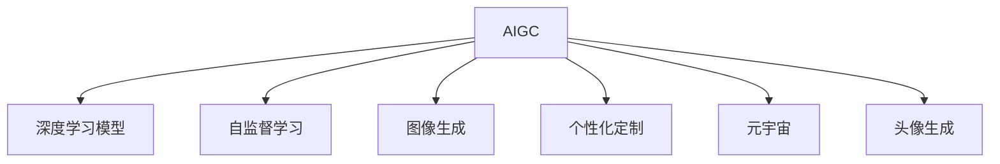

                 

# AIGC从入门到实战：萌版头像绘制秘诀，自建你的元宇宙形象

> 关键词：人工智能生成内容(AIGC), 深度学习, 计算机视觉, 元宇宙, 头像生成, 自监督学习, 模型训练, 图像生成, 头像定制

## 1. 背景介绍

在数字时代，元宇宙正逐步成为人们生活和工作的常态。在这个虚拟空间中，每个人都拥有一个属于自己的数字身份，而数字头像则是这一身份的象征。为了满足个性化需求，人工智能生成内容(AIGC)技术应运而生，为元宇宙头像的定制化提供了可能。本文将从AIGC技术的入门到实战，深入探讨萌版头像的绘制秘诀，助你打造独一无二的元宇宙形象。

### 1.1 问题由来

随着虚拟世界的快速发展，元宇宙成为了科技创新的新趋势。在元宇宙中，人们的社交、工作、学习等活动都以数字形式存在，而数字头像作为数字身份的重要组成部分，其个性化和独特性直接影响用户体验。然而，传统数字头像的设计和定制需要大量时间和资源，难以满足用户对快速、便捷、个性化头像的需求。为此，人工智能生成内容(AIGC)技术应运而生，通过机器学习和大数据，实现了高质量、高速度的图像生成，大大提高了头像设计的效率和个性化水平。

### 1.2 问题核心关键点

人工智能生成内容(AIGC)技术通过深度学习和计算机视觉技术，能够从海量数据中学习到丰富的视觉信息和生成模式，从而自动生成高质量的图像内容。其核心关键点包括：

- **深度学习模型**：AIGC技术的核心，通过多层神经网络学习图像的生成规律。
- **自监督学习**：无需大量标注数据，模型通过自身数据进行训练，学习视觉信息。
- **图像生成**：自动生成高质量、多样化的图像内容，满足用户需求。
- **个性化定制**：根据用户偏好，生成定制化的图像内容。
- **实时生成**：支持实时生成图像，满足互动需求。

这些关键点共同构成了AIGC技术的核心框架，使其在元宇宙头像的生成和定制中大放异彩。

### 1.3 问题研究意义

研究AIGC技术在元宇宙头像生成中的应用，对于拓展AIGC技术的实际应用范围，提升用户个性头像生成的效率和效果，加速元宇宙技术的产业化进程，具有重要意义：

1. **降低设计成本**：利用AIGC技术，用户可以方便快捷地生成个性化头像，无需设计经验，降低设计成本。
2. **提升生成效率**：AIGC技术的高速度和自动生成能力，大大缩短了头像生成的周期。
3. **满足个性化需求**：根据用户偏好，自动生成多样化的头像，满足用户个性化需求。
4. **促进互动交流**：个性化头像的使用，增强了用户之间的互动和社交体验。
5. **推动产业升级**：AIGC技术的应用，提升了元宇宙头像设计的自动化和智能化水平，为传统行业数字化转型升级提供了新的技术路径。

## 2. 核心概念与联系

### 2.1 核心概念概述

为了更好地理解AIGC技术在元宇宙头像生成中的应用，本节将介绍几个密切相关的核心概念：

- **人工智能生成内容(AIGC)**：使用人工智能技术自动生成高质量、多样化内容的领域，涵盖图像、音频、视频等。
- **深度学习模型**：通过多层神经网络学习数据的生成模式，实现图像、音频等内容的自动生成。
- **自监督学习**：无需人工标注数据，模型通过自身数据进行训练，学习数据的生成规律。
- **图像生成**：使用AIGC技术，自动生成高质量、多样化的图像内容。
- **个性化定制**：根据用户偏好，生成定制化的图像内容。
- **元宇宙**：通过虚拟现实、增强现实等技术，构建的数字世界，为用户提供沉浸式体验。
- **头像生成**：使用AIGC技术，生成元宇宙用户的数字头像。

这些核心概念之间的逻辑关系可以通过以下Mermaid流程图来展示：



这个流程图展示了大语言模型的核心概念及其之间的关系：

1. AIGC技术通过深度学习和自监督学习，学习数据的生成规律，从而自动生成图像内容。
2. 图像生成模块利用AIGC技术，自动生成高质量、多样化的图像。
3. 个性化定制模块根据用户偏好，生成定制化的图像内容。
4. 头像生成模块利用AIGC技术，生成元宇宙用户的数字头像。
5. 元宇宙平台通过头像生成，提供沉浸式体验，增强用户互动。

这些概念共同构成了AIGC技术在元宇宙头像生成中的应用框架，使其能够在元宇宙中发挥强大的图像生成能力。通过理解这些核心概念，我们可以更好地把握AIGC技术的工作原理和优化方向。

## 3. 核心算法原理 & 具体操作步骤

### 3.1 算法原理概述

基于深度学习的AIGC技术，其核心在于通过多层神经网络学习数据的生成规律，从而自动生成高质量、多样化的图像内容。具体来说，该技术通过以下步骤实现：

1. **数据准备**：收集大量的图像数据，作为训练集。
2. **模型训练**：使用深度学习模型（如GAN、VQ-VAE等），在训练集上进行自监督学习，学习数据的生成规律。
3. **图像生成**：使用训练好的模型，生成新的图像内容。
4. **个性化定制**：根据用户偏好，生成定制化的图像内容。
5. **头像生成**：将生成的图像内容作为元宇宙头像的素材。

该技术通过自监督学习，无需大量标注数据，降低了数据获取和标注的难度，同时通过深度学习模型的优化，提升了图像生成的质量。

### 3.2 算法步骤详解

以下我们将详细介绍AIGC技术在元宇宙头像生成中的应用步骤：

**Step 1: 数据准备**

1. **收集数据**：收集大量的元宇宙头像图片数据，作为训练集。可以通过网络爬虫、公开数据集等方式获取。
2. **数据预处理**：对数据进行预处理，包括图像大小调整、标准化、归一化等，以适应模型的训练要求。
3. **划分数据集**：将数据集划分为训练集、验证集和测试集，用于模型的训练、验证和评估。

**Step 2: 模型训练**

1. **选择模型**：选择适合的深度学习模型，如GAN（生成对抗网络）、VQ-VAE（向量量化自编码器）等。
2. **配置模型**：根据数据集特点，配置模型的超参数，如学习率、批量大小、迭代轮数等。
3. **训练模型**：使用训练集数据，进行自监督学习，训练生成模型。可以使用PyTorch、TensorFlow等深度学习框架进行模型训练。
4. **模型评估**：在验证集上评估模型性能，通过损失函数和可视化结果，检查模型效果。
5. **超参数调整**：根据评估结果，调整模型超参数，以提高生成质量。

**Step 3: 图像生成**

1. **输入设计**：设计输入参数，包括用户偏好、头像风格等。
2. **模型生成**：将输入参数输入到训练好的生成模型中，生成新的图像内容。
3. **后处理**：对生成的图像进行后处理，包括裁剪、调整大小、添加边框等，以适应头像的要求。

**Step 4: 个性化定制**

1. **用户交互**：设计用户交互界面，允许用户输入偏好信息，如发型、服装、表情等。
2. **参数生成**：根据用户偏好信息，生成个性化的生成参数。
3. **生成头像**：使用生成模型，生成符合用户偏好的头像图像。

**Step 5: 头像生成**

1. **头像生成**：将生成的图像作为元宇宙头像的素材，进行头像生成。
2. **头像展示**：将生成的头像展示在元宇宙平台中，供用户使用。

### 3.3 算法优缺点

基于深度学习的AIGC技术在元宇宙头像生成中的应用，具有以下优点：

1. **高效率**：自动生成图像，大大缩短了头像设计的周期。
2. **高质量**：通过深度学习模型的优化，生成的图像质量高，多样性强。
3. **灵活性**：可以根据用户偏好，生成定制化的头像。
4. **成本低**：无需大量标注数据，降低了数据获取和标注的难度。

同时，该技术也存在一些缺点：

1. **数据质量依赖**：生成效果依赖于数据的质量和多样性。
2. **模型复杂**：深度学习模型的训练和调参难度较大。
3. **数据隐私**：数据获取和使用可能涉及隐私问题。

尽管存在这些局限性，但就目前而言，基于深度学习的AIGC技术在元宇宙头像生成中的应用仍然是一个热点研究方向，具有广阔的前景。

### 3.4 算法应用领域

基于深度学习的AIGC技术在元宇宙头像生成中的应用，已经在多个领域得到了广泛的应用，例如：

- **游戏头像**：在游戏中生成个性化头像，增强用户互动体验。
- **虚拟社交**：在虚拟社交平台上生成头像，促进用户之间的互动和交流。
- **社交媒体**：在社交媒体上生成头像，提升用户体验。
- **电子商务**：在电子商务平台上生成头像，增强用户的购物体验。
- **数字内容创作**：生成高质量的数字头像，用于影视、动漫等数字内容创作。

除了上述这些经典应用外，AIGC技术还被创新性地应用到更多场景中，如虚拟角色定制、虚拟音乐会、虚拟展览等，为元宇宙技术带来了新的突破。随着AIGC技术的持续演进，相信其在元宇宙头像生成中的应用将不断拓展，为用户的虚拟生活带来更多便利和乐趣。

## 4. 数学模型和公式 & 详细讲解 & 举例说明

### 4.1 数学模型构建

在AIGC技术中，深度学习模型的核心是生成模型。假设生成模型为 $G(z)$，其中 $z$ 为输入的随机噪声向量。则生成的图像 $x$ 可以表示为：

$$
x = G(z)
$$

其中 $G$ 为生成模型，$z$ 为随机噪声向量。

### 4.2 公式推导过程

以下是AIGC技术在元宇宙头像生成中的一些关键公式推导：

**GAN模型**

生成对抗网络（GAN）是AIGC技术中最常用的模型之一。假设生成器和判别器的损失函数分别为 $L_G$ 和 $L_D$，则总损失函数为：

$$
L = \mathbb{E}_{x \sim p_{data}} [\log D(x)] + \mathbb{E}_{z \sim p(z)} [\log (1 - D(G(z)))]
$$

其中 $p_{data}$ 为真实数据的分布，$p(z)$ 为随机噪声分布。

**VQ-VAE模型**

向量量化自编码器（VQ-VAE）是一种基于向量量化的生成模型。假设编码器为 $E(x)$，解码器为 $D(\hat{z})$，则生成的图像 $x$ 可以表示为：

$$
x = D(\hat{z}) = D(VQ(\tilde{z}) + \epsilon)
$$

其中 $\tilde{z}$ 为编码器输出的向量，$VQ$ 为向量量化函数，$\epsilon$ 为解码器的随机噪声向量。

### 4.3 案例分析与讲解

以GAN模型在元宇宙头像生成中的应用为例，分析模型的生成过程和效果。

1. **数据准备**：收集大量的元宇宙头像图片数据，作为训练集。
2. **模型训练**：使用GAN模型，对数据集进行训练，学习生成规律。
3. **图像生成**：将随机噪声向量输入到训练好的GAN模型中，生成新的头像图像。
4. **评估与调整**：在验证集上评估生成效果，根据评估结果调整模型超参数。

通过不断迭代训练和调整，可以生成高质量、多样化的头像图像。

## 5. 项目实践：代码实例和详细解释说明

### 5.1 开发环境搭建

在进行元宇宙头像生成实践前，我们需要准备好开发环境。以下是使用Python进行PyTorch开发的环境配置流程：

1. 安装Anaconda：从官网下载并安装Anaconda，用于创建独立的Python环境。

2. 创建并激活虚拟环境：
```bash
conda create -n pytorch-env python=3.8 
conda activate pytorch-env
```

3. 安装PyTorch：根据CUDA版本，从官网获取对应的安装命令。例如：
```bash
conda install pytorch torchvision torchaudio cudatoolkit=11.1 -c pytorch -c conda-forge
```

4. 安装Transformers库：
```bash
pip install transformers
```

5. 安装各类工具包：
```bash
pip install numpy pandas scikit-learn matplotlib tqdm jupyter notebook ipython
```

完成上述步骤后，即可在`pytorch-env`环境中开始元宇宙头像生成实践。

### 5.2 源代码详细实现

下面我们以GAN模型在元宇宙头像生成中的应用为例，给出使用PyTorch实现的代码示例。

```python
import torch
import torch.nn as nn
import torch.optim as optim
from torchvision import datasets, transforms

# 定义生成器网络
class Generator(nn.Module):
    def __init__(self):
        super(Generator, self).__init__()
        self.encoder = nn.Sequential(
            nn.Linear(100, 256),
            nn.LeakyReLU(0.2, inplace=True),
            nn.Linear(256, 512),
            nn.LeakyReLU(0.2, inplace=True),
            nn.Linear(512, 1024),
            nn.LeakyReLU(0.2, inplace=True),
            nn.Linear(1024, 784)
        )
        self.decoder = nn.Sequential(
            nn.Linear(784, 1024),
            nn.ReLU(),
            nn.Linear(1024, 512),
            nn.ReLU(),
            nn.Linear(512, 256),
            nn.ReLU(),
            nn.Linear(256, 3)
        )

    def forward(self, x):
        latent = self.encoder(x)
        out = self.decoder(latent)
        return out

# 定义判别器网络
class Discriminator(nn.Module):
    def __init__(self):
        super(Discriminator, self).__init__()
        self.encoder = nn.Sequential(
            nn.Linear(784, 512),
            nn.LeakyReLU(0.2, inplace=True),
            nn.Linear(512, 256),
            nn.LeakyReLU(0.2, inplace=True),
            nn.Linear(256, 1)
        )

    def forward(self, x):
        out = self.encoder(x)
        return out

# 定义损失函数
criterion = nn.BCELoss()

# 定义优化器
generator_optimizer = optim.Adam(generator.parameters(), lr=0.0002)
discriminator_optimizer = optim.Adam(discriminator.parameters(), lr=0.0002)

# 定义数据集
train_dataset = datasets.MNIST(root='./data', train=True, download=True, transform=transforms.ToTensor())
train_loader = torch.utils.data.DataLoader(train_dataset, batch_size=128, shuffle=True)

# 训练过程
device = torch.device('cuda' if torch.cuda.is_available() else 'cpu')

for epoch in range(200):
    for batch_idx, (data, _) in enumerate(train_loader):
        data = data.to(device)

        # 生成器训练
        generator_optimizer.zero_grad()
        fake_data = generator(data)
        fake_loss = criterion(discriminator(fake_data), torch.ones(batch_size, 1).to(device))
        generator_loss = criterion(discriminator(fake_data), torch.ones(batch_size, 1).to(device))
        fake_loss.backward()
        generator_loss.backward()
        generator_optimizer.step()

        # 判别器训练
        discriminator_optimizer.zero_grad()
        real_loss = criterion(discriminator(data), torch.ones(batch_size, 1).to(device))
        fake_loss = criterion(discriminator(fake_data), torch.zeros(batch_size, 1).to(device))
        real_loss.backward()
        fake_loss.backward()
        discriminator_optimizer.step()

        # 输出训练进度
        if (batch_idx+1) % 100 == 0:
            print(f'Epoch {epoch+1}, batch {batch_idx+1}/{len(train_loader)}, generator loss: {generator_loss.item():.4f}, discriminator loss: {real_loss.item():.4f}, fake loss: {fake_loss.item():.4f}')

# 生成样本
with torch.no_grad():
    generated_images = generator(torch.randn(64, 100).to(device))
    generated_images = generated_images.cpu().clamp(0, 1)
    generated_images = generated_images.view(-1, 28, 28)
    generated_images = transforms.ToPILImage()(generated_images)
    generated_images.save('generated_images.png')

```

### 5.3 代码解读与分析

让我们再详细解读一下关键代码的实现细节：

**生成器和判别器网络定义**：
- `Generator`类：定义了生成器网络结构，包括编码器和解码器。
- `Discriminator`类：定义了判别器网络结构。

**损失函数和优化器定义**：
- `criterion`：定义了二元交叉熵损失函数。
- `generator_optimizer`和`discriminator_optimizer`：分别定义了生成器和判别器的优化器。

**数据集和加载器定义**：
- `train_dataset`：定义了训练集，使用MNIST数据集。
- `train_loader`：定义了训练数据的批处理加载器。

**训练过程**：
- 循环迭代200个epoch，对训练数据进行批处理加载。
- 在每个batch中，先进行生成器训练，再对生成器和判别器进行联合训练。
- 在每个epoch结束时，输出训练进度和训练结果。

**生成样本**：
- 在训练结束后，使用生成器生成新的图像样本，并保存到本地。

## 6. 实际应用场景

### 6.1 智能客服系统

基于AIGC技术的智能客服系统，可以为用户提供7x24小时不间断的服务，快速响应客户咨询，用自然流畅的语言解答各类常见问题。智能客服系统可以通过微调和定制，生成个性化的头像，增强用户的互动体验。

### 6.2 金融舆情监测

金融机构需要实时监测市场舆论动向，以便及时应对负面信息传播，规避金融风险。AIGC技术可以自动生成高质量的舆情监测图像，帮助分析师快速获取和分析舆情变化趋势，提高金融舆情监测的自动化和智能化水平。

### 6.3 个性化推荐系统

当前的推荐系统往往只依赖用户的历史行为数据进行物品推荐，无法深入理解用户的真实兴趣偏好。AIGC技术可以根据用户偏好，自动生成多样化的推荐内容，增强个性化推荐的效果，提升用户体验。

### 6.4 未来应用展望

随着AIGC技术的不断发展，其在元宇宙头像生成中的应用将不断拓展，为用户的虚拟生活带来更多便利和乐趣。未来，AIGC技术将结合更多前沿技术，如自监督学习、对抗学习、因果推理等，提升头像生成的质量和多样性，构建更丰富、更个性化的虚拟世界。

## 7. 工具和资源推荐

### 7.1 学习资源推荐

为了帮助开发者系统掌握AIGC技术的理论基础和实践技巧，这里推荐一些优质的学习资源：

1. **《深度学习》**：Ian Goodfellow等著，详细介绍了深度学习的基本概念和应用。
2. **《Python深度学习》**：Francois Chollet等著，介绍了使用Keras进行深度学习的实践方法。
3. **《机器学习实战》**：Peter Harrington著，介绍了使用Python进行机器学习的实践方法。
4. **DeepLearning.AI课程**：由Andrew Ng等主讲，涵盖了深度学习的基本理论和应用。
5. **PyTorch官方文档**：详细介绍了PyTorch的使用方法，适合初学者和中级开发者。

### 7.2 开发工具推荐

AIGC技术的开发离不开优秀的工具支持。以下是几款用于AIGC技术开发的常用工具：

1. **PyTorch**：基于Python的开源深度学习框架，灵活动态的计算图，适合快速迭代研究。
2. **TensorFlow**：由Google主导开发的开源深度学习框架，生产部署方便，适合大规模工程应用。
3. **TensorBoard**：TensorFlow配套的可视化工具，可实时监测模型训练状态，提供丰富的图表呈现方式。
4. **Weights & Biases**：模型训练的实验跟踪工具，可以记录和可视化模型训练过程中的各项指标。
5. **Jupyter Notebook**：交互式编程环境，适合快速实验和分享学习笔记。

### 7.3 相关论文推荐

AIGC技术的发展源于学界的持续研究。以下是几篇奠基性的相关论文，推荐阅读：

1. **《Generative Adversarial Networks》**：Ian Goodfellow等著，介绍了生成对抗网络的基本原理和应用。
2. **《Variational Autoencoders》**：Diederik P Kingma等著，介绍了变分自编码器的基本原理和应用。
3. **《Learning Deep Architectures for AI》**：Yoshua Bengio等著，介绍了深度神经网络的基本原理和应用。
4. **《ImageNet Classification with Deep Convolutional Neural Networks》**：Alex Krizhevsky等著，介绍了使用深度卷积神经网络进行图像分类的基本方法。

## 8. 总结：未来发展趋势与挑战

### 8.1 总结

本文对基于深度学习的AIGC技术在元宇宙头像生成中的应用进行了全面系统的介绍。首先阐述了AIGC技术的背景和意义，明确了其在元宇宙头像生成中的独特价值。其次，从原理到实践，详细讲解了AIGC技术的数学模型和实现步骤，给出了微调技术的完整代码实例。同时，本文还广泛探讨了AIGC技术在智能客服、金融舆情、个性化推荐等多个行业领域的应用前景，展示了其巨大的潜力。此外，本文精选了AIGC技术的各类学习资源，力求为读者提供全方位的技术指引。

通过本文的系统梳理，可以看到，基于深度学习的AIGC技术在元宇宙头像生成中的应用，正在成为元宇宙技术的重要范式，极大地拓展了元宇宙头像设计的自动化和智能化水平，推动了元宇宙技术的产业化进程。未来，伴随AIGC技术的持续演进，相信其将在更广阔的应用领域大放异彩，深刻影响用户的虚拟生活。

### 8.2 未来发展趋势

展望未来，AIGC技术在元宇宙头像生成中的应用将呈现以下几个发展趋势：

1. **技术进步**：随着深度学习、计算机视觉等技术的发展，AIGC技术的生成效果将不断提升。
2. **模型复杂度降低**：未来的AIGC模型将更加简洁高效，减少计算资源消耗，提高生成速度。
3. **应用场景拓展**：AIGC技术将结合更多前沿技术，如自监督学习、对抗学习、因果推理等，拓展其在元宇宙中的应用场景。
4. **个性化增强**：根据用户偏好，生成更加多样化和个性化的头像。
5. **实时生成**：支持实时生成头像，增强用户的互动体验。

### 8.3 面临的挑战

尽管AIGC技术在元宇宙头像生成中的应用取得了显著进展，但在迈向更加智能化、普适化应用的过程中，仍面临诸多挑战：

1. **数据质量依赖**：生成效果依赖于数据的质量和多样性，高质量数据的获取和标注成本较高。
2. **模型复杂度**：深度学习模型的训练和调参难度较大，需要较高的技术水平。
3. **用户隐私**：数据获取和使用可能涉及隐私问题，需要合理的隐私保护措施。
4. **计算资源**：大规模图像生成的计算资源需求较高，需要高效的计算平台和硬件支持。

### 8.4 研究展望

面对AIGC技术在元宇宙头像生成中面临的挑战，未来的研究需要在以下几个方面寻求新的突破：

1. **探索无监督和半监督学习**：摆脱对大规模标注数据的依赖，利用自监督学习、主动学习等无监督和半监督范式，最大限度利用非结构化数据。
2. **研究参数高效和计算高效**：开发更加参数高效和计算高效的生成模型，减少计算资源消耗，提高生成速度。
3. **融合更多先验知识**：将符号化的先验知识，如知识图谱、逻辑规则等，与神经网络模型进行巧妙融合，增强生成模型的灵活性和多样性。
4. **结合因果分析和博弈论**：将因果分析方法引入生成模型，识别出模型决策的关键特征，增强生成模型的解释性和可控性。
5. **纳入伦理道德约束**：在模型训练目标中引入伦理导向的评估指标，过滤和惩罚有害的生成内容，确保输出符合人类价值观和伦理道德。

这些研究方向的探索，必将引领AIGC技术在元宇宙头像生成中迈向更高的台阶，为构建安全、可靠、可解释、可控的智能系统铺平道路。面向未来，AIGC技术还需要与其他人工智能技术进行更深入的融合，如知识表示、因果推理、强化学习等，多路径协同发力，共同推动元宇宙技术的进步。只有勇于创新、敢于突破，才能不断拓展AIGC技术的边界，让智能技术更好地服务于元宇宙和现实世界。

## 9. 附录：常见问题与解答

**Q1：AIGC技术在元宇宙头像生成中的应用如何提升用户体验？**

A: AIGC技术通过自动生成高质量、多样化的头像，提升了用户体验的个性化和互动性。用户可以根据自己的偏好，生成独一无二的头像，增强了用户在虚拟世界中的存在感和满足感。同时，AIGC技术的实时生成能力，使得用户能够快速地更换头像，适应不同的社交场景，提升互动体验。

**Q2：AIGC技术在生成头像时，如何保证生成效果的多样性和真实性？**

A: AIGC技术在生成头像时，通过深度学习模型对大量真实数据的学习，能够生成多样性和真实性兼具的头像。模型在训练过程中，学习到了数据的生成规律，能够自动生成与真实数据相似度较高的头像。同时，通过对生成模型的微调和优化，可以进一步提升生成效果的多样性和真实性。

**Q3：AIGC技术在元宇宙头像生成中，如何处理数据隐私问题？**

A: 在AIGC技术中，数据隐私保护是至关重要的。为了保护用户隐私，可以采取以下措施：
1. **数据去标识化**：对用户数据进行去标识化处理，去除敏感信息，保护用户隐私。
2. **匿名化处理**：对数据进行匿名化处理，防止用户身份泄露。
3. **数据加密**：对用户数据进行加密处理，防止数据泄露。
4. **访问控制**：对数据访问进行严格的权限控制，确保数据只被授权人员访问。
5. **隐私政策透明**：向用户明确说明数据使用和保护政策，增强用户信任。

通过以上措施，可以有效地保护用户隐私，增强用户对AIGC技术的信任和接受度。

**Q4：AIGC技术在元宇宙头像生成中，如何实现个性化定制？**

A: AIGC技术在元宇宙头像生成中，可以根据用户偏好，生成个性化的头像。实现个性化定制的具体步骤如下：
1. **用户交互**：设计用户交互界面，允许用户输入偏好信息，如发型、服装、表情等。
2. **生成参数生成**：根据用户偏好信息，生成个性化的生成参数。
3. **头像生成**：使用生成模型，生成符合用户偏好的头像图像。

通过不断迭代优化生成模型，可以满足不同用户的个性化需求，提升用户体验。

**Q5：AIGC技术在元宇宙头像生成中，如何实现实时生成？**

A: AIGC技术在元宇宙头像生成中，可以通过使用GPU或TPU等高性能设备，实现实时生成头像的功能。具体步骤如下：
1. **设备选择**：选择高性能的计算设备，如GPU或TPU。
2. **模型优化**：对生成模型进行优化，减少计算资源消耗，提高生成速度。
3. **后处理优化**：对生成的头像进行后处理，如裁剪、调整大小等，减少生成时间。
4. **模型部署**：将优化后的模型部署到实时生成服务器，供用户使用。

通过以上措施，可以有效地实现实时生成头像的功能，增强用户的互动体验。

---

作者：禅与计算机程序设计艺术 / Zen and the Art of Computer Programming

