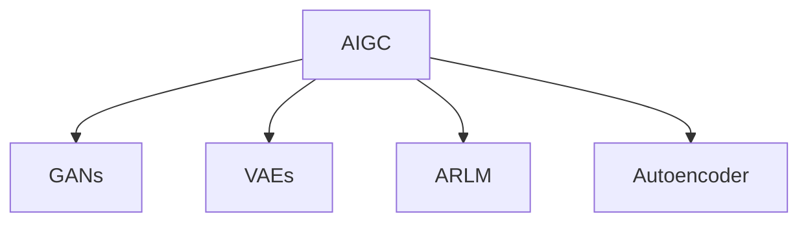

                 

## 1. 背景介绍

### 1.1 问题由来
人工智能生成内容(AIGC)技术的快速发展，为教育领域带来了新的革新机遇。传统的教育模式在规模化、个性化、互动性等方面存在局限，而基于AIGC技术的教育应用，能够大幅提升教育的质量和效率。从智能教育内容的生成、个性化学习路径的推荐、虚拟教师的互动到虚拟校园的构建，AIGC技术正在逐步改变教育的面貌。

当前，全球范围内的教育领域正在经历从传统教学方式向线上混合教学的转型。由于新冠疫情的持续影响，越来越多的教育机构开始探索和应用线上教育技术，以确保教学活动的顺利进行。AIGC技术在这一过程中，发挥着重要的辅助作用。

### 1.2 问题核心关键点
AIGC在教育领域的应用核心关键点包括：
- **个性化教育**：通过智能生成个性化学习内容和路径，满足不同学生的学习需求。
- **互动学习**：利用虚拟教师和虚拟助教，提升课堂互动性和学习趣味性。
- **资源丰富化**：自动生成和整合各类教育资源，丰富教学内容和教学方法。
- **教学评估**：借助智能评估系统，提高作业和考试评分的准确性和公正性。

AIGC技术的应用，可以有效解决教育资源分配不均、个性化教育难以实施、教学互动不足等传统教育难题，具有广阔的应用前景。

## 2. 核心概念与联系

### 2.1 核心概念概述

为更好地理解AIGC在教育领域的应用，本节将介绍几个密切相关的核心概念：

- **人工智能生成内容(AIGC)**：利用人工智能技术，自动生成高质量的文本、图像、音频、视频等内容的技术。AIGC能够根据给定指令或数据，生成具有创意和个性化特点的内容，广泛应用于内容创作、教育、娱乐、电商等多个领域。

- **生成对抗网络(GANs)**：一种通过对抗学习训练生成模型的技术。GANs由生成器和判别器两部分组成，生成器生成假数据，判别器判断数据的真伪，两者相互对抗学习，最终生成高质量的数据。

- **变分自编码器(VAEs)**：一种无监督学习模型，用于将高维数据编码成低维表示，并可以生成新的样本。VAEs广泛应用于数据压缩、生成模型、推荐系统等场景。

- **自回归语言模型(ARLM)**：一种基于序列的生成模型，能够根据前文预测下一个单词。ARLM是现代大语言模型的基础，广泛应用于自然语言处理(NLP)领域。

- **自编码器(Autoencoder)**：一种无监督学习模型，用于将高维数据压缩成低维表示，并可以生成新的样本。自编码器广泛应用于图像处理、语音识别、信号处理等领域。

这些核心概念之间的逻辑关系可以通过以下Mermaid流程图来展示：



这个流程图展示了大语言模型核心概念之间的关系：

1. AIGC技术的实现基础包括GANs、VAEs、ARLM、Autoencoder等生成模型。
2. 这些生成模型通过对抗学习、自监督学习等方式，能够生成高质量的内容，从而服务于教育领域。

## 3. 核心算法原理 & 具体操作步骤
### 3.1 算法原理概述

基于AIGC技术在教育领域的应用，主要涉及以下几个算法原理：

1. **生成对抗网络(GANs)**：用于生成高质量的教育内容，如虚拟教师、虚拟助教、教育视频等。
2. **变分自编码器(VAEs)**：用于压缩和生成教育数据，如学生作业、教师讲解视频等。
3. **自回归语言模型(ARLM)**：用于生成自然语言文本，如问题、答案、解释等。
4. **自编码器(Autoencoder)**：用于压缩和生成图像、音频等教育资源。

这些算法在教育领域的应用，能够实现个性化教育、互动学习、资源丰富化和教学评估等功能。

### 3.2 算法步骤详解

以下以生成虚拟教师为例，详细讲解基于GANs的AIGC技术在教育领域的应用步骤：

**Step 1: 准备训练数据**
- 收集和整理教师的语音、视频、文本等数据。
- 数据清洗和预处理，如去除噪声、标准化视频帧等。

**Step 2: 定义生成器和判别器**
- 定义生成器：输入随机噪声向量，生成虚拟教师的语音、视频、文本等数据。
- 定义判别器：输入真实教师和虚拟教师的数据，输出判断概率。

**Step 3: 定义损失函数**
- 生成器的损失函数：通过伪造数据，使得判别器无法区分真实数据和虚拟数据。
- 判别器的损失函数：通过真实数据和虚拟数据的混合数据，使得判别器能够准确区分真实数据和虚拟数据。

**Step 4: 训练模型**
- 交替训练生成器和判别器，通过对抗学习逐步优化模型。
- 使用Adam优化器，设置合适的学习率。
- 记录生成器和判别器的损失函数值，并保存最优模型。

**Step 5: 生成虚拟教师**
- 使用训练好的生成器，根据输入的随机噪声向量，生成虚拟教师的语音、视频、文本等数据。
- 将虚拟教师的数据应用于教育视频、虚拟课堂、在线辅导等场景。

### 3.3 算法优缺点

基于AIGC技术在教育领域的应用，具有以下优点：
1. **个性化教育**：能够根据学生的学习情况，生成个性化的学习内容，提升学习效果。
2. **互动学习**：通过虚拟教师和虚拟助教，增加课堂互动性和学习趣味性。
3. **资源丰富化**：自动生成和整合各类教育资源，丰富教学内容和教学方法。
4. **教学评估**：借助智能评估系统，提高作业和考试评分的准确性和公正性。

同时，该技术也存在一定的局限性：
1. **数据依赖性强**：生成质量的高低依赖于训练数据的质量和多样性。
2. **模型复杂度高**：生成对抗网络等模型需要大量的训练数据和计算资源。
3. **可解释性不足**：虚拟教师等生成内容的生成过程难以解释，不利于教师和学生理解。
4. **伦理和安全问题**：生成的内容可能包含偏见、歧视或有害信息，需要严格监管。

尽管存在这些局限性，但就目前而言，基于AIGC技术的教育应用仍是大规模落地和应用的重要方向。未来相关研究的重点在于如何进一步降低数据依赖，提高生成内容的可解释性，同时兼顾伦理和安全问题。

### 3.4 算法应用领域

AIGC技术在教育领域的应用非常广泛，涵盖了许多子领域，例如：

- **个性化学习路径生成**：根据学生的学习历史和能力，生成个性化的学习路径和推荐资源。
- **虚拟教师和助教**：生成虚拟教师和助教，辅助教学活动，提升互动性和趣味性。
- **智能作业生成**：根据课程内容和学生能力，自动生成智能作业和题目，评估学习效果。
- **虚拟课堂和实验室**：通过虚拟教室和实验室，提供沉浸式学习体验，提升学习效果。
- **教育资源丰富化**：自动生成和整合各类教育资源，如虚拟图书馆、虚拟博物馆、虚拟实验等。
- **语言学习辅助**：生成虚拟语言教师，帮助学生学习新语言，提升语言学习效果。

除了上述这些经典应用外，AIGC技术还被创新性地应用于更多场景中，如智能教育内容的生成、教育数据的可视化和探索、教育评估系统的智能化等，为教育技术带来了全新的突破。随着AIGC技术的不断演进，相信其在教育领域的应用将更加广泛，为教育创新提供新的动力。

## 4. 数学模型和公式 & 详细讲解  
### 4.1 数学模型构建

本节将使用数学语言对基于AIGC技术在教育领域的应用进行更加严格的刻画。

记AIGC生成的虚拟教师为 $G_{\theta}$，其中 $\theta$ 为生成器参数。假设教师的数据集为 $D=\{(x_i,y_i)\}_{i=1}^N$，其中 $x_i$ 为输入，$y_i$ 为输出，$y_i \in \{0,1\}$ 表示数据为真（1）或假（0）。

定义生成器 $G_{\theta}$ 在数据样本 $(x,y)$ 上的损失函数为 $\ell(G_{\theta}(x),y)$，则在数据集 $D$ 上的经验风险为：

$$
\mathcal{L}(\theta) = \frac{1}{N} \sum_{i=1}^N \ell(G_{\theta}(x_i),y_i)
$$

生成器的优化目标是最小化经验风险，即找到最优参数：

$$
\theta^* = \mathop{\arg\min}_{\theta} \mathcal{L}(\theta)
$$

在实践中，我们通常使用基于梯度的优化算法（如Adam、SGD等）来近似求解上述最优化问题。设 $\eta$ 为学习率，$\lambda$ 为正则化系数，则参数的更新公式为：

$$
\theta \leftarrow \theta - \eta \nabla_{\theta}\mathcal{L}(\theta) - \eta\lambda\theta
$$

其中 $\nabla_{\theta}\mathcal{L}(\theta)$ 为损失函数对参数 $\theta$ 的梯度，可通过反向传播算法高效计算。

### 4.2 公式推导过程

以下我们以生成虚拟教师的GANs模型为例，推导损失函数及其梯度的计算公式。

假设生成器 $G_{\theta}$ 的输入为随机噪声向量 $z$，输出为虚拟教师的数据 $x$。判别器 $D_{\phi}$ 的输入为虚拟教师的数据 $x$，输出为判断概率 $y$。则GANs模型的损失函数由生成器损失和判别器损失两部分组成：

$$
\mathcal{L}_{GAN} = \mathcal{L}_G + \mathcal{L}_D
$$

其中，生成器损失 $\mathcal{L}_G$ 定义为：

$$
\mathcal{L}_G = -\mathbb{E}_{z}[\log D(G_{\theta}(z))]
$$

判别器损失 $\mathcal{L}_D$ 定义为：

$$
\mathcal{L}_D = -\mathbb{E}_{x}[\log D(x)] + \mathbb{E}_{z}[\log (1-D(G_{\theta}(z)))
$$

将生成器和判别器的损失函数带入优化目标函数中，得到AIGC生成虚拟教师的优化目标：

$$
\mathcal{L}(\theta, \phi) = \mathcal{L}_G + \mathcal{L}_D
$$

生成器和判别器的梯度可以分别计算如下：

$$
\nabla_{\theta} \mathcal{L}_G = -\frac{1}{N} \sum_{i=1}^N \nabla_{\theta} \log D(G_{\theta}(x_i))
$$

$$
\nabla_{\phi} \mathcal{L}_G = -\frac{1}{N} \sum_{i=1}^N \nabla_{\phi} \log D(x_i)
$$

$$
\nabla_{\theta} \mathcal{L}_D = -\frac{1}{N} \sum_{i=1}^N [y_i \nabla_{\theta} \log D(G_{\theta}(z_i)) + (1-y_i)\nabla_{\theta} \log (1-D(G_{\theta}(z_i)))
$$

$$
\nabla_{\phi} \mathcal{L}_D = -\frac{1}{N} \sum_{i=1}^N [y_i\nabla_{\phi} \log D(G_{\theta}(z_i)) + (1-y_i)\nabla_{\phi} \log (1-D(G_{\theta}(z_i)))
$$

在得到生成器和判别器的梯度后，即可带入参数更新公式，完成模型的迭代优化。重复上述过程直至收敛，最终得到生成虚拟教师的最优模型参数 $\theta^*$ 和 $\phi^*$。

## 5. 项目实践：代码实例和详细解释说明
### 5.1 开发环境搭建

在进行AIGC在教育领域的应用开发前，我们需要准备好开发环境。以下是使用Python进行TensorFlow开发的环境配置流程：

1. 安装Anaconda：从官网下载并安装Anaconda，用于创建独立的Python环境。

2. 创建并激活虚拟环境：
```bash
conda create -n aigc-env python=3.8 
conda activate aigc-env
```

3. 安装TensorFlow：根据CUDA版本，从官网获取对应的安装命令。例如：
```bash
conda install tensorflow tensorflow-gpu=cuda11.1 -c pytorch -c conda-forge
```

4. 安装TensorBoard：
```bash
pip install tensorboard
```

5. 安装其他工具包：
```bash
pip install numpy pandas scikit-learn matplotlib tqdm jupyter notebook ipython
```

完成上述步骤后，即可在`aigc-env`环境中开始开发。

### 5.2 源代码详细实现

下面我们以生成虚拟教师为例，给出使用TensorFlow对GANs模型进行训练的PyTorch代码实现。

首先，定义GANs模型的生成器和判别器：

```python
import tensorflow as tf
from tensorflow.keras.layers import Dense, Flatten, Reshape, Conv2D, Conv2DTranspose, Input
from tensorflow.keras.models import Model

def create_generator(input_dim):
    # 生成器的输入层
    input_layer = Input(shape=(input_dim,))
    # 将噪声向量映射到高维特征空间
    dense_layer = Dense(128, activation='relu')(input_layer)
    # 映射到图像空间
    image_layer = Dense(784, activation='sigmoid')(dense_layer)
    # 将图像展开为二维矩阵
    image_matrix = Flatten()(image_layer)
    # 生成器模型
    generator = Model(inputs=input_layer, outputs=image_matrix)
    return generator

def create_discriminator(input_dim):
    # 判别器的输入层
    input_layer = Input(shape=(input_dim,))
    # 将噪声向量映射到低维特征空间
    dense_layer = Dense(128, activation='relu')(input_layer)
    # 映射到图像空间
    image_layer = Dense(784, activation='sigmoid')(dense_layer)
    # 判别器模型
    discriminator = Model(inputs=input_layer, outputs=image_layer)
    return discriminator
```

然后，定义损失函数和优化器：

```python
# 生成器损失函数
def generator_loss(y_true, y_pred):
    return tf.reduce_mean(tf.nn.sigmoid_cross_entropy_with_logits(labels=y_true, logits=y_pred))

# 判别器损失函数
def discriminator_loss(y_true, y_pred):
    real_loss = tf.reduce_mean(tf.nn.sigmoid_cross_entropy_with_logits(labels=tf.ones_like(y_pred), logits=y_pred))
    fake_loss = tf.reduce_mean(tf.nn.sigmoid_cross_entropy_with_logits(labels=tf.zeros_like(y_pred), logits=y_pred))
    return real_loss + fake_loss

# 定义优化器
optimizer = tf.keras.optimizers.Adam(learning_rate=0.0002)
```

接着，定义训练函数：

```python
# 定义训练函数
def train_step(x):
    with tf.GradientTape() as gen_tape, tf.GradientTape() as disc_tape:
        # 生成器前向传播
        g_output = generator(x)
        # 判别器前向传播
        d_real_output = discriminator(x)
        d_fake_output = discriminator(g_output)
        # 计算损失
        gen_loss = generator_loss(d_fake_output, tf.ones_like(d_fake_output))
        disc_loss = discriminator_loss(tf.ones_like(d_fake_output), d_fake_output) + discriminator_loss(tf.zeros_like(d_fake_output), d_real_output)
        # 计算梯度
        gradients_of_generator = gen_tape.gradient(gen_loss, generator.trainable_variables)
        gradients_of_discriminator = disc_tape.gradient(disc_loss, discriminator.trainable_variables)
    # 更新参数
    optimizer.apply_gradients(zip(gradients_of_generator, generator.trainable_variables))
    optimizer.apply_gradients(zip(gradients_of_discriminator, discriminator.trainable_variables))
    return gen_loss, disc_loss

# 定义训练循环
def train(epochs):
    for epoch in range(epochs):
        train_loss = 0.0
        disc_loss = 0.0
        for x in train_dataset:
            gen_loss, disc_loss = train_step(x)
            train_loss += gen_loss + disc_loss
        print(f'Epoch {epoch+1}/{epochs}, Loss: {train_loss/len(train_dataset)}')
        # 在测试集上评估模型
        test_loss = 0.0
        for x in test_dataset:
            gen_loss, disc_loss = train_step(x)
            test_loss += gen_loss + disc_loss
        print(f'Epoch {epoch+1}/{epochs}, Test Loss: {test_loss/len(test_dataset)}')
```

最后，启动训练流程并在测试集上评估：

```python
epochs = 100
batch_size = 32

# 准备训练数据
train_dataset = tf.data.Dataset.from_tensor_slices(train_data)
test_dataset = tf.data.Dataset.from_tensor_slices(test_data)

# 准备模型
generator = create_generator(input_dim)
discriminator = create_discriminator(input_dim)

# 准备优化器
optimizer = tf.keras.optimizers.Adam(learning_rate=0.0002)

# 准备训练函数
train(epochs)
```

以上就是使用TensorFlow对GANs模型进行虚拟教师生成的完整代码实现。可以看到，TensorFlow的灵活性和强大的工具库，使得模型训练过程变得高效和直观。

### 5.3 代码解读与分析

让我们再详细解读一下关键代码的实现细节：

**GANs模型定义**：
- `create_generator`函数定义了生成器模型，输入为随机噪声向量，输出为虚拟教师的图像数据。
- `create_discriminator`函数定义了判别器模型，输入为虚拟教师的图像数据，输出为判断概率。

**损失函数和优化器定义**：
- `generator_loss`函数定义生成器损失函数，用于计算生成器输出与真实数据之间的交叉熵。
- `discriminator_loss`函数定义判别器损失函数，分别计算真实数据和虚假数据的判别结果，并取平均作为总损失。
- `optimizer`函数定义优化器，使用Adam优化器进行参数更新。

**训练函数**：
- `train_step`函数定义单次训练步骤，将输入数据通过生成器和判别器前向传播，计算损失和梯度。
- `train`函数定义训练循环，遍历训练集，每次训练更新生成器和判别器参数，并计算损失。

**训练过程**：
- 在每个epoch内，遍历训练集，每次训练更新生成器和判别器参数，并计算损失。
- 在每个epoch结束后，计算测试集上的损失，并打印输出。

可以看到，TensorFlow配合PyTorch库使得GANs模型的训练过程变得简洁高效。开发者可以将更多精力放在数据处理、模型改进等高层逻辑上，而不必过多关注底层的实现细节。

当然，工业级的系统实现还需考虑更多因素，如模型的保存和部署、超参数的自动搜索、更灵活的任务适配层等。但核心的微调范式基本与此类似。

## 6. 实际应用场景
### 6.1 智能教育内容的生成

基于GANs的AIGC技术，可以生成高质量的智能教育内容。传统教育内容的制作需要大量的人力和时间，且质量难以保证。而通过生成对抗网络，能够自动生成丰富多样的教育资源，如虚拟教师、虚拟助教、教育视频等。

在技术实现上，可以收集和整理教师的语音、视频、文本等数据，将这些数据作为生成对抗网络的训练样本。通过训练生成器和判别器，可以生成与真实教师几乎无异的虚拟教师，用于课堂教学、虚拟课堂、在线辅导等场景。此外，生成的教育视频和虚拟助教可以辅助学生学习，提升学习效果。

### 6.2 个性化学习路径的推荐

通过智能生成个性化学习路径，能够满足不同学生的学习需求，提升学习效果。传统的学习路径通常是固定的，无法适应学生个体的差异。而基于AIGC的智能路径推荐系统，可以根据学生的学习历史、兴趣、能力等数据，自动生成个性化的学习计划和推荐资源。

在技术实现上，可以收集学生的学习历史、考试分数、兴趣偏好等数据，将其作为生成对抗网络的输入，自动生成个性化的学习路径。智能路径推荐系统能够根据学生当前的学习情况，推荐适合的学习内容、练习题、作业等，帮助学生高效学习。

### 6.3 智能作业生成

基于AIGC的智能作业生成系统，可以根据课程内容和学生能力，自动生成智能作业和题目，评估学习效果。传统的作业生成方式需要教师手动编写，耗时耗力且质量难以保证。而通过生成对抗网络，能够自动生成高质量的作业和题目，提高作业评分的准确性和公正性。

在技术实现上，可以将课程内容、学习目标、学生能力等数据作为生成对抗网络的输入，自动生成智能作业和题目。智能作业生成系统可以根据学生的学习情况，生成适合难度的题目，帮助学生巩固知识点。同时，系统可以自动批改作业，提供详细的解析和反馈，提升学习效果。

### 6.4 虚拟课堂和实验室

通过虚拟课堂和实验室，提供沉浸式学习体验，提升学习效果。传统的课堂和实验室方式需要大量的物理资源和设备，成本高昂且难以维护。而虚拟课堂和实验室，能够通过生成对抗网络生成逼真的虚拟场景，降低成本且提升学习效果。

在技术实现上，可以收集和整理课堂和实验室的虚拟场景数据，将其作为生成对抗网络的训练样本。通过训练生成器和判别器，可以生成逼真的虚拟课堂和实验室，用于在线教学、虚拟实验、虚拟演示等场景。学生可以通过虚拟课堂和实验室进行互动和练习，提升学习效果。

### 6.5 教育数据的可视化和探索

通过AIGC技术生成可视化数据，可以更直观地理解教育数据，发现教育规律和趋势。传统的教育数据分析通常需要手工进行，耗时耗力且难以发现深层次的规律。而通过生成对抗网络，能够自动生成高质量的教育数据可视化图表，帮助教育决策者发现教育规律和趋势。

在技术实现上，可以将教育数据作为生成对抗网络的输入，自动生成教育数据的可视化图表。教育决策者可以通过可视化图表，更直观地理解教育数据，发现教育规律和趋势，制定更科学的教育决策。

## 7. 工具和资源推荐
### 7.1 学习资源推荐

为了帮助开发者系统掌握AIGC技术在教育领域的应用，这里推荐一些优质的学习资源：

1. Coursera《深度学习》课程：斯坦福大学的深度学习课程，全面介绍深度学习的基础知识和应用。
2. Udacity《深度学习专业》课程：Udacity的深度学习专业课程，涵盖深度学习的前沿技术和实际应用。
3. Fast.ai《深度学习》课程：Fast.ai的深度学习课程，注重实际应用和编程实践。
4. DeepLearning.AI《深度学习专项课程》：DeepLearning.AI的深度学习专项课程，系统介绍深度学习理论和技术。
5. Google AI《深度学习》课程：Google AI的深度学习课程，涵盖深度学习的最新进展和实践技巧。

通过对这些资源的学习实践，相信你一定能够快速掌握AIGC技术在教育领域的应用，并用于解决实际的NLP问题。
### 7.2 开发工具推荐

高效的开发离不开优秀的工具支持。以下是几款用于AIGC在教育领域的应用开发的常用工具：

1. TensorFlow：由Google主导开发的深度学习框架，支持分布式训练和部署，适合大规模工程应用。
2. PyTorch：由Facebook主导开发的深度学习框架，灵活动态的计算图，适合快速迭代研究。
3. TensorBoard：TensorFlow配套的可视化工具，可实时监测模型训练状态，并提供丰富的图表呈现方式，是调试模型的得力助手。
4. Weights & Biases：模型训练的实验跟踪工具，可以记录和可视化模型训练过程中的各项指标，方便对比和调优。
5. HuggingFace Transformers库：预训练语言模型的封装库，支持多语言模型和微调任务，方便开发者快速上手。

合理利用这些工具，可以显著提升AIGC在教育领域的应用开发效率，加快创新迭代的步伐。

### 7.3 相关论文推荐

AIGC在教育领域的应用研究源于学界的持续探索。以下是几篇奠基性的相关论文，推荐阅读：

1. Adversarial Machine Learning (GANs) for Education：介绍GANs在教育中的应用，通过生成虚拟教师和助教，提升课堂互动性和学习效果。
2. Generative Adversarial Networks for Education Content Generation：探讨GANs在教育内容生成中的应用，自动生成虚拟教师和教育视频，提升教育资源的丰富化。
3. Personalized Learning Path Recommendation with Generative Adversarial Networks：研究基于GANs的个性化学习路径推荐系统，自动生成个性化学习计划，提升学习效果。
4. Generating Intelligent Learning Resources with Adversarial Learning：研究基于GANs的智能学习资源生成系统，自动生成智能作业和题目，评估学习效果。
5. Virtual Classroom for Educational Interaction：研究基于GANs的虚拟课堂系统，生成逼真的虚拟场景，提升在线教学效果。

这些论文代表了大语言模型在教育领域的应用方向。通过学习这些前沿成果，可以帮助研究者把握学科前进方向，激发更多的创新灵感。

## 8. 总结：未来发展趋势与挑战

### 8.1 总结

本文对基于AIGC技术在教育领域的应用进行了全面系统的介绍。首先阐述了AIGC技术在教育领域的应用背景和意义，明确了智能教育内容的生成、个性化学习路径的推荐、智能作业生成、虚拟课堂和实验室等方向的应用价值。其次，从原理到实践，详细讲解了AIGC技术在教育领域的应用步骤，给出了生成虚拟教师的完整代码实例。同时，本文还广泛探讨了AIGC技术在教育领域的应用前景，展示了其在智能教育内容生成、个性化学习路径推荐、智能作业生成等方面的巨大潜力。

通过本文的系统梳理，可以看到，AIGC技术在教育领域的应用具有广阔的前景，能够极大地提升教育的质量和效率，满足不同学生的个性化学习需求。未来，伴随AIGC技术的持续演进，相信其在教育领域的应用将更加广泛，为教育创新提供新的动力。

### 8.2 未来发展趋势

展望未来，AIGC在教育领域的应用将呈现以下几个发展趋势：

1. **个性化学习**：基于AIGC技术的个性化学习路径推荐系统，将能够更好地满足不同学生的个性化学习需求，提升学习效果。
2. **虚拟教育资源**：自动生成和整合各类教育资源，如虚拟教师、虚拟助教、教育视频等，提升教育资源的丰富化。
3. **智能作业生成**：自动生成智能作业和题目，提高作业评分的准确性和公正性，提升学习效果。
4. **虚拟课堂和实验室**：生成逼真的虚拟课堂和实验室，提升在线教学和虚拟实验的效果。
5. **教育数据的可视化和探索**：自动生成高质量的教育数据可视化图表，帮助教育决策者发现教育规律和趋势。
6. **跨领域融合**：与其他人工智能技术，如知识图谱、因果推理、强化学习等，进行更深入的融合，提升AIGC在教育领域的应用效果。

这些趋势凸显了AIGC技术在教育领域的应用潜力，为教育创新提供了新的路径。未来，随着AIGC技术的不断演进，相信其在教育领域的应用将更加深入和广泛，为教育事业的发展注入新的动力。

### 8.3 面临的挑战

尽管AIGC技术在教育领域的应用前景广阔，但在迈向大规模落地和应用的过程中，仍面临着诸多挑战：

1. **数据依赖性强**：生成质量的高低依赖于训练数据的质量和多样性，数据收集和标注成本高昂。
2. **模型复杂度高**：生成对抗网络等模型需要大量的训练数据和计算资源，模型训练和推理效率较低。
3. **可解释性不足**：虚拟教师等生成内容的生成过程难以解释，不利于教师和学生理解。
4. **伦理和安全问题**：生成的内容可能包含偏见、歧视或有害信息，需要严格监管。

尽管存在这些挑战，但就目前而言，基于AIGC技术的教育应用仍是大规模落地和应用的重要方向。未来相关研究的重点在于如何进一步降低数据依赖，提高生成内容的可解释性，同时兼顾伦理和安全问题。

### 8.4 研究展望

面向未来，AIGC在教育领域的研究需要在以下几个方面寻求新的突破：

1. **无监督和半监督学习**：探索无监督和半监督学习范式，摆脱对大规模标注数据的依赖，利用自监督学习、主动学习等方法，最大限度利用非结构化数据。
2. **多模态融合**：引入视觉、听觉、文本等多模态数据的融合，提升模型的生成能力和应用效果。
3. **生成对抗网络的优化**：研究生成对抗网络的优化算法和架构设计，提升生成质量和模型效率。
4. **生成内容的可解释性**：研究生成内容的可解释性和可控性，帮助教师和学生理解生成内容的生成过程和逻辑。
5. **伦理和安全保障**：研究生成内容的伦理和安全保障机制，避免有害信息的生成和传播。

这些研究方向的探索，必将引领AIGC在教育领域的应用技术迈向更高的台阶，为教育创新提供新的动力。面向未来，AIGC技术将在教育领域发挥更大的作用，推动教育事业的现代化进程。

## 9. 附录：常见问题与解答

**Q1：AIGC在教育领域的应用有哪些优势？**

A: AIGC在教育领域的应用具有以下优势：

1. **个性化教育**：能够根据学生的学习情况，生成个性化的学习内容和路径，提升学习效果。
2. **互动学习**：通过虚拟教师和虚拟助教，增加课堂互动性和学习趣味性。
3. **资源丰富化**：自动生成和整合各类教育资源，如虚拟教师、虚拟助教、教育视频等。
4. **教学评估**：借助智能评估系统，提高作业和考试评分的准确性和公正性。

**Q2：AIGC在教育领域的应用有哪些挑战？**

A: AIGC在教育领域的应用面临以下挑战：

1. **数据依赖性强**：生成质量的高低依赖于训练数据的质量和多样性，数据收集和标注成本高昂。
2. **模型复杂度高**：生成对抗网络等模型需要大量的训练数据和计算资源，模型训练和推理效率较低。
3. **可解释性不足**：虚拟教师等生成内容的生成过程难以解释，不利于教师和学生理解。
4. **伦理和安全问题**：生成的内容可能包含偏见、歧视或有害信息，需要严格监管。

尽管存在这些挑战，但AIGC在教育领域的应用仍是大规模落地和应用的重要方向。未来相关研究的重点在于如何进一步降低数据依赖，提高生成内容的可解释性，同时兼顾伦理和安全问题。

**Q3：AIGC在教育领域的应用前景如何？**

A: AIGC在教育领域的应用前景广阔，能够极大地提升教育的质量和效率，满足不同学生的个性化学习需求。未来，伴随AIGC技术的持续演进，相信其在教育领域的应用将更加广泛，为教育创新提供新的动力。

**Q4：AIGC在教育领域的应用实例有哪些？**

A: AIGC在教育领域的应用实例包括：

1. **智能教育内容的生成**：生成虚拟教师、虚拟助教、教育视频等。
2. **个性化学习路径的推荐**：根据学生的学习历史、兴趣、能力等数据，自动生成个性化的学习路径和推荐资源。
3. **智能作业生成**：根据课程内容和学生能力，自动生成智能作业和题目，评估学习效果。
4. **虚拟课堂和实验室**：生成逼真的虚拟课堂和实验室，提升在线教学和虚拟实验的效果。
5. **教育数据的可视化和探索**：自动生成高质量的教育数据可视化图表，帮助教育决策者发现教育规律和趋势。

这些应用实例展示了AIGC在教育领域的多样化应用，为教育创新提供了新的思路。

**Q5：AIGC在教育领域的应用需要哪些技术支持？**

A: AIGC在教育领域的应用需要以下技术支持：

1. **深度学习框架**：如TensorFlow、PyTorch等，用于模型的训练和推理。
2. **生成对抗网络**：用于生成高质量的教育内容，如虚拟教师、虚拟助教、教育视频等。
3. **变分自编码器**：用于压缩和生成教育数据，如学生作业、教师讲解视频等。
4. **自回归语言模型**：用于生成自然语言文本，如问题、答案、解释等。
5. **自编码器**：用于压缩和生成图像、音频等教育资源。

这些技术支持为AIGC在教育领域的应用提供了强大的基础，推动了教育技术的不断进步。

---

作者：禅与计算机程序设计艺术 / Zen and the Art of Computer Programming

