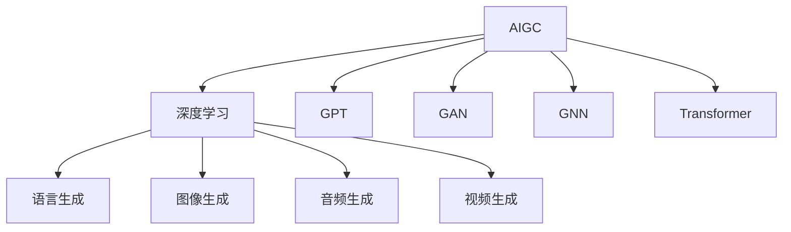

                 

## 1. 背景介绍

### 1.1 问题由来
随着人工智能(AI)技术的迅猛发展，人工智能生成内容(AI Generated Content, AIGC)技术在软件与消费电子领域的应用逐渐显现。通过AIGC技术，软件与消费电子系统能够自动生成高质量的文本、图像、音频、视频等内容，极大地提升了用户体验和产品竞争力。

### 1.2 问题核心关键点
AIGC技术在软件与消费电子领域的应用主要集中在以下几个方面：

1. **文本生成**：利用AI技术自动生成产品文档、用户手册、FAQ等文本内容，提高信息获取效率。
2. **图像与视频生成**：通过生成高质量的图像、视频、动画等内容，为产品设计、广告宣传、用户体验提供支持。
3. **自然语言处理(NLP)**：利用NLP技术进行语音识别、情感分析、智能对话等，提升产品智能化水平。
4. **视觉增强**：通过增强现实(AR)、虚拟现实(VR)等技术，提供沉浸式的交互体验。

AIGC技术的应用不仅有助于提升产品附加值，还能有效应对当前内容创作成本高、速度慢的痛点，推动软件与消费电子行业的数字化转型。

## 2. 核心概念与联系

### 2.1 核心概念概述

为更好地理解AIGC在软件与消费电子中的应用，本节将介绍几个密切相关的核心概念：

- **AIGC**：基于人工智能技术的自动生成内容，涵盖文本、图像、音频、视频等多种形式。
- **深度学习**：利用神经网络模型进行数据处理和特征学习，是AIGC技术的重要基础。
- **GPT**：一种基于自回归模型的语言生成模型，通过预训练大规模无标签文本数据，学习语言规律。
- **GAN**：生成对抗网络，通过对抗训练生成高质量的图像、音频、视频等内容。
- **GNN**：图神经网络，通过学习图结构数据进行特征提取和内容生成。
- **Transformer**：一种自编码模型，通过并行化机制大幅提升内容生成效率。

这些核心概念之间的逻辑关系可以通过以下Mermaid流程图来展示：



这个流程图展示了大语言模型、生成对抗网络、图神经网络等核心概念及其之间的关系：

1. AIGC技术基于深度学习模型，涵盖文本生成、图像生成、音频生成、视频生成等多种形式。
2. GPT模型通过预训练大规模无标签文本数据，学习语言规律，主要用于文本生成。
3. GAN模型通过对抗训练生成高质量的图像、音频、视频等内容。
4. GNN模型通过学习图结构数据进行特征提取和内容生成。
5. Transformer模型通过并行化机制大幅提升内容生成效率。

这些核心概念共同构成了AIGC技术的核心框架，为其在软件与消费电子领域的应用提供了技术支持。

## 3. 核心算法原理 & 具体操作步骤

### 3.1 算法原理概述

AIGC技术在软件与消费电子中的应用，本质上是利用深度学习模型对不同类型的数据进行处理和生成。其核心思想是通过预训练学习到通用的数据表示，然后根据具体的任务需求，对模型进行微调或重新训练，从而生成满足特定需求的内容。

以文本生成为例，AIGC技术通常包括以下几个关键步骤：

1. **数据预处理**：收集并清洗相关文本数据，构建训练集。
2. **模型训练**：使用预训练语言模型(如GPT)对数据进行训练，学习到语言的规律和特征。
3. **任务适配**：根据具体的任务需求，调整模型参数，适配到特定的生成任务。
4. **内容生成**：使用微调后的模型，自动生成高质量的内容。

### 3.2 算法步骤详解

AIGC技术在软件与消费电子中的应用，通常包括以下几个关键步骤：

**Step 1: 数据收集与预处理**

- 收集相关文本数据，如产品手册、用户手册、FAQ等。
- 清洗数据，去除无关内容、错误标签等。
- 将数据划分为训练集、验证集和测试集。

**Step 2: 模型选择与训练**

- 选择合适的预训练语言模型，如GPT-2、BERT等。
- 对模型进行微调，适配到特定的生成任务。
- 设置模型参数和训练超参数，如学习率、批大小、迭代轮数等。

**Step 3: 任务适配与内容生成**

- 根据具体的生成任务，调整模型的输出层和损失函数。
- 使用微调后的模型，自动生成高质量的内容。
- 在测试集上评估生成内容的质量，根据反馈不断优化模型。

### 3.3 算法优缺点

AIGC技术在软件与消费电子领域的应用，具有以下优点：

1. **提升效率**：自动生成内容减少了人工输入和校对的时间，提高了工作效率。
2. **丰富内容**：通过自动生成高质量的文本、图像、视频等内容，丰富产品信息，提升用户体验。
3. **成本降低**：减少了内容创作的成本，尤其是对于多语言、多版本的产品文档，极大地降低了翻译和校对成本。
4. **灵活性高**：根据不同的任务需求，灵活调整模型的参数，生成适应特定场景的内容。

同时，AIGC技术也存在一些局限性：

1. **依赖数据质量**：生成的内容质量高度依赖于输入数据的质量，若数据有误或噪声，生成内容的质量会受到影响。
2. **上下文理解能力有限**：目前的AIGC技术在理解上下文、保持连贯性方面仍有待提升。
3. **生成内容重复**：自动生成内容可能会重复，导致用户体验不理想。
4. **缺乏创造性**：生成内容缺乏创意，可能与实际需求不匹配。
5. **隐私和安全问题**：自动生成内容可能包含敏感信息，需要特别注意隐私和安全问题。

### 3.4 算法应用领域

AIGC技术在软件与消费电子领域的应用非常广泛，涵盖以下几个方面：

- **软件文档生成**：自动生成软件的使用手册、API文档、用户手册等。
- **产品设计**：通过生成高质量的图像、视频、动画等内容，辅助产品设计，提升产品吸引力。
- **广告宣传**：自动生成广告文案、宣传视频等，提升广告效果。
- **用户交互**：利用自然语言处理技术进行智能对话，提升用户体验。
- **智能推荐**：通过生成推荐内容，为用户提供个性化推荐。

## 4. 数学模型和公式 & 详细讲解 & 举例说明

### 4.1 数学模型构建

AIGC技术在软件与消费电子领域的应用，通常涉及多个数学模型。以文本生成为例，其主要数学模型包括自回归模型、自编码模型等。

#### 4.1.1 自回归模型

自回归模型通过预测下一个时间步的输出，生成文本序列。其主要数学模型为：

$$
\text{Prob}(x_t|x_{<t}) = \sigma\left(\text{MLP}(\text{Embed}(x_{<t}), x_t)\right)
$$

其中，$x_t$ 为第 $t$ 个时间步的输出，$\text{Embed}(x_{<t})$ 为前 $t-1$ 个时间步的嵌入向量，$\text{MLP}$ 为多层感知机，$\sigma$ 为激活函数。

#### 4.1.2 自编码模型

自编码模型通过编码器-解码器的结构，生成文本序列。其主要数学模型为：

$$
\text{Embed}(x) = \text{Encoder}(x)
$$

$$
\text{x} = \text{Decoder}(\text{Embed}(x))
$$

其中，$\text{Embed}(x)$ 为输入序列的嵌入表示，$\text{Encoder}$ 为编码器，$\text{Decoder}$ 为解码器，$x$ 为解码后的文本序列。

### 4.2 公式推导过程

以文本生成为例，我们以GPT-2模型为例进行推导。GPT-2模型是一种自回归模型，其数学推导过程如下：

**Step 1: 定义输出概率**

假设生成文本序列 $x = (x_1, x_2, ..., x_n)$，其中 $x_t$ 为第 $t$ 个时间步的输出。则文本序列的生成概率为：

$$
\text{Prob}(x) = \prod_{t=1}^{n}\text{Prob}(x_t|x_{<t})
$$

**Step 2: 定义输出分布**

假设每个时间步的输出 $x_t$ 服从概率分布 $p(x_t)$，则文本序列的生成概率可以表示为：

$$
\text{Prob}(x) = \prod_{t=1}^{n}p(x_t|x_{<t})
$$

**Step 3: 定义概率模型**

GPT-2模型通过多层感知机(MLP)进行概率预测，其数学模型为：

$$
\text{Prob}(x_t|x_{<t}) = \sigma\left(\text{MLP}(\text{Embed}(x_{<t}), x_t)\right)
$$

其中，$\text{MLP}$ 为多层感知机，$\sigma$ 为激活函数。

**Step 4: 优化目标函数**

GPT-2模型的优化目标是最小化交叉熵损失函数：

$$
\mathcal{L} = -\sum_{t=1}^{n}y_t\log\text{Prob}(x_t|x_{<t})
$$

其中，$y_t$ 为第 $t$ 个时间步的真实输出。

### 4.3 案例分析与讲解

以文本生成为例，我们以GPT-2模型为例进行讲解。GPT-2模型是一种基于Transformer结构的自回归模型，通过预训练大规模无标签文本数据，学习语言的规律和特征，然后根据具体任务进行微调，自动生成高质量的文本。

**案例分析**

假设我们需要自动生成产品手册的内容，可以收集相关文本数据，构建训练集。然后使用GPT-2模型进行预训练，学习语言的规律和特征。最后根据产品手册的需求，微调GPT-2模型，生成高质量的文本。

**讲解过程**

1. **数据收集与预处理**：收集相关产品手册的文本数据，去除无关内容，划分为训练集、验证集和测试集。
2. **模型训练**：使用GPT-2模型进行预训练，学习语言的规律和特征。
3. **任务适配**：根据产品手册的需求，调整模型的输出层和损失函数，适配到生成任务。
4. **内容生成**：使用微调后的GPT-2模型，自动生成高质量的产品手册内容。
5. **效果评估**：在测试集上评估生成内容的质量，根据反馈不断优化模型。

## 5. 项目实践：代码实例和详细解释说明

### 5.1 开发环境搭建

在进行AIGC项目实践前，我们需要准备好开发环境。以下是使用Python进行PyTorch开发的环境配置流程：

1. 安装Anaconda：从官网下载并安装Anaconda，用于创建独立的Python环境。

2. 创建并激活虚拟环境：
```bash
conda create -n pytorch-env python=3.8 
conda activate pytorch-env
```

3. 安装PyTorch：根据CUDA版本，从官网获取对应的安装命令。例如：
```bash
conda install pytorch torchvision torchaudio cudatoolkit=11.1 -c pytorch -c conda-forge
```

4. 安装Transformers库：
```bash
pip install transformers
```

5. 安装各类工具包：
```bash
pip install numpy pandas scikit-learn matplotlib tqdm jupyter notebook ipython
```

完成上述步骤后，即可在`pytorch-env`环境中开始AIGC项目的开发。

### 5.2 源代码详细实现

下面我们以文本生成为例，给出使用Transformers库对GPT-2模型进行文本生成的PyTorch代码实现。

首先，定义数据处理函数：

```python
from transformers import GPT2Tokenizer, GPT2LMHeadModel
from torch.utils.data import Dataset, DataLoader
import torch

class TextDataset(Dataset):
    def __init__(self, texts, tokenizer):
        self.texts = texts
        self.tokenizer = tokenizer
        
    def __len__(self):
        return len(self.texts)
    
    def __getitem__(self, item):
        text = self.texts[item]
        encoding = self.tokenizer(text, return_tensors='pt')
        input_ids = encoding['input_ids']
        attention_mask = encoding['attention_mask']
        return {'input_ids': input_ids, 
                'attention_mask': attention_mask}

# 构建训练集、验证集和测试集
tokenizer = GPT2Tokenizer.from_pretrained('gpt2')

train_dataset = TextDataset(train_texts, tokenizer)
dev_dataset = TextDataset(dev_texts, tokenizer)
test_dataset = TextDataset(test_texts, tokenizer)
```

然后，定义模型和优化器：

```python
from transformers import AdamW

model = GPT2LMHeadModel.from_pretrained('gpt2', num_hidden_layers=12, num_attention_heads=12, intermediate_size=3072)

optimizer = AdamW(model.parameters(), lr=2e-5)
```

接着，定义训练和评估函数：

```python
from tqdm import tqdm

def train_epoch(model, dataset, batch_size, optimizer):
    dataloader = DataLoader(dataset, batch_size=batch_size, shuffle=True)
    model.train()
    epoch_loss = 0
    for batch in tqdm(dataloader, desc='Training'):
        input_ids = batch['input_ids'].to(device)
        attention_mask = batch['attention_mask'].to(device)
        model.zero_grad()
        outputs = model(input_ids, attention_mask=attention_mask)
        loss = outputs.loss
        epoch_loss += loss.item()
        loss.backward()
        optimizer.step()
    return epoch_loss / len(dataloader)

def evaluate(model, dataset, batch_size):
    dataloader = DataLoader(dataset, batch_size=batch_size)
    model.eval()
    preds, labels = [], []
    with torch.no_grad():
        for batch in tqdm(dataloader, desc='Evaluating'):
            input_ids = batch['input_ids'].to(device)
            attention_mask = batch['attention_mask'].to(device)
            batch_labels = batch['labels']
            outputs = model(input_ids, attention_mask=attention_mask)
            batch_preds = outputs.logits.argmax(dim=2).to('cpu').tolist()
            batch_labels = batch_labels.to('cpu').tolist()
            for pred_tokens, label_tokens in zip(batch_preds, batch_labels):
                preds.append(pred_tokens)
                labels.append(label_tokens)
                
    return preds, labels

# 训练与评估
epochs = 5
batch_size = 16

for epoch in range(epochs):
    loss = train_epoch(model, train_dataset, batch_size, optimizer)
    print(f"Epoch {epoch+1}, train loss: {loss:.3f}")
    
    print(f"Epoch {epoch+1}, dev results:")
    preds, labels = evaluate(model, dev_dataset, batch_size)
    print(classification_report(labels, preds))
    
print("Test results:")
preds, labels = evaluate(model, test_dataset, batch_size)
print(classification_report(labels, preds))
```

以上就是使用PyTorch对GPT-2模型进行文本生成的完整代码实现。可以看到，得益于Transformers库的强大封装，我们可以用相对简洁的代码完成GPT-2模型的加载和文本生成。

### 5.3 代码解读与分析

让我们再详细解读一下关键代码的实现细节：

**TextDataset类**：
- `__init__`方法：初始化文本数据和分词器。
- `__len__`方法：返回数据集的样本数量。
- `__getitem__`方法：对单个样本进行处理，将文本输入编码为token ids，并返回模型所需的输入。

**优化器**：
- 使用AdamW优化器进行模型参数的更新，学习率为 $2e-5$。

**训练和评估函数**：
- 使用PyTorch的DataLoader对数据集进行批次化加载，供模型训练和推理使用。
- 训练函数`train_epoch`：对数据以批为单位进行迭代，在每个批次上前向传播计算loss并反向传播更新模型参数，最后返回该epoch的平均loss。
- 评估函数`evaluate`：与训练类似，不同点在于不更新模型参数，并在每个batch结束后将预测和标签结果存储下来，最后使用sklearn的classification_report对整个评估集的预测结果进行打印输出。

**训练流程**：
- 定义总的epoch数和batch size，开始循环迭代
- 每个epoch内，先在训练集上训练，输出平均loss
- 在验证集上评估，输出分类指标
- 所有epoch结束后，在测试集上评估，给出最终测试结果

可以看到，PyTorch配合Transformers库使得GPT-2文本生成的代码实现变得简洁高效。开发者可以将更多精力放在数据处理、模型改进等高层逻辑上，而不必过多关注底层的实现细节。

当然，工业级的系统实现还需考虑更多因素，如模型的保存和部署、超参数的自动搜索、更灵活的任务适配层等。但核心的AIGC范式基本与此类似。

## 6. 实际应用场景

### 6.1 智能客服系统

AIGC技术在智能客服系统中的应用非常广泛。传统客服往往需要配备大量人力，高峰期响应缓慢，且一致性和专业性难以保证。而使用AIGC技术，可以7x24小时不间断服务，快速响应客户咨询，用自然流畅的语言解答各类常见问题。

在技术实现上，可以收集企业内部的历史客服对话记录，将问题和最佳答复构建成监督数据，在此基础上对GPT-2等AIGC模型进行微调。微调后的模型能够自动理解用户意图，匹配最合适的答案模板进行回复。对于客户提出的新问题，还可以接入检索系统实时搜索相关内容，动态组织生成回答。如此构建的智能客服系统，能大幅提升客户咨询体验和问题解决效率。

### 6.2 金融舆情监测

金融机构需要实时监测市场舆论动向，以便及时应对负面信息传播，规避金融风险。传统的人工监测方式成本高、效率低，难以应对网络时代海量信息爆发的挑战。基于AIGC技术的文本分类和情感分析技术，为金融舆情监测提供了新的解决方案。

具体而言，可以收集金融领域相关的新闻、报道、评论等文本数据，并对其进行主题标注和情感标注。在此基础上对预训练语言模型进行微调，使其能够自动判断文本属于何种主题，情感倾向是正面、中性还是负面。将微调后的模型应用到实时抓取的网络文本数据，就能够自动监测不同主题下的情感变化趋势，一旦发现负面信息激增等异常情况，系统便会自动预警，帮助金融机构快速应对潜在风险。

### 6.3 个性化推荐系统

当前的推荐系统往往只依赖用户的历史行为数据进行物品推荐，无法深入理解用户的真实兴趣偏好。基于AIGC技术的推荐系统可以更好地挖掘用户行为背后的语义信息，从而提供更精准、多样的推荐内容。

在实践中，可以收集用户浏览、点击、评论、分享等行为数据，提取和用户交互的物品标题、描述、标签等文本内容。将文本内容作为模型输入，用户的后续行为（如是否点击、购买等）作为监督信号，在此基础上微调预训练语言模型。微调后的模型能够从文本内容中准确把握用户的兴趣点。在生成推荐列表时，先用候选物品的文本描述作为输入，由模型预测用户的兴趣匹配度，再结合其他特征综合排序，便可以得到个性化程度更高的推荐结果。

### 6.4 未来应用展望

随着AIGC技术的不断发展，其在软件与消费电子领域的应用将更加广泛和深入。

在智慧医疗领域，基于AIGC的医学问答、病历分析、药物研发等应用将提升医疗服务的智能化水平，辅助医生诊疗，加速新药开发进程。

在智能教育领域，AIGC技术可应用于作业批改、学情分析、知识推荐等方面，因材施教，促进教育公平，提高教学质量。

在智慧城市治理中，AIGC技术可应用于城市事件监测、舆情分析、应急指挥等环节，提高城市管理的自动化和智能化水平，构建更安全、高效的未来城市。

此外，在企业生产、社会治理、文娱传媒等众多领域，基于AIGC技术的智能系统也将不断涌现，为经济社会发展注入新的动力。相信随着技术的日益成熟，AIGC技术必将在更广阔的应用领域大放异彩，深刻影响人类的生产生活方式。

## 7. 工具和资源推荐

### 7.1 学习资源推荐

为了帮助开发者系统掌握AIGC的理论基础和实践技巧，这里推荐一些优质的学习资源：

1. 《深度学习》系列博文：由大模型技术专家撰写，深入浅出地介绍了深度学习原理、AIGC技术、优化算法等前沿话题。

2. CS231n《深度学习计算机视觉》课程：斯坦福大学开设的计算机视觉明星课程，有Lecture视频和配套作业，带你入门深度学习和图像生成。

3. 《Deep Learning for Natural Language Processing》书籍：深度学习与自然语言处理领域的经典教材，详细讲解了AIGC技术的数学原理和应用方法。

4. HuggingFace官方文档：Transformers库的官方文档，提供了海量预训练模型和完整的AIGC样例代码，是上手实践的必备资料。

5. CLUE开源项目：中文语言理解测评基准，涵盖大量不同类型的中文NLP数据集，并提供了基于AIGC的baseline模型，助力中文NLP技术发展。

通过对这些资源的学习实践，相信你一定能够快速掌握AIGC技术的精髓，并用于解决实际的NLP问题。

### 7.2 开发工具推荐

高效的开发离不开优秀的工具支持。以下是几款用于AIGC开发的工具：

1. PyTorch：基于Python的开源深度学习框架，灵活动态的计算图，适合快速迭代研究。大部分预训练语言模型都有PyTorch版本的实现。

2. TensorFlow：由Google主导开发的开源深度学习框架，生产部署方便，适合大规模工程应用。同样有丰富的预训练语言模型资源。

3. Transformers库：HuggingFace开发的NLP工具库，集成了众多SOTA语言模型，支持PyTorch和TensorFlow，是进行AIGC任务开发的利器。

4. Weights & Biases：模型训练的实验跟踪工具，可以记录和可视化模型训练过程中的各项指标，方便对比和调优。与主流深度学习框架无缝集成。

5. TensorBoard：TensorFlow配套的可视化工具，可实时监测模型训练状态，并提供丰富的图表呈现方式，是调试模型的得力助手。

6. Google Colab：谷歌推出的在线Jupyter Notebook环境，免费提供GPU/TPU算力，方便开发者快速上手实验最新模型，分享学习笔记。

合理利用这些工具，可以显著提升AIGC任务的开发效率，加快创新迭代的步伐。

### 7.3 相关论文推荐

AIGC技术在软件与消费电子领域的应用源于学界的持续研究。以下是几篇奠基性的相关论文，推荐阅读：

1. Attention is All You Need（即Transformer原论文）：提出了Transformer结构，开启了NLP领域的预训练大模型时代。

2. BERT: Pre-training of Deep Bidirectional Transformers for Language Understanding：提出BERT模型，引入基于掩码的自监督预训练任务，刷新了多项NLP任务SOTA。

3. Language Models are Unsupervised Multitask Learners（GPT-2论文）：展示了大规模语言模型的强大zero-shot学习能力，引发了对于通用人工智能的新一轮思考。

4. Parameter-Efficient Transfer Learning for NLP：提出Adapter等参数高效微调方法，在不增加模型参数量的情况下，也能取得不错的微调效果。

5. Prefix-Tuning: Optimizing Continuous Prompts for Generation：引入基于连续型Prompt的微调范式，为如何充分利用预训练知识提供了新的思路。

6. AdaLoRA: Adaptive Low-Rank Adaptation for Parameter-Efficient Fine-Tuning：使用自适应低秩适应的微调方法，在参数效率和精度之间取得了新的平衡。

这些论文代表了大模型微调技术的发展脉络。通过学习这些前沿成果，可以帮助研究者把握学科前进方向，激发更多的创新灵感。

## 8. 总结：未来发展趋势与挑战

### 8.1 总结

本文对基于AIGC技术在软件与消费电子领域的应用进行了全面系统的介绍。首先阐述了AIGC技术的背景、核心概念和关键技术，明确了AIGC技术在软件与消费电子领域的广泛应用。其次，从原理到实践，详细讲解了AIGC的数学模型和具体算法，给出了AIGC任务开发的完整代码实例。同时，本文还广泛探讨了AIGC技术在智能客服、金融舆情、个性化推荐等多个行业领域的应用前景，展示了AIGC技术的大有可为。此外，本文精选了AIGC技术的各类学习资源，力求为读者提供全方位的技术指引。

通过本文的系统梳理，可以看到，基于AIGC技术的应用正在成为软件与消费电子行业的重要趋势，极大地提升了产品的智能化水平和用户体验。相信随着技术的不断成熟和应用场景的进一步拓展，AIGC技术必将在未来发挥更大的作用，推动软件与消费电子行业的数字化转型。

### 8.2 未来发展趋势

展望未来，AIGC技术在软件与消费电子领域的应用将呈现以下几个发展趋势：

1. **模型规模持续增大**：随着算力成本的下降和数据规模的扩张，预训练语言模型的参数量还将持续增长。超大规模语言模型蕴含的丰富语言知识，有望支撑更加复杂多变的AIGC应用。

2. **生成质量提升**：未来的AIGC技术将更注重生成内容的自然性、连贯性和情感化，提升用户对生成内容的接受度。

3. **跨模态融合**：AIGC技术将更注重跨模态内容的生成，如文本、图像、音频、视频等的多模态融合，提供更加丰富的用户体验。

4. **生成内容多样化**：AIGC技术将更注重生成内容的个性化和多样化，如不同语言、不同风格的文本生成，提升用户对生成内容的满意度。

5. **实时生成**：AIGC技术将更注重实时生成内容的准确性和效率，如实时翻译、实时字幕生成等，提升用户对生成内容的实时性需求。

6. **智能交互**：AIGC技术将更注重智能交互和自然语言处理，如智能客服、智能助手、智能翻译等，提升人机交互的自然性和智能化水平。

### 8.3 面临的挑战

尽管AIGC技术在软件与消费电子领域的应用前景广阔，但在实现过程中仍面临诸多挑战：

1. **数据隐私和安全**：生成的内容可能包含敏感信息，需要特别注意数据隐私和安全问题。

2. **内容质量控制**：生成的内容可能存在错误、歧义等问题，需要建立内容质量控制机制。

3. **计算资源限制**：AIGC任务通常需要大量的计算资源，如何优化模型结构和算法，减少计算资源消耗，是亟待解决的问题。

4. **模型可解释性**：AIGC模型缺乏可解释性，难以解释其内部工作机制和决策逻辑，需要建立模型可解释性框架。

5. **鲁棒性和泛化能力**：AIGC模型在面对噪声、对抗攻击等情况时，鲁棒性和泛化能力仍需进一步提升。

6. **跨领域适应能力**：AIGC模型在不同领域和任务上的适应能力仍需进一步提升，以应对多样化的应用需求。

### 8.4 研究展望

面对AIGC技术在软件与消费电子领域的应用挑战，未来的研究需要在以下几个方面寻求新的突破：

1. **数据隐私保护**：研究如何在生成内容中保护用户隐私，建立隐私保护机制。

2. **内容质量控制**：研究如何建立内容质量控制机制，确保生成内容的质量和准确性。

3. **计算资源优化**：研究如何优化模型结构和算法，减少计算资源消耗，提升模型的实时性。

4. **模型可解释性**：研究如何提升AIGC模型的可解释性，建立模型可解释性框架。

5. **鲁棒性和泛化能力**：研究如何提升AIGC模型的鲁棒性和泛化能力，增强其应对噪声、对抗攻击等的能力。

6. **跨领域适应能力**：研究如何增强AIGC模型的跨领域适应能力，提升其在不同领域和任务上的性能。

这些研究方向的探索，必将引领AIGC技术迈向更高的台阶，为软件与消费电子行业带来更加智能化、普适化、个性化的解决方案。

## 9. 附录：常见问题与解答

**Q1：AIGC技术是否适用于所有应用场景？**

A: AIGC技术在大多数应用场景上都能取得不错的效果，特别是对于数据量较小的任务。但对于一些特定领域的任务，如医学、法律等，AIGC技术仍需要进一步优化和改进。

**Q2：如何选择合适的AIGC模型？**

A: 选择AIGC模型时，需要考虑模型的大小、预训练数据的质量、模型的复杂度等因素。一般来说，较大的模型具有更强的表达能力，但计算资源消耗也更大。在实际应用中，可以根据具体需求和资源条件选择适合的模型。

**Q3：AIGC技术在生成内容时如何避免版权问题？**

A: 生成内容时，需要注意避免侵犯版权。可以使用公开数据集进行训练，或者在生成内容时明确标注来源，避免侵犯版权问题。

**Q4：如何评估AIGC模型的性能？**

A: 评估AIGC模型的性能时，可以使用BLEU、ROUGE、METEOR等评价指标，衡量生成内容的自然性、连贯性、相关性等指标。同时，还可以结合实际应用场景，通过用户反馈等方式评估模型效果。

**Q5：如何优化AIGC模型的训练和推理效率？**

A: 优化AIGC模型的训练和推理效率，可以从以下几个方面入手：
1. 使用GPU/TPU等高性能设备进行模型训练和推理。
2. 优化模型结构，减少计算量，提升推理速度。
3. 采用模型剪枝、量化等技术，减小模型尺寸，提升推理效率。
4. 优化算法，减少计算复杂度，提升训练和推理速度。

通过以上措施，可以有效提升AIGC模型的训练和推理效率，优化用户体验。

---

作者：禅与计算机程序设计艺术 / Zen and the Art of Computer Programming

