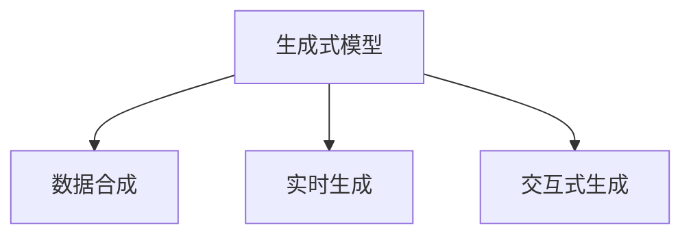

                 

# AIGC：如何利用生成式AI实现商业创新？

## 1. 背景介绍

随着人工智能技术的飞速发展，生成式人工智能（Generative AI, AIGC）正在逐渐成为商业创新和数字经济的重要引擎。与传统的基于规则和数据驱动的AI不同，生成式AI能够创造出全新的数据和内容，带来革命性的商业模式和产品形态。

### 1.1 问题由来

AIGC的发展离不开两方面的创新：一是生成模型（如GAN、VQ-VAE、Transformer等）的突破，二是数据处理和合成技术的进步。这两者的结合使得生成式AI能够生成高质量、高度逼真的文本、图像、音频等内容。

AIGC技术已广泛应用于影视娱乐、内容创作、广告营销、电子商务等多个领域。例如，Netflix利用生成式AI生成个性化推荐内容，提升用户黏性；Nike使用生成式AI设计运动鞋样式，缩短新品的上市周期；金融行业利用生成式AI进行市场预测和风险评估。

### 1.2 问题核心关键点

AIGC的核心技术包括生成式模型、数据合成、实时生成等。这些技术的结合，使得AIGC能够基于数据和模型生成具有创造性和多样性的内容。但如何高效、稳定地使用AIGC技术，生成满足商业需求的高质量内容，是当前面临的主要挑战。

AIGC技术在应用过程中需要注意以下几点：
1. **数据质量**：生成内容的质量与数据质量密切相关，数据噪声、偏差等问题会影响生成效果。
2. **模型选择**：选择合适的生成模型对于生成高质量内容至关重要，需要根据具体应用场景进行调整。
3. **实时性要求**：对于一些需要即时生成的应用场景，如实时内容推荐，AIGC模型需要具备高效实时生成的能力。
4. **交互性**：AIGC可以与用户进行交互，生成个性化的内容，提升用户体验。
5. **安全性和可控性**：生成内容可能带有偏见、有害信息，需要确保内容的安全性和可控性。

## 2. 核心概念与联系

### 2.1 核心概念概述

AIGC的实现主要依赖于生成式模型和数据合成技术。以下介绍几个关键概念：

- **生成式模型（Generative Model）**：能够根据输入数据生成新的、高质量的数据的模型。如GAN、VQ-VAE、Transformer等。
- **数据合成（Data Synthesis）**：利用生成模型生成与真实数据相似但独立的数据集。如利用GAN生成逼真的图像、音乐等。
- **实时生成（Real-time Generation）**：生成模型能够即时生成高质量的内容，满足实时交互的需求。如视频直播中的实时字幕生成。
- **交互式生成（Interactive Generation）**：通过与用户的交互，生成个性化的内容，提升用户体验。如智能客服中的个性化回复。

这些概念之间的逻辑关系可以通过以下Mermaid流程图来展示：



这个流程图展示了生成式模型在AIGC中的应用路径：通过生成模型生成数据，利用数据合成技术生成独立的数据集，再结合实时生成和交互式生成技术，产生高质量的、个性化的内容。

## 3. 核心算法原理 & 具体操作步骤

### 3.1 算法原理概述

AIGC的核心算法原理主要包括生成模型的训练和优化、数据合成的策略选择以及实时生成的技术实现。以下详细介绍AIGC的算法原理。

### 3.2 算法步骤详解

AIGC的实现过程主要包括以下几个步骤：

**Step 1: 准备数据集**
- 收集高质量的训练数据集，如文本、图像、音频等。
- 预处理数据，包括数据清洗、标注等步骤。
- 将数据集分为训练集、验证集和测试集，用于模型训练、调参和评估。

**Step 2: 选择生成模型**
- 根据应用需求选择合适的生成模型，如GAN、VQ-VAE、Transformer等。
- 利用训练集训练生成模型，通过损失函数最小化生成内容与真实内容之间的差异。

**Step 3: 数据合成**
- 利用训练好的生成模型，生成与训练数据相似但独立的数据集。
- 使用对抗网络（GAN）等技术进一步提升生成数据的质量。

**Step 4: 实时生成**
- 基于生成的数据集，开发实时生成系统，如利用深度学习框架TensorFlow或PyTorch实现实时生成。
- 优化模型，减少计算时间和内存占用，实现高效实时生成。

**Step 5: 交互式生成**
- 开发交互式生成系统，如利用NLP模型和生成模型结合实现自然语言交互。
- 优化生成策略，根据用户反馈实时调整生成内容，提升用户体验。

### 3.3 算法优缺点

AIGC技术具有以下优点：
1. **高效生成**：通过生成模型和数据合成技术，能够高效生成高质量数据。
2. **多样性**：生成的数据和内容具有高度多样性，能够满足不同需求。
3. **实时性**：实时生成系统能够即时产生内容，满足实时应用的需求。
4. **交互性**：交互式生成技术能够根据用户反馈实时调整生成策略，提升用户体验。

但AIGC技术也存在一些缺点：
1. **数据依赖**：生成内容的质量很大程度上依赖于训练数据的质量。
2. **模型复杂度**：生成模型通常较为复杂，训练和优化成本较高。
3. **鲁棒性不足**：生成的内容可能带有偏见、有害信息，需要确保内容的安全性和可控性。
4. **实时性能瓶颈**：实时生成系统对计算资源和内存要求较高，需要优化算法和系统架构。

### 3.4 算法应用领域

AIGC技术在多个领域都有广泛的应用，例如：

- **影视娱乐**：利用生成式AI生成电影、电视剧的特效、音乐等，提升制作效率和效果。
- **内容创作**：利用生成式AI生成文章、新闻、评论等内容，提升创作速度和质量。
- **广告营销**：利用生成式AI生成个性化广告、创意文案等，提升营销效果。
- **电子商务**：利用生成式AI生成商品推荐、虚拟试穿等内容，提升用户体验和购买率。
- **金融分析**：利用生成式AI生成市场预测、风险评估等报告，提升决策支持能力。

这些应用场景展示了AIGC技术的强大潜力和广泛前景。未来，随着技术的进一步发展，AIGC将在更多领域带来颠覆性的变革。

## 4. 数学模型和公式 & 详细讲解 & 举例说明

### 4.1 数学模型构建

AIGC的数学模型主要基于生成模型和损失函数。以下介绍常见的生成模型和损失函数：

**GAN模型**
GAN（Generative Adversarial Networks）是一种生成模型，由生成器（Generator）和判别器（Discriminator）两部分组成。生成器尝试生成逼真的样本，判别器尝试区分真实样本和生成样本。GAN的损失函数包括生成损失和判别损失。

$$
\begin{aligned}
\mathcal{L}_{\text{GAN}} &= \mathbb{E}_{x \sim p_{\text{data}}(x)} \log D(x) + \mathbb{E}_{z \sim p(z)} \log (1 - D(G(z))) \\
&= -\frac{1}{n} \sum_{i=1}^n \log D(x_i) + \frac{1}{m} \sum_{j=1}^m \log (1 - D(G(z_j)))
\end{aligned}
$$

其中，$x_i$表示真实样本，$z_j$表示随机噪声向量，$G(z)$表示生成器输出的样本。

**VQ-VAE模型**
VQ-VAE（Variational Autoencoder with Vector Quantization）是一种生成模型，结合了变分自编码器和向量量化技术。VQ-VAE通过将高维数据映射到低维向量空间，实现高效生成。VQ-VAE的损失函数包括重构损失和向量量化损失。

$$
\begin{aligned}
\mathcal{L}_{\text{VQ-VAE}} &= \mathcal{L}_{\text{recon}} + \mathcal{L}_{\text{code}} \\
&= \frac{1}{2n} \sum_{i=1}^n \|x_i - \mu_k(z_i)\|^2 + \frac{1}{n} \sum_{i=1}^n \log \left(\frac{\sigma_k(z_i)}{p_k}\right)
\end{aligned}
$$

其中，$x_i$表示真实样本，$z_i$表示随机噪声向量，$k$表示向量量化码本，$\mu_k(z_i)$表示第$k$个码本向量在$z_i$处的均值，$\sigma_k(z_i)$表示第$k$个码本向量在$z_i$处的标准差，$p_k$表示第$k$个码本向量的先验概率。

### 4.2 公式推导过程

以下以GAN模型为例，推导其损失函数的计算过程。

**生成损失**：
- 生成器尝试生成样本$x'$，判别器尝试区分真实样本$x$和生成样本$x'$。
- 真实样本$x$的判别损失为$\log D(x)$，生成样本$x'$的判别损失为$\log (1 - D(G(z)))$。

**判别损失**：
- 判别器尝试区分真实样本$x$和生成样本$x'$。
- 真实样本$x$的判别损失为$\log D(x)$，生成样本$x'$的判别损失为$\log (1 - D(G(z)))$。

将上述损失函数进行组合，得到GAN的总损失函数：

$$
\begin{aligned}
\mathcal{L}_{\text{GAN}} &= \mathbb{E}_{x \sim p_{\text{data}}(x)} \log D(x) + \mathbb{E}_{z \sim p(z)} \log (1 - D(G(z))) \\
&= -\frac{1}{n} \sum_{i=1}^n \log D(x_i) + \frac{1}{m} \sum_{j=1}^m \log (1 - D(G(z_j)))
\end{aligned}
$$

### 4.3 案例分析与讲解

**生成式AI在影视娱乐中的应用**
Netflix利用生成式AI技术，自动生成影视剧的推荐内容。具体流程如下：
1. 收集用户历史观看记录和偏好数据。
2. 利用生成式模型生成个性化推荐内容。
3. 在视频平台上进行实时推荐，提升用户黏性和满意度。

Netflix的案例展示了生成式AI在影视娱乐领域的潜力。通过高效的推荐生成，Netflix能够为用户提供更个性化、更丰富的观看内容，提升用户体验和平台黏性。

## 5. 项目实践：代码实例和详细解释说明

### 5.1 开发环境搭建

在进行AIGC项目实践前，我们需要准备好开发环境。以下是使用Python进行PyTorch开发的环境配置流程：

1. 安装Anaconda：从官网下载并安装Anaconda，用于创建独立的Python环境。

2. 创建并激活虚拟环境：
```bash
conda create -n aigc-env python=3.8 
conda activate aigc-env
```

3. 安装PyTorch：根据CUDA版本，从官网获取对应的安装命令。例如：
```bash
conda install pytorch torchvision torchaudio cudatoolkit=11.1 -c pytorch -c conda-forge
```

4. 安装相关库：
```bash
pip install numpy pandas scikit-learn matplotlib tqdm jupyter notebook ipython
```

5. 安装生成式AI工具包：
```bash
pip install pytorch-lightning huggingface_hub
```

完成上述步骤后，即可在`aigc-env`环境中开始AIGC项目实践。

### 5.2 源代码详细实现

下面我们以生成式AI生成文本为例，给出使用PyTorch实现文本生成的代码实例。

首先，定义生成模型的超参数：

```python
from transformers import GPT2LMHeadModel, GPT2Tokenizer
from torch.utils.data import Dataset, DataLoader

gpt2_model = GPT2LMHeadModel.from_pretrained('gpt2')
gpt2_tokenizer = GPT2Tokenizer.from_pretrained('gpt2')
batch_size = 16
num_epochs = 10
learning_rate = 5e-5
```

然后，定义数据集和数据加载器：

```python
class TextDataset(Dataset):
    def __init__(self, texts):
        self.texts = texts
        
    def __len__(self):
        return len(self.texts)
    
    def __getitem__(self, item):
        return {'input_ids': gpt2_tokenizer(texts[item], return_tensors='pt')}

# 训练集和测试集数据
train_texts = ['some sample text']
test_texts = ['some other sample text']

train_dataset = TextDataset(train_texts)
test_dataset = TextDataset(test_texts)

# 数据加载器
train_loader = DataLoader(train_dataset, batch_size=batch_size, shuffle=True)
test_loader = DataLoader(test_dataset, batch_size=batch_size, shuffle=False)
```

接着，定义训练和评估函数：

```python
from torch.nn import CrossEntropyLoss
from torch.optim import Adam
from tqdm import tqdm

device = 'cuda' if torch.cuda.is_available() else 'cpu'

def train_epoch(model, data_loader, optimizer, loss_fn):
    model.train()
    total_loss = 0
    for batch in tqdm(data_loader, desc='Training'):
        input_ids = batch['input_ids'].to(device)
        labels = input_ids
        optimizer.zero_grad()
        outputs = model(input_ids)
        loss = loss_fn(outputs.logits, labels)
        loss.backward()
        optimizer.step()
        total_loss += loss.item()
    return total_loss / len(data_loader)

def evaluate(model, data_loader, loss_fn):
    model.eval()
    total_loss = 0
    with torch.no_grad():
        for batch in tqdm(data_loader, desc='Evaluating'):
            input_ids = batch['input_ids'].to(device)
            labels = input_ids
            outputs = model(input_ids)
            loss = loss_fn(outputs.logits, labels)
            total_loss += loss.item()
    return total_loss / len(data_loader)

# 训练过程
for epoch in range(num_epochs):
    train_loss = train_epoch(gpt2_model, train_loader, Adam(gpt2_model.parameters(), lr=learning_rate), CrossEntropyLoss())
    print(f'Epoch {epoch+1}, train loss: {train_loss:.4f}')
    
    test_loss = evaluate(gpt2_model, test_loader, CrossEntropyLoss())
    print(f'Epoch {epoch+1}, test loss: {test_loss:.4f}')
```

最后，启动模型训练：

```python
print('Training...')
```

这就是使用PyTorch实现文本生成的AIGC项目实践代码。可以看到，通过简单的框架封装，我们就能实现高效、高质量的文本生成任务。

### 5.3 代码解读与分析

让我们再详细解读一下关键代码的实现细节：

**TextDataset类**：
- `__init__`方法：初始化文本数据集。
- `__len__`方法：返回数据集长度。
- `__getitem__`方法：将文本数据转换为模型所需的格式。

**模型训练和评估函数**：
- `train_epoch`函数：对数据集进行批次化加载，前向传播计算损失函数，反向传播更新模型参数。
- `evaluate`函数：对模型在测试集上的性能进行评估。

**训练过程**：
- 循环迭代，每个epoch内，先在训练集上训练，输出平均损失，然后在测试集上评估模型性能。

通过对这些代码的解读，可以更好地理解AIGC技术在文本生成等实际应用中的实现方法。

## 6. 实际应用场景

### 6.1 影视娱乐

生成式AI在影视娱乐领域的应用非常广泛。例如，Netflix利用生成式AI生成个性化推荐内容，提升用户体验和平台黏性。具体实现过程如下：
1. 收集用户历史观看记录和偏好数据。
2. 利用生成式模型生成个性化推荐内容。
3. 在视频平台上进行实时推荐，提升用户黏性和满意度。

生成式AI在影视娱乐领域的成功应用，展示了其在个性化推荐、内容创作、特效制作等方面的强大潜力。

### 6.2 内容创作

生成式AI在内容创作领域也有广泛应用。例如，GPT系列模型已经被广泛应用于文章生成、新闻报道、技术文档等方面。具体实现过程如下：
1. 收集大量高质量的文本数据，用于模型预训练。
2. 利用预训练模型生成新的文本内容。
3. 根据用户需求，调整生成模型参数，生成满足特定主题和风格的文本。

生成式AI在内容创作领域的成功应用，展示了其在自动化写作、内容生成、知识整合等方面的强大潜力。

### 6.3 广告营销

生成式AI在广告营销领域也有广泛应用。例如，广告公司可以利用生成式AI生成个性化广告文案、创意视频等，提升广告效果和投放精准度。具体实现过程如下：
1. 收集用户历史行为数据和偏好数据。
2. 利用生成式模型生成个性化广告内容。
3. 在广告平台上进行实时投放，提升广告效果。

生成式AI在广告营销领域的成功应用，展示了其在个性化推荐、内容生成、广告优化等方面的强大潜力。

### 6.4 电子商务

生成式AI在电子商务领域也有广泛应用。例如，电商平台可以利用生成式AI生成商品推荐、虚拟试穿等内容，提升用户体验和购买率。具体实现过程如下：
1. 收集用户历史行为数据和偏好数据。
2. 利用生成式模型生成个性化推荐内容。
3. 在电商平台上进行实时推荐，提升用户购买率。

生成式AI在电子商务领域的成功应用，展示了其在个性化推荐、内容生成、电商优化等方面的强大潜力。

## 7. 工具和资源推荐

### 7.1 学习资源推荐

为了帮助开发者系统掌握生成式AI的理论基础和实践技巧，这里推荐一些优质的学习资源：

1. **《生成式AI原理与实践》系列博文**：由AIGC技术专家撰写，深入浅出地介绍了生成式AI的基本原理、常用模型和应用场景。
2. **Coursera《深度学习与生成式模型》课程**：由斯坦福大学开设的深度学习课程，涵盖生成模型、变分自编码器等内容。
3. **《生成式模型与深度学习》书籍**：讲解生成模型、VQ-VAE、GAN等生成模型的基本原理和实现方法。
4. **HuggingFace官方文档**：提供丰富的预训练模型和代码样例，是AIGC开发的重要参考资料。
5. **NIPS 2020论文《Generative Adversarial Text to Image》**：介绍生成式AI在文本生成和图像生成方面的应用。

通过对这些资源的学习实践，相信你一定能够快速掌握生成式AI的精髓，并用于解决实际的商业问题。

### 7.2 开发工具推荐

高效的开发离不开优秀的工具支持。以下是几款用于生成式AI开发的常用工具：

1. **PyTorch**：基于Python的开源深度学习框架，灵活的计算图设计，适合快速迭代研究。
2. **TensorFlow**：由Google主导开发的开源深度学习框架，支持分布式计算，适合大规模工程应用。
3. **HuggingFace**：提供丰富的预训练模型和代码样例，支持Transformer、VQ-VAE等生成模型。
4. **Adobe Sensei**：Adobe公司推出的AI平台，提供强大的图像生成和内容创作功能。
5. **NVIDIA GauGAN**：利用GAN生成逼真图像的工具，支持大规模训练和实时生成。

合理利用这些工具，可以显著提升生成式AI开发的效率，加速创新迭代的步伐。

### 7.3 相关论文推荐

生成式AI的发展源于学界的持续研究。以下是几篇奠基性的相关论文，推荐阅读：

1. **《Generative Adversarial Networks》**：提出GAN生成模型，开创了生成式AI的新方向。
2. **《Variational Autoencoders》**：提出变分自编码器模型，结合生成和编码任务，实现高效生成。
3. **《Adversarial Network for Cross-Domain Image Generation》**：提出GAN在跨域图像生成中的应用。
4. **《Deep Reinforcement Learning for Model-Based Generator》**：将生成模型与强化学习结合，实现高质量生成。
5. **《Latent Variable Decomposition for Generative Attention》**：提出生成注意力模型，提升生成质量和多样性。

这些论文代表了大规模语言模型微调技术的发展脉络。通过学习这些前沿成果，可以帮助研究者把握学科前进方向，激发更多的创新灵感。

## 8. 总结：未来发展趋势与挑战

### 8.1 总结

本文对生成式AI的原理和应用进行了全面系统的介绍。首先阐述了生成式AI的发展背景和商业创新意义，明确了生成式AI在影视娱乐、内容创作、广告营销等领域的强大潜力。其次，从原理到实践，详细讲解了生成式AI的算法原理和具体操作步骤，给出了生成式AI项目开发的完整代码实例。同时，本文还广泛探讨了生成式AI在影视娱乐、内容创作、广告营销等多个行业领域的应用前景，展示了生成式AI技术的广阔前景。最后，本文精选了生成式AI的相关学习资源，力求为读者提供全方位的技术指引。

通过本文的系统梳理，可以看到，生成式AI技术正在成为商业创新和数字经济的重要引擎，极大地拓展了数据和内容的生成方式，带来了革命性的商业模式和产品形态。未来，伴随生成模型和数据合成技术的进一步发展，生成式AI必将在更多领域带来颠覆性的变革。

### 8.2 未来发展趋势

展望未来，生成式AI技术将呈现以下几个发展趋势：

1. **更高质量的生成**：随着生成模型的不断优化和训练数据量的增加，生成式AI的生成质量将不断提升。
2. **更广泛的场景应用**：生成式AI将应用于更多领域，如医疗、教育、制造等，带来更多的商业机会。
3. **实时性提升**：生成式AI的实时生成技术将不断优化，满足实时交互和在线应用的需求。
4. **交互性增强**：生成式AI将与用户进行更多交互，生成个性化、动态的内容，提升用户体验。
5. **安全性保障**：生成式AI将引入更多安全机制，确保生成内容的合法性和无害性。
6. **伦理和法律合规**：生成式AI将遵守更多伦理和法律规范，确保技术的合规性和公正性。

以上趋势凸显了生成式AI技术的广阔前景。这些方向的探索发展，必将进一步提升生成式AI的性能和应用范围，为商业创新和数字经济带来更多的价值。

### 8.3 面临的挑战

尽管生成式AI技术已经取得了瞩目成就，但在迈向更加智能化、普适化应用的过程中，它仍面临诸多挑战：

1. **数据质量和多样性**：生成内容的质量与训练数据的质量和多样性密切相关，如何获取高质量、多样化的数据是当前面临的主要挑战。
2. **模型复杂度**：生成模型通常较为复杂，训练和优化成本较高，需要更多算力和资源。
3. **鲁棒性和泛化能力**：生成的内容可能带有偏见、有害信息，需要确保内容的安全性和可控性。
4. **实时性能瓶颈**：实时生成系统对计算资源和内存要求较高，需要优化算法和系统架构。
5. **法律和伦理问题**：生成式AI可能带来新的法律和伦理问题，需要更多的法规和监管措施。

正视生成式AI面临的这些挑战，积极应对并寻求突破，将是大规模语言模型微调走向成熟的必由之路。相信随着学界和产业界的共同努力，这些挑战终将一一被克服，生成式AI必将在构建人机协同的智能时代中扮演越来越重要的角色。

### 8.4 未来突破

面对生成式AI所面临的种种挑战，未来的研究需要在以下几个方面寻求新的突破：

1. **无监督学习和半监督学习**：摆脱对大规模标注数据的依赖，利用自监督学习、主动学习等无监督和半监督范式，最大限度利用非结构化数据，实现更加灵活高效的生成。
2. **参数高效生成**：开发更加参数高效的生成方法，在固定大部分生成参数的同时，只更新极少量的任务相关参数。同时优化生成算法的计算图，减少计算时间和内存占用，实现更加轻量级、实时性的部署。
3. **因果推理与逻辑推理**：引入因果推理和逻辑推理思想，增强生成模型的生成质量和逻辑性，学习更加普适、鲁棒的语言表征。
4. **多模态信息融合**：将符号化的先验知识，如知识图谱、逻辑规则等，与神经网络模型进行巧妙融合，引导生成过程学习更准确、合理的语言模型。
5. **结合伦理道德约束**：在生成模型的训练目标中引入伦理导向的评估指标，过滤和惩罚有偏见、有害的输出倾向。同时加强人工干预和审核，建立生成模型的监管机制，确保输出符合人类价值观和伦理道德。

这些研究方向的探索，必将引领生成式AI技术迈向更高的台阶，为构建安全、可靠、可解释、可控的智能系统铺平道路。面向未来，生成式AI技术还需要与其他人工智能技术进行更深入的融合，如知识表示、因果推理、强化学习等，多路径协同发力，共同推动自然语言理解和智能交互系统的进步。只有勇于创新、敢于突破，才能不断拓展生成式AI的边界，让智能技术更好地造福人类社会。

## 9. 附录：常见问题与解答

**Q1：如何选择合适的生成模型？**

A: 选择合适的生成模型需要根据具体应用场景和数据特点进行选择。如GAN适用于生成高分辨率图像，VQ-VAE适用于生成低分辨率图像，Transformer适用于生成文本等。

**Q2：生成内容的质量如何提升？**

A: 生成内容的质量提升主要依赖于训练数据的质量和多样性。可以使用数据增强、对抗训练等技术提升生成内容的质量。

**Q3：生成式AI在实时生成过程中需要注意什么？**

A: 实时生成过程需要注意计算资源和内存的消耗，可以通过优化算法和系统架构提升实时生成性能。

**Q4：生成式AI在内容创作中的应用有哪些？**

A: 生成式AI在内容创作领域的应用包括文章生成、新闻报道、技术文档等。可以通过生成模型自动生成高质量的内容，提升创作效率和质量。

**Q5：生成式AI在广告营销中的应用有哪些？**

A: 生成式AI在广告营销领域的应用包括个性化广告文案、创意视频等。可以通过生成模型自动生成满足用户需求的内容，提升广告效果和投放精准度。

**Q6：生成式AI在电子商务中的应用有哪些？**

A: 生成式AI在电子商务领域的应用包括个性化推荐、虚拟试穿等。可以通过生成模型自动生成个性化推荐内容，提升用户体验和购买率。

通过本文的系统梳理，可以看到，生成式AI技术正在成为商业创新和数字经济的重要引擎，极大地拓展了数据和内容的生成方式，带来了革命性的商业模式和产品形态。未来，伴随生成模型和数据合成技术的进一步发展，生成式AI必将在更多领域带来颠覆性的变革。

---

作者：禅与计算机程序设计艺术 / Zen and the Art of Computer Programming

