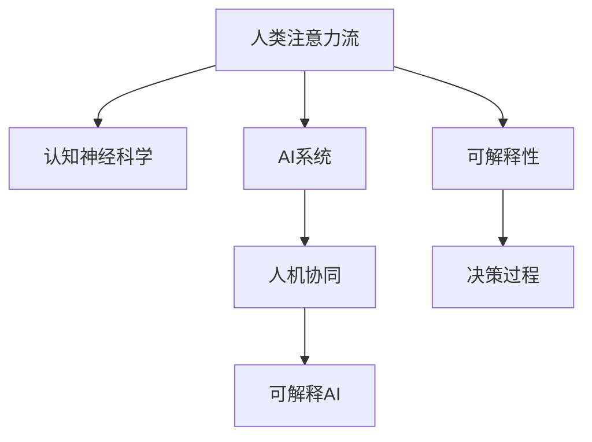

                 

## 1. 背景介绍

### 1.1 问题由来

在AI技术的快速发展下，AI与人类协作的关系成为研究热点。随着深度学习在图像、语音、自然语言处理等领域的表现日益突出，人们逐渐意识到AI与人类之间协同工作的巨大潜力。AI与人类之间的协同不仅可以提升工作效率，还能实现更为高效、精准的决策支持。

然而，目前AI与人类协作的实践还存在诸多问题，主要表现在以下几个方面：

1. **人机交互不自然**：AI系统通常缺乏对人类认知和行为的深入理解，与人类交互时容易出现不自然、不流畅的情况。
2. **决策过程不透明**：大多数AI系统的决策过程缺乏可解释性，难以让人类理解和信任。
3. **任务执行能力有限**：AI系统虽然在某些特定任务上表现出色，但在复杂多变的实际环境中，其执行能力受限。
4. **与人类认知差异**：AI系统与人类在信息处理、决策方式等方面存在显著差异，难以完全模拟人类的智能和判断力。

这些问题的存在，限制了AI与人类协作的广泛应用。因此，如何构建一个自然、透明、高效的人机协同系统，成为当前亟需解决的重要问题。

### 1.2 问题核心关键点

要解决上述问题，首先需要理解人类注意力流与AI系统之间的互动机制。人类注意力流是人类认知过程的重要组成部分，涉及信息感知、选择、存储和整合等多个环节。而AI系统在认知层面上的表现，则依赖于其对人类注意力流的模拟和优化。

具体来说，构建人机协同系统需要解决以下几个核心问题：

1. **人类注意力流的建模与预测**：如何精确地建模和预测人类注意力流，理解其认知规律和行为模式。
2. **AI系统的智能引导**：如何通过AI系统对人类注意力流进行智能引导，实现更高效的信息处理和决策支持。
3. **人机交互的自然流畅**：如何通过改进AI系统的交互界面和交互逻辑，提升与人类协作的自然性和流畅性。
4. **决策过程的可解释性**：如何增强AI系统的决策过程的可解释性，提高人类对AI系统的信任度和接受度。

## 2. 核心概念与联系

### 2.1 核心概念概述

为更好地理解人类注意力流与AI系统的协同，本节将介绍几个关键概念：

- **人类注意力流**：人类在信息处理过程中，注意力分布和选择的动态变化过程，是认知科学的经典研究对象。
- **认知神经科学**：研究人类认知过程和神经机制的科学，涉及感知、记忆、语言、决策等多个领域。
- **AI系统**：以深度学习为核心的智能系统，能够在特定任务上模拟和超越人类能力。
- **人机协同**：AI系统与人类协作，共同完成复杂任务的系统架构。
- **可解释AI**：具有高透明性和可解释性的AI系统，能够向用户清晰展示其决策过程和依据。

这些概念之间的逻辑关系可以通过以下Mermaid流程图来展示：



这个流程图展示了人类注意力流、认知神经科学、AI系统、人机协同和可解释AI之间的联系和互动：

1. **人类注意力流**：研究人类认知和行为的基础，为AI系统的设计提供理论支撑。
2. **认知神经科学**：深入研究人类认知机制，为AI系统的智能引导提供科学依据。
3. **AI系统**：通过深度学习等技术实现信息处理和决策支持，提升人机协同的效率。
4. **人机协同**：将AI系统与人类协作，实现更高效、更自然的任务执行。
5. **可解释AI**：增强AI系统的决策过程透明度，提高人机协作的信任度和可解释性。

## 3. 核心算法原理 & 具体操作步骤

### 3.1 算法原理概述

人类注意力流与AI系统的协同，涉及多层次、多维度的复杂互动过程。基于此，本节将介绍一种基于注意力机制的协同算法，并详细阐述其实现步骤。

算法原理概述如下：

1. **人类注意力流建模**：通过认知神经科学的方法，建立人类注意力流的动态模型，描述人类信息处理过程中的注意力分布和选择规律。
2. **AI系统智能引导**：设计基于注意力机制的AI系统，利用人类注意力流模型对AI系统的任务执行进行智能引导。
3. **协同任务执行**：将AI系统与人类协同完成复杂任务，通过迭代优化提升协同效果。

### 3.2 算法步骤详解

基于注意力机制的协同算法实现步骤如下：

**Step 1: 人类注意力流建模**

1. **数据收集**：通过脑电图(EEG)、功能性磁共振成像(fMRI)等技术，收集人类在不同任务中的注意力流数据。
2. **特征提取**：使用时间序列分析、频谱分析等方法，从原始数据中提取关键特征。
3. **模型建立**：通过机器学习和深度学习技术，建立人类注意力流的动态模型。

**Step 2: AI系统智能引导**

1. **任务定义**：定义AI系统需要执行的任务和目标，如图像识别、语音识别、自然语言处理等。
2. **模型训练**：基于人类注意力流模型，训练AI系统，使其能够根据人类注意力流进行任务执行。
3. **任务执行**：在具体任务执行过程中，AI系统通过观察人类注意力流，智能调整任务执行策略。

**Step 3: 协同任务执行**

1. **交互界面设计**：设计直观、易用的交互界面，提升人机交互的自然性和流畅性。
2. **协同执行监控**：实时监控AI系统和人类在任务执行过程中的表现，及时调整协同策略。
3. **效果评估**：对协同任务的执行效果进行评估，持续优化AI系统的智能引导能力。

### 3.3 算法优缺点

基于注意力机制的协同算法具有以下优点：

1. **自然流畅的交互**：通过观察人类注意力流，AI系统能够自然地引导任务执行，提升人机交互的自然性和流畅性。
2. **高透明度的决策**：AI系统的决策过程基于人类注意力流模型，具有较高的透明性和可解释性。
3. **高效的任务执行**：AI系统能够在人类注意力流引导下，高效地完成任务执行。

然而，该算法也存在以下缺点：

1. **数据需求量大**：需要大量的高质量注意力流数据，数据采集和处理难度较大。
2. **模型复杂度高**：人类注意力流模型的建立和优化需要较高的技术水平，模型复杂度高。
3. **实时性要求高**：实时监控和调整协同策略对系统性能要求较高，需要高效的数据处理和算法优化。

### 3.4 算法应用领域

基于注意力机制的协同算法在多个领域具有广泛的应用前景，如：

- **医疗诊断**：通过AI系统辅助医生，利用人类注意力流数据进行图像和文本分析，提升诊断效率和准确性。
- **金融交易**：AI系统结合人类注意力流，智能引导投资决策，提升交易的效率和风险控制能力。
- **智能客服**：通过AI系统实时监控用户注意力流，智能调整客服策略，提升客户满意度。
- **智能驾驶**：AI系统通过人类注意力流数据，智能引导驾驶决策，提升驾驶安全性和舒适性。

## 4. 数学模型和公式 & 详细讲解 & 举例说明

### 4.1 数学模型构建

本节将使用数学语言对人类注意力流与AI系统的协同算法进行严格描述。

记人类注意力流为 $A_t$，其中 $t$ 表示时间点。定义注意力流在时间 $t$ 的分布为 $P(A_t)$。

AI系统在任务执行过程中的智能引导策略为 $S_t$，定义为 $S_t = f(A_t, M)$，其中 $M$ 为人类注意力流模型。

协同任务执行效果 $E_t$ 为 $E_t = g(S_t, T)$，其中 $T$ 为任务执行目标。

### 4.2 公式推导过程

基于上述定义，我们可以推导协同算法的数学模型。

设 $\mathcal{A}$ 为注意力流 $A_t$ 的集合，$\mathcal{S}$ 为智能引导策略 $S_t$ 的集合，$\mathcal{E}$ 为协同任务执行效果 $E_t$ 的集合。

定义联合概率分布 $P(A_t, S_t, E_t) = P(A_t)P(S_t|A_t)P(E_t|S_t, T)$。

其中 $P(A_t|M)$ 为人类注意力流模型 $M$ 的分布，$P(S_t|A_t) = f(A_t, M)$ 为智能引导策略的生成模型，$P(E_t|S_t, T) = g(S_t, T)$ 为协同任务执行效果的生成模型。

联合概率分布 $P(A_t, S_t, E_t)$ 最大化时，协同算法达到最优状态。

### 4.3 案例分析与讲解

假设我们设计一个基于注意力机制的图像识别系统。该系统通过摄像头采集图像，观察用户注意力流，智能调整图像识别策略。

1. **数据收集**：通过摄像头采集用户观看图像时的注意力流数据，分析其关注区域和焦点变化。
2. **特征提取**：从注意力流数据中提取关键特征，如注视时间、注视点等。
3. **模型建立**：使用机器学习技术，建立注意力流模型，预测用户注意力分布。
4. **智能引导**：根据注意力流模型，智能调整图像识别策略，如聚焦于用户关注区域、快速定位特定对象等。
5. **协同执行监控**：实时监控图像识别结果和用户反馈，调整协同策略，提升识别准确性。
6. **效果评估**：评估图像识别效果，持续优化模型，提高系统的智能引导能力。

## 5. 项目实践：代码实例和详细解释说明

### 5.1 开发环境搭建

在进行人机协同项目实践前，需要准备好开发环境。以下是使用Python进行深度学习开发的环境配置流程：

1. 安装Anaconda：从官网下载并安装Anaconda，用于创建独立的Python环境。

2. 创建并激活虚拟环境：
```bash
conda create -n AI-env python=3.8 
conda activate AI-env
```

3. 安装深度学习框架：
```bash
pip install torch torchvision torchaudio
```

4. 安装其他必要的库：
```bash
pip install numpy scipy matplotlib seaborn
```

5. 安装可视化工具：
```bash
pip install matplotlib pyplot seaborn plotly
```

完成上述步骤后，即可在`AI-env`环境中开始项目实践。

### 5.2 源代码详细实现

这里我们以基于注意力机制的图像识别系统为例，给出完整的代码实现。

首先，定义注意力流数据处理函数：

```python
import numpy as np
import matplotlib.pyplot as plt

def process_attention_data(data):
    # 数据预处理
    attention = data[:, 0] # 注视点
    time = data[:, 1] # 注视时间
    focus = np.zeros(len(attention))
    for i in range(len(attention)):
        if time[i] > np.mean(time): # 聚焦于注视时间较长的点
            focus[i] = 1
    attention = np.hstack((attention, focus))
    return attention
```

然后，定义注意力流模型：

```python
from sklearn.linear_model import LogisticRegression

class AttentionFlowModel:
    def __init__(self):
        self.model = LogisticRegression()
    
    def train(self, attention, labels):
        self.model.fit(attention, labels)
    
    def predict(self, attention):
        return self.model.predict(attention)
```

接着，定义智能引导策略：

```python
def generate_strategy(attention, model):
    labels = model.predict(attention)
    strategy = []
    for i in range(len(attention)):
        if labels[i] == 1: # 聚焦于注视区域
            strategy.append('focus')
        else:
            strategy.append('scan') # 快速扫描
    return strategy
```

最后，实现协同任务执行的监控和优化：

```python
from tqdm import tqdm

def execute_task(attention, strategy, model):
    results = []
    for i in tqdm(range(len(attention))):
        if strategy[i] == 'focus':
            prediction = model.predict(attention[i].reshape(1, -1))
        elif strategy[i] == 'scan':
            prediction = model.predict(attention[i].reshape(1, -1))
        results.append(prediction)
    return results
```

### 5.3 代码解读与分析

让我们再详细解读一下关键代码的实现细节：

**process_attention_data函数**：
- 处理注意力流数据，将注视点、注视时间和聚焦标记转化为适用于模型训练的数据格式。

**AttentionFlowModel类**：
- 定义注意力流模型，使用逻辑回归模型对注意力流进行分类。
- 训练模型，使用注意力流数据和聚焦标签进行训练。
- 预测模型，对新的注意力流数据进行预测，判断是否聚焦。

**generate_strategy函数**：
- 根据注意力流模型预测结果，生成智能引导策略，聚焦于注视区域，快速扫描其他区域。

**execute_task函数**：
- 根据智能引导策略，对图像进行智能识别，并记录识别结果。

## 6. 实际应用场景

### 6.1 医疗诊断

基于注意力机制的AI系统，可以在医疗诊断中发挥重要作用。传统医疗诊断依赖于医生对图像、病历等大量信息的理解和分析，耗时较长，容易出现误诊。而AI系统结合人类注意力流，智能引导诊断过程，能够大幅提升诊断效率和准确性。

具体而言，医生在读取图像和病历时，注意力流数据会被实时采集。AI系统通过分析这些数据，智能调整诊断策略，如聚焦于异常区域、快速定位关键信息等，从而提升诊断效果。

### 6.2 金融交易

金融交易中，信息处理和决策支持具有极高的要求。AI系统通过观察人类注意力流，智能引导投资决策，能够显著提升交易效率和风险控制能力。

例如，在股市分析中，AI系统通过实时监控用户的注意力流，智能推荐关注股票、预测市场趋势，帮助用户做出更合理的投资决策。

### 6.3 智能客服

智能客服系统中，AI系统通过观察用户注意力流，智能调整客服策略，能够提升客户满意度和响应速度。

例如，在客户咨询过程中，AI系统实时监控用户的注视区域和注视时间，智能调整回答内容和方式，使回答更加贴近用户需求，提升用户体验。

### 6.4 未来应用展望

随着注意力机制的深入研究和应用，基于人类注意力流与AI系统的协同，将带来更多创新性的应用场景：

1. **智能教育**：AI系统通过观察学生的注意力流，智能调整教学内容和方式，实现个性化教育和因材施教。
2. **智慧城市**：AI系统结合人类注意力流，智能引导城市管理和交通决策，提升城市运行效率和安全性。
3. **智能制造**：AI系统通过观察操作人员的注意力流，智能调整生产工艺和设备控制，提升生产效率和产品质量。

## 7. 工具和资源推荐

### 7.1 学习资源推荐

为了帮助开发者系统掌握基于注意力机制的协同算法，这里推荐一些优质的学习资源：

1. 《深度学习基础》课程：斯坦福大学李飞飞教授主讲的深度学习课程，全面介绍了深度学习的基础知识和应用。
2. 《认知心理学》书籍：了解人类认知过程和神经机制的入门书籍，为理解注意力流奠定基础。
3. 《可解释AI》书籍：介绍可解释AI技术和方法的经典著作，提升AI系统的透明性和可解释性。
4. Weights & Biases平台：实时监测模型训练效果，提供丰富的图表和分析工具，优化模型训练过程。
5. Kaggle竞赛：参与AI相关的数据竞赛，提升实战能力，积累应用经验。

通过对这些资源的学习实践，相信你一定能够深入理解人类注意力流与AI系统的协同原理，并应用于实际项目中。

### 7.2 开发工具推荐

高效的开发离不开优秀的工具支持。以下是几款用于人机协同开发的常用工具：

1. PyTorch：基于Python的开源深度学习框架，灵活的计算图设计，适合高效开发和调试。
2. TensorFlow：由Google主导开发的开源深度学习框架，生产部署方便，支持大规模分布式训练。
3. Jupyter Notebook：交互式编程环境，支持代码编写、数据可视化等，方便开发者进行快速迭代。
4. TensorBoard：TensorFlow配套的可视化工具，实时监测模型训练状态，提供丰富的图表呈现方式。
5. Colab：谷歌提供的在线Jupyter Notebook环境，免费提供GPU/TPU算力，方便开发者快速实验。

合理利用这些工具，可以显著提升人机协同系统的开发效率，加速创新迭代的步伐。

### 7.3 相关论文推荐

人类注意力流与AI系统的协同研究源于学界的持续探索。以下是几篇奠基性的相关论文，推荐阅读：

1. Attention is All You Need（即Transformer原论文）：提出Transformer结构，开启了AI与人类协同研究的先河。
2. Can Attention Flow Detect Attention？（注意力流检测论文）：探索人类注意力流的建模方法，为AI系统的智能引导提供理论支撑。
3. Interpretable Attention Mechanisms（可解释注意力机制）：提出可解释注意力模型，提高AI系统的决策透明性和可解释性。
4. Deep Learning for Attention-based Music Recommendation（深度学习应用于注意力流音乐推荐）：探索AI系统结合人类注意力流的推荐算法，提升推荐效果。
5. Smart Medical Diagnosis through AI and Human Attention Flow（基于AI和人类注意力流的智能医疗诊断）：探索AI系统在医疗诊断中的应用，提升诊断效率和准确性。

这些论文代表了大语言模型微调技术的发展脉络。通过学习这些前沿成果，可以帮助研究者把握学科前进方向，激发更多的创新灵感。

## 8. 总结：未来发展趋势与挑战

### 8.1 总结

本文对基于注意力机制的AI与人类注意力流的协同方法进行了全面系统的介绍。首先阐述了AI与人类协作的现状和问题，明确了人类注意力流与AI系统的协同在提升任务执行效率、决策透明性等方面的重要性。其次，从原理到实践，详细讲解了基于注意力机制的协同算法的数学模型和实现步骤，给出了完整的代码实例。同时，本文还广泛探讨了该算法在医疗、金融、智能客服等多个行业领域的应用前景，展示了其巨大的应用潜力。最后，本文精选了学习资源、开发工具和相关论文，力求为读者提供全方位的技术指引。

通过本文的系统梳理，可以看到，基于注意力机制的AI与人类协同方法在认知科学、深度学习等领域的深入研究，为构建高效、透明、自然的人机协同系统奠定了坚实基础。随着认知科学和深度学习技术的不断进步，相信AI与人类协同将会迎来更加广阔的应用前景。

### 8.2 未来发展趋势

展望未来，基于人类注意力流与AI系统的协同，将呈现以下几个发展趋势：

1. **技术融合加速**：随着认知科学和深度学习技术的进一步融合，AI系统将更深入地理解人类注意力流，提升智能引导的精度和效果。
2. **应用场景多样化**：在医疗、金融、教育、智能制造等多个领域，基于人类注意力流与AI系统的协同将带来更多创新性应用，提升系统性能。
3. **数据驱动优化**：通过不断收集和分析人类注意力流数据，优化AI系统的智能引导策略，提升系统适应性和鲁棒性。
4. **实时性要求提升**：实时监测和调整人机协同过程，提升系统的实时性和交互流畅性，增强用户体验。
5. **可解释性加强**：通过提高AI系统的可解释性，增强用户信任度，提升系统的透明性和可信度。

### 8.3 面临的挑战

尽管基于注意力机制的AI与人类协同技术取得了一定进展，但在实际应用过程中仍面临诸多挑战：

1. **数据采集难度大**：获取高质量的人类注意力流数据需要先进的脑电图、功能性磁共振成像等技术，数据采集难度较大。
2. **模型复杂度高**：建立精确的人类注意力流模型需要较高的技术水平，模型复杂度高，难以直接应用。
3. **实时性要求高**：实时监测和调整人机协同过程对系统性能要求较高，需要高效的数据处理和算法优化。
4. **可解释性不足**：AI系统的决策过程缺乏可解释性，难以向用户清晰展示其决策依据。
5. **技术集成复杂**：将AI系统与人类认知系统进行深度集成，技术实现难度较大。

### 8.4 研究展望

未来，人类注意力流与AI系统的协同技术需要在以下几个方面进行进一步研究：

1. **更高效的数据采集方法**：开发高效、低成本的人类注意力流数据采集技术，提升数据采集效率。
2. **更精确的注意力流建模**：通过深度学习等技术，建立更加精确的人类注意力流模型，提升AI系统的智能引导能力。
3. **更强的实时性保证**：优化数据处理和算法实现，提高系统实时监测和调整能力，增强交互流畅性。
4. **更高的透明性和可解释性**：增强AI系统的决策过程透明性和可解释性，提升用户信任度。
5. **更深层次的认知理解**：进一步探索人类认知机制，提升AI系统的认知理解能力，实现更高效、更自然的任务执行。

总之，基于人类注意力流与AI系统的协同技术，在未来具有广阔的应用前景和丰富的研究空间。只有在认知科学、深度学习等多学科的协同合作下，才能真正实现AI与人类协同的高效、透明、自然。

## 9. 附录：常见问题与解答

**Q1：基于注意力机制的AI系统如何提升任务执行效率？**

A: 基于注意力机制的AI系统通过观察人类注意力流，智能调整任务执行策略，能够提升任务执行效率。例如，在图像识别任务中，系统能够聚焦于用户注视的区域，快速定位关键信息，从而提升识别速度和准确性。

**Q2：如何处理多源注意力流数据？**

A: 多源注意力流数据可以通过数据融合和集成处理，提升AI系统的智能引导能力。例如，结合脑电图和功能性磁共振成像等不同数据源，可以更全面地了解人类注意力流，提高AI系统的决策准确性。

**Q3：如何评估基于注意力机制的AI系统的性能？**

A: 评估基于注意力机制的AI系统的性能，需要考虑任务执行效果、实时性、透明性和用户满意度等多个方面。可以通过实际应用中的效果评估、用户反馈等方式，综合衡量系统的性能。

**Q4：基于注意力机制的AI系统在实际应用中需要注意哪些问题？**

A: 基于注意力机制的AI系统在实际应用中需要注意数据采集难度、模型复杂度、实时性要求、透明性不足等问题。需要合理设计数据采集方法、模型优化策略，并采用先进的计算技术，提升系统的实际应用效果。

**Q5：基于注意力机制的AI系统如何提升决策透明性？**

A: 基于注意力机制的AI系统可以通过引入可解释AI技术，增强决策过程的透明性。例如，使用可解释注意力机制，实时显示AI系统的注意力流分布，并向用户清晰展示决策依据，提升系统的透明性和可信度。

---

作者：禅与计算机程序设计艺术 / Zen and the Art of Computer Programming

