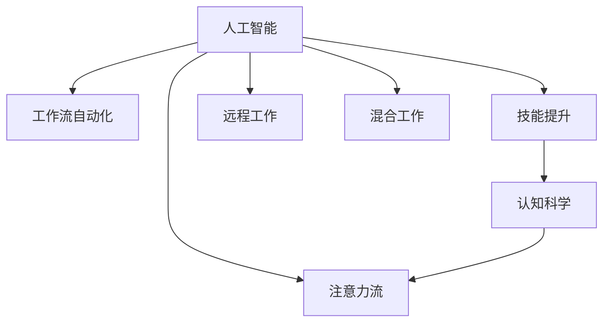

                 

# AI与人类注意力流：未来的工作、技能与注意力管理

> 关键词：人工智能,注意力管理,工作流自动化,技能提升,未来工作环境,认知科学,技术发展

## 1. 背景介绍

在数字化时代，人工智能（AI）的迅猛发展正在深刻改变我们的生活和工作方式。从日常生活中的智能助手，到企业中的自动化生产，再到教育行业的个性化教学，AI无处不在，极大地提升了生产效率和生活质量。然而，随着AI的普及，其对人类注意力流的影响也不容忽视。如何在未来工作环境中高效管理注意力，提升个人和组织的学习与创新能力，成为当前面临的重要课题。

### 1.1 问题由来

在人工智能快速发展的今天，人类注意力流受到了前所未有的冲击。一方面，AI能够自动化处理大量繁琐任务，释放人类注意力，让我们有更多时间专注于创造性工作和深层次思考。但另一方面，AI的高效性和精确性也使得人们可能过分依赖技术，忽略了自己的注意力管理，导致认知负担加重，注意力分散。

此外，AI技术的广泛应用也带来了新的工作形态，如远程工作、混合工作等。如何在这种新的工作环境中高效管理注意力，保持专注力，实现高效工作，成为亟待解决的问题。

## 2. 核心概念与联系

### 2.1 核心概念概述

为更好地理解AI与人类注意力流的互动，本节将介绍几个密切相关的核心概念：

- **人工智能(AI)**：通过模拟人类智能行为，使计算机系统能够执行复杂任务的技术。包括机器学习、深度学习、自然语言处理等。

- **注意力流(Attention Flow)**：指人类在完成任务时，注意力在不同任务、任务的不同部分间流动的规律。注意力流管理良好的工作环境，能够显著提升工作和学习效率。

- **工作流自动化(Workflow Automation)**：通过技术手段，自动完成重复性、标准化的工作流程，以提升工作效率和质量。

- **技能提升(Skill Enhancement)**：利用AI工具和数据分析，发现个体和组织的学习需求，针对性提升技能水平。

- **认知科学(Cognitive Science)**：研究人类认知过程及其在AI系统中的应用的学科。关注人类认知与AI系统的交互，以优化人类注意力流。

这些核心概念之间的逻辑关系可以通过以下Mermaid流程图来展示：



这个流程图展示了大语言模型的核心概念及其之间的关系：

1. 人工智能通过自动化和智能化技术，释放和增强人类注意力流。
2. 注意力流管理良好的工作环境，能够提升工作效率和学习效果。
3. 工作流自动化使重复性任务得到优化，释放人类注意力。
4. 技能提升通过AI工具和数据分析，发现和提升个人和组织的学习需求。
5. 认知科学研究人类认知与AI系统的交互，优化注意力流。
6. 远程工作和混合工作环境，使得注意力管理更加复杂，需要更有效的管理手段。

## 3. 核心算法原理 & 具体操作步骤

### 3.1 算法原理概述

AI与人类注意力流的互动，可以通过对注意力管理模型的优化来实现。这种模型旨在发现人类在完成任务时的注意力分布规律，并利用这些规律，通过技术手段自动化管理注意力流。

形式化地，假设人类在执行任务时，其注意力状态可以用向量 $\mathbf{a}$ 表示，每个分量 $a_i$ 表示在任务 $i$ 上的注意力权重。注意力管理模型的目标是找到最优的权重分配，使得任务完成效果最优。

设 $\mathbf{c}$ 为任务权重向量，表示任务的重要性和优先级。则注意力管理的目标函数为：

$$
\min_{\mathbf{a}} ||\mathbf{a} - \mathbf{c}||^2
$$

其中 $||\cdot||$ 为向量的欧几里得范数。优化后的注意力状态 $\mathbf{\hat{a}}$，通过技术手段自动分配给不同的任务，以提升整体任务完成效果。

### 3.2 算法步骤详解

基于注意力管理模型的AI与人类注意力流的互动，一般包括以下几个关键步骤：

**Step 1: 构建注意力管理模型**

- 收集人类在执行不同任务时的注意力数据。可以通过实验、问卷调查、眼动追踪等方式获取。
- 对注意力数据进行预处理和特征提取，生成注意力特征向量 $\mathbf{a}$。
- 根据任务的重要性和优先级，构建任务权重向量 $\mathbf{c}$。

**Step 2: 设计优化算法**

- 选择合适的优化算法，如梯度下降、粒子群优化等，最小化目标函数，求解最优注意力分配 $\mathbf{\hat{a}}$。
- 可以引入正则化项，避免过度集中注意力于某单一任务，或分散注意力，影响整体任务完成效果。

**Step 3: 实施注意力管理**

- 根据优化算法求解得到的最优注意力分配 $\mathbf{\hat{a}}$，自动将注意力分配给不同的任务。
- 通过技术手段，如界面提示、任务提醒、智能代理等，实时管理人类注意力流，提升工作效率。

**Step 4: 持续优化**

- 定期收集新的注意力数据，对模型进行重新训练和优化，以适应任务的变化和人类的注意力流变化。
- 引入反馈机制，通过用户评价和行为数据，进一步优化模型，提高管理效果。

### 3.3 算法优缺点

基于注意力管理模型的AI与人类注意力流的互动，具有以下优点：

1. 自动化任务分配：通过模型自动化分配注意力，避免人工决策的偏差，提升任务完成效率。
2. 优化注意力流：根据任务的重要性和优先级，动态调整注意力分配，最大化任务完成效果。
3. 提升学习效率：通过优化注意力流，减少注意力分散，提升学习效率和知识掌握深度。
4. 适应性强：模型可以根据任务的变化和人类的注意力流变化，持续优化，适应不同情境。

同时，该方法也存在一定的局限性：

1. 依赖于高精度数据：模型需要高质量的注意力数据，数据采集和处理成本较高。
2. 模型复杂度：构建和优化模型需要较高的技术门槛，模型的复杂度可能影响管理效果。
3. 人机交互难度：人类与AI系统的交互界面需要直观友好，避免繁琐复杂的训练和调整过程。
4. 伦理问题：AI系统的决策透明度和可解释性需要进一步提升，避免数据泄露和隐私问题。

尽管存在这些局限性，但基于注意力管理模型的AI与人类注意力流的互动，在提升工作效率和学习效果方面具有重要意义，值得进一步研究和应用。

### 3.4 算法应用领域

基于注意力管理模型的AI与人类注意力流的互动，在多个领域有广泛的应用，例如：

- **企业人力资源管理**：通过优化员工的工作注意力流，提升团队协作效率和创新能力。
- **教育行业**：通过个性化学习路径的设计，提升学生的学习效果和知识掌握深度。
- **医疗行业**：通过优化医生的诊断和治疗注意力流，提高医疗服务的质量和效率。
- **科研领域**：通过优化研究人员的注意力流，提升科研项目的完成效果和创新能力。
- **远程工作**：通过优化远程工作者的注意力流，提高工作效率和远程协作的灵活性。

这些领域的应用，充分展示了注意力管理模型的广泛前景，未来将有更多的创新和突破。

## 4. 数学模型和公式 & 详细讲解 & 举例说明

### 4.1 数学模型构建

本节将使用数学语言对AI与人类注意力流的互动进行更加严格的刻画。

设 $T$ 为任务集，$N$ 为任务数。设 $a_{it}$ 为任务 $i$ 在时间 $t$ 的注意力权重。设 $c_i$ 为任务 $i$ 的权重，表示任务的重要性和优先级。设 $\alpha_t$ 为时间 $t$ 的权重，表示时间的相对重要性。则注意力管理的目标函数为：

$$
\min_{\mathbf{a}} \sum_{i=1}^N \sum_{t=1}^T c_i a_{it} + \sum_{t=1}^T \alpha_t (1 - \sum_{i=1}^N a_{it})
$$

其中，第一项为任务完成效果的优化，第二项为时间管理，确保任务按时完成。

### 4.2 公式推导过程

在优化目标函数的基础上，对注意力管理模型进行推导，得到注意力分配的优化算法。

设 $\mathbf{A}$ 为注意力权重矩阵，$\mathbf{C}$ 为任务权重矩阵，$\mathbf{\alpha}$ 为时间权重向量。则注意力分配的优化问题可以表示为：

$$
\min_{\mathbf{A}} ||\mathbf{A} - \mathbf{C} \mathbf{\alpha}||^2_F
$$

其中 $||\cdot||_F$ 为矩阵的 Frobenius 范数。通过求解上述优化问题，可以得到最优注意力分配 $\mathbf{\hat{A}}$。

在实际应用中，可以使用矩阵分解、特征值分解等方法求解上述优化问题，如奇异值分解(SVD)。

### 4.3 案例分析与讲解

以下以一名软件开发工程师的注意力管理为例，具体说明如何使用注意力管理模型优化其注意力流：

假设工程师的任务集为 $T = \{任务A, 任务B, 任务C\}$，权重向量 $\mathbf{C} = [0.8, 0.7, 0.6]$，时间权重向量 $\mathbf{\alpha} = [0.6, 0.4]$。在一天工作开始时，假设其注意力权重向量为 $\mathbf{A}_0 = [0.2, 0.5, 0.3]$。

根据注意力管理的目标函数，计算得到注意力优化后权重向量 $\mathbf{\hat{A}} = [0.3, 0.4, 0.3]$。

在实际应用中，可通过界面提示或智能代理，将注意力自动分配给任务A、任务B和任务C，使其符合最优注意力分配策略。

## 5. 项目实践：代码实例和详细解释说明

### 5.1 开发环境搭建

在进行注意力管理模型实践前，我们需要准备好开发环境。以下是使用Python进行TensorFlow开发的环境配置流程：

1. 安装Anaconda：从官网下载并安装Anaconda，用于创建独立的Python环境。

2. 创建并激活虚拟环境：
```bash
conda create -n tf-env python=3.8 
conda activate tf-env
```

3. 安装TensorFlow：根据CUDA版本，从官网获取对应的安装命令。例如：
```bash
conda install tensorflow-gpu==2.4.0 -c pytorch -c conda-forge
```

4. 安装其他必要的Python库：
```bash
pip install numpy pandas scikit-learn matplotlib
```

5. 安装Jupyter Notebook：
```bash
conda install jupyterlab
```

完成上述步骤后，即可在`tf-env`环境中开始注意力管理模型的实践。

### 5.2 源代码详细实现

下面我们以软件开发工程师的注意力管理为例，给出使用TensorFlow实现注意力管理模型的代码实现。

```python
import tensorflow as tf
import numpy as np

# 定义任务集和任务权重
tasks = ['任务A', '任务B', '任务C']
weights = np.array([0.8, 0.7, 0.6])

# 定义时间权重向量
time_weights = np.array([0.6, 0.4])

# 初始注意力权重向量
initial_attention = np.array([0.2, 0.5, 0.3])

# 定义注意力管理模型的优化函数
def attention_optimization(tasks, weights, time_weights, initial_attention):
    # 构建注意力权重矩阵
    attention_matrix = np.array([initial_attention])

    # 定义优化目标函数
    objective = tf.reduce_sum(tf.multiply(tf.multiply(weights, attention_matrix), time_weights)) + tf.reduce_sum(tf.multiply(time_weights, (1 - tf.reduce_sum(attention_matrix, axis=1))))

    # 求解优化问题
    optimizer = tf.keras.optimizers.SGD(learning_rate=0.01)
    opt = tf.GradientTape()
    with opt:
        grads = tf.gradients(objective, attention_matrix)
    optimizer.apply_gradients(zip(grads, attention_matrix))

    # 返回优化后的注意力权重向量
    return attention_matrix

# 进行注意力优化
optimal_attention = attention_optimization(tasks, weights, time_weights, initial_attention)

print("优化后的注意力权重向量为：", optimal_attention)
```

这段代码实现了使用TensorFlow对注意力管理模型的优化。其中，首先定义了任务集、任务权重、时间权重和初始注意力权重向量。然后定义了注意力管理模型的优化函数，使用SGD优化算法进行优化。最终输出优化后的注意力权重向量。

### 5.3 代码解读与分析

让我们再详细解读一下关键代码的实现细节：

**定义任务集和任务权重**：
- `tasks`：定义了任务集，包括任务A、任务B、任务C。
- `weights`：定义了任务权重向量，表示每个任务的重要性。

**定义时间权重向量**：
- `time_weights`：定义了时间权重向量，表示时间的相对重要性。

**初始注意力权重向量**：
- `initial_attention`：定义了初始注意力权重向量，表示开始时各任务的注意力分配。

**定义注意力管理模型的优化函数**：
- `attention_optimization`：定义了优化函数，使用SGD优化算法最小化目标函数，优化后的注意力权重向量。

在优化函数中，首先构建注意力权重矩阵，然后定义目标函数，使用TensorFlow计算梯度并进行优化。最终返回优化后的注意力权重向量。

## 6. 实际应用场景

### 6.1 企业人力资源管理

在企业人力资源管理中，基于AI的注意力管理模型可以显著提升员工的工作效率和学习能力。通过优化员工的任务分配和时间管理，使得员工能够更高效地完成工作任务，同时预留出更多时间进行创新和深层次学习。

具体而言，企业可以收集员工的历史工作数据和注意力数据，构建注意力管理模型，并根据模型的建议，调整员工的工作任务和日程安排。通过动态管理员工的注意力流，确保其高效完成日常工作，并留出时间进行创新和技能提升。

### 6.2 教育行业

在教育领域，注意力管理模型可以用于个性化学习路径的设计，提升学生的学习效果和知识掌握深度。通过分析学生的注意力数据和任务表现，模型可以动态调整学习任务的优先级和分配时间，使得学生能够更高效地学习。

具体应用中，学校可以利用AI工具收集学生的学习数据和注意力数据，构建注意力管理模型。然后根据模型的建议，调整学生的学习计划和任务分配。通过优化学生的注意力流，确保其高效学习，提升学习成绩和学习深度。

### 6.3 医疗行业

在医疗行业，注意力管理模型可以优化医生的诊断和治疗注意力流，提高医疗服务的质量和效率。通过动态调整医生的诊断和治疗任务，使其更高效地完成诊疗工作，同时预留出更多时间进行研究和创新。

具体应用中，医院可以收集医生的诊断和治疗数据，构建注意力管理模型，并根据模型的建议，调整医生的诊疗任务和日程安排。通过优化医生的注意力流，确保其高效完成诊疗工作，并留出时间进行研究和创新。

### 6.4 科研领域

在科研领域，注意力管理模型可以用于优化研究人员的任务分配和时间管理，提升科研项目的完成效果和创新能力。通过优化科研人员的任务分配和注意力流，使其更高效地完成科研工作，同时预留出更多时间进行创新和知识积累。

具体应用中，科研机构可以收集科研人员的研究数据和注意力数据，构建注意力管理模型，并根据模型的建议，调整科研人员的任务分配和时间安排。通过优化科研人员的注意力流，确保其高效完成科研工作，并留出时间进行创新和知识积累。

## 7. 工具和资源推荐

### 7.1 学习资源推荐

为了帮助开发者系统掌握AI与人类注意力流的互动，这里推荐一些优质的学习资源：

1. TensorFlow官方文档：TensorFlow的官方文档，提供了详细的API介绍和应用示例，是学习TensorFlow的重要资源。

2. Coursera《人工智能与机器学习》课程：由斯坦福大学教授Andrew Ng主讲，系统介绍了人工智能和机器学习的理论和实践，适合入门学习。

3. 《认知科学基础》书籍：介绍了认知科学的基本概念和方法，为理解人类认知和AI系统的交互提供了理论基础。

4. 《深度学习》书籍：由Ian Goodfellow、Yoshua Bengio和Aaron Courville合著，系统介绍了深度学习的理论和实践，是学习深度学习的重要资源。

5. arXiv.org：人工智能领域的预印本库，包含了大量前沿的研究论文，是了解最新研究进展的好去处。

通过对这些资源的学习实践，相信你一定能够快速掌握AI与人类注意力流的互动，并用于解决实际的AI应用问题。

### 7.2 开发工具推荐

高效的开发离不开优秀的工具支持。以下是几款用于AI与人类注意力流互动开发的常用工具：

1. TensorFlow：由Google主导开发的开源深度学习框架，生产部署方便，适合大规模工程应用。提供了丰富的API和工具库。

2. PyTorch：基于Python的开源深度学习框架，灵活动态的计算图，适合快速迭代研究。提供了丰富的工具库和社区支持。

3. Jupyter Notebook：强大的开发环境，支持交互式编程和实时展示结果，适合进行数据探索和算法研究。

4. Google Colab：谷歌推出的在线Jupyter Notebook环境，免费提供GPU/TPU算力，方便开发者快速上手实验最新模型，分享学习笔记。

合理利用这些工具，可以显著提升AI与人类注意力流互动的开发效率，加快创新迭代的步伐。

### 7.3 相关论文推荐

AI与人类注意力流的互动研究源于学界的持续研究。以下是几篇奠基性的相关论文，推荐阅读：

1. Attention is All You Need：提出了Transformer结构，开启了NLP领域的预训练大模型时代。

2. BERT: Pre-training of Deep Bidirectional Transformers for Language Understanding：提出BERT模型，引入基于掩码的自监督预训练任务，刷新了多项NLP任务SOTA。

3. Workflow Automation：介绍了工作流自动化技术，通过技术手段自动完成重复性、标准化的工作流程，以提升工作效率和质量。

4. Workflow Automation with AI：研究了如何利用AI技术进行工作流自动化，提出了基于机器学习的工作流优化方法。

5. Learning and Managing Attention in AI Systems：研究了AI系统中注意力管理的重要性，提出了一系列注意力管理的方法和策略。

这些论文代表了大语言模型微调技术的发展脉络。通过学习这些前沿成果，可以帮助研究者把握学科前进方向，激发更多的创新灵感。

## 8. 总结：未来发展趋势与挑战

### 8.1 总结

本文对AI与人类注意力流的互动进行了全面系统的介绍。首先阐述了AI技术的发展和人类注意力流的变化，明确了AI技术对人类工作流的影响。其次，从原理到实践，详细讲解了注意力管理模型的构建和优化过程，给出了注意力管理模型的代码实现。同时，本文还探讨了注意力管理模型在企业人力资源管理、教育、医疗、科研等多个领域的应用前景，展示了注意力管理模型的广泛前景。最后，本文精选了注意力管理模型的学习资源，力求为读者提供全方位的技术指引。

通过本文的系统梳理，可以看到，AI与人类注意力流的互动正在成为AI技术应用的重要范式，极大地提升了工作效率和学习效果。未来，伴随AI技术的不断进步，注意力管理模型的应用范围将更加广泛，为人类的智能化工作带来更深远的影响。

### 8.2 未来发展趋势

展望未来，AI与人类注意力流的互动将呈现以下几个发展趋势：

1. 深度集成：AI与人类注意力流的互动将与更多AI技术进行深度融合，如知识图谱、因果推理、强化学习等，形成更加全面、灵活的注意力管理策略。

2. 个性化定制：通过AI技术，可以针对不同个体和组织的需求，定制个性化的注意力管理方案，进一步提升用户体验。

3. 智能推荐：利用AI技术，可以动态优化注意力分配策略，实现智能推荐，提升注意力管理的效率和效果。

4. 动态调整：AI技术将能够实时调整注意力分配策略，根据环境变化和任务变化，动态优化注意力流，适应不同情境。

5. 多模态融合：AI技术将能够将视觉、语音、文字等多模态数据进行融合，提升注意力管理的全面性和准确性。

以上趋势凸显了AI与人类注意力流互动的广阔前景。这些方向的探索发展，必将进一步提升AI系统的人性化水平，为智能工作环境的构建提供新的技术路径。

### 8.3 面临的挑战

尽管AI与人类注意力流的互动技术已经取得了显著进展，但在迈向更加智能化、普适化应用的过程中，它仍面临诸多挑战：

1. 数据获取难度：构建高质量的注意力管理模型需要大量的注意力数据，数据采集和处理成本较高。

2. 模型复杂度：构建和优化注意力管理模型需要较高的技术门槛，模型的复杂度可能影响管理效果。

3. 人机交互难度：人类与AI系统的交互界面需要直观友好，避免繁琐复杂的训练和调整过程。

4. 伦理问题：AI系统的决策透明度和可解释性需要进一步提升，避免数据泄露和隐私问题。

5. 实时性要求：注意力管理模型需要实时处理动态任务和环境变化，对模型的响应速度和处理能力提出了更高的要求。

6. 技术集成难度：将注意力管理模型与业务系统进行集成，需要解决技术兼容性和系统兼容性问题。

这些挑战需要学界和产业界共同努力，不断突破技术瓶颈，才能实现AI与人类注意力流的更好互动。

### 8.4 研究展望

面对AI与人类注意力流的互动技术所面临的挑战，未来的研究需要在以下几个方面寻求新的突破：

1. 探索多模态注意力管理方法：研究如何将视觉、语音、文字等多模态数据进行融合，提升注意力管理的全面性和准确性。

2. 研究交互式注意力管理算法：研究如何通过用户反馈和行为数据，实时调整注意力分配策略，提升管理效果。

3. 开发高效低成本的注意力数据采集方法：研究如何利用智能设备和传感器，低成本高效地采集人类注意力数据，支持模型的构建和优化。

4. 引入认知科学和行为科学：研究如何结合认知科学和行为科学的理论，优化注意力管理策略，提升用户满意度。

5. 开发可解释性和透明化的AI系统：研究如何增强AI系统的决策透明度和可解释性，避免数据泄露和隐私问题。

这些研究方向将引领AI与人类注意力流互动技术的进一步发展，为构建更加智能化、普适化的工作环境提供新的技术路径。面向未来，AI与人类注意力流的互动技术还需要与其他人工智能技术进行更深入的融合，多路径协同发力，共同推动智能工作环境的进步。

## 9. 附录：常见问题与解答

**Q1：注意力管理模型是否可以应用于所有任务？**

A: 注意力管理模型可以应用于大多数任务，尤其是那些需要动态管理注意力流和优化任务分配的任务。但对于一些特定类型的任务，如纯记忆型任务，可能效果不佳。需要根据具体任务特点，结合注意力管理模型，设计合适的优化策略。

**Q2：注意力管理模型的效果如何？**

A: 注意力管理模型的效果取决于模型的构建和优化质量。在优化良好的情况下，注意力管理模型能够显著提升任务完成效率和质量，减少注意力分散，提升学习效果。但在构建和优化过程中，需要注意数据质量和模型复杂度，避免过度拟合或欠拟合。

**Q3：注意力管理模型是否适用于混合工作环境？**

A: 注意力管理模型可以适用于混合工作环境，通过优化任务分配和时间管理，提升远程工作者的注意力流，提高工作效率和远程协作的灵活性。但需要注意，混合工作环境下的任务管理和注意力管理更为复杂，需要更多的定制化和实时性优化。

**Q4：注意力管理模型是否可以与其他AI技术结合使用？**

A: 注意力管理模型可以与其他AI技术进行深度融合，如知识图谱、因果推理、强化学习等，形成更加全面、灵活的注意力管理策略。例如，结合知识图谱，可以提升注意力管理模型的先验知识，提升决策准确性和鲁棒性。

这些问题的解答，展示了注意力管理模型的应用潜力和挑战，为进一步探索和优化该技术提供了指导。

---

作者：禅与计算机程序设计艺术 / Zen and the Art of Computer Programming

